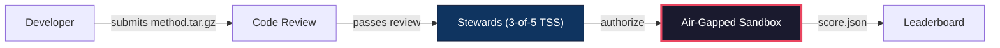
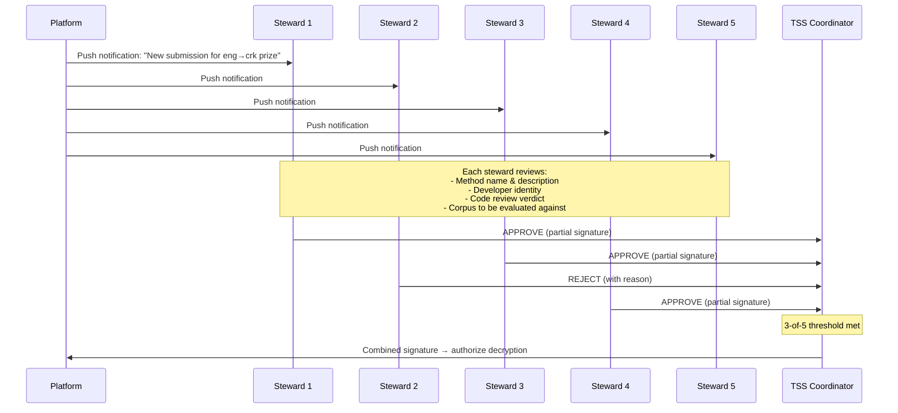
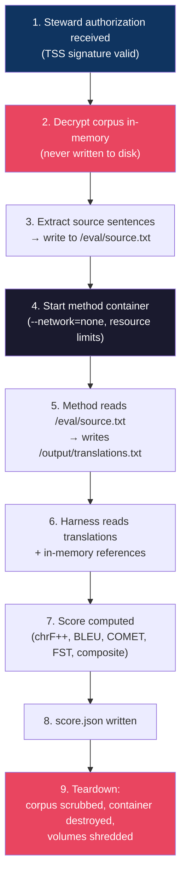

# Sandbox Evaluation Specification

> Technical specification for the air-gapped evaluation sandbox. This document defines how translation methods are submitted, reviewed, authorized, executed, and scored against cryptographically secured prize corpora — without ever exposing the secret test data to the developer, to Champollion, or to anyone outside the sandbox.
>
> **Status:** DRAFT — specification only. Zero infrastructure code exists.
>
> **OCAP Basis:** This system implements OCAP Control — the community decides who can evaluate, when, and under what conditions. Security is enforced by architecture (no network = no exfiltration), not just by policy.

Last updated: 2026-06-09

---

## 1. Overview

The sandbox is an air-gapped compute environment where translation methods run against secret prize corpora. The design principle is simple: **remove the network interface entirely**. No firewall rules to misconfigure, no allowlists to maintain, no DNS to leak through. The container literally cannot make network calls because the network stack doesn't exist inside it.

This makes data exfiltration architecturally impossible rather than policy-prohibited.

### What enters the sandbox
- The developer's method (code, weights, config) — submitted as a tarball
- The secret corpus source sentences — decrypted in-memory, never written to disk
- The secret corpus reference translations — decrypted in-memory for scoring

### What leaves the sandbox
- A score (JSON object with metric values)
- An audit log (execution metadata, resource usage, timing)
- Nothing else



---

## 2. Method Submission Format

Methods are submitted as a gzip-compressed tarball with a defined structure:

```
method-submission.tar.gz
├── method/
│   ├── translate.py          # Entry point (or any executable)
│   ├── model_weights/        # Trained weights, vocabularies, etc.
│   ├── config.json           # Method configuration
│   └── requirements.txt      # Python dependencies (if applicable)
├── manifest.json             # Submission metadata
└── Dockerfile                # Build instructions for the container
```

### 2.1 manifest.json Schema

```json
{
  "submissionVersion": "1.0.0",
  "method": {
    "name": "my-crk-translate-v3",
    "version": "3.1.0",
    "entrypoint": "method/translate.py",
    "description": "FST-gated hybrid pipeline for eng→crk"
  },
  "developer": {
    "name": "Jane Researcher",
    "email": "jane@university.edu",
    "affiliation": "University of Alberta",
    "agreementSigned": true,
    "agreementVersion": "1.0.0"
  },
  "target": {
    "corpusId": "eval-eng-crk-prize-v1",
    "languagePair": { "source": "eng", "target": "crk" }
  },
  "requirements": {
    "gpu": true,
    "gpuMemoryGB": 24,
    "ramGB": 32,
    "diskGB": 100,
    "maxRuntimeMinutes": 120
  },
  "selfHostable": true,
  "networkRequired": false,
  "thirdPartyAPIs": [],
  "trainingDataSources": [
    "EDTeKLA parallel text (CC BY-NC-SA 4.0)",
    "GiellaLT paradigm tables (AGPL-3.0+)"
  ]
}
```

### 2.2 Method API Contract

The method entry point receives source sentences via stdin (one per line) and writes translations to stdout (one per line, same order). This is the simplest possible interface — no HTTP server, no RPC, no sockets.

```
# Inside the sandbox container:
cat /eval/source.txt | python method/translate.py > /output/translations.txt
```

Exit code 0 = success. Any non-zero exit code = method failure (no score produced).

The method may read from:
- `/method/` — its own code, weights, config (read-only)
- `/eval/source.txt` — source sentences to translate (read-only)

The method may write to:
- `/output/` — translations and any debug output
- `/tmp/` — temporary scratch space

The method may NOT access:
- Any network interface (none exists)
- Any host filesystem path
- Any environment variables (sanitized)
- `/eval/reference.txt` (does not exist in the container — references are held by the harness process outside the container)

---

## 3. Automated Code Review

Before a method enters the sandbox, automated static analysis scans for potential exfiltration vectors. These checks run on the submitted tarball before any container is built.

### 3.1 Network Call Scanning

Scan all source files for patterns that indicate network access attempts:

| Pattern Category | Examples | Action |
|-----------------|----------|--------|
| Socket libraries | `import socket`, `import http`, `import urllib`, `import requests`, `import aiohttp` | BLOCK |
| Subprocess network | `subprocess.*curl`, `subprocess.*wget`, `subprocess.*nc `, `subprocess.*ncat` | BLOCK |
| DNS resolution | `socket.getaddrinfo`, `socket.gethostbyname` | BLOCK |
| Low-level network | `ctypes.*SOCK_`, raw syscall wrappers | BLOCK |
| Environment leaks | `os.environ`, `subprocess.Popen(env=` | WARN — manual review |

### 3.2 Filesystem Access Audit

Scan for attempts to access paths outside the allowed directories:

- Allowed: `/method/`, `/eval/source.txt`, `/output/`, `/tmp/`
- Blocked: `/proc/`, `/sys/`, `/dev/` (except `/dev/null`, `/dev/urandom`), `/etc/`, any absolute path outside the allowed set

### 3.3 Dockerfile Air-Gap Build Test

The Dockerfile must build successfully with `--network=none`:

```bash
docker build --network=none -t method-submission:test .
```

If the build requires downloading packages (pip, apt, conda), they must be vendored in the tarball. No network access during build or runtime.

### 3.4 Container Size Limits

| Resource | Limit | Rationale |
|----------|-------|-----------|
| Tarball size | 100 GB | Large models (LLaMA 8B = ~16GB) need room |
| Built image size | 150 GB | Includes base image + dependencies |
| `/output/` writes | 1 GB | Translations + debug output |
| `/tmp/` writes | 50 GB | Scratch space for inference |

### 3.5 Manifest Consistency Check

- `networkRequired` must be `false`
- `thirdPartyAPIs` must be empty array
- `selfHostable` must be `true`
- `agreementSigned` must be `true`
- `agreementVersion` must match current method-submission-agreement version

---

## 4. Manual Review (Prize Track)

For prize-track submissions (methods competing for prize corpora), automated review is supplemented by human code audit.

### 4.1 Review Scope

The reviewer examines:
1. **Admissibility** — Is the method genuinely self-contained? Could it run on community infrastructure without any external service?
2. **No coached API calls** — Does the method wrap a proprietary API (OpenAI, Anthropic, Google) and just format the response? This is inadmissible — the community can't own the API.
3. **No obfuscation** — Is the code readable? Are model weights in standard formats? Is there unexplained binary code?
4. **Malware scan** — Standard antivirus/malware scanning on all files
5. **Size justification** — If the submission is very large, is the size justified by model weights?

### 4.2 Review Report

```json
{
  "reviewId": "REV-2026-0042",
  "submissionId": "SUB-2026-0137",
  "reviewer": "review-team-alpha",
  "date": "2026-09-15T14:30:00Z",
  "verdict": "APPROVED",
  "admissible": true,
  "selfHostable": true,
  "findings": [],
  "notes": "Clean FST-hybrid pipeline. Model weights are fine-tuned LLaMA 3B (4.8GB). No network code detected. No obfuscation."
}
```

Verdicts: `APPROVED`, `REJECTED`, `NEEDS_REVISION`

---

## 5. Steward Authorization

No method runs against a secret corpus without explicit steward approval. This is OCAP Control in practice — the community decides, every time.

### 5.1 Authorization Flow



### 5.2 TSS Threshold Signature

- **Scheme:** 3-of-5 threshold signature (TSS) using multi-party computation (MPC)
- **Key property:** The full decryption key is NEVER assembled on any single device. Each steward holds a key share. The MPC protocol produces a valid signature from 3+ shares without any party learning the others' shares.
- **Per-submission:** Each evaluation run requires a fresh authorization. No blanket approvals. No standing permissions.
- **Refusal without justification:** Stewards may refuse authorization without providing a reason. OCAP Control means the community doesn't owe an explanation.

### 5.3 Notification Content

Each steward receives:
- Method name, version, description
- Developer name and affiliation
- Target corpus ID and language pair
- Automated code review verdict
- Manual review verdict (prize track)
- Link to review report
- APPROVE / REJECT buttons

---

## 6. Sandbox Environment

### 6.1 Container Isolation

| Property | Implementation |
|----------|---------------|
| Runtime | Docker with `--network=none` (minimum) or Firecracker microVM (preferred) |
| Network | Interfaces REMOVED, not firewalled. `--network=none` removes the network namespace entirely. |
| Filesystem | Read-only root except `/tmp` and `/output` |
| Host access | None. No volume mounts to host filesystem. |
| Capabilities | All Linux capabilities dropped except `CAP_SYS_NICE` (for GPU scheduling) |
| Seccomp | Restrictive profile: block `socket()`, `connect()`, `bind()`, `listen()`, `sendto()`, `recvfrom()` syscalls |
| GPU | Passed through via `--gpus` flag with memory limits |
| Syscall logging | auditd or seccomp-log captures all syscall attempts for post-run audit |

### 6.2 Resource Limits

| Resource | Default | Configurable |
|----------|---------|-------------|
| CPU cores | 8 | Per-corpus |
| RAM | 64 GB | Per-corpus |
| GPU | 1× A100 40GB (or equivalent) | Per-corpus |
| Disk (scratch) | 500 GB SSD | No |
| Wall-clock timeout | 120 minutes | Per-corpus |
| Output size | 1 GB | No |

### 6.3 Environment Sanitization

Before the method container starts:
- All environment variables are cleared except `PATH`, `HOME`, `TMPDIR`
- `PATH` is set to container-internal paths only
- No cloud provider metadata endpoints are reachable (no network = no `169.254.169.254`)
- `/proc/net/` is empty (no network namespace)

---

## 7. Execution Flow

This is the core sequence. Each step is designed so that the secret corpus is never written to persistent storage and never accessible to the method container.



### 7.1 Step-by-step

1. **Steward authorization.** The TSS coordinator confirms 3-of-5 steward approval. The combined signature authorizes decryption of the specific corpus identified in the submission manifest.

2. **Corpus decryption.** The encrypted corpus is decrypted into a memory-backed filesystem (`tmpfs`). The decrypted data is NEVER written to persistent storage (no SSD, no HDD, no swap). If the host crashes, the data vanishes.

3. **Source extraction.** Source sentences (the input side only) are written to `/eval/source.txt` inside the container. Reference translations remain outside the container, held by the harness process.

4. **Container start.** The method container is started with `--network=none`, resource limits, read-only root filesystem, and the method code mounted at `/method/` (read-only).

5. **Method execution.** The method reads `/eval/source.txt`, produces translations, and writes them to `/output/translations.txt`. The method has no access to reference translations, no network, and no way to communicate outside the container.

6. **Scoring.** The harness process (running OUTSIDE the container) reads the method's translations from `/output/translations.txt` and scores them against the in-memory reference translations. Scoring uses the standard metric suite: chrF++, BLEU, COMET/xCOMET, FST acceptance rate (where available), and composite score.

7. **Score output.** The score is written to `/output/score.json`:
    ```json
    {
      "submissionId": "SUB-2026-0137",
      "corpusId": "eval-eng-crk-prize-v1",
      "timestamp": "2026-09-15T16:42:00Z",
      "metrics": {
        "chrf_pp": 0.487,
        "bleu": 0.123,
        "comet": 0.724,
        "fst_acceptance_rate": 0.891,
        "composite": 0.682
      },
      "tier": "Functional",
      "runtime_seconds": 3847,
      "gpu_utilization_avg": 0.73
    }
    ```

8. **Teardown.** See §8.

---

## 8. Teardown

After scoring completes (or on timeout/failure), the teardown sequence runs:

1. **Method container destroyed.** `docker rm -f` / Firecracker VM terminated.
2. **Corpus scrubbed.** The `tmpfs` mount holding decrypted corpus data is unmounted and zeroed. `memfd` file descriptors are closed. Kernel reclaims the memory pages.
3. **Scratch volumes shredded.** `/tmp` and `/output` volumes are overwritten with random data (`shred -vfz -n 3`), then deleted. This is defense-in-depth — the data should only contain translations, not corpus material, but we shred anyway.
4. **Audit log sealed.** The execution audit log (syscall traces, resource usage, timing) is signed and archived.
5. **Score extracted.** Only `score.json` and the audit log leave the teardown process.

### Failure modes

| Failure | Action |
|---------|--------|
| Method times out | Container killed, teardown runs, no score produced |
| Method crashes (non-zero exit) | Teardown runs, no score produced, error logged |
| Method produces no output | Teardown runs, no score produced |
| Method produces malformed output | Teardown runs, scoring fails gracefully, error logged |
| Host crashes during execution | tmpfs data vanishes automatically (volatile memory), no persistent corpus exposure |

---

## 9. Score Publication

### 9.1 Developer receives
- `score.json` — aggregate metrics only
- Tier classification (Baseline/Emerging/Functional/Deployable/Fluent)
- Runtime and resource usage summary

### 9.2 Developer does NOT receive
- Source sentences from the secret corpus
- Reference translations
- Per-sentence scores or alignments
- Any data that would allow reconstructing the corpus

### 9.3 Leaderboard publication
- Scores are published to the public leaderboard by default
- Stewards may optionally gate publication (additional review before scores go public)
- The audit log is retained for dispute resolution but not published

### 9.4 Dispute resolution
- Developers may challenge scores by requesting a re-run
- Re-runs require fresh steward authorization (same 3-of-5 process)
- Audit logs from both runs are compared
- Stewards have final authority on disputes

---

## 10. Compute Requirements

### 10.1 Sandbox Host

| Component | Minimum Spec | Recommended |
|-----------|-------------|-------------|
| CPU | 8 cores (x86_64) | 16 cores |
| RAM | 64 GB | 128 GB |
| GPU | 1× A100 40GB | 1× A100 80GB |
| Storage | 500 GB NVMe SSD | 1 TB NVMe SSD |
| Network | None (air-gapped during execution) | None |
| OS | Linux 5.15+ (Ubuntu 22.04 or later) | Ubuntu 24.04 LTS |

### 10.2 Network Architecture

The sandbox host connects to the internet ONLY for:
- Receiving method submissions (before execution begins)
- Publishing scores (after execution and teardown complete)

During execution (steps 2–8), all network interfaces on the host are disabled at the OS level (`ip link set eth0 down`), not just at the container level. This is a defense-in-depth layer on top of `--network=none`.

---

## 11. Attack Surface Analysis

| Attack Vector | Without Air Gap | With Air Gap | Mitigation |
|--------------|----------------|-------------|------------|
| Encode corpus in API calls | HIGH — method calls external API with corpus data as context | IMPOSSIBLE — no network stack exists | Architecture |
| Encode corpus in HTTP requests | HIGH — POST/GET to attacker-controlled server | IMPOSSIBLE — no HTTP | Architecture |
| DNS exfiltration | MEDIUM — encode data in DNS queries | IMPOSSIBLE — no DNS resolver | Architecture |
| Timing side-channel | LOW — encode data in response timing patterns | LOW — no external observer during execution | Timeout enforcement, audit logging |
| Error message encoding | LOW — encode data in error output | LOW — `/output/` is inspectable | Sanitize output before returning to developer |
| Steganography in score | NEGLIGIBLE — encode data in floating-point precision | NEGLIGIBLE — harness computes scores, not the method | Harness is trusted code |
| Swap file persistence | MEDIUM — decrypted data written to swap | NONE — tmpfs + swapoff during execution | Disable swap on sandbox host |
| Container escape | MEDIUM — kernel exploit → host access | LOW — seccomp + dropped capabilities + Firecracker | Defense in depth |

### Key insight

The air-gap approach eliminates the entire class of network-based exfiltration attacks. The remaining attack surface (timing, container escape) is dramatically smaller and well-understood. No amount of firewall configuration achieves the same guarantee as removing the network stack entirely.

---

## 12. Key Custody

### 12.1 Key Generation Ceremony

A one-time event (~30 minutes) where the TSS key shares are generated:

1. Five stewards gather (in person or secure video)
2. Each steward generates their key share on their own device using the MPC protocol
3. The protocol produces: 5 individual key shares + 1 combined public key
4. The full private key is NEVER assembled — it exists only as distributed shares
5. Each steward encrypts their share with a personal passphrase and stores it on their device
6. Sealed backup envelopes (physical) are created for disaster recovery — one share per envelope, stored in separate secure locations

### 12.2 Day-to-Day Operations

- Stewards receive push notifications on their mobile devices when authorization is requested
- They review the submission details and tap APPROVE or REJECT
- Their device computes a partial signature using their stored key share
- The partial signature is sent to the TSS coordinator
- When 3+ partial signatures are collected, the coordinator combines them into a valid decryption authorization
- No steward's device ever sends its raw key share — only partial signatures

### 12.3 Key Rotation

- **Annual refresh:** Key shares are reshared annually. The MPC resharing protocol generates new shares for the same logical key without assembling the key.
- **Steward replacement:** If a steward steps down, a resharing ceremony produces new shares for the replacement steward. Old shares are invalidated.
- **Emergency rotation:** If a compromise is suspected, emergency resharing can be triggered by any 3 stewards.

### 12.4 Disaster Recovery

| Scenario | Recovery |
|----------|----------|
| 1 steward loses their device | Remaining 4 stewards can still authorize (3-of-5). Lost share is invalidated via resharing. |
| 2 stewards lose their devices | Remaining 3 stewards can still authorize. Resharing produces new shares. |
| 3+ stewards lose their devices | Open sealed backup envelopes to recover shares. Requires physical access to multiple secure locations. |
| All digital shares lost | Sealed backup envelopes are the last resort. If those are also lost, the corpus must be re-encrypted with new keys. |

### 12.5 Technology Options

| Option | Maturity | Notes |
|--------|----------|-------|
| Lit Protocol (TSS) | Production | JavaScript SDK, decentralized node network |
| Threshold ECDSA (tss-lib) | Production | Go library, used by Binance/THORChain |
| FROST (Schnorr threshold) | Emerging | Zcash Foundation implementation, newer but cleaner protocol |
| Shamir Secret Sharing + reconstruct | Mature | Simpler but requires key assembly — violates our "never assemble" requirement |

**Recommendation:** Threshold ECDSA (tss-lib) or FROST, depending on language ecosystem. Shamir is explicitly rejected because it requires assembling the full key on one device, which is the single point of failure we're eliminating.

---

## 13. OCAP® Alignment

| Spec Section | OCAP Principle | How It's Implemented |
|-------------|---------------|---------------------|
| §2 Submission Format | **Possession** | Method must be self-contained — community can hold and run it |
| §3 Code Review | **Control** | Community-authorized reviewers inspect what enters the sandbox |
| §4 Manual Review | **Control** | Human judgment on admissibility — no automated bypass |
| §5 Steward Authorization | **Control** | 3-of-5 community representatives must explicitly approve each run |
| §6 Sandbox Environment | **Possession** | Corpus data never leaves community-controlled infrastructure |
| §7 Execution Flow | **Possession + Control** | Data decrypted in-memory only, method has no access to references |
| §8 Teardown | **Possession** | Cryptographic scrubbing ensures no residual data |
| §9 Score Publication | **Access** | Community controls what information is released and when |
| §12 Key Custody | **Ownership** | Community holds the encryption keys — no third party can access the data |

### CARE Alignment

| CARE Principle | Implementation |
|---------------|---------------|
| **Collective Benefit** | Prize methods transfer to community (method-submission-agreement.md §4). 90/10 revenue split. |
| **Authority to Control** | Steward authorization is per-submission. Community can refuse without justification. |
| **Responsibility** | Code review and manual audit ensure methods are safe to execute. |
| **Ethics** | Air-gap architecture prevents even accidental data exposure. Teardown is thorough. |

---

## References

- [Benchmark Specification §8](../website/docs/specifications/benchmark-spec.md) — sovereignty framework
- [Method Submission Agreement](../legal/method-submission-agreement.md) — prize transfer terms
- [Governance & OCAP Working Document](../../docs/governance-and-ocap.md) — governance partnership status
- [DATA-SOVEREIGNTY.md](../../cli/shared/DATA-SOVEREIGNTY.md) — field-level sovereignty reference
- [Corpora Card Schema](../../cli/shared/schemas/corpora-card.schema.json) — secretTest, stewardship, submission fields
