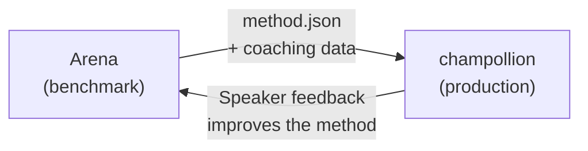

# Deploy to Production

You proved it works in the Arena. Now deploy it.

The Arena is for R&D — building, benchmarking, and comparing translation methods. **Production deployment** happens through [champollion](https://champollion.dev), the developer-facing translation CLI. They connect through a shared plugin format.



---

## The Deployment Path

### 1. Export Your Method as a Plugin

Create a `method.json` manifest that packages your benchmark results:

```json
{
  "name": "crk-coached-v3",
  "type": "llm-coached",
  "version": "3.0.0",
  "description": "Coached LLM translation for Plains Cree",
  "locales": ["crk"],
  "config": {
    "model": "google/gemini-2.5-flash",
    "temperature": 0.3
  },
  "benchmarks": {
    "crk": {
      "composite_score": 0.67,
      "fst_acceptance": 0.82,
      "corpus_size": 150
    }
  }
}
```

Include any coaching data (grammar rules, dictionaries) alongside the manifest.

### 2. Install in Champollion

```bash
champollion plugin install ./my-method-plugin/
```

### 3. Configure Your Pair

```json title="champollion.config.json"
{
  "pairs": {
    "en-crk": { "method": "plugin", "plugin": "crk-coached-v3" }
  }
}
```

### 4. Translate Real Content

```bash
npx champollion sync
```

Your benchmarked method is now producing real translations in production.

---

## For Indigenous Languages

Methods serving Indigenous language communities require **community consent** before production deployment. The OCAP principles (Ownership, Control, Access, Possession) govern how translation methods are developed, evaluated, and deployed.

A method that reaches Deployable tier (0.70+) does not automatically deploy — it deploys **if and when** the language community's governance body gives consent.

See [Data Sovereignty](/docs/sovereignty/data-sovereignty) and [Ownership Transfer](/docs/sovereignty/ownership-transfer) for the full governance framework.

---

## See Also

- [The Eval Harness Bridge](https://champollion.dev/docs/guides/bridge) — detailed walkthrough of the Arena→champollion pipeline
- [Plugin Specification](https://champollion.dev/docs/reference/plugin-spec) — the method.json manifest format
- [champollion Agent Guide](https://champollion.dev/docs/guides/agent-guide) — how to use champollion for translation
