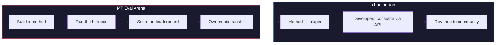

# The MT Eval Arena

> **Executive Summary.** The MT Eval Arena is an open benchmarking platform for machine translation methods, with a focus on languages where commercial MT either doesn't exist or hasn't been independently verified. It provides standardized evaluation, a public leaderboard, and a deployment bridge to production via champollion. For Indigenous languages, proven methods transfer ownership to the community.

An open proving ground for machine translation methods — especially for languages where commercial MT either doesn't exist or hasn't been independently verified.

Build a method. Benchmark it. Prove it works. If it wins, it gets deployed.

---

## The Problem

Google Translate supports ~130 languages. Meta's NLLB-200 covers ~200, and OMT-1600 (March 2026) claims 1,600. There are over 7,000 spoken on Earth. For the ~1,300 languages at OMT-1600's lowest resource tiers, the model weights are not available, quality is below usable thresholds, and evaluation used Bible-domain text with standard machine metrics — no morphological validation, no independent testing, no community governance. For the remaining ~5,400 languages, no pretrained model produces any output at all.

Big Tech is now investing in LRL coverage — but coverage without independent quality verification, morphological validation, or community governance is coverage without trust. The speakers who need translation tools the most are the same communities least likely to have them built.

**The Arena exists to change that.** It provides the infrastructure to develop, evaluate, and deploy translation methods for any language — with reproducible scoring, open submission, and community governance over who controls the results.

---

## How It Works

1. **You build a translation method** — coached LLM, fine-tuned model, FST-gated pipeline, or anything else that produces translations.
2. **The harness benchmarks it** — standardized metrics (chrF++, exact match, FST acceptance), fingerprinted to a specific Git commit.
3. **Results appear on the leaderboard** — every submission is reproducible and comparable.
4. **If it wins, ownership transfers** — for Indigenous languages, the winning method's code transfers to the community governance organization.
5. **The method deploys to production** — via [champollion](https://champollion.dev), the developer-facing API. Revenue flows back to the community.

**Prove it here. Deploy it there.**

---

## Who This Is For

| You are... | The Arena gives you... |
|---|---|
| **ML engineer / researcher** | Standardized benchmarks, reproducible scoring, a leaderboard to compete on |
| **Linguist** | A framework to turn grammar rules and dictionaries into testable methods |
| **Language community member** | Governance over how your language's methods are developed and deployed |
| **Funder / grant reviewer** | Transparent, reproducible metrics to evaluate translation research proposals |
| **Student** | An open challenge with real impact — build a method, submit your scores |

---

## Current Benchmarks

### EDTeKLA Development Set v1
- **Language pair:** English → Plains Cree (SRO)
- **Entries:** 548 curated pairs (486 textbook + 62 gold standard)
- **License:** CC BY-NC-SA 4.0
- **Source:** [EdTeKLA research group](https://spaces.facsci.ualberta.ca/edtekla/), University of Alberta

### FLORES+ Devtest
- **Language pairs:** English → 39 languages
- **Entries:** 1,012 sentences per language
- **License:** CC BY-SA 4.0
- **Source:** [OLDI](https://huggingface.co/datasets/openlanguagedata/flores_plus)

---

## The One Rule

:::danger Do not train on evaluation data
Methods exposed to the benchmark dataset — as training data, few-shot examples, dictionary entries, or prompt material — will be **disqualified**. Fine-tune on whatever you want. Just not on the test set.
:::

---

## Next Steps

- **[Submit a Method](/docs/getting-started/submit-a-method)** — how to submit your first benchmark run
- **[Benchmark Specification](/docs/specifications/benchmark)** — the full experiment protocol
- **[Leaderboard Rules](/docs/leaderboard/rules)** — submission criteria and anti-gaming policies
- **[Data Sovereignty](/docs/sovereignty/data-sovereignty)** — OCAP, CARE, and why ownership transfer matters
- **[The Economic Model](/docs/sovereignty/economic-model)** — how Arena scores become community revenue

**[→ View the Leaderboard](https://champollion.dev/leaderboard)**
