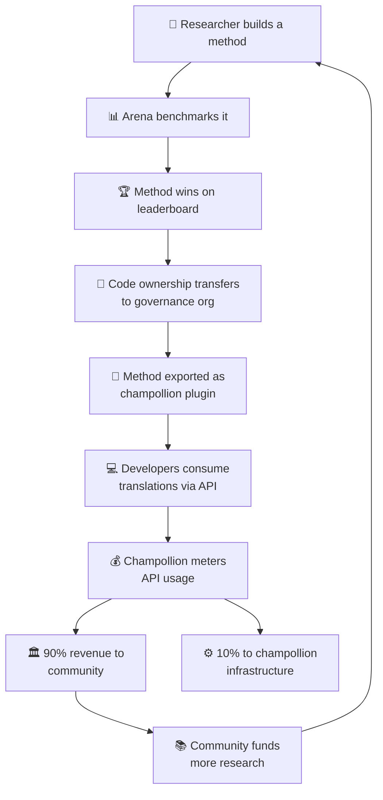

# The Economic Model

> **Executive Summary.** This page describes the economic loop connecting the Arena and champollion: research produces methods, methods deploy as plugins, API usage generates revenue, and 90% of revenue flows to the language community. Covers the flywheel mechanism, revenue splits, convenience layer, and sustainability case for funders.

The Arena and champollion form a closed economic loop. Research on the Arena produces methods. Methods deploy through champollion. Revenue from champollion flows back to the communities whose languages the methods serve.

---

## The Flywheel

Each turn of the flywheel strengthens the ecosystem:
- **More research** produces better methods
- **Better methods** attract more developers
- **More developers** generate more API revenue
- **More revenue** funds more community-led research

---

## How Revenue Flows

When a developer uses a community-owned method through the champollion API:

| Step | What Happens |
|---|---|
| Developer calls `champollion sync` or the REST API | Translations are produced by the community-owned method |
| Champollion meters the API call | Usage is tracked per-request, per-language-pair |
| Revenue is split | **90%** goes to the governance org that owns the method. **10%** covers champollion infrastructure costs. |
| Community decides allocation | Revenue funds language programs, further research, community resources — whatever the governance org decides |

### The Convenience Layer

Champollion also serves optimized configurations for common methods. If a researcher proves that Gemini 2.5 Pro with specific coaching data and temperature settings produces the best results for a language pair, that configuration is available as a pre-built preset through the champollion API. Developers don't need to replicate the research — they just call the API.

The Arena establishes the baselines. Champollion makes them accessible. Communities benefit from both.

---

## For Standard Languages

The flywheel is most impactful for Indigenous and low-resource languages, where the ownership transfer and community revenue model applies.

For standard languages (French, Japanese, Spanish, etc.), champollion offers the same API convenience without the governance layer — developers pay for metered access to pre-configured translation methods, and champollion takes an infrastructure cut.

---

## For Funders

The economic model addresses a common concern in language technology funding: **sustainability after the grant ends.**

| Traditional Model | Arena Model |
|---|---|
| Grant funds research | Grant funds research |
| Paper published | Method deployed to production |
| Grant ends, tool abandoned | API revenue sustains operations |
| Community receives nothing | Community owns the asset and earns revenue |

A single successful method creates a self-sustaining revenue stream. Funders can measure impact not just in publications, but in:
- API usage (how many developers are using the method)
- Revenue generated (how much money flows to the community)
- Quality metrics (leaderboard scores over time)
- Language coverage (how many language pairs are served)

See the [Benchmark Specification](/docs/specifications/benchmark), §10 for detailed cost models.

---

## See Also

- [Ownership Transfer](/docs/sovereignty/ownership-transfer) — the legal and technical transfer process
- [Data Sovereignty](/docs/sovereignty/data-sovereignty) — OCAP, CARE, and Te Mana Raraunga principles
- [Leaderboard Rules](/docs/leaderboard/rules) — how methods qualify for deployment
