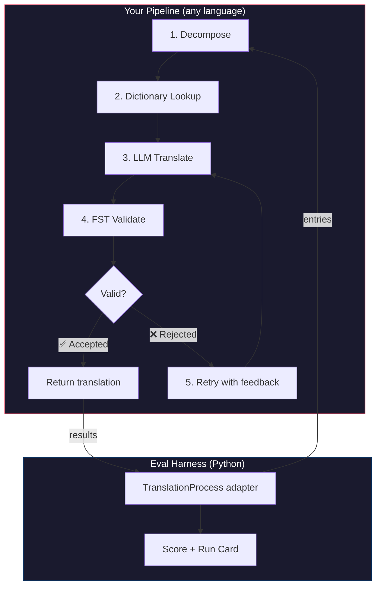
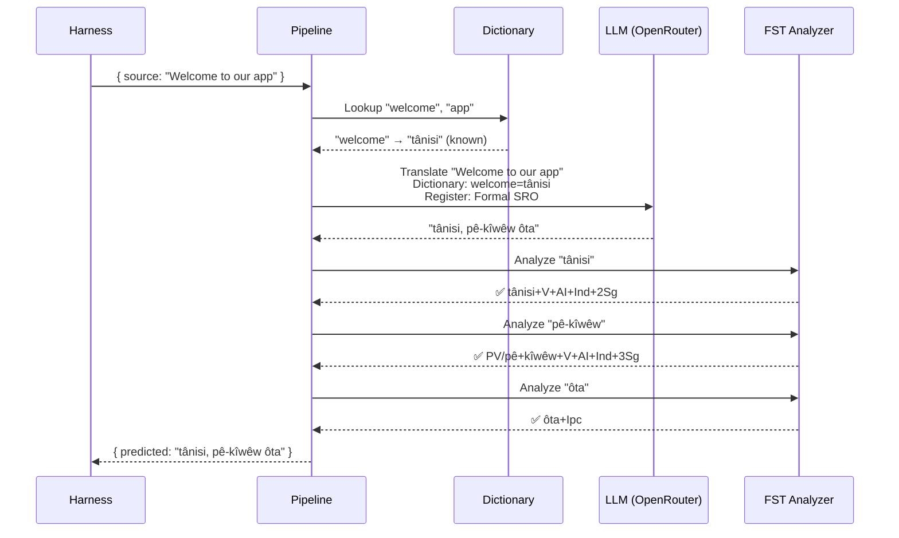
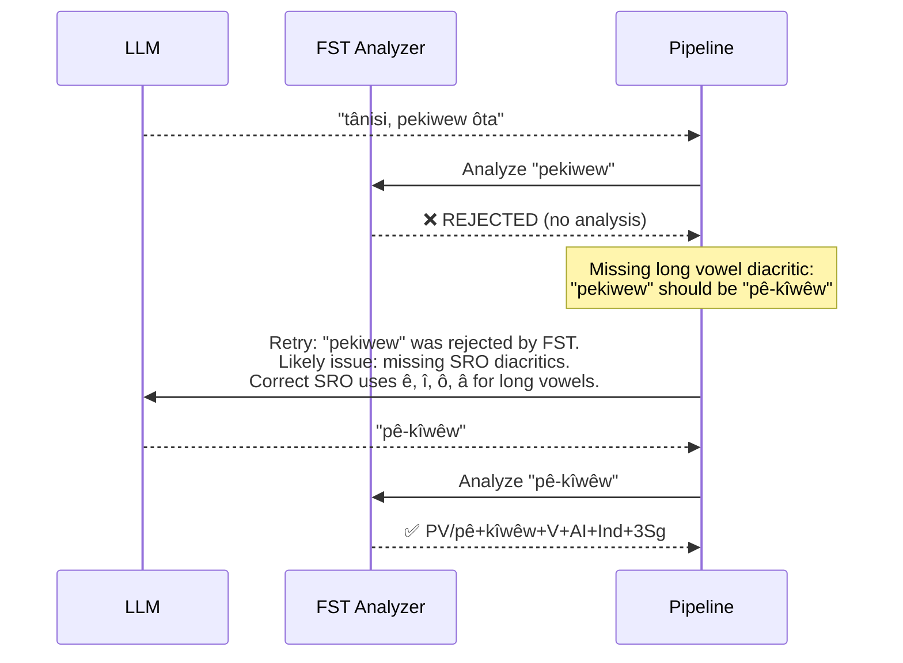

# Cookbook: FST-Gated Translation Pipeline

Build a multi-stage translation pipeline that decomposes source text, translates via LLM, validates outputs with a finite-state transducer (FST), and retries when the FST rejects invalid word forms. Then plug it into the eval harness and see how it scores.

**What you'll build:** A translation pipeline for Plains Cree that catches morphologically invalid translations *before* they count against your score.

:::info Prerequisites
- A running FST binary (e.g., from [ALTLab's Plains Cree analyzer](https://github.com/UAlbertaALTLab/lang-crk))
- Node.js 20+ (for the pipeline) and Python 3.10+ (for the harness)
- An OpenRouter API key for the LLM step
:::

---

## Architecture

The pipeline is a chain of stages. Each stage has a specific job. You can build this in any language — this example uses JavaScript, but the harness doesn't care what's inside. It only sees the thin Python adapter at the boundary.



### Why These Stages

| Stage | What It Does | Why It Matters |
|-------|-------------|---------------|
| **Decompose** | Break compound UI strings into translatable segments | Polysynthetic languages encode whole sentences in single words — the LLM needs smaller units |
| **Dictionary Lookup** | Check a bilingual dictionary for known translations | Forces correct terminology for known terms instead of relying on LLM guesswork |
| **LLM Translate** | Send the segment to an LLM with register and grammar context | Handles novel phrases and generates fluent output |
| **FST Validate** | Run the output through a morphological analyzer | Catches invalid word forms — if the FST rejects a word, it's not a valid word form in the language |
| **Retry** | Re-send rejected words with the FST's error feedback | Gives the LLM specific information about *why* the word was wrong |

---

## The Data Flow

Here's what happens to a single entry as it flows through the pipeline:



### When the FST Rejects



---

## Implementation

Build whatever you want. This example uses JavaScript, but you could use Python, Rust, or anything else. The harness doesn't care — it only talks to the thin Python adapter (shown in the next section).

### The Pipeline

Each stage is a function. The pipeline chains them together.

```javascript title="pipeline.js"
import { lookupDictionary } from './dictionary.js';
import { callLLM } from './llm.js';
import { analyzeWithFST } from './fst.js';

const MAX_RETRIES = 3;

/**
 * Translate a batch of keys through the full pipeline.
 *
 * @param {object} keys - Map of key → source string
 * @param {object} options - { sourceLang, targetLang }
 * @returns {{ translations: object, stats: object }}
 */
export async function translateBatch(keys, options) {
  const translations = {};
  const stats = { total: 0, fstAccepted: 0, retries: 0, dictionaryHits: 0 };

  for (const [key, sourceText] of Object.entries(keys)) {
    stats.total++;
    translations[key] = await translateSingle(sourceText, options, stats);
  }

  return { translations, stats };
}

/**
 * Translate a single string through all pipeline stages.
 */
async function translateSingle(sourceText, options, stats) {

  // ── Stage 1: Decompose ──────────────────────────────────
  // Split compound strings into segments the LLM can handle.
  // For UI strings this is often a no-op, but for longer content
  // it prevents the LLM from losing context in long prompts.
  const segments = decompose(sourceText);

  // ── Stage 2: Dictionary Lookup ──────────────────────────
  // Check each segment against the bilingual dictionary.
  // Known terms are forced — the LLM won't override them.
  const knownTerms = {};
  for (const segment of segments) {
    const entry = lookupDictionary(segment.toLowerCase());
    if (entry) {
      knownTerms[segment] = entry;
      stats.dictionaryHits++;
    }
  }

  // ── Stage 3: LLM Translate ──────────────────────────────
  let translation = await callLLM(sourceText, {
    ...options,
    knownTerms,
    register: 'nêhiyawêwin (Plains Cree). Use SRO orthography. '
            + 'Professional register for educational contexts.',
  });

  // ── Stage 4: FST Validate ──────────────────────────────
  // Split the translation into words and check each one.
  let { accepted, rejected } = await validateWords(translation);

  // ── Stage 5: Retry Loop ─────────────────────────────────
  // If any words were rejected, retry with FST feedback.
  let attempt = 0;
  while (rejected.length > 0 && attempt < MAX_RETRIES) {
    attempt++;
    stats.retries++;

    const feedback = rejected
      .map(w => `"${w}" was rejected by the morphological analyzer`)
      .join('; ');

    translation = await callLLM(sourceText, {
      ...options,
      knownTerms,
      register: 'nêhiyawêwin (Plains Cree). Use SRO orthography.',
      feedback: `Previous attempt had invalid words. ${feedback}. `
              + 'Use correct SRO diacritics (ê, î, ô, â for long vowels). '
              + 'Ensure verb forms match expected conjugation patterns.',
    });

    ({ accepted, rejected } = await validateWords(translation));
  }

  if (rejected.length === 0) stats.fstAccepted++;

  return translation;
}

/**
 * Decompose source text into translatable segments.
 *
 * For simple key-value UI strings, this usually returns the
 * original string as a single segment. For longer content,
 * it splits on sentence boundaries.
 */
function decompose(text) {
  // Simple sentence-boundary split. Replace with your own
  // morphological decomposition for more complex needs.
  return text
    .split(/(?<=[.!?])\s+/)
    .filter(s => s.trim().length > 0);
}

/**
 * Validate each word in a translation against the FST.
 *
 * @returns {{ accepted: string[], rejected: string[] }}
 */
async function validateWords(translation) {
  // Split on whitespace and punctuation, keeping only words
  const words = translation
    .split(/[\s,;:.!?'"()\[\]{}]+/)
    .filter(w => w.length > 0);

  const accepted = [];
  const rejected = [];

  for (const word of words) {
    const analyses = await analyzeWithFST(word);
    if (analyses.length > 0) {
      accepted.push(word);
    } else {
      rejected.push(word);
    }
  }

  return { accepted, rejected };
}
```

### The FST Wrapper

Wrap your FST binary as an async function. This example uses ALTLab's HFST-based Plains Cree analyzer.

```javascript title="fst.js"
import { execFile } from 'node:child_process';
import { promisify } from 'node:util';

const execFileAsync = promisify(execFile);

// Path to your FST analyzer binary
const FST_PATH = process.env.FST_ANALYZER_PATH || './bin/crk-analyzer';

/**
 * Run a word through the FST morphological analyzer.
 *
 * Returns an array of analyses. Empty array = rejected.
 *
 * Example:
 *   analyzeWithFST("tânisi")
 *   → ["tânisi+V+AI+Ind+2Sg", "tânisi+V+AI+Cnj+2Sg"]
 *
 *   analyzeWithFST("pekiwew")
 *   → []  // rejected — missing diacritics
 *
 * @param {string} word - A single word in SRO orthography
 * @returns {string[]} Array of FST analyses (empty = rejected)
 */
export async function analyzeWithFST(word) {
  try {
    // HFST lookup: pipe the word to stdin, read analyses from stdout
    const { stdout } = await execFileAsync(
      FST_PATH,
      ['--quiet'],
      { input: word + '\n', timeout: 5000 }
    );

    // Parse HFST output: each line is "input\tanalysis\tweight"
    // Lines with "+?" indicate unrecognized forms
    return stdout
      .split('\n')
      .filter(line => line.includes('\t') && !line.includes('+?'))
      .map(line => line.split('\t')[1]);

  } catch (err) {
    // If the FST binary isn't available, log and reject
    console.error(`[WARN] FST analysis failed for "${word}": ${err.message}`);
    return [];
  }
}
```

### Dictionary and LLM Modules

```javascript title="dictionary.js"
/**
 * Simple bilingual dictionary backed by a JSON file.
 *
 * In production, you'd load from the coaching data directory
 * or query itwêwina (https://itwewina.altlab.app/) via API.
 */
const DICTIONARY = {
  'hello': 'tânisi',
  'welcome': 'tânisi',
  'thank you': 'kinanâskomitin',
  'home': 'kīwēwin',
  'search': 'nānātawāpahtam',
  'settings': 'isi-nākatohkēwin',
  'help': 'nīsōhkamākēwin',
  'back': 'kīwē',
};

/**
 * @param {string} term - Lowercase English term
 * @returns {string|null} Cree translation or null
 */
export function lookupDictionary(term) {
  return DICTIONARY[term] || null;
}
```

```javascript title="llm.js"
/**
 * Call an LLM via OpenRouter for translation.
 */
const OPENROUTER_API = 'https://openrouter.ai/api/v1/chat/completions';

export async function callLLM(sourceText, options) {
  const { knownTerms = {}, register, feedback } = options;

  // Build the system prompt with register and known terms
  let systemPrompt = `You are translating English to Plains Cree.\n\n`;
  systemPrompt += `Register: ${register}\n\n`;

  if (Object.keys(knownTerms).length > 0) {
    systemPrompt += `Required terminology (use these exact translations):\n`;
    for (const [en, crk] of Object.entries(knownTerms)) {
      systemPrompt += `  "${en}" → "${crk}"\n`;
    }
    systemPrompt += '\n';
  }

  if (feedback) {
    systemPrompt += `IMPORTANT correction from previous attempt:\n${feedback}\n\n`;
  }

  systemPrompt += `Rules:\n`;
  systemPrompt += `- Use Standard Roman Orthography (SRO)\n`;
  systemPrompt += `- Use macron/circumflex for long vowels: ê, î, ô, â\n`;
  systemPrompt += `- Return ONLY the Cree translation, nothing else\n`;

  const response = await fetch(OPENROUTER_API, {
    method: 'POST',
    headers: {
      'Authorization': `Bearer ${process.env.OPENROUTER_API_KEY}`,
      'Content-Type': 'application/json',
    },
    body: JSON.stringify({
      model: 'google/gemini-2.5-pro',
      messages: [
        { role: 'system', content: systemPrompt },
        { role: 'user', content: sourceText },
      ],
      temperature: 0.2,
    }),
  });

  const json = await response.json();
  return json.choices[0].message.content.trim();
}
```

---

## Plugging Into the Harness

Your pipeline is built. Now you need to connect it to the eval harness so you can benchmark it on the leaderboard.

The harness speaks one interface: `TranslationProcess`. It's a Python protocol with a single method. Build whatever you want in whatever language — then give it this thin wrapper and it plugs in.

```python title="fst_gated_process.py"
"""
TranslationProcess adapter for the FST-gated pipeline.

This thin wrapper connects your pipeline (running as a local
subprocess or HTTP server) to the eval harness. The harness
calls translate() with corpus entries. You call your pipeline.
You return results. That's it.
"""

import time
import subprocess
import json
from mt_eval_harness.config import RunConfig


class FSTGatedProcess:
    """Adapter between the eval harness and your FST-gated pipeline.

    The pipeline runs as a Node.js subprocess. This wrapper:
    1. Receives entries from the harness
    2. Sends them to the pipeline
    3. Returns structured results the harness can score
    """

    def __init__(self, pipeline_url: str = "http://localhost:3001"):
        self.pipeline_url = pipeline_url

    async def translate(
        self,
        entries: list[dict],
        config: RunConfig,
    ) -> list[dict]:
        """Translate a batch of entries through the FST-gated pipeline.

        Args:
            entries: List of corpus entries with 'id' and source text.
            config: Harness run configuration (for context).

        Returns:
            List of result dicts, one per entry.
        """
        import httpx

        results = []

        for entry in entries:
            source_text = entry.get(config.source_field, entry.get("source", ""))
            start = time.monotonic()

            try:
                # Call your pipeline — however it's running
                async with httpx.AsyncClient() as client:
                    response = await client.post(
                        f"{self.pipeline_url}/translate",
                        json={"keys": {str(entry["id"]): source_text}},
                        timeout=30.0,
                    )
                    data = response.json()
                    predicted = data["translations"][str(entry["id"])]

                elapsed = time.monotonic() - start

                results.append({
                    "id": entry["id"],
                    "predicted": predicted,
                    "latency_s": elapsed,
                    "usage": {},  # pipeline doesn't expose token counts
                    "error": None,
                    "tool_calls": [],
                    "tool_call_count": 0,
                    "metadata": data.get("meta", {}),
                })

            except Exception as err:
                results.append({
                    "id": entry["id"],
                    "predicted": "",
                    "latency_s": time.monotonic() - start,
                    "usage": {},
                    "error": str(err),
                    "tool_calls": [],
                    "tool_call_count": 0,
                    "metadata": {},
                })

        return results
```

:::tip You don't need HTTP
The example above calls the pipeline over HTTP because the pipeline is in JavaScript. If your pipeline is in Python, you can call it directly — no server needed. The `TranslationProcess` wrapper is just a function boundary. What happens inside is up to you.
:::

### Running the Benchmark

Start your pipeline, then run the harness:

```bash
# Terminal 1: Start the pipeline
node server.js

# Terminal 2: Run the harness with your process
export OPENROUTER_API_KEY="sk-or-v1-..."

python -c "
import asyncio
from mt_eval_harness.config import RunConfig
from mt_eval_harness.runner import execute_run
from fst_gated_process import FSTGatedProcess

async def main():
    config = RunConfig(
        corpus_path='data/edtekla-dev-v1.json',
        source_lang='English',
        target_lang='Plains Cree (nêhiyawêwin, SRO)',
        process_name='fst-gated-v1',
    )
    process = FSTGatedProcess('http://localhost:3001')
    run_log = await execute_run(config, process=process)
    print(f'Results: {run_log.output_path}')

asyncio.run(main())
"
```

Or use the CLI with `baseline_experiment.py` to compare against the built-in baseline:

```bash
python eval/baseline_experiment.py \
  --dataset data/edtekla-dev-v1.json \
  --model google/gemini-2.5-pro \
  --fst-analyzer ./bin/crk-analyzer \
  --condition fst-gated-v1 \
  --submit
```

---

## Understanding Your Results

The harness produces a **run card** — a JSON file with your scores. Here's what you'll see:

```
═══════════════════════════════════════════════════
  FST-Gated Pipeline v1 — EDTeKLA Dev v1
═══════════════════════════════════════════════════

  chrF++              48.7 / 100
  Exact match         12.1%
  FST acceptance      94.4%
  Composite score     0.52  →  Functional ✓

  124 entries · 47 retries · $0.18 total cost
═══════════════════════════════════════════════════
```

**What this tells you at a glance:**
- Your method is **Functional** tier (0.50–0.70) — output is recognizable to a speaker, major grammar usually correct, frequent morphological errors remain.
- The FST is catching 94% of words as valid — your retry loop is working.
- 12% of translations are exactly right — there's a lot of room to improve.

:::info Quality Tiers
| Tier | Composite | What It Means |
|------|-----------|---------------|
| Baseline | 0.00–0.30 | Raw LLM output, mostly hallucinated morphology |
| Emerging | 0.30–0.50 | Some correct patterns, not reliable |
| **Functional** | **0.50–0.70** | **Recognizable to a speaker. Major categories usually correct.** |
| Deployable | 0.70–0.85 | Suitable for draft translation with human review |
| Fluent | 0.85–1.00 | Approaching competent human translation |

See [SCORING_SPEC §5](/docs/specifications/scoring#5-quality-tiers) for the full tier definitions.
:::

<details>
<summary><strong>Deeper: What's in the run card?</strong></summary>

The run card JSON captures everything about this evaluation run. Key sections:

**Scores** — every metric the harness computed:
```json
{
  "scores": {
    "exact_match_rate": 0.121,
    "chrf_plus_plus": 48.7,
    "fst_acceptance_rate": 0.944,
    "composite_score": 0.52,
    "quality_tier": "functional"
  }
}
```

**Provenance** — what produced these results:
```json
{
  "method": {
    "process_name": "fst-gated-v1",
    "model": "google/gemini-2.5-pro",
    "temperature": 0.0
  },
  "corpus": {
    "id": "edtekla-dev-v1",
    "sha256": "a1b2c3..."
  }
}
```

**Per-entry results** — every translation with individual scores, so you can find where your method struggles:
```json
{
  "id": 42,
  "source": "The student completed the assignment",
  "reference": "ôskiniw kî-kîsîhtâw ôhi atoskêwina",
  "predicted": "ôskiniw kî-kîsîhtâw ôhi atoskêwin",
  "chrf": 89.2,
  "exact_match": false,
  "fst_accepted": true
}
```

The composite score is a weighted average of available metrics, with weights defined in [SCORING_SPEC §4](/docs/specifications/scoring#4-composite-score). When a metric isn't available, its weight is redistributed proportionally across the rest.

</details>

---

## Deploying to Production

Your method has scores on the leaderboard. Now you want to actually use it. This section is about serving your pipeline as a production endpoint that [champollion](https://champollion.dev) can call.

:::note This section is optional
Everything above is about building and benchmarking your method. This section is about deployment — a separate concern. You can submit to the leaderboard without deploying anything.
:::

### The HTTP Server

Wrap your pipeline as an Express server that implements the [API method contract](https://champollion.dev/docs/guides/serving-a-method):

```javascript title="server.js"
import express from 'express';
import { translateBatch } from './pipeline.js';

const app = express();
app.use(express.json());

/**
 * API method contract:
 *
 * Request:  { source_locale, target_locale, method, keys: { "key": "source" } }
 * Response: { translations: { "key": "translated" }, meta: { ... } }
 */
app.post('/translate', async (req, res) => {
  const { source_locale, target_locale, method, keys } = req.body;

  // Validate request
  if (!keys || typeof keys !== 'object') {
    return res.status(400).json({ error: { message: 'Missing keys object' } });
  }

  try {
    const startTime = Date.now();
    const { translations, stats } = await translateBatch(keys, {
      sourceLang: source_locale,
      targetLang: target_locale,
    });

    res.json({
      translations,
      meta: {
        model: 'custom-pipeline/fst-gated-v1',
        method: 'decompose-lookup-translate-validate',
        elapsed_ms: Date.now() - startTime,
        fst_acceptance_rate: stats.fstAccepted / stats.total,
        retries: stats.retries,
      },
    });
  } catch (err) {
    console.error('[ERR] Pipeline failed:', err.message);
    res.status(500).json({ error: { message: err.message } });
  }
});

// Health check for connectivity verification
app.get('/health', (req, res) => res.json({ status: 'ok' }));

app.listen(3001, () => {
  console.log('FST-gated pipeline running on http://localhost:3001');
});
```

### Configure champollion

Point your language pair at the running service:

```json title="champollion.config.json"
{
  "version": 3,
  "inputLocale": "en",
  "pairs": {
    "en:crk": {
      "method": "api",
      "endpoint": "http://localhost:3001/translate"
    }
  },
  "languages": {
    "crk": {
      "name": "Plains Cree",
      "register": "SRO syllabics with grammatical precision."
    }
  }
}
```

```bash
# Run it
export OPENROUTER_API_KEY="sk-or-v1-..."
node server.js &
npx champollion sync
```

### Packaging as a Plugin

Once your method has scores, package it so others can use it:

```json title="crk-fst-gated-v1/method.json"
{
  "name": "crk-fst-gated-v1",
  "type": "api",
  "version": "1.0.0",
  "description": "FST-gated Plains Cree translation with morphological validation",
  "author": "Your Name",

  "config": {
    "endpoint": "https://your-server.example.com/translate"
  },

  "locales": ["crk"],

  "benchmarks": {
    "crk": {
      "date": "2026-06-01T00:00:00Z",
      "corpus_size": 124,
      "exact_match_rate": 0.12,
      "corpus_chrf": 48.7,
      "model": "google/gemini-2.5-pro",
      "harness_version": "2.0"
    }
  },

  "provenance": {
    "resources": [
      { "name": "ALTLab CRK Analyzer", "license": "LGPL-3.0", "type": "fst" },
      { "name": "Wolvengrey Dictionary", "license": "CC-BY-NC-SA-4.0", "type": "dictionary" }
    ],
    "commercialReady": false,
    "flags": ["nc-resource"]
  }
}
```

---

## Extending This Pattern

This cookbook demonstrates one pipeline architecture. You can adapt it for any language or method:

| Variation | What Changes |
|-----------|-------------|
| **Different FST** | Swap the binary path. You can download precompiled FSTs (like `.hfstol` or `lttoolbox` binaries) for over 100 languages from the [GiellaLT GitHub](https://github.com/giellalt) or [Apertium GitHub](https://github.com/apertium). |
| **No FST available** | Remove the FST execution stage and use [UniMorph flat paradigm files](https://huggingface.co/datasets/unimorph/universal_morphologies) from Hugging Face to perform static database lookup validation of inflected forms. |
| **Multiple LLMs** | Chain models: a fast model for initial draft, a reasoning model for corrections. |
| **Human-in-the-loop** | Add a queue stage that holds uncertain translations for expert review before returning. |
| **Fine-tuned model** | Replace the OpenRouter call with a local model (Ollama, vLLM, etc.). |
| **Different language** | Change the dictionary, FST, and register. The architecture stays identical. |

The pipeline is a pattern. The stages are interchangeable. Build what works for your language, prove it on the [leaderboard](https://champollion.dev/leaderboard), and deploy it.

---

## See Also

- **[Eval Harness](/docs/specifications/harness)** — how to run the harness and interpret output
- **[Method Interface](/docs/specifications/methods)** — the `TranslationProcess` protocol specification
- **[Leaderboard Rules](/docs/leaderboard/rules)** — submission criteria and anti-gaming policies
- **[Support a Low-Resource Language](/docs/community/low-resource-languages)** — the broader context and OCAP principles
- **[ALTLab](https://altlab.artsrn.ualberta.ca/)** — the Alberta Language Technology Lab (Plains Cree FST)
- **[Method Leaderboard](https://champollion.dev/leaderboard)** — submit your scores
