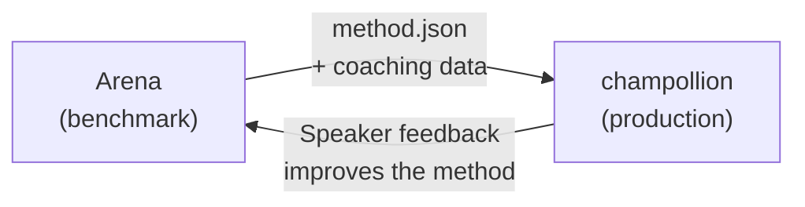

# النشر في بيئة الإنتاج

لقد أثبتَّ نجاح طريقتك في الـ Arena. حان الآن وقت نشرها.

الـ Arena مخصصة للبحث والتطوير — لبناء طرق الترجمة وقياسها ومقارنتها. أما **النشر في بيئة الإنتاج** فيتم عبر [champollion](https://champollion.dev)، وهي أداة سطر الأوامر للترجمة الموجّهة للمطوّرين. وترتبط المنصتان من خلال صيغة إضافات (plugin) مشتركة.



---

## مسار النشر

### 1. تصدير طريقتك كإضافة (Plugin)

أنشئ ملف بيان `method.json` يجمع نتائج القياس المرجعي الخاصة بك:

```json
{
  "name": "crk-coached-v3",
  "type": "llm-coached",
  "version": "3.0.0",
  "description": "Coached LLM translation for Plains Cree",
  "locales": ["crk"],
  "config": {
    "model": "google/gemini-2.5-flash",
    "temperature": 0.3
  },
  "benchmarks": {
    "crk": {
      "composite_score": 0.67,
      "fst_acceptance": 0.82,
      "corpus_size": 150
    }
  }
}
```

أرفق أي بيانات توجيهية (قواعد نحوية، قواميس) مع ملف البيان.

### 2. التثبيت في Champollion

```bash
champollion plugin install ./my-method-plugin/
```

### 3. تهيئة الزوج اللغوي الخاص بك

```json title="champollion.config.json"
{
  "pairs": {
    "en-crk": { "method": "plugin", "plugin": "crk-coached-v3" }
  }
}
```

### 4. ترجمة محتوى حقيقي

```bash
npx champollion sync
```

أصبحت طريقتك التي خضعت للقياس المرجعي تنتج الآن ترجمات حقيقية في بيئة الإنتاج.

---

## للغات الشعوب الأصلية

تتطلب الطرق التي تخدم مجتمعات لغات الشعوب الأصلية **موافقة المجتمع** قبل النشر في بيئة الإنتاج. وتحكم مبادئ OCAP (الملكية، والتحكم، والوصول، والحيازة) كيفية تطوير طرق الترجمة وتقييمها ونشرها.

الطريقة التي تصل إلى المستوى القابل للنشر (Deployable) بدرجة 0.70 أو أعلى لا تُنشر تلقائيًا — بل تُنشر **إذا ومتى** منحت الهيئة الحاكمة لمجتمع اللغة موافقتها.

راجع [سيادة البيانات](/docs/sovereignty/data-sovereignty) و[نقل الملكية](/docs/sovereignty/ownership-transfer) للاطلاع على إطار الحوكمة الكامل.

---

## انظر أيضًا

- [The Eval Harness Bridge](https://champollion.dev/docs/guides/bridge) — شرح تفصيلي لمسار Arena→champollion
- [Plugin Specification](https://champollion.dev/docs/reference/plugin-spec) — صيغة ملف البيان method.json
- [champollion Agent Guide](https://champollion.dev/docs/guides/agent-guide) — كيفية استخدام champollion للترجمة