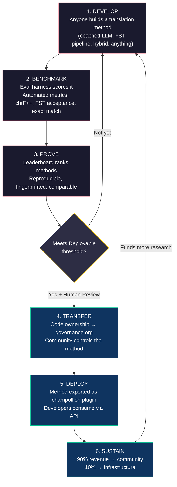
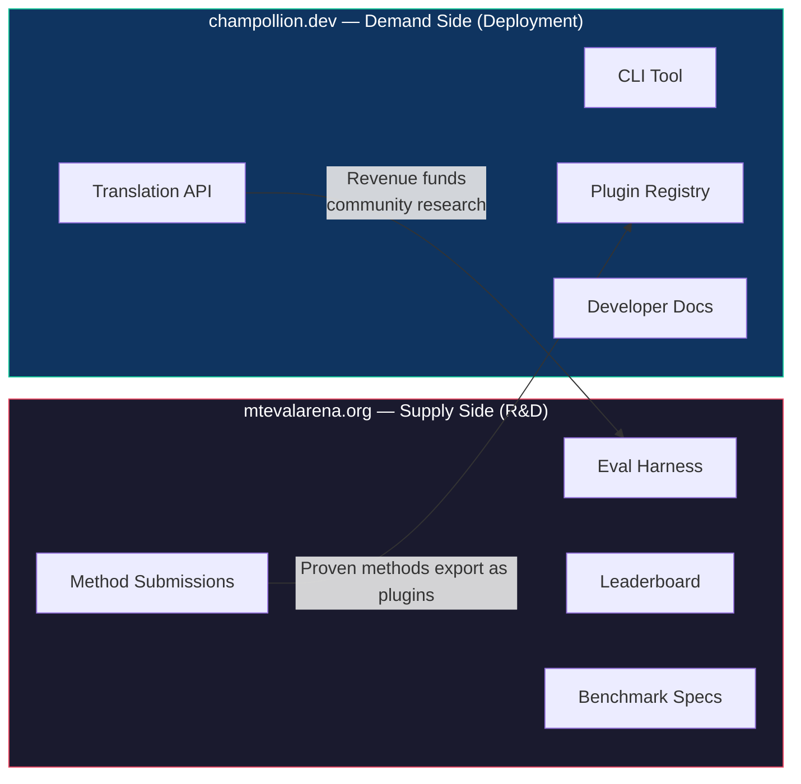
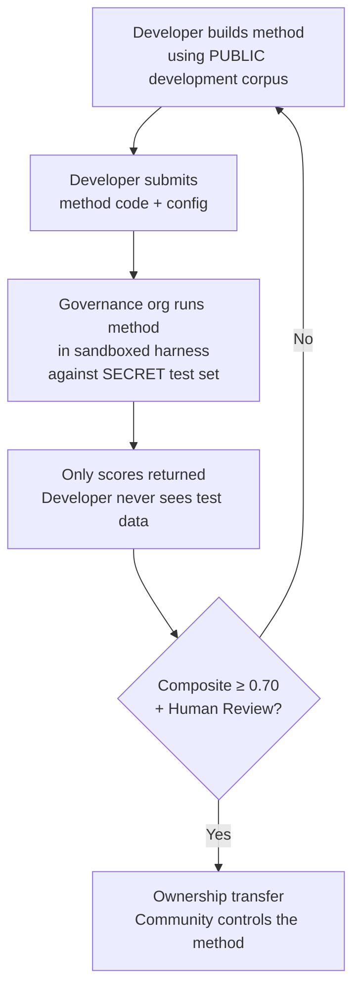

# كيف يعمل: التعهيد الجماعي التنافسي للترجمة الآلية

> **ملخص تنفيذي.** الترجمة الآلية للغات العالم غير المخدومة بشكل كافٍ — بما في ذلك حوالي 1,300 لغة يدّعي نموذج OMT-1600 من Meta تغطيتها ولكن بمستويات جودة أدنى من أي عتبة قابلة للاستخدام — ليست مشكلة تدريب نماذج — بل هي مشكلة *بنية تحتية*. لن يحلّها نموذج واحد أو مختبر واحد أو شركة واحدة. تصف هذه الوثيقة بنية منصة تحوّل المجتمع العالمي من مهندسي تعلّم الآلة واللغويين والمتحدثين باللغات إلى مختبر بحثي موزّع: يبني أي شخص طريقة ترجمة، وتثبت المنصة ما إذا كانت تعمل بمواجهة بيانات تقييم سيادية، وتُنشر الطرق المُثبتة في الإنتاج مع تدفق الإيرادات إلى المجتمعات التي تخدم لغاتها. الآلية هي التعهيد الجماعي التنافسي مع السيادة التشفيرية — وهي تركيبة لم تُجرَّب من قبل.

---

> [!IMPORTANT]
> **النطاق.** تقيّم هذه المنصة **ترجمة النصوص المكتوبة الرسمية** — الوثائق، والمواد التعليمية، والمراسلات الرسمية، ونصوص واجهات المستخدم. إنها ليست روبوت محادثة، ولا مترجمًا فوريًا في الوقت الفعلي، ولا نظامًا حواريًا غير مقيّد المجال. تصنّف لوحة الصدارة طرق الترجمة بمواجهة مدونات متوازية منسّقة في مجالات نصية محددة (انظر [Benchmark Specification §2.7](/docs/specifications/benchmark#27-domain) للاطلاع على تصنيف المجالات). الترجمة الآلية هي بنية تحتية لإحياء اللغات، وليست بديلاً عنه. يتعلم الأطفال اللغة من البشر، لا من الآلات.

### التغطية الحالية للمجالات

| المجال | تغطية المستويات | الحالة | ملاحظات |
|--------|--------------|--------|-------|
| رسمي / حكومي | المستويات 1–5 | نشط | مدونة EdTeKLA |
| تعليمي / كتب مدرسية | المستويات 1–4 | نشط | مدونة EdTeKLA |
| سردي / أدبي | محدود | مخطط له | بعض المدخلات في المعيار الذهبي |
| ديني / كتابي | مرجعي فقط | غير مقيَّم | FLORES+ (مجال الكتاب المقدس)؛ لا يُستخدم في التقييم الرسمي |
| محادثة | خارج النطاق | عن قصد | يقيّم هذا النظام النصوص المكتوبة، لا الكلام |
| تقني / علمي | خارج النطاق | مستقبلي | يتطلب التحقق من المصطلحات الخاصة بالمجال |

## 1. المشكلة: الترجمة الآلية ≠ تعلّم الآلة

تُعرض الترجمة الآلية للغات منخفضة الموارد (LRLs) عادة بوصفها مشكلة تعلّم آلة: اجمع البيانات، درّب نموذجًا، انشره. هذا التأطير خاطئ، والخطأ له عواقب — فهو يوجّه التمويل والمواهب والبنية التحتية نحو نهج لا يمكنه بنيويًا أن ينجح مع غالبية لغات العالم.

### 1.1 لماذا يفشل تأطير تعلّم الآلة

تتطلب سلسلة تعلّم الآلة القياسية للترجمة الآلية ثلاثة أشياء: مدونات متوازية كبيرة، ومعايير تقييم مُتحقَّق منها، ومسار نشر. بالنسبة لحوالي 130 لغة تخدمها Google Translate وحوالي 200 لغة يغطيها NLLB-200، توجد العناصر الثلاثة. أما بالنسبة لحوالي 1,300 لغة إضافية يدّعي OMT-1600 تغطيتها، فبيانات التقييم موجودة لكن الجودة في معظمها دون العتبات القابلة للاستخدام، وأوزان النموذج غير متاحة للعموم، ولا توجد سلسلة نشر. وبالنسبة لما تبقّى من أكثر من 5,400 لغة، لا يوجد شيء من ذلك على الإطلاق.

| المتطلب | اللغات عالية الموارد | تغطية OMT-1600 (~1,300 لغة منخفضة الموارد) | ~5,400 لغة متبقية |
|-------------|------------------------|-------------------------------|---------------------------|
| **المدونات المتوازية** | ملايين أزواج الجمل (Europarl، UN Corpus، OpenSubtitles) | نصوص ثنائية من مجال الكتاب المقدس، كشط الويب، ترجمة عكسية اصطناعية. لا بيانات منسّقة من المجتمع. | مئات إلى بضعة آلاف، إن وُجدت |
| **معايير التقييم** | WMT، FLORES، NTREX — موحَّدة وقابلة لإعادة الإنتاج | BOUQuET (مجال الكتاب المقدس)، met-BOUQuET. لا تحقّق صرفي. لا تقييم مستقل. | لا معايير قياسية؛ تقييم مرتجل |
| **مسار النشر** | Google Translate، DeepL، Azure — واجهات برمجية تجارية | أوزان النموذج غير منشورة. لا CLI، لا نظام إضافات، لا واجهة برمجية قابلة للنشر من المجتمع. | لا شيء. لا واجهة برمجية، لا منتج، لا سوق. |

ينجح نهج تعلّم الآلة عندما توجد البيانات للتدريب عليها والسوق للنشر فيها. وقد وسّع OMT-1600 الشرط الأول بشكل كبير — لكن التوسّع دون تحقّق مستقل من الجودة، أو تحقّق صرفي، أو حوكمة مجتمعية، هو توسّع بلا ثقة. المشكلة ليست فقط «نحتاج إلى نموذج أفضل» — بل «نحتاج إلى بنية تحتية تثبت أن النموذج يعمل، وفق شروط يتحكم فيها المجتمع».

### 1.2 ما تتطلبه فعلاً الترجمة الآلية للغات منخفضة الموارد

الترجمة للغات غير المخدومة بشكل كافٍ ليست في الأساس مشكلة تدريب. إنها مشكلة **هندسة طرق** — تحدي تجميع الموارد المتاحة (نماذج اللغة الكبيرة، الأدوات الصرفية، المعرفة المجتمعية، القواعد اللغوية) في سلاسل ترجمة عاملة، ثم إثبات أنها تعمل عبر تقييم صارم.

هذا التمييز مهم:

| البعد | نهج تعلّم الآلة | نهج هندسة الطرق |
|-----------|------------|---------------------------|
| **النشاط الأساسي** | تدريب نموذج على بيانات | دمج الأدوات والموجّهات والمعرفة اللغوية في سلسلة معالجة |
| **عنق الزجاجة** | حجم البيانات المتوازية | الإبداع الهندسي + بنية التقييم التحتية |
| **من يمكنه المساهمة** | فرق تمتلك عناقيد GPU ومجموعات بيانات | أي شخص لديه مفتاح API وقاموس وفكرة |
| **التقييم** | BLEU/chrF على مجموعات اختبار محجوزة | تحقّق صرفي + مراجعة بشرية + مقاييس آلية |
| **النشر** | تشغيل النموذج | تغليف الطريقة كإضافة (plugin) |

تحتوي نماذج اللغة الكبيرة الحديثة بالفعل على معرفة كامنة بالعديد من اللغات منخفضة الموارد — تكفي لإنتاج مخرجات *تبدو* معقولة. المشكلة أن هذه المخرجات غالبًا غير صحيحة صرفيًا (يهلوس النموذج صيغ كلمات لا وجود لها في اللغة). التحدي الهندسي هو: كيف تستخرج ما يعرفه نموذج اللغة الكبير، وتتحقق منه بمواجهة الواقع اللغوي، وتغلّف النتيجة للاستخدام الإنتاجي؟

لهذا السبب نقيس **الطرق**، لا النماذج. الطريقة هي الوصفة الكاملة: اختيار النموذج + هندسة الموجّهات + استخدام الأدوات + المعالجة القبلية/البعدية + بيانات التدريب التوجيهي + استراتيجيات إعادة المحاولة. فريقان يستخدمان النموذج نفسه بطريقتين مختلفتين سيحصلان على نتائج مختلفة. وهذا هو المقصود.

### 1.3 لماذا تكسر اللغات متعددة التركيب كل شيء

كثير من أكثر لغات العالم حرمانًا من الخدمة هي لغات **متعددة التركيب (polysynthetic)** — أي أنها تشفّر جملاً كاملة في كلمات مفردة عبر عمليات صرفية إنتاجية. تأمّل كلمة لغة Plains Cree:

> **ê-kî-nitawi-kîskinwahamâkosiyân**
> *«عندما كنتُ قد ذهبتُ إلى المدرسة»*

كلمة واحدة. تشفّر الزمن (الماضي)، والاتجاه (الذهاب إلى)، والجذر (يتعلّم)، والصيغة (المبني للمجهول/الانعكاسي)، والشخص (المتكلم المفرد). تحتاج الإنجليزية إلى ست كلمات لما تعبّر عنه الكري بكلمة واحدة.

هذا يكسر الترجمة الآلية القياسية على كل مستوى:

- **التقطيع (Tokenization)** — تمزّق BPE وSentencePiece الكلمات متعددة التركيب إلى أجزاء بلا معنى، لأنها صُمّمت للصرف الإلحاقي.
- **الهلوسة** — تنتج نماذج اللغة الكبيرة سلاسل تبدو معقولة لكنها ليست كلمات صحيحة. لا يستطيع غير المتحدث التمييز بينها. وبدون التحقّق الصرفي، تظل الهلوسات غير مرئية.
- **التقييم** — تعاقب المقاييس على مستوى الكلمة (BLEU) التنويع الصرفي الطبيعي الذي هو أساسي في طريقة عمل هذه اللغات. المقاييس على مستوى الحرف (chrF++) أفضل لكنها لا تزال غير كافية بدون التحقّق البنيوي.

الحل ليس نموذجًا أكبر أو مزيدًا من بيانات التدريب، بل **بنية تحتية تلتقط الهلوسات قبل وصولها إلى المستخدمين** — محلّلات صرفية (FSTs) تستطيع أن تقول بشكل قاطع: «هذه ليست كلمة في هذه اللغة».

---

## 2. لماذا لا تنجح المقاربات القائمة

### 2.1 الترجمة الآلية التجارية

دأبت خدمات الترجمة التجارية تاريخيًا على التحسين وفق حجم السوق. يمثّل OMT-1600 من Meta (مارس 2026) تحوّلًا كبيرًا — 1,600 لغة في نظام واحد. لكن بالنسبة لحوالي 1,300 لغة في أدنى مستويات الموارد لديهم، فإن الجودة دون العتبات القابلة للاستخدام، وأوزان النموذج غير متاحة، ولا توجد سلسلة نشر. وقد تطورت مشكلة الحوافز البنيوية: تستطيع شركات التقنية الكبرى الآن بناء نماذج للغات منخفضة الموارد، لكن بدون تقييم مستقل، أو تحقّق صرفي، أو حوكمة مجتمعية، فإن التغطية وحدها لا تحلّ المشكلة.

### 2.2 البحث الأكاديمي

يركّز البحث الأكاديمي في الترجمة الآلية بشكل ساحق على أزواج اللغات عالية الموارد لأنها حيث توجد بيانات التدريب والمهام المشتركة ومنافذ النشر العلمي. أما الباحثون العاملون على الأزواج منخفضة الموارد فيجدون صعوبة في النشر، وصعوبة في تمويل الحوسبة، وصعوبة في النشر الإنتاجي — لأن البنية التحتية لنشر اللغات منخفضة الموارد غير موجودة.

### 2.3 المسابقات لمرة واحدة

يمكنك إقامة مسابقة على Kaggle: «الإنجليزية→Plains Cree، أفضل chrF++ يفوز بـ 10,000 دولار». إليك ما يحدث:

1. يفوز شخص ما، ويقدّم دفترًا برمجيًا، ويحصد الجائزة، ويعود إلى منزله.
2. يتعفّن الدفتر في أرشيف Kaggle. لا أحد ينشره. لا أحد يصونه.
3. تُنشر مجموعة الاختبار في نهاية المطاف — فتتلوّث إلى الأبد.
4. رفعت منظمة الحوكمة بياناتها اللغوية إلى بنية Google التحتية بموجب شروط خدمة Google، دون تحكّم حقيقي في دورة الحياة.
5. لا جسر للنشر. الدفتر البرمجي الفائز ليس واجهة برمجية عاملة.

الجائزة لمرة واحدة تجذب صائدي الجوائز. أما لوحة الصدارة المستمرة ذات الحوكمة المجتمعية فتخلق انخراطًا مستدامًا.

### 2.4 الضبط الدقيق

الضبط الدقيق لنموذج مفتوح على نصوص متوازية هو نهج تعلّم الآلة البديهي. لكن بالنسبة لمعظم اللغات منخفضة الموارد، فإن المدونة المتوازية اللازمة للضبط الدقيق هي بالضبط البيانات غير الموجودة — وإنشاؤها يتطلب المتحدثين ثنائيي اللغة والانخراط المجتمعي نفسيهما اللذين يُفترض أن يحلّ الضبط الدقيق محلهما. لا يمكنك أن تنتشل نفسك من مشكلة ندرة بيانات بتقنية تتطلب بيانات.

---

## 3. الحل: التعهيد الجماعي التنافسي مع التقييم السيادي

تقلب المنصة النهج التقليدي رأسًا على عقب: بدلاً من فريق واحد يبني نموذجًا واحدًا، **يتنافس المجتمع العالمي على بناء أفضل طريقة ترجمة**، وتثبت المنصة ما إذا كانت تعمل، وتُنشر الطرق المُثبتة في الإنتاج مع احتفاظ مجتمع اللغة بالملكية والتحكّم.

### 3.1 الحلقة الكاملة

لكل مرحلة وظيفة محددة:

| المرحلة | ما يحدث | المستفيد |
|-------|-------------|--------------|
| **التطوير** | يبني باحث أو طالب أو هاوٍ طريقة ترجمة باستخدام أي أدوات يريدها — توجيه نماذج اللغة الكبيرة، سلاسل FST، القواميس، النماذج المضبوطة بدقة، الأنظمة القائمة على القواعد، أو الهجينة | المساهم يتعلّم ويجرّب وينشر |
| **القياس المعياري** | يقيّم إطار التقييم الطريقة بمواجهة مدونة موحَّدة بمقاييس قابلة لإعادة الإنتاج. ينتج عن كل تشغيل [run card](/docs/specifications/benchmark#3-run-card-schema) — سجل كامل لما اختُبر وكيف كان أداؤه | يحصل الباحثون على نتائج قابلة لإعادة الإنتاج والمقارنة |
| **الإثبات** | تظهر النتائج على لوحة الصدارة العامة. تُصنَّف الطرق وتُقارن وتُمحَّص. يرى المجتمع ما ينجح وما لا ينجح | يكتسب الجميع رؤية لأحدث ما توصلت إليه التقنية |
| **النقل** | بالنسبة للغات الشعوب الأصلية، الطرق التي تصل إلى عتبة القابلية للنشر (composite ≥ 0.70) **و** تجتاز التحقق البشري، تُنقل ملكية كودها إلى منظمة الحوكمة الخاصة بمجتمع اللغة | يكتسب المجتمع أصلاً مدرًّا للإيرادات |
| **النشر** | تُصدَّر الطريقة كإضافة [champollion](https://github.com/gamedaysuits/champollion) وتُقدَّم عبر واجهة برمجية. يستهلك المطوّرون الترجمات دون الحاجة إلى فهم الطريقة الكامنة وراءها | يحصل المطوّرون على ترجمة للغات لا تخدمها الواجهات البرمجية التجارية |
| **الاستدامة** | تُقسَّم إيرادات الواجهة البرمجية: 90% للمجتمع، و10% للبنية التحتية. تموّل الإيرادات مزيدًا من البحث اللغوي وتطوير المدونات والبرامج المجتمعية | تستديم العجلة بذاتها بعد التأسيس الأولي |

### 3.2 لماذا تنجح الديناميكيات التنافسية

المنافسة ليست أمرًا عرضيًا — إنها الآلية ذاتها. وإليك السبب:

**تنوّع المقاربات.** قد تكون أفضل طريقة للإنجليزية→Plains Cree هي نموذج لغة كبير مدرَّب توجيهيًا ومضبوط ببوابة FST. وقد تكون الأفضل للإنجليزية→Quechua سلسلة معالجة معزّزة بقاموس. وقد تكون الأفضل للإنجليزية→Inuktitut نموذجًا مضبوطًا بدقة منطلقًا من مدونة Nunavut Hansard. لن يهيمن فريق واحد أو نهج واحد عبر كل اللغات. تكشف لوحة الصدارة أي *أنواع* من المقاربات تنجح مع أي *أنواع* من اللغات — وهي نتيجة فوقية تُعدّ بحد ذاتها إسهامًا بحثيًا.

**انخراط مستدام.** لوحة الصدارة لا تكتمل أبدًا. هناك دائمًا من يريد التفوق على النتيجة الأعلى. كل مشاركة تتبرع بالحوسبة والجهد الفكري للمشكلة. وعلى خلاف المنحة لمرة واحدة، تولّد الديناميكية التنافسية استثمارًا بحثيًا مستمرًا من المجتمع العالمي.

**عتبة دخول منخفضة.** تحتاج إلى مفتاح API وقاموس وفكرة. إطار التقييم مفتوح المصدر. تنسيق المدونة هو JSON بسيط. يمكن لطالب لسانيات أن ينافس مختبرًا غنيّ الموارد — وأن يفوز أحيانًا، لأن المعرفة بالمجال (فهم اللغة) قد تفوق موارد الحوسبة وزنًا.

**جسر النشر.** الطريقة نفسها التي تحقق نتيجة جيدة في إطار التقييم تُنشر في الإنتاج بتغيير واحد في الإعدادات. «أثبتها هنا، انشرها هناك». هذه هي الفجوة التي لا تجسرها Kaggle ولا مهام WMT المشتركة ولا المنشورات الأكاديمية.

### 3.3 بنية المنصة

ينقسم النظام البيئي فعليًا إلى موقعين يخدمان جمهورين:

**[mtevalarena.org](https://mtevalarena.org)** هو ميدان الإثبات البحثي والتطويري. جمهوره مهندسو تعلّم الآلة واللغويون والباحثون. كل شيء هنا يدور حول بناء طرق الترجمة واختبارها وإثباتها.

**[champollion.dev](https://champollion.dev)** هو منصة النشر. جمهوره المطوّرون الذين يحتاجون إلى ترجمة لتطبيقاتهم. لا يحتاجون إلى فهم كيف تعمل الطرق — يكتفون باستدعاء الواجهة البرمجية.

الجسر بينهما هو **إضافة الطريقة (method plugin)**: طريقة مُثبتة، مغلّفة للنشر، مملوكة للمجتمع.

---

## 4. التقييم السيادي: لماذا تهمّ البنية التحتية

بنية التقييم التحتية ليست تفصيلاً تقنيًا — إنها جوهر نموذج السيادة. التقييم القياسي (ارفع مجموعة الاختبار إلى منصة مشتركة) لا يصلح للغات الشعوب الأصلية لأنه يتخلى عن التحكم في البيانات اللغوية.

### 4.1 آلية السيادة

لا يرى المطوّر أبدًا بيانات التقييم ذات المعيار الذهبي. يطوّر بمواجهة مدونة تطوير عامة، ثم يقدّم كود طريقته إلى منظمة الحوكمة، التي تشغّله في بيئة معزولة بمواجهة مجموعة الاختبار السرية. لا تعود إليه سوى النتائج. هذا ليس مجرد أمن — إنه تطبيق مباشر لـ **مبادئ ®OCAP** (الملكية، التحكم، الوصول، الحيازة) التي تتطلبها حوكمة بيانات الشعوب الأصلية.

### 4.2 لماذا لا يمكن تشغيل هذا على منصة شخص آخر

على Kaggle، ترفع منظمة الحوكمة بياناتها اللغوية إلى بنية Google التحتية بموجب شروط خدمة Google. لا يمكنها إلغاء الوصول وفق جدولها الزمني الخاص. ولا يمكنها إرفاق شروط قانونية مخصصة (مثل نقل الملكية) بالمشاركات. وليس لديها ضمان تشفيري بأن البيانات لن تُستخدم لأغراض أخرى. سيادة البيانات تعني أن المجتمع يتحكم في نقطة نهاية التقييم، ويمتلك المفاتيح، ويستطيع إيقافها متى شاء.

---

## 5. فلسفة التقييم: Microeval وLYSS

صُمّمت مقاييس الترجمة الآلية القياسية (BLEU وchrF++ وCOMET) لتعمّم عبر اللغات. هذا التعميم هو قوّتها — ونقطتها العمياء. بالنسبة للغات متعددة التركيب، فإن كلمة غير صحيحة صرفيًا تشترك في n-grams الحروف مع المرجع تحقق نتيجة جيدة على chrF++ لكن أي متحدث سيعتبرها هذيانًا.

**تطوير Microeval** يعني بناء مقاييس تقييم مفصّلة على لغات محددة باستخدام أفضل الأدوات اللغوية المتاحة. يُسمى الإطار **LYSS** (Linguistically-informed Yield & Structural Scoring):

| المكوّن | ما يقيسه | الأداة | الحالة |
|-----------|-----------------|------|--------|
| **LYSS-fst** | الصحة الصرفية | محوّل الحالات المنتهية (Finite-state transducer) | ✅ منفَّذ (Plains Cree) |
| **LYSS-eq** | التكافؤ اللغوي | قواعد متغيرات منسّقة من لغويين | ✅ منفَّذ (Plains Cree) |
| **LYSS-sem** | الحفاظ على الدلالة | نماذج دلالية خاصة باللغة | ✅ منفَّذ (Plains Cree) |

تعمل المقاييس العامة (chrF++ وBLEU) كخطوط أساس وكإشارات أساسية للغات التي لا تمتلك أدوات LYSS. وحيثما توجد أدوات خاصة باللغة، تحمل مكوّنات LYSS ثقل التقييم — لأن أهم ما يهمّ في كل لغة هو ما لا تستطيع قياسه إلا الأدوات الخاصة بتلك اللغة.

للاطلاع على مواصفة LYSS الكاملة ومنطق النتيجة المركّبة، انظر [SCORING_SPEC.md §4](/docs/specifications/scoring#4-composite-score).

> [!WARNING]
> **قابلية المقارنة بين التشغيلات.** عند مقارنة تشغيلات تتفاوت في توافر المقاييس (مثلًا، تشغيل لديه نتائج FST وآخر ليس لديه)، فإن النتائج المركّبة غير قابلة للمقارنة المباشرة. تُطبَّع النتيجة المركّبة وفق المقاييس المتاحة، لكن تشغيلاً قُيِّم على 5 مقاييس يحمل معلومات أكثر من تشغيل قُيِّم على مقياسين. تشير لوحة الصدارة إلى تغطية المقاييس لكل مدخل.

---

## 6. من يخدم هذا

### لمهندسي تعلّم الآلة والباحثين

لوحة صدارة مفتوحة بمعايير موحَّدة لأزواج لغات لا تغطيها أي مهمة مشتركة. أعِد إنتاج أي نتيجة باستخدام إطار التقييم. انشر طريقتك. تفوّق على النتيجة الأعلى. كل مشاركة موسومة ببصمة تحدد تكوينًا بعينه وإصدار مجموعة بيانات بعينه — لا غموض حول ما اختُبر.

### لمجتمعات اللغات

ملكية وتحكّم في تقنية الترجمة المبنية للغتكم. تعني الديناميكية التنافسية أن فرقًا متعددة تعمل على لغتكم في آن واحد — تستفيدون منها جميعًا وتمتلكون النتيجة. تموّل إيرادات استخدام الواجهة البرمجية البرامج المجتمعية وفق شروطكم.

### للممولين ومراجعي المنح

مقاييس شفافة وقابلة لإعادة الإنتاج لتقييم مقترحات بحوث الترجمة. نتائج قابلة للقياس تتجاوز المنشورات: استخدام الواجهة البرمجية، الإيرادات المولَّدة، مقاييس الجودة عبر الزمن، تغطية اللغات. طريقة ناجحة واحدة تخلق مصدر إيرادات مستدامًا ذاتيًا — فيتراكم أثر المنحة بدلاً من أن ينتهي بانتهاء التمويل.

### للمطوّرين

ترجمة للغات لا تخدمها أي واجهة برمجية تجارية. أمر CLI واحد (`npx champollion sync`) يترجم ملفات اللغة المحلية لديك باستخدام طرق مُثبتة مجتمعيًا. استخدم Google Translate للفرنسية، ونموذج لغة كبيرًا مدرَّبًا توجيهيًا لـ Plains Cree، وواجهة برمجية مجتمعية لـ Quechua — كل ذلك في المشروع نفسه، وبالواجهة نفسها.

### للطلاب

تحدٍّ مفتوح بأثر واقعي. ابنِ طريقة ترجمة للغة غير مخدومة بشكل كافٍ، وقِسها معياريًا، وانشر نتائجك. البنية التحتية مجانية، ومجموعات البيانات مفتوحة، ولوحة الصدارة لا يهمّها إن كنت في جامعة من أفضل عشر جامعات أو تعمل من طرفية في مكتبة عامة.

---

## 7. السياق الاجتماعي والتقني

### 6.1 إحياء اللغات يتسارع

تتنامى جهود إحياء اللغات حول العالم. تتوسّع مدارس الانغماس اللغوي، وأعشاش اللغة المجتمعية، ومشاريع الأرشفة الرقمية عبر مجتمعات الشعوب الأصلية في كندا والولايات المتحدة وأستراليا ونيوزيلندا وشمال أوروبا. تحتاج هذه الجهود إلى تقنية — وتحديدًا، تقنية ترجمة تحترم سيادة المجتمع على بياناته اللغوية.

### 6.2 نماذج اللغة الكبيرة غيّرت خط الأساس

قبل عام 2023، كان بناء أي قدرة ترجمة آلية للغة متعددة التركيب يتطلب خبرة كبيرة في معالجة اللغة الطبيعية، وتدريب نماذج مخصصة، وميزانيات حوسبة ضخمة. غيّرت نماذج اللغة الكبيرة الحديثة خط الأساس: موجّه مُحكم الصياغة مع بيانات تدريب توجيهي وتحقّق صرفي يمكن أن ينتج ترجمات قابلة للاستخدام لبعض أزواج اللغات — دون أي تدريب. هذا يخفض بشكل دراماتيكي عتبة الدخول لتطوير الطرق. وتحوّلت المشكلة من «كيف نبني نموذجًا؟» إلى «كيف نبني سلسلة معالجة تتحقق مما ينتجه النموذج وتصحّحه؟»

### 6.3 ثقافة القياس المعياري مفتوح المصدر

أصبح قياس الذكاء الاصطناعي معياريًا ثقافة قائمة بذاتها. لوحات الصدارة تقود الابتكار. المسابقات تجذب المواهب. تُظهر Chatbot Arena وLMSYS وHugging Face Open LLM Leaderboard أن التقييم التنافسي يقود تقدمًا سريعًا. نحن نأخذ تلك الطاقة ونوجّهها نحو الترجمة لآلاف اللغات التي إما لا توجد لها ترجمة آلية تجارية أو لم يُثبت بشكل مستقل أنها تعمل.

### 6.4 سيادة بيانات الشعوب الأصلية غير قابلة للتفاوض

مبادئ ®OCAP (الملكية، التحكم، الوصول، الحيازة)، ومبادئ CARE (المنفعة الجماعية، سلطة التحكم، المسؤولية، الأخلاقيات)، وأطر مثل Te Mana Raraunga (سيادة بيانات الماوري) ليست إضافات اختيارية — إنها متطلبات بنيوية لأي تقنية تمسّ الموارد اللغوية للشعوب الأصلية. تطبّق بنيتنا التحتية للتقييم هذه المبادئ معماريًا، لا كمجرد بيانات سياسات.

---

## 8. التوترات والقيود {#8-tensions-and-limitations}

يستخدم هذا المشروع آلية غربية — القياس المعياري التنافسي — لخدمة أنظمة معرفية كثيرًا ما تكون جماعية وعلائقية وموجَّهة من الحكماء. هذا التوتر حقيقي ويجب تسميته، لا تجاوزه بمجرد الادعاء.

**القياس المعياري مقابل المعرفة الجماعية.** تصنّف لوحات الصدارة الأفراد وتحسّن نتائج رقمية. أما تقاليد معرفة الشعوب الأصلية فتؤكد على السلطة العلائقية والتصحيح الجماعي والشرعية القائمة على العلاقات. لا يمكننا الادعاء بخدمة هذه الأنظمة المعرفية بينما نبني منصة آليتها الجوهرية هي التحسين التنافسي الفردي. بنية السيادة (§4) — حيث تمتلك المجتمعات الطرق وتتحكم في التقييم وتقرر ما يُنشر — هي ردّنا البنيوي، لكنها لا تذيب التوتر. لوحة الصدارة تظل لوحة صدارة.

**ما نفعله حيال ذلك.** تدعم المنصة المشاركات الجماعية والمجتمعية إلى جانب الفردية. تؤطّر لوحة الصدارة النتائج بوصفها «أحدث ما توصلت إليه التقنية حاليًا» لا «من يفوز». منظمة الحوكمة — لا نتيجة لوحة الصدارة — هي التي تحدد ما يُنشر. لا تخوّل أي نتيجة آلية المطوّرَ أي شيء؛ المجتمع هو من يقرر. ونحافظ على حلقة تغذية راجعة استشارية مستمرة مع المجتمعات الشريكة حول ما إذا كان تأطير المنصة وبنية حوافزها يخدمانها. إن لم يكونا كذلك، فإننا نغيّرهما.

**الترجمة الآلية ليست إحياءً.** تحوّل الترجمة النصوص بين اللغات. أما الإحياء فيخلق متحدثين جددًا. نظام ترجمة آلية مثالي لا يحلّ مشكلة الانتقال بين الأجيال، ولا مشكلة المكانة، ولا المشكلة التربوية. وقد يخلق حتى وهم أن «الحاسوب يستطيع التحدث باللغة»، مما يقوّض إلحاح الانتقال البشري. نحن نبني الترجمة الآلية كبنية تحتية — ترجمة أولية للتحرير اللاحق، وأدوات صرفية لتطبيقات تعلّم اللغة، ونفوذ سياسي للمجتمعات التي تطالب بخدمات بلغتها — لا كبديل عن الانتقال بين الأجيال. يتحكم المجتمع فيما إذا كانت التقنية ستُنشر ومتى وكيف.

يوجد هذا القسم لأن هذه التوترات حُدّدت في نقد مدعوّ (مايو 2026) والتزمنا بتسميتها علنًا بدلاً من دفنها في وثائق داخلية.

> [!NOTE]
> **نتائج لوحة الصدارة هي مؤشرات بديلة آلية.** جميع النتائج المعروضة على لوحة الصدارة هي قياسات آلية يحسبها إطار التقييم في ظروف خاضعة للضبط. وهي تشير إلى الأداء النسبي للطرق لكنها لا تشكّل ضمانات للجودة. الطرق المُتحقَّق منها مجتمعيًا تُميَّز بشكل منفصل. لا تخوّل أي نتيجة آلية المطوّرَ النشر — منظمة الحوكمة هي من تتخذ ذلك القرار.

---

## 9. الوضع الحالي

### ما هو موجود اليوم

- **champollion** — أداة CLI جاهزة للإنتاج. 10 طرق ترجمة، وإعدادات لكل زوج لغوي، وبوابات جودة، و5 تنسيقات ملفات. [منشورة على npm](https://www.npmjs.com/package/champollion).
- **MT Eval Harness** — إطار تقييم عامل. مقاييس chrF++ وقبول FST والمطابقة التامة منفَّذة. مخطط run card مكتمل. البصمة والتحقق من السلامة يعملان.
- **EDTeKLA Dev v1** — مدونة تقييم Plains Cree (بترخيص CC BY-NC-SA 4.0)، مصدرها مجموعة EdTeKLA البحثية بجامعة Alberta. تضم مدونة الكتب المدرسية 486 مدخلاً (436 للتطوير + 50 محجوزًا)، إضافة إلى 62 زوجًا منفصلاً من المعيار الذهبي من itwêwina (المجموع 548). مدونة التطوير المعتمدة هي `textbook_dev.json` بـ 436 مدخلاً — كامل شريحة تطوير الكتب المدرسية.
- **FLORES+ Devtest** — 1,012 جملة × 39 لغة (بترخيص CC BY-SA 4.0).
- **موقع Arena** — موقع توثيق مبني على Docusaurus يضم لوحة الصدارة والمواصفات والدروس التعليمية وإطار السيادة.
- **Benchmark Specification** — [المواصفة المعتمدة](/docs/specifications/benchmark) التي تحدد مخطط المدونة وتنسيق run card وبروتوكول التقييم. لتعريفات المقاييس وأوزان النتيجة المركّبة ومستويات الجودة، انظر [SCORING_SPEC.md](/docs/specifications/scoring).

### ما هو قادم

| المرحلة | المهمة | الحالة |
|-------|------|--------|
| المسح الأساسي | 12 نموذجًا × 3 درجات حرارة × تكوينَي تدريب توجيهي على EDTeKLA | 🔲 مخطط له |
| النتيجة المركّبة | تنفيذ المقاييس الموزونة في إطار التقييم | ✅ منجز |
| النتيجة الدلالية | نتيجة موزونة بالأحكام من CrkSemanticMetric (معيار التقييم) | ✅ منجز |
| الدقة الصرفية | تقييم لكل وحدة صرفية بمواجهة التحليل ذي المعيار الذهبي | 🔲 مخطط له |
| المطابقة المكافئة | مطابقة فئات المتغيرات عبر CrkLinterMetric (معيار التقييم) | ✅ منجز |
| Champollion API | واجهة برمجية مقنَّنة الاستخدام للطرق المملوكة مجتمعيًا | 🔲 مخطط له |
| لغة ثانية | التوسع إلى زوج لغوي ثانٍ (Inuktitut أو Quechua أو Sámi) | 🔲 مخطط له |

---

## 10. البدء

**ابنِ طريقة:** استنسخ [eval harness](https://github.com/gamedaysuits/arena)، وشغّل تجربة خط أساس، وانظر أين تقع على لوحة الصدارة.

**ساهم بمدونة:** إذا كنت تتحدث لغة غير مخدومة بشكل كافٍ، فحتى 50 زوج ترجمة منسّقًا تكفي لافتتاح مسار جديد في لوحة الصدارة. انظر [لمجتمعات اللغات](https://mtevalarena.org/docs/community/for-language-communities).

**انشر الترجمات:** ثبّت [champollion](https://github.com/gamedaysuits/champollion) وترجم تطبيقك باستخدام `npx champollion sync`.

**موّل الجهد:** انظر [النموذج الاقتصادي](https://mtevalarena.org/docs/sovereignty/economic-model) للاطلاع على أطر التكاليف وتوقعات الاستدامة.

---

## انظر أيضًا

- **[Benchmark Specification](/docs/specifications/benchmark)** — تنسيق المدونة، مخطط run card، بروتوكول التقييم، السيادة
- **[Scoring Specification](/docs/specifications/scoring)** — المقاييس، أوزان النتيجة المركّبة، مستويات الجودة، صيغ التكلفة/السرعة
- **[MT Eval Arena](https://mtevalarena.org)** — ميدان الإثبات البحثي والتطويري
- **[champollion](https://github.com/gamedaysuits/champollion)** — منصة النشر
- **[دعم لغة منخفضة الموارد](https://mtevalarena.org/docs/community/low-resource-languages)** — غوص معمّق في تحديات الترجمة الآلية للغات متعددة التركيب ومقارباتها

---

*هذه الوثيقة هي نقطة الدخول لكل من يصادف المشروع لأول مرة. للاطلاع على المواصفة التقنية الكاملة، انظر [BENCHMARK_SPEC.md](/docs/specifications/benchmark) (البروتوكول) و[SCORING_SPEC.md](/docs/specifications/scoring) (المقاييس).*