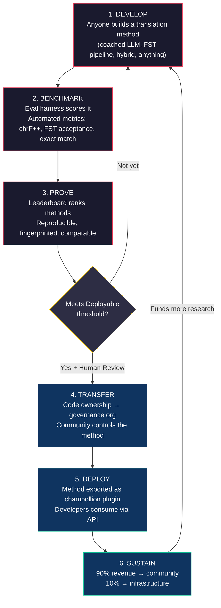
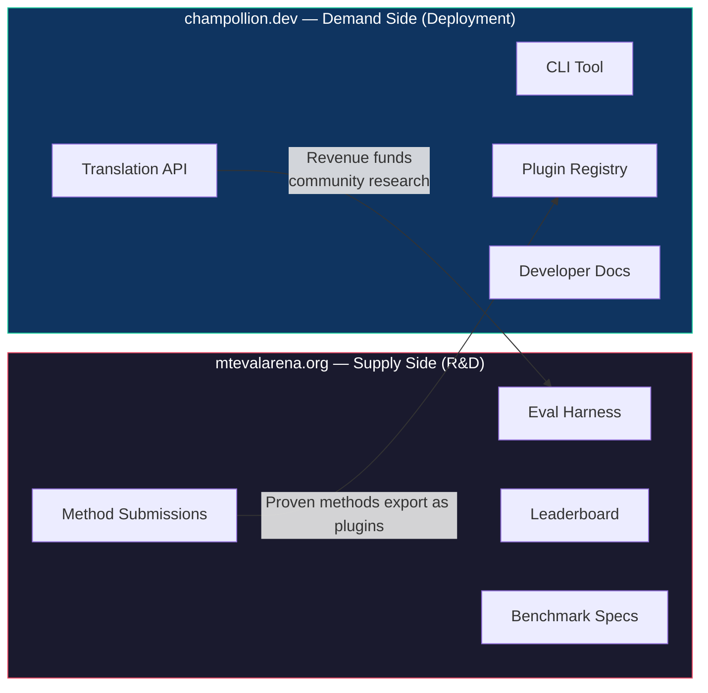
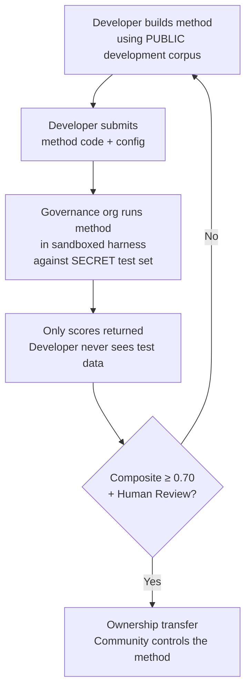

# كيف يعمل النظام: التعهيد الجماعي التنافسي للترجمة الآلية

> **ملخص تنفيذي.** الترجمة الآلية للغات العالم محدودة الموارد — بما فيها نحو 1,300 لغة يدّعي نموذج OMT-1600 من Meta تغطيتها ولكن بمستويات جودة دون أي حد قابل للاستخدام — ليست مشكلة تدريب نماذج، بل هي مشكلة *بنية تحتية*. لن يحلها نموذج واحد أو مختبر واحد أو شركة واحدة. تصف هذه الوثيقة بنية منصة تحوّل المجتمع العالمي من مهندسي تعلم الآلة واللغويين والمتحدثين باللغات إلى مختبر بحثي موزّع: يبني أي شخص طريقة ترجمة، وتُثبت المنصة ما إذا كانت تعمل بالاختبار مقابل بيانات تقييم سيادية، وتُنشر الطرق المُثبتة في بيئة الإنتاج مع تدفق العائدات إلى المجتمعات التي تخدم لغاتها. والآلية هي التعهيد الجماعي التنافسي مع السيادة التشفيرية — وهو مزيج لم تجرِ محاولته من قبل.

---

> [!IMPORTANT]
> **النطاق.** تقيّم هذه المنصة **ترجمة النصوص المكتوبة الرسمية** — الوثائق، والمواد التعليمية، والمراسلات الرسمية، ونصوص واجهات المستخدم. وهي ليست روبوت محادثة، ولا مترجمًا فوريًا، ولا نظامًا حواريًا غير مقيّد المجال. تُرتب لوحة المتصدرين طرق الترجمة بالاختبار مقابل متون متوازية منسّقة في مجالات نصية محددة (انظر [Benchmark Specification §2.7](/docs/specifications/benchmark#27-domain) للاطلاع على تصنيف المجالات). الترجمة الآلية هي بنية تحتية لإحياء اللغات، وليست بديلاً عنه. يتعلم الأطفال اللغة من البشر، لا من الآلات.

### تغطية المجالات الحالية

| المجال | تغطية المستويات | الحالة | ملاحظات |
|--------|--------------|--------|-------|
| رسمي / حكومي | المستويات 1–5 | نشط | متن EdTeKLA |
| تعليمي / كتب مدرسية | المستويات 1–4 | نشط | متن EdTeKLA |
| سردي / أدبي | محدود | مخطَّط له | بعض المدخلات في المعيار الذهبي |
| ديني / نصوص مقدسة | للمرجعية فقط | لا يُقيَّم | FLORES+ (مجال الكتاب المقدس)؛ لا يُستخدم في التقييم الرسمي |
| محادثة | خارج النطاق | بحسب التصميم | يقيّم هذا النظام النصوص المكتوبة، لا الكلام المنطوق |
| تقني / علمي | خارج النطاق | مستقبلي | يتطلب التحقق من المصطلحات الخاصة بالمجال |

## 1. المشكلة: الترجمة الآلية ≠ تعلم الآلة

تُؤطَّر الترجمة الآلية للغات منخفضة الموارد (LRLs) عادةً على أنها مشكلة تعلم آلة: اجمع البيانات، درّب نموذجًا، انشره. هذا الإطار خاطئ، والخطأ له عواقب — فهو يوجّه التمويل والمواهب والبنية التحتية نحو نهج لا يمكنه، بنيويًا، أن ينجح مع أغلبية لغات العالم.

### 1.1 لماذا يفشل إطار تعلم الآلة

تتطلب سلسلة تعلم الآلة القياسية للترجمة الآلية ثلاثة أشياء: متونًا متوازية كبيرة، ومعايير تقييم مُتحقَّقًا منها، ومسارًا للنشر. وبالنسبة لنحو 130 لغة تخدمها Google Translate ونحو 200 لغة يغطيها NLLB-200، تتوفر العناصر الثلاثة. أما بالنسبة لنحو 1,300 لغة إضافية يدّعي OMT-1600 تغطيتها، فبيانات التقييم موجودة لكن جودتها في معظمها دون الحدود القابلة للاستخدام، وأوزان النموذج غير متاحة للعموم، ولا توجد سلسلة نشر. أما بالنسبة للغات المتبقية البالغ عددها أكثر من 5,400 لغة، فلا يوجد شيء من ذلك على الإطلاق.

| المتطلب | اللغات عالية الموارد | تغطية OMT-1600 (نحو 1,300 لغة منخفضة الموارد) | اللغات المتبقية (نحو 5,400) |
|-------------|------------------------|-------------------------------|---------------------------|
| **المتون المتوازية** | ملايين أزواج الجمل (Europarl وUN Corpus وOpenSubtitles) | نصوص ثنائية من مجال الكتاب المقدس، ومحتوى مستخرج من الويب، وترجمة عكسية اصطناعية. لا توجد بيانات منسّقة مجتمعيًا. | مئات إلى آلاف قليلة، إن وُجدت |
| **معايير التقييم** | WMT وFLORES وNTREX — موحّدة وقابلة لإعادة الإنتاج | BOUQuET (مجال الكتاب المقدس) وmet-BOUQuET. لا تحقق صرفي. لا تقييم مستقل. | لا معايير قياسية؛ تقييم اجتهادي |
| **مسار النشر** | Google Translate وDeepL وAzure — واجهات برمجية تجارية | أوزان النموذج غير منشورة. لا واجهة سطر أوامر، ولا نظام إضافات، ولا واجهة برمجية قابلة للنشر مجتمعيًا. | لا شيء. لا واجهة برمجية، ولا منتج، ولا سوق. |

ينجح نهج تعلم الآلة عندما تتوفر بيانات للتدريب وسوق للنشر. لقد وسّع OMT-1600 الشرط الأول بشكل كبير — لكن التوسع دون تحقق مستقل من الجودة، أو تحقق صرفي، أو حوكمة مجتمعية هو توسع بلا ثقة. المشكلة ليست فقط "نحتاج إلى نموذج أفضل" — بل "نحتاج إلى بنية تحتية تثبت أن النموذج يعمل، وفق شروط يتحكم فيها المجتمع."

### 1.2 ما تتطلبه فعليًا الترجمة الآلية للغات محدودة الموارد

الترجمة للغات محدودة الموارد ليست في الأساس مشكلة تدريب. إنها مشكلة **هندسة طرق** — أي تحدي تجميع الموارد المتاحة (النماذج اللغوية الكبيرة، والأدوات الصرفية، والمعرفة المجتمعية، والقواعد اللغوية) في سلاسل ترجمة عاملة، ثم إثبات نجاحها عبر تقييم دقيق.

وهذا التمييز مهم:

| البُعد | نهج تعلم الآلة | نهج هندسة الطرق |
|-----------|------------|---------------------------|
| **النشاط الأساسي** | تدريب نموذج على البيانات | الجمع بين الأدوات والتلقينات والمعرفة اللغوية في سلسلة معالجة |
| **عنق الزجاجة** | حجم البيانات المتوازية | الإبداع الهندسي + البنية التحتية للتقييم |
| **مَن يمكنه المساهمة** | فرق تمتلك عناقيد وحدات معالجة رسومات ومجموعات بيانات | أي شخص لديه مفتاح واجهة برمجية وقاموس وفكرة |
| **التقييم** | BLEU/chrF على مجموعات اختبار محجوزة | تحقق صرفي + مراجعة بشرية + مقاييس آلية |
| **النشر** | تقديم النموذج كخدمة | تغليف الطريقة كإضافة |

تحتوي النماذج اللغوية الكبيرة الحديثة بالفعل على معرفة كامنة بالعديد من اللغات منخفضة الموارد — بما يكفي لإنتاج مخرجات *تبدو* معقولة. المشكلة هي أن هذه المخرجات غالبًا ما تكون غير صحيحة صرفيًا (يهلوس النموذج صيغًا للكلمات لا وجود لها في اللغة). والتحدي الهندسي هو: كيف تستخرج ما يعرفه النموذج اللغوي الكبير، وتتحقق منه مقابل الواقع اللغوي، وتغلّف النتيجة للاستخدام في الإنتاج؟

لهذا السبب نقيس أداء **الطرق**، وليس النماذج. الطريقة هي الوصفة الكاملة: اختيار النموذج + هندسة التلقين + استخدام الأدوات + المعالجة القبلية/البعدية + بيانات التوجيه + استراتيجيات إعادة المحاولة. فريقان يستخدمان النموذج نفسه بطريقتين مختلفتين سيحصلان على درجتين مختلفتين. وهذا هو المقصود تحديدًا.

### 1.3 لماذا تكسر اللغات متعددة التركيب كل شيء

كثير من أكثر لغات العالم حرمانًا من الموارد هي لغات **متعددة التركيب** (polysynthetic) — فهي تُرمّز جملاً كاملة في كلمات مفردة عبر عمليات صرفية منتجة. تأمّل كلمة Plains Cree التالية:

> **ê-kî-nitawi-kîskinwahamâkosiyân**
> *"عندما ذهبتُ إلى المدرسة"*

كلمة واحدة. وهي تُرمّز الزمن (الماضي)، والاتجاه (الذهاب إلى)، والجذر (تعلَّم)، والصيغة (مبني للمجهول/انعكاسي)، والشخص (المفرد المتكلم). تحتاج الإنجليزية إلى ست كلمات لما تعبّر عنه لغة Cree بكلمة واحدة.

وهذا يكسر الترجمة الآلية القياسية على كل المستويات:

- **التقطيع (Tokenization)** — تمزّق خوارزميات BPE وSentencePiece الكلمات متعددة التركيب إلى شذرات بلا معنى، لأنها صُممت للصرف الإلصاقي التسلسلي.
- **الهلوسة** — تنتج النماذج اللغوية الكبيرة سلاسل تبدو معقولة لكنها ليست كلمات صحيحة. ولا يستطيع غير المتحدث التمييز بينها. ودون تحقق صرفي، تظل الهلوسات غير مرئية.
- **التقييم** — تعاقب المقاييس على مستوى الكلمة (BLEU) التنوع الصرفي الطبيعي الذي يشكّل جوهر طريقة عمل هذه اللغات. أما المقاييس على مستوى الحروف (chrF++) فهي أفضل لكنها تبقى غير كافية دون تحقق بنيوي.

الحل ليس نموذجًا أكبر أو مزيدًا من بيانات التدريب. بل **بنية تحتية تلتقط الهلوسات قبل وصولها إلى المستخدمين** — محللات صرفية (FSTs) تستطيع أن تقول بشكل قاطع: "هذه ليست كلمة في هذه اللغة."

---

## 2. لماذا لا تنجح المقاربات القائمة

### 2.1 الترجمة الآلية التجارية

دأبت خدمات الترجمة التجارية تاريخيًا على التحسين لصالح حجم السوق. ويمثل OMT-1600 من Meta (مارس 2026) تحولاً كبيرًا — 1,600 لغة في نظام واحد. ولكن بالنسبة لنحو 1,300 لغة في أدنى مستويات الموارد لديها، تظل الجودة دون الحدود القابلة للاستخدام، وأوزان النموذج غير متاحة، ولا توجد سلسلة نشر. لقد تطورت مشكلة الحوافز البنيوية: تستطيع شركات التقنية الكبرى الآن بناء نماذج للغات منخفضة الموارد، لكن دون تقييم مستقل أو تحقق صرفي أو حوكمة مجتمعية، لا تكفي التغطية وحدها لحل المشكلة.

### 2.2 البحث الأكاديمي

تركّز أبحاث الترجمة الآلية الأكاديمية بشكل ساحق على أزواج اللغات عالية الموارد لأنها حيث توجد بيانات التدريب والمهام المشتركة ومنافذ النشر العلمي. أما الباحثون الذين يعملون على الأزواج منخفضة الموارد فيكافحون من أجل النشر، ومن أجل تمويل القدرة الحاسوبية، ومن أجل النشر التشغيلي — لأن البنية التحتية لنشر اللغات منخفضة الموارد غير موجودة.

### 2.3 المسابقات لمرة واحدة

يمكنك تنظيم مسابقة على Kaggle: "الإنجليزية→Plains Cree، أفضل درجة chrF++ تفوز بـ 10,000 دولار." وإليك ما يحدث:

1. يفوز شخص ما، ويقدّم دفترًا برمجيًا، ويحصد الجائزة، ويعود إلى منزله.
2. يتآكل الدفتر في أرشيف Kaggle. لا أحد ينشره. لا أحد يصونه.
3. تُنشر مجموعة الاختبار في نهاية المطاف — فتُلوَّث إلى الأبد.
4. تكون منظمة الحوكمة قد رفعت بياناتها اللغوية إلى بنية Google التحتية وفق شروط خدمة Google، دون أي تحكم حقيقي في دورة حياتها.
5. لا جسر للنشر. الدفتر البرمجي الفائز ليس واجهة برمجية عاملة.

المكافأة لمرة واحدة تجذب صائدي المكافآت. أما لوحة المتصدرين المستمرة مع حوكمة مجتمعية فتولّد انخراطًا مستدامًا.

### 2.4 الضبط الدقيق

الضبط الدقيق لنموذج مفتوح على نصوص متوازية هو نهج تعلم الآلة البديهي. ولكن بالنسبة لمعظم اللغات منخفضة الموارد، فإن المتن المتوازي اللازم للضبط الدقيق هو بالضبط البيانات التي لا توجد — وإنشاؤها يتطلب نفس المتحدثين ثنائيي اللغة والانخراط المجتمعي الذي يُفترض أن يحل الضبط الدقيق محله. لا يمكنك تجاوز مشكلة ندرة البيانات بتقنية تتطلب بيانات.

---

## 3. الحل: التعهيد الجماعي التنافسي مع التقييم السيادي

تقلب المنصة النهج التقليدي: فبدلاً من أن يبني فريق واحد نموذجًا واحدًا، **يتنافس المجتمع العالمي على بناء أفضل طريقة ترجمة**، وتُثبت المنصة ما إذا كانت تعمل، وتُنشر الطرق المُثبتة في الإنتاج مع احتفاظ المجتمع اللغوي بالملكية والتحكم.

### 3.1 الحلقة الكاملة

لكل مرحلة وظيفة محددة:

| المرحلة | ما يحدث | المستفيد |
|-------|-------------|--------------|
| **التطوير** | يبني باحث أو طالب أو هاوٍ طريقة ترجمة باستخدام أي أدوات يريدها — تلقين النماذج اللغوية الكبيرة، أو سلاسل FST، أو القواميس، أو النماذج المضبوطة بدقة، أو الأنظمة القائمة على القواعد، أو الأنظمة الهجينة | يتعلم المساهم ويجرّب وينشر |
| **القياس المعياري** | يحتسب إطار التقييم درجة الطريقة مقابل متن موحّد بمقاييس قابلة لإعادة الإنتاج. كل تشغيل ينتج [بطاقة تشغيل](/docs/specifications/benchmark#3-run-card-schema) — سجلاً كاملاً لما اختُبر وكيف كان أداؤه | يحصل الباحثون على نتائج قابلة لإعادة الإنتاج والمقارنة |
| **الإثبات** | تظهر النتائج على لوحة المتصدرين العامة. تُرتّب الطرق وتُقارن وتُمحّص. ويرى المجتمع ما ينجح وما لا ينجح | يكتسب الجميع رؤية لأحدث ما توصلت إليه التقنية |
| **النقل** | بالنسبة للغات الشعوب الأصلية، تُنقل ملكية الشيفرة المصدرية للطرق التي تبلغ عتبة القابلية للنشر (composite ≥ 0.70) **و** تجتاز التحقق البشري إلى منظمة الحوكمة الخاصة بالمجتمع اللغوي | يكتسب المجتمع أصلاً مدرًّا للعائدات |
| **النشر** | تُصدَّر الطريقة كإضافة [champollion](https://github.com/gamedaysuits/champollion) وتُقدَّم عبر واجهة برمجية. يستهلك المطورون الترجمات دون الحاجة إلى فهم الطريقة الكامنة | يحصل المطورون على ترجمة للغات لا تخدمها الواجهات البرمجية التجارية |
| **الاستدامة** | تُقسَّم عائدات الواجهة البرمجية: 90% للمجتمع، و10% للبنية التحتية. تموّل العائدات مزيدًا من البحث اللغوي وتطوير المتون والبرامج المجتمعية | تستمر الدورة ذاتيًا بعد التأسيس الأولي |

### 3.2 لماذا تنجح الديناميكيات التنافسية

المنافسة ليست عَرَضية — بل هي الآلية ذاتها. وإليك السبب:

**تنوع المقاربات.** قد تكون أفضل طريقة للإنجليزية→Plains Cree نموذجًا لغويًا كبيرًا موجّهًا ومحكومًا بـ FST. وقد تكون الأفضل للإنجليزية→Quechua سلسلة معززة بالقواميس. وقد تكون الأفضل للإنجليزية→Inuktitut نموذجًا مضبوطًا بدقة منطلقًا من متن Nunavut Hansard. لن يهيمن فريق أو نهج واحد على جميع اللغات. تكشف لوحة المتصدرين أي *أنواع* من المقاربات تنجح مع أي *أنواع* من اللغات — وهي نتيجة وصفية تمثّل بحد ذاتها إسهامًا بحثيًا.

**الانخراط المستدام.** لوحة المتصدرين لا تكتمل أبدًا. هناك دائمًا من يريد تجاوز أعلى درجة. وكل تقديم يتبرع بقدرة حاسوبية وجهد فكري للمشكلة. وعلى عكس المنحة لمرة واحدة، تولّد الديناميكية التنافسية استثمارًا بحثيًا مستمرًا من المجتمع العالمي.

**حاجز دخول منخفض.** تحتاج إلى مفتاح واجهة برمجية وقاموس وفكرة. إطار التقييم مفتوح المصدر. وصيغة المتن هي JSON بسيطة. يمكن لطالب لسانيات أن ينافس مختبرًا غني الموارد — وأن يفوز أحيانًا، لأن المعرفة بالمجال (فهم اللغة) قد تفوق الموارد الحاسوبية أهمية.

**جسر النشر.** الطريقة نفسها التي تحقق درجة جيدة في إطار التقييم تُنشر في الإنتاج بتغيير واحد في الإعدادات. "أثبتها هنا، وانشرها هناك." هذه هي الفجوة التي لا تجسرها Kaggle ولا مهام WMT المشتركة ولا المنشورات الأكاديمية.

### 3.3 بنية المنصة

ينقسم النظام البيئي فعليًا إلى موقعين يخدمان جمهورين:

**[mtevalarena.org](https://mtevalarena.org)** هو ميدان الإثبات البحثي والتطويري. جمهوره مهندسو تعلم الآلة واللغويون والباحثون. كل شيء هنا يدور حول بناء طرق الترجمة واختبارها وإثباتها.

**[champollion.dev](https://champollion.dev)** هو منصة النشر. جمهوره المطورون الذين يحتاجون إلى ترجمة لتطبيقاتهم. لا يحتاجون إلى فهم كيفية عمل الطرق — يكفي أن يستدعوا الواجهة البرمجية.

والجسر بينهما هو **إضافة الطريقة**: طريقة مُثبتة، مغلّفة للنشر، مملوكة للمجتمع.

---

## 4. التقييم السيادي: لماذا تهم البنية التحتية

البنية التحتية للتقييم ليست تفصيلة تقنية — بل هي جوهر نموذج السيادة. فالتقييم القياسي (رفع مجموعة اختبارك إلى منصة مشتركة) لا يصلح للغات الشعوب الأصلية لأنه يتنازل عن التحكم في البيانات اللغوية.

### 4.1 آلية السيادة

لا يرى المطور أبدًا بيانات التقييم ذات المعيار الذهبي. فهو يطوّر مقابل متن تطوير عام، ثم يقدّم شيفرة طريقته إلى منظمة الحوكمة، التي تشغّلها في بيئة معزولة مقابل مجموعة الاختبار السرية. ولا تعود إليه سوى الدرجات. وهذا ليس مجرد أمان — بل هو تنفيذ مباشر لمبادئ **OCAP®** (الملكية، والتحكم، والوصول، والحيازة) التي تتطلبها حوكمة بيانات الشعوب الأصلية.

### 4.2 لماذا لا يمكن تشغيل هذا على منصة طرف آخر

على Kaggle، ترفع منظمة الحوكمة بياناتها اللغوية إلى بنية Google التحتية وفق شروط خدمة Google. لا تستطيع إلغاء الوصول وفق جدولها الزمني الخاص. ولا تستطيع إرفاق شروط قانونية مخصصة (مثل نقل الملكية) بالتقديمات. وليس لديها أي ضمان تشفيري بأن البيانات لن تُستخدم لأغراض أخرى. سيادة البيانات تعني أن المجتمع يتحكم في نقطة نهاية التقييم، ويحتفظ بالمفاتيح، ويستطيع إيقافها متى شاء.

---

## 5. فلسفة التقييم: Microeval وLYSS

صُممت مقاييس الترجمة الآلية القياسية (BLEU وchrF++ وCOMET) للتعميم عبر اللغات. وهذه العمومية هي مكمن قوتها — ونقطتها العمياء. فبالنسبة للغات متعددة التركيب، يمكن لكلمة غير صحيحة صرفيًا تشترك في تسلسلات حرفية (n-grams) مع النص المرجعي أن تحقق درجة جيدة في chrF++ بينما يدركها أي متحدث بوصفها كلامًا مبهمًا.

**تطوير Microeval** يعني بناء مقاييس تقييم مصممة خصيصًا للغات محددة باستخدام أفضل الأدوات اللغوية المتاحة. ويسمى الإطار **LYSS** (Linguistically-informed Yield & Structural Scoring):

| المكوّن | ما يقيسه | الأداة | الحالة |
|-----------|-----------------|------|--------|
| **LYSS-fst** | الصحة الصرفية | محوّل الحالات المنتهية (Finite-state transducer) | ✅ منفَّذ (Plains Cree) |
| **LYSS-eq** | التكافؤ اللغوي | قواعد المتغيّرات المنسّقة من قبل لغويين | ✅ منفَّذ (Plains Cree) |
| **LYSS-sem** | الحفاظ على الدلالة | نماذج دلالية خاصة باللغة | ✅ منفَّذ (Plains Cree) |

تعمل المقاييس العامة (chrF++ وBLEU) كخطوط أساس وكإشارات رئيسية للغات التي لا تتوفر لها أدوات LYSS. وحيثما توجد أدوات خاصة باللغة، تحمل مكونات LYSS وزن التقييم — لأن ما يهم أكثر في كل لغة هو ما لا تستطيع قياسه إلا الأدوات الخاصة بتلك اللغة.

للاطلاع على مواصفة LYSS الكاملة ومنطق الدرجة المركبة، انظر [SCORING_SPEC.md §4](/docs/specifications/scoring#4-composite-score).

> [!WARNING]
> **قابلية المقارنة بين عمليات التشغيل.** عند مقارنة عمليات تشغيل تختلف في توفر المقاييس (مثلاً، تشغيل يتضمن درجات FST وآخر لا يتضمنها)، لا تكون درجات composite قابلة للمقارنة المباشرة. تُعيّر الدرجة المركبة وفق المقاييس المتاحة، لكن تشغيلاً مُقيَّمًا على 5 مقاييس يحمل معلومات أكثر من تشغيل مُقيَّم على 2. وتشير لوحة المتصدرين إلى تغطية المقاييس لكل مدخل.

---

## 6. من يخدم هذا النظام

### لمهندسي تعلم الآلة والباحثين

لوحة متصدرين مفتوحة بمعايير قياس موحّدة لأزواج لغوية لا تغطيها أي مهمة مشتركة. أعد إنتاج أي نتيجة باستخدام إطار التقييم. انشر طريقتك. تجاوز أعلى درجة. كل تقديم يحمل بصمة لتكوين محدد وإصدار محدد من مجموعة البيانات — لا غموض حول ما اختُبر.

### للمجتمعات اللغوية

ملكية وتحكم في تقنية الترجمة المبنية للغتك. تعني الديناميكية التنافسية أن فرقًا متعددة تعمل على لغتك في آن واحد — فتستفيد منها جميعًا وتمتلك النتيجة. وتموّل عائدات استخدام الواجهة البرمجية البرامج المجتمعية وفق شروطك أنت.

### للممولين ومراجعي المنح

مقاييس شفافة وقابلة لإعادة الإنتاج لتقييم مقترحات أبحاث الترجمة. نتائج قابلة للقياس تتجاوز المنشورات: استخدام الواجهة البرمجية، والعائدات المحققة، ومقاييس الجودة عبر الزمن، والتغطية اللغوية. طريقة ناجحة واحدة تنشئ مصدر دخل مستدامًا ذاتيًا — فيتضاعف أثر المنحة بدلاً من أن ينتهي بانتهاء التمويل.

### للمطورين

ترجمة للغات لا تخدمها أي واجهة برمجية تجارية. أمر واحد في سطر الأوامر (`npx champollion sync`) يترجم ملفات اللغة لديك باستخدام طرق أثبت المجتمع جدواها. استخدم Google Translate للفرنسية، ونموذجًا لغويًا كبيرًا موجّهًا للغة Plains Cree، وواجهة برمجية مجتمعية للغة Quechua — كلها في المشروع نفسه، وكلها بالواجهة نفسها.

### للطلاب

تحدٍ مفتوح ذو أثر واقعي. ابنِ طريقة ترجمة للغة محدودة الموارد، وقِس أداءها معياريًا، وانشر نتائجك. البنية التحتية مجانية، ومجموعات البيانات مفتوحة، ولوحة المتصدرين لا تكترث إن كنت في إحدى أفضل عشر جامعات أو تعمل من طرفية في مكتبة عامة.

---

## 7. السياق الاجتماعي والتقني

### 6.1 إحياء اللغات يتسارع

تتنامى جهود إحياء اللغات حول العالم. فمدارس الانغماس اللغوي، وأعشاش اللغة المجتمعية، ومشاريع الأرشفة الرقمية تتوسع في مجتمعات الشعوب الأصلية في كندا والولايات المتحدة وأستراليا ونيوزيلندا وشمال أوروبا. وتحتاج هذه الجهود إلى التقنية — وتحديدًا، تقنية ترجمة تحترم سيادة المجتمع على بياناته اللغوية.

### 6.2 النماذج اللغوية الكبيرة غيّرت خط الأساس

قبل عام 2023، كان بناء أي قدرة ترجمة آلية للغة متعددة التركيب يتطلب خبرة كبيرة في معالجة اللغات الطبيعية، وتدريب نماذج مخصصة، وميزانيات حاسوبية ضخمة. وقد غيّرت النماذج اللغوية الكبيرة الحديثة خط الأساس: يمكن لتلقين متقَن مع بيانات توجيه وتحقق صرفي أن ينتج ترجمات قابلة للاستخدام لبعض الأزواج اللغوية — دون أي تدريب. وهذا يخفّض حاجز الدخول إلى تطوير الطرق بشكل كبير. لقد تحولت المشكلة من "كيف نبني نموذجًا؟" إلى "كيف نبني سلسلة معالجة تتحقق مما ينتجه النموذج وتصححه؟"

### 6.3 ثقافة القياس المعياري مفتوح المصدر

أصبح القياس المعياري للذكاء الاصطناعي ثقافة قائمة بذاتها. لوحات المتصدرين تدفع الابتكار. والمسابقات تجذب المواهب. فمنصات Chatbot Arena وLMSYS وHugging Face Open LLM Leaderboard تُظهر أن التقييم التنافسي يحرّك التقدم السريع. نحن نأخذ تلك الطاقة ونوجّهها نحو الترجمة لآلاف اللغات التي إما لا توجد لها ترجمة آلية تجارية، أو لم يُثبت بشكل مستقل أنها تعمل.

### 6.4 سيادة بيانات الشعوب الأصلية أمر غير قابل للتفاوض

مبادئ OCAP® (الملكية، والتحكم، والوصول، والحيازة)، ومبادئ CARE (المنفعة الجماعية، وسلطة التحكم، والمسؤولية، والأخلاقيات)، وأطر مثل Te Mana Raraunga (سيادة بيانات الماوري) ليست إضافات اختيارية — بل هي متطلبات بنيوية لأي تقنية تمس الموارد اللغوية للشعوب الأصلية. وتنفّذ بنيتنا التحتية للتقييم هذه المبادئ معماريًا، لا كمجرد بيانات سياسات.

---

## 8. التوترات والقيود

يستخدم هذا المشروع آلية غربية — القياس المعياري التنافسي — لخدمة منظومات معرفية كثيرًا ما تكون جماعية وعلائقية وموجَّهة من كبار السن. هذا التوتر حقيقي ويجب تسميته صراحة، لا حله بالادعاء.

**القياس المعياري في مقابل المعرفة الجماعية.** ترتّب لوحات المتصدرين الأفراد وتحسّن الدرجات العددية. أما تقاليد معارف الشعوب الأصلية فتؤكد على السلطة العلائقية، والتصحيح الجماعي، والمشروعية المبنية على العلاقات. لا يمكننا الادعاء بخدمة هذه المنظومات المعرفية بينما نبني منصة آليتها الجوهرية هي التحسين التنافسي الفردي. إن بنية السيادة (§4) — حيث تمتلك المجتمعات الطرق، وتتحكم في التقييم، وتقرر ما يُنشر — هي ردنا البنيوي، لكنها لا تذيب التوتر. فلوحة المتصدرين تظل لوحة متصدرين.

**ما نفعله حيال ذلك.** تدعم المنصة التقديمات من الفرق والمجتمعات إلى جانب التقديمات الفردية. وتُؤطّر لوحة المتصدرين النتائج بوصفها "أحدث ما توصلت إليه التقنية حاليًا" لا "من يفوز". ومنظمة الحوكمة — لا درجة لوحة المتصدرين — هي التي تحدد ما يُنشر. ولا تخوّل أي درجة آلية أي مطور أي حق؛ المجتمع هو من يقرر. ونحافظ على حلقة استشارية مستمرة مع المجتمعات الشريكة حول ما إذا كان إطار المنصة وبنية حوافزها يخدمانها. وإن لم يكن الأمر كذلك، فإننا نغيّره.

**الترجمة الآلية ليست إحياءً لغويًا.** تحوّل الترجمة النصوص بين اللغات. أما الإحياء فيُنشئ متحدثين جددًا. نظام ترجمة آلية مثالي لا يحل مشكلة الانتقال بين الأجيال، ولا مشكلة المكانة، ولا المشكلة التربوية. بل قد يولّد وهم أن "الحاسوب يستطيع التحدث باللغة"، فيقوّض إلحاحية النقل البشري. نحن نبني الترجمة الآلية بوصفها بنية تحتية — ترجمة مسوّدة للتحرير اللاحق، وأدوات صرفية لتطبيقات تعلم اللغة، ونفوذًا سياسيًا للمجتمعات التي تطالب بخدمات بلغتها — لا بديلاً عن النقل بين الأجيال. والمجتمع هو من يتحكم في ما إذا كانت التقنية ستُنشر ومتى وكيف.

هذا القسم موجود لأن هذه التوترات حُددت في نقد بناءً على دعوة (مايو 2026)، وقد التزمنا بتسميتها علنًا بدلاً من دفنها في وثائق داخلية.

> [!NOTE]
> **درجات لوحة المتصدرين هي مؤشرات تقريبية آلية.** جميع الدرجات المعروضة على لوحة المتصدرين هي قياسات آلية يحتسبها إطار التقييم في ظروف خاضعة للتحكم. وهي تشير إلى الأداء النسبي للطرق لكنها لا تشكّل ضمانات للجودة. وتُميَّز الطرق المُتحقَّق منها مجتمعيًا بشكل منفصل. لا تخوّل أي درجة آلية أي مطور حق النشر — منظمة الحوكمة هي من يتخذ ذلك القرار.

---

## 9. الوضع الحالي

### ما هو موجود اليوم

- **champollion** — أداة سطر أوامر جاهزة للإنتاج. 10 طرق ترجمة، وإعدادات لكل زوج لغوي، وبوابات جودة، و5 صيغ ملفات. [منشورة على npm](https://www.npmjs.com/package/champollion).
- **MT Eval Harness** — إطار تقييم عامل. مقاييس chrF++ وقبول FST والمطابقة التامة منفَّذة. مخطط بطاقة التشغيل مكتمل. البصمة الرقمية والتحقق من السلامة يعملان.
- **EDTeKLA Dev v1** — متن تقييم للغة Plains Cree ‏(CC BY-NC-SA 4.0)، مستمد من مجموعة أبحاث EdTeKLA في جامعة Alberta. يضم متن الكتب المدرسية 486 مدخلاً (436 للتطوير + 50 محجوزة)، إضافة إلى 62 زوجًا منفصلاً من المعيار الذهبي من itwêwina (المجموع 548). متن التطوير القانوني هو `textbook_dev.json` بـ 436 مدخلاً — وهو قسم التطوير الكامل من متن الكتب المدرسية.
- **FLORES+ Devtest** — ‏1,012 جملة × 39 لغة (CC BY-SA 4.0).
- **موقع Arena** — موقع توثيق مبني على Docusaurus يتضمن لوحة متصدرين ومواصفات ودروسًا تعليمية وإطار سيادة.
- **Benchmark Specification** — [المواصفة القانونية](/docs/specifications/benchmark) التي تحدد مخطط المتن، وصيغة بطاقة التشغيل، وبروتوكول التقييم. لتعريفات المقاييس وأوزان composite ومستويات الجودة، انظر [SCORING_SPEC.md](/docs/specifications/scoring).

### ما هو قادم

| المرحلة | المحتوى | الحالة |
|-------|------|--------|
| المسح الأساسي | 12 نموذجًا × 3 درجات حرارة × 2 من إعدادات التوجيه على EDTeKLA | 🔲 مخطَّط له |
| الدرجة المركبة | تنفيذ المقاييس الموزونة في إطار التقييم | ✅ منجَز |
| الدرجة الدلالية | درجة موزونة بالأحكام من CrkSemanticMetric (معيار التقييم) | ✅ منجَز |
| الدقة الصرفية | تقييم على مستوى المورفيم مقابل تحليل ذي معيار ذهبي | 🔲 مخطَّط له |
| المطابقة المكافئة | مطابقة فئات المتغيرات عبر CrkLinterMetric (معيار التقييم) | ✅ منجَز |
| Champollion API | واجهة برمجية محتسبة الاستخدام للطرق المملوكة مجتمعيًا | 🔲 مخطَّط له |
| لغة ثانية | التوسع إلى زوج لغوي ثانٍ (Inuktitut أو Quechua أو Sámi) | 🔲 مخطَّط له |

---

## 10. البدء

**ابنِ طريقة:** استنسخ [إطار التقييم](https://github.com/gamedaysuits/arena)، وشغّل تجربة أساسية، وانظر أين تقع على لوحة المتصدرين.

**ساهم بمتن:** إذا كنت تتحدث لغة محدودة الموارد، فحتى 50 زوج ترجمة منسّقًا تكفي لفتح مسار جديد على لوحة المتصدرين. انظر [للمجتمعات اللغوية](https://mtevalarena.org/docs/community/for-language-communities).

**انشر الترجمات:** ثبّت [champollion](https://github.com/gamedaysuits/champollion) وترجم تطبيقك باستخدام `npx champollion sync`.

**موّل الجهد:** انظر [النموذج الاقتصادي](https://mtevalarena.org/docs/sovereignty/economic-model) للاطلاع على أطر التكاليف وتوقعات الاستدامة.

---

## انظر أيضًا

- **[Benchmark Specification](/docs/specifications/benchmark)** — صيغة المتن، ومخطط بطاقة التشغيل، وبروتوكول التقييم، والسيادة
- **[Scoring Specification](/docs/specifications/scoring)** — المقاييس، وأوزان composite، ومستويات الجودة، وصيغ التكلفة/السرعة
- **[MT Eval Arena](https://mtevalarena.org)** — ميدان الإثبات البحثي والتطويري
- **[champollion](https://github.com/gamedaysuits/champollion)** — منصة النشر
- **[ادعم لغة منخفضة الموارد](https://mtevalarena.org/docs/community/low-resource-languages)** — استكشاف معمّق لتحديات ومقاربات الترجمة الآلية للغات متعددة التركيب

---

*هذه الوثيقة هي نقطة الدخول لأي شخص يتعرف على المشروع لأول مرة. للاطلاع على المواصفة التقنية الكاملة، انظر [BENCHMARK_SPEC.md](/docs/specifications/benchmark) (البروتوكول) و[SCORING_SPEC.md](/docs/specifications/scoring) (المقاييس).*