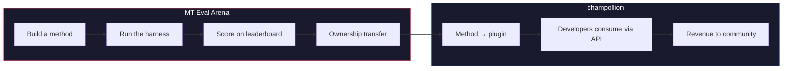

# The MT Eval Arena

> **ملخص تنفيذي.** المنصة MT Eval Arena هي منصة مفتوحة لقياس أداء أساليب الترجمة الآلية، مع التركيز على اللغات التي إما لا تتوفر لها ترجمة آلية تجارية أو لم يتم التحقق من جودتها بشكل مستقل. توفر المنصة تقييماً موحداً، ولوحة صدارة عامة، وجسراً للنشر في بيئة الإنتاج عبر champollion. وبالنسبة للغات الشعوب الأصلية، تنتقل ملكية الأساليب المُثبتة إلى المجتمع اللغوي.

ساحة اختبار مفتوحة لأساليب الترجمة الآلية — وخصوصاً للغات التي إما لا تتوفر لها ترجمة آلية تجارية أو لم يتم التحقق من جودتها بشكل مستقل.

ابنِ أسلوباً. قِس أداءه. أثبت فعاليته. وإذا فاز، يتم نشره.

---

## المشكلة

تدعم Google Translate نحو 130 لغة. وتغطي NLLB-200 من Meta نحو 200 لغة، بينما تدّعي OMT-1600 (مارس 2026) تغطية 1,600 لغة. لكن هناك أكثر من 7,000 لغة منطوقة على وجه الأرض. وبالنسبة لنحو 1,300 لغة في أدنى مستويات الموارد لدى OMT-1600، فإن أوزان النموذج غير متاحة، والجودة دون عتبات الاستخدام الفعلي، وقد اعتمد التقييم على نصوص من نطاق الكتاب المقدس مع مقاييس آلية قياسية — دون تحقق صرفي، ودون اختبار مستقل، ودون حوكمة مجتمعية. أما بالنسبة لنحو 5,400 لغة المتبقية، فلا يُنتج أي نموذج مُدرَّب مسبقاً أي مخرجات على الإطلاق.

تستثمر شركات التقنية الكبرى الآن في تغطية اللغات منخفضة الموارد (LRL) — لكن التغطية دون تحقق مستقل من الجودة، أو تحقق صرفي، أو حوكمة مجتمعية، هي تغطية بلا ثقة. فالمتحدثون الأكثر حاجة إلى أدوات الترجمة هم أنفسهم المجتمعات الأقل حظاً في أن تُبنى لهم هذه الأدوات.

**وُجدت Arena لتغيير هذا الواقع.** فهي توفر البنية التحتية لتطوير أساليب الترجمة وتقييمها ونشرها لأي لغة — مع تسجيل نتائج قابل لإعادة الإنتاج، وتقديم مفتوح، وحوكمة مجتمعية تحدد من يتحكم في النتائج.

---

## كيف تعمل المنصة

1. **تبني أنت أسلوب ترجمة** — نموذج لغوي كبير موجَّه، أو نموذج مضبوط بدقة، أو خط معالجة محكوم بمحوّلات الحالة المنتهية (FST)، أو أي شيء آخر يُنتج ترجمات.
2. **يقيس إطار الاختبار أداءه** — مقاييس موحدة (chrF++، التطابق التام، قبول FST)، مع بصمة مرتبطة بـ commit محدد في Git.
3. **تظهر النتائج على لوحة الصدارة** — كل تقديم قابل لإعادة الإنتاج والمقارنة.
4. **إذا فاز، تنتقل الملكية** — بالنسبة للغات الشعوب الأصلية، تنتقل ملكية الكود الخاص بالأسلوب الفائز إلى منظمة الحوكمة المجتمعية.
5. **يُنشر الأسلوب في بيئة الإنتاج** — عبر [champollion](https://champollion.dev)، وهي واجهة برمجة التطبيقات الموجَّهة للمطوّرين. وتعود الإيرادات إلى المجتمع اللغوي.

**أثبت فعاليته هنا. وانشره هناك.**

---

## لمن هذه المنصة

| أنت... | تمنحك Arena... |
|---|---|
| **مهندس تعلم آلي / باحث** | معايير قياس موحدة، وتسجيل نتائج قابل لإعادة الإنتاج، ولوحة صدارة للتنافس عليها |
| **عالم لغويات** | إطار عمل لتحويل القواعد النحوية والقواميس إلى أساليب قابلة للاختبار |
| **عضو في مجتمع لغوي** | حوكمة على كيفية تطوير أساليب لغتك ونشرها |
| **مموّل / مراجع مِنح** | مقاييس شفافة وقابلة لإعادة الإنتاج لتقييم مقترحات أبحاث الترجمة |
| **طالب** | تحدٍّ مفتوح ذو أثر حقيقي — ابنِ أسلوباً وقدّم نتائجك |

---

## المعايير الحالية

### EDTeKLA Development Set v1
- **الزوج اللغوي:** الإنجليزية ← Plains Cree (SRO)
- **عدد الإدخالات:** 548 زوجاً منتقىً (486 من الكتب الدراسية + 62 معياراً ذهبياً)
- **الترخيص:** CC BY-NC-SA 4.0
- **المصدر:** [مجموعة EdTeKLA البحثية](https://spaces.facsci.ualberta.ca/edtekla/)، جامعة Alberta

### FLORES+ Devtest
- **الأزواج اللغوية:** الإنجليزية ← 39 لغة
- **عدد الإدخالات:** 1,012 جملة لكل لغة
- **الترخيص:** CC BY-SA 4.0
- **المصدر:** [OLDI](https://huggingface.co/datasets/openlanguagedata/flores_plus)

---

## القاعدة الوحيدة

:::danger لا تتدرب على بيانات التقييم
الأساليب التي تعرّضت لمجموعة بيانات المعيار — سواء كبيانات تدريب، أو كأمثلة few-shot، أو كإدخالات قاموسية، أو كمواد للموجِّهات — سيتم **استبعادها**. اضبط نموذجك بدقة على أي بيانات تشاء — باستثناء مجموعة الاختبار.
:::

---

## الخطوات التالية

- **[تقديم أسلوب](/docs/getting-started/submit-a-method)** — كيفية تقديم أول تشغيل لقياس الأداء
- **[مواصفات المعيار](/docs/specifications/benchmark)** — البروتوكول الكامل للتجربة
- **[قواعد لوحة الصدارة](/docs/leaderboard/rules)** — معايير التقديم وسياسات مكافحة التلاعب
- **[سيادة البيانات](/docs/sovereignty/data-sovereignty)** — مبادئ OCAP وCARE، ولماذا يهم نقل الملكية
- **[النموذج الاقتصادي](/docs/sovereignty/economic-model)** — كيف تتحول نتائج Arena إلى إيرادات للمجتمع اللغوي

**[← عرض لوحة الصدارة](https://champollion.dev/leaderboard)**