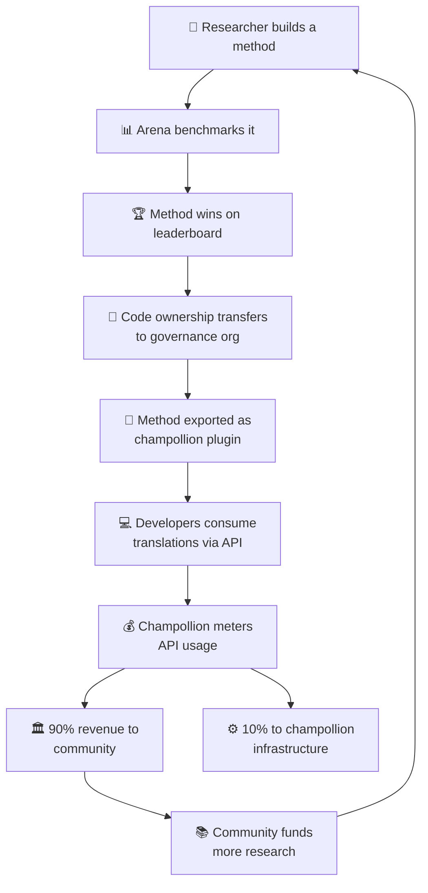

# النموذج الاقتصادي

> **ملخص تنفيذي.** تصف هذه الصفحة الحلقة الاقتصادية التي تربط بين Arena و champollion: البحث ينتج الأساليب، والأساليب تُنشر كإضافات (plugins)، واستخدام واجهة برمجة التطبيقات (API) يولّد الإيرادات، و90% من الإيرادات تتدفق إلى مجتمع اللغة. تغطي الصفحة آلية الدولاب الدوّار (flywheel)، وتقسيم الإيرادات، وطبقة التسهيل، ومبررات الاستدامة للجهات الممولة.

تشكّل Arena و champollion حلقة اقتصادية مغلقة. البحث على Arena ينتج الأساليب. والأساليب تُنشر عبر champollion. والإيرادات من champollion تعود إلى المجتمعات التي تخدم الأساليب لغاتها.

---

## الدولاب الدوّار (Flywheel)

كل دورة من دورات الدولاب الدوّار تعزز المنظومة:
- **المزيد من البحث** ينتج أساليب أفضل
- **الأساليب الأفضل** تجذب المزيد من المطورين
- **المزيد من المطورين** يولّدون المزيد من إيرادات واجهة برمجة التطبيقات (API)
- **المزيد من الإيرادات** تموّل المزيد من البحوث التي تقودها المجتمعات

---

## كيف تتدفق الإيرادات

عندما يستخدم مطوّر أسلوبًا مملوكًا لمجتمع ما عبر واجهة برمجة تطبيقات champollion:

| الخطوة | ما يحدث |
|---|---|
| يستدعي المطوّر `champollion sync` أو واجهة REST API | تُنتَج الترجمات بواسطة الأسلوب المملوك للمجتمع |
| يقيس Champollion استدعاء واجهة برمجة التطبيقات | يُتتبَّع الاستخدام لكل طلب ولكل زوج لغوي |
| تُقسَّم الإيرادات | **90%** تذهب إلى منظمة الحوكمة المالكة للأسلوب. **10%** تغطي تكاليف البنية التحتية لـ champollion. |
| يقرر المجتمع كيفية التخصيص | تموّل الإيرادات برامج اللغة، والمزيد من البحوث، وموارد المجتمع — وفقًا لما تقرره منظمة الحوكمة |

### طبقة التسهيل

يقدّم Champollion أيضًا تكوينات محسَّنة للأساليب الشائعة. إذا أثبت باحث أن Gemini 2.5 Pro مع بيانات تدريب توجيهية وإعدادات درجة حرارة (temperature) محددة ينتج أفضل النتائج لزوج لغوي معيّن، يصبح هذا التكوين متاحًا كإعداد مسبق جاهز عبر واجهة برمجة تطبيقات champollion. لا يحتاج المطورون إلى تكرار البحث — يكفيهم استدعاء واجهة برمجة التطبيقات.

تُرسي Arena الخطوط المرجعية الأساسية. ويجعلها Champollion في متناول الجميع. وتستفيد المجتمعات من كليهما.

---

## للغات القياسية

يكون تأثير الدولاب الدوّار أكبر بالنسبة للغات الشعوب الأصلية واللغات منخفضة الموارد، حيث ينطبق نموذج نقل الملكية وإيرادات المجتمع.

أما اللغات القياسية (الفرنسية واليابانية والإسبانية وغيرها)، فيقدّم لها champollion نفس تسهيلات واجهة برمجة التطبيقات دون طبقة الحوكمة — يدفع المطورون مقابل وصول مُقاس إلى أساليب ترجمة مُعدّة مسبقًا، ويحصل champollion على حصة مقابل البنية التحتية.

---

## للجهات الممولة

يعالج النموذج الاقتصادي مخاوف شائعة في تمويل تقنيات اللغة: **الاستدامة بعد انتهاء المنحة.**

| النموذج التقليدي | نموذج Arena |
|---|---|
| المنحة تموّل البحث | المنحة تموّل البحث |
| نشر الورقة البحثية | نشر الأسلوب في بيئة الإنتاج |
| انتهاء المنحة وهجر الأداة | إيرادات واجهة برمجة التطبيقات تديم العمليات |
| المجتمع لا يحصل على شيء | المجتمع يمتلك الأصل ويحقق الإيرادات |

أسلوب ناجح واحد يخلق مصدر إيرادات مستدامًا ذاتيًا. ويمكن للجهات الممولة قياس الأثر ليس بالمنشورات فحسب، بل أيضًا من خلال:
- استخدام واجهة برمجة التطبيقات (عدد المطورين الذين يستخدمون الأسلوب)
- الإيرادات المحققة (مقدار الأموال المتدفقة إلى المجتمع)
- مقاييس الجودة (درجات لوحة المتصدرين عبر الزمن)
- التغطية اللغوية (عدد الأزواج اللغوية المخدومة)

انظر [Benchmark Specification](/docs/specifications/benchmark)، §10 للاطلاع على نماذج التكلفة التفصيلية.

---

## انظر أيضًا

- [نقل الملكية](/docs/sovereignty/ownership-transfer) — عملية النقل القانونية والتقنية
- [سيادة البيانات](/docs/sovereignty/data-sovereignty) — مبادئ OCAP وCARE وTe Mana Raraunga
- [قواعد لوحة المتصدرين](/docs/leaderboard/rules) — كيف تتأهل الأساليب للنشر