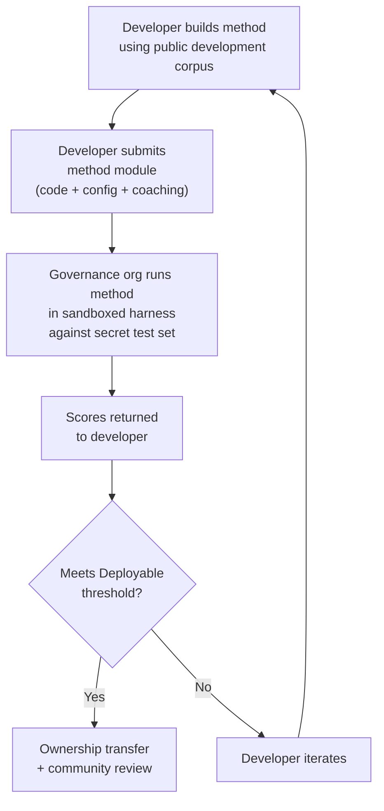

# مواصفة المعيار المرجعي

> **الملخص التنفيذي.** تُعرِّف هذه الوثيقة بروتوكول التقييم لمنظومة تقييم الترجمة الآلية في مشروع Champollion: صيغة المدوّنة (§2)، ومخطط بطاقة التشغيل (§3)، وبروتوكول المعيار المرجعي (§6)، ومتطلبات التحقق البشري (§7)، وآليات السيادة (§8)، ونموذج لوحة المتصدرين والتقديم (§9)، وإطار التكلفة (§10)، وقابلية التوسع إلى لغات جديدة (§11). للاطلاع على تعريفات المقاييس، وأوزان حساب composite score، وعتبات مستويات الجودة، وصيغ مقاييس التكلفة/السرعة، راجع `SCORING_SPEC.md` — المصدر الوحيد للحقيقة فيما يخص كل منطق التقييم. تُحيل هذه الوثيقة إلى SCORING_SPEC في تلك التفاصيل بدلاً من تكرارها.
>
> آخر تحديث: 2026-06-07

---

## 1. المبادئ

### 1.1 المقاييس الآلية مؤشرات تقريبية

كل مقياس مُعرَّف في هذه الوثيقة يُحسب آليًا. chrF++، ومعدل قبول FST، والدقة الصرفية، والتشابه الدلالي — جميعها مؤشرات آلية تقريبية لجودة الترجمة. وهي مفيدة للتكرار السريع، والمقارنة المنهجية، واكتشاف التراجعات. لكنها **ليست بديلاً عن الحكم البشري**.

التسلسل الهرمي للتقييم:

```
Automated metrics (run cards, benchmarks)
    ↓ proxy for
Human review (bilingual speakers validate output)
    ↓ proxy for
Actual utility (does this help a language community?)
```

لا يمكن لأي درجة آلية، مهما كانت مرتفعة، أن تحل محل متحدث يجيد اللغة يقرأ المخرجات ويؤكد أنها صحيحة وطبيعية وملائمة ثقافيًا. مستويات الجودة المُعرَّفة في §5 هي تسميات استدلالية تُطبَّق على درجات composite الآلية — مفيدة لتتبع التقدم، لكنها لا تكفي بمفردها أبدًا.

### 1.2 طرائق لا نماذج

نحن نُجري المعايرة المرجعية على **الطرائق**، لا على النماذج. النموذج مكوِّن واحد فقط. أما الطريقة فهي الوصفة الكاملة: اختيار النموذج، وتصميم الموجِّهات، واستخدام الأدوات، والمعالجة القبلية/البعدية، وبيانات التدريب التوجيهي، واستراتيجيات إعادة المحاولة، وكل شيء. فريقان يستخدمان النموذج نفسه بطريقتين مختلفتين سيحصلان على درجات مختلفة. وهذا هو المقصود.

### 1.3 قابلية إعادة الإنتاج

يجب أن تكون كل نتيجة معيارية قابلة لإعادة الإنتاج. تُسجِّل بطاقة التشغيل (§3) التكوين الكامل للتجربة. وتُحدِّد البصمة (§3.5) هوية الإعداد التجريبي. ويتحقق هاش بطاقة التشغيل (§3.6) من سلامة النتيجة. ينبغي لأي شخص لديه الطريقة نفسها والمدوّنة نفسها والتكوين نفسه أن يحقق درجات ضمن نطاق ±2% (مع مراعاة عدم حتمية أخذ العينات في النماذج اللغوية الكبيرة عند temperature > 0).

### 1.4 لا بيانات تقييم اصطناعية

**هذا المشروع لا يُولِّد بيانات تقييم اصطناعية ولا يستخدمها ولا يُقرّها.** يجب أن تُستمد جميع المدوّنات من نصوص حقيقية من تأليف بشري — ترجمات منشورة، أو كتب دراسية، أو وثائق ثنائية اللغة، أو ترجمات مُستخلَصة من متحدثين يجيدون اللغة.

يجوز أن تساعد النماذج اللغوية الكبيرة في:
- محاذاة الجمل (إيجاد المقاطع المتوازية في نصوص ثنائية اللغة قائمة)
- تحويل الصيغ (تحويل المواد المنشورة إلى مخطط المدوّنة)
- إثراء البيانات الوصفية (اقتراح مستويات الصعوبة وتسميات السجل اللغوي)
- اقتراح جمل مصدرية للترجمة البشرية (§11.3 — خطوة الترجمة بشرية دائمًا)

ويُحظر على النماذج اللغوية الكبيرة **حظرًا تامًا** توليد الترجمات المرجعية أو أزواج التقييم.

**نحن محايدون فيما يخص بيانات تدريب الطرائق.** إذا استخدم مطوِّر طريقةٍ بيانات تدريب اصطناعية أو ترجمة عكسية أو تعزيز بيانات في طريقته، فذلك خياره — نحن نقيِّم المخرجات لا عملية التدريب. يستخدم نموذج OMT-1600 من Meta نحو 270 مليون جملة متوازية اصطناعية مُولَّدة عبر الترجمة العكسية. لا اعتراض لدينا على الطرائق المدرَّبة بهذا الأسلوب. نحن نختبر على بيانات منسّقة بشريًا فقط.

> **لماذا لا نستخدم النص التوراتي في التقييم؟** يُقيِّم OMT-1600 ما عدده 1,560 لغة من أصل 1,600 على نصوص من النطاق التوراتي. تتسم الترجمات التوراتية بسجل لغوي قديم ومفردات طقسية وبنية جمل نمطية. أما مدوّنات التقييم لدينا فمستمدة من نصوص منسّقة مجتمعيًا ومتنوعة النطاقات — الصحة، والقانون، والتعليم، والشؤون الحكومية، والمحادثة، والتقنية (انظر §2.7). وهذا خيار تصميمي مقصود. تحتاج المجتمعات إلى الترجمة في النطاقات التي تعيش وتعمل فيها فعلاً، لا في سجل ديني واحد. فالطريقة التي تحقق درجة عالية على سفر التكوين 1:1 لا تخبرك شيئًا تقريبًا عن أدائها على جدول أعمال مجلس قبلي أو نموذج استقبال في عيادة.

---

## 2. مخطط المدوّنة

المدوّنة هي مجموعة منسّقة من أزواج النصوص المتوازية مع بيانات وصفية منظمة. وهي الحقيقة المرجعية التي تُقاس عليها جميع الطرائق.

### 2.1 الغلاف العام لمجموعة البيانات

البنية العليا لملف المدوّنة:

```json
{
  "dataset": {
    "id": "edtekla-dev-v1",
    "version": "1.0",
    "language_pair": "EN→CRK",
    "source_language": "en",
    "target_language": "crk",
    "created": "2026-05-01",
    "license": "CC-BY-NC-SA-4.0",
    "provenance": ["gold_standard", "textbook"]
  },
  "entries": [ ... ]
}
```

| الحقل | النوع | مطلوب | الوصف |
|-------|------|-------------|-------------|
| `id` | string | ✅ | مُعرِّف فريد لمجموعة البيانات، يُستخدم في بطاقات التشغيل ولوحة المتصدرين |
| `version` | string | ✅ | إصدار دلالي. زيادته تُبطل المقارنات مع بطاقات التشغيل السابقة |
| `language_pair` | string | ✅ | تسمية العرض (مثل `EN→CRK`) |
| `source_language` | string | ✅ | رمز لغة المصدر وفق BCP 47 |
| `target_language` | string | ✅ | رمز اللغة الهدف وفق BCP 47 |
| `created` | string | ✅ | تاريخ الإنشاء وفق ISO 8601 |
| `license` | string | ✅ | مُعرِّف الترخيص وفق SPDX |
| `provenance` | string[] | ✅ | قائمة وسوم المصدر المستخدمة عبر الإدخالات |

### 2.2 مخطط الإدخال

يمثل كل إدخال في المدوّنة تحديًا ترجميًا واحدًا:

```json
{
  "id": 42,
  "source": "I see the dog",
  "reference": "niwâpamâw atim",
  "segment": "gold_standard",
  "difficulty": 2,
  "provenance": "gold_standard",
  "register": "conversational",
  "context": "declaration",
  "morphological_analysis": "ni-wâpam-âw atim | 1sg-see.TA-3sg.DIR dog.AN",
  "notes": "Animate noun (atim); direct form because speaker is proximate",
  "variant_class": "simple-ta-direct"
}
```

| الحقل | النوع | مطلوب | الوصف |
|-------|------|-------------|-------------|
| `id` | integer | ✅ | مُعرِّف فريد داخل المدوّنة |
| `source` | string | ✅ | النص المصدري بلغة المصدر |
| `reference` | string | ✅ | الترجمة المرجعية المعيارية الذهبية باللغة الهدف |
| `segment` | string | 📎 | قسم المدوّنة: `gold_standard` أو `held_out` أو `development` أو `diagnostic` |
| `difficulty` | integer | 📎 | تقييم الصعوبة من 1 إلى 5 (انظر §2.4) |
| `provenance` | string | 📎 | مصدر هذا الإدخال (انظر §2.5) |
| `register` | string | 📎 | مستوى السجل اللغوي/الرسمية (انظر §2.6) |
| `context` | string | 📎 | الوظيفة التواصلية (انظر §2.6) |
| `domain` | string | 📎 | نطاق حالة الاستخدام من تصنيف الرموز الستة عشر (انظر §2.7). يجب أن يكون واحدًا من: `conv`، `ecommerce`، `edu`، `financial`، `gov`، `legal`، `literary`، `marketing`، `medical`، `news`، `religious`، `scientific`، `subtitles`، `support`، `tech`، `ui`. يُتحقق منه عند الإنشاء. |

> **📎 = موصى به.** يتعامل إطار التشغيل مع الحقول الاختيارية المفقودة بسلاسة عبر القيم الافتراضية. لا يلزم مدوّنات الأطراف الثالثة سوى توفير `id` و`source` و`reference` لكل إدخال.
| `morphological_analysis` | string | ❌ | تحليل صرفي معياري ذهبي |
| `notes` | string | ❌ | ملاحظات المترجم، والمتغيرات اللهجية، وإشارات الالتباس |
| `variant_class` | string | ❌ | تسمية فئة تجمع متغيرات الترجمة المقبولة |


### 2.3 أقسام المدوّنة

تنقسم المدوّنة إلى أقسام بمستويات وصول مختلفة:

| القسم | الغرض | الوصول | الحد الأدنى للحجم |
|---------|---------|--------|-------------|
| `development` | تطوير الطرائق والتكرار. يستخدمها المطوّرون بحرية. | **عام** | 30 إدخالاً |
| `diagnostic` | اختبارات موجَّهة لظواهر لغوية محددة. | **عام** | 10 إدخالات |
| `gold_standard` | التقييم المعياري الرسمي. درجات لوحة المتصدرين تأتي من هنا. | **سري** — بحوزة منظمة الحوكمة | 50 إدخالاً |
| `held_out` | محجوز للتقييم المستقبلي. لا يُستخدم أبدًا قبل تفعيله. | **سري** — بحوزة منظمة الحوكمة | 10 إدخالات |

> **الحالة الراهنة:** لا يوجد في مجموعات البيانات المنشورة سوى قسم `development`. أما أقسام `diagnostic` و`gold_standard` و`held_out` فهي مُعرَّفة للاستخدام المستقبلي مع نمو المدوّنات.

قسما `gold_standard` و`held_out` سريّان بالكامل. فالجمل المصدرية والترجمات المرجعية كلتاهما محفوظتان على بنية تحتية تخضع لسيطرة الحوكمة. لا يرى مطوّرو الطرائق الأسئلة ولا الإجابات أبدًا. انظر §8 للاطلاع على آلية السيادة.

### 2.4 مستويات الصعوبة

| المستوى | الوصف | أمثلة |
|------|-------------|----------|
| 1 — مفردات أساسية | كلمات مفردة، تحيات شائعة، أرقام | "hello" → "tânisi"، "dog" → "atim" |
| 2 — جمل بسيطة | فاعل-فعل أو SVO، زمن المضارع | "I see the dog" → "niwâpamâw atim" |
| 3 — تعقيد متوسط | الماضي/المستقبل، الملكية، الحيوية النحوية | "I saw his dog yesterday" |
| 4 — صرف معقد | الإبعاد الإشاري (obviation)، المبني للمجهول، صيغة الربط، الجمل الموصولة | "the woman whose son went to the store" |
| 5 — متقدم | جمل متعددة العبارات، سجل رسمي، لغة احتفالية، تعابير اصطلاحية | فقرة كاملة بنبرة ملائمة للسجل اللغوي |

ينبغي أن تتضمن المدوّنة جيدة البناء إدخالات عبر مستويات الصعوبة الخمسة جميعها، مع ترجيح المستويات 2–4 حيث تقع معظم تحديات الترجمة الواقعية.

### 2.5 وسوم المصدر

يجب أن يُشير كل إدخال إلى مصدره:

| الوسم | المعنى |
|-----|---------|
| `gold_standard` | تم التحقق منه بواسطة متحدثين يجيدون اللغة |
| `textbook` | من مواد تعليمية منشورة |
| `elicited` | أُنتج عبر جلسات استخلاص منظمة |
| `corpus` | مستخرَج من مدوّنة متوازية |

> **ملاحظة:** عمليًا، قيم المصدر سلاسل نصية حرة. الوسوم أعلاه أعراف لا تعدادًا مُتحقَّقًا منه — يجوز لمجموعات البيانات استخدام سلاسل وصفية أخرى للمصدر.

### 2.6 السجل اللغوي والسياق

**السجل اللغوي** يصف الرسمية والسياق الاجتماعي:

| السجل | الوصف |
|----------|-------------|
| `conversational` | حديث يومي بين أنداد |
| `formal` | لغة رسمية أو مؤسسية |
| `technical` | مفردات متخصصة بنطاق معين |
| `ceremonial` | استخدام لغوي تقليدي أو مقدّس |
| `educational` | مواد تعليم اللغة |

**السياق** يصف الوظيفة التواصلية:

> 🔲 **مخطط له.** حقل `context` مُعرَّف في المخطط لكنه غير معبأ بعد في مجموعات البيانات الحالية. وهو محجوز لإثراء المدوّنة مستقبلاً.

| السياق | الوصف |
|---------|-------------|
| `greeting` | تحية اجتماعية أو وداع |
| `declaration` | إقرار بحقيقة |
| `question` | استفهام |
| `instruction` | أمر أو توجيه |
| `narrative` | سرد قصصي أو وصف |
| `label` | تسمية في واجهة المستخدم، أو نص زر، أو عنوان |
| `error` | رسالة خطأ أو تحذير |

### 2.7 النطاق {#27-domain}

**النطاق** يصف حالة الاستخدام الواقعية — نوع المحتوى الذي تجري ترجمته. وهو مستقل عن السجل اللغوي والسياق:

- **السجل اللغوي** يجيب عن: *ما مدى رسمية هذا النص؟*
- **السياق** يجيب عن: *ما الذي تفعله هذه الجملة؟*
- **النطاق** يجيب عن: *لأي صناعة/حالة استخدام هذا النص؟*

قد يكون عقد قانوني (النطاق: `legal`) رسميًا (السجل: `formal`) ويتضمن إقرارًا (السياق: `declaration`). وقد يكون نص محادثة مع روبوت قانوني (النطاق: `legal`) حواريًا (السجل: `conversational`) ويتضمن أسئلة (السياق: `question`). النطاق نفسه، لكن السجل والسياق مختلفان.

| رمز النطاق | الوصف | المستهلكون النموذجيون |
|-------------|-------------|-------------------|
| `ui` | نصوص واجهات البرمجيات | مطوّرو التطبيقات، فرق التوطين |
| `legal` | العقود، والقوانين، والمذكرات القضائية، ووثائق الهجرة | مكاتب المحاماة، والمحاكم، وفرق الامتثال، ومحامو الملكية الفكرية |
| `medical` | الملاحظات السريرية، وملصقات الأدوية، ومراسلات المرضى، وبروتوكولات التجارب | المستشفيات، وشركات الأدوية، والتجارب السريرية، وبوابات المرضى |
| `financial` | الخدمات المصرفية، والتأمين، والإيداعات التنظيمية، وتقارير التدقيق | البنوك، وشركات التأمين، والجهات التنظيمية، والمدققون |
| `edu` | الكتب الدراسية، والمناهج، وخطط الدروس، والمواد الأكاديمية | المدارس، والجامعات، وناشرو الكتب الدراسية |
| `ecommerce` | أوصاف المنتجات، والمراجعات، وقوائم الأسواق الإلكترونية | تجار التجزئة الإلكترونيون، وبائعو الأسواق الإلكترونية |
| `marketing` | النصوص الإعلانية، ورسائل العلامة التجارية، والحملات، والشعارات | وكالات الإعلان، وفرق العلامات التجارية |
| `gov` | وثائق السياسات، واللوائح، والإشعارات العامة، والتشريعات | الجهات الحكومية، وفرق الامتثال |
| `scientific` | الأوراق البحثية، والملخصات، والمنهجيات، ومقترحات المنح | الباحثون، والمجلات العلمية، وجهات المنح |
| `religious` | الكتب المقدسة، والنصوص الطقسية، والتعليقات اللاهوتية | المجتمعات الدينية، وناشرو النصوص الطقسية |
| `support` | الأسئلة الشائعة، ورسائل الخطأ، وأدلة استكشاف الأعطال، ونصوص روبوتات الدردشة | شركات SaaS، ومكاتب الدعم الفني |
| `subtitles` | حوارات الأفلام والتلفزيون والبث والألعاب | منصات البث، والاستوديوهات، وشركات الألعاب |
| `news` | الصحافة، وتقارير الوكالات، والمقالات الافتتاحية، والبيانات الصحفية | المؤسسات الإعلامية، ووكالات الأنباء |
| `literary` | الأدب القصصي، والشعر، والسرد، والنصوص الثقافية | الناشرون، ومنظمات الحفاظ على التراث الثقافي |
| `conv` | المحادثة غير الرسمية، ووسائل التواصل الاجتماعي، والمراسلة | تطبيقات المستهلكين، والمنصات الاجتماعية |
| `tech` | وثائق واجهات البرمجة (API)، والأدلة، والمواصفات الهندسية، والأدلة التقنية | فرق التوثيق، والمؤسسات الهندسية |

> **معايير مرجعية مخصصة لكل نطاق.** يُقيِّم المعيار المرجعي العام الطريقة عبر جميع النطاقات. لكن الـ Arena تدعم أيضًا **معايير مرجعية مُرشَّحة حسب النطاق** — حيث تُحسب الدرجات على الإدخالات الموسومة بنطاق محدد فقط. وهذا يتيح للمستخدمين الإجابة عن السؤال: "ما أفضل طريقة لترجمة الوثائق القانونية إلى الفرنسية؟" مقابل "ما الطريقة صاحبة أفضل درجة فرنسية إجمالاً؟"
>
> ترتيب لوحة المتصدرين المُرشَّح حسب النطاق ميزة جوهرية في المنتج. ستتفاوت أداءات الطرائق عبر النطاقات — فقد تتفوق طريقة مضبوطة على المصطلحات القانونية في المعايير القانونية تفوقًا ساحقًا لكنها تتراجع في النصوص الحوارية. تساعد الـ Arena المستخدمين على إيجاد الحل الأنسب لحالة استخدامهم المحددة.

> **مستقبلاً: روبوت محادثة الـ Arena.** سيتضمن موقع الـ Arena مساعدًا حواريًا يساعد المستخدمين على وصف حالة استخدامهم في الترجمة الآلية (النطاق، وزوج اللغة، ومتطلبات الجودة) ويوصي بأفضل طريقة مُتحقَّق منها مجتمعيًا من لوحة المتصدرين. على سبيل المثال: "أحتاج إلى ترجمة بروتوكولات التجارب السريرية من الإنجليزية إلى اليابانية — ما الطريقة صاحبة أعلى درجة في المعايير المرجعية للنطاق الطبي EN→JA؟" يعتمد هذا على توفر بيانات تقييم كافية موسومة بالنطاقات وتنوع كافٍ في الطرائق.

---

## 3. مخطط بطاقة التشغيل {#3-run-card-schema}

بطاقة التشغيل هي الوحدة الذرية للتقييم. وهي وثيقة JSON مكتفية ذاتيًا تُسجِّل التكوين الكامل والنتائج لجولة تقييم واحدة: طريقة واحدة، ونموذج واحد، وتكوين واحد، ومجموعة بيانات واحدة.

تُسجِّل كل بطاقة تشغيل ثلاثة أبعاد:
- **الجودة** — ما مدى جودة الترجمات؟
- **التكلفة** — كم كلّف إنتاجها؟
- **السرعة** — كم استغرقت من الوقت؟

### 3.1 الحقول العليا

| الحقل | النوع | الوصف |
|-------|------|-------------|
| `run_id` | string | معرّف UUID v4 يُولَّد عند بدء التشغيل |
| `harness_version` | string | الإصدار الدلالي لإطار التشغيل (مثل `2.0`) |
| `timestamp` | string | طابع زمني بتوقيت UTC وفق ISO 8601 عند بدء التشغيل |
| `elapsed_seconds` | number | المدة الفعلية الكاملة للتشغيل |

### 3.2 تكوين الطريقة

تُعرِّف هذه الحقول الإعداد التجريبي — ما الذي اختُبر وكيف.

| الحقل | النوع | مطلوب | الوصف |
|-------|------|-------------|-------------|
| `model_slug` | string | ✅ | مُعرِّف النموذج (مثل `google/gemini-2.5-flash`) |
| `model_id` | string | ❌ | مُعرِّف النموذج المُستبين كما تُعيده واجهة البرمجة |
| `condition` | string | ✅ | تسمية التجربة (مثل `baseline` أو `coached-v3` أو `few-shot`) |
| `temperature` | number | ✅ | درجة حرارة أخذ العينات |
| `system_prompt_sha256` | string | ✅ | هاش SHA-256 لموجّه النظام الكامل |
| `system_prompt_used` | string | ✅ | النص الكامل لموجّه النظام |
| `coaching_data_sha256` | string | ❌ | هاش SHA-256 لملف بيانات التدريب التوجيهي، إن استُخدم |
| `fst_version` | string | ❌ | إصدار محلل FST، إن استُخدم |
| `tools_enabled` | string[] | ❌ | قائمة الأدوات المتاحة للطريقة |
| `batch_size` | number | ❌ | عدد الإدخالات لكل دفعة API متزامنة |
| `max_retries` | number | ❌ | الحد الأقصى لإعادة المحاولة عند رفض FST، إن وُجد |

:::info بطاقات التشغيل المنشورة تتضمن method_config
عند نشر بطاقة تشغيل إلى لوحة المتصدرين (عبر `mt-eval publish`)، فإنها تتضمن أيضًا كتلة `method_config` تحتوي على MethodConfig القياسي ذي الحقول الثمانية (`model`، `temperature`، `batchSize`، `register`، `coachingFile`، `coachingPrompt`، `promptContext`، `qualityTier` — جميعها بصيغة camelCase). وهذا يتيح الاستيراد دون إعادة بناء: تقرأ `champollion leaderboard --install` كتلة `method_config` مباشرة وتكتبها كبيان إضافة (plugin manifest). تُسجِّل حقول القياس عن بُعد أعلاه (§3.2) ما رصده إطار التشغيل؛ بينما تُسجِّل `method_config` ما قصده المطوِّر.
:::

### 3.3 مرجع مجموعة البيانات

| الحقل | النوع | الوصف |
|-------|------|-------------|
| `dataset.id` | string | مُعرِّف مجموعة البيانات |
| `dataset.version` | string | إصدار مجموعة البيانات |
| `dataset.language_pair` | string | تسمية العرض |
| `dataset.sha256` | string | هاش SHA-256 لمحتويات ملف مجموعة البيانات |
| `dataset.entry_count` | number | عدد الإدخالات المُقيَّمة |

يربط هاش SHA-256 الخاص بمجموعة البيانات النتيجةَ بإصدار محدد من البيانات. إذا تغيرت مجموعة البيانات، تصبح بطاقات التشغيل القديمة غير قابلة للمقارنة.

### 3.4 الدرجات (الجودة)

مقاييس مجمَّعة للتشغيل بأكمله. جميع مقاييس الجودة **آلية** — انظر §1.1.

| الحقل | النوع | الوصف |
|-------|------|-------------|
| `scores.total` | number | إجمالي الإدخالات المُقيَّمة |
| `scores.exact_matches` | number | الإدخالات التي طابقت فيها المخرجات المرجعَ تمامًا |
| `scores.exact_match_rate` | number | 0.0–1.0 |
| `scores.equivalent_matches` | number | الإدخالات المطابقة لمتغير مقبول |
| `scores.equivalent_match_rate` | number | 0.0–1.0 |
| `scores.fst_accepted` | number | الإدخالات التي قبلها محلل FST |
| `scores.fst_acceptance_rate` | number | 0.0–1.0، وتكون `null` إذا لم يُكوَّن FST |
| `scores.morphological_accuracy` | number | 0.0–1.0، وتكون `null` إذا لم يوجد تحليل معياري ذهبي |
| `scores.chrf_plus_plus` | number | درجة chrF++ على مستوى المدوّنة (0–100) |
| `scores.semantic_score` | number | التشابه الدلالي القائم على التضمينات (0.0–1.0) |
| `scores.ter` | number | معدل تحرير الترجمة (Translation Edit Rate) (0–∞، الأقل أفضل) |
| `scores.length_ratio` | number | avg(len(predicted)/len(reference))، القيمة المثالية = 1.0 |
| `scores.code_switching_rate` | number | 0.0–1.0، نسبة الإدخالات التي تتضمن تسربًا من لغة المصدر |
| `scores.hallucination_rate` | number | 0.0–1.0، نسبة الإدخالات التي تتضمن محتوى مُهلوَسًا |
| `scores.terminology_adherence` | number | 0.0–1.0، الالتزام بمصطلحات المسرد (`null` إذا لم يوجد مسرد) |
| `scores.tokens_per_second` | number | total_tokens / elapsed_seconds |
| `scores.entries_per_minute` | number | عدد الإدخالات المترجمة في الدقيقة |
| `scores.composite` | number | درجة composite score المرجَّحة (0.0–1.0). انظر SCORING_SPEC §4 |
| `scores.errors` | number | الإدخالات التي فشلت (خطأ API، انتهاء مهلة، إلخ) |
| `scores.by_difficulty` | object | الدرجات مُفصَّلة حسب مستوى الصعوبة |
| `scores.by_provenance` | object | الدرجات مُفصَّلة حسب وسم المصدر |
| `scores.by_domain` | object | ✅ منفَّذ — الدرجات مُفصَّلة حسب النطاق (§2.7). يتيح ترتيب لوحة المتصدرين المُرشَّح حسب النطاق. يُحسب بواسطة tester.py ويُمرَّر عبر publish.py. |

### 3.5 الإجماليات (التكلفة)

| الحقل | النوع | الوصف |
|-------|------|-------------|
| `totals.prompt_tokens` | number | إجمالي رموز الإدخال عبر جميع استدعاءات API |
| `totals.completion_tokens` | number | إجمالي رموز الإخراج |
| `totals.reasoning_tokens` | number | الرموز المستخدمة لسلسلة التفكير (0 لمعظم النماذج) |
| `totals.cached_tokens` | number | الرموز المُقدَّمة من ذاكرة التخزين المؤقت لموجّهات المزوِّد |
| `totals.total_cost_usd` | number | إجمالي التكلفة بالدولار الأمريكي |
| `totals.cost_per_entry_usd` | number | `total_cost_usd / entry_count` |
| `totals.cost_per_source_char` | number | الدولار الأمريكي لكل حرف مصدري — قابل للمقارنة عبر اللغات |

### 3.6 التوقيت (السرعة)

| الحقل | النوع | الوصف |
|-------|------|-------------|
| `elapsed_seconds` | number | المدة الفعلية للتشغيل الكامل (على المستوى الأعلى) |
| `scores.avg_latency_seconds` | number | متوسط زمن الاستجابة لكل إدخال |
| `scores.median_latency_seconds` | number | وسيط زمن الاستجابة لكل إدخال |
| `scores.p95_latency_seconds` | number | المئين الـ95 لزمن الاستجابة لكل إدخال |

### 3.7 نتائج الإدخالات الفردية

يُسجِّل كل عنصر في مصفوفة `results[]` ترجمة واحدة. تُحفظ بيانات الإدخالات الفردية في جدول `run_card_entries` (الترحيل 005) مع أحكام LYSS غير المُطبَّعة (الترحيل 006).

| الحقل | النوع | الوصف |
|-------|------|-------------|
| `entry_id` | string | يطابق `entries[].id` في المدوّنة |
| `source` | string | النص المصدري الذي تُرجم |
| `expected` | string | الترجمة المرجعية المعيارية الذهبية |
| `raw_predicted` | string \| null | مخرجات النموذج الخام قبل المعالجة البعدية |
| `predicted` | string | المخرجات الفعلية للطريقة (بعد المعالجة البعدية) |
| `segment` | string | مُعرِّف المقطع (مثل فهرس الجملة) |
| `difficulty` | string \| null | مستوى الصعوبة من المدوّنة |
| `domain` | string | وسم النطاق من المدوّنة (§2.7) |
| `exact_match` | boolean | هل طابقت المخرجات المرجعَ تمامًا |
| `chrf_score` | number \| null | chrF++ على مستوى الجملة (0–100) |
| `bleu_score` | number \| null | BLEU على مستوى الجملة (0–100) |
| `latency_s` | number \| null | زمن الاستجابة بالثواني |
| `cost_usd` | number \| null | التكلفة بالدولار الأمريكي لهذا الإدخال |
| `tool_call_count` | integer | عدد استدعاءات الأدوات المستخدمة (0 إذا لم تُستخدم) |
| `error` | string \| null | رسالة الخطأ إذا فشل هذا الإدخال |
| `plugin_metrics` | object | مخرجات الإضافة الكاملة لكل إدخال (JSONB) |
| `fst_valid` | boolean \| null | قَبِل GiellaLT FST التنبؤ (LYSS-fst غير مُطبَّع) |
| `equivalent_match` | boolean \| null | أكّد مدقق CRK التكافؤ البنيوي (LYSS-eq غير مُطبَّع) |
| `semantic_verdict` | string \| null | حكم LYSS-sem: `VALID`، `MISMATCH`، `UNKNOWN`، `ERROR` |
| `code_switching_detected` | boolean \| null | رُصدت رموز من لغة المصدر في المخرجات |
| `hallucination_detected` | boolean \| null | رُصد محتوى مُختلَق في المخرجات |


### 3.8 البصمة

مُعرِّف لقابلية إعادة الإنتاج. التشغيلان ذوا البصمتين المتطابقتين استخدما الإعداد التجريبي نفسه.

البصمة هي هاش SHA-256 للسلسلة المرتبة المُكوَّنة من:
- `dataset.sha256`
- `model_slug`
- `condition`
- `system_prompt_sha256`
- `temperature`
- `harness_version`
- `batch_size`
- `tools_enabled`

> **لماذا 8 مكوّنات؟** حجم الدفعة واستدعاء الأدوات يؤثران تأثيرًا جوهريًا في جودة المخرجات ويجب تضمينهما في الهوية. التشغيلان بحجمي دفعة مختلفين أو بأدوات مفعَّلة مختلفة هما إعدادان تجريبيان مختلفان، حتى لو تطابقت جميع المعاملات الأخرى.

ينبغي أن يُنتج التشغيلان ذوا البصمتين المتطابقتين نتائج قابلة للمقارنة. وتُعزى الاختلافات إلى عدم حتمية واجهة البرمجة (temperature > 0) أو إلى تحديثات النموذج من جهة المزوِّد.

### 3.9 هاش بطاقة التشغيل

هاش SHA-256 لكامل JSON بطاقة التشغيل (مع ضبط حقل `run_card_hash` نفسه على `""` أثناء الحساب). هذا هو ختم كشف العبث. إذا تغيّر أي حقل، ينكسر الهاش.

---

## 4. المقاييس الآلية

جميع المقاييس في هذا القسم تُحسب آليًا. انظر §1.1.

### 4.1 تعريفات المقاييس

| المقياس | الحالة | ما الذي يقيسه | المدى |
|--------|--------|-----------------|-------|
| **chrF++** | ✅ منفَّذ | درجة F للوحدات النونية الحرفية (n-gram). يعمل على مستوى الحرف، ما يجعله أكثر متانة من المقاييس على مستوى الكلمة (BLEU) للغات الغنية صرفيًا حيث تكون الكلمات طويلة وشديدة التصريف. يُحسب بواسطة sacrebleu. | 0–100 (المقياس الأصلي). يُقسَّم على 100 عند استخدامه في composite. |
| **FST acceptance rate** | ✅ منفَّذ | نسبة الكلمات المتنبأ بها التي قبلها المحلل الصرفي (GiellaLT HFST) بوصفها صيغًا صحيحة في اللغة الهدف. الكلمة التي يقبلها FST هي كلمة حقيقية صحيحة بنيويًا — لا هلوسة. | 0.0–1.0 |
| **Exact match** | ✅ منفَّذ | نسبة التنبؤات التي تطابق المرجع تمامًا بعد تطبيع Unicode. صارم لكنه قاطع — مفيد بوصفه فحصًا للحد الأعلى. | 0.0–1.0 |
| **Morphological accuracy** | 🔲 مخطط له | للإدخالات ذات التحليل الصرفي المعياري الذهبي: نسبة الوحدات الصرفية المُولَّدة بشكل صحيح. أدق تفصيلاً من قبول FST — فقد تكون الكلمة صحيحة وفق FST لكن ببنية صرفية خاطئة (جذر صحيح، زمن خاطئ). | 0.0–1.0 |
| **Equivalent match** | ⚡ جزئي | نسبة المطابقة لمتغير مقبول من المرجع — مع مراعاة ترتيب الكلمات، والاختلافات اللهجية، والأعراف الإملائية. منفَّذ حاليًا للغة CRK عبر `CrkLinterMetric` في معيار تقييم CRK (في `eval_standards/crk/`)؛ ويُحمَّل تلقائيًا عبر إعلان `evalMetrics` في بطاقة لغة CRK. يتطلب التنفيذ العام وجود `variants[]` لكل إدخال في المدوّنة. | 0.0–1.0 |
| **Semantic score** | ⚡ جزئي | الحفاظ على المعنى بصرف النظر عن الشكل السطحي. منفَّذ حاليًا للغة CRK عبر `CrkSemanticMetric` في معيار تقييم CRK (في `eval_standards/crk/`، مؤشر تقريبي مرجَّح بالأحكام). التشابه الجيبي العام القائم على التضمينات مخطط له — انظر SCORING_SPEC §2.3. | 0.0–1.0 |

### 4.2 درجة Composite Score

درجة composite score هي متوسط مرجَّح لجميع المقاييس *المتاحة*:

```
composite = Σ (weight_i × metric_i)   for all available metrics
             ─────────────────────
             Σ weight_i              (renormalized to sum to 1.0)
```

عندما يكون أحد المقاييس غير متاح (لا FST مُكوَّن، ولا فئات متغيرات مُعرَّفة، ولا نموذج تضمينات)، يُعاد توزيع وزنه تناسبيًا على المقاييس المتبقية. وهذا يعني أن composite قابلة للمقارنة دائمًا ضمن اللغة الواحدة — فهي تستخدم أي مقاييس متاحة لتلك اللغة وتُطبِّع وفقًا لذلك.

**جداول الأوزان، وقواعد تطبيع المدخلات، وقائمة المقاييس الكاملة مُعرَّفة في `SCORING_SPEC.md` §4.** تلك الوثيقة هي المصدر الوحيد للحقيقة (SSOT) فيما يخص:
- أوزان الملف A (اللغات ذات تغطية FST — 9 مقاييس، المقاييس البنيوية تحمل 40%)
- أوزان الملف B (اللغات بدون تغطية FST — 8 مقاييس)
- قواعد التطبيع (chrF++ ÷ 100، وعكس معدلي التناوب اللغوي والهلوسة)
- المقاييس المستبعدة من composite (BLEU، COMET، TER، نسبة الطول، الاتساق) وسبب الاستبعاد

يعكس كود إطار التشغيل هذه الجداول في `mt_eval_harness/scoring.py`. عند تغيُّر SCORING_SPEC، يُحدَّث `scoring.py` ليطابقه ويتحقق `test_scoring_ssot.py` من التوافق.

> **لماذا ليس BLEU؟** يعمل BLEU على مستوى الكلمة ويعاقب التنوع الصرفي. في اللغات متعددة التركيب، قد تشكِّل كلمة واحدة عبارة كاملة — فيعامل BLEU الفروق التصريفية الطفيفة كأخطاء كاملة. يتعامل chrF++ مع ذلك بشكل أفضل لأنه يعمل على مستوى الحرف. BLEU مستبعد من جدولي الأوزان كليهما. انظر الملحق A في SCORING_SPEC للاطلاع على المسوّغ الكامل.


### 4.3 الدرجة المعدَّلة حسب التكلفة

للطرائق التي تستخدم واجهات برمجة مدفوعة، نُصدر أيضًا ترتيبًا ثانويًا. صيغة الدرجة المعدَّلة حسب التكلفة مُعرَّفة في `SCORING_SPEC.md` §6.3.

---

## 5. مستويات الجودة {#5-quality-tiers}

مستويات الجودة تسميات استدلالية تُطبَّق على درجات composite الآلية. وهي تصف ما تعنيه الدرجات عادةً في الممارسة العملية، استنادًا إلى مراجعة بشرية للمخرجات عند كل مستوى. **وهي ليست أحكام جودة مُتحقَّقًا منها** — فالمراجعة البشرية وحدها (§6) يمكنها تأكيد قابلية الاستخدام الفعلية.

**عتبات المستويات وأوصافها مُعرَّفة في `SCORING_SPEC.md` §5.** المستويات هي: Baseline ‏(0.00–0.30)، وEmerging ‏(0.30–0.50)، وFunctional ‏(0.50–0.70)، وDeployable ‏(0.70–0.85)، وFluent ‏(0.85–1.00).

> [!IMPORTANT]
> **المستويات الآلية مؤقتة.** هذه التسميات ترشيحات للمراجعة، لا إعلانات جودة. الطريقة التي تبلغ مستوى "Deployable" وفق المقاييس الآلية مرشَّحة للتقييم المجتمعي — وليست منتجًا جاهزًا للإطلاق. المراجعة البشرية وحدها (§7) يمكنها تأكيد قابلية الاستخدام الفعلية. وقد تختلف حدود المستويات بين اللغات.

هذه المستويات مؤقتة. وستُعاد معايرتها مع تراكم بيانات التحقق البشري ومع تعلمنا أين تقع فعليًا عتبة "يجد المتحدث هذا مفيدًا" لكل لغة. وقد تختلف حدود المستويات بين اللغات.

لا يمكن لأي طريقة أن تدّعي بلوغ مستوى **Deployable** أو أعلى دون مراجعة مجتمعية تؤكد اتفاق متحدثين ثنائيي اللغة على أن المخرجات قابلة للاستخدام.

---

## 6. بروتوكول المعيار المرجعي

**المعيار المرجعي** هو الإنتاج المنهجي لبطاقات تشغيل عبر فضاء معاملات مُعلَن على مجموعة بيانات معينة. وليس تشغيلاً واحدًا — بل استكشاف منظم لأداء التكوينات المختلفة.

### 6.1 ما الذي يُنتجه المعيار المرجعي

يُنتج المعيار المرجعي **مصفوفة من بطاقات التشغيل** — واحدة لكل توليفة من قيم المعاملات. تتيح المصفوفة مقارنة متعددة الأوجه عبر:

- **الجودة** — درجة composite score، وتفصيلات المقاييس الفردية
- **التكلفة** — التكلفة الإجمالية ولكل إدخال لكل تكوين
- **السرعة** — الزمن الفعلي والكمون لكل إدخال

لا توجد "درجة معيار مرجعي" واحدة. المعيار المرجعي هو المصفوفة الكاملة. سيهتم أصحاب المصلحة المختلفون بأوجه مختلفة: فالباحث يُحسِّن درجة composite score، ومهندس النشر يُحسِّن التكلفة لكل إدخال، والمجتمع يراجع الجودة.

### 6.2 فضاء المعاملات

يُعلن المعيار المرجعي عن المعاملات التي تخضع للتبديل:

| المحور | القيم النموذجية | الغرض |
|------|---------------|---------|
| `model` | 4–12 نموذجًا (طليعي + متوسط + اقتصادي) | ما مدى أهمية قدرة النموذج؟ |
| `temperature` | 0.0، 0.3، 0.7 | هل تفيد عشوائية أخذ العينات أم تضر؟ |
| `prompt_version` | 2–3 استراتيجيات موجِّهات | ما مدى حساسية الطريقة لتصميم الموجِّه؟ |
| `coaching_config` | مع/بدون بيانات تدريب توجيهي | هل يُحسِّن حقن المعرفة اللغوية المخرجات؟ |
| `tool_config` | مع/بدون FST، مع/بدون قاموس | هل تُحسِّن الأدوات اللغوية المخرجات؟ |

فضاء التبديل الكامل:
```
runs = |models| × |temperatures| × |prompts| × |coaching| × |tools|
```

معيار مرجعي أولي نموذجي: 12 نموذجًا × 3 درجات حرارة × 2 موجِّه × 2 تدريب توجيهي = 144 تشغيلاً.

### 6.3 خط الأساس مقابل تقييم الطريقة

يخدم المعيار المرجعي غرضين متمايزين:

**تحديد خط الأساس** — رسم خريطة المشهد بمقاربات ساذجة. "ما الذي تستطيع النماذج القائمة فعله لهذه اللغة دون أي هندسة مخصصة للغة؟" هذا يُرسي المستوى المرجعي. تخبرك مصفوفة خط الأساس: أي النماذج أقل هلوسة، وأي درجات حرارة تُنتج مخرجات أكثر اتساقًا، وما إذا كانت بيانات التدريب التوجيهي تفيد أصلاً، وأين تفشل جميع النماذج بشكل موحَّد (ما يكشف مشكلات لغوية صعبة).

**تقييم الطريقة** — اختبار طريقة مُهندَسة محددة. "هل يتفوق خط أنابيبي المُدرَّب توجيهيًا والمُقيَّد بـFST على خطوط الأساس؟" تُقارَن بطاقة تشغيل الطريقة بمصفوفة خط الأساس. تكون الطريقة مثيرة للاهتمام عندما تتفوق على أفضل خط أساس — أي عندما تضيف الهندسة قيمة على الاستدعاءات الساذجة للنماذج.

يُنتج النشاطان بطاقات تشغيل بالمخطط نفسه. الفرق في القصد وفضاء المعاملات: خطوط الأساس تُبدِّل عبر النماذج والتكوينات؛ بينما يختبر تقييم الطريقة طريقةً واحدة مقابل أفضل التكوينات.

### 6.4 تقييم التطوير مقابل تقييم المعيار الذهبي

يكرر مطوّرو الطرائق بحرية على قسمي المدوّنة `development` و`diagnostic`. هذا تقييم غير رسمي — لا قيود، ولا تقديمات، ولا تدخّل من الحوكمة. المطوِّر يتعلم ما يصلح.

أما درجات لوحة المتصدرين الرسمية فتأتي حصريًا من تقييم `gold_standard`. وهذا تقييم رسمي:
1. يقدِّم المطوِّر طريقته الكاملة القابلة للتشغيل (الكود + التكوين + بيانات التدريب التوجيهي)
2. تُشغِّلها منظمة الحوكمة في إطار تشغيل معزول مقابل مجموعة الاختبار السرية
3. لا يعود إلى المطوِّر سوى الدرجات

انظر §8 للاطلاع على آلية السيادة الكاملة.

---

## 7. التحقق البشري {#7-human-validation}

المقاييس الآلية مؤشرات تقريبية. والتحقق البشري هو الحقيقة المرجعية.

### 7.1 ما الذي تلتقطه المراجعة البشرية وتفوّته المقاييس

- **صحيح صرفيًا لكنه خاطئ دلاليًا** — يقبل FST الكلمة، وchrF++ مرتفع، لكن الترجمة تعني شيئًا مختلفًا
- **غير ملائم ثقافيًا** — الترجمة صحيحة تقنيًا لكنها تستخدم سجلاً أو إطارًا يرفضه المجتمع
- **معقولية مُهلوَسة** — تبدو المخرجات كاللغة الهدف لغير الناطق بها لكنها كلام فارغ لدى المتحدث المتمكّن
- **تنوع مقبول لكن غير موسوم** — المخرجات صحيحة لكن المقاييس الآلية تحكم عليها بالخطأ لأنها تستخدم متغيرًا لهجيًا غير موجود في المرجع

### 7.2 بوابة التحقق

لا يمكن لأي طريقة أن تتقدم من مستوى **Functional** إلى **Deployable** دون تحقق بشري يؤكد اتفاق متحدثين ثنائيي اللغة على قابلية استخدام المخرجات. هذا ليس إجراءً شكليًا — بل هو الهدف. توجد المقاييس الآلية لتقليل حجم المخرجات التي تحتاج إلى مراجعة بشرية. ولا يمكنها أن تحل محلها.

### 7.3 بروتوكول المراجعة المجتمعية

> 🔲 **مخطط له**: واجهة المراجعة المجتمعية غير متاحة بعد. يصف هذا القسم العملية المقصودة.

1. تبلغ الطريقة عتبة Deployable وفق المقاييس الآلية
2. تُعرض عيّنة من المخرجات (مُقسَّمة طبقيًا حسب مستوى الصعوبة) على متحدثين ثنائيي اللغة
3. يقيِّم المتحدثون كل ترجمة على مقياس: **مرفوضة**، أو **توصل الفكرة** (المعنى واضح لكن الصياغة خاطئة)، أو **مقبولة** (صحيحة مع مشكلات طفيفة)، أو **ممتازة** (لا يمكن تمييزها عن الترجمة البشرية)
4. تراجع منظمة الحوكمة التقييمات المجمَّعة
5. إذا قبل المجتمع الطريقة، تنتقل إلى نقل الملكية والنشر

---

## 8. السيادة

تحتوي مجموعات بيانات التقييم على معرفة لغوية منسّقة تعود ملكيتها إلى مجتمع اللغة. يُعرِّف هذا القسم الإطار التقني والقانوني لحماية تلك البيانات.

### 8.1 المشكلة

تنشر المعايير المرجعية التقليدية مجموعات الاختبار علنًا. وما إن تُنشر البيانات، لا يمكن سحبها. يخلق هذا، لمجتمعات لغات الشعوب الأصلية والأقليات، ديناميكية استخراجية — تُستخدم البيانات اللغوية دون موافقة مستمرة. واتباعًا لرؤية Dhein البراغماتية لسيادة البيانات الحيوية، نتعامل مع البيانات اللغوية بوصفها "موردًا متقلبًا ذا إمكانات لا يمكن التنبؤ بها" يتطلب حوكمة ديناميكية وعلائقية.

### 8.2 التنفيذ المعزول

آلية الإنفاذ الأساسية: يُسلِّم المطوِّر وحدة طريقته، فتُشغِّلها منظمة الحوكمة مقابل مجموعة الاختبار السرية بالكامل على بنيتها التحتية الخاصة، ولا تُعاد سوى الدرجات. لا يرى المطوِّر أبدًا الجمل المصدرية أو الترجمات المرجعية.



سير العملية:
1. **مدوّنة التطوير عامة.** لا قيود على قسمي `development` و`diagnostic`.
2. **مجموعة اختبار المعيار الذهبي سرية بالكامل.** الجمل المصدرية والترجمات المرجعية كلتاهما على بنية تحتية تخضع لسيطرة الحوكمة.
3. **للحصول على درجة رسمية، عليك تسليم طريقتك.** تُشغِّلها منظمة الحوكمة في بيئة معزولة. ولا تعود سوى الدرجات.
4. **منظمة الحوكمة تملك الطريقة بالفعل.** التقديم هو كود الطريقة نفسه. وإذا بلغت عتبة Deployable، يكون نقل الملكية قيد التنفيذ بالفعل.
5. **يتطلب التقديم الموافقة على الشروط.** بما في ذلك بند نقل الملكية (§8.3).
6. **تتحكم منظمة الحوكمة في الوصول بالكامل.** يمكنها رفض التقييم أو إلغاؤه في أي وقت. موافقة ديناميكية.
7. **التشفير أثناء التخزين دفاع متعدد الطبقات.** الإنفاذ الأساسي معماري.

### 8.3 نقل الملكية

الطرائق التي تحقق درجة composite score عند عتبة Deployable ‏(0.70) أو أعلى مقابل تقييم المعيار الذهبي، **والتي** تجتاز التحقق البشري (§7)، تخضع لنقل الملكية.

**يحتفظ المطوِّر بـ:**
- الإسناد والتقدير (يبقى الاسم على لوحة المتصدرين)
- حق النشر عن الطريقة
- حق استخدام الطريقة لأزواج لغوية أخرى

**تكتسب منظمة الحوكمة:**
- حق استخدام الطريقة وتعديلها وتوزيعها وتحقيق إيرادات منها للغتها
- حق الترخيص من الباطن
- الحيازة المادية لكود الطريقة (بحوزتها أصلاً من تقديم التقييم)

### 8.4 متطلبات منظمة الحوكمة

لتكون أمينةً لمفاتيح معيار مرجعي لغوي، يجب على المنظمة:

1. **تمثيل مجتمع اللغة** — علاقة يمكن إثباتها مع المتحدثين والمرجعيات الثقافية
2. **القدرة على إدارة المفاتيح** — قدرة تقنية على إدارة المفاتيح التشفيرية
3. **الالتزام بإتاحة التقييم** — يجب أن يبقى المعيار المرجعي قابلاً للتقييم
4. **نشر شروط المشاركة** — توثيق واضح لما يوافق عليه المطوّرون
5. **العمل وفق مبادئ سيادة معترف بها** — OCAP®‎ أو CARE أو ما يعادلهما

### 8.5 المواءمة مع OCAP®‎ وCARE

| المبدأ | التنفيذ |
|-----------|---------------|
| **Ownership** ‏(OCAP) | البيانات اللغوية ملك للمجتمع. منظمة الحوكمة تتحكم في بنية التقييم التحتية. |
| **Control** ‏(OCAP) | تتحكم منظمة الحوكمة في التقييم عبر التنفيذ المعزول. وهي تقرر من يقدِّم وبأي شروط. |
| **Access** ‏(OCAP) | يتمتع المجتمع بوصول غير مقيد إلى بياناته ونتائجه والطرائق المطوَّرة عليها. |
| **Possession** ‏(OCAP) | لا تغادر مجموعة الاختبار بنية الحوكمة التحتية أبدًا. التشفير أثناء التخزين بمثابة طبقة احتياطية. |
| **Collective Benefit** ‏(CARE) | يضمن نقل الملكية أن تعود الطرائق بالنفع على المجتمع. ويدعم ذلك نموذج الإيرادات (هامش وساطة 10%؛ يحتفظ المجتمع بنحو 90%). |
| **Authority to Control** ‏(CARE) | التنفيذ المعزول هو التطبيق التقني لهذا المبدأ. |
| **Responsibility** ‏(CARE) | يقبل المطوّرون المسؤولية عبر شروط المشاركة. |
| **Ethics** ‏(CARE) | حقوق المجتمع مقدَّمة على راحة الباحث. |

### 8.6 فئات التبعيات وسياسة الشبكة في البيئة المعزولة

يعتمد التنفيذ المعزول (§8.2) ونقل الملكية (§8.3) كلاهما على معرفة ما تحتاجه الطريقة بدقة عند التشغيل. تُعرِّف [مواصفة واجهة الطرائق](/docs/specifications/methods#method-validity-and-dependency-classes) خمس **فئات تبعيات** — S (مكتفية ذاتيًا)، وO (خارجية مفتوحة)، وA1 (استدلال LLM قابل للاستبدال)، وA2 (واجهة برمجة خارجية غير قابلة للاستبدال)، وX (مغلقة) — وبيان التبعيات الذي يجب على كل طريقة الإعلان عنه. يُسجِّل هذا القسم الفرعي كيف تُنفِذ سياسة الشبكة في البيئة المعزولة هذه الفئات.

**رفض الخروج افتراضيًا.** تشترط مواصفة البيئة المعزولة ألا تمتلك حاويات الطرائق أي وصول إلى الشبكة افتراضيًا. وهذه ليست قاعدة جدار ناري — فالمواصفة تُزيل الشبكة من بيئة التنفيذ نفسها، بحيث تفشل أي تبعية شبكية غير مُعلَنة على مستوى المعمارية لا على مستوى السياسة. تعمل طرائق الفئتين S وO بالكامل من القطع المضمَّنة في التقديم (تُثبَّت قطع الفئة O وتُنسخ مرآتها عند التقديم).

**بوابة LLM (🔲 مخطط لها).** معظم الطرائق تستدعي نماذج لغوية كبيرة، لذا تُعرِّف مواصفة البيئة المعزولة استثناء خروج واحدًا بالضبط: **بوابة LLM** تُشغِّلها بنية التقييم التحتية. البوابة:

- تُمرِّر طلبات الاستدلال إلى **قائمة سماح صريحة من النماذج المثبَّتة** — مُعرِّفات النماذج المُسجَّلة في بيان الطريقة وبطاقة التشغيل؛
- **تُسجِّل كل طلب واستجابة** في سجل التدقيق المختوم، بحيث يمكن مراجعة حركة مرور البوابة بحثًا عن محاولات تسريب البيانات قبل إصدار الدرجات؛
- هي مسار الشبكة *الوحيد* — لا خروج عام، ولا DNS، ولا أي نقاط نهاية أخرى.

هذا ما يجعل طرائق الفئة A1 قابلة للتقييم دون التخلي عن ضمانات قابلية التحقق في §8.2 — لكنه مفاضلة حقيقية، وتسميها المواصفة بوضوح: ترجمة جملة مصدرية سرية عبر نموذج خارجي **تكشف تلك الجملة المصدرية لمزوِّد النموذج**. لا تغادر الترجمات المرجعية أبدًا (فهي بحوزة إطار التشغيل، خارج الحاوية؛ انظر §8.2)، ولا تزال الطريقة نفسها عاجزة عن تسريب أي شيء يتجاوز محتوى استدعاءات الاستدلال المُسجَّلة والمُدرجة في قائمة السماح. أما ما إذا كان هذا الكشف المحدود مقبولاً لمدوّنة معينة، فهو قرار يعود إلى الأمين: التصريح بتقييم من الفئة A1 يعني التصريح به عن علم، لكل تشغيل على حدة، شأنه شأن أي استخدام آخر للبيانات.

**الحالة.** البيئة المعزولة وبوابتها مُحدَّدتان في المواصفات لكنهما لم تُبنيا بعد. وحتى تصبح البوابة عاملة، لا يمكن سوى لطرائق الفئتين S وO إنتاج درجات معيار ذهبي؛ وتبقى طرائق الفئة A1 مؤهلة للجوائز من حيث المبدأ (انظر [مواصفة الجوائز §1.6](/docs/specifications/prizes)) لكن لا يمكن تقييمها بعد مقابل الأقسام السرية. ولا يمكن لتبعيات الفئة A2 دخول البيئة المعزولة أصلاً قبل أن يمنح صاحب الحقوق الإذن — إذ يجب السماح بـ*وجود* القطعة في البيئة المعزولة قبل أن يُطرح أي سؤال شبكي.

---

## 9. لوحة المتصدرين والتقديم

### 9.1 متطلبات التقديم

يجب أن يتضمن التقديم الصالح للوحة المتصدرين:

1. بطاقة تشغيل كاملة (§3) بجميع الحقول المطلوبة
2. كود الطريقة — قابل للتشغيل بالكامل، مع تعليمات التثبيت
3. جميع التبعيات — بيانات التدريب التوجيهي، والقواميس، وملفات FST الثنائية، والموجِّهات
4. تقرير تكلفة
5. ملف README يصف منهج الطريقة وحدودها

### 9.2 معايير المشروعية

1. **لا تدريب على بيانات التقييم.** يجب ألا تكون الطرائق قد تعرّضت لإدخالات `gold_standard` أو `held_out`. (مُنفَذ معماريًا — لا يمكنك التدريب على بيانات لم ترها قط.)
2. **الإعلان عن استخدام بيانات التطوير.** استخدام إدخالات `development` للتوجيه بالأمثلة القليلة مسموح به لكن يجب الإعلان عنه.
3. **قابلية إعادة الإنتاج.** يجب أن تتمكن منظمة الحوكمة من إعادة التشغيل وتحقيق درجات ضمن نطاق ±2%.
4. **التعميم.** يجب أن تعمل الطرائق على إدخالات غير مرئية سابقًا، لا على أمثلة محفوظة فحسب.

### 9.3 مكافحة التلاعب

1. **التدقيق بفئات المتغيرات** — يُعلَّم الأداء المثالي بشكل مريب على إدخالات ذات متغيرات معروفة
2. **تدوير المدوّنة** — يمكن لمنظمة الحوكمة تدوير الإدخالات بين الأقسام دون إشعار
3. **المراجعة المجتمعية** — بوابة التحقق البشري (§7) تلتقط الطرائق التي تتلاعب بالمقاييس لكنها تُنتج مخرجات رديئة

### 9.4 مستويات التوثّق

تصف مستويات التوثّق **مَن تحقق من النتيجة** — وهي مستقلة عن مستويات الجودة (§5) التي تصف ما تعنيه الدرجة الآلية.

| المستوى | المعنى | كيفية التحقيق |
|------|---------|--------------|
| **Self-benchmarked** | شغّل المطوِّر إطار التشغيل وقدَّم بطاقة التشغيل | طلب سحب أو علم `--submit` مقابل قسم `development` |
| **GDS Verified** | أعاد القائمون على الصيانة إنتاج النتيجة بشكل مستقل | قدِّم الطريقة كإضافة قابلة للتثبيت؛ ويعيد القائمون على الصيانة التشغيل |
| **Community Validated** | شغَّلت منظمة الحوكمة مقابل `gold_standard` + مراجعة مجتمعية | قدِّم كود الطريقة إلى منظمة الحوكمة (§8.2)؛ واجتز التحقق البشري (§7) |

يمكن أن تكون الطريقة Self-benchmarked عند مستوى جودة Functional. مستوى الجودة ومستوى التوثّق محوران مستقلان على لوحة المتصدرين.

### 9.5 نموذج التقديم متعدد الطبقات

تعتمد آلية التقديم على قسم المدوّنة الذي تُقيِّم عليه:

| القسم | مسار التقديم | التوثّق | هل يلزم كود الطريقة؟ |
|---------|----------------|-------------|----------------------|
| `development` | ذاتي الخدمة: شغِّل إطار التشغيل، وقدِّم بطاقة التشغيل عبر طلب سحب أو API | Self-benchmarked | لا — تحتفظ بكودك |
| `development` | إعادة تشغيل من القائمين على الصيانة: قدِّم الطريقة كإضافة | GDS Verified | نعم — يجب أن تكون الطريقة قابلة للتثبيت |
| `gold_standard` | قدِّم الطريقة إلى منظمة الحوكمة؛ وتُشغِّلها هي في بيئة معزولة | Community Validated | نعم — تُقدَّم الطريقة وتبقى بحوزتها |

المسار ذاتي الخدمة (قسم التطوير) بلا قيود. أما المسار السيادي (قسم المعيار الذهبي) فيتطلب تقديم الطريقة كاملة، لأن (أ) المطوِّر لا يرى مجموعة الاختبار أبدًا، و(ب) الطرائق التي تبلغ مستوى Deployable تخضع لنقل الملكية (§8.3).

### 9.6 فئات الطرائق

تُصنَّف الطرائق حسب النوع. التعداد القياسي مُعرَّف في كود إطار التشغيل (`VALID_METHOD_CLASSES` في `config.py`):

| الفئة | الوصف |
|-------------|-------------|
| `raw-llm` | استدعاء LLM مباشر دون أي هندسة مخصصة للغة |
| `coached-llm` | نموذج LLM مع بيانات تدريب توجيهي (أمثلة، وملاحظات نحوية، ومداخل قاموسية) |
| `pipeline` | خط أنابيب متعدد الخطوات (مثل: ترجمة ← تحقق FST ← إعادة محاولة) |
| `custom-plugin` | إضافة `TranslationMethod` مخصصة |
| `api` | واجهة برمجة ترجمة خارجية (Google Translate أو DeepL وغيرهما) |
| `human` | خط أساس بترجمة بشرية |

### 9.7 حقول لوحة المتصدرين

| الحقل | الوصف |
|-------|-------------|
| الترتيب | الموضع حسب composite score |
| اسم الطريقة | مُعرِّف يختاره المطوِّر |
| composite score | المتوسط المرجَّح للمقاييس المتاحة (§4.2) |
| chrF++ | درجة الوحدات النونية الحرفية (0–100) |
| FST acceptance | معدل الصحة الصرفية (0.0–1.0) |
| Exact match | معدل المطابقة الصارمة (0.0–1.0) |
| Semantic score | الحفاظ على المعنى (0.0–1.0) — 🔲 عند توفره |
| التكلفة لكل إدخال | الدولار الأمريكي لكل إدخال في المدوّنة |
| السرعة | متوسط الكمون لكل إدخال (بالثواني) |
| الدرجة المعدَّلة حسب التكلفة | الترتيب الثانوي (§4.3) |
| فئة الطريقة | من تعداد §9.6 |
| النموذج | نموذج LLM/المحرك المستخدم |
| مستوى الجودة | نطاق composite الآلي (§5) |
| مستوى التوثّق | من تحقق من النتيجة (§9.4) |
| التاريخ | تاريخ التقييم |

> [!NOTE]
> **جميع الدرجات المعروضة على لوحة المتصدرين قياسات تقريبية آلية.** وهي تشير إلى الأداء النسبي للطرائق في ظروف مضبوطة لكنها لا تشكّل ضمانات جودة. تُميَّز الطرائق المُتحقَّق منها مجتمعيًا على حدة عبر عمود مستوى التوثّق. للاطلاع على تفاصيل المنهجية، راجع [SCORING_SPEC.md](/docs/specifications/scoring).

---

## 10. إطار التكلفة {#10-cost-framework}

### 10.1 تكلفة التشغيل الواحد

```
run_cost = entries × api_calls_per_entry × cost_per_api_call
```

التكاليف النموذجية للتشغيل الواحد على مدوّنة من 150 إدخالاً:

| الطريقة | النموذج | التكلفة المقدَّرة |
|--------|-------|---------------|
| LLM ساذج | Gemini 2.5 Flash | $0.15–0.30 |
| LLM مُدرَّب توجيهيًا | Gemini 2.5 Flash | $0.30–0.60 |
| مُقيَّد بـFST (3 إعادات محاولة) | Gemini 2.5 Flash | $0.45–1.20 |
| LLM ساذج | Claude Sonnet 4 | $0.45–0.90 |
| LLM مُدرَّب توجيهيًا | GPT-4.1 | $0.60–1.50 |

### 10.2 تكلفة المعيار المرجعي (المسح الشامل)

```
sweep_cost = Σ run_cost(i)   for each parameter combination i
```

مسح نموذجي: 12 نموذجًا × 3 درجات حرارة × 2 موجِّه × 2 تدريب توجيهي = 144 تشغيلاً بمتوسط ~$0.50 = **~$72 لكل مسح**.

### 10.3 تأسيس لكل لغة

| المكوِّن | نطاق التكلفة | ملاحظات |
|-----------|-----------|-------|
| تعويض المتحدثين (المدوّنة) | $2,500–6,000 | 50–150 إدخالاً بمعدل $50–65/ساعة |
| تعويض المتحدثين (المراجعة) | $500–1,500 | مراجعة مخرجات الطريقة |
| الحوسبة (مسوح المعايير المرجعية) | $100–500 | مسوح متعددة أثناء التطوير |
| الحوسبة (لوحة المتصدرين المستمرة) | $50–200/سنة | تشغيل الطرائق المقدَّمة |
| البنية التحتية (البيئة المعزولة) | $200–500/سنة | بنية تقييم منظمة الحوكمة |
| **إجمالي التأسيس** | **$3,350–8,500** | |

### 10.4 نطاق البرنامج

| النطاق | التكلفة السنوية | ملاحظات |
|-------|------------|-------|
| لغة واحدة (صيانة) | $1,000–3,000 | بعد التأسيس |
| 5 لغات (تأسيس + صيانة) | $25,000–65,000 | السنة الأولى |
| 10 لغات (الحالة المستقرة) | $15,000–40,000 | سنويًا بعد التأسيس |

---

## 11. التوسع إلى لغات جديدة {#11-extending-to-new-languages}

### 11.1 الحد الأدنى من المتطلبات

1. **50+ إدخالاً** في قسم `gold_standard`
2. **30+ إدخالاً** في قسم `development`
3. **10+ إدخالات** في قسم `diagnostic` تستهدف ظواهر لغوية محددة
4. **بيان المصدر** لكل إدخال
5. **توزيع الصعوبة** — 3 مستويات على الأقل من أصل 5
6. **توزيع السجل اللغوي** — سجلان على الأقل
7. **الموافقة المجتمعية** — اتفاق موثَّق من مجتمع اللغة

### 11.2 اختياري لكنه قيِّم

- **محلل صرفي FST** — يتيح أقوى مقياس للغات متعددة التركيب
- **قاموس ثنائي اللغة** — يتيح الطرائق القائمة على القواميس ويقلل الهلوسة
- **تحليل صرفي معياري ذهبي** — يتيح مقياس الدقة الصرفية
- **فئات المتغيرات** — تتيح مقياس equivalent match والتدقيق المضاد للتلاعب
- **منظمة حوكمة** — تتيح السيادة التشفيرية ونقل الملكية

### 11.3 المسار المدعوم بالوكلاء

> 🔲 **مخطط له**: إنشاء المدوّنات بمساعدة الوكلاء قدرة مستقبلية.

للغات التي لا تمتلك موارد قائمة واسعة:

1. يُولِّد وكيل جملاً مصدرية مرشَّحة عبر مستويات الصعوبة والسجلات اللغوية
2. يترجمها متحدث ثنائي اللغة (هذه الخطوة بشرية دائمًا)
3. يقترح الوكيل تحليلاً صرفيًا (يتحقق منه FST إن وُجد، وإلا فالمتحدث)
4. يُنسِّق الوكيل كل شيء في مخطط المدوّنة
5. يراجع لغويٌّ أو متحدثٌ المدوّنة النهائية

يقلّص هذا وقت المتحدث من نحو 80 ساعة إلى نحو 30–40 ساعة لكل لغة.

---

*هذه المواصفة وثيقة حيّة. مع تأسيسنا معايير مرجعية لمزيد من اللغات، سنتعلم ما يصلح ونُحسِّن وفقًا لذلك. الهدف هو الوصول إلى صرامة كافية لتكون موثوقة، ومرونة كافية لتكون مفيدة، وانفتاح كافٍ ليشارك أي شخص — بشروط المجتمع.*