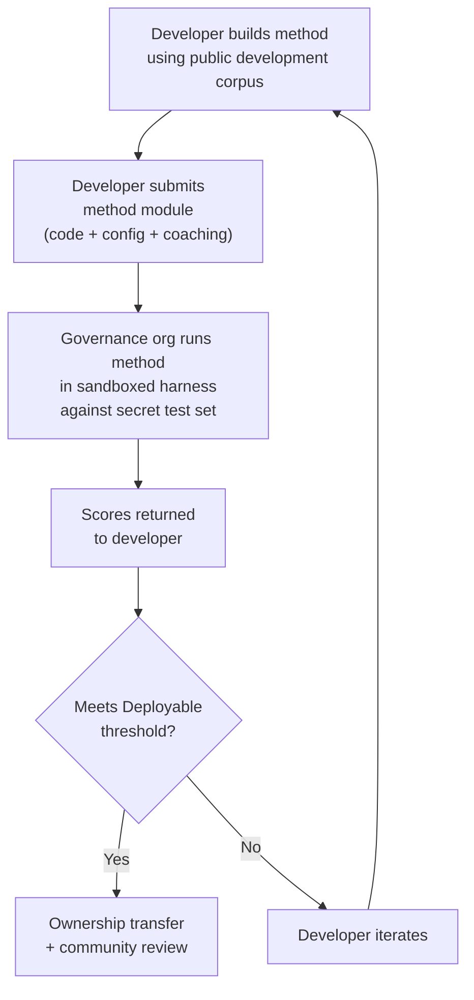

# مواصفات المعيار المرجعي (Benchmark)

> **الملخص التنفيذي.** تحدد هذه الوثيقة بروتوكول التقييم لمنظومة تقييم الترجمة الآلية Champollion: تنسيق المدونة اللغوية (§2)، ومخطط بطاقة التشغيل (§3)، وبروتوكول المعيار المرجعي (§6)، ومتطلبات التحقق البشري (§7)، وآليات السيادة (§8)، ونموذج لوحة المتصدرين وتقديم الطلبات (§9)، وإطار التكلفة (§10)، وقابلية التوسع إلى لغات جديدة (§11). للاطلاع على تعريفات المقاييس، وأوزان الدرجة المركبة، وعتبات مستويات الجودة، وصيغ مقاييس التكلفة والسرعة، راجع `SCORING_SPEC.md` — المصدر الوحيد للحقيقة لجميع منطق التقييم. تشير هذه الوثيقة إلى SCORING_SPEC لتلك التفاصيل بدلاً من تكرارها.
>
> آخر تحديث: 2026-06-07

---

## 1. المبادئ

### 1.1 المقاييس الآلية مؤشرات تقريبية

كل مقياس معرَّف في هذه الوثيقة محسوب آليًا. chrF++، ومعدل قبول FST، والدقة الصرفية، والتشابه الدلالي — جميعها مؤشرات تقريبية آلية لجودة الترجمة. وهي مفيدة للتكرار السريع، والمقارنة المنهجية، واكتشاف التراجعات. لكنها **ليست بديلاً عن الحكم البشري**.

التسلسل الهرمي للتقييم:

```
Automated metrics (run cards, benchmarks)
    ↓ proxy for
Human review (bilingual speakers validate output)
    ↓ proxy for
Actual utility (does this help a language community?)
```

لا يمكن لأي درجة آلية، مهما كانت مرتفعة، أن تحل محل متحدث متمكّن يقرأ المخرجات ويؤكد أنها صحيحة وطبيعية ومناسبة ثقافيًا. مستويات الجودة المحددة في §5 هي تسميات استدلالية على الدرجات المركبة الآلية — مفيدة لتتبع التقدم، لكنها غير كافية بمفردها أبدًا.

### 1.2 طرق، لا نماذج

نحن نقيس **الطرق**، لا النماذج. النموذج مكوّن واحد فقط. أما الطريقة فهي الوصفة الكاملة: اختيار النموذج، وتصميم الموجّهات (prompts)، واستخدام الأدوات، والمعالجة القبلية/البعدية، وبيانات التدريب التوجيهي، واستراتيجيات إعادة المحاولة، وكل شيء. فريقان يستخدمان النموذج نفسه بطريقتين مختلفتين سيحصلان على درجات مختلفة. وهذا هو المقصود.

### 1.3 قابلية إعادة الإنتاج

يجب أن تكون كل نتيجة معيار مرجعي قابلة لإعادة الإنتاج. تلتقط بطاقة التشغيل (§3) التكوين الكامل للتجربة. وتحدد البصمة (§3.5) هوية الإعداد التجريبي. ويتحقق تجزيء (hash) بطاقة التشغيل (§3.6) من سلامة النتيجة. ينبغي لأي شخص يمتلك الطريقة والمدونة والتكوين نفسها أن يحقق درجات ضمن نطاق ±2% (مع مراعاة عدم حتمية أخذ العينات في النماذج اللغوية الكبيرة عند temperature > 0).

### 1.4 لا بيانات تقييم اصطناعية

**هذا المشروع لا يولّد بيانات تقييم اصطناعية ولا يستخدمها ولا يقرّها.** يجب أن تُستمد جميع المدونات من نصوص أصيلة من تأليف بشري — ترجمات منشورة، أو كتب تعليمية، أو وثائق ثنائية اللغة، أو ترجمات مستخلصة من متحدثين متمكّنين.

يمكن للنماذج اللغوية الكبيرة المساعدة في:
- محاذاة الجمل (إيجاد المقاطع المتوازية في نصوص ثنائية اللغة موجودة)
- تحويل التنسيق (تحويل المواد المنشورة إلى مخطط المدونة)
- إثراء البيانات الوصفية (اقتراح مستويات الصعوبة وتسميات السجل اللغوي)
- اقتراح جمل مصدرية للترجمة البشرية (§11.3 — خطوة الترجمة بشرية دائمًا)

يجب ألا تولّد النماذج اللغوية الكبيرة **أبدًا** ترجمات مرجعية أو أزواج تقييم.

**نحن محايدون تجاه عملية التطوير فيما يخص بيانات التدريب.** إذا استخدم مطوّر الطريقة بيانات تدريب اصطناعية، أو الترجمة العكسية (backtranslation)، أو تعزيز البيانات في طريقته، فهذا خياره — نحن نقيّم المخرجات، لا عملية التدريب. يستخدم نموذج OMT-1600 من Meta نحو 270 مليون جملة متوازية اصطناعية مولّدة عبر الترجمة العكسية. ولا اعتراض لدينا على الطرق المدرّبة بهذا الأسلوب. نحن نختبر على البيانات المنسّقة بشريًا فقط.

> **لماذا لا نستخدم النص الكتابي المقدّس للتقييم؟** يقيّم OMT-1600 ما عدده 1,560 لغة من أصل 1,600 على نصوص من نطاق الكتاب المقدس. تتسم ترجمات الكتاب المقدس بسجل لغوي قديم، ومفردات طقسية، وبنية جمل نمطية. أما مدونات التقييم لدينا فمستمدة من نصوص منسّقة مجتمعيًا ومتنوعة النطاقات — الصحة، والقانون، والتعليم، والشؤون الحكومية، والمحادثة، والنطاقات التقنية (انظر §2.7). وهذا خيار تصميمي متعمّد. تحتاج المجتمعات إلى الترجمة في النطاقات التي تعيش وتعمل فيها فعلاً، لا إلى سجل ديني واحد. فالطريقة التي تحقق درجات عالية على سفر التكوين 1:1 لا تخبرك شيئًا تقريبًا عن أدائها على جدول أعمال مجلس قبلي أو نموذج استقبال في عيادة.

---

## 2. مخطط المدونة اللغوية

المدونة اللغوية هي مجموعة منسّقة من أزواج النصوص المتوازية مع بيانات وصفية منظمة. وهي المرجع الأساسي (ground truth) الذي تُقاس عليه جميع الطرق.

### 2.1 الغلاف الخارجي لمجموعة البيانات

البنية العليا لملف المدونة:

```json
{
  "dataset": {
    "id": "edtekla-dev-v1",
    "version": "1.0",
    "language_pair": "EN→CRK",
    "source_language": "en",
    "target_language": "crk",
    "created": "2026-05-01",
    "license": "CC-BY-NC-SA-4.0",
    "provenance": ["gold_standard", "textbook"]
  },
  "entries": [ ... ]
}
```

| الحقل | النوع | مطلوب | الوصف |
|-------|------|----------|-------------|
| `id` | string | ✅ | معرّف فريد لمجموعة البيانات، يُستخدم في بطاقات التشغيل ولوحة المتصدرين |
| `version` | string | ✅ | إصدار دلالي. زيادته تُبطل مقارنات بطاقات التشغيل السابقة |
| `language_pair` | string | ✅ | تسمية العرض (مثل `EN→CRK`) |
| `source_language` | string | ✅ | رمز لغة المصدر وفق BCP 47 |
| `target_language` | string | ✅ | رمز اللغة الهدف وفق BCP 47 |
| `created` | string | ✅ | تاريخ الإنشاء بصيغة ISO 8601 |
| `license` | string | ✅ | معرّف الترخيص وفق SPDX |
| `provenance` | string[] | ✅ | قائمة بوسوم مصدر البيانات المستخدمة عبر الإدخالات |

### 2.2 مخطط الإدخال

يمثّل كل إدخال في المدونة تحديًا ترجميًا واحدًا:

```json
{
  "id": 42,
  "source": "I see the dog",
  "reference": "niwâpamâw atim",
  "segment": "gold_standard",
  "difficulty": 2,
  "provenance": "gold_standard",
  "register": "conversational",
  "context": "declaration",
  "morphological_analysis": "ni-wâpam-âw atim | 1sg-see.TA-3sg.DIR dog.AN",
  "notes": "Animate noun (atim); direct form because speaker is proximate",
  "variant_class": "simple-ta-direct"
}
```

| الحقل | النوع | مطلوب | الوصف |
|-------|------|----------|-------------|
| `id` | integer | ✅ | معرّف فريد داخل المدونة |
| `source` | string | ✅ | النص المصدر بلغة المصدر |
| `reference` | string | ✅ | الترجمة المرجعية المعيارية الذهبية باللغة الهدف |
| `segment` | string | 📎 | قسم المدونة: `gold_standard`، أو `held_out`، أو `development`، أو `diagnostic` |
| `difficulty` | integer | 📎 | تقييم الصعوبة من 1 إلى 5 (انظر §2.4) |
| `provenance` | string | 📎 | أصل هذا الإدخال (انظر §2.5) |
| `register` | string | 📎 | مستوى السجل اللغوي/الرسمية (انظر §2.6) |
| `context` | string | 📎 | الوظيفة التواصلية (انظر §2.6) |
| `domain` | string | 📎 | نطاق حالة الاستخدام من تصنيف الرموز الستة عشر (انظر §2.7). يجب أن يكون واحدًا من: `conv`، `ecommerce`، `edu`، `financial`، `gov`، `legal`، `literary`، `marketing`، `medical`، `news`، `religious`، `scientific`، `subtitles`، `support`، `tech`، `ui`. يُتحقق منه عند الإنشاء. |

> **📎 = موصى به.** يتعامل إطار التشغيل مع الحقول الاختيارية المفقودة بسلاسة عبر القيم الافتراضية. لا تحتاج المدونات الخارجية إلا إلى توفير `id` و`source` و`reference` لكل إدخال.
| `morphological_analysis` | string | ❌ | تحليل صرفي معياري ذهبي |
| `notes` | string | ❌ | ملاحظات المترجم، والمتغيرات اللهجية، وإشارات الالتباس |
| `variant_class` | string | ❌ | تسمية فئة تجمع متغيرات الترجمة المقبولة |


### 2.3 أقسام المدونة

تُقسّم المدونة إلى أقسام بمستويات وصول مختلفة:

| القسم | الغرض | الوصول | الحجم الأدنى |
|---------|---------|--------|-------------|
| `development` | تطوير الطرق والتكرار عليها. يستخدمها المطورون بحرية. | **عام** | 30 إدخالاً |
| `diagnostic` | اختبارات موجهة لظواهر لغوية محددة. | **عام** | 10 إدخالات |
| `gold_standard` | التقييم الرسمي للمعيار المرجعي. تأتي درجات لوحة المتصدرين من هنا. | **سري** — تحتفظ به منظمة الحوكمة | 50 إدخالاً |
| `held_out` | محجوز للتقييم المستقبلي. لا يُستخدم أبدًا حتى تفعيله. | **سري** — تحتفظ به منظمة الحوكمة | 10 إدخالات |

> **الحالة الراهنة:** لا يوجد في مجموعات البيانات المنشورة سوى القسم `development`. الأقسام `diagnostic` و`gold_standard` و`held_out` معرّفة للاستخدام المستقبلي مع نمو المدونات.

القسمان `gold_standard` و`held_out` سريان بالكامل. تُحفظ كل من الجمل المصدرية والترجمات المرجعية على بنية تحتية تخضع لسيطرة الحوكمة. لا يرى مطورو الطرق أبدًا الأسئلة ولا الإجابات. انظر §8 للاطلاع على آلية السيادة.

### 2.4 مستويات الصعوبة

| المستوى | الوصف | أمثلة |
|------|-------------|----------|
| 1 — مفردات أساسية | كلمات مفردة، تحيات شائعة، أرقام | "hello" → "tânisi"، "dog" → "atim" |
| 2 — جمل بسيطة | فاعل-فعل أو SVO، الزمن المضارع | "I see the dog" → "niwâpamâw atim" |
| 3 — تعقيد متوسط | الزمن الماضي/المستقبل، صيغ الملكية، التذكير الحيوي (animacy) | "I saw his dog yesterday" |
| 4 — صرف معقّد | الإحالة الإبعادية (obviation)، المبني للمجهول، النمط الاقتراني (conjunct order)، الجمل الموصولة | "the woman whose son went to the store" |
| 5 — متقدم | جمل متعددة العبارات، سجل رسمي، احتفالي، تعبيرات اصطلاحية | فقرة كاملة بنبرة مناسبة للسجل |

ينبغي للمدونة جيدة البناء أن تتضمن إدخالات عبر مستويات الصعوبة الخمسة جميعها، مع ترجيح المستويات 2–4 حيث تقع معظم تحديات الترجمة في العالم الواقعي.

### 2.5 وسوم مصدر البيانات

يجب أن يبيّن كل إدخال أصله:

| الوسم | المعنى |
|-----|---------|
| `gold_standard` | تم التحقق منه بواسطة متحدثين متمكّنين |
| `textbook` | من مواد تعليمية منشورة |
| `elicited` | أُنتج عبر جلسات استخلاص منظمة |
| `corpus` | مستخرج من مدونة متوازية |

> **ملاحظة:** عمليًا، قيم مصدر البيانات سلاسل نصية حرة. الوسوم أعلاه أعراف وليست تعدادًا (enum) خاضعًا للتحقق — قد تستخدم مجموعات البيانات سلاسل وصفية أخرى لمصدر البيانات.

### 2.6 السجل اللغوي والسياق

يصف **السجل اللغوي** درجة الرسمية والسياق الاجتماعي:

| السجل | الوصف |
|----------|-------------|
| `conversational` | الكلام اليومي بين الأنداد |
| `formal` | اللغة الرسمية أو المؤسسية |
| `technical` | مفردات متخصصة بنطاق معين |
| `ceremonial` | الاستخدام التقليدي أو المقدّس للغة |
| `educational` | مواد تعليم اللغة |

يصف **السياق** الوظيفة التواصلية:

> 🔲 **مخطط له.** الحقل `context` معرّف في المخطط لكنه غير معبأ بعد في مجموعات البيانات الحالية. وهو محجوز لإثراء المدونة مستقبلاً.

| السياق | الوصف |
|---------|-------------|
| `greeting` | تحية اجتماعية أو وداع |
| `declaration` | تصريح بحقيقة |
| `question` | استفهام |
| `instruction` | أمر أو توجيه |
| `narrative` | سرد أو وصف |
| `label` | تسمية واجهة مستخدم، أو نص زر، أو عنوان |
| `error` | رسالة خطأ أو تحذير |

### 2.7 النطاق

يصف **النطاق** حالة الاستخدام في العالم الواقعي — نوع المحتوى المترجَم. وهو مستقل عن السجل والسياق:

- **السجل** يجيب عن: *ما درجة رسمية هذا النص؟*
- **السياق** يجيب عن: *ماذا تفعل هذه الجملة؟*
- **النطاق** يجيب عن: *لأي صناعة/حالة استخدام هذا النص؟*

قد يكون عقد قانوني (النطاق: `legal`) رسميًا (السجل: `formal`) ويتضمن تصريحًا (السياق: `declaration`). وقد يكون نص محادثة روبوت قانوني (النطاق: `legal`) حواريًا (السجل: `conversational`) ويتضمن أسئلة (السياق: `question`). النطاق نفسه، لكن السجل والسياق مختلفان.

| رمز النطاق | الوصف | المستهلكون النموذجيون |
|-------------|-------------|-------------------|
| `ui` | نصوص واجهات البرمجيات | مطورو التطبيقات، فرق التوطين |
| `legal` | العقود، والتشريعات، والمرافعات القضائية، ووثائق الهجرة | مكاتب المحاماة، والمحاكم، وفرق الامتثال، ومحامو الملكية الفكرية |
| `medical` | الملاحظات السريرية، وملصقات الأدوية، ومراسلات المرضى، وبروتوكولات التجارب | المستشفيات، وشركات الأدوية، والتجارب السريرية، وبوابات المرضى |
| `financial` | الخدمات المصرفية، والتأمين، والإيداعات التنظيمية، وتقارير التدقيق | البنوك، وشركات التأمين، والجهات التنظيمية، والمدققون |
| `edu` | الكتب الدراسية، والمناهج، وخطط الدروس، والمواد الأكاديمية | المدارس، والجامعات، وناشرو الكتب الدراسية |
| `ecommerce` | أوصاف المنتجات، والمراجعات، وقوائم المتاجر الإلكترونية | تجار التجزئة عبر الإنترنت، وبائعو الأسواق الإلكترونية |
| `marketing` | النصوص الإعلانية، ورسائل العلامات التجارية، والحملات، والشعارات | وكالات الإعلان، وفرق العلامات التجارية |
| `gov` | وثائق السياسات، واللوائح، والإشعارات العامة، والتشريعات | الجهات الحكومية، وفرق الامتثال |
| `scientific` | الأوراق البحثية، والملخصات، والمنهجيات، ومقترحات المنح | الباحثون، والمجلات العلمية، وهيئات المنح |
| `religious` | الكتب المقدسة، والنصوص الطقسية، والتعليقات اللاهوتية | المجتمعات الدينية، وناشرو النصوص الطقسية |
| `support` | الأسئلة الشائعة، ورسائل الخطأ، وأدلة استكشاف الأخطاء، ونصوص روبوتات المحادثة | شركات SaaS، ومكاتب الدعم |
| `subtitles` | حوارات الأفلام والتلفزيون والبث والألعاب | منصات البث، والاستوديوهات، وشركات الألعاب |
| `news` | الصحافة، وتقارير الوكالات، والمقالات الافتتاحية، والبيانات الصحفية | المؤسسات الإعلامية، ووكالات الأنباء |
| `literary` | الأدب الروائي، والشعر، والسرد، والنصوص الثقافية | الناشرون، ومنظمات الحفاظ على الثقافة |
| `conv` | المحادثات غير الرسمية، ووسائل التواصل الاجتماعي، والمراسلة | التطبيقات الاستهلاكية، والمنصات الاجتماعية |
| `tech` | وثائق API، والأدلة، والمواصفات الهندسية، والأدلة التقنية | فرق التوثيق، والمؤسسات الهندسية |

> **معايير مرجعية خاصة بالنطاقات.** يقيّم المعيار المرجعي العام الطريقة عبر جميع النطاقات. لكن الـ Arena يدعم أيضًا **معايير مرجعية مرشّحة حسب النطاق** — حيث تُحسب الدرجات فقط على الإدخالات الموسومة بنطاق معين. وهذا يتيح للمستخدمين الإجابة عن: "ما الطريقة الأفضل لترجمة الوثائق القانونية إلى الفرنسية؟" مقابل "ما الطريقة ذات أفضل درجة إجمالية للفرنسية؟"
>
> تشكّل تصنيفات لوحة المتصدرين المرشّحة حسب النطاق ميزة أساسية في المنتج. ستؤدي الطرق المختلفة أداءً متباينًا عبر النطاقات — فطريقة معايرة بدقة على المصطلحات القانونية قد تتفوق في المعايير القانونية لكنها تقصّر في النصوص الحوارية. يساعد الـ Arena المستخدمين على إيجاد الحل الأنسب لحالة استخدامهم المحددة.

> **مستقبلاً: روبوت محادثة Arena.** سيتضمن موقع Arena مساعدًا حواريًا يساعد المستخدمين على وصف حالة استخدامهم للترجمة الآلية (النطاق، والزوج اللغوي، ومتطلبات الجودة) ويوصي بأفضل طريقة موثّقة مجتمعيًا من لوحة المتصدرين. على سبيل المثال: "أحتاج إلى ترجمة بروتوكولات التجارب السريرية من الإنجليزية إلى اليابانية — ما الطريقة التي تحقق أعلى الدرجات في معايير النطاق الطبي EN→JA؟" يعتمد ذلك على توفر بيانات تقييم كافية موسومة بالنطاقات وتنوع كافٍ في الطرق.

---

## 3. مخطط بطاقة التشغيل

بطاقة التشغيل هي الوحدة الذرية للتقييم. وهي وثيقة JSON قائمة بذاتها تسجّل التكوين الكامل ونتائج عملية تقييم واحدة: طريقة واحدة، ونموذج واحد، وتكوين واحد، ومجموعة بيانات واحدة.

تلتقط كل بطاقة تشغيل ثلاثة أبعاد:
- **الجودة** — ما مدى جودة الترجمات؟
- **التكلفة** — كم كلّف إنتاجها؟
- **السرعة** — كم استغرقت من الوقت؟

### 3.1 الحقول العليا

| الحقل | النوع | الوصف |
|-------|------|-------------|
| `run_id` | string | UUID v4 يُولَّد عند بدء التشغيل |
| `harness_version` | string | إصدار دلالي لإطار التشغيل (مثل `2.0`) |
| `timestamp` | string | طابع زمني ISO 8601 بتوقيت UTC عند بدء التشغيل |
| `elapsed_seconds` | number | المدة الفعلية الكاملة للتشغيل بأكمله |

### 3.2 تكوين الطريقة

تحدد هذه الحقول الإعداد التجريبي — ما الذي اختُبر وكيف.

| الحقل | النوع | مطلوب | الوصف |
|-------|------|----------|-------------|
| `model_slug` | string | ✅ | معرّف النموذج (مثل `google/gemini-2.5-flash`) |
| `model_id` | string | ❌ | معرّف النموذج النهائي الذي تعيده واجهة API |
| `condition` | string | ✅ | تسمية التجربة (مثل `baseline`، أو `coached-v3`، أو `few-shot`) |
| `temperature` | number | ✅ | درجة حرارة أخذ العينات |
| `system_prompt_sha256` | string | ✅ | تجزئة SHA-256 لموجّه النظام الكامل |
| `system_prompt_used` | string | ✅ | النص الكامل لموجّه النظام |
| `coaching_data_sha256` | string | ❌ | تجزئة SHA-256 لملف بيانات التدريب التوجيهي، إن استُخدم |
| `fst_version` | string | ❌ | إصدار محلل FST، إن استُخدم |
| `tools_enabled` | string[] | ❌ | قائمة الأدوات المتاحة للطريقة |
| `batch_size` | number | ❌ | عدد الإدخالات لكل دفعة API متزامنة |
| `max_retries` | number | ❌ | الحد الأقصى لإعادة المحاولات عند رفض FST، إن وُجد |

:::info Published Run Cards Include method_config
عند نشر بطاقة تشغيل إلى لوحة المتصدرين (عبر `mt-eval publish`)، فإنها تتضمن أيضًا كتلة `method_config` تحتوي على MethodConfig القياسي ذي الحقول الثمانية (`model`، `temperature`، `batchSize`، `register`، `coachingFile`، `coachingPrompt`، `promptContext`، `qualityTier` — جميعها بصيغة camelCase). يتيح هذا الاستيراد دون إعادة بناء: يقرأ `champollion leaderboard --install` كتلة `method_config` مباشرة ويكتبها كبيان إضافة (plugin manifest). تسجّل حقول القياس عن بُعد أعلاه (§3.2) ما لاحظه إطار التشغيل؛ بينما يسجّل `method_config` ما قصده المطوّر.
:::

### 3.3 مرجع مجموعة البيانات

| الحقل | النوع | الوصف |
|-------|------|-------------|
| `dataset.id` | string | معرّف مجموعة البيانات |
| `dataset.version` | string | إصدار مجموعة البيانات |
| `dataset.language_pair` | string | تسمية العرض |
| `dataset.sha256` | string | تجزئة SHA-256 لمحتويات ملف مجموعة البيانات |
| `dataset.entry_count` | number | عدد الإدخالات المقيَّمة |

تثبّت تجزئة SHA-256 لمجموعة البيانات النتيجة على إصدار محدد من البيانات. إذا تغيرت مجموعة البيانات، تصبح بطاقات التشغيل القديمة غير قابلة للمقارنة.

### 3.4 الدرجات (الجودة)

مقاييس مجمّعة للتشغيل بأكمله. جميع مقاييس الجودة **آلية** — انظر §1.1.

| الحقل | النوع | الوصف |
|-------|------|-------------|
| `scores.total` | number | إجمالي الإدخالات المقيَّمة |
| `scores.exact_matches` | number | الإدخالات التي تطابقت فيها المخرجات تمامًا مع المرجع |
| `scores.exact_match_rate` | number | 0.0–1.0 |
| `scores.equivalent_matches` | number | الإدخالات المطابقة لمتغير مقبول |
| `scores.equivalent_match_rate` | number | 0.0–1.0 |
| `scores.fst_accepted` | number | الإدخالات التي قبلها محلل FST |
| `scores.fst_acceptance_rate` | number | 0.0–1.0، `null` في حال عدم تكوين FST |
| `scores.morphological_accuracy` | number | 0.0–1.0، `null` في حال عدم وجود تحليل معياري ذهبي |
| `scores.chrf_plus_plus` | number | درجة chrF++ على مستوى المدونة (0–100) |
| `scores.semantic_score` | number | تشابه دلالي قائم على التضمين (0.0–1.0) |
| `scores.ter` | number | معدل تحرير الترجمة Translation Edit Rate (0–∞، الأقل أفضل) |
| `scores.length_ratio` | number | avg(len(predicted)/len(reference))، القيمة المثالية = 1.0 |
| `scores.code_switching_rate` | number | 0.0–1.0، نسبة الإدخالات ذات تسرب من لغة المصدر |
| `scores.hallucination_rate` | number | 0.0–1.0، نسبة الإدخالات ذات محتوى مُهَلوَس |
| `scores.terminology_adherence` | number | 0.0–1.0، الالتزام بمصطلحات المسرد (`null` في حال عدم وجود مسرد) |
| `scores.tokens_per_second` | number | total_tokens / elapsed_seconds |
| `scores.entries_per_minute` | number | عدد الإدخالات المترجمة في الدقيقة |
| `scores.composite` | number | الدرجة المركبة الموزونة (0.0–1.0). انظر SCORING_SPEC §4 |
| `scores.errors` | number | الإدخالات التي فشلت (خطأ API، انتهاء المهلة، إلخ) |
| `scores.by_difficulty` | object | الدرجات مفصّلة حسب مستوى الصعوبة |
| `scores.by_provenance` | object | الدرجات مفصّلة حسب وسم مصدر البيانات |
| `scores.by_domain` | object | ✅ منفَّذ — الدرجات مفصّلة حسب النطاق (§2.7). يتيح ترتيب لوحة المتصدرين المرشّحة حسب النطاق. يُحسب بواسطة tester.py ويُمرَّر عبر publish.py. |

### 3.5 الإجماليات (التكلفة)

| الحقل | النوع | الوصف |
|-------|------|-------------|
| `totals.prompt_tokens` | number | إجمالي رموز الإدخال عبر جميع استدعاءات API |
| `totals.completion_tokens` | number | إجمالي رموز الإخراج |
| `totals.reasoning_tokens` | number | الرموز المستخدمة لسلسلة التفكير (0 لمعظم النماذج) |
| `totals.cached_tokens` | number | الرموز المقدَّمة من ذاكرة التخزين المؤقت للموجّهات لدى المزوّد |
| `totals.total_cost_usd` | number | إجمالي التكلفة بالدولار الأمريكي |
| `totals.cost_per_entry_usd` | number | `total_cost_usd / entry_count` |
| `totals.cost_per_source_char` | number | دولار أمريكي لكل حرف مصدري — قابل للمقارنة عبر اللغات |

### 3.6 التوقيت (السرعة)

| الحقل | النوع | الوصف |
|-------|------|-------------|
| `elapsed_seconds` | number | المدة الفعلية للتشغيل الكامل (على المستوى الأعلى) |
| `scores.avg_latency_seconds` | number | متوسط زمن الاستجابة لكل إدخال |
| `scores.median_latency_seconds` | number | وسيط زمن الاستجابة لكل إدخال |
| `scores.p95_latency_seconds` | number | المئين 95 لزمن الاستجابة لكل إدخال |

### 3.7 النتائج لكل إدخال

يسجّل كل عنصر في المصفوفة `results[]` ترجمة واحدة. تُحفظ بيانات كل إدخال في الجدول `run_card_entries` (الترحيل 005) مع أحكام LYSS غير المعيارية (الترحيل 006).

| الحقل | النوع | الوصف |
|-------|------|-------------|
| `entry_id` | string | يطابق `entries[].id` في المدونة |
| `source` | string | النص المصدر الذي تُرجم |
| `expected` | string | الترجمة المرجعية المعيارية الذهبية |
| `raw_predicted` | string \| null | مخرجات النموذج الخام قبل المعالجة البعدية |
| `predicted` | string | المخرجات الفعلية للطريقة (بعد المعالجة) |
| `segment` | string | معرّف المقطع (مثل فهرس الجملة) |
| `difficulty` | string \| null | مستوى الصعوبة من المدونة |
| `domain` | string | وسم النطاق من المدونة (§2.7) |
| `exact_match` | boolean | هل تطابقت المخرجات تمامًا مع المرجع |
| `chrf_score` | number \| null | chrF++ على مستوى الجملة (0–100) |
| `bleu_score` | number \| null | BLEU على مستوى الجملة (0–100) |
| `latency_s` | number \| null | زمن الاستجابة بالثواني |
| `cost_usd` | number \| null | التكلفة بالدولار الأمريكي لهذا الإدخال |
| `tool_call_count` | integer | عدد استدعاءات الأدوات المستخدمة (0 إن لم تُستخدم) |
| `error` | string \| null | رسالة الخطأ في حال فشل هذا الإدخال |
| `plugin_metrics` | object | مخرجات الإضافة الكاملة لكل إدخال (JSONB) |
| `fst_valid` | boolean \| null | قَبِل GiellaLT FST التنبؤ (LYSS-fst غير معياري) |
| `equivalent_match` | boolean \| null | أكّد مدقق CRK التكافؤ البنيوي (LYSS-eq غير معياري) |
| `semantic_verdict` | string \| null | حكم LYSS-sem: `VALID`، أو `MISMATCH`، أو `UNKNOWN`، أو `ERROR` |
| `code_switching_detected` | boolean \| null | تم اكتشاف رموز من لغة المصدر في المخرجات |
| `hallucination_detected` | boolean \| null | تم اكتشاف محتوى مختلَق في المخرجات |


### 3.8 البصمة

معرّف لقابلية إعادة الإنتاج. تشغيلان ببصمتين متطابقتين استخدما الإعداد التجريبي نفسه.

البصمة هي تجزئة SHA-256 للتسلسل المرتّب المكوَّن من:
- `dataset.sha256`
- `model_slug`
- `condition`
- `system_prompt_sha256`
- `temperature`
- `harness_version`
- `batch_size`
- `tools_enabled`

> **لماذا 8 مكونات؟** يؤثر حجم الدفعة واستدعاء الأدوات تأثيرًا جوهريًا في جودة المخرجات ويجب تضمينهما في الهوية. تشغيلان بحجمي دفعة مختلفين أو بأدوات مفعّلة مختلفة هما إعدادان تجريبيان مختلفان، حتى لو تطابقت جميع المعاملات الأخرى.

ينبغي لتشغيلين ببصمتين متطابقتين أن ينتجا نتائج قابلة للمقارنة. وتعود الفروق إلى عدم حتمية واجهة API (عند temperature > 0) أو تحديثات النموذج من جانب المزوّد.

### 3.9 تجزئة بطاقة التشغيل

تجزئة SHA-256 لكامل بطاقة التشغيل بصيغة JSON (مع تعيين الحقل `run_card_hash` نفسه إلى `""` أثناء التجزئة). هذا هو ختم اكتشاف التلاعب. إذا تغيّر أي حقل، تنكسر التجزئة.

---

## 4. المقاييس الآلية

جميع المقاييس في هذا القسم محسوبة آليًا. انظر §1.1.

### 4.1 تعريفات المقاييس

| المقياس | الحالة | ما الذي يقيسه | النطاق |
|--------|--------|-----------------|-------|
| **chrF++** | ✅ منفَّذ | درجة F للوحدات النونية على مستوى الأحرف. يعمل على مستوى الحرف، مما يجعله أكثر متانة من المقاييس على مستوى الكلمات (BLEU) للغات الغنية صرفيًا حيث تكون الكلمات طويلة وشديدة التصريف. يُحسب بواسطة sacrebleu. | 0–100 (المقياس الأصلي). يُقسَّم على 100 عند استخدامه في الدرجة المركبة. |
| **FST acceptance rate** | ✅ منفَّذ | نسبة الكلمات المتنبَّأ بها التي يقبلها المحلل الصرفي (GiellaLT HFST) كصيغ صحيحة في اللغة الهدف. الكلمة التي يقبلها FST كلمة حقيقية صحيحة بنيويًا — وليست هلوسة. | 0.0–1.0 |
| **Exact match** | ✅ منفَّذ | نسبة التنبؤات المطابقة تمامًا للمرجع بعد التطبيع وفق Unicode. صارم لكنه قاطع — مفيد كفحص للحد الأعلى. | 0.0–1.0 |
| **Morphological accuracy** | 🔲 مخطط له | للإدخالات ذات التحليل الصرفي المعياري الذهبي: نسبة المورفيمات المولّدة بشكل صحيح. أدق من معدل قبول FST — فقد تكون الكلمة صالحة وفق FST لكن ببنية مورفيمية خاطئة (جذر صحيح، زمن خاطئ). | 0.0–1.0 |
| **Equivalent match** | ⚡ جزئي | النسبة المطابقة لمتغير مقبول من المرجع — مع مراعاة ترتيب الكلمات، والاختلافات اللهجية، والأعراف الإملائية. منفَّذ حاليًا للغة CRK عبر `CrkLinterMetric` في معيار تقييم CRK (في `eval_standards/crk/`)؛ يُحمَّل تلقائيًا عبر إعلان `evalMetrics` في بطاقة لغة CRK. يتطلب التنفيذ العام وجود `variants[]` لكل إدخال في المدونة. | 0.0–1.0 |
| **Semantic score** | ⚡ جزئي | الحفاظ على المعنى بغض النظر عن الصيغة السطحية. منفَّذ حاليًا للغة CRK عبر `CrkSemanticMetric` في معيار تقييم CRK (في `eval_standards/crk/`، مؤشر تقريبي موزون بالأحكام). التشابه الكوني القائم على جيب التمام بين التضمينات مخطط له — انظر SCORING_SPEC §2.3. | 0.0–1.0 |

### 4.2 الدرجة المركبة

الدرجة المركبة (composite score) هي متوسط موزون لجميع المقاييس *المتاحة*:

```
composite = Σ (weight_i × metric_i)   for all available metrics
             ─────────────────────
             Σ weight_i              (renormalized to sum to 1.0)
```

عندما يكون مقياس ما غير متاح (لا FST مكوَّن، لا فئات متغيرات معرّفة، لا نموذج تضمين)، يُعاد توزيع وزنه تناسبيًا على المقاييس المتبقية. وهذا يعني أن الدرجة المركبة قابلة للمقارنة دائمًا داخل اللغة الواحدة — فهي تستخدم المقاييس المتاحة لتلك اللغة وتطبّعها وفقًا لذلك.

**جداول الأوزان، وقواعد تطبيع المدخلات، وجرد المقاييس الكامل معرّفة في `SCORING_SPEC.md` §4.** تلك الوثيقة هي المصدر الوحيد للحقيقة (SSOT) لما يلي:
- أوزان Profile A (اللغات ذات تغطية FST — 9 مقاييس، تحمل المقاييس البنيوية 40%)
- أوزان Profile B (اللغات دون تغطية FST — 8 مقاييس)
- قواعد التطبيع (chrF++ ÷ 100، وعكس معدلي التبديل اللغوي والهلوسة)
- المقاييس المستثناة من الدرجة المركبة (BLEU وCOMET وTER ونسبة الطول والاتساق) وأسباب ذلك

تعكس شيفرة إطار التشغيل هذه الجداول في `mt_eval_harness/scoring.py`. عند تغيير SCORING_SPEC، يُحدَّث `scoring.py` ليتطابق ويتحقق `test_scoring_ssot.py` من التوافق.

> **لماذا لا نستخدم BLEU؟** يعمل BLEU على مستوى الكلمات ويعاقب التنوع الصرفي. في اللغات متعددة التركيب، يمكن لكلمة واحدة أن تكون جملة كاملة — وسيعامل BLEU الاختلافات التصريفية الطفيفة على أنها إخفاقات كاملة. يتعامل chrF++ مع ذلك بشكل أفضل لأنه يعمل على مستوى الأحرف. BLEU مستثنى من جدولي الأوزان كليهما. انظر الملحق A في SCORING_SPEC للاطلاع على المبررات الكاملة.


### 4.3 الدرجة المعدّلة بالتكلفة

للطرق التي تستخدم واجهات API مدفوعة، نُصدر أيضًا تصنيفًا ثانويًا. صيغة الدرجة المعدّلة بالتكلفة معرّفة في `SCORING_SPEC.md` §6.3.

---

## 5. مستويات الجودة

مستويات الجودة تسميات استدلالية على الدرجات المركبة الآلية. وهي تصف ما تعنيه الدرجات عادةً في الممارسة العملية، استنادًا إلى المراجعة البشرية للمخرجات عند كل مستوى. **وهي ليست أحكام جودة موثَّقة** — فالمراجعة البشرية وحدها (§6) يمكنها تأكيد قابلية الاستخدام الفعلية.

**عتبات المستويات وأوصافها معرّفة في `SCORING_SPEC.md` §5.** المستويات هي: Baseline‏ (0.00–0.30)، وEmerging‏ (0.30–0.50)، وFunctional‏ (0.50–0.70)، وDeployable‏ (0.70–0.85)، وFluent‏ (0.85–1.00).

> [!IMPORTANT]
> **المستويات الآلية مؤقتة.** هذه التسميات ترشيحات للمراجعة، وليست إقرارات جودة. الطريقة التي تبلغ مستوى "Deployable" على المقاييس الآلية مرشّحة للتقييم المجتمعي — وليست منتجًا جاهزًا للإطلاق. فالمراجعة البشرية وحدها (§7) يمكنها تأكيد قابلية الاستخدام الفعلية. وقد تختلف حدود المستويات بين اللغات.

هذه المستويات مؤقتة. وستُعاد معايرتها مع تراكم بيانات التحقق البشري وتعلّمنا أين تقع عتبة "يجد المتحدث هذا مفيدًا" الفعلية لكل لغة. وقد تختلف حدود المستويات بين اللغات.

لا يمكن لأي طريقة ادعاء مستوى **Deployable** أو أعلى دون مراجعة مجتمعية تؤكد إجماع المتحدثين ثنائيي اللغة على قابلية استخدام المخرجات.

---

## 6. بروتوكول المعيار المرجعي

**المعيار المرجعي** هو الإنتاج المنهجي لبطاقات التشغيل عبر فضاء معاملات معلَن على مجموعة بيانات معينة. وهو ليس تشغيلاً واحدًا — بل استكشاف منظم لأداء التكوينات المختلفة.

### 6.1 ما الذي ينتجه المعيار المرجعي

ينتج المعيار المرجعي **مصفوفة من بطاقات التشغيل** — واحدة لكل توليفة من قيم المعاملات. وتتيح المصفوفة مقارنة متعددة الأوجه عبر:

- **الجودة** — الدرجة المركبة، وتفصيلات المقاييس الفردية
- **التكلفة** — التكلفة الإجمالية ولكل إدخال لكل تكوين
- **السرعة** — الزمن الفعلي وزمن الاستجابة لكل إدخال

لا توجد "درجة معيار مرجعي" واحدة. المعيار المرجعي هو المصفوفة الكاملة. وسيهتم أصحاب المصلحة المختلفون بجوانب مختلفة: فالباحث يُحسّن الدرجة المركبة، ومهندس النشر يُحسّن التكلفة لكل إدخال، والمجتمع يراجع الجودة.

### 6.2 فضاء المعاملات

يعلن المعيار المرجعي المعاملات التي تُبدَّل:

| المحور | القيم النموذجية | الغرض |
|------|---------------|---------|
| `model` | 4–12 نموذجًا (طليعي + متوسط + اقتصادي) | ما مدى أهمية قدرة النموذج؟ |
| `temperature` | 0.0، 0.3، 0.7 | هل تفيد عشوائية أخذ العينات أم تضر؟ |
| `prompt_version` | 2–3 استراتيجيات موجّهات | ما مدى حساسية الطريقة لتصميم الموجّه؟ |
| `coaching_config` | مع/بدون بيانات التدريب التوجيهي | هل يحسّن حقن المعرفة اللغوية المخرجات؟ |
| `tool_config` | مع/بدون FST، مع/بدون قاموس | هل تحسّن الأدوات اللغوية المخرجات؟ |

فضاء التباديل الكامل:
```
runs = |models| × |temperatures| × |prompts| × |coaching| × |tools|
```

معيار مرجعي أولي نموذجي: 12 نموذجًا × 3 درجات حرارة × 2 موجّه × 2 تدريب توجيهي = 144 تشغيلاً.

### 6.3 تقييم خط الأساس مقابل تقييم الطريقة

يخدم المعيار المرجعي غرضين متمايزين:

**تحديد خط الأساس** — رسم خريطة المشهد بأساليب بسيطة. "ما الذي تستطيع النماذج الحالية فعله لهذه اللغة دون أي هندسة خاصة باللغة؟" هذا يحدد المستوى المرجعي. تخبرك مصفوفة خط الأساس: أي النماذج أقل هلوسة، وأي درجات الحرارة تنتج أكثر المخرجات اتساقًا، وما إذا كانت بيانات التدريب التوجيهي تفيد أصلاً، وأين تفشل جميع النماذج بشكل موحد (مما يكشف عن المشكلات اللغوية الصعبة).

**تقييم الطريقة** — اختبار طريقة مهندَسة محددة. "هل يتفوق خط الأنابيب المدرَّب توجيهيًا والمبوَّب بـ FST على خطوط الأساس؟" تُقارَن بطاقة تشغيل الطريقة بمصفوفة خط الأساس. وتكون الطريقة مثيرة للاهتمام عندما تتفوق على أفضل خط أساس — أي عندما تضيف الهندسة قيمة تتجاوز الاستدعاءات البسيطة للنماذج.

ينتج كلا النشاطين بطاقات تشغيل بالمخطط نفسه. والفرق يكمن في القصد وفضاء المعاملات: خطوط الأساس تبدّل عبر النماذج والتكوينات؛ بينما يختبر تقييم الطريقة طريقة واحدة مقابل أفضل التكوينات.

### 6.4 تقييم التطوير مقابل التقييم المعياري الذهبي

يكرر مطورو الطرق محاولاتهم بحرية على قسمي المدونة `development` و`diagnostic`. هذا غير رسمي — لا حدود، ولا تقديمات، ولا تدخّل من الحوكمة. المطوّر يتعلم ما الذي ينجح.

تأتي درجات لوحة المتصدرين الرسمية من تقييم `gold_standard` فقط. وهذا رسمي:
1. يقدّم المطوّر طريقته الكاملة القابلة للتشغيل (الشيفرة + التكوين + بيانات التدريب التوجيهي)
2. تشغّلها منظمة الحوكمة في إطار تشغيل معزول مقابل مجموعة الاختبار السرية
3. لا يعود سوى الدرجات

انظر §8 للاطلاع على آلية السيادة الكاملة.

---

## 7. التحقق البشري

المقاييس الآلية مؤشرات تقريبية. التحقق البشري هو المرجع الأساسي.

### 7.1 ما الذي تكتشفه المراجعة البشرية ولا تكتشفه المقاييس

- **صحيح صرفيًا لكنه خاطئ دلاليًا** — يقبل FST الكلمة، وchrF++ مرتفع، لكن الترجمة تعني شيئًا مختلفًا
- **غير مناسب ثقافيًا** — الترجمة صحيحة تقنيًا لكنها تستخدم سجلاً أو صياغة يرفضها المجتمع
- **معقولية مُهَلوَسة** — تبدو المخرجات كأنها باللغة الهدف لغير المتحدث بها لكنها هراء بالنسبة لمتحدث متمكّن
- **تنوع مقبول لكنه غير موسوم** — المخرجات صحيحة لكن المقاييس الآلية تعتبرها خاطئة لأنها تستخدم متغيرًا لهجيًا غير موجود في المرجع

### 7.2 بوابة التحقق

لا يمكن لأي طريقة الانتقال من مستوى **Functional** إلى مستوى **Deployable** دون تحقق بشري يؤكد إجماع المتحدثين ثنائيي اللغة على قابلية استخدام المخرجات. هذا ليس إجراءً شكليًا — بل هو جوهر الأمر. توجد المقاييس الآلية لتقليل حجم المخرجات التي تحتاج إلى مراجعة بشرية. ولا يمكنها أن تحل محلها.

### 7.3 بروتوكول المراجعة المجتمعية

> 🔲 **مخطط له**: واجهة المراجعة المجتمعية ليست متاحة بعد. يصف هذا القسم العملية المقصودة.

1. تبلغ الطريقة عتبة Deployable على المقاييس الآلية
2. تُعرض عينة من المخرجات (مقسّمة طبقيًا حسب مستوى الصعوبة) على متحدثين ثنائيي اللغة
3. يقيّم المتحدثون كل ترجمة على مقياس: **مرفوض**، **الفكرة العامة** (المعنى واضح لكن الصياغة خاطئة)، **مقبول** (صحيح مع مشكلات طفيفة)، **ممتاز** (لا يمكن تمييزه عن الترجمة البشرية)
4. تراجع منظمة الحوكمة التقييمات المجمّعة
5. إذا قَبِل المجتمع الطريقة، تنتقل إلى نقل الملكية والنشر

---

## 8. السيادة

تحتوي مجموعات بيانات التقييم على معرفة لغوية منسّقة تخص المجتمع اللغوي. يحدد هذا القسم الإطار التقني والقانوني لحماية تلك البيانات.

### 8.1 المشكلة

تنشر المعايير المرجعية التقليدية مجموعات الاختبار علنًا. وبمجرد النشر، لا يمكن التراجع عنه. وبالنسبة لمجتمعات اللغات الأصلية ولغات الأقليات، يخلق هذا ديناميكية استغلالية — تُستخدم البيانات اللغوية دون موافقة مستمرة. واتباعًا للرؤية البراغماتية لـ Dhein حول سيادة البيانات الحيوية، نعامل البيانات اللغوية كـ"مورد متقلّب ذي إمكانات غير قابلة للمعرفة" يتطلب حوكمة ديناميكية وعلائقية.

### 8.2 التنفيذ المعزول (Sandboxed Execution)

آلية الإنفاذ الأساسية: يسلّم المطوّر وحدة طريقته، وتشغّلها منظمة الحوكمة مقابل مجموعة الاختبار السرية بالكامل على بنيتها التحتية الخاصة، ولا تُعاد سوى الدرجات. لا يرى المطوّر أبدًا الجمل المصدرية ولا الترجمات المرجعية.



سير العملية:
1. **مدونة التطوير عامة.** لا قيود على القسمين `development` و`diagnostic`.
2. **مجموعة الاختبار المعيارية الذهبية سرية بالكامل.** تقع كل من الجمل المصدرية والترجمات المرجعية على بنية تحتية تخضع لسيطرة الحوكمة.
3. **للحصول على درجة رسمية، عليك تسليم طريقتك.** تشغّلها منظمة الحوكمة في بيئة معزولة. لا يعود سوى الدرجات.
4. **منظمة الحوكمة تمتلك الطريقة بالفعل.** التقديم هو شيفرة الطريقة نفسها. وإذا بلغت عتبة Deployable، فإن نقل الملكية جارٍ بالفعل.
5. **التقديم يتطلب الموافقة على الشروط.** بما في ذلك بند نقل الملكية (§8.3).
6. **تتحكم منظمة الحوكمة في الوصول بالكامل.** ويمكنها رفض التقييم أو إلغاءه في أي وقت. موافقة ديناميكية.
7. **التشفير في حالة السكون دفاع متعدد الطبقات.** الإنفاذ الأساسي معماري.

### 8.3 نقل الملكية

تخضع لنقل الملكية الطرق التي تحقق درجة مركبة عند عتبة Deployable‏ (0.70) أو أعلى في التقييم المعياري الذهبي، **وتجتاز** التحقق البشري (§7).

**يحتفظ المطوّر بـ:**
- الإسناد والتقدير (يبقى الاسم على لوحة المتصدرين)
- حق النشر عن الطريقة
- حق استخدام الطريقة لأزواج لغوية أخرى

**تكتسب منظمة الحوكمة:**
- حق استخدام الطريقة وتعديلها وتوزيعها وتحقيق الدخل منها للغتها
- حق الترخيص من الباطن
- الحيازة المادية لشيفرة الطريقة (محفوظة بالفعل من تقديم التقييم)

### 8.4 متطلبات منظمة الحوكمة

للعمل كأمين مفاتيح لمعيار مرجعي لغوي:

1. **تمثيل المجتمع اللغوي** — علاقة قابلة للإثبات مع المتحدثين والمرجعيات الثقافية
2. **القدرة على إدارة المفاتيح** — القدرة التقنية على إدارة المفاتيح التشفيرية
3. **الالتزام بإتاحة التقييم** — يجب أن يبقى المعيار المرجعي قابلاً للتقييم
4. **نشر شروط المشاركة** — توثيق واضح لما يوافق عليه المطورون
5. **العمل وفق مبادئ سيادة معترف بها** — OCAP®‏ أو CARE أو ما يعادلهما

### 8.5 التوافق مع OCAP® وCARE

| المبدأ | التنفيذ |
|-----------|---------------|
| **Ownership**‏ (OCAP) | البيانات اللغوية ملك للمجتمع. تتحكم منظمة الحوكمة في البنية التحتية للتقييم. |
| **Control**‏ (OCAP) | تتحكم منظمة الحوكمة في التقييم عبر التنفيذ المعزول. وهي التي تقرر من يقدّم وبأي شروط. |
| **Access**‏ (OCAP) | للمجتمع وصول غير مقيد إلى بياناته الخاصة ونتائجه والطرق المطوّرة عليها. |
| **Possession**‏ (OCAP) | لا تغادر مجموعة الاختبار أبدًا بنية الحوكمة التحتية. والتشفير في حالة السكون كإجراء احتياطي. |
| **Collective Benefit**‏ (CARE) | يضمن نقل الملكية أن تعود الطرق بالنفع على المجتمع. ويستديم نموذج الإيرادات (هامش تمرير فوترة بنسبة 10%؛ يحتفظ المجتمع بنحو 90%) هذا الأمر. |
| **Authority to Control**‏ (CARE) | التنفيذ المعزول هو التطبيق التقني. |
| **Responsibility**‏ (CARE) | يقبل المطورون المسؤولية عبر شروط المشاركة. |
| **Ethics**‏ (CARE) | حقوق المجتمع مقدّمة على راحة الباحث. |

### 8.6 فئات التبعيات وسياسة شبكة البيئة المعزولة

يعتمد كل من التنفيذ المعزول (§8.2) ونقل الملكية (§8.3) على معرفة ما تحتاجه الطريقة تحديدًا عند التشغيل. تعرّف [مواصفات واجهة الطرق](/docs/specifications/methods#method-validity-and-dependency-classes) خمس **فئات تبعيات** — S (قائمة بذاتها)، وO (خارجية مفتوحة)، وA1 (استدلال LLM قابل للاستبدال)، وA2 (واجهة API خارجية غير قابلة للاستبدال)، وX (مغلقة) — وبيان التبعيات الذي يجب على كل طريقة الإعلان عنه. يسجّل هذا القسم الفرعي كيفية إنفاذ سياسة شبكة البيئة المعزولة لهذه الفئات.

**منع الخروج افتراضيًا (default-deny egress).** تشترط مواصفات البيئة المعزولة ألا يكون لحاويات الطرق أي وصول إلى الشبكة افتراضيًا. وهذه ليست قاعدة جدار حماية — فالمواصفات تزيل الشبكة من بيئة التنفيذ، بحيث تفشل أي تبعية شبكية غير معلَنة على مستوى البنية المعمارية، لا على مستوى السياسة. تعمل طرق الفئتين S وO بالكامل من المكونات المضمَّنة في التقديم (تُثبَّت مكونات الفئة O وتُنسَخ مرآتها عند التقديم).

**بوابة LLM (🔲 مخطط لها).** معظم الطرق تستدعي نماذج لغوية كبيرة، لذا تحدد مواصفات البيئة المعزولة استثناء خروج واحدًا بالضبط: **بوابة LLM** تشغّلها البنية التحتية للتقييم. البوابة:

- تمرّر طلبات الاستدلال إلى **قائمة سماح صريحة من النماذج المثبَّتة** — معرّفات النماذج المسجلة في بيان الطريقة وبطاقة التشغيل؛
- **تسجّل كل طلب واستجابة** في سجل التدقيق المختوم، بحيث يمكن مراجعة حركة البوابة بحثًا عن محاولات تسريب البيانات قبل إصدار الدرجات؛
- هي مسار الشبكة *الوحيد* — لا خروج عام، ولا DNS، ولا نقاط نهاية أخرى.

هذا ما يجعل طرق الفئة A1 قابلة للتقييم دون التخلي عن ضمانات قابلية التحقق في §8.2 — لكنه مقايضة حقيقية، وتسميها المواصفات بوضوح: ترجمة جملة مصدرية سرية عبر نموذج خارجي **تكشف تلك الجملة المصدرية لمزوّد النموذج**. لا تغادر الترجمات المرجعية أبدًا (فهي محفوظة لدى إطار التشغيل، خارج الحاوية؛ انظر §8.2)، ولا تزال الطريقة نفسها غير قادرة على تسريب أي شيء يتجاوز ما تحتويه استدعاءات الاستدلال المسجَّلة والمسموح بها. أما ما إذا كان هذا الإفصاح المحدود مقبولاً لمدونة معينة فهو قرار الأمين: فالموافقة على تقييم من الفئة A1 تعني الموافقة عليه عن علم، لكل تشغيل، شأنه شأن أي استخدام آخر للبيانات.

**الحالة.** البيئة المعزولة وبوابتها محددتان في المواصفات لكنهما لم تُبنيا بعد. وإلى أن تصبح البوابة قيد التشغيل، لا يمكن سوى لطرق الفئتين S وO إنتاج درجات معيارية ذهبية؛ وتظل طرق الفئة A1 مؤهلة للجوائز مبدئيًا (انظر [مواصفات الجوائز §1.6](/docs/specifications/prizes)) لكن لا يمكن بعد تقييمها على الأقسام السرية. ولا يمكن لتبعيات الفئة A2 دخول البيئة المعزولة إطلاقًا حتى يمنح صاحب الحقوق الإذن — إذ يجب أن يُسمح للمكوّن بأن *يوجد* في البيئة المعزولة قبل طرح أي سؤال متعلق بالشبكة.

---

## 9. لوحة المتصدرين والتقديم

### 9.1 متطلبات التقديم

يجب أن يتضمن التقديم الصالح للوحة المتصدرين:

1. بطاقة تشغيل كاملة (§3) بجميع الحقول المطلوبة
2. شيفرة الطريقة — قابلة للتشغيل بالكامل، مع تعليمات التثبيت
3. جميع التبعيات — بيانات التدريب التوجيهي، والقواميس، وملفات FST الثنائية، والموجّهات
4. تقرير التكلفة
5. ملف README يصف نهج الطريقة وقيودها

### 9.2 معايير المشروعية

1. **لا تدريب على بيانات التقييم.** يجب ألا تكون الطرق قد تعرّضت لإدخالات `gold_standard` أو `held_out`. (مُنفَذ معماريًا — لا يمكنك التدريب على بيانات لم ترها قط.)
2. **الإعلان عن استخدام بيانات التطوير.** يُسمح باستخدام إدخالات `development` للتوجيه بأمثلة قليلة (few-shot) لكن يجب الإعلان عنه.
3. **قابلية إعادة الإنتاج.** يجب أن تتمكن منظمة الحوكمة من إعادة التشغيل وتحقيق درجات ضمن نطاق ±2%.
4. **التعميم.** يجب أن تعمل الطرق على إدخالات غير مرئية، لا على أمثلة محفوظة فقط.

### 9.3 مكافحة التلاعب

1. **تدقيق فئات المتغيرات** — يُشار إلى الأداء المثالي المريب على الإدخالات ذات المتغيرات المعروفة
2. **تدوير المدونة** — يمكن لمنظمة الحوكمة تدوير الإدخالات بين الأقسام دون إشعار
3. **المراجعة المجتمعية** — تكتشف بوابة التحقق البشري (§7) الطرق التي تتلاعب بالمقاييس لكنها تنتج مخرجات سيئة

### 9.4 مستويات التحقق

تصف مستويات التحقق **مَن صادَق على النتيجة** — وهي مستقلة عن مستويات الجودة (§5) التي تصف ما تعنيه الدرجة الآلية.

| المستوى | المعنى | كيفية تحقيقه |
|------|---------|--------------|
| **Self-benchmarked** | شغّل المطوّر إطار التشغيل وقدّم بطاقة التشغيل | عبر PR أو خيار `--submit` مقابل القسم `development` |
| **GDS Verified** | أعاد القائمون على الصيانة إنتاج النتيجة بشكل مستقل | تقديم الطريقة كإضافة قابلة للتثبيت؛ يعيد القائمون على الصيانة التشغيل |
| **Community Validated** | شغّلت منظمة الحوكمة مقابل `gold_standard` + مراجعة مجتمعية | تقديم شيفرة الطريقة إلى منظمة الحوكمة (§8.2)؛ واجتياز التحقق البشري (§7) |

يمكن لطريقة أن تكون Self-benchmarked عند مستوى جودة Functional. مستوى الجودة ومستوى التحقق محوران مستقلان على لوحة المتصدرين.

### 9.5 نموذج التقديم متعدد الطبقات

تعتمد آلية التقديم على قسم المدونة الذي تقيّم عليه:

| القسم | مسار التقديم | التحقق | هل شيفرة الطريقة مطلوبة؟ |
|---------|----------------|-------------|----------------------|
| `development` | خدمة ذاتية: شغّل إطار التشغيل، وقدّم بطاقة التشغيل عبر PR أو API | Self-benchmarked | لا — تحتفظ بشيفرتك |
| `development` | إعادة تشغيل من القائمين على الصيانة: تقديم الطريقة كإضافة | GDS Verified | نعم — يجب أن تكون الطريقة قابلة للتثبيت |
| `gold_standard` | تقديم الطريقة إلى منظمة الحوكمة؛ وتشغّلها في بيئة معزولة | Community Validated | نعم — تُقدَّم الطريقة وتُحتفظ بها |

مسار الخدمة الذاتية (قسم التطوير) بلا قيود. أما المسار السيادي (القسم المعياري الذهبي) فيتطلب تقديم الطريقة كاملة لأن (أ) المطوّر لا يرى مجموعة الاختبار أبدًا، و(ب) الطرق التي تبلغ مستوى Deployable تخضع لنقل الملكية (§8.3).

### 9.6 فئات الطرق

تُصنَّف الطرق حسب النوع. التعداد القياسي معرّف في شيفرة إطار التشغيل (`VALID_METHOD_CLASSES` في `config.py`):

| الفئة | الوصف |
|-------------|-------------|
| `raw-llm` | استدعاء LLM مباشر دون أي هندسة خاصة باللغة |
| `coached-llm` | LLM مع بيانات تدريب توجيهي (أمثلة، وملاحظات نحوية، ومدخلات قاموسية) |
| `pipeline` | خط أنابيب متعدد الخطوات (مثل: ترجمة ← تحقق FST ← إعادة محاولة) |
| `custom-plugin` | إضافة `TranslationMethod` مخصصة |
| `api` | واجهة API ترجمة خارجية (Google Translate، وDeepL، إلخ) |
| `human` | خط أساس مترجم بشري |

### 9.7 حقول لوحة المتصدرين

| الحقل | الوصف |
|-------|-------------|
| الترتيب | الموقع حسب الدرجة المركبة |
| اسم الطريقة | معرّف يختاره المطوّر |
| الدرجة المركبة | متوسط موزون للمقاييس المتاحة (§4.2) |
| chrF++ | درجة الوحدات النونية على مستوى الأحرف (0–100) |
| FST acceptance | معدل الصحة الصرفية (0.0–1.0) |
| Exact match | معدل التطابق الصارم (0.0–1.0) |
| Semantic score | الحفاظ على المعنى (0.0–1.0) — 🔲 عند توفره |
| التكلفة لكل إدخال | دولار أمريكي لكل إدخال في المدونة |
| السرعة | متوسط زمن الاستجابة لكل إدخال (بالثواني) |
| الدرجة المعدّلة بالتكلفة | تصنيف ثانوي (§4.3) |
| فئة الطريقة | من تعداد §9.6 |
| النموذج | محرك/LLM المستخدم |
| مستوى الجودة | نطاق الدرجة المركبة الآلية (§5) |
| مستوى التحقق | مَن صادَق (§9.4) |
| التاريخ | تاريخ التقييم |

> [!NOTE]
> **جميع الدرجات المعروضة على لوحة المتصدرين قياسات تقريبية آلية.** وهي تشير إلى الأداء النسبي للطرق في ظروف خاضعة للتحكم لكنها لا تشكّل ضمانات جودة. تُميَّز الطرق الموثَّقة مجتمعيًا بشكل منفصل عبر عمود مستوى التحقق. للاطلاع على تفاصيل المنهجية، انظر [SCORING_SPEC.md](/docs/specifications/scoring).

---

## 10. إطار التكلفة

### 10.1 التكلفة لكل تشغيل

```
run_cost = entries × api_calls_per_entry × cost_per_api_call
```

التكاليف النموذجية لكل تشغيل لمدونة من 150 إدخالاً:

| الطريقة | النموذج | التكلفة التقديرية |
|--------|-------|---------------|
| LLM بسيط | Gemini 2.5 Flash | $0.15–0.30 |
| LLM مدرَّب توجيهيًا | Gemini 2.5 Flash | $0.30–0.60 |
| مبوَّب بـ FST‏ (3 إعادات محاولة) | Gemini 2.5 Flash | $0.45–1.20 |
| LLM بسيط | Claude Sonnet 4 | $0.45–0.90 |
| LLM مدرَّب توجيهيًا | GPT-4.1 | $0.60–1.50 |

### 10.2 تكلفة المعيار المرجعي (المسح الشامل)

```
sweep_cost = Σ run_cost(i)   for each parameter combination i
```

مسح نموذجي: 12 نموذجًا × 3 درجات حرارة × 2 موجّه × 2 تدريب توجيهي = 144 تشغيلاً بمتوسط ~$0.50 = **~$72 لكل مسح**.

### 10.3 التأسيس لكل لغة

| المكوّن | نطاق التكلفة | ملاحظات |
|-----------|-----------|-------|
| تعويض المتحدثين (المدونة) | $2,500–6,000 | 50–150 إدخالاً بمعدل $50–65/ساعة |
| تعويض المتحدثين (المراجعة) | $500–1,500 | مراجعة مخرجات الطريقة |
| الحوسبة (مسوحات المعايير المرجعية) | $100–500 | مسوحات متعددة أثناء التطوير |
| الحوسبة (لوحة المتصدرين المستمرة) | $50–200/سنويًا | تشغيل الطرق المقدَّمة |
| البنية التحتية (البيئة المعزولة) | $200–500/سنويًا | بنية التقييم التحتية لمنظمة الحوكمة |
| **إجمالي التأسيس** | **$3,350–8,500** | |

### 10.4 نطاق البرنامج

| النطاق | التكلفة السنوية | ملاحظات |
|-------|------------|-------|
| لغة واحدة (صيانة) | $1,000–3,000 | بعد التأسيس |
| 5 لغات (تأسيس + صيانة) | $25,000–65,000 | السنة الأولى |
| 10 لغات (حالة مستقرة) | $15,000–40,000 | سنويًا بعد التأسيس |

---

## 11. التوسع إلى لغات جديدة

### 11.1 الحد الأدنى من المتطلبات

1. **50+ إدخالاً** في القسم `gold_standard`
2. **30+ إدخالاً** في القسم `development`
3. **10+ إدخالات** في القسم `diagnostic` تستهدف ظواهر لغوية محددة
4. **مصدر بيانات** لكل إدخال
5. **توزيع الصعوبة** — 3 على الأقل من المستويات الخمسة
6. **توزيع السجل اللغوي** — سجلان على الأقل
7. **موافقة المجتمع** — اتفاق موثَّق من المجتمع اللغوي

### 11.2 اختياري لكنه قيّم

- **محلل صرفي FST** — يفعّل أقوى مقياس للغات متعددة التركيب
- **قاموس ثنائي اللغة** — يفعّل الطرق القائمة على القواميس، ويقلل الهلوسة
- **تحليل صرفي معياري ذهبي** — يفعّل مقياس الدقة الصرفية
- **فئات المتغيرات** — تفعّل مقياس التطابق المكافئ والتدقيق لمكافحة التلاعب
- **منظمة حوكمة** — تفعّل السيادة التشفيرية ونقل الملكية

### 11.3 المسار المدعوم بالوكلاء

> 🔲 **مخطط له**: إنشاء المدونات بمساعدة الوكلاء قدرة مستقبلية.

للغات التي لا تمتلك موارد قائمة واسعة:

1. يولّد وكيل جملاً مصدرية مرشّحة عبر مستويات الصعوبة والسجلات
2. يترجمها متحدث ثنائي اللغة (هذه الخطوة بشرية دائمًا)
3. يقترح الوكيل تحليلاً صرفيًا (يُتحقق منه بواسطة FST إن وُجد، وإلا بواسطة المتحدث)
4. ينسّق الوكيل كل شيء وفق مخطط المدونة
5. يراجع لغوي أو متحدث المدونة النهائية

يقلل هذا وقت المتحدث من نحو 80 ساعة إلى نحو 30–40 ساعة لكل لغة.

---

*هذه المواصفات وثيقة حية. ومع تأسيسنا معايير مرجعية لمزيد من اللغات، سنتعلم ما الذي ينجح ونحسّن وفقًا لذلك. الهدف هو الصرامة الكافية للمصداقية، والمرونة الكافية للفائدة، والانفتاح الكافي ليتمكن أي شخص من المشاركة — وفق شروط المجتمع.*