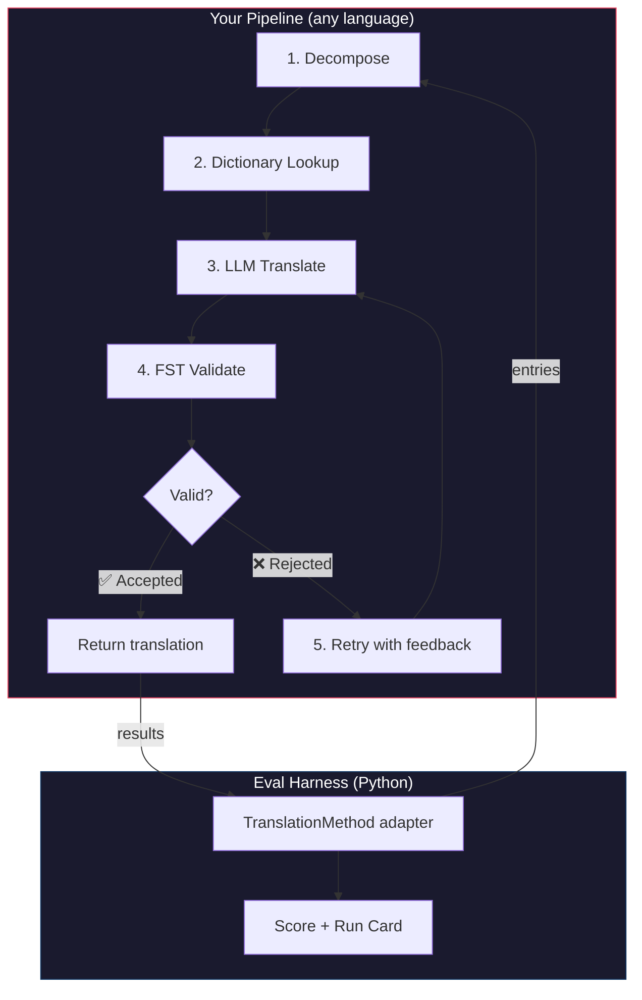
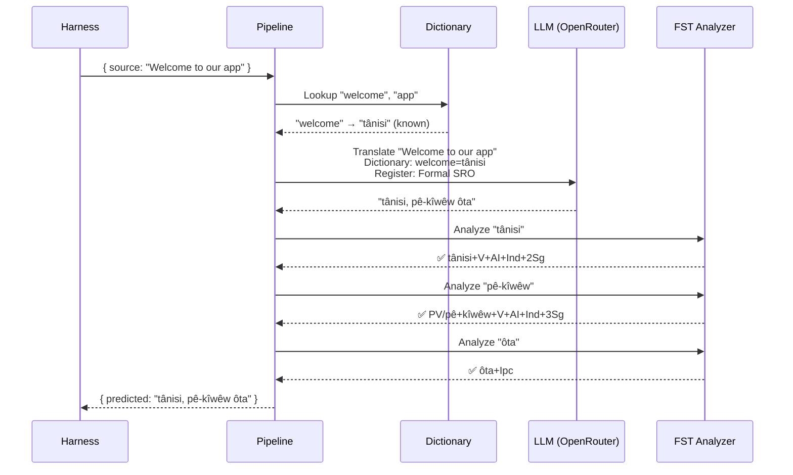
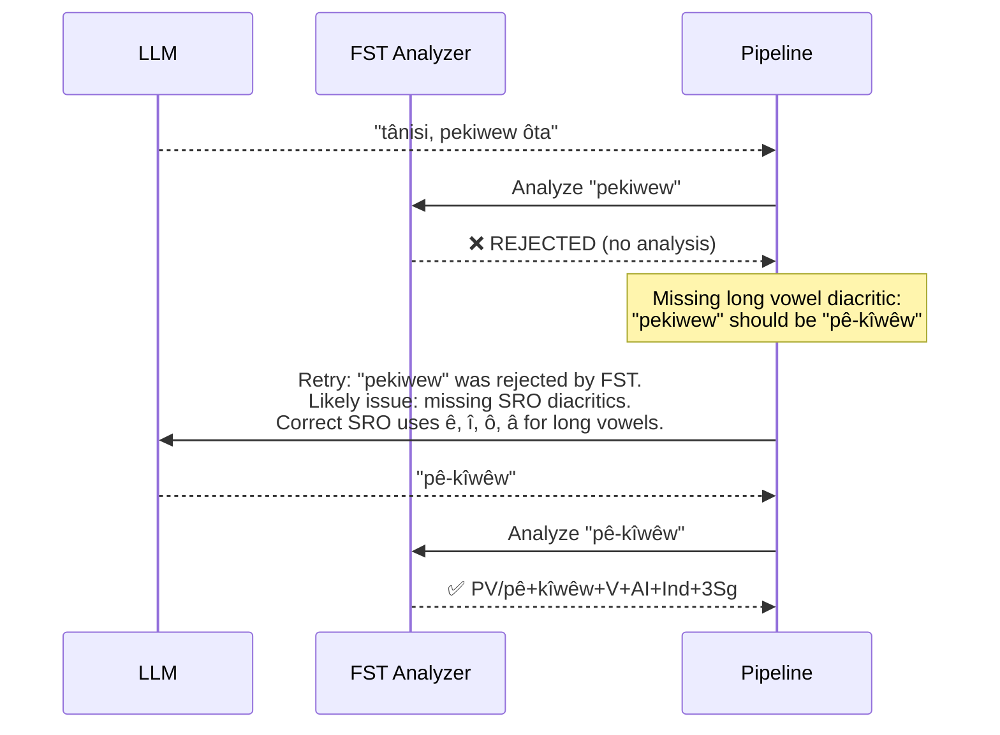

# دليل عملي: خط أنابيب ترجمة مُتحكَّم به عبر FST

ابنِ خط أنابيب ترجمة متعدد المراحل يقوم بتفكيك النص المصدر، والترجمة عبر نموذج لغوي كبير (LLM)، والتحقق من المخرجات باستخدام محوّل الحالات المنتهية (FST)، وإعادة المحاولة عندما يرفض FST صيغ الكلمات غير الصحيحة. ثم اربطه بمنصة التقييم (eval harness) وشاهد كيف يحصل على درجاته.

**ما الذي ستبنيه:** خط أنابيب ترجمة للغة Plains Cree يلتقط الترجمات غير الصحيحة صرفيًا *قبل* أن تُحتسب ضد درجتك.

:::info المتطلبات المسبقة
- ملف FST ثنائي قيد التشغيل (مثلًا من [محلّل Plains Cree الخاص بـ ALTLab](https://github.com/UAlbertaALTLab/lang-crk))
- Node.js 20+ (لخط الأنابيب) و Python 3.10+ (لمنصة التقييم)
- مفتاح API من OpenRouter لخطوة النموذج اللغوي الكبير
:::

---

## البنية المعمارية

خط الأنابيب هو سلسلة من المراحل. لكل مرحلة مهمة محددة. يمكنك بناء هذا بأي لغة برمجة — يستخدم هذا المثال JavaScript، لكن منصة التقييم لا تهتم بما يوجد في الداخل. فهي لا ترى سوى مهايئ Python الرفيع عند الحدود.



### لماذا هذه المراحل

| المرحلة | ما تفعله | لماذا هي مهمة |
|-------|-------------|---------------|
| **التفكيك (Decompose)** | تقسيم سلاسل واجهة المستخدم المركّبة إلى مقاطع قابلة للترجمة | اللغات متعددة التركيب تشفّر جملًا كاملة في كلمات مفردة — يحتاج النموذج اللغوي الكبير إلى وحدات أصغر |
| **البحث في القاموس (Dictionary Lookup)** | فحص قاموس ثنائي اللغة بحثًا عن ترجمات معروفة | يفرض المصطلحات الصحيحة للمصطلحات المعروفة بدلًا من الاعتماد على تخمين النموذج اللغوي الكبير |
| **الترجمة عبر LLM** | إرسال المقطع إلى نموذج لغوي كبير مع سياق المستوى اللغوي والقواعد | يتعامل مع العبارات الجديدة ويولّد مخرجات سلسة |
| **التحقق عبر FST** | تمرير المخرجات عبر محلّل صرفي | يلتقط صيغ الكلمات غير الصحيحة — إذا رفض FST كلمة، فهي ليست صيغة كلمة صحيحة في اللغة |
| **إعادة المحاولة (Retry)** | إعادة إرسال الكلمات المرفوضة مع ملاحظات الخطأ من FST | يزوّد النموذج اللغوي الكبير بمعلومات محددة عن *سبب* خطأ الكلمة |

---

## تدفق البيانات

إليك ما يحدث لمُدخل واحد أثناء تدفقه عبر خط الأنابيب:



### عندما يرفض FST



---

## التنفيذ

ابنِ ما تشاء. يستخدم هذا المثال JavaScript، لكن يمكنك استخدام Python أو Rust أو أي شيء آخر. منصة التقييم لا تهتم — فهي تتواصل فقط مع مهايئ Python الرفيع (الموضح في القسم التالي).

### خط الأنابيب

كل مرحلة هي دالة. يربط خط الأنابيب هذه الدوال معًا في سلسلة.

```javascript title="pipeline.js"
import { lookupDictionary } from './dictionary.js';
import { callLLM } from './llm.js';
import { analyzeWithFST } from './fst.js';

const MAX_RETRIES = 3;

/**
 * Translate a batch of keys through the full pipeline.
 *
 * @param {object} keys - Map of key → source string
 * @param {object} options - { sourceLang, targetLang }
 * @returns {{ translations: object, stats: object }}
 */
export async function translateBatch(keys, options) {
  const translations = {};
  const stats = { total: 0, fstAccepted: 0, retries: 0, dictionaryHits: 0 };

  for (const [key, sourceText] of Object.entries(keys)) {
    stats.total++;
    translations[key] = await translateSingle(sourceText, options, stats);
  }

  return { translations, stats };
}

/**
 * Translate a single string through all pipeline stages.
 */
async function translateSingle(sourceText, options, stats) {

  // ── Stage 1: Decompose ──────────────────────────────────
  // Split compound strings into segments the LLM can handle.
  // For UI strings this is often a no-op, but for longer content
  // it prevents the LLM from losing context in long prompts.
  const segments = decompose(sourceText);

  // ── Stage 2: Dictionary Lookup ──────────────────────────
  // Check each segment against the bilingual dictionary.
  // Known terms are forced — the LLM won't override them.
  const knownTerms = {};
  for (const segment of segments) {
    const entry = lookupDictionary(segment.toLowerCase());
    if (entry) {
      knownTerms[segment] = entry;
      stats.dictionaryHits++;
    }
  }

  // ── Stage 3: LLM Translate ──────────────────────────────
  let translation = await callLLM(sourceText, {
    ...options,
    knownTerms,
    register: 'nêhiyawêwin (Plains Cree). Use SRO orthography. '
            + 'Professional register for educational contexts.',
  });

  // ── Stage 4: FST Validate ──────────────────────────────
  // Split the translation into words and check each one.
  let { accepted, rejected } = await validateWords(translation);

  // ── Stage 5: Retry Loop ─────────────────────────────────
  // If any words were rejected, retry with FST feedback.
  let attempt = 0;
  while (rejected.length > 0 && attempt < MAX_RETRIES) {
    attempt++;
    stats.retries++;

    const feedback = rejected
      .map(w => `"${w}" was rejected by the morphological analyzer`)
      .join('; ');

    translation = await callLLM(sourceText, {
      ...options,
      knownTerms,
      register: 'nêhiyawêwin (Plains Cree). Use SRO orthography.',
      feedback: `Previous attempt had invalid words. ${feedback}. `
              + 'Use correct SRO diacritics (ê, î, ô, â for long vowels). '
              + 'Ensure verb forms match expected conjugation patterns.',
    });

    ({ accepted, rejected } = await validateWords(translation));
  }

  if (rejected.length === 0) stats.fstAccepted++;

  return translation;
}

/**
 * Decompose source text into translatable segments.
 *
 * For simple key-value UI strings, this usually returns the
 * original string as a single segment. For longer content,
 * it splits on sentence boundaries.
 */
function decompose(text) {
  // Simple sentence-boundary split. Replace with your own
  // morphological decomposition for more complex needs.
  return text
    .split(/(?<=[.!?])\s+/)
    .filter(s => s.trim().length > 0);
}

/**
 * Validate each word in a translation against the FST.
 *
 * @returns {{ accepted: string[], rejected: string[] }}
 */
async function validateWords(translation) {
  // Split on whitespace and punctuation, keeping only words
  const words = translation
    .split(/[\s,;:.!?'"()\[\]{}]+/)
    .filter(w => w.length > 0);

  const accepted = [];
  const rejected = [];

  for (const word of words) {
    const analyses = await analyzeWithFST(word);
    if (analyses.length > 0) {
      accepted.push(word);
    } else {
      rejected.push(word);
    }
  }

  return { accepted, rejected };
}
```

### مغلّف FST

غلّف ملف FST الثنائي الخاص بك كدالة غير متزامنة (async). يستخدم هذا المثال محلّل Plains Cree المبني على HFST من ALTLab.

```javascript title="fst.js"
import { execFile } from 'node:child_process';
import { promisify } from 'node:util';

const execFileAsync = promisify(execFile);

// Path to your FST analyzer binary
const FST_PATH = process.env.FST_ANALYZER_PATH || './bin/crk-analyzer';

/**
 * Run a word through the FST morphological analyzer.
 *
 * Returns an array of analyses. Empty array = rejected.
 *
 * Example:
 *   analyzeWithFST("tânisi")
 *   → ["tânisi+V+AI+Ind+2Sg", "tânisi+V+AI+Cnj+2Sg"]
 *
 *   analyzeWithFST("pekiwew")
 *   → []  // rejected — missing diacritics
 *
 * @param {string} word - A single word in SRO orthography
 * @returns {string[]} Array of FST analyses (empty = rejected)
 */
export async function analyzeWithFST(word) {
  try {
    // HFST lookup: pipe the word to stdin, read analyses from stdout
    const { stdout } = await execFileAsync(
      FST_PATH,
      ['--quiet'],
      { input: word + '\n', timeout: 5000 }
    );

    // Parse HFST output: each line is "input\tanalysis\tweight"
    // Lines with "+?" indicate unrecognized forms
    return stdout
      .split('\n')
      .filter(line => line.includes('\t') && !line.includes('+?'))
      .map(line => line.split('\t')[1]);

  } catch (err) {
    // If the FST binary isn't available, log and reject
    console.error(`[WARN] FST analysis failed for "${word}": ${err.message}`);
    return [];
  }
}
```

### وحدتا القاموس والنموذج اللغوي الكبير

```javascript title="dictionary.js"
/**
 * Simple bilingual dictionary backed by a JSON file.
 *
 * In production, you'd load from the coaching data directory
 * or query itwêwina (https://itwewina.altlab.app/) via API.
 */
const DICTIONARY = {
  'hello': 'tânisi',
  'welcome': 'tânisi',
  'thank you': 'kinanâskomitin',
  'home': 'kīwēwin',
  'search': 'nānātawāpahtam',
  'settings': 'isi-nākatohkēwin',
  'help': 'nīsōhkamākēwin',
  'back': 'kīwē',
};

/**
 * @param {string} term - Lowercase English term
 * @returns {string|null} Cree translation or null
 */
export function lookupDictionary(term) {
  return DICTIONARY[term] || null;
}
```

```javascript title="llm.js"
/**
 * Call an LLM via OpenRouter for translation.
 */
const OPENROUTER_API = 'https://openrouter.ai/api/v1/chat/completions';

export async function callLLM(sourceText, options) {
  const { knownTerms = {}, register, feedback } = options;

  // Build the system prompt with register and known terms
  let systemPrompt = `You are translating English to Plains Cree.\n\n`;
  systemPrompt += `Register: ${register}\n\n`;

  if (Object.keys(knownTerms).length > 0) {
    systemPrompt += `Required terminology (use these exact translations):\n`;
    for (const [en, crk] of Object.entries(knownTerms)) {
      systemPrompt += `  "${en}" → "${crk}"\n`;
    }
    systemPrompt += '\n';
  }

  if (feedback) {
    systemPrompt += `IMPORTANT correction from previous attempt:\n${feedback}\n\n`;
  }

  systemPrompt += `Rules:\n`;
  systemPrompt += `- Use Standard Roman Orthography (SRO)\n`;
  systemPrompt += `- Use macron/circumflex for long vowels: ê, î, ô, â\n`;
  systemPrompt += `- Return ONLY the Cree translation, nothing else\n`;

  const response = await fetch(OPENROUTER_API, {
    method: 'POST',
    headers: {
      'Authorization': `Bearer ${process.env.OPENROUTER_API_KEY}`,
      'Content-Type': 'application/json',
    },
    body: JSON.stringify({
      model: 'google/gemini-2.5-pro',
      messages: [
        { role: 'system', content: systemPrompt },
        { role: 'user', content: sourceText },
      ],
      temperature: 0.2,
    }),
  });

  const json = await response.json();
  return json.choices[0].message.content.trim();
}
```

---

## الربط بمنصة التقييم

اكتمل بناء خط الأنابيب الخاص بك. الآن تحتاج إلى ربطه بمنصة التقييم لتتمكن من قياس أدائه على لوحة المتصدرين.

تتعامل منصة التقييم مع واجهة واحدة: `TranslationMethod`. وهي بروتوكول Python بدالة واحدة. ابنِ ما تشاء بأي لغة تشاء — ثم زوّده بهذا المغلّف الرفيع ليتم ربطه.

```python title="fst_gated_process.py"
"""
TranslationMethod adapter for the FST-gated pipeline.

This thin wrapper connects your pipeline (running as a local
subprocess or HTTP server) to the eval harness. The harness
calls translate() with corpus entries. You call your pipeline.
You return results. That's it.
"""

import time
import subprocess
import json
from mt_eval_harness.config import RunConfig


class FSTGatedProcess:
    """Adapter between the eval harness and your FST-gated pipeline.

    The pipeline runs as a Node.js subprocess. This wrapper:
    1. Receives entries from the harness
    2. Sends them to the pipeline
    3. Returns structured results the harness can score
    """

    def __init__(self, pipeline_url: str = "http://localhost:3001"):
        self.pipeline_url = pipeline_url

    async def translate(
        self,
        entries: list[dict],
        config: RunConfig,
    ) -> list[dict]:
        """Translate a batch of entries through the FST-gated pipeline.

        Args:
            entries: List of corpus entries with 'id' and source text.
            config: Harness run configuration (for context).

        Returns:
            List of result dicts, one per entry.
        """
        import httpx

        results = []

        for entry in entries:
            source_text = entry.get(config.source_field, entry.get("source", ""))
            start = time.monotonic()

            try:
                # Call your pipeline — however it's running
                async with httpx.AsyncClient() as client:
                    response = await client.post(
                        f"{self.pipeline_url}/translate",
                        json={"keys": {str(entry["id"]): source_text}},
                        timeout=30.0,
                    )
                    data = response.json()
                    predicted = data["translations"][str(entry["id"])]

                elapsed = time.monotonic() - start

                results.append({
                    "id": entry["id"],
                    "predicted": predicted,
                    "latency_s": elapsed,
                    "usage": {},  # pipeline doesn't expose token counts
                    "error": None,
                    "tool_calls": [],
                    "tool_call_count": 0,
                    "metadata": data.get("meta", {}),
                })

            except Exception as err:
                results.append({
                    "id": entry["id"],
                    "predicted": "",
                    "latency_s": time.monotonic() - start,
                    "usage": {},
                    "error": str(err),
                    "tool_calls": [],
                    "tool_call_count": 0,
                    "metadata": {},
                })

        return results
```

:::tip لست بحاجة إلى HTTP
يستدعي المثال أعلاه خط الأنابيب عبر HTTP لأن خط الأنابيب مكتوب بـ JavaScript. إذا كان خط الأنابيب الخاص بك مكتوبًا بـ Python، فيمكنك استدعاؤه مباشرة — دون الحاجة إلى خادم. مغلّف `TranslationMethod` ليس سوى حدود دالة. وما يحدث في الداخل أمر يعود إليك.
:::

### تشغيل القياس المعياري

ابدأ تشغيل خط الأنابيب، ثم شغّل منصة التقييم:

```bash
# Terminal 1: Start the pipeline
node server.js

# Terminal 2: Run the harness with your process
export OPENROUTER_API_KEY="sk-or-v1-..."

python -c "
import asyncio
from mt_eval_harness.config import RunConfig
from mt_eval_harness.runner import execute_run
from fst_gated_process import FSTGatedProcess

async def main():
    config = RunConfig(
        corpus_path='data/edtekla-dev-v1.json',
        source_lang='English',
        target_lang='Plains Cree (nêhiyawêwin, SRO)',
        process_name='fst-gated-v1',
    )
    process = FSTGatedProcess('http://localhost:3001')
    run_log = await execute_run(config, process=process)
    print(f'Results: {run_log.output_path}')

asyncio.run(main())
"
```

أو استخدم واجهة سطر الأوامر مع `baseline_experiment.py` للمقارنة مع خط الأساس المدمج:

```bash
python eval/baseline_experiment.py \
  --dataset data/edtekla-dev-v1.json \
  --model google/gemini-2.5-pro \
  --fst-analyzer ./bin/crk-analyzer \
  --condition fst-gated-v1 \
  --submit
```

---

## فهم نتائجك

تُنتج منصة التقييم **بطاقة تشغيل (run card)** — ملف JSON يحتوي على درجاتك. إليك ما ستراه:

```
═══════════════════════════════════════════════════
  FST-Gated Pipeline v1 — EDTeKLA Dev v1
═══════════════════════════════════════════════════

  chrF++              48.7 / 100
  Exact match         12.1%
  FST acceptance      94.4%
  Composite score     0.52  →  Functional ✓

  404 entries (master_corpus.json) · 47 retries · $0.18 total cost
═══════════════════════════════════════════════════
```

**ما يخبرك به هذا بنظرة سريعة:**
- طريقتك في فئة **Functional** (0.50–0.70) — المخرجات مفهومة لمتحدث اللغة، والقواعد الأساسية صحيحة عادةً، مع بقاء أخطاء صرفية متكررة.
- يلتقط FST نسبة 94% من الكلمات كصيغ صحيحة — حلقة إعادة المحاولة لديك تعمل.
- 12% من الترجمات صحيحة تمامًا — هناك مجال واسع للتحسين.

:::info فئات الجودة
| الفئة | composite | ماذا تعني |
|------|-----------|---------------|
| Baseline | 0.00–0.30 | مخرجات LLM خام، صرف مُختلَق في معظمه |
| Emerging | 0.30–0.50 | بعض الأنماط الصحيحة، غير موثوقة |
| **Functional** | **0.50–0.70** | **مفهومة لمتحدث اللغة. الفئات الرئيسية صحيحة عادةً.** |
| Deployable | 0.70–0.85 | مناسبة كمسودة ترجمة مع مراجعة بشرية |
| Fluent | 0.85–1.00 | تقترب من ترجمة بشرية كفؤة |

راجع [SCORING_SPEC §5](/docs/specifications/scoring#5-quality-tiers) للاطلاع على التعريفات الكاملة للفئات.
:::

<details>
<summary><strong>تعمّق أكثر: ماذا تحتوي بطاقة التشغيل؟</strong></summary>

يوثّق ملف JSON الخاص ببطاقة التشغيل كل شيء عن جولة التقييم هذه. الأقسام الرئيسية:

**الدرجات (Scores)** — كل مقياس حسبته منصة التقييم:
```json
{
  "scores": {
    "exact_match_rate": 0.121,
    "chrf_plus_plus": 48.7,
    "fst_acceptance_rate": 0.944,
    "composite_score": 0.52,
    "quality_tier": "functional"
  }
}
```

**المصدر (Provenance)** — ما الذي أنتج هذه النتائج:
```json
{
  "method": {
    "process_name": "fst-gated-v1",
    "model": "google/gemini-2.5-pro",
    "temperature": 0.0
  },
  "corpus": {
    "id": "edtekla-dev-v1",
    "sha256": "a1b2c3..."
  }
}
```

**النتائج لكل مُدخل** — كل ترجمة مع درجاتها الفردية، لتتمكن من تحديد المواضع التي تتعثر فيها طريقتك:
```json
{
  "id": 42,
  "source": "The student completed the assignment",
  "reference": "ôskiniw kî-kîsîhtâw ôhi atoskêwina",
  "predicted": "ôskiniw kî-kîsîhtâw ôhi atoskêwin",
  "chrf": 89.2,
  "exact_match": false,
  "fst_accepted": true
}
```

درجة composite score هي متوسط مرجّح للمقاييس المتاحة، بأوزان محددة في [SCORING_SPEC §4](/docs/specifications/scoring#4-composite-score). عندما لا يكون أحد المقاييس متاحًا، يُعاد توزيع وزنه تناسبيًا على بقية المقاييس.

</details>

---

## النشر في بيئة الإنتاج

أصبحت لطريقتك درجات على لوحة المتصدرين. الآن تريد استخدامها فعليًا. يتناول هذا القسم تقديم خط الأنابيب الخاص بك كنقطة نهاية إنتاجية يمكن لـ [champollion](https://champollion.dev) استدعاؤها.

:::note هذا القسم اختياري
كل ما سبق يتعلق ببناء طريقتك وقياس أدائها. هذا القسم يتعلق بالنشر — وهو شأن منفصل. يمكنك التقديم إلى لوحة المتصدرين دون نشر أي شيء.
:::

### خادم HTTP

غلّف خط الأنابيب الخاص بك كخادم Express ينفّذ [عقد طريقة API](https://champollion.dev/docs/guides/serving-a-method):

```javascript title="server.js"
import express from 'express';
import { translateBatch } from './pipeline.js';

const app = express();
app.use(express.json());

/**
 * API method contract:
 *
 * Request:  { source_locale, target_locale, method, keys: { "key": "source" } }
 * Response: { translations: { "key": "translated" }, meta: { ... } }
 */
app.post('/translate', async (req, res) => {
  const { source_locale, target_locale, method, keys } = req.body;

  // Validate request
  if (!keys || typeof keys !== 'object') {
    return res.status(400).json({ error: { message: 'Missing keys object' } });
  }

  try {
    const startTime = Date.now();
    const { translations, stats } = await translateBatch(keys, {
      sourceLang: source_locale,
      targetLang: target_locale,
    });

    res.json({
      translations,
      meta: {
        model: 'custom-pipeline/fst-gated-v1',
        method: 'decompose-lookup-translate-validate',
        elapsed_ms: Date.now() - startTime,
        fst_acceptance_rate: stats.fstAccepted / stats.total,
        retries: stats.retries,
      },
    });
  } catch (err) {
    console.error('[ERR] Pipeline failed:', err.message);
    res.status(500).json({ error: { message: err.message } });
  }
});

// Health check for connectivity verification
app.get('/health', (req, res) => res.json({ status: 'ok' }));

app.listen(3001, () => {
  console.log('FST-gated pipeline running on http://localhost:3001');
});
```

### إعداد champollion

وجّه زوج اللغات الخاص بك إلى الخدمة قيد التشغيل:

```json title="champollion.config.json"
{
  "version": 3,
  "inputLocale": "en",
  "pairs": {
    "en:crk": {
      "method": "api",
      "endpoint": "http://localhost:3001/translate"
    }
  },
  "languages": {
    "crk": {
      "name": "Plains Cree",
      "register": "SRO syllabics with grammatical precision."
    }
  }
}
```

```bash
# Run it
export OPENROUTER_API_KEY="sk-or-v1-..."
node server.js &
npx champollion sync
```

### التغليف كإضافة (Plugin)

بمجرد حصول طريقتك على درجات، غلّفها ليتمكن الآخرون من استخدامها:

```json title="crk-fst-gated-v1/method.json"
{
  "name": "crk-fst-gated-v1",
  "type": "api",
  "version": "1.0.0",
  "description": "FST-gated Plains Cree translation with morphological validation",
  "author": "Your Name",

  "config": {
    "endpoint": "https://your-server.example.com/translate"
  },

  "locales": ["crk"],

  "benchmarks": {
    "crk": {
      "date": "2026-06-01T00:00:00Z",
      "corpus_size": 404,
      "exact_match_rate": 0.12,
      "corpus_chrf": 48.7,
      "model": "google/gemini-2.5-pro",
      "harness_version": "2.0"
    }
  },

  "provenance": {
    "resources": [
      { "name": "ALTLab CRK Analyzer", "license": "LGPL-3.0", "type": "fst" },
      { "name": "Wolvengrey Dictionary", "license": "CC-BY-NC-SA-4.0", "type": "dictionary" }
    ],
    "commercialReady": false,
    "flags": ["nc-resource"]
  }
}
```

---

## توسيع هذا النمط

يعرض هذا الدليل العملي بنية واحدة لخط الأنابيب. يمكنك تكييفها لأي لغة أو طريقة:

| التنويع | ما الذي يتغير |
|-----------|-------------|
| **FST مختلف** | استبدل مسار الملف الثنائي. يمكنك تنزيل ملفات FST مُجمَّعة مسبقًا (مثل ملفات `.hfstol` أو `lttoolbox` الثنائية) لأكثر من 100 لغة من [GiellaLT GitHub](https://github.com/giellalt) أو [Apertium GitHub](https://github.com/apertium). |
| **لا يتوفر FST** | احذف مرحلة تنفيذ FST واستخدم [ملفات نماذج التصريف المسطّحة من UniMorph](https://huggingface.co/datasets/unimorph/universal_morphologies) من Hugging Face لإجراء تحقق ثابت بالبحث في قاعدة البيانات من الصيغ المُصرَّفة. |
| **عدة نماذج LLM** | سلسلة نماذج: نموذج سريع للمسودة الأولية، ونموذج استدلالي للتصحيحات. |
| **إشراك الإنسان في الحلقة** | أضف مرحلة طابور تحتجز الترجمات غير المؤكدة لمراجعة الخبراء قبل إرجاعها. |
| **نموذج مضبوط بدقة (Fine-tuned)** | استبدل استدعاء OpenRouter بنموذج محلي (Ollama أو vLLM أو غيرهما). |
| **لغة مختلفة** | غيّر القاموس وFST والمستوى اللغوي. تبقى البنية المعمارية متطابقة. |

خط الأنابيب نمط. والمراحل قابلة للتبديل. ابنِ ما يناسب لغتك، وأثبت كفاءته على [لوحة المتصدرين](https://champollion.dev/leaderboard)، ثم انشره.

---

## انظر أيضًا

- **[Eval Harness](/docs/specifications/harness)** — كيفية تشغيل منصة التقييم وتفسير المخرجات
- **[Method Interface](/docs/specifications/methods)** — مواصفات بروتوكول `TranslationMethod`
- **[قواعد لوحة المتصدرين](/docs/leaderboard/rules)** — معايير التقديم وسياسات مكافحة التلاعب
- **[دعم لغة منخفضة الموارد](/docs/community/low-resource-languages)** — السياق الأوسع ومبادئ OCAP
- **[ALTLab](https://altlab.artsrn.ualberta.ca/)** — مختبر ألبرتا لتقنيات اللغة (Plains Cree FST)
- **[Method Leaderboard](https://champollion.dev/leaderboard)** — قدّم درجاتك