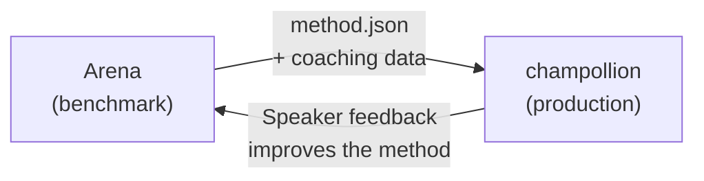

# In die Produktion deployen

Sie haben in der Arena bewiesen, dass es funktioniert. Jetzt deployen Sie es.

Die Arena dient der F&E — dem Entwickeln, Benchmarken und Vergleichen von Übersetzungsmethoden. **Das Produktions-Deployment** erfolgt über [champollion](https://champollion.dev), das entwicklerorientierte Übersetzungs-CLI. Beide sind über ein gemeinsames Plugin-Format miteinander verbunden.



---

## Der Deployment-Pfad

### 1. Exportieren Sie Ihre Methode als Plugin

Erstellen Sie ein `method.json`-Manifest, das Ihre Benchmark-Ergebnisse bündelt:

```json
{
  "name": "crk-coached-v3",
  "type": "llm-coached",
  "version": "3.0.0",
  "description": "Coached LLM translation for Plains Cree",
  "locales": ["crk"],
  "config": {
    "model": "google/gemini-2.5-flash",
    "temperature": 0.3
  },
  "benchmarks": {
    "crk": {
      "composite_score": 0.67,
      "fst_acceptance": 0.82,
      "corpus_size": 150
    }
  }
}
```

Fügen Sie sämtliche Coaching-Daten (Grammatikregeln, Wörterbücher) zusammen mit dem Manifest hinzu.

### 2. In Champollion installieren

```bash
champollion plugin install ./my-method-plugin/
```

### 3. Konfigurieren Sie Ihr Sprachpaar

```json title="champollion.config.json"
{
  "pairs": {
    "en-crk": { "method": "plugin", "plugin": "crk-coached-v3" }
  }
}
```

### 4. Echte Inhalte übersetzen

```bash
npx champollion sync
```

Ihre gebenchmarkte Methode erzeugt nun echte Übersetzungen in der Produktion.

---

## Für indigene Sprachen

Methoden, die indigenen Sprachgemeinschaften dienen, erfordern vor dem Produktions-Deployment die **Zustimmung der Gemeinschaft**. Die OCAP-Prinzipien (Ownership, Control, Access, Possession) regeln, wie Übersetzungsmethoden entwickelt, evaluiert und deployt werden.

Eine Methode, die die Stufe „Deployable" (0,70+) erreicht, wird nicht automatisch deployt — sie wird **dann und nur dann** deployt, wenn das Governance-Gremium der Sprachgemeinschaft seine Zustimmung erteilt.

Siehe [Datensouveränität](/docs/sovereignty/data-sovereignty) und [Eigentumsübertragung](/docs/sovereignty/ownership-transfer) für das vollständige Governance-Rahmenwerk.

---

## Siehe auch

- [Die Eval-Harness-Brücke](https://champollion.dev/docs/guides/bridge) — detaillierte Anleitung zur Arena→champollion-Pipeline
- [Plugin-Spezifikation](https://champollion.dev/docs/reference/plugin-spec) — das method.json-Manifestformat
- [champollion Agent Guide](https://champollion.dev/docs/guides/agent-guide) — wie Sie champollion zur Übersetzung verwenden