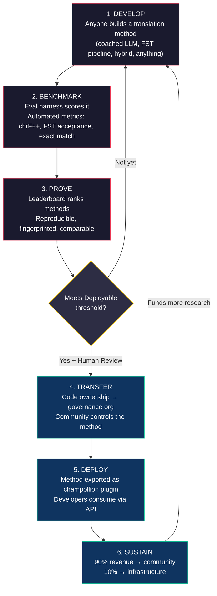
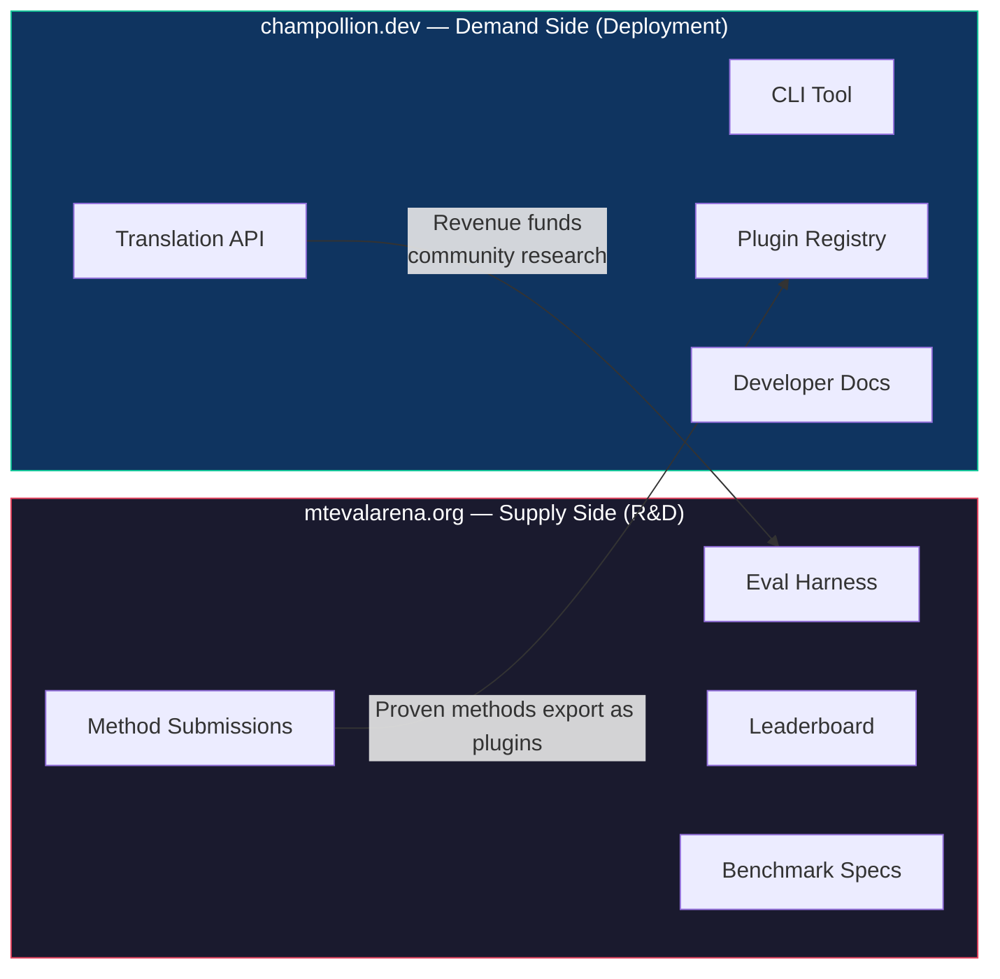
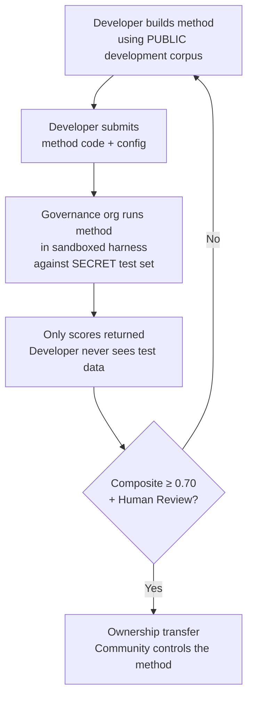

# Funktionsweise: Wettbewerbsorientiertes Crowdsourcing für maschinelle Übersetzung

> **Zusammenfassung.** Maschinelle Übersetzung für die unterversorgten Sprachen der Welt — einschließlich der etwa 1.300 Sprachen, die Metas OMT-1600 abzudecken behauptet, jedoch auf Qualitätsniveaus unterhalb jeder nutzbaren Schwelle — ist kein Problem des Modelltrainings — es ist ein *Infrastruktur*problem. Kein einzelnes Modell, Labor oder Unternehmen wird es lösen. Dieses Dokument beschreibt eine Plattformarchitektur, die die globale Gemeinschaft aus ML-Ingenieuren, Linguisten und Sprechern in ein verteiltes Forschungslabor verwandelt: Jede Person entwickelt eine Übersetzungsmethode, die Plattform weist nach, ob sie anhand souveräner Evaluationsdaten funktioniert, und nachgewiesene Methoden werden in den Produktivbetrieb überführt, wobei Einnahmen an die Gemeinschaften fließen, deren Sprachen sie bedienen. Der Mechanismus ist wettbewerbsorientiertes Crowdsourcing mit kryptografischer Souveränität — eine Kombination, die bislang noch nicht versucht wurde.

---

> [!IMPORTANT]
> **Geltungsbereich.** Diese Plattform evaluiert die **Übersetzung formeller schriftlicher Texte** — Dokumente, Bildungsmaterialien, offizielle Kommunikation, UI-Zeichenketten. Sie ist kein Chatbot, kein Echtzeit-Dolmetscher und kein domänenunbeschränktes Konversationssystem. Das Leaderboard bewertet Übersetzungsmethoden anhand kuratierter Paralleltextkorpora in spezifischen Textdomänen (siehe [Benchmark Specification §2.7](/docs/specifications/benchmark#27-domain) zur Domänentaxonomie). MT ist Infrastruktur für die Sprachrevitalisierung, kein Ersatz dafür. Kinder lernen Sprache von Menschen, nicht von Maschinen.

### Aktuelle Domänenabdeckung

| Domäne | Tier-Abdeckung | Status | Anmerkungen |
|--------|--------------|--------|-------|
| Offiziell / Behörden | Tiers 1–5 | Aktiv | EdTeKLA-Korpus |
| Bildung / Lehrbuch | Tiers 1–4 | Aktiv | EdTeKLA-Korpus |
| Narrativ / literarisch | Begrenzt | Geplant | Einige Einträge im Gold-Standard |
| Religiös / schriftlich | Nur Referenz | Nicht evaluiert | FLORES+ (Bibeldomäne); nicht für offizielle Bewertung verwendet |
| Konversationell | Nicht im Geltungsbereich | Bewusst so gestaltet | Dieses System evaluiert schriftlichen Text, keine Sprache |
| Technisch / wissenschaftlich | Nicht im Geltungsbereich | Zukünftig | Erfordert domänenspezifische Terminologievalidierung |

## 1. Das Problem: Maschinelle Übersetzung ≠ Maschinelles Lernen

Maschinelle Übersetzung für ressourcenarme Sprachen (Low-Resource Languages, LRLs) wird gemeinhin als Problem des maschinellen Lernens aufgefasst: Daten sammeln, ein Modell trainieren, bereitstellen. Diese Auffassung ist falsch, und der Fehler hat Folgen — er lenkt Fördermittel, Talente und Infrastruktur auf einen Ansatz, der für die Mehrheit der Sprachen der Welt strukturell nicht funktionieren kann.

### 1.1 Warum die ML-Auffassung scheitert

Die standardmäßige ML-Pipeline für MT erfordert drei Dinge: große Paralleltextkorpora, validierte Evaluationsbenchmarks und einen Bereitstellungsweg. Für die etwa 130 von Google Translate bedienten Sprachen und die etwa 200 von NLLB-200 abgedeckten Sprachen existieren alle drei. Für die etwa 1.300 zusätzlichen Sprachen, die OMT-1600 abzudecken behauptet, existieren Evaluationsdaten, doch die Qualität liegt meist unterhalb nutzbarer Schwellen, die Modellgewichte sind nicht öffentlich verfügbar, und es gibt keine Bereitstellungspipeline. Für die verbleibenden etwa 5.400+ existiert überhaupt nichts.

| Anforderung | Ressourcenreiche Sprachen | OMT-1600-Abdeckung (~1.300 LRLs) | Verbleibende ~5.400 Sprachen |
|-------------|------------------------|-------------------------------|---------------------------|
| **Paralleltextkorpora** | Millionen von Satzpaaren (Europarl, UN Corpus, OpenSubtitles) | Bibeldomänen-Bitext, Web-Scrapes, synthetische Rückübersetzung. Keine community-kuratierten Daten. | Hunderte bis wenige Tausend, falls überhaupt vorhanden |
| **Evaluationsbenchmarks** | WMT, FLORES, NTREX — standardisiert, reproduzierbar | BOUQuET (Bibeldomäne), met-BOUQuET. Keine morphologische Validierung. Keine unabhängige Evaluation. | Keine Standardbenchmarks; Ad-hoc-Evaluation |
| **Bereitstellungsweg** | Google Translate, DeepL, Azure — kommerzielle APIs | Modellgewichte nicht freigegeben. Kein CLI, kein Plugin-System, keine community-bereitstellbare API. | Nichts. Keine API, kein Produkt, kein Markt. |

Der ML-Ansatz funktioniert, wenn die Daten zum Trainieren existieren und der Markt zur Bereitstellung existiert. OMT-1600 hat die erste Bedingung erheblich erweitert — doch Erweiterung ohne unabhängige Qualitätsprüfung, ohne morphologische Validierung und ohne Community-Governance ist Erweiterung ohne Vertrauen. Das Problem ist nicht nur „wir brauchen ein besseres Modell“ — es ist „wir brauchen eine Infrastruktur, die nachweist, dass das Modell funktioniert, zu Bedingungen, die die Gemeinschaft kontrolliert.“

### 1.2 Was MT für LRLs tatsächlich erfordert

Übersetzung für unterversorgte Sprachen ist in erster Linie kein Trainingsproblem. Es ist ein Problem des **Method Engineering** — die Herausforderung, verfügbare Ressourcen (LLMs, morphologische Werkzeuge, Community-Wissen, linguistische Regeln) zu funktionierenden Übersetzungspipelines zusammenzusetzen und anschließend mit rigoroser Evaluation nachzuweisen, dass sie funktionieren.

Die Unterscheidung ist von Bedeutung:

| Dimension | ML-Ansatz | Method-Engineering-Ansatz |
|-----------|------------|---------------------------|
| **Kernaktivität** | Ein Modell auf Daten trainieren | Werkzeuge, Prompts und linguistisches Wissen zu einer Pipeline kombinieren |
| **Engpass** | Volumen der Paralleldaten | Ingenieurskreativität + Evaluationsinfrastruktur |
| **Wer beitragen kann** | Teams mit GPU-Clustern und Datensätzen | Jede Person mit einem API-Schlüssel, einem Wörterbuch und einer Idee |
| **Evaluation** | BLEU/chrF auf zurückgehaltenen Testsätzen | Morphologische Validierung + menschliche Begutachtung + automatisierte Metriken |
| **Bereitstellung** | Das Modell bereitstellen | Die Methode als Plugin verpacken |

Moderne LLMs enthalten bereits latentes Wissen über viele ressourcenarme Sprachen — genug, um Ausgaben zu produzieren, die plausibel *aussehen*. Das Problem ist, dass diese Ausgaben oft morphologisch ungültig sind (das Modell halluziniert Wortformen, die es in der Sprache nicht gibt). Die ingenieurtechnische Herausforderung lautet: Wie extrahiert man das, was das LLM weiß, validiert es gegen die linguistische Realität und verpackt das Ergebnis für den Produktiveinsatz?

Aus diesem Grund benchmarken wir **Methoden**, nicht Modelle. Eine Methode ist das vollständige Rezept: Modellauswahl + Prompt-Engineering + Werkzeugnutzung + Vor-/Nachverarbeitung + Coaching-Daten + Wiederholungsstrategien. Zwei Teams, die dasselbe Modell mit unterschiedlichen Methoden verwenden, erhalten unterschiedliche Bewertungen. Das ist der Sinn der Sache.

### 1.3 Warum polysynthetische Sprachen alles zum Scheitern bringen

Viele der am stärksten unterversorgten Sprachen der Welt sind **polysynthetisch** — sie kodieren ganze Sätze durch produktive morphologische Prozesse in einzelne Wörter. Betrachten Sie das Plains-Cree-Wort:

> **ê-kî-nitawi-kîskinwahamâkosiyân**
> *„als ich zur Schule gegangen war“*

Ein Wort. Es kodiert Tempus (Vergangenheit), Richtung (hingehen zu), den Wortstamm (lernen), Genus Verbi (Passiv/Reflexiv) und Person (erste Person Singular). Das Englische benötigt sechs Wörter für das, was Cree in einem ausdrückt.

Dies bringt die standardmäßige MT auf allen Ebenen zum Scheitern:

- **Tokenisierung** — BPE und SentencePiece zerstückeln polysynthetische Wörter in bedeutungslose Fragmente, da sie für konkatenative Morphologie konzipiert wurden.
- **Halluzination** — LLMs produzieren plausibel aussehende Zeichenketten, die keine gültigen Wörter sind. Eine nicht-sprechende Person kann den Unterschied nicht erkennen. Ohne morphologische Validierung sind Halluzinationen unsichtbar.
- **Evaluation** — Metriken auf Wortebene (BLEU) bestrafen die natürliche flexionsbedingte Variation, die für die Funktionsweise dieser Sprachen grundlegend ist. Metriken auf Zeichenebene (chrF++) sind besser, aber ohne strukturelle Validierung dennoch unzureichend.

Die Lösung ist kein größeres Modell oder mehr Trainingsdaten. Sie besteht aus einer **Infrastruktur, die Halluzinationen abfängt, bevor sie die Nutzer erreichen** — morphologische Analysatoren (FSTs), die definitiv feststellen können: „Dies ist kein Wort in dieser Sprache.“

---

## 2. Warum bestehende Ansätze nicht funktionieren

### 2.1 Kommerzielle MT

Kommerzielle Übersetzungsdienste haben in der Vergangenheit auf Marktvolumen hin optimiert. Metas OMT-1600 (März 2026) stellt eine bedeutende Verschiebung dar — 1.600 Sprachen in einem System. Doch für die etwa 1.300 Sprachen in den niedrigsten Ressourcen-Tiers liegt die Qualität unterhalb nutzbarer Schwellen, die Modellgewichte sind nicht verfügbar, und es gibt keine Bereitstellungspipeline. Das strukturelle Anreizproblem hat sich gewandelt: Big Tech kann nun Modelle für LRLs bauen, doch ohne unabhängige Evaluation, morphologische Validierung oder Community-Governance löst Abdeckung allein das Problem nicht.

### 2.2 Akademische Forschung

Die akademische MT-Forschung konzentriert sich überwältigend auf ressourcenreiche Sprachpaare, weil dort die Trainingsdaten, die Shared Tasks und die Publikationsorte liegen. Forscher, die an ressourcenarmen Paaren arbeiten, haben Schwierigkeiten zu publizieren, Schwierigkeiten, Rechenleistung zu finanzieren, und Schwierigkeiten bei der Bereitstellung — weil keine Bereitstellungsinfrastruktur für LRLs existiert.

### 2.3 Einmalige Wettbewerbe

Sie könnten einen Kaggle-Wettbewerb durchführen: „Englisch→Plains Cree, der beste chrF++ gewinnt 10.000 $.“ Folgendes geschieht dann:

1. Jemand gewinnt, reicht ein Notebook ein, kassiert den Preis und geht nach Hause.
2. Das Notebook verrottet im Archiv von Kaggle. Niemand stellt es bereit. Niemand pflegt es.
3. Der Testsatz wird schließlich veröffentlicht — für immer kontaminiert.
4. Die Governance-Organisation hat ihre linguistischen Daten zu Googles Bedingungen auf Googles Infrastruktur hochgeladen, ohne echte Kontrolle über den Lebenszyklus.
5. Keine Bereitstellungsbrücke. Ein siegreiches Notebook ist keine funktionierende API.

Eine einmalige Prämie zieht Prämienjäger an. Ein fortlaufendes Leaderboard mit Community-Governance schafft nachhaltiges Engagement.

### 2.4 Fine-Tuning

Das Fine-Tuning eines offenen Modells auf Paralleltext ist der naheliegende ML-Ansatz. Doch für die meisten LRLs ist das für das Fine-Tuning benötigte Paralleltextkorpus genau jene Daten, die nicht existieren — und seine Erstellung erfordert dieselben zweisprachigen Sprecher und dasselbe Community-Engagement, das das Fine-Tuning eigentlich ersetzen soll. Man kann sich nicht mit einer Technik, die Daten erfordert, aus einem Datenknappheitsproblem herausarbeiten.

---

## 3. Die Lösung: Wettbewerbsorientiertes Crowdsourcing mit souveräner Evaluation

Die Plattform kehrt den traditionellen Ansatz um: Statt dass ein Team ein Modell baut, **konkurriert die globale Gemeinschaft darum, die beste Übersetzungsmethode zu entwickeln**, die Plattform weist nach, ob sie funktioniert, und nachgewiesene Methoden werden in den Produktivbetrieb überführt, wobei die Sprachgemeinschaft Eigentum und Kontrolle behält.

### 3.1 Der vollständige Kreislauf

Jede Phase hat eine spezifische Funktion:

| Phase | Was geschieht | Wer profitiert |
|-------|-------------|--------------|
| **Entwickeln** | Ein Forscher, Student oder Hobbyist entwickelt eine Übersetzungsmethode unter Verwendung beliebiger Werkzeuge — LLM-Prompting, FST-Pipelines, Wörterbücher, feinabgestimmte Modelle, regelbasierte Systeme oder Hybride | Der Beitragende lernt, experimentiert, publiziert |
| **Benchmarken** | Das Eval-Harness bewertet die Methode anhand eines standardisierten Korpus mit reproduzierbaren Metriken. Jeder Durchlauf erzeugt eine [Run Card](/docs/specifications/benchmark#3-run-card-schema) — ein vollständiges Protokoll dessen, was getestet wurde und wie es abschnitt | Forscher erhalten reproduzierbare, vergleichbare Ergebnisse |
| **Nachweisen** | Ergebnisse erscheinen auf dem öffentlichen Leaderboard. Methoden werden eingeordnet, verglichen und kritisch geprüft. Die Gemeinschaft sieht, was funktioniert und was nicht | Alle gewinnen Einblick in den Stand der Technik |
| **Übertragen** | Bei indigenen Sprachen wird der Code von Methoden, die die Schwelle „Deployable“ (Composite ≥ 0,70) erreichen UND die menschliche Validierung bestehen, an die Governance-Organisation der Sprachgemeinschaft übertragen | Die Gemeinschaft gewinnt einen einnahmegenerierenden Vermögenswert |
| **Bereitstellen** | Die Methode wird als [champollion](https://github.com/gamedaysuits/champollion)-Plugin exportiert und über eine API bereitgestellt. Entwickler nutzen Übersetzungen, ohne die zugrundeliegende Methode verstehen zu müssen | Entwickler erhalten Übersetzung für Sprachen, die kommerzielle APIs nicht bedienen |
| **Erhalten** | Die API-Einnahmen werden aufgeteilt: 90 % an die Gemeinschaft, 10 % an die Infrastruktur. Einnahmen finanzieren weitere linguistische Forschung, Korpusentwicklung und Community-Programme | Das Schwungrad erhält sich nach der anfänglichen Etablierung selbst |

### 3.2 Warum die Wettbewerbsdynamik funktioniert

Wettbewerb ist nicht nebensächlich — er ist der Mechanismus. Hier die Gründe:

**Vielfalt der Ansätze.** Die beste Methode für Englisch→Plains Cree könnte ein FST-gestütztes, gecoachtes LLM sein. Die beste für Englisch→Quechua könnte eine wörterbuchgestützte Pipeline sein. Die beste für Englisch→Inuktitut könnte ein feinabgestimmtes Modell sein, das aus dem Nunavut-Hansard-Korpus bootstrappt. Kein einzelnes Team und kein einzelner Ansatz wird über alle Sprachen hinweg dominieren. Das Leaderboard offenbart, welche *Arten* von Ansätzen für welche *Arten* von Sprachen funktionieren — ein Meta-Ergebnis, das selbst einen Forschungsbeitrag darstellt.

**Nachhaltiges Engagement.** Ein Leaderboard ist niemals fertig. Es gibt immer jemanden, der die Spitzenbewertung schlagen möchte. Jede Einreichung spendet Rechenleistung und intellektuelle Anstrengung für das Problem. Anders als bei einem einmaligen Förderzuschuss generiert die Wettbewerbsdynamik fortlaufende Forschungsinvestitionen aus der globalen Gemeinschaft.

**Niedrige Einstiegshürde.** Sie benötigen einen API-Schlüssel, ein Wörterbuch und eine Idee. Das Eval-Harness ist Open Source. Das Korpusformat ist einfaches JSON. Ein Linguistikstudent kann mit einem gut ausgestatteten Labor konkurrieren — und manchmal gewinnen, weil Domänenwissen (das Verständnis der Sprache) Rechenressourcen überwiegen kann.

**Bereitstellungsbrücke.** Dieselbe Methode, die im Harness gut abschneidet, wird mit einer einzigen Konfigurationsänderung in den Produktivbetrieb überführt. „Hier nachweisen, dort bereitstellen.“ Dies ist die Lücke, die Kaggle, WMT Shared Tasks und akademische Publikationen nicht überbrücken.

### 3.3 Die Plattformarchitektur

Das Ökosystem ist physisch in zwei Websites aufgeteilt, die zwei Zielgruppen bedienen:

**[mtevalarena.org](https://mtevalarena.org)** ist das F&E-Erprobungsfeld. Seine Zielgruppe sind ML-Ingenieure, Linguisten und Forscher. Hier dreht sich alles um das Entwickeln, Testen und Nachweisen von Übersetzungsmethoden.

**[champollion.dev](https://champollion.dev)** ist die Bereitstellungsplattform. Seine Zielgruppe sind Entwickler, die Übersetzung für ihre Anwendungen benötigen. Sie müssen nicht verstehen, wie die Methoden funktionieren — sie rufen einfach die API auf.

Die Brücke zwischen beiden ist das **Method Plugin**: eine nachgewiesene Methode, für die Bereitstellung verpackt, im Eigentum der Gemeinschaft.

---

## 4. Souveräne Evaluation: Warum die Infrastruktur von Bedeutung ist

Die Evaluationsinfrastruktur ist kein technisches Detail — sie ist der Kern des Souveränitätsmodells. Die standardmäßige Evaluation (Hochladen des Testsatzes auf eine gemeinsame Plattform) funktioniert für indigene Sprachen nicht, weil sie die Kontrolle über die linguistischen Daten preisgibt.

### 4.1 Der Souveränitätsmechanismus

Der Entwickler sieht die Gold-Standard-Evaluationsdaten niemals. Er entwickelt anhand eines öffentlichen Entwicklungskorpus und reicht anschließend seinen Methodencode bei der Governance-Organisation ein, die ihn in einer Sandbox gegen den geheimen Testsatz ausführt. Es kommen ausschließlich Bewertungen zurück. Dies ist nicht nur Sicherheit — es ist eine direkte Umsetzung der **OCAP®-Prinzipien** (Ownership, Control, Access, Possession), die die indigene Datengovernance erfordert.

### 4.2 Warum dies nicht auf der Plattform eines anderen laufen kann

Auf Kaggle lädt die Governance-Organisation ihre linguistischen Daten zu Googles Nutzungsbedingungen auf Googles Infrastruktur hoch. Sie kann den Zugriff nicht nach ihrem eigenen Zeitplan widerrufen. Sie kann den Einreichungen keine benutzerdefinierten rechtlichen Bedingungen (wie eine Eigentumsübertragung) beifügen. Sie hat keine kryptografische Garantie, dass die Daten nicht für andere Zwecke verwendet werden. Datensouveränität bedeutet, dass die Gemeinschaft den Evaluationsendpunkt kontrolliert, die Schlüssel hält und ihn abschalten kann.

---

## 5. Evaluationsphilosophie: Microeval und LYSS

Standard-MT-Metriken (BLEU, chrF++, COMET) sind darauf ausgelegt, über Sprachen hinweg zu generalisieren. Diese Allgemeingültigkeit ist ihre Stärke — und ihr blinder Fleck. Bei polysynthetischen Sprachen schneidet ein morphologisch ungültiges Wort, das Zeichen-n-Gramme mit der Referenz teilt, bei chrF++ gut ab, würde aber von jedem Sprecher als Kauderwelsch erkannt werden.

**Microeval-Entwicklung** bedeutet, Evaluationsmetriken zu entwickeln, die mit den besten verfügbaren linguistischen Werkzeugen auf spezifische Sprachen zugeschnitten sind. Das Framework heißt **LYSS** (Linguistically-informed Yield & Structural Scoring):

| Komponente | Was sie misst | Werkzeug | Status |
|-----------|-----------------|------|--------|
| **LYSS-fst** | Morphologische Gültigkeit | Finite-State-Transducer | ✅ Implementiert (Plains Cree) |
| **LYSS-eq** | Linguistische Äquivalenz | Linguistenkuratierte Variantenregeln | ✅ Implementiert (Plains Cree) |
| **LYSS-sem** | Semantische Erhaltung | Sprachspezifische semantische Modelle | ✅ Implementiert (Plains Cree) |

Die universellen Metriken (chrF++, BLEU) dienen als Baselines und als primäre Signale für Sprachen ohne LYSS-Werkzeuge. Überall dort, wo sprachspezifische Werkzeuge existieren, tragen die LYSS-Komponenten das Bewertungsgewicht — denn die für jede Sprache wichtigsten Aspekte sind genau jene, die nur sprachspezifische Werkzeuge messen können.

Die vollständige LYSS-Spezifikation und die Logik der Composite-Bewertung finden Sie unter [SCORING_SPEC.md §4](/docs/specifications/scoring#4-composite-score).

> [!WARNING]
> **Vergleichbarkeit zwischen Durchläufen.** Beim Vergleich von Durchläufen mit unterschiedlicher Metrikverfügbarkeit (z. B. wenn ein Durchlauf FST-Bewertungen hat, ein anderer nicht) sind die Composite-Bewertungen nicht direkt vergleichbar. Der Composite normalisiert auf die verfügbaren Metriken, doch ein anhand von 5 Metriken evaluierter Durchlauf trägt mehr Information als einer, der anhand von 2 evaluiert wurde. Das Leaderboard gibt die Metrikabdeckung für jeden Eintrag an.

---

## 6. Wem dies dient

### Für ML-Ingenieure und Forscher

Ein offenes Leaderboard mit standardisierten Benchmarks für Sprachpaare, die kein Shared Task abdeckt. Reproduzieren Sie jedes Ergebnis mit dem Eval-Harness. Publizieren Sie Ihre Methode. Schlagen Sie die Spitzenbewertung. Jede Einreichung wird mit einem Fingerabdruck einer spezifischen Konfiguration und Datensatzversion versehen — keine Mehrdeutigkeit darüber, was getestet wurde.

### Für Sprachgemeinschaften

Eigentum und Kontrolle über Übersetzungstechnologie, die für Ihre Sprache entwickelt wurde. Die Wettbewerbsdynamik bedeutet, dass mehrere Teams gleichzeitig an Ihrer Sprache arbeiten — Sie profitieren von ihnen allen und besitzen das Ergebnis. Einnahmen aus der API-Nutzung finanzieren Community-Programme zu Ihren Bedingungen.

### Für Fördergeber und Gutachter von Förderanträgen

Transparente, reproduzierbare Metriken zur Bewertung von Forschungsanträgen im Bereich Übersetzung. Messbare Ergebnisse über Publikationen hinaus: API-Nutzung, generierte Einnahmen, Qualitätsmetriken im Zeitverlauf, Sprachabdeckung. Eine einzige erfolgreiche Methode schafft einen selbsterhaltenden Einnahmestrom — die Wirkung des Förderzuschusses verstärkt sich, statt zu enden, wenn die Förderung ausläuft.

### Für Entwickler

Übersetzung für Sprachen, die keine kommerzielle API bedient. Ein einziger CLI-Befehl (`npx champollion sync`) übersetzt Ihre Locale-Dateien unter Verwendung community-erprobter Methoden. Verwenden Sie Google Translate für Französisch, ein gecoachtes LLM für Plains Cree und eine Community-API für Quechua — alles im selben Projekt, alles mit derselben Schnittstelle.

### Für Studierende

Eine offene Herausforderung mit realer Wirkung. Entwickeln Sie eine Übersetzungsmethode für eine unterversorgte Sprache, benchmarken Sie sie und publizieren Sie Ihre Ergebnisse. Die Infrastruktur ist kostenlos, die Datensätze sind offen, und das Leaderboard kümmert sich nicht darum, ob Sie an einer Top-10-Universität sind oder von einem Bibliotheksterminal aus arbeiten.

---

## 7. Sozialer und technischer Kontext

### 6.1 Sprachrevitalisierung beschleunigt sich

Bemühungen zur Sprachrevitalisierung nehmen weltweit zu. Immersionsschulen, kommunale Sprachnester und digitale Archivierungsprojekte breiten sich in indigenen Gemeinschaften in Kanada, den Vereinigten Staaten, Australien, Neuseeland und Nordeuropa aus. Diese Bemühungen benötigen Technologie — konkret Übersetzungstechnologie, die die Souveränität der Gemeinschaft über linguistische Daten respektiert.

### 6.2 LLMs haben die Ausgangslage verändert

Vor 2023 erforderte der Aufbau jeglicher MT-Fähigkeit für eine polysynthetische Sprache erhebliches NLP-Fachwissen, individuelles Modelltraining und große Rechenbudgets. Moderne LLMs haben die Ausgangslage verändert: Ein gut gestalteter Prompt mit Coaching-Daten und morphologischer Validierung kann für einige Sprachpaare nutzbare Übersetzungen erzeugen — ohne Training. Dies senkt die Einstiegshürde für die Methodenentwicklung drastisch. Das Problem hat sich von „Wie bauen wir ein Modell?“ zu „Wie bauen wir eine Pipeline, die das, was das Modell produziert, validiert und korrigiert?“ verlagert.

### 6.3 Die Open-Source-Benchmarking-Kultur

KI-Benchmarking ist zu einer eigenen Kultur geworden. Leaderboards treiben Innovation voran. Wettbewerbe ziehen Talente an. Die Chatbot Arena, LMSYS, das Hugging Face Open LLM Leaderboard — diese Plattformen zeigen, dass wettbewerbsorientierte Evaluation rasche Fortschritte vorantreibt. Wir nehmen diese Energie und richten sie auf die Übersetzung für die Tausenden von Sprachen, für die kommerzielle MT entweder nicht existiert oder nicht unabhängig als funktionierend nachgewiesen wurde.

### 6.4 Indigene Datensouveränität ist nicht verhandelbar

Die OCAP®-Prinzipien (Ownership, Control, Access, Possession), die CARE-Prinzipien (Collective Benefit, Authority to Control, Responsibility, Ethics) und Frameworks wie Te Mana Raraunga (Māori Data Sovereignty) sind keine optionalen Zusätze — sie sind strukturelle Anforderungen an jede Technologie, die indigene linguistische Ressourcen berührt. Unsere Evaluationsinfrastruktur setzt diese Prinzipien architektonisch um, nicht nur als Grundsatzerklärungen.

---

## 8. Spannungsfelder und Grenzen

Dieses Projekt verwendet einen westlichen Mechanismus — wettbewerbsorientiertes Benchmarking —, um Wissenssysteme zu bedienen, die oft gemeinschaftlich, relational und durch Älteste geleitet sind. Dieses Spannungsfeld ist real und muss benannt, nicht durch Behauptung aufgelöst werden.

**Benchmarking versus gemeinschaftliches Wissen.** Leaderboards ordnen Individuen ein und optimieren numerische Bewertungen. Indigene Wissenstraditionen betonen relationale Autorität, gemeinschaftliche Korrektur und beziehungsbasierte Legitimität. Wir können nicht behaupten, diese Wissenssysteme zu bedienen, während wir eine Plattform aufbauen, deren Kernmechanismus die individuelle wettbewerbsorientierte Optimierung ist. Die Souveränitätsarchitektur (§4) — bei der Gemeinschaften Methoden besitzen, die Evaluation kontrollieren und entscheiden, was bereitgestellt wird — ist unsere strukturelle Antwort, doch sie löst das Spannungsfeld nicht auf. Ein Leaderboard ist nach wie vor ein Leaderboard.

**Was wir dagegen unternehmen.** Die Plattform unterstützt Team- und Community-Einreichungen neben individuellen. Das Leaderboard rahmt Ergebnisse als „aktueller Stand der Technik“ statt „wer gewinnt“. Die Governance-Organisation — nicht die Leaderboard-Bewertung — bestimmt, was bereitgestellt wird. Keine automatisierte Bewertung berechtigt einen Entwickler zu irgendetwas; die Gemeinschaft entscheidet. Und wir pflegen eine fortlaufende beratende Rückkopplungsschleife mit Partnergemeinschaften darüber, ob die Rahmung und Anreizstruktur der Plattform ihnen dient. Falls nicht, ändern wir sie.

**MT ist keine Revitalisierung.** Übersetzung wandelt Text zwischen Sprachen um. Revitalisierung schafft neue Sprecher. Ein perfektes MT-System löst weder das Übertragungsproblem noch das Prestigeproblem noch das pädagogische Problem. Es könnte sogar die Illusion erzeugen, dass „der Computer die Sprache sprechen kann“, und die Dringlichkeit der menschlichen Übertragung untergraben. Wir bauen MT als Infrastruktur — Entwurfsübersetzung zum Nachbearbeiten, morphologische Werkzeuge für Sprachlern-Apps, politische Hebelwirkung für Gemeinschaften, die Dienstleistungen in ihrer Sprache fordern — nicht als Ersatz für die generationenübergreifende Übertragung. Die Gemeinschaft kontrolliert, ob, wann und wie die Technologie bereitgestellt wird.

Dieser Abschnitt existiert, weil diese Spannungsfelder in einer eingeladenen Kritik (Mai 2026) benannt wurden und wir uns verpflichtet haben, sie öffentlich zu benennen, statt sie in internen Dokumenten zu vergraben.

> [!NOTE]
> **Leaderboard-Bewertungen sind automatisierte Näherungswerte.** Alle auf dem Leaderboard angezeigten Bewertungen sind automatisierte Messungen, die vom Evaluations-Harness unter kontrollierten Bedingungen berechnet werden. Sie geben die relative Methodenleistung an, stellen jedoch keine Qualitätsgarantien dar. Community-validierte Methoden sind gesondert gekennzeichnet. Keine automatisierte Bewertung berechtigt einen Entwickler zur Bereitstellung — diese Entscheidung trifft die Governance-Organisation.

---

## 9. Aktueller Stand

### Was heute existiert

- **champollion** — Produktionsreifes CLI-Werkzeug. 10 Übersetzungsmethoden, Konfiguration pro Paar, Qualitäts-Gates, 5 Dateiformate. [Veröffentlicht auf npm](https://www.npmjs.com/package/champollion).
- **MT Eval Harness** — Funktionierendes Evaluationsframework. chrF++, FST-Akzeptanz und Exact-Match-Metriken implementiert. Run-Card-Schema finalisiert. Fingerprinting und Integritätsprüfung funktionsfähig.
- **EDTeKLA Dev v1** — Plains-Cree-Evaluationskorpus (CC BY-NC-SA 4.0), bezogen von der EdTeKLA-Forschungsgruppe der University of Alberta. Das Lehrbuchkorpus umfasst 486 Einträge (436 Dev + 50 zurückgehalten) sowie 62 separate Gold-Standard-Paare aus itwêwina (548 insgesamt). Das kanonische Dev-Korpus ist `textbook_dev.json` mit 436 Einträgen — der vollständige Lehrbuch-Dev-Split.
- **FLORES+ Devtest** — 1.012 Sätze × 39 Sprachen (CC BY-SA 4.0).
- **Arena-Website** — Auf Docusaurus basierende Dokumentations-Website mit Leaderboard, Spezifikationen, Tutorials und Souveränitäts-Framework.
- **Benchmark Specification** — [Kanonische Spezifikation](/docs/specifications/benchmark), die das Korpusschema, das Run-Card-Format und das Evaluationsprotokoll definiert. Für Metrikdefinitionen, Composite-Gewichte und Qualitäts-Tiers siehe [SCORING_SPEC.md](/docs/specifications/scoring).

### Was als Nächstes kommt

| Phase | Was | Status |
|-------|------|--------|
| Baseline-Sweep | 12 Modelle × 3 Temperaturen × 2 Coaching-Konfigurationen auf EDTeKLA | 🔲 Geplant |
| Composite-Bewertung | Implementierung gewichteter Metriken im Harness | ✅ Erledigt |
| Semantische Bewertung | Verdict-gewichtete Bewertung aus CrkSemanticMetric (Eval-Standard) | ✅ Erledigt |
| Morphologische Genauigkeit | Bewertung pro Morphem gegen Gold-Standard-Analyse | 🔲 Geplant |
| Äquivalente Übereinstimmung | Variantenklassen-Abgleich über CrkLinterMetric (Eval-Standard) | ✅ Erledigt |
| Champollion API | Gemessene API für community-eigene Methoden | 🔲 Geplant |
| Zweite Sprache | Erweiterung auf ein zweites Sprachpaar (Inuktitut, Quechua oder Sámi) | 🔲 Geplant |

---

## 10. Erste Schritte

**Eine Methode entwickeln:** Klonen Sie das [Eval-Harness](https://github.com/gamedaysuits/arena), führen Sie ein Baseline-Experiment durch und sehen Sie, wo Sie auf dem Leaderboard landen.

**Ein Korpus beitragen:** Wenn Sie eine unterversorgte Sprache sprechen, reichen schon 50 kuratierte Übersetzungspaare aus, um einen neuen Leaderboard-Track zu eröffnen. Siehe [Für Sprachgemeinschaften](https://mtevalarena.org/docs/community/for-language-communities).

**Übersetzungen bereitstellen:** Installieren Sie [champollion](https://github.com/gamedaysuits/champollion) und übersetzen Sie Ihre App mit `npx champollion sync`.

**Die Initiative fördern:** Siehe [Das Wirtschaftsmodell](https://mtevalarena.org/docs/sovereignty/economic-model) für Kostenrahmen und Nachhaltigkeitsprognosen.

---

## Siehe auch

- **[Benchmark Specification](/docs/specifications/benchmark)** — Korpusformat, Run-Card-Schema, Evaluationsprotokoll, Souveränität
- **[Scoring Specification](/docs/specifications/scoring)** — Metriken, Composite-Gewichte, Qualitäts-Tiers, Kosten-/Geschwindigkeitsformeln
- **[MT Eval Arena](https://mtevalarena.org)** — das F&E-Erprobungsfeld
- **[champollion](https://github.com/gamedaysuits/champollion)** — die Bereitstellungsplattform
- **[Eine ressourcenarme Sprache unterstützen](https://mtevalarena.org/docs/community/low-resource-languages)** — eingehende Betrachtung der Herausforderungen und Ansätze polysynthetischer MT

---

*Dieses Dokument ist der Einstiegspunkt für alle, die zum ersten Mal mit dem Projekt in Berührung kommen. Für die vollständige technische Spezifikation siehe [BENCHMARK_SPEC.md](/docs/specifications/benchmark) (Protokoll) und [SCORING_SPEC.md](/docs/specifications/scoring) (Metriken).*