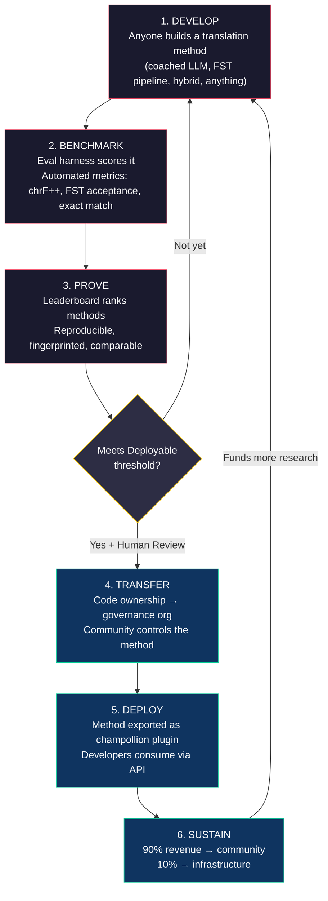
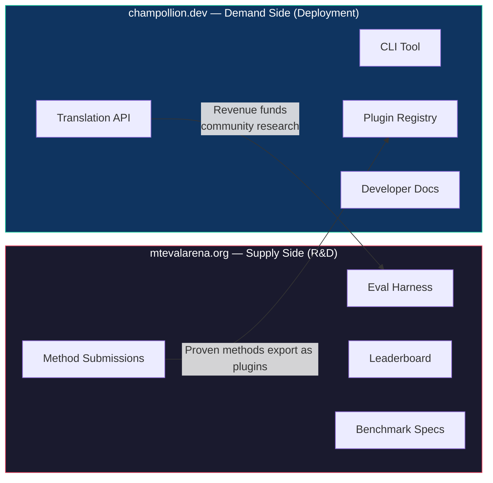
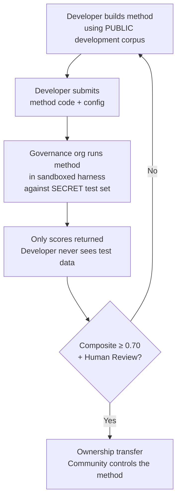

# Funktionsweise: Wettbewerbsorientiertes Crowdsourcing für die maschinelle Übersetzung

> **Zusammenfassung.** Maschinelle Übersetzung für die unterversorgten Sprachen der Welt — einschließlich der etwa 1.300 Sprachen, die Metas OMT-1600 abzudecken behauptet, jedoch mit Qualitätsniveaus unterhalb jeder brauchbaren Schwelle — ist kein Problem des Modelltrainings — es ist ein *Infrastruktur*problem. Kein einzelnes Modell, Labor oder Unternehmen wird es lösen. Dieses Dokument beschreibt eine Plattformarchitektur, die die globale Gemeinschaft von ML-Ingenieuren, Linguisten und Sprachsprechern in ein verteiltes Forschungslabor verwandelt: Jeder entwickelt eine Übersetzungsmethode, die Plattform belegt, ob sie gegen souveräne Evaluationsdaten funktioniert, und bewährte Methoden werden in den Produktivbetrieb überführt, wobei die Erlöse an die Gemeinschaften fließen, deren Sprachen sie bedienen. Der Mechanismus ist wettbewerbsorientiertes Crowdsourcing mit kryptografischer Souveränität — eine Kombination, die zuvor noch nicht versucht wurde.

---

> [!IMPORTANT]
> **Geltungsbereich.** Diese Plattform evaluiert die **Übersetzung formaler schriftlicher Texte** — Dokumente, Lehrmaterialien, offizielle Mitteilungen, UI-Zeichenketten. Sie ist kein Chatbot, kein Echtzeit-Dolmetscher und kein Konversationssystem für uneingeschränkte Domänen. Das Leaderboard bewertet Übersetzungsmethoden anhand kuratierter Parallelkorpora in spezifischen Textdomänen (siehe [Benchmark-Spezifikation §2.7](/docs/specifications/benchmark#27-domain) für die Domänentaxonomie). MT ist Infrastruktur für die Sprachrevitalisierung, kein Ersatz dafür. Kinder lernen Sprache von Menschen, nicht von Maschinen.

### Aktuelle Domänenabdeckung

| Domäne | Tier-Abdeckung | Status | Anmerkungen |
|--------|--------------|--------|-------|
| Offiziell / behördlich | Tiers 1–5 | Aktiv | EdTeKLA-Korpus |
| Bildung / Lehrbuch | Tiers 1–4 | Aktiv | EdTeKLA-Korpus |
| Erzählend / literarisch | Eingeschränkt | Geplant | Einige Einträge im Goldstandard |
| Religiös / Heilige Schrift | Nur als Referenz | Nicht evaluiert | FLORES+ (Bibel-Domäne); nicht für die offizielle Bewertung verwendet |
| Konversationell | Nicht im Geltungsbereich | Beabsichtigt | Dieses System evaluiert schriftlichen Text, keine Sprache |
| Technisch / wissenschaftlich | Nicht im Geltungsbereich | Zukünftig | Erfordert domänenspezifische Terminologievalidierung |

## 1. Das Problem: Maschinelle Übersetzung ≠ Maschinelles Lernen

Maschinelle Übersetzung für ressourcenarme Sprachen (LRLs) wird gemeinhin als Problem des maschinellen Lernens dargestellt: Daten sammeln, ein Modell trainieren, ausliefern. Diese Darstellung ist falsch, und der Fehler hat Folgen — er lenkt Finanzierung, Talent und Infrastruktur auf einen Ansatz, der strukturell für die Mehrheit der Sprachen der Welt nicht funktionieren kann.

### 1.1 Warum die ML-Darstellung versagt

Die standardmäßige ML-Pipeline für MT erfordert drei Dinge: große Parallelkorpora, validierte Evaluations-Benchmarks und einen Auslieferungspfad. Für die etwa 130 Sprachen, die von Google Translate bedient werden, und die etwa 200, die von NLLB-200 abgedeckt werden, existieren alle drei. Für die etwa 1.300 zusätzlichen Sprachen, die OMT-1600 abzudecken behauptet, existieren Evaluationsdaten, aber die Qualität liegt meist unterhalb brauchbarer Schwellen, die Modellgewichte sind nicht öffentlich verfügbar, und es gibt keine Auslieferungspipeline. Für die verbleibenden über 5.400 existiert überhaupt nichts davon.

| Anforderung | Ressourcenreiche Sprachen | OMT-1600-Abdeckung (~1.300 LRLs) | Verbleibende ~5.400 Sprachen |
|-------------|------------------------|-------------------------------|---------------------------|
| **Parallelkorpora** | Millionen von Satzpaaren (Europarl, UN Corpus, OpenSubtitles) | Bibel-Domänen-Bitext, Web-Scrapes, synthetische Rückübersetzung. Keine gemeinschaftlich kuratierten Daten. | Hunderte bis wenige Tausend, sofern vorhanden |
| **Evaluations-Benchmarks** | WMT, FLORES, NTREX — standardisiert, reproduzierbar | BOUQuET (Bibel-Domäne), met-BOUQuET. Keine morphologische Validierung. Keine unabhängige Evaluation. | Keine standardisierten Benchmarks; Ad-hoc-Evaluation |
| **Auslieferungspfad** | Google Translate, DeepL, Azure — kommerzielle APIs | Modellgewichte nicht veröffentlicht. Kein CLI, kein Plugin-System, keine gemeinschaftlich einsetzbare API. | Nichts. Keine API, kein Produkt, kein Markt. |

Der ML-Ansatz funktioniert, wenn die Daten zum Trainieren existieren und der Markt zur Auslieferung vorhanden ist. OMT-1600 hat die erste Bedingung erheblich erweitert — aber Erweiterung ohne unabhängige Qualitätsprüfung, morphologische Validierung oder gemeinschaftliche Governance ist Erweiterung ohne Vertrauen. Das Problem ist nicht nur „wir brauchen ein besseres Modell" — es ist „wir brauchen Infrastruktur, die belegt, dass das Modell funktioniert, zu Bedingungen, die die Gemeinschaft kontrolliert."

### 1.2 Was MT für LRLs tatsächlich erfordert

Übersetzung für unterversorgte Sprachen ist in erster Linie kein Trainingsproblem. Es ist ein Problem des **Method Engineering** — die Herausforderung, verfügbare Ressourcen (LLMs, morphologische Werkzeuge, Gemeinschaftswissen, linguistische Regeln) zu funktionierenden Übersetzungspipelines zusammenzufügen und dann mit rigoroser Evaluation zu belegen, dass sie funktionieren.

Die Unterscheidung ist von Bedeutung:

| Dimension | ML-Ansatz | Method-Engineering-Ansatz |
|-----------|------------|---------------------------|
| **Kernaktivität** | Ein Modell mit Daten trainieren | Werkzeuge, Prompts und linguistisches Wissen zu einer Pipeline kombinieren |
| **Engpass** | Volumen an Paralleldaten | Ingenieurskreativität + Evaluationsinfrastruktur |
| **Wer beitragen kann** | Teams mit GPU-Clustern und Datensätzen | Jeder mit einem API-Schlüssel, einem Wörterbuch und einer Idee |
| **Evaluation** | BLEU/chrF auf zurückgehaltenen Testsätzen | Morphologische Validierung + menschliche Begutachtung + automatisierte Metriken |
| **Auslieferung** | Das Modell bereitstellen | Die Methode als Plugin paketieren |

Moderne LLMs enthalten bereits latentes Wissen über viele ressourcenarme Sprachen — genug, um Ausgaben zu erzeugen, die plausibel *aussehen*. Das Problem ist, dass diese Ausgaben oft morphologisch ungültig sind (das Modell halluziniert Wortformen, die in der Sprache nicht existieren). Die ingenieurtechnische Herausforderung lautet: Wie extrahiert man das, was das LLM weiß, validiert es gegen die linguistische Realität und paketiert das Ergebnis für den Produktiveinsatz?

Deshalb benchmarken wir **Methoden**, nicht Modelle. Eine Methode ist das vollständige Rezept: Modellauswahl + Prompt-Engineering + Werkzeugnutzung + Vor-/Nachverarbeitung + Coaching-Daten + Wiederholungsstrategien. Zwei Teams, die dasselbe Modell mit unterschiedlichen Methoden verwenden, erzielen unterschiedliche Ergebnisse. Das ist der Punkt.

### 1.3 Warum polysynthetische Sprachen alles zum Scheitern bringen

Viele der am stärksten unterversorgten Sprachen der Welt sind **polysynthetisch** — sie kodieren ganze Sätze durch produktive morphologische Prozesse in einzelne Wörter. Betrachten Sie das Plains-Cree-Wort:

> **ê-kî-nitawi-kîskinwahamâkosiyân**
> *„als ich zur Schule gegangen war"*

Ein Wort. Es kodiert Tempus (Vergangenheit), Richtung (hingehen zu), den Stamm (lernen), Genus Verbi (Passiv/Reflexiv) und Person (erste Person Singular). Das Englische braucht sechs Wörter für das, was Cree in einem ausdrückt.

Dies bringt die standardmäßige MT auf allen Ebenen zum Scheitern:

- **Tokenisierung** — BPE und SentencePiece zerfetzen polysynthetische Wörter in bedeutungslose Fragmente, weil sie für konkatenative Morphologie konzipiert wurden.
- **Halluzination** — LLMs erzeugen plausibel aussehende Zeichenketten, die keine gültigen Wörter sind. Ein Nicht-Sprecher kann den Unterschied nicht erkennen. Ohne morphologische Validierung sind Halluzinationen unsichtbar.
- **Evaluation** — Metriken auf Wortebene (BLEU) bestrafen die natürliche Flexionsvariation, die fundamental dafür ist, wie diese Sprachen funktionieren. Metriken auf Zeichenebene (chrF++) sind besser, aber ohne strukturelle Validierung dennoch unzureichend.

Die Lösung ist kein größeres Modell oder mehr Trainingsdaten. Es ist **Infrastruktur, die Halluzinationen abfängt, bevor sie die Nutzer erreichen** — morphologische Analysatoren (FSTs), die definitiv sagen können „dies ist kein Wort in dieser Sprache."

---

## 2. Warum bestehende Ansätze nicht funktionieren

### 2.1 Kommerzielle MT

Kommerzielle Übersetzungsdienste haben historisch für das Marktvolumen optimiert. Metas OMT-1600 (März 2026) stellt einen bedeutenden Wandel dar — 1.600 Sprachen in einem System. Aber für die etwa 1.300 Sprachen in ihren niedrigsten Ressourcen-Tiers liegt die Qualität unterhalb brauchbarer Schwellen, die Modellgewichte sind nicht verfügbar, und es gibt keine Auslieferungspipeline. Das strukturelle Anreizproblem hat sich weiterentwickelt: Big Tech kann nun Modelle für LRLs bauen, aber ohne unabhängige Evaluation, morphologische Validierung oder gemeinschaftliche Governance löst Abdeckung allein das Problem nicht.

### 2.2 Akademische Forschung

Die akademische MT-Forschung konzentriert sich überwältigend auf ressourcenreiche Sprachpaare, weil dort die Trainingsdaten, Shared Tasks und Publikationsorte sind. Forscher, die an ressourcenarmen Paaren arbeiten, kämpfen darum zu publizieren, kämpfen darum, Rechenleistung zu finanzieren, und kämpfen darum auszuliefern — weil Auslieferungsinfrastruktur für LRLs nicht existiert.

### 2.3 Einmalige Wettbewerbe

Sie könnten einen Kaggle-Wettbewerb durchführen: „Englisch→Plains Cree, bestes chrF++ gewinnt 10.000 $." Hier ist, was passiert:

1. Jemand gewinnt, reicht ein Notebook ein, kassiert den Preis, geht nach Hause.
2. Das Notebook verrottet in Kaggles Archiv. Niemand liefert es aus. Niemand wartet es.
3. Der Testsatz wird schließlich veröffentlicht — für immer kontaminiert.
4. Die Governance-Organisation hat ihre linguistischen Daten unter Googles Nutzungsbedingungen auf Googles Infrastruktur hochgeladen, ohne echte Kontrolle über den Lebenszyklus.
5. Keine Auslieferungsbrücke. Ein siegreiches Notebook ist keine funktionierende API.

Ein einmaliges Kopfgeld zieht Kopfgeldjäger an. Ein fortlaufendes Leaderboard mit gemeinschaftlicher Governance schafft nachhaltiges Engagement.

### 2.4 Fine-Tuning

Das Fine-Tuning eines offenen Modells anhand von Paralleltext ist der naheliegende ML-Ansatz. Aber für die meisten LRLs ist das für das Fine-Tuning benötigte Parallelkorpus genau die Daten, die nicht existieren — und ihre Erstellung erfordert dieselben zweisprachigen Sprecher und dasselbe Gemeinschaftsengagement, die das Fine-Tuning ersetzen soll. Man kann sich nicht mit einer Technik, die Daten erfordert, aus einem Datenknappheitsproblem herausarbeiten.

---

## 3. Die Lösung: Wettbewerbsorientiertes Crowdsourcing mit souveräner Evaluation

Die Plattform kehrt den traditionellen Ansatz um: Anstatt dass ein Team ein Modell baut, **konkurriert die globale Gemeinschaft darum, die beste Übersetzungsmethode zu bauen**, die Plattform belegt, ob sie funktioniert, und bewährte Methoden werden in den Produktivbetrieb überführt, wobei die Sprachgemeinschaft Eigentum und Kontrolle behält.

### 3.1 Der vollständige Kreislauf

Jede Phase hat eine spezifische Funktion:

| Phase | Was geschieht | Wer profitiert |
|-------|-------------|--------------|
| **Entwickeln** | Ein Forscher, Student oder Hobbyist baut eine Übersetzungsmethode mit beliebigen Werkzeugen — LLM-Prompting, FST-Pipelines, Wörterbüchern, feinabgestimmten Modellen, regelbasierten Systemen oder Hybriden | Der Beitragende lernt, experimentiert, publiziert |
| **Benchmarken** | Das Eval-Harness bewertet die Methode anhand eines standardisierten Korpus mit reproduzierbaren Metriken. Jeder Lauf erzeugt eine [Run Card](/docs/specifications/benchmark#3-run-card-schema) — ein vollständiges Protokoll darüber, was getestet wurde und wie es abschnitt | Forscher erhalten reproduzierbare, vergleichbare Ergebnisse |
| **Belegen** | Die Ergebnisse erscheinen auf dem öffentlichen Leaderboard. Methoden werden eingestuft, verglichen und geprüft. Die Gemeinschaft sieht, was funktioniert und was nicht | Alle gewinnen Einblick in den Stand der Technik |
| **Überführen** | Für indigene Sprachen wird bei Methoden, die die Deployable-Schwelle erreichen (Composite ≥ 0,70) UND die menschliche Validierung bestehen, das Code-Eigentum an die Governance-Organisation der Sprachgemeinschaft übertragen | Die Gemeinschaft gewinnt einen erlösgenerierenden Vermögenswert |
| **Ausliefern** | Die Methode wird als [champollion](https://github.com/gamedaysuits/champollion)-Plugin exportiert und über eine API bereitgestellt. Entwickler nutzen Übersetzungen, ohne die zugrunde liegende Methode verstehen zu müssen | Entwickler erhalten Übersetzung für Sprachen, die kommerzielle APIs nicht bedienen |
| **Erhalten** | Die API-Erlöse werden aufgeteilt: 90 % an die Gemeinschaft, 10 % an die Infrastruktur. Die Erlöse finanzieren weitere linguistische Forschung, Korpusentwicklung und Gemeinschaftsprogramme | Das Schwungrad erhält sich nach der anfänglichen Etablierung selbst |

### 3.2 Warum die Wettbewerbsdynamik funktioniert

Wettbewerb ist nicht nebensächlich — er ist der Mechanismus. Hier ist der Grund:

**Vielfalt der Ansätze.** Die beste Methode für Englisch→Plains Cree könnte ein FST-gesteuertes, gecoachtes LLM sein. Die beste für Englisch→Quechua könnte eine wörterbuchgestützte Pipeline sein. Die beste für Englisch→Inuktitut könnte ein feinabgestimmtes Modell sein, das aus dem Nunavut-Hansard-Korpus gebootstrappt wurde. Kein einzelnes Team oder kein einzelner Ansatz wird über alle Sprachen hinweg dominieren. Das Leaderboard offenbart, welche *Arten* von Ansätzen für welche *Arten* von Sprachen funktionieren — ein Meta-Ergebnis, das selbst einen Forschungsbeitrag darstellt.

**Nachhaltiges Engagement.** Ein Leaderboard ist nie fertig. Jemand will immer das Spitzenergebnis schlagen. Jede Einreichung spendet Rechenleistung und intellektuellen Aufwand für das Problem. Anders als eine einmalige Förderung erzeugt die Wettbewerbsdynamik fortlaufende Forschungsinvestitionen aus der globalen Gemeinschaft.

**Niedrige Einstiegshürde.** Sie brauchen einen API-Schlüssel, ein Wörterbuch und eine Idee. Das Eval-Harness ist Open Source. Das Korpusformat ist einfaches JSON. Ein Linguistikstudent kann mit einem gut ausgestatteten Labor konkurrieren — und manchmal gewinnen, weil Domänenwissen (das Verständnis der Sprache) Rechenressourcen überwiegen kann.

**Auslieferungsbrücke.** Dieselbe Methode, die im Harness gut abschneidet, wird mit einer Konfigurationsänderung in den Produktivbetrieb überführt. „Beweisen Sie es hier, liefern Sie es dort aus." Dies ist die Lücke, die Kaggle, WMT-Shared-Tasks und akademische Publikationen nicht überbrücken.

### 3.3 Die Plattformarchitektur

Das Ökosystem ist physisch in zwei Sites aufgeteilt, die zwei Zielgruppen bedienen:

**[mtevalarena.org](https://mtevalarena.org)** ist das F&E-Versuchsfeld. Seine Zielgruppe sind ML-Ingenieure, Linguisten und Forscher. Alles hier dreht sich um das Bauen, Testen und Belegen von Übersetzungsmethoden.

**[champollion.dev](https://champollion.dev)** ist die Auslieferungsplattform. Seine Zielgruppe sind Entwickler, die Übersetzung für ihre Apps benötigen. Sie müssen nicht verstehen, wie die Methoden funktionieren — sie rufen einfach die API auf.

Die Brücke zwischen ihnen ist das **Methoden-Plugin**: eine bewährte Methode, für die Auslieferung paketiert, im Eigentum der Gemeinschaft.

---

## 4. Souveräne Evaluation: Warum die Infrastruktur von Bedeutung ist

Die Evaluationsinfrastruktur ist kein technisches Detail — sie ist der Kern des Souveränitätsmodells. Standardevaluation (laden Sie Ihren Testsatz auf eine gemeinsame Plattform hoch) funktioniert für indigene Sprachen nicht, weil sie die Kontrolle über die linguistischen Daten aufgibt.

### 4.1 Der Souveränitätsmechanismus

Der Entwickler sieht niemals die Goldstandard-Evaluationsdaten. Er entwickelt anhand eines öffentlichen Entwicklungskorpus und reicht dann seinen Methodencode bei der Governance-Organisation ein, die ihn in einer Sandbox gegen den geheimen Testsatz ausführt. Es kommen nur Bewertungen zurück. Dies ist nicht nur Sicherheit — es ist eine direkte Umsetzung der **OCAP®-Prinzipien** (Ownership, Control, Access, Possession), die die indigene Datengovernance erfordert.

### 4.2 Warum dies nicht auf der Plattform eines anderen laufen kann

Auf Kaggle lädt die Governance-Organisation ihre linguistischen Daten unter Googles Nutzungsbedingungen auf Googles Infrastruktur hoch. Sie kann den Zugriff nicht nach ihrem eigenen Zeitplan widerrufen. Sie kann den Einreichungen keine benutzerdefinierten rechtlichen Bedingungen (wie die Eigentumsübertragung) beifügen. Sie hat keine kryptografische Garantie, dass die Daten nicht für andere Zwecke verwendet werden. Datensouveränität bedeutet, dass die Gemeinschaft den Evaluationsendpunkt kontrolliert, die Schlüssel hält und ihn abschalten kann.

---

## 5. Evaluationsphilosophie: Microeval und LYSS

Standardmäßige MT-Metriken (BLEU, chrF++, COMET) sind darauf ausgelegt, über Sprachen hinweg zu generalisieren. Diese Allgemeingültigkeit ist ihre Stärke — und ihr blinder Fleck. Für polysynthetische Sprachen schneidet ein morphologisch ungültiges Wort, das Zeichen-N-Gramme mit der Referenz teilt, bei chrF++ gut ab, würde aber von jedem Sprecher als Kauderwelsch erkannt.

**Microeval-Entwicklung** bedeutet, Evaluationsmetriken zu bauen, die mithilfe der besten verfügbaren linguistischen Werkzeuge auf spezifische Sprachen zugeschnitten sind. Das Framework heißt **LYSS** (Linguistically-informed Yield & Structural Scoring):

| Komponente | Was sie misst | Werkzeug | Status |
|-----------|-----------------|------|--------|
| **LYSS-fst** | Morphologische Gültigkeit | Finite-State-Transducer | ✅ Implementiert (Plains Cree) |
| **LYSS-eq** | Linguistische Äquivalenz | Von Linguisten kuratierte Variantenregeln | ✅ Implementiert (Plains Cree) |
| **LYSS-sem** | Semantische Erhaltung | Sprachspezifische semantische Modelle | ✅ Implementiert (Plains Cree) |

Die universellen Metriken (chrF++, BLEU) dienen als Baselines und als primäre Signale für Sprachen ohne LYSS-Tooling. Wo immer sprachspezifische Werkzeuge existieren, tragen die LYSS-Komponenten das Bewertungsgewicht — denn die Dinge, die für jede Sprache am wichtigsten sind, sind die Dinge, die nur sprachspezifische Werkzeuge messen können.

Für die vollständige LYSS-Spezifikation und die Logik der Composite-Bewertung siehe [SCORING_SPEC.md §4](/docs/specifications/scoring#4-composite-score).

> [!WARNING]
> **Vergleichbarkeit zwischen Läufen.** Beim Vergleich von Läufen mit unterschiedlicher Metrikverfügbarkeit (z. B. ein Lauf hat FST-Bewertungen, ein anderer nicht) sind die Composite-Bewertungen nicht direkt vergleichbar. Der Composite normalisiert auf die verfügbaren Metriken, aber ein anhand von 5 Metriken evaluierter Lauf trägt mehr Information als einer, der anhand von 2 evaluiert wurde. Das Leaderboard gibt die Metrikabdeckung für jeden Eintrag an.

---

## 6. Wen dies bedient

### Für ML-Ingenieure und Forscher

Ein offenes Leaderboard mit standardisierten Benchmarks für Sprachpaare, die kein Shared Task abdeckt. Reproduzieren Sie jedes Ergebnis mit dem Eval-Harness. Publizieren Sie Ihre Methode. Schlagen Sie das Spitzenergebnis. Jede Einreichung wird mit einem Fingerprint einer spezifischen Konfiguration und Datensatzversion versehen — keine Mehrdeutigkeit darüber, was getestet wurde.

### Für Sprachgemeinschaften

Eigentum und Kontrolle über Übersetzungstechnologie, die für Ihre Sprache gebaut wurde. Die Wettbewerbsdynamik bedeutet, dass mehrere Teams gleichzeitig an Ihrer Sprache arbeiten — Sie profitieren von allen und besitzen das Ergebnis. Erlöse aus der API-Nutzung finanzieren Gemeinschaftsprogramme zu Ihren Bedingungen.

### Für Geldgeber und Förderungsgutachter

Transparente, reproduzierbare Metriken zur Bewertung von Übersetzungsforschungsanträgen. Messbare Ergebnisse über Publikationen hinaus: API-Nutzung, erzielte Erlöse, Qualitätsmetriken im Zeitverlauf, Sprachabdeckung. Eine einzelne erfolgreiche Methode schafft einen sich selbst erhaltenden Erlösstrom — die Wirkung der Förderung verstärkt sich, anstatt zu enden, wenn die Finanzierung ausläuft.

### Für Entwickler

Übersetzung für Sprachen, die keine kommerzielle API bedient. Ein CLI-Befehl (`npx champollion sync`) übersetzt Ihre Locale-Dateien mit gemeinschaftlich bewährten Methoden. Nutzen Sie Google Translate für Französisch, ein gecoachtes LLM für Plains Cree und eine Gemeinschafts-API für Quechua — alles im selben Projekt, alles mit derselben Schnittstelle.

### Für Studenten

Eine offene Herausforderung mit realer Wirkung. Bauen Sie eine Übersetzungsmethode für eine unterversorgte Sprache, benchmarken Sie sie und publizieren Sie Ihre Ergebnisse. Die Infrastruktur ist kostenlos, die Datensätze sind offen, und es kümmert das Leaderboard nicht, ob Sie an einer Top-10-Universität sind oder von einem Bibliotheksterminal aus arbeiten.

---

## 7. Sozialer und technischer Kontext

### 6.1 Die Sprachrevitalisierung beschleunigt sich

Bemühungen zur Sprachrevitalisierung wachsen weltweit. Immersionsschulen, gemeinschaftliche Sprachnester und digitale Archivierungsprojekte breiten sich in indigenen Gemeinschaften in Kanada, den Vereinigten Staaten, Australien, Neuseeland und Nordeuropa aus. Diese Bemühungen benötigen Technologie — konkret Übersetzungstechnologie, die die gemeinschaftliche Souveränität über linguistische Daten respektiert.

### 6.2 LLMs haben die Ausgangsbasis verändert

Vor 2023 erforderte der Aufbau jeglicher MT-Fähigkeit für eine polysynthetische Sprache erhebliche NLP-Expertise, individuelles Modelltraining und große Rechenbudgets. Moderne LLMs haben die Ausgangsbasis verändert: Ein gut ausgearbeiteter Prompt mit Coaching-Daten und morphologischer Validierung kann für einige Sprachpaare brauchbare Übersetzungen erzeugen — ohne Training. Dies senkt die Einstiegshürde für die Methodenentwicklung drastisch. Das Problem hat sich von „Wie bauen wir ein Modell?" zu „Wie bauen wir eine Pipeline, die das, was das Modell erzeugt, validiert und korrigiert?" verschoben.

### 6.3 Die Open-Source-Benchmarking-Kultur

KI-Benchmarking ist zu einer eigenen Kultur geworden. Leaderboards treiben Innovation an. Wettbewerbe ziehen Talent an. Die Chatbot Arena, LMSYS, das Hugging Face Open LLM Leaderboard — diese Plattformen zeigen, dass wettbewerbsorientierte Evaluation rapiden Fortschritt vorantreibt. Wir nehmen diese Energie und richten sie auf die Übersetzung für die Tausenden von Sprachen, für die kommerzielle MT entweder nicht existiert oder nicht unabhängig als funktionierend belegt wurde.

### 6.4 Indigene Datensouveränität ist nicht verhandelbar

Die OCAP®-Prinzipien (Ownership, Control, Access, Possession), die CARE-Prinzipien (Collective Benefit, Authority to Control, Responsibility, Ethics) und Frameworks wie Te Mana Raraunga (Māori-Datensouveränität) sind keine optionalen Zusätze — sie sind strukturelle Anforderungen an jede Technologie, die indigene linguistische Ressourcen berührt. Unsere Evaluationsinfrastruktur setzt diese Prinzipien architektonisch um, nicht nur als Grundsatzerklärungen.

---

## 8. Spannungen und Einschränkungen {#8-tensions-and-limitations}

Dieses Projekt verwendet einen westlichen Mechanismus — wettbewerbsorientiertes Benchmarking —, um Wissenssysteme zu bedienen, die oft gemeinschaftlich, relational und von Ältesten geleitet sind. Diese Spannung ist real und muss benannt, nicht durch Behauptung aufgelöst werden.

**Benchmarking vs. gemeinschaftliches Wissen.** Leaderboards stufen Einzelpersonen ein und optimieren numerische Bewertungen. Indigene Wissenstraditionen betonen relationale Autorität, gemeinschaftliche Korrektur und beziehungsbasierte Legitimität. Wir können nicht behaupten, diese Wissenssysteme zu bedienen, während wir eine Plattform bauen, deren Kernmechanismus die individuelle wettbewerbsorientierte Optimierung ist. Die Souveränitätsarchitektur (§4) — bei der Gemeinschaften Methoden besitzen, die Evaluation kontrollieren und entscheiden, was ausgeliefert wird — ist unsere strukturelle Antwort, aber sie löst die Spannung nicht auf. Ein Leaderboard ist immer noch ein Leaderboard.

**Was wir dagegen tun.** Die Plattform unterstützt Team- und Gemeinschaftseinreichungen neben individuellen. Das Leaderboard rahmt Ergebnisse als „aktueller Stand der Technik" statt als „wer gewinnt". Die Governance-Organisation — nicht die Leaderboard-Bewertung — bestimmt, was ausgeliefert wird. Keine automatisierte Bewertung berechtigt einen Entwickler zu irgendetwas; die Gemeinschaft entscheidet. Und wir pflegen eine fortlaufende beratende Rückkopplungsschleife mit Partnergemeinschaften darüber, ob die Rahmung und Anreizstruktur der Plattform ihnen dient. Falls nicht, ändern wir sie.

**MT ist keine Revitalisierung.** Übersetzung konvertiert Text zwischen Sprachen. Revitalisierung schafft neue Sprecher. Ein perfektes MT-System löst weder das Übertragungsproblem noch das Prestigeproblem noch das pädagogische Problem. Es könnte sogar die Illusion erzeugen, dass „der Computer die Sprache sprechen kann", und die Dringlichkeit der menschlichen Übertragung untergraben. Wir bauen MT als Infrastruktur — Rohübersetzung für das Post-Editing, morphologische Werkzeuge für Sprachlern-Apps, politischer Hebel für Gemeinschaften, die Dienste in ihrer Sprache fordern — nicht als Ersatz für die generationsübergreifende Übertragung. Die Gemeinschaft kontrolliert, ob, wann und wie die Technologie ausgeliefert wird.

Dieser Abschnitt existiert, weil diese Spannungen in einer eingeladenen Kritik (Mai 2026) identifiziert wurden und wir uns verpflichtet haben, sie öffentlich zu benennen, anstatt sie in internen Dokumenten zu vergraben.

> [!NOTE]
> **Leaderboard-Bewertungen sind automatisierte Stellvertretergrößen.** Alle auf dem Leaderboard angezeigten Bewertungen sind automatisierte Messungen, die vom Evaluations-Harness unter kontrollierten Bedingungen berechnet werden. Sie geben die relative Methodenleistung an, stellen aber keine Qualitätsgarantien dar. Gemeinschaftlich validierte Methoden sind separat gekennzeichnet. Keine automatisierte Bewertung berechtigt einen Entwickler zur Auslieferung — die Governance-Organisation trifft diese Entscheidung.

---

## 9. Aktueller Stand

### Was heute existiert

- **champollion** — Produktionsreifes CLI-Werkzeug. 10 Übersetzungsmethoden, Konfiguration pro Paar, Quality Gates, 5 Dateiformate. [Auf npm veröffentlicht](https://www.npmjs.com/package/champollion).
- **MT Eval Harness** — Funktionierendes Evaluations-Framework. chrF++, FST-Akzeptanz und Exact-Match-Metriken implementiert. Run-Card-Schema finalisiert. Fingerprinting und Integritätsprüfung funktionieren.
- **EDTeKLA Dev v1** — Plains-Cree-Evaluationskorpus (CC BY-NC-SA 4.0), bezogen von der EdTeKLA-Forschungsgruppe der University of Alberta. Das Lehrbuchkorpus hat 486 Einträge (436 dev + 50 zurückgehalten), plus 62 separate Goldstandard-Paare von itwêwina (548 insgesamt). Das kanonische Dev-Korpus ist `textbook_dev.json` mit 436 Einträgen — der vollständige Lehrbuch-Dev-Split.
- **FLORES+ Devtest** — 1.012 Sätze × 39 Sprachen (CC BY-SA 4.0).
- **Arena-Website** — Docusaurus-basierte Dokumentationsseite mit Leaderboard, Spezifikationen, Tutorials und Souveränitäts-Framework.
- **Benchmark-Spezifikation** — [Kanonische Spezifikation](/docs/specifications/benchmark), die das Korpusschema, das Run-Card-Format und das Evaluationsprotokoll definiert. Für Metrikdefinitionen, Composite-Gewichte und Qualitäts-Tiers siehe [SCORING_SPEC.md](/docs/specifications/scoring).

### Was als Nächstes kommt

| Phase | Was | Status |
|-------|------|--------|
| Baseline-Sweep | 12 Modelle × 3 Temperaturen × 2 Coaching-Konfigurationen auf EDTeKLA | 🔲 Geplant |
| Composite-Bewertung | Implementierung gewichteter Metriken im Harness | ✅ Erledigt |
| Semantische Bewertung | Verdict-gewichtete Bewertung aus CrkSemanticMetric (Eval-Standard) | ✅ Erledigt |
| Morphologische Genauigkeit | Bewertung pro Morphem gegen Goldstandard-Analyse | 🔲 Geplant |
| Äquivalenter Match | Variantenklassen-Abgleich via CrkLinterMetric (Eval-Standard) | ✅ Erledigt |
| Champollion API | Gemessene API für gemeinschaftseigene Methoden | 🔲 Geplant |
| Zweite Sprache | Erweiterung auf ein zweites Sprachpaar (Inuktitut, Quechua oder Sámi) | 🔲 Geplant |

---

## 10. Erste Schritte

**Eine Methode bauen:** Klonen Sie das [Eval-Harness](https://github.com/gamedaysuits/arena), führen Sie ein Baseline-Experiment durch und sehen Sie, wo Sie auf dem Leaderboard landen.

**Ein Korpus beitragen:** Wenn Sie eine unterversorgte Sprache sprechen, reichen schon 50 kuratierte Übersetzungspaare aus, um einen neuen Leaderboard-Track zu eröffnen. Siehe [Für Sprachgemeinschaften](https://mtevalarena.org/docs/community/for-language-communities).

**Übersetzungen ausliefern:** Installieren Sie [champollion](https://github.com/gamedaysuits/champollion) und übersetzen Sie Ihre App mit `npx champollion sync`.

**Die Bemühung fördern:** Siehe [Das Wirtschaftsmodell](https://mtevalarena.org/docs/sovereignty/economic-model) für Kostenrahmen und Nachhaltigkeitsprognosen.

---

## Siehe auch

- **[Benchmark-Spezifikation](/docs/specifications/benchmark)** — Korpusformat, Run-Card-Schema, Evaluationsprotokoll, Souveränität
- **[Scoring-Spezifikation](/docs/specifications/scoring)** — Metriken, Composite-Gewichte, Qualitäts-Tiers, Kosten-/Geschwindigkeitsformeln
- **[MT Eval Arena](https://mtevalarena.org)** — das F&E-Versuchsfeld
- **[champollion](https://github.com/gamedaysuits/champollion)** — die Auslieferungsplattform
- **[Eine ressourcenarme Sprache unterstützen](https://mtevalarena.org/docs/community/low-resource-languages)** — vertiefte Betrachtung der Herausforderungen und Ansätze polysynthetischer MT

---

*Dieses Dokument ist der Einstiegspunkt für alle, die zum ersten Mal auf das Projekt stoßen. Für die vollständige technische Spezifikation siehe [BENCHMARK_SPEC.md](/docs/specifications/benchmark) (Protokoll) und [SCORING_SPEC.md](/docs/specifications/scoring) (Metriken).*