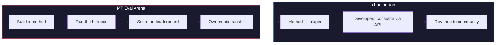

# Die MT Eval Arena

> **Zusammenfassung für Entscheidungsträger.** Die MT Eval Arena ist eine offene Benchmarking-Plattform für Verfahren der maschinellen Übersetzung mit Schwerpunkt auf Sprachen, für die kommerzielle MT entweder nicht existiert oder nicht unabhängig verifiziert wurde. Sie bietet eine standardisierte Evaluation, ein öffentliches Leaderboard und eine Deployment-Brücke zur Produktion über champollion. Für indigene Sprachen werden bewährte Verfahren in das Eigentum der Gemeinschaft übertragen.

Ein offenes Testfeld für Verfahren der maschinellen Übersetzung — insbesondere für Sprachen, für die kommerzielle MT entweder nicht existiert oder nicht unabhängig verifiziert wurde.

Entwickeln Sie ein Verfahren. Benchmarken Sie es. Beweisen Sie, dass es funktioniert. Wenn es gewinnt, wird es eingesetzt.

---

## Das Problem

Google Translate unterstützt ~130 Sprachen. Metas NLLB-200 deckt ~200 ab, und OMT-1600 (März 2026) beansprucht 1.600. Auf der Erde werden über 7.000 gesprochen. Für die ~1.300 Sprachen in den niedrigsten Ressourcen-Stufen von OMT-1600 sind die Modellgewichte nicht verfügbar, die Qualität liegt unter den Nutzbarkeitsschwellen, und die Evaluation verwendete Texte aus dem Bibel-Bereich mit standardmäßigen maschinellen Metriken — ohne morphologische Validierung, ohne unabhängige Tests, ohne Governance durch die Gemeinschaft. Für die übrigen ~5.400 Sprachen erzeugt kein vortrainiertes Modell überhaupt eine Ausgabe.

Big Tech investiert inzwischen in die Abdeckung von LRL — aber Abdeckung ohne unabhängige Qualitätsverifizierung, morphologische Validierung oder Governance durch die Gemeinschaft ist Abdeckung ohne Vertrauen. Die Sprecher, die Übersetzungswerkzeuge am dringendsten benötigen, sind genau jene Gemeinschaften, für die diese am unwahrscheinlichsten entwickelt werden.

**Die Arena existiert, um das zu ändern.** Sie stellt die Infrastruktur bereit, um Übersetzungsverfahren für jede beliebige Sprache zu entwickeln, zu evaluieren und einzusetzen — mit reproduzierbarem Scoring, offener Einreichung und Governance durch die Gemeinschaft darüber, wer die Ergebnisse kontrolliert.

---

## Funktionsweise

1. **Sie entwickeln ein Übersetzungsverfahren** — ein gecoachtes LLM, ein feinabgestimmtes Modell, eine FST-gesteuerte Pipeline oder etwas anderes, das Übersetzungen erzeugt.
2. **Das Harness benchmarkt es** — standardisierte Metriken (chrF++, exact match, FST acceptance), fingerabdruckgenau an einen bestimmten Git-Commit gebunden.
3. **Die Ergebnisse erscheinen auf dem Leaderboard** — jede Einreichung ist reproduzierbar und vergleichbar.
4. **Wenn es gewinnt, wird das Eigentum übertragen** — für indigene Sprachen geht der Code des gewinnenden Verfahrens an die Organisation für die Governance der Gemeinschaft über.
5. **Das Verfahren wird in die Produktion überführt** — über [champollion](https://champollion.dev), die für Entwickler bestimmte API. Die Einnahmen fließen an die Gemeinschaft zurück.

**Beweisen Sie es hier. Setzen Sie es dort ein.**

---

## Für wen dies gedacht ist

| Sie sind... | Die Arena bietet Ihnen... |
|---|---|
| **ML-Ingenieur / Forscher** | Standardisierte Benchmarks, reproduzierbares Scoring, ein Leaderboard, auf dem Sie konkurrieren können |
| **Linguist** | Ein Framework, um Grammatikregeln und Wörterbücher in testbare Verfahren zu überführen |
| **Mitglied einer Sprachgemeinschaft** | Governance darüber, wie die Verfahren für Ihre Sprache entwickelt und eingesetzt werden |
| **Geldgeber / Gutachter von Förderanträgen** | Transparente, reproduzierbare Metriken zur Bewertung von Forschungsvorhaben zur Übersetzung |
| **Student** | Eine offene Herausforderung mit realer Wirkung — entwickeln Sie ein Verfahren, reichen Sie Ihre Scores ein |

---

## Aktuelle Benchmarks

### EDTeKLA Development Set v1
- **Sprachpaar:** English → Plains Cree (SRO)
- **Einträge:** 548 kuratierte Paare (486 Lehrbuch + 62 Goldstandard)
- **Lizenz:** CC BY-NC-SA 4.0
- **Quelle:** [EdTeKLA research group](https://spaces.facsci.ualberta.ca/edtekla/), University of Alberta

### FLORES+ Devtest
- **Sprachpaare:** English → 39 Sprachen
- **Einträge:** 1.012 Sätze pro Sprache
- **Lizenz:** CC BY-SA 4.0
- **Quelle:** [OLDI](https://huggingface.co/datasets/openlanguagedata/flores_plus)

---

## Die eine Regel

:::danger Trainieren Sie nicht auf Evaluationsdaten
Verfahren, die dem Benchmark-Datensatz ausgesetzt waren — als Trainingsdaten, Few-Shot-Beispiele, Wörterbucheinträge oder Prompt-Material — werden **disqualifiziert**. Führen Sie ein Fine-Tuning durch, worauf Sie möchten. Nur nicht auf dem Test-Set.
:::

---

## Nächste Schritte

- **[Ein Verfahren einreichen](/docs/getting-started/submit-a-method)** — wie Sie Ihren ersten Benchmark-Lauf einreichen
- **[Benchmark-Spezifikation](/docs/specifications/benchmark)** — das vollständige Experimentprotokoll
- **[Leaderboard-Regeln](/docs/leaderboard/rules)** — Einreichungskriterien und Richtlinien gegen Manipulation
- **[Datensouveränität](/docs/sovereignty/data-sovereignty)** — OCAP, CARE und warum die Eigentumsübertragung von Bedeutung ist
- **[Das Wirtschaftsmodell](/docs/sovereignty/economic-model)** — wie Arena-Scores zu Einnahmen für die Gemeinschaft werden

**[→ Das Leaderboard ansehen](https://champollion.dev/leaderboard)**