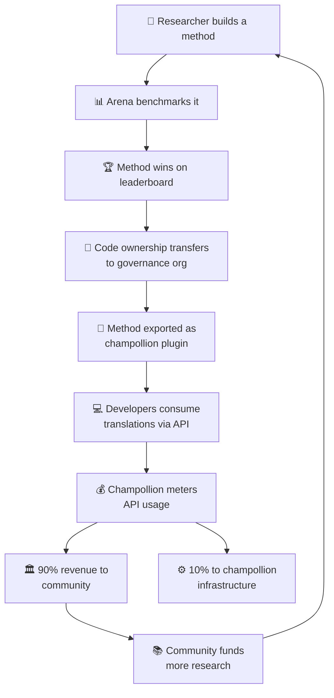

# Das Wirtschaftsmodell

> **Zusammenfassung.** Diese Seite beschreibt den wirtschaftlichen Kreislauf, der die Arena und champollion verbindet: Forschung bringt Methoden hervor, Methoden werden als Plugins bereitgestellt, die API-Nutzung generiert Einnahmen, und 90 % der Einnahmen fließen an die Sprachgemeinschaft. Behandelt werden der Schwungrad-Mechanismus, die Einnahmenaufteilung, die Komfortebene sowie die Argumente für die Nachhaltigkeit gegenüber Geldgebern.

Die Arena und champollion bilden einen geschlossenen wirtschaftlichen Kreislauf. Forschung auf der Arena bringt Methoden hervor. Methoden werden über champollion bereitgestellt. Einnahmen aus champollion fließen zurück an die Gemeinschaften, deren Sprachen die Methoden bedienen.

---

## Das Schwungrad

Jede Umdrehung des Schwungrads stärkt das Ökosystem:
- **Mehr Forschung** bringt bessere Methoden hervor
- **Bessere Methoden** ziehen mehr Entwickler an
- **Mehr Entwickler** generieren mehr API-Einnahmen
- **Mehr Einnahmen** finanzieren mehr von der Gemeinschaft geleitete Forschung

---

## Wie Einnahmen fließen

Wenn ein Entwickler eine im Besitz der Gemeinschaft befindliche Methode über die champollion-API nutzt:

| Schritt | Was geschieht |
|---|---|
| Entwickler ruft `champollion sync` oder die REST-API auf | Übersetzungen werden von der im Besitz der Gemeinschaft befindlichen Methode erstellt |
| Champollion erfasst den API-Aufruf | Die Nutzung wird pro Anfrage und pro Sprachpaar erfasst |
| Einnahmen werden aufgeteilt | **90 %** gehen an die Governance-Organisation, die Eigentümerin der Methode ist. **10 %** decken die Infrastrukturkosten von champollion. |
| Gemeinschaft entscheidet über die Verwendung | Einnahmen finanzieren Sprachprogramme, weitere Forschung, Gemeinschaftsressourcen – ganz nach Entscheidung der Governance-Organisation |

### Die Komfortebene

Champollion stellt außerdem optimierte Konfigurationen für gängige Methoden bereit. Wenn ein Forscher nachweist, dass Gemini 2.5 Pro mit bestimmten Coaching-Daten und Temperatureinstellungen die besten Ergebnisse für ein Sprachpaar liefert, ist diese Konfiguration als vorgefertigtes Preset über die champollion-API verfügbar. Entwickler müssen die Forschung nicht reproduzieren – sie rufen einfach die API auf.

Die Arena legt die Baselines fest. Champollion macht sie zugänglich. Gemeinschaften profitieren von beidem.

---

## Für Standardsprachen

Das Schwungrad entfaltet die größte Wirkung für indigene und ressourcenarme Sprachen, wo das Modell der Eigentumsübertragung und der Einnahmen für die Gemeinschaft zur Anwendung kommt.

Für Standardsprachen (Französisch, Japanisch, Spanisch usw.) bietet champollion denselben API-Komfort ohne die Governance-Ebene – Entwickler zahlen für den erfassten Zugriff auf vorkonfigurierte Übersetzungsmethoden, und champollion behält einen Infrastrukturanteil ein.

---

## Für Geldgeber

Das Wirtschaftsmodell adressiert ein häufiges Anliegen bei der Finanzierung von Sprachtechnologie: **Nachhaltigkeit nach Auslaufen der Förderung.**

| Traditionelles Modell | Arena-Modell |
|---|---|
| Förderung finanziert Forschung | Förderung finanziert Forschung |
| Veröffentlichung der Publikation | Methode wird in den Produktivbetrieb überführt |
| Förderung endet, Werkzeug wird aufgegeben | API-Einnahmen tragen den Betrieb |
| Gemeinschaft erhält nichts | Gemeinschaft besitzt den Vermögenswert und erzielt Einnahmen |

Eine einzige erfolgreiche Methode schafft einen sich selbst tragenden Einnahmenstrom. Geldgeber können die Wirkung nicht nur an Publikationen messen, sondern auch an:
- API-Nutzung (wie viele Entwickler die Methode nutzen)
- erzielten Einnahmen (wie viel Geld an die Gemeinschaft fließt)
- Qualitätsmetriken (Leaderboard-Werte im Zeitverlauf)
- Sprachabdeckung (wie viele Sprachpaare bedient werden)

Siehe die [Benchmark-Spezifikation](/docs/specifications/benchmark), §10 für detaillierte Kostenmodelle.

---

## Siehe auch

- [Eigentumsübertragung](/docs/sovereignty/ownership-transfer) – der rechtliche und technische Übertragungsprozess
- [Datensouveränität](/docs/sovereignty/data-sovereignty) – die Prinzipien von OCAP, CARE und Te Mana Raraunga
- [Leaderboard-Regeln](/docs/leaderboard/rules) – wie Methoden sich für die Bereitstellung qualifizieren