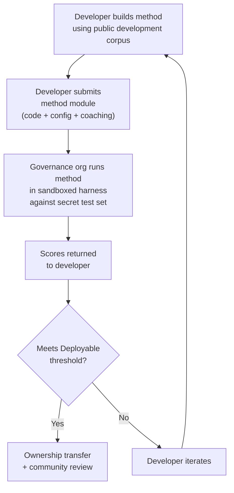

# Benchmark-Spezifikation

> **Zusammenfassung.** Dieses Dokument definiert das Evaluationsprotokoll für das Champollion-MT-Evaluations-Ökosystem: Korpusformat (§2), Run-Card-Schema (§3), Benchmark-Protokoll (§6), Anforderungen an die menschliche Validierung (§7), Souveränitätsmechanismen (§8), Leaderboard- und Einreichungsmodell (§9), Kostenrahmen (§10) sowie Erweiterbarkeit auf neue Sprachen (§11). Definitionen der Metriken, Gewichtungen für den Composite-Score, Schwellenwerte der Qualitätsstufen und Formeln für Kosten-/Geschwindigkeitsmetriken finden Sie unter `SCORING_SPEC.md` — der einzigen verbindlichen Quelle für die gesamte Bewertungslogik. Dieses Dokument verweist für diese Details auf SCORING_SPEC, anstatt sie zu duplizieren.
>
> Zuletzt aktualisiert: 2026-06-07

---

## 1. Grundsätze

### 1.1 Automatisierte Metriken sind Näherungswerte

Jede in diesem Dokument definierte Metrik wird maschinell berechnet. chrF++, FST-Akzeptanz, morphologische Genauigkeit, semantische Ähnlichkeit — sie alle sind automatisierte Näherungswerte für die Übersetzungsqualität. Sie sind nützlich für schnelle Iteration, systematischen Vergleich und das Erkennen von Regressionen. Sie sind **kein Ersatz für menschliches Urteilsvermögen**.

Die Evaluationshierarchie:

```
Automated metrics (run cards, benchmarks)
    ↓ proxy for
Human review (bilingual speakers validate output)
    ↓ proxy for
Actual utility (does this help a language community?)
```

Kein automatisierter Score, so hoch er auch sein mag, kann ein fließend sprechendes Gegenüber ersetzen, das die Ausgabe liest und bestätigt, dass sie korrekt, natürlich und kulturell angemessen ist. Die in §5 definierten Qualitätsstufen sind heuristische Bezeichnungen für automatisierte Composite-Scores — nützlich, um Fortschritte nachzuverfolgen, aber für sich allein niemals ausreichend.

### 1.2 Methoden, nicht Modelle

Wir benchmarken **Methoden**, nicht Modelle. Ein Modell ist eine Komponente. Eine Methode ist das vollständige Rezept: Modellauswahl, Prompt-Design, Werkzeugnutzung, Vor-/Nachbearbeitung, Coaching-Daten, Wiederholungsstrategien, alles. Zwei Teams, die dasselbe Modell mit unterschiedlichen Methoden verwenden, erhalten unterschiedliche Scores. Genau das ist der Punkt.

### 1.3 Reproduzierbarkeit

Jedes Benchmark-Ergebnis muss reproduzierbar sein. Die Run Card (§3) erfasst die vollständige Konfiguration eines Experiments. Der Fingerprint (§3.5) identifiziert den experimentellen Aufbau. Der Run-Card-Hash (§3.6) verifiziert die Integrität des Ergebnisses. Jeder, der über dieselbe Methode, dasselbe Korpus und dieselbe Konfiguration verfügt, sollte Scores innerhalb von ±2 % erzielen (unter Berücksichtigung der nicht-deterministischen LLM-Stichprobenziehung bei Temperatur > 0).

### 1.4 Keine synthetischen Evaluationsdaten

**Dieses Projekt erzeugt, verwendet oder befürwortet keine synthetischen Evaluationsdaten.** Alle Korpora müssen aus echtem, von Menschen verfassten Text stammen — veröffentlichte Übersetzungen, Lehrbücher, zweisprachige Dokumente oder von fließend sprechenden Personen erhobene Übersetzungen.

LLMs dürfen unterstützen bei:
- Satzausrichtung (Auffinden paralleler Passagen in vorhandenen zweisprachigen Texten)
- Formatkonvertierung (Umwandlung veröffentlichter Materialien in das Korpusschema)
- Anreicherung von Metadaten (Vorschläge für Schwierigkeitsstufen, Register-Bezeichnungen)
- Vorschlagen von Quellsätzen für die menschliche Übersetzung (§11.3 — der Übersetzungsschritt ist stets menschlich)

LLMs dürfen **niemals** Referenzübersetzungen oder Evaluationspaare erzeugen.

**Bei den Trainingsdaten verhalten wir uns entwicklungsneutral.** Wenn ein Methodenentwickler synthetische Trainingsdaten, Rückübersetzung oder Datenaugmentation in seiner Methode verwendet, ist das seine Entscheidung — wir evaluieren die Ausgabe, nicht den Trainingsprozess. Metas OMT-1600 verwendet etwa 270 Millionen synthetische parallele Sätze, die durch Rückübersetzung erzeugt wurden. Wir haben keine Einwände gegen so trainierte Methoden. Wir testen ausschließlich auf menschlicher Kuratierung.

> **Warum keine Bibeltexte für die Evaluation?** OMT-1600 evaluiert 1.560 von 1.600 Sprachen anhand von Texten aus dem Bibeldomäne. Bibelübersetzungen weisen ein archaisches Register, liturgisches Vokabular und eine formelhafte Satzstruktur auf. Unsere Evaluationskorpora stammen aus von der Gemeinschaft kuratierten, domänenvielfältigen Texten — aus den Bereichen Gesundheit, Recht, Bildung, Verwaltung, Konversation und Technik (siehe §2.7). Dies ist eine bewusste Designentscheidung. Gemeinschaften benötigen Übersetzungen für die Domänen, in denen sie tatsächlich leben und arbeiten, nicht für ein einziges religiöses Register. Eine Methode, die bei Genesis 1:1 gut abschneidet, sagt nahezu nichts über ihre Leistung bei der Tagesordnung eines Band Council oder einem Aufnahmeformular einer Klinik aus.

---

## 2. Korpusschema

Ein Korpus ist eine kuratierte Sammlung paralleler Textpaare mit strukturierten Metadaten. Es ist die Grundwahrheit (Ground Truth), an der alle Methoden gemessen werden.

### 2.1 Datensatz-Umschlag

Die oberste Strukturebene einer Korpusdatei:

```json
{
  "dataset": {
    "id": "edtekla-dev-v1",
    "version": "1.0",
    "language_pair": "EN→CRK",
    "source_language": "en",
    "target_language": "crk",
    "created": "2026-05-01",
    "license": "CC-BY-NC-SA-4.0",
    "provenance": ["gold_standard", "textbook"]
  },
  "entries": [ ... ]
}
```

| Feld | Typ | Erforderlich | Beschreibung |
|-------|------|----------|-------------|
| `id` | string | ✅ | Eindeutige Datensatzkennung, verwendet in Run Cards und Leaderboard |
| `version` | string | ✅ | Semantische Version. Eine Erhöhung macht frühere Run-Card-Vergleiche ungültig |
| `language_pair` | string | ✅ | Anzeigebezeichnung (z. B. `EN→CRK`) |
| `source_language` | string | ✅ | BCP-47-Quellsprachcode |
| `target_language` | string | ✅ | BCP-47-Zielsprachcode |
| `created` | string | ✅ | ISO-8601-Erstellungsdatum |
| `license` | string | ✅ | SPDX-Lizenzbezeichner |
| `provenance` | string[] | ✅ | Liste der über alle Einträge hinweg verwendeten Provenienz-Tags |

### 2.2 Eintragsschema

Jeder Eintrag im Korpus stellt eine Übersetzungsherausforderung dar:

```json
{
  "id": 42,
  "source": "I see the dog",
  "reference": "niwâpamâw atim",
  "segment": "gold_standard",
  "difficulty": 2,
  "provenance": "gold_standard",
  "register": "conversational",
  "context": "declaration",
  "morphological_analysis": "ni-wâpam-âw atim | 1sg-see.TA-3sg.DIR dog.AN",
  "notes": "Animate noun (atim); direct form because speaker is proximate",
  "variant_class": "simple-ta-direct"
}
```

| Feld | Typ | Erforderlich | Beschreibung |
|-------|------|----------|-------------|
| `id` | integer | ✅ | Eindeutige Kennung innerhalb des Korpus |
| `source` | string | ✅ | Quelltext in der Quellsprache |
| `reference` | string | ✅ | Goldstandard-Referenzübersetzung in der Zielsprache |
| `segment` | string | 📎 | Korpuspartition: `gold_standard`, `held_out`, `development` oder `diagnostic` |
| `difficulty` | integer | 📎 | Schwierigkeitsbewertung 1–5 (siehe §2.4) |
| `provenance` | string | 📎 | Herkunft dieses Eintrags (siehe §2.5) |
| `register` | string | 📎 | Register-/Formalitätsstufe (siehe §2.6) |
| `context` | string | 📎 | Kommunikative Funktion (siehe §2.6) |
| `domain` | string | 📎 | Anwendungsfall-Domäne aus der 16-Code-Taxonomie (siehe §2.7). Muss eine der folgenden sein: `conv`, `ecommerce`, `edu`, `financial`, `gov`, `legal`, `literary`, `marketing`, `medical`, `news`, `religious`, `scientific`, `subtitles`, `support`, `tech`, `ui`. Wird zum Erstellungszeitpunkt validiert. |

> **📎 = EMPFOHLEN.** Die Harness behandelt fehlende optionale Felder problemlos über Standardwerte. Korpora von Drittanbietern müssen pro Eintrag lediglich `id`, `source` und `reference` bereitstellen.
| `morphological_analysis` | string | ❌ | Goldstandard-Morphologieaufschlüsselung |
| `notes` | string | ❌ | Übersetzeranmerkungen, dialektale Varianten, Mehrdeutigkeitskennzeichnungen |
| `variant_class` | string | ❌ | Klassenbezeichnung zur Gruppierung akzeptabler Übersetzungsvarianten |


### 2.3 Korpussegmente

Das Korpus ist in Segmente mit unterschiedlichen Zugriffsebenen unterteilt:

| Segment | Zweck | Zugriff | Mindestgröße |
|---------|---------|--------|-------------|
| `development` | Methodenentwicklung und Iteration. Entwickler nutzen diese frei. | **Öffentlich** | 30 Einträge |
| `diagnostic` | Gezielte Tests für spezifische sprachliche Phänomene. | **Öffentlich** | 10 Einträge |
| `gold_standard` | Offizielle Benchmark-Evaluation. Leaderboard-Scores stammen von hier. | **Geheim** — von der Governance-Organisation gehalten | 50 Einträge |
| `held_out` | Reserviert für künftige Evaluation. Wird bis zur Aktivierung niemals verwendet. | **Geheim** — von der Governance-Organisation gehalten | 10 Einträge |

> **Aktueller Stand:** In ausgelieferten Datensätzen existiert nur das Segment `development`. Die Segmente `diagnostic`, `gold_standard` und `held_out` sind für künftige Verwendung definiert, sobald die Korpora wachsen.

Die Segmente `gold_standard` und `held_out` sind vollständig geheim. Sowohl die Quellsätze als auch die Referenzübersetzungen werden auf governance-kontrollierter Infrastruktur gehalten. Methodenentwickler sehen niemals die Fragen oder die Antworten. Siehe §8 für den Souveränitätsmechanismus.

### 2.4 Schwierigkeitsstufen

| Stufe | Beschreibung | Beispiele |
|------|-------------|----------|
| 1 — Grundwortschatz | Einzelwörter, gängige Begrüßungen, Zahlen | „hello" → „tânisi", „dog" → „atim" |
| 2 — Einfache Sätze | Subjekt-Verb oder SVO, Präsens | „I see the dog" → „niwâpamâw atim" |
| 3 — Mittlere Komplexität | Vergangenheits-/Zukunftsform, Possessive, Belebtheit | „I saw his dog yesterday" |
| 4 — Komplexe Morphologie | Obviation, Passiv, Konjunktordnung, Relativsätze | „the woman whose son went to the store" |
| 5 — Fortgeschritten | Mehrgliedrig, formelles Register, zeremoniell, idiomatisch | Vollständiger Absatz mit registergerechtem Ton |

Ein gut konstruiertes Korpus sollte Einträge über alle fünf Schwierigkeitsstufen hinweg enthalten, gewichtet zugunsten der Stufen 2–4, in die die meisten realen Übersetzungsherausforderungen fallen.

### 2.5 Provenienz-Tags

Jeder Eintrag muss seine Herkunft angeben:

| Tag | Bedeutung |
|-----|---------|
| `gold_standard` | Von fließend sprechenden Personen verifiziert |
| `textbook` | Aus veröffentlichten Bildungsmaterialien |
| `elicited` | Durch strukturierte Erhebungssitzungen erstellt |
| `corpus` | Aus einem parallelen Korpus extrahiert |

> **Hinweis:** In der Praxis sind Provenienzwerte freie Textzeichenfolgen. Die obigen Tags sind Konventionen, kein validierter Enum — Datensätze können andere beschreibende Provenienz-Zeichenfolgen verwenden.

### 2.6 Register und Kontext

Das **Register** beschreibt die Formalität und den sozialen Kontext:

| Register | Beschreibung |
|----------|-------------|
| `conversational` | Alltagssprache zwischen Gleichgestellten |
| `formal` | Amtliche oder institutionelle Sprache |
| `technical` | Domänenspezifisches Vokabular |
| `ceremonial` | Traditioneller oder sakraler Sprachgebrauch |
| `educational` | Sprachunterrichtsmaterialien |

Der **Kontext** beschreibt die kommunikative Funktion:

> 🔲 **Geplant.** Das Feld `context` ist im Schema definiert, aber in den aktuellen Datensätzen noch nicht befüllt. Es ist für die künftige Korpusanreicherung reserviert.

| Kontext | Beschreibung |
|---------|-------------|
| `greeting` | Soziale Begrüßung oder Verabschiedung |
| `declaration` | Tatsachenfeststellung |
| `question` | Fragesatz |
| `instruction` | Befehl oder Anweisung |
| `narrative` | Erzählung oder Beschreibung |
| `label` | UI-Bezeichnung, Schaltflächentext oder Überschrift |
| `error` | Fehlermeldung oder Warnung |

### 2.7 Domäne

Die **Domäne** beschreibt den realen Anwendungsfall — die Art des übersetzten Inhalts. Dies ist orthogonal zu Register und Kontext:

- **Register** beantwortet: *Wie formell ist dies?*
- **Kontext** beantwortet: *Was tut dieser Satz?*
- **Domäne** beantwortet: *Für welche Branche/welchen Anwendungsfall ist dies bestimmt?*

Ein Rechtsvertrag (Domäne: `legal`) könnte formell sein (Register: `formal`) und eine Erklärung enthalten (Kontext: `declaration`). Ein Transkript eines juristischen Chatbots (Domäne: `legal`) könnte umgangssprachlich sein (Register: `conversational`) und Fragen enthalten (Kontext: `question`). Dieselbe Domäne, unterschiedliches Register und unterschiedlicher Kontext.

| Domänencode | Beschreibung | Typische Nutzer |
|-------------|-------------|-------------------|
| `ui` | Zeichenfolgen für Softwareoberflächen | App-Entwickler, Lokalisierungsteams |
| `legal` | Verträge, Gesetze, Gerichtseingaben, Einwanderungsdokumente | Anwaltskanzleien, Gerichte, Compliance-Teams, IP-Anwälte |
| `medical` | Klinische Notizen, Medikamentenkennzeichnungen, Patientenkommunikation, Studienprotokolle | Krankenhäuser, Pharma, klinische Studien, Patientenportale |
| `financial` | Bankwesen, Versicherung, regulatorische Einreichungen, Prüfberichte | Banken, Versicherer, Aufsichtsbehörden, Prüfer |
| `edu` | Lehrbücher, Lehrpläne, Unterrichtsentwürfe, akademische Materialien | Schulen, Universitäten, Lehrbuchverlage |
| `ecommerce` | Produktbeschreibungen, Bewertungen, Marktplatzangebote | Online-Händler, Marktplatzverkäufer |
| `marketing` | Werbetexte, Markenkommunikation, Kampagnen, Slogans | Werbeagenturen, Markenteams |
| `gov` | Politikdokumente, Verordnungen, öffentliche Bekanntmachungen, Gesetzgebung | Behörden, Compliance-Teams |
| `scientific` | Forschungsarbeiten, Abstracts, Methodik, Förderanträge | Forscher, Fachzeitschriften, Förderagenturen |
| `religious` | Heilige Schrift, liturgische Texte, theologische Kommentare | Glaubensgemeinschaften, liturgische Verlage |
| `support` | FAQs, Fehlermeldungen, Anleitungen zur Fehlerbehebung, Chatbot-Skripte | SaaS-Unternehmen, Helpdesks |
| `subtitles` | Film-, TV-, Streaming- und Gaming-Dialoge | Streaming-Plattformen, Studios, Gaming-Unternehmen |
| `news` | Journalismus, Agenturmeldungen, Leitartikel, Pressemitteilungen | Medienorganisationen, Nachrichtenagenturen |
| `literary` | Belletristik, Lyrik, Erzählungen, kulturelle Texte | Verlage, Organisationen zur Kulturbewahrung |
| `conv` | Informelle Konversation, soziale Medien, Messaging | Verbraucher-Apps, soziale Plattformen |
| `tech` | API-Dokumentationen, Handbücher, technische Spezifikationen, technische Anleitungen | Dokumentationsteams, Engineering-Organisationen |

> **Domänenspezifische Benchmarks.** Der allgemeine Benchmark evaluiert eine Methode über alle Domänen hinweg. Die Arena unterstützt jedoch auch **domänengefilterte Benchmarks** — bei denen Scores nur auf Einträgen berechnet werden, die mit einer bestimmten Domäne getaggt sind. Dies ermöglicht es Nutzern, folgende Frage zu beantworten: „Welche Methode eignet sich am besten für die Übersetzung von Rechtsdokumenten ins Französische?" im Gegensatz zu „Welche Methode hat den besten französischen Gesamtscore?"
>
> Domänengefilterte Leaderboard-Rankings sind ein zentrales Produktmerkmal. Verschiedene Methoden werden über Domänen hinweg unterschiedlich abschneiden — eine auf juristische Terminologie feinabgestimmte Methode kann bei juristischen Benchmarks überragend sein, aber bei Konversationstexten unterdurchschnittlich abschneiden. Die Arena hilft Nutzern, die Lösung zu finden, die für ihren spezifischen Anwendungsfall am besten geeignet ist.

> **Zukunft: Arena Chatbot.** Die Arena-Website wird einen Konversationsassistenten enthalten, der Nutzern hilft, ihren MT-Anwendungsfall (Domäne, Sprachpaar, Qualitätsanforderungen) zu beschreiben und die beste von der Gemeinschaft validierte Methode aus dem Leaderboard empfiehlt. Beispiel: „Ich muss Protokolle klinischer Studien vom Englischen ins Japanische übersetzen — welche Methode erzielt die höchsten Scores bei medizinischen EN→JA-Benchmarks?" Dies hängt von ausreichend domänengetaggten Evaluationsdaten und Methodenvielfalt ab.

---

## 3. Run-Card-Schema

Die Run Card ist die atomare Evaluationseinheit. Sie ist ein eigenständiges JSON-Dokument, das die vollständige Konfiguration und die Ergebnisse eines einzelnen Evaluationslaufs aufzeichnet: eine Methode, ein Modell, eine Konfiguration, ein Datensatz.

Jede Run Card erfasst drei Dimensionen:
- **Qualität** — wie gut sind die Übersetzungen?
- **Kosten** — wie viel kostete ihre Erstellung?
- **Geschwindigkeit** — wie lange dauerte sie?

### 3.1 Felder der obersten Ebene

| Feld | Typ | Beschreibung |
|-------|------|-------------|
| `run_id` | string | UUID v4, generiert zu Beginn des Laufs |
| `harness_version` | string | Semantische Version der Harness (z. B. `2.0`) |
| `timestamp` | string | ISO-8601-UTC-Zeitstempel zum Startzeitpunkt des Laufs |
| `elapsed_seconds` | number | Wanduhr-Dauer des gesamten Laufs |

### 3.2 Methodenkonfiguration

Diese Felder definieren den experimentellen Aufbau — was getestet wurde und wie.

| Feld | Typ | Erforderlich | Beschreibung |
|-------|------|----------|-------------|
| `model_slug` | string | ✅ | Modellkennung (z. B. `google/gemini-2.5-flash`) |
| `model_id` | string | ❌ | Von der API zurückgegebene aufgelöste Modellkennung |
| `condition` | string | ✅ | Experimentbezeichnung (z. B. `baseline`, `coached-v3`, `few-shot`) |
| `temperature` | number | ✅ | Stichproben-Temperatur |
| `system_prompt_sha256` | string | ✅ | SHA-256-Hash des vollständigen System-Prompts |
| `system_prompt_used` | string | ✅ | Der vollständige System-Prompt-Text |
| `coaching_data_sha256` | string | ❌ | SHA-256-Hash der Coaching-Datendatei, falls verwendet |
| `fst_version` | string | ❌ | Version des FST-Analysators, falls verwendet |
| `tools_enabled` | string[] | ❌ | Liste der für die Methode verfügbaren Werkzeuge |
| `batch_size` | number | ❌ | Einträge pro gleichzeitigem API-Batch |
| `max_retries` | number | ❌ | Maximale Wiederholungen bei FST-Ablehnung, falls zutreffend |

:::info Veröffentlichte Run Cards enthalten method_config
Wenn eine Run Card im Leaderboard veröffentlicht wird (via `mt-eval publish`), enthält sie auch einen `method_config`-Block mit der kanonischen 8-Feld-MethodConfig (`model`, `temperature`, `batchSize`, `register`, `coachingFile`, `coachingPrompt`, `promptContext`, `qualityTier` — alle in camelCase). Dies ermöglicht einen Import ohne Rekonstruktion: `champollion leaderboard --install` liest `method_config` direkt und schreibt es als Plugin-Manifest. Die obigen Telemetriefelder (§3.2) zeichnen auf, was die Harness beobachtet hat; `method_config` zeichnet auf, was der Entwickler beabsichtigt hat.
:::

### 3.3 Datensatzreferenz

| Feld | Typ | Beschreibung |
|-------|------|-------------|
| `dataset.id` | string | Datensatzkennung |
| `dataset.version` | string | Datensatzversion |
| `dataset.language_pair` | string | Anzeigebezeichnung |
| `dataset.sha256` | string | SHA-256-Hash des Inhalts der Datensatzdatei |
| `dataset.entry_count` | number | Anzahl der evaluierten Einträge |

Der Datensatz-SHA-256 bindet das Ergebnis an eine bestimmte Version der Daten. Ändert sich der Datensatz, sind alte Run Cards nicht vergleichbar.

### 3.4 Scores (Qualität)

Aggregierte Metriken für den gesamten Lauf. Alle Qualitätsmetriken sind **automatisiert** — siehe §1.1.

| Feld | Typ | Beschreibung |
|-------|------|-------------|
| `scores.total` | number | Gesamtzahl der evaluierten Einträge |
| `scores.exact_matches` | number | Einträge, bei denen die Ausgabe exakt mit der Referenz übereinstimmte |
| `scores.exact_match_rate` | number | 0.0–1.0 |
| `scores.equivalent_matches` | number | Einträge, die mit einer akzeptablen Variante übereinstimmen |
| `scores.equivalent_match_rate` | number | 0.0–1.0 |
| `scores.fst_accepted` | number | Vom FST-Analysator akzeptierte Einträge |
| `scores.fst_acceptance_rate` | number | 0.0–1.0, `null` falls kein FST konfiguriert |
| `scores.morphological_accuracy` | number | 0.0–1.0, `null` falls keine Goldstandard-Analyse vorhanden |
| `scores.chrf_plus_plus` | number | chrF++-Score auf Korpusebene (0–100) |
| `scores.semantic_score` | number | Einbettungsbasierte semantische Ähnlichkeit (0.0–1.0) |
| `scores.ter` | number | Translation Edit Rate (0–∞, niedriger ist besser) |
| `scores.length_ratio` | number | avg(len(predicted)/len(reference)), Ideal = 1.0 |
| `scores.code_switching_rate` | number | 0.0–1.0, Anteil der Einträge mit Quellsprachen-Leckage |
| `scores.hallucination_rate` | number | 0.0–1.0, Anteil der Einträge mit halluziniertem Inhalt |
| `scores.terminology_adherence` | number | 0.0–1.0, Einhaltung von Glossarbegriffen (`null` falls kein Glossar) |
| `scores.tokens_per_second` | number | total_tokens / elapsed_seconds |
| `scores.entries_per_minute` | number | übersetzte Einträge pro Minute |
| `scores.composite` | number | Gewichteter Composite-Score (0.0–1.0). Siehe SCORING_SPEC §4 |
| `scores.errors` | number | Fehlgeschlagene Einträge (API-Fehler, Timeout usw.) |
| `scores.by_difficulty` | object | Nach Schwierigkeitsstufe aufgeschlüsselte Scores |
| `scores.by_provenance` | object | Nach Provenienz-Tag aufgeschlüsselte Scores |
| `scores.by_domain` | object | ✅ Implementiert — Nach Domäne aufgeschlüsselte Scores (§2.7). Ermöglicht domänengefiltertes Leaderboard-Ranking. Berechnet von tester.py und durch publish.py durchgereicht. |

### 3.5 Summen (Kosten)

| Feld | Typ | Beschreibung |
|-------|------|-------------|
| `totals.prompt_tokens` | number | Gesamte Eingabe-Tokens über alle API-Aufrufe |
| `totals.completion_tokens` | number | Gesamte Ausgabe-Tokens |
| `totals.reasoning_tokens` | number | Für Chain-of-Thought verwendete Tokens (0 bei den meisten Modellen) |
| `totals.cached_tokens` | number | Aus dem Prompt-Cache des Anbieters bereitgestellte Tokens |
| `totals.total_cost_usd` | number | Gesamtkosten in USD |
| `totals.cost_per_entry_usd` | number | `total_cost_usd / entry_count` |
| `totals.cost_per_source_char` | number | USD pro Quellzeichen — sprachübergreifend vergleichbar |

### 3.6 Zeitmessung (Geschwindigkeit)

| Feld | Typ | Beschreibung |
|-------|------|-------------|
| `elapsed_seconds` | number | Wanduhr-Dauer des gesamten Laufs (oberste Ebene) |
| `scores.avg_latency_seconds` | number | Mittlere Antwortzeit pro Eintrag |
| `scores.median_latency_seconds` | number | Median-Antwortzeit pro Eintrag |
| `scores.p95_latency_seconds` | number | 95. Perzentil-Antwortzeit pro Eintrag |

### 3.7 Ergebnisse pro Eintrag

Jeder Eintrag im `results[]`-Array zeichnet eine Übersetzung auf. Die Daten pro Eintrag werden in der Tabelle `run_card_entries` (Migration 005) mit denormalisierten LYSS-Verdikten (Migration 006) persistiert.

| Feld | Typ | Beschreibung |
|-------|------|-------------|
| `entry_id` | string | Entspricht `entries[].id` im Korpus |
| `source` | string | Übersetzter Quelltext |
| `expected` | string | Goldstandard-Referenzübersetzung |
| `raw_predicted` | string \| null | Rohe Modellausgabe vor der Nachbearbeitung |
| `predicted` | string | Tatsächliche Ausgabe der Methode (nachbearbeitet) |
| `segment` | string | Segmentkennung (z. B. Satzindex) |
| `difficulty` | string \| null | Schwierigkeitsstufe aus dem Korpus |
| `domain` | string | Domänen-Tag aus dem Korpus (§2.7) |
| `exact_match` | boolean | Ob die Ausgabe exakt mit der Referenz übereinstimmte |
| `chrf_score` | number \| null | chrF++ auf Satzebene (0–100) |
| `bleu_score` | number \| null | BLEU auf Satzebene (0–100) |
| `latency_s` | number \| null | Antwortzeit in Sekunden |
| `cost_usd` | number \| null | Kosten in USD für diesen Eintrag |
| `tool_call_count` | integer | Anzahl der verwendeten Werkzeugaufrufe (0 falls keine) |
| `error` | string \| null | Fehlermeldung, falls dieser Eintrag fehlgeschlagen ist |
| `plugin_metrics` | object | Vollständige Plugin-Ausgabe pro Eintrag (JSONB) |
| `fst_valid` | boolean \| null | GiellaLT FST hat die Vorhersage akzeptiert (denormalisiert LYSS-fst) |
| `equivalent_match` | boolean \| null | CRK-Linter hat strukturelle Äquivalenz bestätigt (denormalisiert LYSS-eq) |
| `semantic_verdict` | string \| null | LYSS-sem-Verdikt: `VALID`, `MISMATCH`, `UNKNOWN`, `ERROR` |
| `code_switching_detected` | boolean \| null | Quellsprachen-Tokens in der Ausgabe erkannt |
| `hallucination_detected` | boolean \| null | Erfundener Inhalt in der Ausgabe erkannt |


### 3.8 Fingerprint

Eine Reproduzierbarkeitskennung. Zwei Läufe mit identischen Fingerprints verwendeten denselben experimentellen Aufbau.

Der Fingerprint ist der SHA-256-Hash der sortierten Verkettung von:
- `dataset.sha256`
- `model_slug`
- `condition`
- `system_prompt_sha256`
- `temperature`
- `harness_version`
- `batch_size`
- `tools_enabled`

> **Warum 8 Komponenten?** Batch-Größe und Werkzeugaufrufe beeinflussen die Ausgabequalität wesentlich und müssen in die Identität einbezogen werden. Zwei Läufe mit unterschiedlichen Batch-Größen oder unterschiedlichen aktivierten Werkzeugen sind unterschiedliche experimentelle Aufbauten, selbst wenn alle anderen Parameter übereinstimmen.

Zwei Läufe mit identischen Fingerprints sollten vergleichbare Ergebnisse liefern. Unterschiede sind auf API-Nichtdeterminismus (Temperatur > 0) oder anbieterseitige Modellaktualisierungen zurückzuführen.

### 3.9 Run-Card-Hash

Der SHA-256-Hash der gesamten Run-Card-JSON (wobei das Feld `run_card_hash` selbst während des Hashings auf `""` gesetzt wird). Dies ist das Manipulationserkennungssiegel. Ändert sich ein Feld, bricht der Hash.

---

## 4. Automatisierte Metriken

Alle Metriken in diesem Abschnitt werden maschinell berechnet. Siehe §1.1.

### 4.1 Metrikdefinitionen

| Metrik | Status | Was sie misst | Bereich |
|--------|--------|-----------------|-------|
| **chrF++** | ✅ Implementiert | Zeichen-n-Gramm-F-Score. Arbeitet auf Zeichenebene und ist dadurch robuster als wortbasierte Metriken (BLEU) für morphologisch reiche Sprachen, in denen Wörter lang und stark flektiert sind. Berechnet von sacrebleu. | 0–100 (native Skala). Geteilt durch 100, wenn im Composite verwendet. |
| **FST-Akzeptanzrate** | ✅ Implementiert | Anteil der vorhergesagten Wörter, die vom morphologischen Analysator (GiellaLT HFST) als gültige Formen in der Zielsprache akzeptiert werden. Ein vom FST akzeptiertes Wort ist ein echtes, strukturell gültiges Wort — keine Halluzination. | 0.0–1.0 |
| **Exakte Übereinstimmung** | ✅ Implementiert | Anteil der Vorhersagen, die nach der Unicode-Normalisierung exakt mit der Referenz übereinstimmen. Streng, aber eindeutig — nützlich als Obergrenzenprüfung. | 0.0–1.0 |
| **Morphologische Genauigkeit** | 🔲 Geplant | Für Einträge mit Goldstandard-Morphologieanalyse: Anteil der korrekt generierten Morpheme. Granularer als die FST-Akzeptanz — ein Wort kann FST-gültig sein, aber die falsche Morphemstruktur aufweisen (richtige Wurzel, falsche Zeitform). | 0.0–1.0 |
| **Äquivalente Übereinstimmung** | ⚡ Teilweise | Anteil, der mit einer akzeptablen Variante der Referenz übereinstimmt — unter Berücksichtigung von Wortstellung, dialektalen Unterschieden und orthografischen Konventionen. Derzeit für CRK über den `CrkLinterMetric` des CRK-Eval-Standards implementiert (in `eval_standards/crk/`); automatisch über die Deklaration `evalMetrics` der CRK-Sprachkarte geladen. Eine generische Implementierung erfordert `variants[]` pro Eintrag im Korpus. | 0.0–1.0 |
| **Semantischer Score** | ⚡ Teilweise | Bedeutungserhalt unabhängig von der Oberflächenform. Derzeit für CRK über den `CrkSemanticMetric` des CRK-Eval-Standards implementiert (in `eval_standards/crk/`, verdikt-gewichteter Näherungswert). Universelle einbettungsbasierte Kosinus-Ähnlichkeit ist geplant — siehe SCORING_SPEC §2.3. | 0.0–1.0 |

### 4.2 Composite-Score

Der Composite-Score ist ein gewichteter Durchschnitt aller *verfügbaren* Metriken:

```
composite = Σ (weight_i × metric_i)   for all available metrics
             ─────────────────────
             Σ weight_i              (renormalized to sum to 1.0)
```

Wenn eine Metrik nicht verfügbar ist (kein FST konfiguriert, keine Variantenklassen definiert, kein Einbettungsmodell), wird ihre Gewichtung proportional auf die verbleibenden Metriken umverteilt. Das bedeutet, dass der Composite innerhalb einer Sprache stets vergleichbar ist — er verwendet die für diese Sprache verfügbaren Metriken und normalisiert entsprechend.

**Gewichtungstabellen, Eingangsnormalisierungsregeln und das vollständige Metrikinventar sind in `SCORING_SPEC.md` §4 definiert.** Dieses Dokument ist die SSOT für:
- Profil-A-Gewichtungen (Sprachen mit FST-Abdeckung — 9 Metriken, strukturelle Metriken machen 40 % aus)
- Profil-B-Gewichtungen (Sprachen ohne FST-Abdeckung — 8 Metriken)
- Normalisierungsregeln (chrF++ ÷ 100, Inversion von Code-Switching- und Halluzinationsrate)
- Aus dem Composite ausgeschlossene Metriken (BLEU, COMET, TER, Längenverhältnis, Konsistenz) und warum

Der Harness-Code spiegelt diese Tabellen in `mt_eval_harness/scoring.py` wider. Wenn sich SCORING_SPEC ändert, wird `scoring.py` entsprechend aktualisiert, und `test_scoring_ssot.py` validiert die Übereinstimmung.

> **Warum nicht BLEU?** BLEU arbeitet auf Wortebene und bestraft morphologische Variation. Bei polysynthetischen Sprachen kann ein einzelnes Wort ein vollständiger Teilsatz sein — BLEU würde geringfügige Flexionsunterschiede als vollständige Fehler behandeln. chrF++ handhabt dies besser, da es auf Zeichenebene arbeitet. BLEU ist aus beiden Gewichtungstabellen ausgeschlossen. Die vollständige Begründung finden Sie in SCORING_SPEC Anhang A.


### 4.3 Kostenangepasster Score

Für Methoden, die kostenpflichtige APIs verwenden, weisen wir auch ein sekundäres Ranking aus. Die kostenangepasste Formel ist in `SCORING_SPEC.md` §6.3 definiert.

---

## 5. Qualitätsstufen

Qualitätsstufen sind heuristische Bezeichnungen für automatisierte Composite-Scores. Sie beschreiben, was die Scores in der Praxis tendenziell bedeuten, basierend auf der menschlichen Überprüfung von Ausgaben auf jeder Ebene. **Sie sind keine validierten Qualitätsurteile** — nur die menschliche Überprüfung (§6) kann die tatsächliche Nutzbarkeit bestätigen.

**Die Schwellenwerte und Beschreibungen der Stufen sind in `SCORING_SPEC.md` §5 definiert.** Die Stufen sind: Baseline (0.00–0.30), Emerging (0.30–0.50), Functional (0.50–0.70), Deployable (0.70–0.85) und Fluent (0.85–1.00).

> [!IMPORTANT]
> **Automatisierte Stufen sind vorläufig.** Diese Bezeichnungen sind Nominierungen zur Überprüfung, keine Qualitätserklärungen. Eine Methode, die bei automatisierten Metriken „Deployable" erreicht, ist ein Kandidat für die Evaluation durch die Gemeinschaft — kein auslieferungsbereites Produkt. Nur die menschliche Überprüfung (§7) kann die tatsächliche Nutzbarkeit bestätigen. Die Grenzen der Stufen können je nach Sprache variieren.

Diese Stufen sind vorläufig. Sie werden neu kalibriert, sobald sich Daten der menschlichen Validierung ansammeln und wir erfahren, wo für jede Sprache die tatsächliche Schwelle „ein Sprecher findet dies nützlich" liegt. Die Grenzen der Stufen können je nach Sprache variieren.

Keine Methode kann **Deployable** oder höher beanspruchen, ohne dass eine Überprüfung durch die Gemeinschaft bestätigt, dass zweisprachige Sprecher die Ausgabe als nutzbar einstufen.

---

## 6. Benchmark-Protokoll

Ein **Benchmark** ist die systematische Erstellung von Run Cards über einen deklarierten Parameterraum hinweg auf einem gegebenen Datensatz. Es ist kein einzelner Lauf — es ist eine strukturierte Erkundung, wie verschiedene Konfigurationen abschneiden.

### 6.1 Was ein Benchmark erzeugt

Ein Benchmark erzeugt eine **Matrix von Run Cards** — eine für jede Kombination von Parameterwerten. Die Matrix ermöglicht einen vielschichtigen Vergleich über:

- **Qualität** — Composite-Score, Aufschlüsselung einzelner Metriken
- **Kosten** — Gesamtkosten und Kosten pro Eintrag für jede Konfiguration
- **Geschwindigkeit** — Wanduhrzeit und Latenz pro Eintrag

Es gibt keinen einzelnen „Benchmark-Score". Der Benchmark ist die vollständige Matrix. Verschiedene Interessengruppen interessieren sich für verschiedene Facetten: Ein Forscher optimiert für den Composite-Score, ein Deployment-Ingenieur für die Kosten pro Eintrag, eine Gemeinschaft überprüft die Qualität.

### 6.2 Parameterraum

Ein Benchmark deklariert, welche Parameter permutiert werden:

| Achse | Typische Werte | Zweck |
|------|---------------|---------|
| `model` | 4–12 Modelle (Frontier + Mittelklasse + Budget) | Wie sehr zählt die Modellfähigkeit? |
| `temperature` | 0.0, 0.3, 0.7 | Hilft oder schadet die Stichproben-Zufälligkeit? |
| `prompt_version` | 2–3 Prompt-Strategien | Wie empfindlich ist die Methode gegenüber dem Prompt-Design? |
| `coaching_config` | mit/ohne Coaching-Daten | Verbessert das Einbringen sprachlichen Wissens die Ausgabe? |
| `tool_config` | mit/ohne FST, mit/ohne Wörterbuch | Verbessern sprachliche Werkzeuge die Ausgabe? |

Der vollständige Permutationsraum:
```
runs = |models| × |temperatures| × |prompts| × |coaching| × |tools|
```

Ein typischer initialer Benchmark: 12 Modelle × 3 Temperaturen × 2 Prompts × 2 Coaching = 144 Läufe.

### 6.3 Baseline- vs. Methodenevaluation

Ein Benchmark dient zwei unterschiedlichen Zwecken:

**Baselining** — Kartierung der Landschaft mit naiven Ansätzen. „Was können bestehende Modelle für diese Sprache ohne jegliche sprachspezifische Entwicklung leisten?" Dies setzt die Messlatte. Die Baseline-Matrix sagt Ihnen: welche Modelle am wenigsten halluzinieren, welche Temperaturen die konsistenteste Ausgabe erzeugen, ob Coaching-Daten überhaupt helfen, wo alle Modelle einheitlich versagen (was schwierige sprachliche Probleme aufdeckt).

**Methodenevaluation** — Test einer spezifischen entwickelten Methode. „Schlägt meine FST-gegateten, gecoachte Pipeline die Baselines?" Die Run Card der Methode wird mit der Baseline-Matrix verglichen. Eine Methode ist interessant, wenn sie die beste Baseline übertrifft — wenn die Entwicklung gegenüber naiven Modellaufrufen einen Mehrwert bietet.

Beide Aktivitäten erzeugen Run Cards mit demselben Schema. Der Unterschied liegt in der Absicht und im Parameterraum: Baselines permutieren über Modelle und Konfigurationen; die Methodenevaluation testet eine Methode gegen die besten Konfigurationen.

### 6.4 Dev- vs. Goldstandard-Evaluation

Methodenentwickler iterieren frei gegen die Korpussegmente `development` und `diagnostic`. Dies ist informell — keine Limits, keine Einreichungen, keine Beteiligung der Governance. Der Entwickler lernt, was funktioniert.

Offizielle Leaderboard-Scores stammen ausschließlich aus der `gold_standard`-Evaluation. Diese ist formell:
1. Der Entwickler reicht seine vollständige, lauffähige Methode ein (Code + Konfiguration + Coaching-Daten)
2. Die Governance-Organisation führt sie in einer Sandbox-Harness gegen das geheime Testset aus
3. Es werden nur Scores zurückgegeben

Siehe §8 für den vollständigen Souveränitätsmechanismus.

---

## 7. Menschliche Validierung

Automatisierte Metriken sind Näherungswerte. Die menschliche Validierung ist die Grundwahrheit.

### 7.1 Was die menschliche Überprüfung erfasst, das Metriken übersehen

- **Morphologisch gültig, aber semantisch falsch** — das FST akzeptiert das Wort, chrF++ ist hoch, aber die Übersetzung bedeutet etwas anderes
- **Kulturell unangemessen** — die Übersetzung ist technisch korrekt, verwendet aber ein Register oder eine Rahmung, die eine Gemeinschaft ablehnen würde
- **Halluzinierte Plausibilität** — die Ausgabe sieht für eine nicht sprechende Person wie die Zielsprache aus, ist aber für eine fließend sprechende Person Kauderwelsch
- **Akzeptable, aber nicht markierte Variation** — die Ausgabe ist korrekt, aber die automatisierten Metriken markieren sie als falsch, weil sie eine nicht in der Referenz enthaltene dialektale Variante verwendet

### 7.2 Das Validierungstor

Keine Methode kann von der Stufe **Functional** auf **Deployable** vorrücken, ohne dass eine menschliche Validierung bestätigt, dass zweisprachige Sprecher die Ausgabe als nutzbar einstufen. Dies ist keine Formalität — es ist der Kern der Sache. Die automatisierten Metriken existieren, um den Umfang der Ausgabe zu reduzieren, der menschlicher Überprüfung bedarf. Sie können sie nicht ersetzen.

### 7.3 Protokoll der Überprüfung durch die Gemeinschaft

> 🔲 **Geplant**: Die Schnittstelle für die Überprüfung durch die Gemeinschaft ist noch nicht aktiv. Dieser Abschnitt beschreibt den vorgesehenen Prozess.

1. Eine Methode erreicht bei automatisierten Metriken den Deployable-Schwellenwert
2. Eine Stichprobe von Ausgaben (geschichtet nach Schwierigkeitsstufe) wird zweisprachigen Sprechern vorgelegt
3. Die Sprecher bewerten jede Übersetzung auf einer Skala: **reject** (Ablehnung), **gist** (die Bedeutung ist klar, aber die Formulierung ist falsch), **acceptable** (korrekt mit geringfügigen Problemen), **excellent** (nicht von einer menschlichen Übersetzung zu unterscheiden)
4. Die Governance-Organisation überprüft die aggregierten Bewertungen
5. Wenn die Gemeinschaft die Methode akzeptiert, geht sie zur Eigentumsübertragung und zum Deployment über

---

## 8. Souveränität

Evaluationsdatensätze enthalten kuratiertes sprachliches Wissen, das der Sprachgemeinschaft gehört. Dieser Abschnitt definiert den technischen und rechtlichen Rahmen zum Schutz dieser Daten.

### 8.1 Das Problem

Konventionelle Benchmarks veröffentlichen Testsets offen. Einmal veröffentlicht, können die Daten nicht mehr zurückgenommen werden. Für indigene und Minderheitensprachgemeinschaften erzeugt dies eine extraktive Dynamik — sprachliche Daten werden ohne fortlaufende Zustimmung verwendet. Im Anschluss an Dheins pragmatische Sicht der Biodaten-Souveränität behandeln wir sprachliche Daten als „launische Ressource mit unergründlichem Potenzial", die eine dynamische, relationale Governance erfordert.

### 8.2 Sandbox-Ausführung

Der primäre Durchsetzungsmechanismus: Der Entwickler übergibt sein Methodenmodul, die Governance-Organisation führt es gegen das vollständig geheime Testset auf ihrer eigenen Infrastruktur aus, und es werden nur Scores zurückgegeben. Der Entwickler sieht niemals die Quellsätze oder die Referenzübersetzungen.



Der Ablauf:
1. **Das Entwicklungskorpus ist öffentlich.** Keine Einschränkungen für die Segmente `development` und `diagnostic`.
2. **Das Goldstandard-Testset ist vollständig geheim.** Sowohl die Quellsätze als auch die Referenzübersetzungen befinden sich auf governance-kontrollierter Infrastruktur.
3. **Um einen offiziellen Score zu erhalten, übergeben Sie Ihre Methode.** Die Governance-Organisation führt sie in einer Sandbox aus. Es werden nur Scores zurückgegeben.
4. **Die Governance-Organisation verfügt bereits über die Methode.** Die Einreichung IST der Methodencode. Wenn er den Deployable-Schwellenwert erreicht, ist die Eigentumsübertragung bereits im Gange.
5. **Die Einreichung erfordert die Zustimmung zu den Bedingungen.** Einschließlich der Klausel zur Eigentumsübertragung (§8.3).
6. **Die Governance-Organisation kontrolliert den Zugriff vollständig.** Sie kann die Evaluation jederzeit verweigern oder widerrufen. Dynamische Zustimmung.
7. **Verschlüsselung im Ruhezustand ist eine gestaffelte Verteidigung (Defense-in-Depth).** Die primäre Durchsetzung ist architektonisch.

### 8.3 Eigentumsübertragung

Methoden, die gegenüber der Goldstandard-Evaluation einen Composite-Score auf oder über dem Deployable-Schwellenwert (0.70) erzielen **und** die menschliche Validierung (§7) bestehen, unterliegen der Eigentumsübertragung.

**Der Entwickler behält:**
- Namensnennung und Anerkennung (der Name bleibt auf dem Leaderboard)
- Das Recht, über die Methode zu publizieren
- Das Recht, die Methode für andere Sprachpaare zu verwenden

**Die Governance-Organisation erhält:**
- Das Recht, die Methode für ihre Sprache zu verwenden, zu modifizieren, zu verteilen und zu monetarisieren
- Das Recht zur Unterlizenzierung
- Den physischen Besitz des Methodencodes (bereits aus der Evaluationseinreichung gehalten)

### 8.4 Anforderungen an die Governance-Organisation

Um als Schlüsselverwalter für einen Sprach-Benchmark zu fungieren:

1. **Die Sprachgemeinschaft vertreten** — nachweisbare Beziehung zu Sprechern und kulturellen Autoritäten
2. **Kapazität zur Schlüsselverwaltung** — technische Fähigkeit zur Verwaltung kryptografischer Schlüssel
3. **Verpflichtung zur Evaluationsverfügbarkeit** — der Benchmark muss evaluierbar bleiben
4. **Teilnahmebedingungen veröffentlichen** — klare Dokumentation dessen, dem Entwickler zustimmen
5. **Unter anerkannten Souveränitätsprinzipien arbeiten** — OCAP®, CARE oder gleichwertig

### 8.5 Ausrichtung an OCAP® und CARE

| Prinzip | Umsetzung |
|-----------|---------------|
| **Ownership / Eigentum** (OCAP) | Sprachliche Daten gehören der Gemeinschaft. Die Governance-Organisation kontrolliert die Evaluationsinfrastruktur. |
| **Control / Kontrolle** (OCAP) | Die Governance-Organisation kontrolliert die Evaluation über die Sandbox-Ausführung. Sie entscheidet, wer einreicht und zu welchen Bedingungen. |
| **Access / Zugriff** (OCAP) | Die Gemeinschaft hat uneingeschränkten Zugriff auf ihre eigenen Daten, Ergebnisse und dagegen entwickelte Methoden. |
| **Possession / Besitz** (OCAP) | Das Testset verlässt niemals die Governance-Infrastruktur. Verschlüsselung im Ruhezustand als Sicherung. |
| **Collective Benefit / Kollektiver Nutzen** (CARE) | Die Eigentumsübertragung stellt sicher, dass Methoden der Gemeinschaft zugutekommen. Das Einnahmemodell (10 % Durchlauf-Marge; die Gemeinschaft behält ~90 %) erhält dies aufrecht. |
| **Authority to Control / Kontrollbefugnis** (CARE) | Die Sandbox-Ausführung ist die technische Umsetzung. |
| **Responsibility / Verantwortung** (CARE) | Entwickler übernehmen Verantwortung über die Teilnahmebedingungen. |
| **Ethics / Ethik** (CARE) | Die Rechte der Gemeinschaft haben Vorrang vor der Bequemlichkeit des Forschers. |

### 8.6 Abhängigkeitsklassen und die Sandbox-Netzwerkrichtlinie

Sowohl die Sandbox-Ausführung (§8.2) als auch die Eigentumsübertragung (§8.3) hängen davon ab, genau zu wissen, was eine Methode zur Laufzeit benötigt. Die [Method-Interface-Spezifikation](/docs/specifications/methods#method-validity-and-dependency-classes) definiert fünf **Abhängigkeitsklassen** — S (eigenständig), O (offen extern), A1 (substituierbare LLM-Inferenz), A2 (nicht substituierbare externe API), X (geschlossen) — sowie das Abhängigkeitsmanifest, das jede Methode deklarieren muss. Dieser Unterabschnitt dokumentiert, wie die Sandbox-Netzwerkrichtlinie sie durchsetzt.

**Standardmäßiger Egress-Block (Default-Deny).** Die Sandbox-Spezifikation verlangt, dass Methoden-Container standardmäßig keinen Netzwerkzugriff haben. Dies ist keine Firewall-Regel — die Spezifikation entfernt das Netzwerk aus der Ausführungsumgebung, sodass eine nicht deklarierte Netzwerkabhängigkeit auf der Architekturebene fehlschlägt, nicht auf der Richtlinienebene. Methoden der Klassen S und O laufen vollständig aus in die Einreichung eingebundenen (vendored) Artefakten (Artefakte der Klasse O werden zum Einreichungszeitpunkt gepinnt und eingespiegelt).

**Das LLM-Gateway (🔲 geplant).** Die meisten Methoden rufen LLMs auf, daher definiert die Sandbox-Spezifikation genau eine Egress-Ausnahme: ein von der Evaluationsinfrastruktur betriebenes **LLM-Gateway**. Das Gateway:

- leitet Inferenzanfragen an eine **explizite Allowlist gepinnter Modelle** weiter — die im Manifest und in der Run Card der Methode aufgezeichneten Modellkennungen;
- **protokolliert jede Anfrage und Antwort** im versiegelten Audit-Log, sodass der Gateway-Verkehr vor der Freigabe der Scores auf Datenexfiltrationsversuche überprüft werden kann;
- ist der *einzige* Netzwerkpfad — es gibt keinen allgemeinen Egress, kein DNS, keine anderen Endpunkte.

Dies ist es, was Methoden der Klasse A1 evaluierbar macht, ohne die Verifizierbarkeitsgarantien von §8.2 aufzugeben — aber es ist ein echter Kompromiss, und die Spezifikation benennt ihn unmissverständlich: Die Übersetzung eines geheimen Quellsatzes durch ein externes Modell **offenbart diesen Quellsatz dem Modellanbieter**. Referenzübersetzungen verlassen die Umgebung niemals (sie werden von der Harness außerhalb des Containers gehalten; siehe §8.2), und die Methode selbst kann nach wie vor nichts über das hinaus exfiltrieren, was die protokollierten, auf der Allowlist stehenden Inferenzaufrufe enthalten. Ob diese begrenzte Offenlegung für ein gegebenes Korpus akzeptabel ist, ist eine Entscheidung des Verwalters: Die Autorisierung einer Evaluation der Klasse A1 bedeutet, sie wissentlich zu autorisieren, pro Lauf, wie jede andere Nutzung der Daten.

**Status.** Die Sandbox und ihr Gateway sind spezifiziert, aber noch nicht gebaut. Bis das Gateway in Betrieb ist, können nur Methoden der Klassen S und O Goldstandard-Scores erzeugen; Methoden der Klasse A1 bleiben grundsätzlich preisberechtigt (siehe [Preisspezifikation §1.6](/docs/specifications/prizes)), können aber noch nicht gegen geheime Segmente evaluiert werden. Abhängigkeiten der Klasse A2 können die Sandbox überhaupt nicht betreten, bis der Rechteinhaber die Erlaubnis erteilt — dem Artefakt muss erlaubt sein, in der Sandbox zu *existieren*, bevor überhaupt eine Netzwerkfrage entsteht.

---

## 9. Leaderboard & Einreichung

### 9.1 Einreichungsanforderungen

Eine gültige Leaderboard-Einreichung muss enthalten:

1. Eine vollständige Run Card (§3) mit allen erforderlichen Feldern
2. Den Methodencode — vollständig lauffähig, mit Installationsanweisungen
3. Alle Abhängigkeiten — Coaching-Daten, Wörterbücher, FST-Binärdateien, Prompts
4. Einen Kostenbericht
5. Eine README, die den Ansatz und die Grenzen der Methode beschreibt

### 9.2 Legitimitätskriterien

1. **Kein Training auf Evaluationsdaten.** Methoden dürfen nicht den Einträgen `gold_standard` oder `held_out` ausgesetzt worden sein. (Architektonisch durchgesetzt — man kann nicht auf Daten trainieren, die man nie gesehen hat.)
2. **Nutzung von Entwicklungsdaten deklarieren.** Die Verwendung von `development`-Einträgen für Few-Shot-Prompting ist erlaubt, muss aber deklariert werden.
3. **Reproduzierbarkeit.** Die Governance-Organisation muss in der Lage sein, erneut auszuführen und Scores innerhalb von ±2 % zu erzielen.
4. **Generalisierung.** Methoden müssen mit unbekannten Einträgen funktionieren, nicht nur mit auswendig gelernten Beispielen.

### 9.3 Anti-Gaming

1. **Variantenklassen-Linting** — verdächtig perfekte Leistung bei Einträgen mit bekannten Varianten wird gekennzeichnet
2. **Korpusrotation** — die Governance-Organisation kann Einträge ohne Vorankündigung zwischen Segmenten rotieren
3. **Überprüfung durch die Gemeinschaft** — das Tor der menschlichen Validierung (§7) erfasst Methoden, die Metriken manipulieren, aber schlechte Ausgaben produzieren

### 9.4 Verifizierungsstufen

Verifizierungsstufen beschreiben, **wer das Ergebnis validiert hat** — orthogonal zu den Qualitätsstufen (§5), die beschreiben, was der automatisierte Score bedeutet.

| Stufe | Bedeutung | Wie erreicht |
|------|---------|--------------|
| **Selbst-benchmarkt** | Der Entwickler hat die Harness ausgeführt und die Run Card eingereicht | PR oder `--submit`-Flag gegen das Segment `development` |
| **GDS-verifiziert** | Maintainer haben das Ergebnis unabhängig reproduziert | Methode als installierbares Plugin einreichen; Maintainer führen erneut aus |
| **Von der Gemeinschaft validiert** | Die Governance-Organisation hat gegen `gold_standard` + Überprüfung durch die Gemeinschaft ausgeführt | Methodencode bei der Governance-Organisation einreichen (§8.2); menschliche Validierung bestehen (§7) |

Eine Methode kann auf einer Functional-Qualitätsstufe selbst-benchmarkt sein. Qualitätsstufe und Verifizierungsstufe sind unabhängige Achsen auf dem Leaderboard.

### 9.5 Geschichtetes Einreichungsmodell

Der Einreichungsmechanismus hängt davon ab, gegen welches Korpussegment Sie evaluieren:

| Segment | Einreichungspfad | Verifizierung | Methodencode erforderlich? |
|---------|----------------|-------------|----------------------|
| `development` | Selbstbedienung: Harness ausführen, Run Card via PR oder API einreichen | Selbst-benchmarkt | Nein — Sie behalten Ihren Code |
| `development` | Maintainer-Wiederholung: Methode als Plugin einreichen | GDS-verifiziert | Ja — Methode muss installierbar sein |
| `gold_standard` | Methode bei der Governance-Organisation einreichen; sie führen sie in einer Sandbox aus | Von der Gemeinschaft validiert | Ja — Methode wird eingereicht und gehalten |

Der Selbstbedienungspfad (Entwicklungssegment) unterliegt keinen Einschränkungen. Der souveräne Pfad (Goldstandard-Segment) erfordert die vollständige Methodeneinreichung, weil (a) der Entwickler das Testset niemals sieht und (b) Methoden, die Deployable erreichen, der Eigentumsübertragung unterliegen (§8.3).

### 9.6 Methodenklassen

Methoden werden nach Typ klassifiziert. Der kanonische Enum ist in der Harness-Codebasis definiert (`VALID_METHOD_CLASSES` in `config.py`):

| Klasse | Beschreibung |
|-------|-------------|
| `raw-llm` | Direkter LLM-Aufruf ohne sprachspezifische Entwicklung |
| `coached-llm` | LLM mit Coaching-Daten (Beispiele, Grammatikhinweise, Wörterbucheinträge) |
| `pipeline` | Mehrstufige Pipeline (z. B. übersetzen → FST validieren → wiederholen) |
| `custom-plugin` | Benutzerdefiniertes `TranslationMethod`-Plugin |
| `api` | Externe Übersetzungs-API (Google Translate, DeepL usw.) |
| `human` | Baseline eines menschlichen Übersetzers |

### 9.7 Leaderboard-Felder

| Feld | Beschreibung |
|-------|-------------|
| Rang | Position nach Composite-Score |
| Methodenname | Vom Entwickler gewählte Kennung |
| Composite-Score | Gewichteter Durchschnitt der verfügbaren Metriken (§4.2) |
| chrF++ | Zeichen-n-Gramm-Score (0–100) |
| FST-Akzeptanz | Morphologische Gültigkeitsrate (0.0–1.0) |
| Exakte Übereinstimmung | Strenge Übereinstimmungsrate (0.0–1.0) |
| Semantischer Score | Bedeutungserhalt (0.0–1.0) — 🔲 falls verfügbar |
| Kosten pro Eintrag | USD pro Korpuseintrag |
| Geschwindigkeit | Durchschn. Latenz pro Eintrag (Sekunden) |
| Kostenangepasster Score | Sekundäres Ranking (§4.3) |
| Methodenklasse | Aus dem Enum von §9.6 |
| Modell | Verwendetes LLM/Engine |
| Qualitätsstufe | Automatisierter Composite-Bereich (§5) |
| Verifizierungsstufe | Wer validiert hat (§9.4) |
| Datum | Wann evaluiert |

> [!NOTE]
> **Alle auf dem Leaderboard angezeigten Scores sind automatisierte Näherungsmessungen.** Sie zeigen die relative Methodenleistung unter kontrollierten Bedingungen an, stellen aber keine Qualitätsgarantien dar. Von der Gemeinschaft validierte Methoden sind über die Spalte Verifizierungsstufe gesondert gekennzeichnet. Methodologische Details finden Sie in [SCORING_SPEC.md](/docs/specifications/scoring).

---

## 10. Kostenrahmen

### 10.1 Kosten pro Lauf

```
run_cost = entries × api_calls_per_entry × cost_per_api_call
```

Typische Kosten pro Lauf für ein Korpus mit 150 Einträgen:

| Methode | Modell | Geschätzte Kosten |
|--------|-------|---------------|
| Naives LLM | Gemini 2.5 Flash | $0.15–0.30 |
| Gecoachtes LLM | Gemini 2.5 Flash | $0.30–0.60 |
| FST-gegatet (3 Wiederholungen) | Gemini 2.5 Flash | $0.45–1.20 |
| Naives LLM | Claude Sonnet 4 | $0.45–0.90 |
| Gecoachtes LLM | GPT-4.1 | $0.60–1.50 |

### 10.2 Benchmark-(Sweep-)Kosten

```
sweep_cost = Σ run_cost(i)   for each parameter combination i
```

Typischer Sweep: 12 Modelle × 3 Temperaturen × 2 Prompts × 2 Coaching = 144 Läufe bei ~$0.50 Durchschnitt = **~$72 pro Sweep**.

### 10.3 Etablierung pro Sprache

| Komponente | Kostenbereich | Anmerkungen |
|-----------|-----------|-------|
| Sprechervergütung (Korpus) | $2.500–6.000 | 50–150 Einträge bei $50–65/Std. |
| Sprechervergütung (Überprüfung) | $500–1.500 | Überprüfung der Methodenausgabe |
| Compute (Benchmark-Sweeps) | $100–500 | Mehrere Sweeps während der Entwicklung |
| Compute (laufendes Leaderboard) | $50–200/Jahr | Ausführung eingereichter Methoden |
| Infrastruktur (Sandbox) | $200–500/Jahr | Eval-Infrastruktur der Governance-Organisation |
| **Etablierung gesamt** | **$3.350–8.500** | |

### 10.4 Programmumfang

| Umfang | Jährliche Kosten | Anmerkungen |
|-------|------------|-------|
| 1 Sprache (Wartung) | $1.000–3.000 | Nach Etablierung |
| 5 Sprachen (Etablierung + Wartung) | $25.000–65.000 | Erstes Jahr |
| 10 Sprachen (Dauerbetrieb) | $15.000–40.000 | Pro Jahr nach Etablierung |

---

## 11. Erweiterung auf neue Sprachen

### 11.1 Mindestanforderungen

1. **50+ Einträge** im Segment `gold_standard`
2. **30+ Einträge** im Segment `development`
3. **10+ Einträge** im Segment `diagnostic`, die auf spezifische sprachliche Phänomene abzielen
4. **Provenienz** für jeden Eintrag
5. **Schwierigkeitsverteilung** — mindestens 3 von 5 Stufen
6. **Registerverteilung** — mindestens 2 Register
7. **Zustimmung der Gemeinschaft** — dokumentierte Vereinbarung der Sprachgemeinschaft

### 11.2 Optional, aber wertvoll

- **FST-Morphologieanalysator** — ermöglicht die leistungsstärkste Metrik für polysynthetische Sprachen
- **Zweisprachiges Wörterbuch** — ermöglicht wörterbuchbasierte Methoden, reduziert Halluzinationen
- **Goldstandard-Morphologieanalyse** — ermöglicht die Metrik der morphologischen Genauigkeit
- **Variantenklassen** — ermöglicht die Metrik der äquivalenten Übereinstimmung und Anti-Gaming-Linting
- **Governance-Organisation** — ermöglicht kryptografische Souveränität und Eigentumsübertragung

### 11.3 Der agentengestützte Pfad

> 🔲 **Geplant**: Die agentengestützte Korpuserstellung ist eine künftige Fähigkeit.

Für Sprachen ohne umfangreiche vorhandene Ressourcen:

1. Ein Agent generiert Kandidaten-Quellsätze über Schwierigkeitsstufen und Register hinweg
2. Eine zweisprachige sprechende Person übersetzt sie (dieser Schritt ist stets menschlich)
3. Der Agent schlägt eine Morphologieanalyse vor (validiert durch FST, falls verfügbar, andernfalls durch die sprechende Person)
4. Der Agent formatiert alles in das Korpusschema
5. Ein Linguist oder eine sprechende Person überprüft das endgültige Korpus

Dies reduziert die Sprecherzeit von ~80 Stunden auf ~30–40 Stunden pro Sprache.

---

*Diese Spezifikation ist ein lebendiges Dokument. Während wir Benchmarks für weitere Sprachen etablieren, werden wir lernen, was funktioniert, und entsprechend nachschärfen. Das Ziel ist, rigoros genug zu sein, um glaubwürdig zu sein, flexibel genug, um nützlich zu sein, und offen genug, dass jeder teilnehmen kann — zu den Bedingungen der Gemeinschaft.*