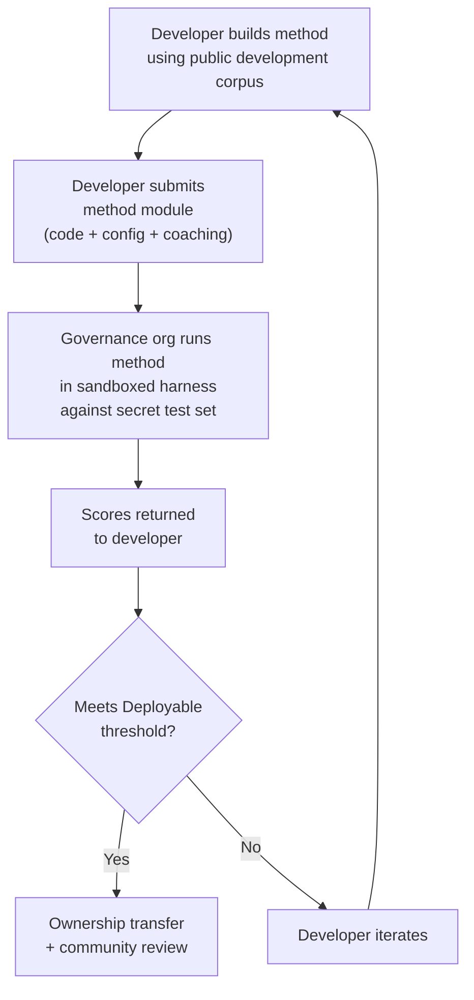

# Benchmark-Spezifikation

> **Zusammenfassung.** Dieses Dokument definiert das Evaluationsprotokoll für das Champollion-MT-Evaluationsökosystem: Korpusformat (§2), Run-Card-Schema (§3), Benchmark-Protokoll (§6), Anforderungen an die menschliche Validierung (§7), Souveränitätsmechanismen (§8), Leaderboard- und Einreichungsmodell (§9), Kostenrahmen (§10) und Erweiterbarkeit auf neue Sprachen (§11). Für Metrikdefinitionen, Gewichtungen des Composite-Scoring, Schwellenwerte der Qualitätsstufen und Formeln für Kosten-/Geschwindigkeitsmetriken siehe `SCORING_SPEC.md` — die einzige verbindliche Quelle für sämtliche Scoring-Logik. Dieses Dokument verweist für diese Details auf SCORING_SPEC, anstatt sie zu duplizieren.
>
> Zuletzt aktualisiert: 2026-06-07

---

## 1. Grundsätze

### 1.1 Automatisierte Metriken sind Näherungswerte

Jede in diesem Dokument definierte Metrik wird maschinell berechnet. chrF++, FST-Akzeptanz, morphologische Genauigkeit, semantische Ähnlichkeit — sie alle sind automatisierte Näherungswerte für die Übersetzungsqualität. Sie sind nützlich für rasche Iteration, systematischen Vergleich und das Erkennen von Regressionen. Sie sind **kein Ersatz für menschliches Urteilsvermögen**.

Die Evaluationshierarchie:

```
Automated metrics (run cards, benchmarks)
    ↓ proxy for
Human review (bilingual speakers validate output)
    ↓ proxy for
Actual utility (does this help a language community?)
```

Kein automatisierter Score, wie hoch er auch sein mag, kann eine fließend sprechende Person ersetzen, die die Ausgabe liest und bestätigt, dass sie korrekt, natürlich und kulturell angemessen ist. Die in §5 definierten Qualitätsstufen sind heuristische Labels für automatisierte Composite-Scores — nützlich, um Fortschritte nachzuverfolgen, aber für sich genommen niemals ausreichend.

### 1.2 Methoden, nicht Modelle

Wir benchmarken **Methoden**, nicht Modelle. Ein Modell ist eine Komponente. Eine Methode ist das vollständige Rezept: Modellauswahl, Prompt-Design, Tool-Nutzung, Vor-/Nachverarbeitung, Coaching-Daten, Wiederholungsstrategien, alles. Zwei Teams, die dasselbe Modell mit unterschiedlichen Methoden verwenden, erzielen unterschiedliche Scores. Genau darum geht es.

### 1.3 Reproduzierbarkeit

Jedes Benchmark-Ergebnis muss reproduzierbar sein. Die Run Card (§3) erfasst die vollständige Konfiguration eines Experiments. Der Fingerprint (§3.5) identifiziert den experimentellen Aufbau. Der Run-Card-Hash (§3.6) verifiziert die Integrität des Ergebnisses. Jede Person mit derselben Methode, demselben Korpus und derselben Konfiguration sollte Scores innerhalb von ±2 % erzielen (unter Berücksichtigung der Nichtdeterminismus beim LLM-Sampling bei einer Temperatur > 0).

### 1.4 Keine synthetischen Evaluationsdaten

**Dieses Projekt erzeugt, verwendet oder befürwortet keine synthetischen Evaluationsdaten.** Alle Korpora müssen aus echtem, von Menschen verfasstem Text stammen — veröffentlichte Übersetzungen, Lehrbücher, zweisprachige Dokumente oder von fließend sprechenden Personen elizitierte Übersetzungen.

LLMs dürfen unterstützen bei:
- Satzalignment (Auffinden paralleler Passagen in bestehenden zweisprachigen Texten)
- Formatkonvertierung (Umwandlung veröffentlichter Materialien in das Korpusschema)
- Metadaten-Anreicherung (Vorschläge für Schwierigkeitsstufen, Register-Labels)
- Vorschlagen von Quellsätzen für die menschliche Übersetzung (§11.3 — der Übersetzungsschritt erfolgt stets durch Menschen)

LLMs dürfen **niemals** Referenzübersetzungen oder Evaluationspaare erzeugen.

**Wir sind hinsichtlich der Trainingsdaten entwicklungsneutral.** Wenn eine Methodenentwicklerin oder ein Methodenentwickler synthetische Trainingsdaten, Rückübersetzung oder Datenaugmentierung in der eigenen Methode verwendet, ist das deren Entscheidung — wir evaluieren die Ausgabe, nicht den Trainingsprozess. Metas OMT-1600 verwendet etwa 270 Millionen synthetische parallele Sätze, die durch Rückübersetzung erzeugt wurden. Wir haben keine Einwände gegen so trainierte Methoden. Wir testen ausschließlich auf menschlicher Kuratierung.

> **Warum kein Bibeltext für die Evaluation?** OMT-1600 evaluiert 1.560 von 1.600 Sprachen anhand von Texten aus der Bibel-Domäne. Bibelübersetzungen weisen ein archaisches Register, liturgisches Vokabular und eine formelhafte Satzstruktur auf. Unsere Evaluationskorpora stammen aus von der Community kuratiertem, domänenvielfältigem Text — Gesundheit, Recht, Bildung, Verwaltung, Konversation und Technik (siehe §2.7). Dies ist eine bewusste Designentscheidung. Communities benötigen Übersetzungen für die Domänen, in denen sie tatsächlich leben und arbeiten, nicht ein einziges religiöses Register. Eine Methode, die bei Genesis 1:1 gut abschneidet, sagt nahezu nichts über ihre Leistung bei der Tagesordnung eines Bandrats oder einem Aufnahmeformular einer Klinik aus.

---

## 2. Korpusschema

Ein Korpus ist eine kuratierte Sammlung paralleler Textpaare mit strukturierten Metadaten. Es ist die Ground Truth, an der alle Methoden gemessen werden.

### 2.1 Datensatz-Hülle

Die oberste Struktur einer Korpusdatei:

```json
{
  "dataset": {
    "id": "edtekla-dev-v1",
    "version": "1.0",
    "language_pair": "EN→CRK",
    "source_language": "en",
    "target_language": "crk",
    "created": "2026-05-01",
    "license": "CC-BY-NC-SA-4.0",
    "provenance": ["gold_standard", "textbook"]
  },
  "entries": [ ... ]
}
```

| Feld | Typ | Erforderlich | Beschreibung |
|-------|------|----------|-------------|
| `id` | string | ✅ | Eindeutige Datensatzkennung, verwendet in Run Cards und Leaderboard |
| `version` | string | ✅ | Semantische Version. Eine Erhöhung macht vorherige Run-Card-Vergleiche ungültig |
| `language_pair` | string | ✅ | Anzeigelabel (z. B. `EN→CRK`) |
| `source_language` | string | ✅ | BCP-47-Quellsprachcode |
| `target_language` | string | ✅ | BCP-47-Zielsprachcode |
| `created` | string | ✅ | ISO-8601-Erstellungsdatum |
| `license` | string | ✅ | SPDX-Lizenzkennung |
| `provenance` | string[] | ✅ | Liste der über alle Einträge hinweg verwendeten Provenienz-Tags |

### 2.2 Eintragsschema

Jeder Eintrag im Korpus repräsentiert eine Übersetzungsaufgabe:

```json
{
  "id": 42,
  "source": "I see the dog",
  "reference": "niwâpamâw atim",
  "segment": "gold_standard",
  "difficulty": 2,
  "provenance": "gold_standard",
  "register": "conversational",
  "context": "declaration",
  "morphological_analysis": "ni-wâpam-âw atim | 1sg-see.TA-3sg.DIR dog.AN",
  "notes": "Animate noun (atim); direct form because speaker is proximate",
  "variant_class": "simple-ta-direct"
}
```

| Feld | Typ | Erforderlich | Beschreibung |
|-------|------|----------|-------------|
| `id` | integer | ✅ | Eindeutige Kennung innerhalb des Korpus |
| `source` | string | ✅ | Quelltext in der Quellsprache |
| `reference` | string | ✅ | Goldstandard-Referenzübersetzung in der Zielsprache |
| `segment` | string | 📎 | Korpuspartition: `gold_standard`, `held_out`, `development` oder `diagnostic` |
| `difficulty` | integer | 📎 | Schwierigkeitsbewertung 1–5 (siehe §2.4) |
| `provenance` | string | 📎 | Herkunft dieses Eintrags (siehe §2.5) |
| `register` | string | 📎 | Register-/Formalitätsstufe (siehe §2.6) |
| `context` | string | 📎 | Kommunikative Funktion (siehe §2.6) |
| `domain` | string | 📎 | Anwendungsdomäne aus der 16-Code-Taxonomie (siehe §2.7). Muss eine der folgenden sein: `conv`, `ecommerce`, `edu`, `financial`, `gov`, `legal`, `literary`, `marketing`, `medical`, `news`, `religious`, `scientific`, `subtitles`, `support`, `tech`, `ui`. Wird zum Erstellungszeitpunkt validiert. |

> **📎 = EMPFOHLEN.** Der Harness behandelt fehlende optionale Felder problemlos über Standardwerte. Korpora von Drittanbietern müssen pro Eintrag lediglich `id`, `source` und `reference` bereitstellen.
| `morphological_analysis` | string | ❌ | Goldstandard-morphologische Aufschlüsselung |
| `notes` | string | ❌ | Übersetzungsanmerkungen, dialektale Varianten, Ambiguitätskennzeichnungen |
| `variant_class` | string | ❌ | Klassenlabel, das akzeptable Übersetzungsvarianten gruppiert |


### 2.3 Korpussegmente

Das Korpus ist in Segmente mit unterschiedlichen Zugriffsebenen unterteilt:

| Segment | Zweck | Zugriff | Mindestgröße |
|---------|---------|--------|-------------|
| `development` | Methodenentwicklung und Iteration. Entwicklerinnen und Entwickler nutzen diese frei. | **Öffentlich** | 30 Einträge |
| `diagnostic` | Gezielte Tests für spezifische linguistische Phänomene. | **Öffentlich** | 10 Einträge |
| `gold_standard` | Offizielle Benchmark-Evaluation. Leaderboard-Scores stammen von hier. | **Geheim** — gehalten durch Governance-Organisation | 50 Einträge |
| `held_out` | Reserviert für zukünftige Evaluation. Wird erst bei Aktivierung verwendet. | **Geheim** — gehalten durch Governance-Organisation | 10 Einträge |

> **Aktueller Stand:** In ausgelieferten Datensätzen existiert nur das Segment `development`. Die Segmente `diagnostic`, `gold_standard` und `held_out` sind für die zukünftige Verwendung definiert, sobald die Korpora wachsen.

Die Segmente `gold_standard` und `held_out` sind vollständig geheim. Sowohl die Quellsätze als auch die Referenzübersetzungen werden auf von der Governance kontrollierter Infrastruktur gehalten. Methodenentwicklerinnen und -entwickler sehen weder die Fragen noch die Antworten. Siehe §8 für den Souveränitätsmechanismus.

### 2.4 Schwierigkeitsstufen

| Stufe | Beschreibung | Beispiele |
|------|-------------|----------|
| 1 — Grundwortschatz | Einzelne Wörter, gängige Grußformeln, Zahlen | „hello" → „tânisi", „dog" → „atim" |
| 2 — Einfache Sätze | Subjekt-Verb oder SVO, Präsens | „I see the dog" → „niwâpamâw atim" |
| 3 — Mittlere Komplexität | Vergangenheit/Zukunft, Possessive, Belebtheit | „I saw his dog yesterday" |
| 4 — Komplexe Morphologie | Obviation, Passiv, Konjunktordnung, Relativsätze | „the woman whose son went to the store" |
| 5 — Fortgeschritten | Mehrsatzig, formales Register, zeremoniell, idiomatisch | Vollständiger Absatz mit registergerechtem Ton |

Ein gut konstruiertes Korpus sollte Einträge über alle fünf Schwierigkeitsstufen hinweg enthalten, gewichtet zugunsten der Stufen 2–4, in denen die meisten realen Übersetzungsaufgaben anfallen.

### 2.5 Provenienz-Tags

Jeder Eintrag muss seine Herkunft angeben:

| Tag | Bedeutung |
|-----|---------|
| `gold_standard` | Von fließend sprechenden Personen verifiziert |
| `textbook` | Aus veröffentlichten Bildungsmaterialien |
| `elicited` | Durch strukturierte Elizitationssitzungen erzeugt |
| `corpus` | Aus einem Parallelkorpus extrahiert |

> **Hinweis:** In der Praxis sind Provenienzwerte freie Zeichenketten. Die obigen Tags sind Konventionen, kein validiertes Enum — Datensätze können andere beschreibende Provenienz-Zeichenketten verwenden.

### 2.6 Register und Kontext

**Register** beschreibt die Formalität und den sozialen Kontext:

| Register | Beschreibung |
|----------|-------------|
| `conversational` | Alltagssprache zwischen Gleichgestellten |
| `formal` | Offizielle oder institutionelle Sprache |
| `technical` | Domänenspezifisches Vokabular |
| `ceremonial` | Traditioneller oder sakraler Sprachgebrauch |
| `educational` | Sprachlehrmaterialien |

**Kontext** beschreibt die kommunikative Funktion:

> 🔲 **Geplant.** Das Feld `context` ist im Schema definiert, aber in aktuellen Datensätzen noch nicht befüllt. Es ist für die zukünftige Korpusanreicherung reserviert.

| Kontext | Beschreibung |
|---------|-------------|
| `greeting` | Soziale Begrüßung oder Verabschiedung |
| `declaration` | Tatsachenfeststellung |
| `question` | Frage |
| `instruction` | Befehl oder Anweisung |
| `narrative` | Erzählung oder Beschreibung |
| `label` | UI-Label, Schaltflächentext oder Überschrift |
| `error` | Fehlermeldung oder Warnung |

### 2.7 Domäne {#27-domain}

**Domäne** beschreibt den realen Anwendungsfall — die Art des zu übersetzenden Inhalts. Dies ist orthogonal zu Register und Kontext:

- **Register** beantwortet: *Wie formal ist dies?*
- **Kontext** beantwortet: *Was tut dieser Satz?*
- **Domäne** beantwortet: *Für welche Branche/welchen Anwendungsfall ist dies?*

Ein Rechtsvertrag (Domäne: `legal`) könnte formal sein (Register: `formal`) und eine Erklärung enthalten (Kontext: `declaration`). Ein Transkript eines juristischen Chatbots (Domäne: `legal`) könnte konversationell sein (Register: `conversational`) und Fragen enthalten (Kontext: `question`). Dieselbe Domäne, anderes Register und anderer Kontext.

| Domänencode | Beschreibung | Typische Nutzer |
|-------------|-------------|-------------------|
| `ui` | Zeichenketten für Softwareoberflächen | App-Entwickler, Lokalisierungsteams |
| `legal` | Verträge, Gesetze, Gerichtseingaben, Einwanderungsdokumente | Anwaltskanzleien, Gerichte, Compliance-Teams, IP-Anwälte |
| `medical` | Klinische Notizen, Arzneimitteletiketten, Patientenkommunikation, Studienprotokolle | Krankenhäuser, Pharmaunternehmen, klinische Studien, Patientenportale |
| `financial` | Bankwesen, Versicherungen, behördliche Einreichungen, Prüfberichte | Banken, Versicherer, Regulierungsbehörden, Prüfer |
| `edu` | Lehrbücher, Lehrpläne, Unterrichtsentwürfe, akademische Materialien | Schulen, Universitäten, Lehrbuchverlage |
| `ecommerce` | Produktbeschreibungen, Bewertungen, Marktplatzangebote | Online-Händler, Marktplatzverkäufer |
| `marketing` | Werbetexte, Markenbotschaften, Kampagnen, Slogans | Werbeagenturen, Markenteams |
| `gov` | Richtliniendokumente, Verordnungen, öffentliche Bekanntmachungen, Gesetzgebung | Behörden, Compliance-Teams |
| `scientific` | Forschungsarbeiten, Abstracts, Methodik, Förderanträge | Forscher, Fachzeitschriften, Förderagenturen |
| `religious` | Heilige Schriften, liturgische Texte, theologische Kommentare | Glaubensgemeinschaften, liturgische Verlage |
| `support` | FAQs, Fehlermeldungen, Anleitungen zur Fehlerbehebung, Chatbot-Skripte | SaaS-Unternehmen, Helpdesks |
| `subtitles` | Dialoge in Film, Fernsehen, Streaming und Gaming | Streaming-Plattformen, Studios, Gaming-Unternehmen |
| `news` | Journalismus, Agenturmeldungen, Leitartikel, Pressemitteilungen | Medienorganisationen, Nachrichtenagenturen |
| `literary` | Belletristik, Lyrik, Erzählungen, kulturelle Texte | Verlage, Organisationen zum Kulturerhalt |
| `conv` | Informelle Konversation, soziale Medien, Messaging | Verbraucher-Apps, soziale Plattformen |
| `tech` | API-Dokumentationen, Handbücher, technische Spezifikationen, technische Leitfäden | Dokumentationsteams, Engineering-Organisationen |

> **Domänenspezifische Benchmarks.** Der allgemeine Benchmark evaluiert eine Methode über alle Domänen hinweg. Die Arena unterstützt jedoch auch **domänengefilterte Benchmarks** — bei denen Scores nur für Einträge berechnet werden, die mit einer bestimmten Domäne getaggt sind. Damit können Nutzer die Frage beantworten: „Welche Methode eignet sich am besten für die Übersetzung von Rechtsdokumenten ins Französische?" im Vergleich zu „Welche Methode hat den besten Gesamtscore für Französisch?"
>
> Domänengefilterte Leaderboard-Rankings sind ein zentrales Produktmerkmal. Verschiedene Methoden schneiden je nach Domäne unterschiedlich ab — eine auf juristische Terminologie feinabgestimmte Methode mag bei juristischen Benchmarks brillieren, bei konversationellem Text jedoch schwächeln. Die Arena hilft Nutzern, die Lösung zu finden, die für ihren spezifischen Anwendungsfall am besten geeignet ist.

> **Zukunft: Arena Chatbot.** Die Arena-Website wird einen konversationellen Assistenten enthalten, der Nutzern hilft, ihren MT-Anwendungsfall zu beschreiben (Domäne, Sprachpaar, Qualitätsanforderungen), und die beste von der Community validierte Methode aus dem Leaderboard empfiehlt. Zum Beispiel: „Ich muss Protokolle klinischer Studien von Englisch nach Japanisch übersetzen — welche Methode erzielt die höchsten Scores bei medizinischen EN→JA-Benchmarks?" Dies setzt voraus, dass ausreichend domänengetaggte Evaluationsdaten und Methodenvielfalt vorhanden sind.

---

## 3. Run-Card-Schema {#3-run-card-schema}

Die Run Card ist die atomare Einheit der Evaluation. Es handelt sich um ein in sich geschlossenes JSON-Dokument, das die vollständige Konfiguration und die Ergebnisse eines einzelnen Evaluationslaufs erfasst: eine Methode, ein Modell, eine Konfiguration, ein Datensatz.

Jede Run Card erfasst drei Dimensionen:
- **Qualität** — wie gut sind die Übersetzungen?
- **Kosten** — wie viel hat ihre Erstellung gekostet?
- **Geschwindigkeit** — wie lange hat es gedauert?

### 3.1 Felder der obersten Ebene

| Feld | Typ | Beschreibung |
|-------|------|-------------|
| `run_id` | string | UUID v4, generiert zu Beginn des Laufs |
| `harness_version` | string | Semantische Version des Harness (z. B. `2.0`) |
| `timestamp` | string | ISO-8601-UTC-Zeitstempel zum Startzeitpunkt des Laufs |
| `elapsed_seconds` | number | Echtzeitdauer des gesamten Laufs |

### 3.2 Methodenkonfiguration

Diese Felder definieren den experimentellen Aufbau — was getestet wurde und wie.

| Feld | Typ | Erforderlich | Beschreibung |
|-------|------|----------|-------------|
| `model_slug` | string | ✅ | Modellkennung (z. B. `google/gemini-2.5-flash`) |
| `model_id` | string | ❌ | Von der API zurückgegebene aufgelöste Modellkennung |
| `condition` | string | ✅ | Experiment-Label (z. B. `baseline`, `coached-v3`, `few-shot`) |
| `temperature` | number | ✅ | Sampling-Temperatur |
| `system_prompt_sha256` | string | ✅ | SHA-256-Hash des vollständigen System-Prompts |
| `system_prompt_used` | string | ✅ | Der vollständige System-Prompt-Text |
| `coaching_data_sha256` | string | ❌ | SHA-256-Hash der Coaching-Datendatei, falls verwendet |
| `fst_version` | string | ❌ | Version des FST-Analyzers, falls verwendet |
| `tools_enabled` | string[] | ❌ | Liste der für die Methode verfügbaren Tools |
| `batch_size` | number | ❌ | Einträge pro gleichzeitigem API-Batch |
| `max_retries` | number | ❌ | Maximale Wiederholungen bei FST-Ablehnung, falls zutreffend |

:::info Veröffentlichte Run Cards enthalten method_config
Wenn eine Run Card im Leaderboard veröffentlicht wird (über `mt-eval publish`), enthält sie außerdem einen `method_config`-Block mit der kanonischen 8-Feld-MethodConfig (`model`, `temperature`, `batchSize`, `register`, `coachingFile`, `coachingPrompt`, `promptContext`, `qualityTier` — alle in camelCase). Dies ermöglicht den Import ohne Rekonstruktion: `champollion leaderboard --install` liest `method_config` direkt und schreibt es als Plugin-Manifest. Die obigen Telemetriefelder (§3.2) erfassen, was der Harness beobachtet hat; `method_config` erfasst, was die Entwicklerin oder der Entwickler beabsichtigt hat.
:::

### 3.3 Datensatzreferenz

| Feld | Typ | Beschreibung |
|-------|------|-------------|
| `dataset.id` | string | Datensatzkennung |
| `dataset.version` | string | Datensatzversion |
| `dataset.language_pair` | string | Anzeigelabel |
| `dataset.sha256` | string | SHA-256-Hash des Datensatzdateiinhalts |
| `dataset.entry_count` | number | Anzahl der evaluierten Einträge |

Der SHA-256 des Datensatzes verankert das Ergebnis an einer bestimmten Version der Daten. Ändert sich der Datensatz, sind alte Run Cards nicht vergleichbar.

### 3.4 Scores (Qualität)

Aggregierte Metriken für den gesamten Lauf. Alle Qualitätsmetriken sind **automatisiert** — siehe §1.1.

| Feld | Typ | Beschreibung |
|-------|------|-------------|
| `scores.total` | number | Insgesamt evaluierte Einträge |
| `scores.exact_matches` | number | Einträge, bei denen die Ausgabe exakt mit der Referenz übereinstimmte |
| `scores.exact_match_rate` | number | 0.0–1.0 |
| `scores.equivalent_matches` | number | Einträge, die mit einer akzeptablen Variante übereinstimmen |
| `scores.equivalent_match_rate` | number | 0.0–1.0 |
| `scores.fst_accepted` | number | Vom FST-Analyzer akzeptierte Einträge |
| `scores.fst_acceptance_rate` | number | 0.0–1.0, `null` falls kein FST konfiguriert |
| `scores.morphological_accuracy` | number | 0.0–1.0, `null` falls keine Goldstandard-Analyse vorhanden |
| `scores.chrf_plus_plus` | number | chrF++-Score auf Korpusebene (0–100) |
| `scores.semantic_score` | number | Embedding-basierte semantische Ähnlichkeit (0.0–1.0) |
| `scores.ter` | number | Translation Edit Rate (0–∞, niedriger ist besser) |
| `scores.length_ratio` | number | avg(len(predicted)/len(reference)), ideal = 1.0 |
| `scores.code_switching_rate` | number | 0.0–1.0, Anteil der Einträge mit Quellsprach-Leckage |
| `scores.hallucination_rate` | number | 0.0–1.0, Anteil der Einträge mit halluziniertem Inhalt |
| `scores.terminology_adherence` | number | 0.0–1.0, Einhaltung von Glossarbegriffen (`null` falls kein Glossar) |
| `scores.tokens_per_second` | number | total_tokens / elapsed_seconds |
| `scores.entries_per_minute` | number | übersetzte Einträge pro Minute |
| `scores.composite` | number | Gewichteter Composite-Score (0.0–1.0). Siehe SCORING_SPEC §4 |
| `scores.errors` | number | Einträge, die fehlgeschlagen sind (API-Fehler, Timeout usw.) |
| `scores.by_difficulty` | object | Nach Schwierigkeitsstufe aufgeschlüsselte Scores |
| `scores.by_provenance` | object | Nach Provenienz-Tag aufgeschlüsselte Scores |
| `scores.by_domain` | object | ✅ Implementiert — Nach Domäne aufgeschlüsselte Scores (§2.7). Ermöglicht domänengefiltertes Leaderboard-Ranking. Wird von tester.py berechnet und über publish.py durchgereicht. |

### 3.5 Summen (Kosten)

| Feld | Typ | Beschreibung |
|-------|------|-------------|
| `totals.prompt_tokens` | number | Gesamte Eingabe-Tokens über alle API-Aufrufe |
| `totals.completion_tokens` | number | Gesamte Ausgabe-Tokens |
| `totals.reasoning_tokens` | number | Für Chain-of-Thought verwendete Tokens (0 für die meisten Modelle) |
| `totals.cached_tokens` | number | Aus dem Prompt-Cache des Anbieters bereitgestellte Tokens |
| `totals.total_cost_usd` | number | Gesamtkosten in USD |
| `totals.cost_per_entry_usd` | number | `total_cost_usd / entry_count` |
| `totals.cost_per_source_char` | number | USD pro Quellzeichen — über Sprachen hinweg vergleichbar |

### 3.6 Zeitmessung (Geschwindigkeit)

| Feld | Typ | Beschreibung |
|-------|------|-------------|
| `elapsed_seconds` | number | Echtzeitdauer des gesamten Laufs (oberste Ebene) |
| `scores.avg_latency_seconds` | number | Mittlere Antwortzeit pro Eintrag |
| `scores.median_latency_seconds` | number | Median der Antwortzeit pro Eintrag |
| `scores.p95_latency_seconds` | number | 95. Perzentil der Antwortzeit pro Eintrag |

### 3.7 Ergebnisse pro Eintrag

Jeder Eintrag im `results[]`-Array erfasst eine Übersetzung. Daten pro Eintrag werden in der Tabelle `run_card_entries` (Migration 005) mit denormalisierten LYSS-Verdikten (Migration 006) persistiert.

| Feld | Typ | Beschreibung |
|-------|------|-------------|
| `entry_id` | string | Entspricht `entries[].id` im Korpus |
| `source` | string | Übersetzter Quelltext |
| `expected` | string | Goldstandard-Referenzübersetzung |
| `raw_predicted` | string \| null | Rohe Modellausgabe vor der Nachverarbeitung |
| `predicted` | string | Tatsächliche Ausgabe der Methode (nachverarbeitet) |
| `segment` | string | Segmentkennung (z. B. Satzindex) |
| `difficulty` | string \| null | Schwierigkeitsstufe aus dem Korpus |
| `domain` | string | Domänen-Tag aus dem Korpus (§2.7) |
| `exact_match` | boolean | Ob die Ausgabe exakt mit der Referenz übereinstimmte |
| `chrf_score` | number \| null | chrF++ auf Satzebene (0–100) |
| `bleu_score` | number \| null | BLEU auf Satzebene (0–100) |
| `latency_s` | number \| null | Antwortzeit in Sekunden |
| `cost_usd` | number \| null | Kosten in USD für diesen Eintrag |
| `tool_call_count` | integer | Anzahl verwendeter Tool-Aufrufe (0 falls keine) |
| `error` | string \| null | Fehlermeldung, falls dieser Eintrag fehlgeschlagen ist |
| `plugin_metrics` | object | Vollständige Plugin-Ausgabe pro Eintrag (JSONB) |
| `fst_valid` | boolean \| null | GiellaLT-FST hat die Vorhersage akzeptiert (denormalisiert LYSS-fst) |
| `equivalent_match` | boolean \| null | CRK-Linter hat strukturelle Äquivalenz bestätigt (denormalisiert LYSS-eq) |
| `semantic_verdict` | string \| null | LYSS-sem-Verdikt: `VALID`, `MISMATCH`, `UNKNOWN`, `ERROR` |
| `code_switching_detected` | boolean \| null | Quellsprach-Tokens in der Ausgabe erkannt |
| `hallucination_detected` | boolean \| null | Fabrizierter Inhalt in der Ausgabe erkannt |


### 3.8 Fingerprint

Eine Reproduzierbarkeitskennung. Zwei Läufe mit identischen Fingerprints verwendeten denselben experimentellen Aufbau.

Der Fingerprint ist der SHA-256-Hash der sortierten Verkettung von:
- `dataset.sha256`
- `model_slug`
- `condition`
- `system_prompt_sha256`
- `temperature`
- `harness_version`
- `batch_size`
- `tools_enabled`

> **Warum 8 Komponenten?** Batch-Größe und Tool-Calling beeinflussen die Ausgabequalität materiell und müssen in die Identität einbezogen werden. Zwei Läufe mit unterschiedlichen Batch-Größen oder unterschiedlich aktivierten Tools sind unterschiedliche experimentelle Aufbauten, selbst wenn alle anderen Parameter übereinstimmen.

Zwei Läufe mit identischen Fingerprints sollten vergleichbare Ergebnisse liefern. Unterschiede sind auf API-Nichtdeterminismus (Temperatur > 0) oder anbieterseitige Modellaktualisierungen zurückzuführen.

### 3.9 Run-Card-Hash

Der SHA-256-Hash der gesamten Run-Card-JSON (wobei das Feld `run_card_hash` selbst während des Hashings auf `""` gesetzt wird). Dies ist das Manipulationserkennungssiegel. Ändert sich ein Feld, bricht der Hash.

---

## 4. Automatisierte Metriken

Alle Metriken in diesem Abschnitt werden maschinell berechnet. Siehe §1.1.

### 4.1 Metrikdefinitionen

| Metrik | Status | Was sie misst | Bereich |
|--------|--------|-----------------|-------|
| **chrF++** | ✅ Implementiert | Zeichen-N-Gramm-F-Score. Arbeitet auf Zeichenebene und ist dadurch robuster als wortbasierte Metriken (BLEU) für morphologisch reiche Sprachen, in denen Wörter lang und stark flektiert sind. Berechnet durch sacrebleu. | 0–100 (native Skala). Im Composite durch 100 geteilt. |
| **FST-Akzeptanzrate** | ✅ Implementiert | Anteil der vorhergesagten Wörter, die vom morphologischen Analyzer (GiellaLT HFST) als gültige Formen in der Zielsprache akzeptiert werden. Ein vom FST akzeptiertes Wort ist ein echtes, strukturell gültiges Wort — keine Halluzination. | 0.0–1.0 |
| **Exact match** | ✅ Implementiert | Anteil der Vorhersagen, die nach der Unicode-Normalisierung exakt mit der Referenz übereinstimmen. Streng, aber eindeutig — nützlich als Obergrenzenprüfung. | 0.0–1.0 |
| **Morphologische Genauigkeit** | 🔲 Geplant | Für Einträge mit Goldstandard-morphologischer Analyse: Anteil der korrekt generierten Morpheme. Granularer als die FST-Akzeptanz — ein Wort kann FST-gültig sein, aber die falsche Morphemstruktur aufweisen (richtige Wurzel, falsches Tempus). | 0.0–1.0 |
| **Equivalent match** | ⚡ Teilweise | Anteil, der mit einer akzeptablen Variante der Referenz übereinstimmt — unter Berücksichtigung von Wortstellung, dialektalen Unterschieden und orthografischen Konventionen. Derzeit für CRK über den `CrkLinterMetric` des CRK-Eval-Standards implementiert (in `eval_standards/crk/`); automatisch geladen über die `evalMetrics`-Deklaration der CRK-Sprachkarte. Eine generische Implementierung erfordert `variants[]` pro Eintrag im Korpus. | 0.0–1.0 |
| **Semantischer Score** | ⚡ Teilweise | Bedeutungserhaltung unabhängig von der Oberflächenform. Derzeit für CRK über den `CrkSemanticMetric` des CRK-Eval-Standards implementiert (in `eval_standards/crk/`, verdiktgewichteter Näherungswert). Universelle Embedding-basierte Kosinus-Ähnlichkeit ist geplant — siehe SCORING_SPEC §2.3. | 0.0–1.0 |

### 4.2 Composite-Score

Der Composite-Score ist ein gewichteter Durchschnitt aller *verfügbaren* Metriken:

```
composite = Σ (weight_i × metric_i)   for all available metrics
             ─────────────────────
             Σ weight_i              (renormalized to sum to 1.0)
```

Wenn eine Metrik nicht verfügbar ist (kein FST konfiguriert, keine Variantenklassen definiert, kein Embedding-Modell), wird ihr Gewicht proportional auf die verbleibenden Metriken umverteilt. Das bedeutet, dass der Composite innerhalb einer Sprache stets vergleichbar ist — er verwendet die für diese Sprache verfügbaren Metriken und normalisiert entsprechend.

**Gewichtungstabellen, Regeln zur Eingabenormalisierung und das vollständige Metrikinventar sind in `SCORING_SPEC.md` §4 definiert.** Dieses Dokument ist die SSOT für:
- Profil-A-Gewichtungen (Sprachen mit FST-Abdeckung — 9 Metriken, strukturelle Metriken tragen 40 %)
- Profil-B-Gewichtungen (Sprachen ohne FST-Abdeckung — 8 Metriken)
- Normalisierungsregeln (chrF++ ÷ 100, Inversion von Code-Switching- und Halluzinationsrate)
- Aus dem Composite ausgeschlossene Metriken (BLEU, COMET, TER, Längenverhältnis, Konsistenz) und warum

Der Harness-Code spiegelt diese Tabellen in `mt_eval_harness/scoring.py` wider. Wenn sich SCORING_SPEC ändert, wird `scoring.py` entsprechend aktualisiert, und `test_scoring_ssot.py` validiert die Übereinstimmung.

> **Warum nicht BLEU?** BLEU arbeitet auf Wortebene und bestraft morphologische Variation. Für polysynthetische Sprachen kann ein einziges Wort eine ganze Klausel sein — BLEU würde geringfügige Flexionsunterschiede als vollständige Fehlschläge behandeln. chrF++ bewältigt dies besser, indem es auf Zeichenebene arbeitet. BLEU ist aus beiden Gewichtungstabellen ausgeschlossen. Siehe SCORING_SPEC Anhang A für die vollständige Begründung.


### 4.3 Kostenbereinigter Score

Für Methoden, die kostenpflichtige APIs verwenden, melden wir außerdem ein sekundäres Ranking. Die kostenbereinigte Formel ist in `SCORING_SPEC.md` §6.3 definiert.

---

## 5. Qualitätsstufen {#5-quality-tiers}

Qualitätsstufen sind heuristische Labels für automatisierte Composite-Scores. Sie beschreiben, was die Scores in der Praxis tendenziell bedeuten, basierend auf der menschlichen Überprüfung von Ausgaben auf jeder Ebene. **Sie sind keine validierten Qualitätsurteile** — nur die menschliche Überprüfung (§6) kann die tatsächliche Nutzbarkeit bestätigen.

**Die Schwellenwerte und Beschreibungen der Stufen sind in `SCORING_SPEC.md` §5 definiert.** Die Stufen sind: Baseline (0,00–0,30), Emerging (0,30–0,50), Functional (0,50–0,70), Deployable (0,70–0,85) und Fluent (0,85–1,00).

> [!IMPORTANT]
> **Automatisierte Stufen sind vorläufig.** Diese Labels sind Nominierungen zur Überprüfung, keine Qualitätserklärungen. Eine Methode, die bei automatisierten Metriken „Deployable" erreicht, ist ein Kandidat für die Community-Evaluation — kein auslieferungsbereites Produkt. Nur die menschliche Überprüfung (§7) kann die tatsächliche Nutzbarkeit bestätigen. Die Stufengrenzen können sich zwischen Sprachen unterscheiden.

Diese Stufen sind vorläufig. Sie werden neu kalibriert, sobald sich menschliche Validierungsdaten ansammeln und wir erfahren, wo der tatsächliche Schwellenwert „eine sprechende Person findet dies nützlich" für jede Sprache liegt. Die Stufengrenzen können sich zwischen Sprachen unterscheiden.

Keine Methode kann **Deployable** oder höher beanspruchen, ohne dass eine Community-Überprüfung bestätigt, dass zweisprachige Sprecher sich einig sind, dass die Ausgabe nutzbar ist.

---

## 6. Benchmark-Protokoll

Ein **Benchmark** ist die systematische Erzeugung von Run Cards über einen deklarierten Parameterraum hinweg auf einem gegebenen Datensatz. Es ist kein einzelner Lauf — es ist eine strukturierte Untersuchung, wie verschiedene Konfigurationen abschneiden.

### 6.1 Was ein Benchmark produziert

Ein Benchmark produziert eine **Matrix von Run Cards** — eine für jede Kombination von Parameterwerten. Die Matrix ermöglicht einen vielschichtigen Vergleich über:

- **Qualität** — Composite-Score, Aufschlüsselung einzelner Metriken
- **Kosten** — Gesamt- und Pro-Eintrag-Kosten für jede Konfiguration
- **Geschwindigkeit** — Echtzeit und Latenz pro Eintrag

Es gibt keinen einzelnen „Benchmark-Score". Der Benchmark ist die vollständige Matrix. Verschiedene Stakeholder werden sich für unterschiedliche Facetten interessieren: Eine Forscherin optimiert auf den Composite-Score, ein Deployment-Engineer optimiert auf die Kosten pro Eintrag, eine Community überprüft die Qualität.

### 6.2 Parameterraum

Ein Benchmark deklariert, welche Parameter permutiert werden:

| Achse | Typische Werte | Zweck |
|------|---------------|---------|
| `model` | 4–12 Modelle (Frontier + Mittelklasse + Budget) | Wie sehr zählt die Modellfähigkeit? |
| `temperature` | 0.0, 0.3, 0.7 | Hilft oder schadet die Sampling-Zufälligkeit? |
| `prompt_version` | 2–3 Prompt-Strategien | Wie empfindlich ist die Methode gegenüber dem Prompt-Design? |
| `coaching_config` | mit/ohne Coaching-Daten | Verbessert das Einspeisen linguistischen Wissens die Ausgabe? |
| `tool_config` | mit/ohne FST, mit/ohne Wörterbuch | Verbessern linguistische Tools die Ausgabe? |

Der vollständige Permutationsraum:
```
runs = |models| × |temperatures| × |prompts| × |coaching| × |tools|
```

Ein typischer initialer Benchmark: 12 Modelle × 3 Temperaturen × 2 Prompts × 2 Coaching = 144 Läufe.

### 6.3 Baseline- vs. Methodenevaluation

Ein Benchmark dient zwei verschiedenen Zwecken:

**Baselining** — Kartierung der Landschaft mit naiven Ansätzen. „Was können bestehende Modelle für diese Sprache ohne jegliche sprachspezifische Entwicklung leisten?" Dies legt die Messlatte fest. Die Baseline-Matrix sagt Ihnen: welche Modelle am wenigsten halluzinieren, welche Temperaturen die konsistenteste Ausgabe erzeugen, ob Coaching-Daten überhaupt helfen, wo alle Modelle einheitlich versagen (was schwierige linguistische Probleme aufdeckt).

**Methodenevaluation** — Test einer spezifischen, entwickelten Methode. „Schlägt meine FST-gegatete, gecoachte Pipeline die Baselines?" Die Run Card der Methode wird mit der Baseline-Matrix verglichen. Eine Methode ist interessant, wenn sie die beste Baseline übertrifft — wenn die Entwicklung gegenüber naiven Modellaufrufen einen Mehrwert schafft.

Beide Aktivitäten produzieren Run Cards mit demselben Schema. Der Unterschied liegt in der Absicht und im Parameterraum: Baselines permutieren über Modelle und Konfigurationen; die Methodenevaluation testet eine Methode gegen die besten Konfigurationen.

### 6.4 Dev- vs. Goldstandard-Evaluation

Methodenentwicklerinnen und -entwickler iterieren frei gegen die Korpussegmente `development` und `diagnostic`. Dies ist informell — keine Limits, keine Einreichungen, keine Beteiligung der Governance. Die entwickelnde Person lernt, was funktioniert.

Offizielle Leaderboard-Scores stammen ausschließlich aus der `gold_standard`-Evaluation. Dies ist formal:
1. Entwicklerin oder Entwickler reicht die vollständige, lauffähige Methode ein (Code + Konfiguration + Coaching-Daten)
2. Die Governance-Organisation führt sie in einem isolierten Harness gegen den geheimen Testsatz aus
3. Nur die Scores kommen zurück

Siehe §8 für den vollständigen Souveränitätsmechanismus.

---

## 7. Menschliche Validierung {#7-human-validation}

Automatisierte Metriken sind Näherungswerte. Die menschliche Validierung ist die Ground Truth.

### 7.1 Was die menschliche Überprüfung erkennt, was Metriken übersehen

- **Morphologisch gültig, aber semantisch falsch** — das FST akzeptiert das Wort, chrF++ ist hoch, aber die Übersetzung bedeutet etwas anderes
- **Kulturell unangemessen** — die Übersetzung ist technisch korrekt, verwendet aber ein Register oder eine Rahmung, die eine Community ablehnen würde
- **Halluzinierte Plausibilität** — die Ausgabe sieht für eine nicht sprechende Person wie die Zielsprache aus, ist aber für eine fließend sprechende Person Kauderwelsch
- **Akzeptable, aber nicht markierte Variation** — die Ausgabe ist korrekt, aber die automatisierten Metriken markieren sie als falsch, weil sie eine dialektale Variante verwendet, die nicht in der Referenz enthalten ist

### 7.2 Das Validierungsgate

Keine Methode kann von der Stufe **Functional** zur Stufe **Deployable** aufsteigen, ohne dass eine menschliche Validierung bestätigt, dass zweisprachige Sprecher sich einig sind, dass die Ausgabe nutzbar ist. Dies ist keine Formalität — es ist der Kern der Sache. Die automatisierten Metriken existieren, um das Volumen der Ausgabe zu reduzieren, das einer menschlichen Überprüfung bedarf. Sie können sie nicht ersetzen.

### 7.3 Community-Überprüfungsprotokoll

> 🔲 **Geplant**: Die Schnittstelle für die Community-Überprüfung ist noch nicht live. Dieser Abschnitt beschreibt den vorgesehenen Prozess.

1. Eine Methode erreicht den Deployable-Schwellenwert bei automatisierten Metriken
2. Eine Stichprobe von Ausgaben (geschichtet nach Schwierigkeitsstufe) wird zweisprachigen Sprechern vorgelegt
3. Sprecher bewerten jede Übersetzung auf einer Skala: **reject**, **gist** (Bedeutung ist klar, aber die Formulierung ist falsch), **acceptable** (korrekt mit geringfügigen Problemen), **excellent** (von einer menschlichen Übersetzung nicht zu unterscheiden)
4. Die Governance-Organisation überprüft die aggregierten Bewertungen
5. Wenn die Community die Methode akzeptiert, geht sie zur Eigentumsübertragung und zum Deployment über

---

## 8. Souveränität

Evaluationsdatensätze enthalten kuratiertes linguistisches Wissen, das der Sprachgemeinschaft gehört. Dieser Abschnitt definiert den technischen und rechtlichen Rahmen zum Schutz dieser Daten.

### 8.1 Das Problem

Konventionelle Benchmarks veröffentlichen Testsätze offen. Einmal veröffentlicht, können die Daten nicht mehr unveröffentlicht werden. Für indigene und Minderheitensprachgemeinschaften schafft dies eine extraktive Dynamik — linguistische Daten werden ohne fortlaufende Zustimmung verwendet. In Anlehnung an Dheins pragmatische Sichtweise auf die Souveränität von Biodaten behandeln wir linguistische Daten als „mercurial resource with unknowable potential", die eine dynamische, relationale Governance erfordert.

### 8.2 Isolierte Ausführung

Der primäre Durchsetzungsmechanismus: Die entwickelnde Person übergibt ihr Methodenmodul, die Governance-Organisation führt es gegen den vollständig geheimen Testsatz auf ihrer eigenen Infrastruktur aus, und nur die Scores werden zurückgegeben. Die entwickelnde Person sieht weder die Quellsätze noch die Referenzübersetzungen.



Der Ablauf:
1. **Das Entwicklungskorpus ist öffentlich.** Keine Einschränkungen für die Segmente `development` und `diagnostic`.
2. **Der Goldstandard-Testsatz ist vollständig geheim.** Sowohl Quellsätze als auch Referenzübersetzungen liegen auf von der Governance kontrollierter Infrastruktur.
3. **Um einen offiziellen Score zu erhalten, übergeben Sie Ihre Methode.** Die Governance-Organisation führt sie in einer Sandbox aus. Nur die Scores kommen zurück.
4. **Die Governance-Organisation verfügt bereits über die Methode.** Die Einreichung IST der Methodencode. Erreicht sie den Deployable-Schwellenwert, ist die Eigentumsübertragung bereits im Gange.
5. **Die Einreichung erfordert die Zustimmung zu den Bedingungen.** Einschließlich der Klausel zur Eigentumsübertragung (§8.3).
6. **Die Governance-Organisation kontrolliert den Zugriff vollständig.** Sie kann die Evaluation jederzeit verweigern oder widerrufen. Dynamische Zustimmung.
7. **Verschlüsselung im Ruhezustand ist Verteidigung in der Tiefe.** Die primäre Durchsetzung ist architektonisch.

### 8.3 Eigentumsübertragung

Methoden, die einen Composite-Score am oder über dem Deployable-Schwellenwert (0,70) gegen die Goldstandard-Evaluation erreichen **und** die die menschliche Validierung (§7) bestehen, unterliegen der Eigentumsübertragung.

**Die entwickelnde Person behält:**
- Namensnennung und Anerkennung (der Name bleibt im Leaderboard)
- Das Recht, über die Methode zu publizieren
- Das Recht, die Methode für andere Sprachpaare zu verwenden

**Die Governance-Organisation erhält:**
- Das Recht, die Methode für ihre Sprache zu verwenden, zu modifizieren, zu verbreiten und zu monetarisieren
- Das Recht zur Unterlizenzierung
- Den physischen Besitz des Methodencodes (bereits aus der Evaluationseinreichung gehalten)

### 8.4 Anforderungen an die Governance-Organisation

Um als Schlüsselverwalter für einen Sprach-Benchmark zu dienen:

1. **Die Sprachgemeinschaft vertreten** — nachweisbare Beziehung zu Sprechern und kulturellen Autoritäten
2. **Kapazität für die Schlüsselverwaltung** — technische Fähigkeit zur Verwaltung kryptografischer Schlüssel
3. **Zur Evaluationsverfügbarkeit verpflichten** — der Benchmark muss evaluierbar bleiben
4. **Teilnahmebedingungen veröffentlichen** — klare Dokumentation dessen, dem die entwickelnden Personen zustimmen
5. **Unter anerkannten Souveränitätsprinzipien arbeiten** — OCAP®, CARE oder gleichwertig

### 8.5 OCAP®- und CARE-Ausrichtung

| Prinzip | Umsetzung |
|-----------|---------------|
| **Ownership** (OCAP) | Linguistische Daten gehören der Community. Die Governance-Organisation kontrolliert die Evaluationsinfrastruktur. |
| **Control** (OCAP) | Die Governance-Organisation kontrolliert die Evaluation über isolierte Ausführung. Sie entscheidet, wer einreicht und zu welchen Bedingungen. |
| **Access** (OCAP) | Die Community hat uneingeschränkten Zugriff auf ihre eigenen Daten, Ergebnisse und die dagegen entwickelten Methoden. |
| **Possession** (OCAP) | Der Testsatz verlässt niemals die Governance-Infrastruktur. Verschlüsselung im Ruhezustand als Backup. |
| **Collective Benefit** (CARE) | Die Eigentumsübertragung stellt sicher, dass Methoden der Community zugutekommen. Das Erlösmodell (10 % Throughbill-Marge; die Community behält ~90 %) trägt dies. |
| **Authority to Control** (CARE) | Die isolierte Ausführung ist die technische Umsetzung. |
| **Responsibility** (CARE) | Entwickelnde Personen übernehmen Verantwortung durch die Teilnahmebedingungen. |
| **Ethics** (CARE) | Community-Rechte vor der Bequemlichkeit der Forschenden. |

### 8.6 Abhängigkeitsklassen und die Netzwerkrichtlinie der Sandbox

Die isolierte Ausführung (§8.2) und die Eigentumsübertragung (§8.3) hängen beide davon ab, genau zu wissen, was eine Methode zur Laufzeit benötigt. Die [Method-Interface-Spezifikation](/docs/specifications/methods#method-validity-and-dependency-classes) definiert fünf **Abhängigkeitsklassen** — S (self-contained), O (open external), A1 (substitutable LLM inference), A2 (non-substitutable external API), X (closed) — und das Abhängigkeitsmanifest, das jede Methode deklarieren muss. Dieser Unterabschnitt hält fest, wie die Netzwerkrichtlinie der Sandbox sie durchsetzt.

**Default-Deny-Egress.** Die Sandbox-Spezifikation verlangt, dass Methodencontainer standardmäßig keinen Netzwerkzugriff haben. Dies ist keine Firewall-Regel — die Spezifikation entfernt das Netzwerk aus der Ausführungsumgebung, sodass eine nicht deklarierte Netzwerkabhängigkeit auf der Architekturebene fehlschlägt, nicht auf der Richtlinienebene. Methoden der Klasse S und O laufen vollständig aus den in die Einreichung vendored Artefakten (Artefakte der Klasse O werden zum Einreichungszeitpunkt gepinnt und eingespiegelt).

**Das LLM-Gateway (🔲 geplant).** Die meisten Methoden rufen LLMs auf, daher definiert die Sandbox-Spezifikation genau eine Egress-Ausnahme: ein von der Evaluationsinfrastruktur betriebenes **LLM-Gateway**. Das Gateway:

- leitet Inferenzanfragen an eine **explizite Allowlist gepinnter Modelle** weiter — die im Manifest und in der Run Card der Methode erfassten Modellkennungen;
- **protokolliert jede Anfrage und jede Antwort** im versiegelten Audit-Log, sodass der Gateway-Verkehr vor der Freigabe der Scores auf Datenexfiltrationsversuche überprüft werden kann;
- ist der *einzige* Netzwerkpfad — es gibt keinen allgemeinen Egress, kein DNS, keine anderen Endpunkte.

Dies ist es, was Methoden der Klasse A1 evaluierbar macht, ohne die Verifizierbarkeitsgarantien von §8.2 aufzugeben — aber es ist ein echter Kompromiss, und die Spezifikation benennt ihn unmissverständlich: Die Übersetzung eines geheimen Quellsatzes durch ein externes Modell **legt diesen Quellsatz gegenüber dem Modellanbieter offen**. Referenzübersetzungen verlassen niemals die Umgebung (sie werden vom Harness außerhalb des Containers gehalten; siehe §8.2), und die Methode selbst kann immer noch nichts über das hinaus exfiltrieren, was die protokollierten, auf der Allowlist befindlichen Inferenzaufrufe enthalten. Ob diese begrenzte Offenlegung für ein gegebenes Korpus akzeptabel ist, ist eine Entscheidung des Verwalters: Eine Evaluation der Klasse A1 zu autorisieren bedeutet, sie wissentlich, pro Lauf, zu autorisieren, wie jede andere Nutzung der Daten.

**Status.** Die Sandbox und ihr Gateway sind spezifiziert, aber noch nicht gebaut. Bis das Gateway betriebsbereit ist, können nur Methoden der Klasse S und O Goldstandard-Scores erzeugen; Methoden der Klasse A1 bleiben grundsätzlich preisberechtigt (siehe [Prize Specification §1.6](/docs/specifications/prizes)), können aber noch nicht gegen geheime Segmente evaluiert werden. Abhängigkeiten der Klasse A2 können überhaupt nicht in die Sandbox gelangen, bevor der Rechteinhaber die Erlaubnis erteilt — das Artefakt muss im Sandbox *existieren* dürfen, bevor überhaupt eine Netzwerkfrage entsteht.

---

## 9. Leaderboard & Einreichung

### 9.1 Einreichungsanforderungen

Eine gültige Leaderboard-Einreichung muss enthalten:

1. Eine vollständige Run Card (§3) mit allen erforderlichen Feldern
2. Den Methodencode — vollständig lauffähig, mit Installationsanweisungen
3. Alle Abhängigkeiten — Coaching-Daten, Wörterbücher, FST-Binaries, Prompts
4. Einen Kostenbericht
5. Eine README, die den Ansatz und die Einschränkungen der Methode beschreibt

### 9.2 Legitimitätskriterien

1. **Kein Training auf Evaluationsdaten.** Methoden dürfen nicht mit Einträgen aus `gold_standard` oder `held_out` in Berührung gekommen sein. (Architektonisch durchgesetzt — man kann nicht auf Daten trainieren, die man nie gesehen hat.)
2. **Nutzung der Entwicklungsdaten deklarieren.** Die Verwendung von `development`-Einträgen für Few-Shot-Prompting ist erlaubt, muss aber deklariert werden.
3. **Reproduzierbarkeit.** Die Governance-Organisation muss in der Lage sein, den Lauf zu wiederholen und Scores innerhalb von ±2 % zu erzielen.
4. **Generalisierung.** Methoden müssen auf ungesehenen Einträgen funktionieren, nicht nur auf memorierten Beispielen.

### 9.3 Anti-Gaming

1. **Variantenklassen-Linting** — verdächtig perfekte Leistung bei Einträgen mit bekannten Varianten wird markiert
2. **Korpusrotation** — die Governance-Organisation kann Einträge ohne Vorankündigung zwischen Segmenten rotieren
3. **Community-Überprüfung** — das menschliche Validierungsgate (§7) erkennt Methoden, die Metriken austricksen, aber schlechte Ausgaben produzieren

### 9.4 Verifizierungsstufen

Verifizierungsstufen beschreiben, **wer das Ergebnis validiert hat** — orthogonal zu den Qualitätsstufen (§5), die beschreiben, was der automatisierte Score bedeutet.

| Stufe | Bedeutung | Wie erreicht |
|------|---------|--------------|
| **Self-benchmarked** | Entwickelnde Person hat den Harness ausgeführt und die Run Card eingereicht | PR oder `--submit`-Flag gegen das Segment `development` |
| **GDS Verified** | Maintainer haben das Ergebnis unabhängig reproduziert | Methode als installierbares Plugin einreichen; Maintainer führen sie erneut aus |
| **Community Validated** | Governance-Organisation hat gegen `gold_standard` ausgeführt + Community-Überprüfung | Methodencode bei der Governance-Organisation einreichen (§8.2); menschliche Validierung bestehen (§7) |

Eine Methode kann auf der Qualitätsstufe Functional self-benchmarked sein. Qualitätsstufe und Verifizierungsstufe sind im Leaderboard unabhängige Achsen.

### 9.5 Geschichtetes Einreichungsmodell

Der Einreichungsmechanismus hängt davon ab, gegen welches Korpussegment Sie evaluieren:

| Segment | Einreichungspfad | Verifizierung | Methodencode erforderlich? |
|---------|----------------|-------------|----------------------|
| `development` | Self-Service: Harness ausführen, Run Card per PR oder API einreichen | Self-benchmarked | Nein — Sie behalten Ihren Code |
| `development` | Erneute Ausführung durch Maintainer: Methode als Plugin einreichen | GDS Verified | Ja — die Methode muss installierbar sein |
| `gold_standard` | Methode bei der Governance-Organisation einreichen; sie führen sie in der Sandbox aus | Community Validated | Ja — die Methode wird eingereicht und gehalten |

Der Self-Service-Pfad (Entwicklungssegment) hat keine Einschränkungen. Der souveräne Pfad (Goldstandard-Segment) erfordert die vollständige Methodeneinreichung, weil (a) die entwickelnde Person den Testsatz nie sieht und (b) Methoden, die Deployable erreichen, der Eigentumsübertragung unterliegen (§8.3).

### 9.6 Methodenklassen

Methoden werden nach Typ klassifiziert. Das kanonische Enum ist in der Harness-Codebasis definiert (`VALID_METHOD_CLASSES` in `config.py`):

| Klasse | Beschreibung |
|-------|-------------|
| `raw-llm` | Direkter LLM-Aufruf ohne sprachspezifische Entwicklung |
| `coached-llm` | LLM mit Coaching-Daten (Beispiele, Grammatikanmerkungen, Wörterbucheinträge) |
| `pipeline` | Mehrstufige Pipeline (z. B. übersetzen → FST validieren → wiederholen) |
| `custom-plugin` | Benutzerdefiniertes `TranslationMethod`-Plugin |
| `api` | Externe Übersetzungs-API (Google Translate, DeepL usw.) |
| `human` | Baseline durch menschliche Übersetzung |

### 9.7 Leaderboard-Felder

| Feld | Beschreibung |
|-------|-------------|
| Rang | Position nach Composite-Score |
| Methodenname | Von der entwickelnden Person gewählte Kennung |
| Composite-Score | Gewichteter Durchschnitt der verfügbaren Metriken (§4.2) |
| chrF++ | Zeichen-N-Gramm-Score (0–100) |
| FST-Akzeptanz | Rate der morphologischen Gültigkeit (0.0–1.0) |
| Exact match | Strikte Übereinstimmungsrate (0.0–1.0) |
| Semantischer Score | Bedeutungserhaltung (0.0–1.0) — 🔲 sofern verfügbar |
| Kosten pro Eintrag | USD pro Korpuseintrag |
| Geschwindigkeit | Durchschnittliche Latenz pro Eintrag (Sekunden) |
| Kostenbereinigter Score | Sekundäres Ranking (§4.3) |
| Methodenklasse | Aus dem Enum in §9.6 |
| Modell | Verwendetes LLM/Engine |
| Qualitätsstufe | Automatisierter Composite-Bereich (§5) |
| Verifizierungsstufe | Wer validiert hat (§9.4) |
| Datum | Zeitpunkt der Evaluation |

> [!NOTE]
> **Alle im Leaderboard angezeigten Scores sind automatisierte Näherungsmessungen.** Sie geben die relative Methodenleistung unter kontrollierten Bedingungen an, stellen aber keine Qualitätsgarantien dar. Von der Community validierte Methoden werden separat über die Spalte „Verifizierungsstufe" markiert. Für Details zur Methodik siehe [SCORING_SPEC.md](/docs/specifications/scoring).

---

## 10. Kostenrahmen {#10-cost-framework}

### 10.1 Kosten pro Lauf

```
run_cost = entries × api_calls_per_entry × cost_per_api_call
```

Typische Kosten pro Lauf für ein Korpus mit 150 Einträgen:

| Methode | Modell | Geschätzte Kosten |
|--------|-------|---------------|
| Naive LLM | Gemini 2.5 Flash | $0.15–0.30 |
| Coached LLM | Gemini 2.5 Flash | $0.30–0.60 |
| FST-gated (3 Wiederholungen) | Gemini 2.5 Flash | $0.45–1.20 |
| Naive LLM | Claude Sonnet 4 | $0.45–0.90 |
| Coached LLM | GPT-4.1 | $0.60–1.50 |

### 10.2 Benchmark-(Sweep-)Kosten

```
sweep_cost = Σ run_cost(i)   for each parameter combination i
```

Typischer Sweep: 12 Modelle × 3 Temperaturen × 2 Prompts × 2 Coaching = 144 Läufe bei ~$0.50 Durchschnitt = **~$72 pro Sweep**.

### 10.3 Etablierung pro Sprache

| Komponente | Kostenspanne | Anmerkungen |
|-----------|-----------|-------|
| Sprechervergütung (Korpus) | $2,500–6,000 | 50–150 Einträge zu $50–65/Std. |
| Sprechervergütung (Überprüfung) | $500–1,500 | Überprüfung der Methodenausgabe |
| Compute (Benchmark-Sweeps) | $100–500 | Mehrere Sweeps während der Entwicklung |
| Compute (laufendes Leaderboard) | $50–200/Jahr | Ausführung eingereichter Methoden |
| Infrastruktur (Sandbox) | $200–500/Jahr | Eval-Infrastruktur der Governance-Organisation |
| **Gesamtetablierung** | **$3,350–8,500** | |

### 10.4 Programmumfang

| Umfang | Jährliche Kosten | Anmerkungen |
|-------|------------|-------|
| 1 Sprache (Wartung) | $1,000–3,000 | Nach der Etablierung |
| 5 Sprachen (Etablierung + Wartung) | $25,000–65,000 | Erstes Jahr |
| 10 Sprachen (stationärer Zustand) | $15,000–40,000 | Pro Jahr nach der Etablierung |

---

## 11. Erweiterung auf neue Sprachen {#11-extending-to-new-languages}

### 11.1 Mindestanforderungen

1. **50+ Einträge** im Segment `gold_standard`
2. **30+ Einträge** im Segment `development`
3. **10+ Einträge** im Segment `diagnostic`, die auf spezifische linguistische Phänomene abzielen
4. **Provenienz** für jeden Eintrag
5. **Schwierigkeitsverteilung** — mindestens 3 von 5 Stufen
6. **Registerverteilung** — mindestens 2 Register
7. **Community-Zustimmung** — dokumentierte Vereinbarung der Sprachgemeinschaft

### 11.2 Optional, aber wertvoll

- **FST-morphologischer Analyzer** — ermöglicht die leistungsstärkste Metrik für polysynthetische Sprachen
- **Zweisprachiges Wörterbuch** — ermöglicht wörterbuchbasierte Methoden, reduziert Halluzinationen
- **Goldstandard-morphologische Analyse** — ermöglicht die Metrik der morphologischen Genauigkeit
- **Variantenklassen** — ermöglicht die Equivalent-Match-Metrik und Anti-Gaming-Linting
- **Governance-Organisation** — ermöglicht kryptografische Souveränität und Eigentumsübertragung

### 11.3 Der agentenunterstützte Pfad

> 🔲 **Geplant**: Die agentenunterstützte Korpuserstellung ist eine zukünftige Fähigkeit.

Für Sprachen ohne umfangreiche bestehende Ressourcen:

1. Ein Agent generiert Kandidaten-Quellsätze über Schwierigkeitsstufen und Register hinweg
2. Eine zweisprachige sprechende Person übersetzt sie (dieser Schritt erfolgt stets durch Menschen)
3. Der Agent schlägt eine morphologische Analyse vor (validiert durch FST, sofern verfügbar, andernfalls durch die sprechende Person)
4. Der Agent formatiert alles in das Korpusschema
5. Eine Linguistin oder ein Linguist oder eine sprechende Person überprüft das endgültige Korpus

Dies reduziert die Sprecherzeit von ~80 Stunden auf ~30–40 Stunden pro Sprache.

---

*Diese Spezifikation ist ein lebendiges Dokument. Während wir Benchmarks für weitere Sprachen etablieren, werden wir lernen, was funktioniert, und entsprechend verfeinern. Das Ziel ist, rigoros genug zu sein, um glaubwürdig zu sein, flexibel genug, um nützlich zu sein, und offen genug, dass jeder teilnehmen kann — zu den Bedingungen der Community.*