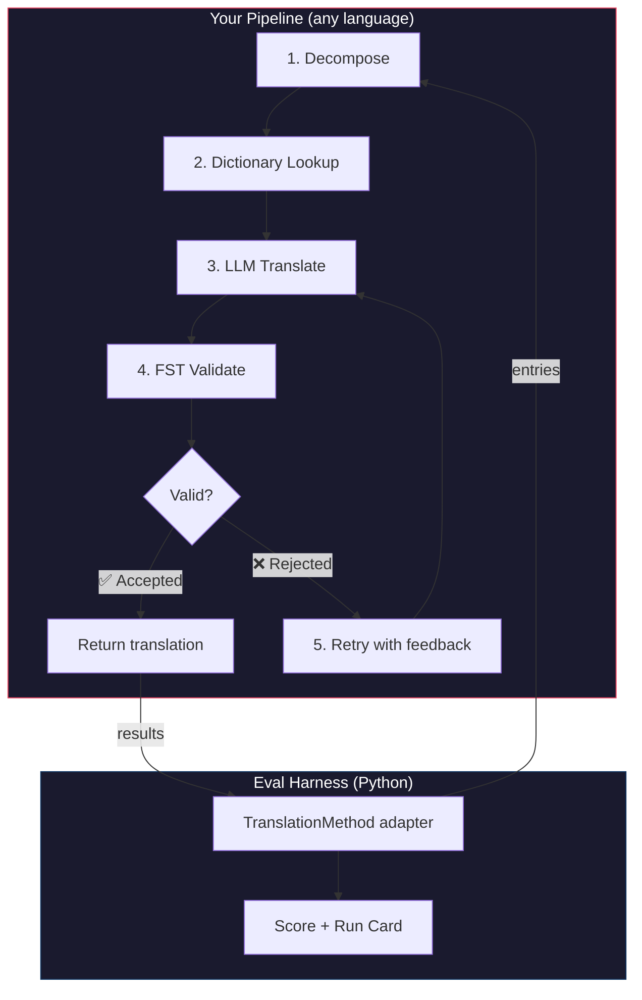
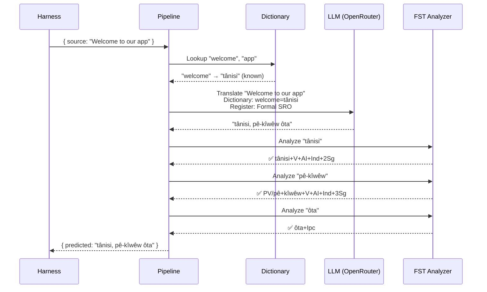
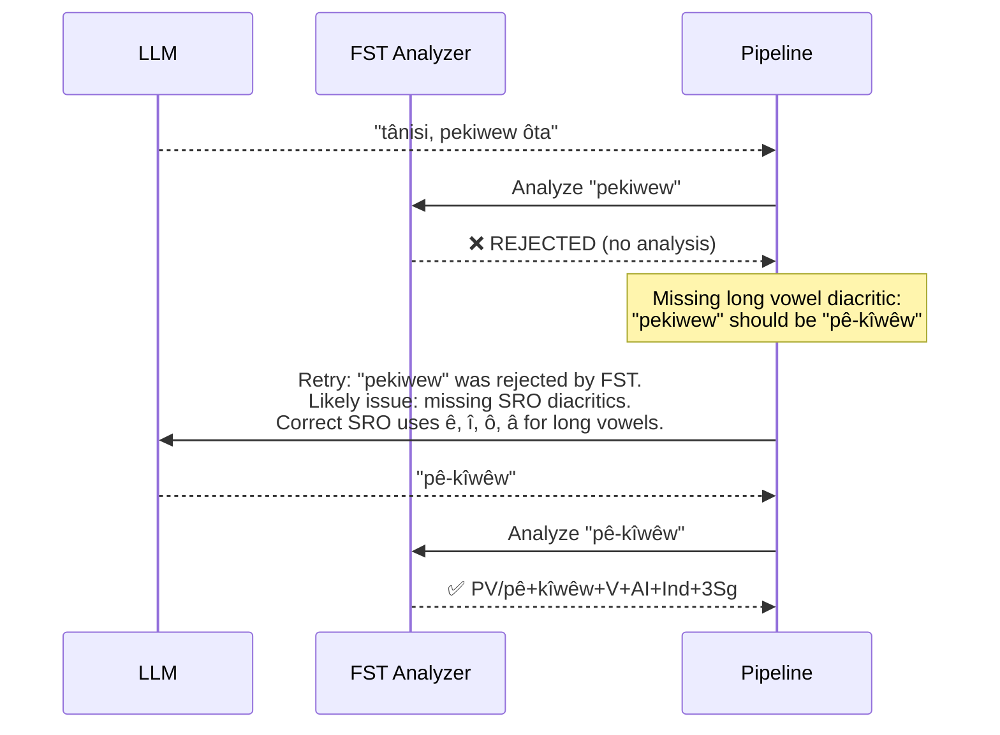

# Cookbook: FST-Gated Translation Pipeline

Erstellen Sie eine mehrstufige Übersetzungspipeline, die den Ausgangstext zerlegt, über ein LLM übersetzt, die Ausgaben mit einem endlichen Zustandsübersetzer (FST) validiert und einen erneuten Versuch unternimmt, wenn der FST ungültige Wortformen ablehnt. Binden Sie sie anschließend in das Eval-Harness ein und sehen Sie sich an, wie sie abschneidet.

**Was Sie erstellen werden:** Eine Übersetzungspipeline für Plains Cree, die morphologisch ungültige Übersetzungen abfängt, *bevor* sie sich auf Ihre Bewertung auswirken.

:::info Prerequisites
- Eine laufende FST-Binärdatei (z. B. aus dem [Plains-Cree-Analysator von ALTLab](https://github.com/UAlbertaALTLab/lang-crk))
- Node.js 20+ (für die Pipeline) und Python 3.10+ (für das Harness)
- Einen OpenRouter-API-Schlüssel für den LLM-Schritt
:::

---

## Architektur

Die Pipeline ist eine Kette von Stufen. Jede Stufe hat eine bestimmte Aufgabe. Sie können dies in jeder beliebigen Sprache erstellen — dieses Beispiel verwendet JavaScript, aber das Harness kümmert sich nicht darum, was sich darin befindet. Es sieht nur den schmalen Python-Adapter an der Schnittstelle.



### Warum diese Stufen

| Stufe | Was sie tut | Warum sie wichtig ist |
|-------|-------------|---------------|
| **Decompose** | Zusammengesetzte UI-Zeichenfolgen in übersetzbare Segmente zerlegen | Polysynthetische Sprachen kodieren ganze Sätze in einzelnen Wörtern — das LLM benötigt kleinere Einheiten |
| **Dictionary Lookup** | Ein zweisprachiges Wörterbuch nach bekannten Übersetzungen durchsuchen | Erzwingt die korrekte Terminologie für bekannte Begriffe, anstatt sich auf Mutmaßungen des LLM zu verlassen |
| **LLM Translate** | Das Segment mit Register- und Grammatikkontext an ein LLM senden | Verarbeitet neuartige Phrasen und erzeugt flüssige Ausgaben |
| **FST Validate** | Die Ausgabe durch einen morphologischen Analysator laufen lassen | Fängt ungültige Wortformen ab — wenn der FST ein Wort ablehnt, ist es keine gültige Wortform in der Sprache |
| **Retry** | Abgelehnte Wörter mit der Fehlerrückmeldung des FST erneut senden | Liefert dem LLM spezifische Informationen darüber, *warum* das Wort falsch war |

---

## Der Datenfluss

So sieht es aus, wenn ein einzelner Eintrag die Pipeline durchläuft:



### Wenn der FST ablehnt



---

## Implementierung

Erstellen Sie, was immer Sie möchten. Dieses Beispiel verwendet JavaScript, aber Sie könnten auch Python, Rust oder etwas anderes verwenden. Das Harness kümmert sich nicht darum — es kommuniziert nur mit dem schmalen Python-Adapter (im nächsten Abschnitt dargestellt).

### Die Pipeline

Jede Stufe ist eine Funktion. Die Pipeline verkettet sie miteinander.

```javascript title="pipeline.js"
import { lookupDictionary } from './dictionary.js';
import { callLLM } from './llm.js';
import { analyzeWithFST } from './fst.js';

const MAX_RETRIES = 3;

/**
 * Translate a batch of keys through the full pipeline.
 *
 * @param {object} keys - Map of key → source string
 * @param {object} options - { sourceLang, targetLang }
 * @returns {{ translations: object, stats: object }}
 */
export async function translateBatch(keys, options) {
  const translations = {};
  const stats = { total: 0, fstAccepted: 0, retries: 0, dictionaryHits: 0 };

  for (const [key, sourceText] of Object.entries(keys)) {
    stats.total++;
    translations[key] = await translateSingle(sourceText, options, stats);
  }

  return { translations, stats };
}

/**
 * Translate a single string through all pipeline stages.
 */
async function translateSingle(sourceText, options, stats) {

  // ── Stage 1: Decompose ──────────────────────────────────
  // Split compound strings into segments the LLM can handle.
  // For UI strings this is often a no-op, but for longer content
  // it prevents the LLM from losing context in long prompts.
  const segments = decompose(sourceText);

  // ── Stage 2: Dictionary Lookup ──────────────────────────
  // Check each segment against the bilingual dictionary.
  // Known terms are forced — the LLM won't override them.
  const knownTerms = {};
  for (const segment of segments) {
    const entry = lookupDictionary(segment.toLowerCase());
    if (entry) {
      knownTerms[segment] = entry;
      stats.dictionaryHits++;
    }
  }

  // ── Stage 3: LLM Translate ──────────────────────────────
  let translation = await callLLM(sourceText, {
    ...options,
    knownTerms,
    register: 'nêhiyawêwin (Plains Cree). Use SRO orthography. '
            + 'Professional register for educational contexts.',
  });

  // ── Stage 4: FST Validate ──────────────────────────────
  // Split the translation into words and check each one.
  let { accepted, rejected } = await validateWords(translation);

  // ── Stage 5: Retry Loop ─────────────────────────────────
  // If any words were rejected, retry with FST feedback.
  let attempt = 0;
  while (rejected.length > 0 && attempt < MAX_RETRIES) {
    attempt++;
    stats.retries++;

    const feedback = rejected
      .map(w => `"${w}" was rejected by the morphological analyzer`)
      .join('; ');

    translation = await callLLM(sourceText, {
      ...options,
      knownTerms,
      register: 'nêhiyawêwin (Plains Cree). Use SRO orthography.',
      feedback: `Previous attempt had invalid words. ${feedback}. `
              + 'Use correct SRO diacritics (ê, î, ô, â for long vowels). '
              + 'Ensure verb forms match expected conjugation patterns.',
    });

    ({ accepted, rejected } = await validateWords(translation));
  }

  if (rejected.length === 0) stats.fstAccepted++;

  return translation;
}

/**
 * Decompose source text into translatable segments.
 *
 * For simple key-value UI strings, this usually returns the
 * original string as a single segment. For longer content,
 * it splits on sentence boundaries.
 */
function decompose(text) {
  // Simple sentence-boundary split. Replace with your own
  // morphological decomposition for more complex needs.
  return text
    .split(/(?<=[.!?])\s+/)
    .filter(s => s.trim().length > 0);
}

/**
 * Validate each word in a translation against the FST.
 *
 * @returns {{ accepted: string[], rejected: string[] }}
 */
async function validateWords(translation) {
  // Split on whitespace and punctuation, keeping only words
  const words = translation
    .split(/[\s,;:.!?'"()\[\]{}]+/)
    .filter(w => w.length > 0);

  const accepted = [];
  const rejected = [];

  for (const word of words) {
    const analyses = await analyzeWithFST(word);
    if (analyses.length > 0) {
      accepted.push(word);
    } else {
      rejected.push(word);
    }
  }

  return { accepted, rejected };
}
```

### Der FST-Wrapper

Verpacken Sie Ihre FST-Binärdatei als asynchrone Funktion. Dieses Beispiel verwendet den HFST-basierten Plains-Cree-Analysator von ALTLab.

```javascript title="fst.js"
import { execFile } from 'node:child_process';
import { promisify } from 'node:util';

const execFileAsync = promisify(execFile);

// Path to your FST analyzer binary
const FST_PATH = process.env.FST_ANALYZER_PATH || './bin/crk-analyzer';

/**
 * Run a word through the FST morphological analyzer.
 *
 * Returns an array of analyses. Empty array = rejected.
 *
 * Example:
 *   analyzeWithFST("tânisi")
 *   → ["tânisi+V+AI+Ind+2Sg", "tânisi+V+AI+Cnj+2Sg"]
 *
 *   analyzeWithFST("pekiwew")
 *   → []  // rejected — missing diacritics
 *
 * @param {string} word - A single word in SRO orthography
 * @returns {string[]} Array of FST analyses (empty = rejected)
 */
export async function analyzeWithFST(word) {
  try {
    // HFST lookup: pipe the word to stdin, read analyses from stdout
    const { stdout } = await execFileAsync(
      FST_PATH,
      ['--quiet'],
      { input: word + '\n', timeout: 5000 }
    );

    // Parse HFST output: each line is "input\tanalysis\tweight"
    // Lines with "+?" indicate unrecognized forms
    return stdout
      .split('\n')
      .filter(line => line.includes('\t') && !line.includes('+?'))
      .map(line => line.split('\t')[1]);

  } catch (err) {
    // If the FST binary isn't available, log and reject
    console.error(`[WARN] FST analysis failed for "${word}": ${err.message}`);
    return [];
  }
}
```

### Dictionary- und LLM-Module

```javascript title="dictionary.js"
/**
 * Simple bilingual dictionary backed by a JSON file.
 *
 * In production, you'd load from the coaching data directory
 * or query itwêwina (https://itwewina.altlab.app/) via API.
 */
const DICTIONARY = {
  'hello': 'tânisi',
  'welcome': 'tânisi',
  'thank you': 'kinanâskomitin',
  'home': 'kīwēwin',
  'search': 'nānātawāpahtam',
  'settings': 'isi-nākatohkēwin',
  'help': 'nīsōhkamākēwin',
  'back': 'kīwē',
};

/**
 * @param {string} term - Lowercase English term
 * @returns {string|null} Cree translation or null
 */
export function lookupDictionary(term) {
  return DICTIONARY[term] || null;
}
```

```javascript title="llm.js"
/**
 * Call an LLM via OpenRouter for translation.
 */
const OPENROUTER_API = 'https://openrouter.ai/api/v1/chat/completions';

export async function callLLM(sourceText, options) {
  const { knownTerms = {}, register, feedback } = options;

  // Build the system prompt with register and known terms
  let systemPrompt = `You are translating English to Plains Cree.\n\n`;
  systemPrompt += `Register: ${register}\n\n`;

  if (Object.keys(knownTerms).length > 0) {
    systemPrompt += `Required terminology (use these exact translations):\n`;
    for (const [en, crk] of Object.entries(knownTerms)) {
      systemPrompt += `  "${en}" → "${crk}"\n`;
    }
    systemPrompt += '\n';
  }

  if (feedback) {
    systemPrompt += `IMPORTANT correction from previous attempt:\n${feedback}\n\n`;
  }

  systemPrompt += `Rules:\n`;
  systemPrompt += `- Use Standard Roman Orthography (SRO)\n`;
  systemPrompt += `- Use macron/circumflex for long vowels: ê, î, ô, â\n`;
  systemPrompt += `- Return ONLY the Cree translation, nothing else\n`;

  const response = await fetch(OPENROUTER_API, {
    method: 'POST',
    headers: {
      'Authorization': `Bearer ${process.env.OPENROUTER_API_KEY}`,
      'Content-Type': 'application/json',
    },
    body: JSON.stringify({
      model: 'google/gemini-2.5-pro',
      messages: [
        { role: 'system', content: systemPrompt },
        { role: 'user', content: sourceText },
      ],
      temperature: 0.2,
    }),
  });

  const json = await response.json();
  return json.choices[0].message.content.trim();
}
```

---

## Einbindung in das Harness

Ihre Pipeline ist erstellt. Nun müssen Sie sie mit dem Eval-Harness verbinden, damit Sie sie auf der Bestenliste vergleichen können.

Das Harness spricht eine Schnittstelle: `TranslationMethod`. Es handelt sich um ein Python-Protokoll mit einer einzigen Methode. Erstellen Sie, was immer Sie möchten, in welcher Sprache auch immer — versehen Sie es dann mit diesem schmalen Wrapper, und es lässt sich einbinden.

```python title="fst_gated_process.py"
"""
TranslationMethod adapter for the FST-gated pipeline.

This thin wrapper connects your pipeline (running as a local
subprocess or HTTP server) to the eval harness. The harness
calls translate() with corpus entries. You call your pipeline.
You return results. That's it.
"""

import time
import subprocess
import json
from mt_eval_harness.config import RunConfig


class FSTGatedProcess:
    """Adapter between the eval harness and your FST-gated pipeline.

    The pipeline runs as a Node.js subprocess. This wrapper:
    1. Receives entries from the harness
    2. Sends them to the pipeline
    3. Returns structured results the harness can score
    """

    def __init__(self, pipeline_url: str = "http://localhost:3001"):
        self.pipeline_url = pipeline_url

    async def translate(
        self,
        entries: list[dict],
        config: RunConfig,
    ) -> list[dict]:
        """Translate a batch of entries through the FST-gated pipeline.

        Args:
            entries: List of corpus entries with 'id' and source text.
            config: Harness run configuration (for context).

        Returns:
            List of result dicts, one per entry.
        """
        import httpx

        results = []

        for entry in entries:
            source_text = entry.get(config.source_field, entry.get("source", ""))
            start = time.monotonic()

            try:
                # Call your pipeline — however it's running
                async with httpx.AsyncClient() as client:
                    response = await client.post(
                        f"{self.pipeline_url}/translate",
                        json={"keys": {str(entry["id"]): source_text}},
                        timeout=30.0,
                    )
                    data = response.json()
                    predicted = data["translations"][str(entry["id"])]

                elapsed = time.monotonic() - start

                results.append({
                    "id": entry["id"],
                    "predicted": predicted,
                    "latency_s": elapsed,
                    "usage": {},  # pipeline doesn't expose token counts
                    "error": None,
                    "tool_calls": [],
                    "tool_call_count": 0,
                    "metadata": data.get("meta", {}),
                })

            except Exception as err:
                results.append({
                    "id": entry["id"],
                    "predicted": "",
                    "latency_s": time.monotonic() - start,
                    "usage": {},
                    "error": str(err),
                    "tool_calls": [],
                    "tool_call_count": 0,
                    "metadata": {},
                })

        return results
```

:::tip You don't need HTTP
Das obige Beispiel ruft die Pipeline über HTTP auf, da die Pipeline in JavaScript geschrieben ist. Wenn Ihre Pipeline in Python geschrieben ist, können Sie sie direkt aufrufen — es ist kein Server erforderlich. Der `TranslationMethod`-Wrapper ist lediglich eine Funktionsgrenze. Was sich darin abspielt, bleibt Ihnen überlassen.
:::

### Den Benchmark ausführen

Starten Sie Ihre Pipeline und führen Sie dann das Harness aus:

```bash
# Terminal 1: Start the pipeline
node server.js

# Terminal 2: Run the harness with your process
export OPENROUTER_API_KEY="sk-or-v1-..."

python -c "
import asyncio
from mt_eval_harness.config import RunConfig
from mt_eval_harness.runner import execute_run
from fst_gated_process import FSTGatedProcess

async def main():
    config = RunConfig(
        corpus_path='data/edtekla-dev-v1.json',
        source_lang='English',
        target_lang='Plains Cree (nêhiyawêwin, SRO)',
        process_name='fst-gated-v1',
    )
    process = FSTGatedProcess('http://localhost:3001')
    run_log = await execute_run(config, process=process)
    print(f'Results: {run_log.output_path}')

asyncio.run(main())
"
```

Oder verwenden Sie die CLI mit `baseline_experiment.py`, um einen Vergleich mit der integrierten Baseline durchzuführen:

```bash
python eval/baseline_experiment.py \
  --dataset data/edtekla-dev-v1.json \
  --model google/gemini-2.5-pro \
  --fst-analyzer ./bin/crk-analyzer \
  --condition fst-gated-v1 \
  --submit
```

---

## Ihre Ergebnisse verstehen

Das Harness erzeugt eine **Run Card** — eine JSON-Datei mit Ihren Bewertungen. Hier ist, was Sie sehen werden:

```
═══════════════════════════════════════════════════
  FST-Gated Pipeline v1 — EDTeKLA Dev v1
═══════════════════════════════════════════════════

  chrF++              48.7 / 100
  Exact match         12.1%
  FST acceptance      94.4%
  Composite score     0.52  →  Functional ✓

  404 entries (master_corpus.json) · 47 retries · $0.18 total cost
═══════════════════════════════════════════════════
```

**Was Ihnen das auf einen Blick verrät:**
- Ihre Methode liegt in der Stufe **Functional** (0,50–0,70) — die Ausgabe ist für eine sprechende Person erkennbar, die wichtigsten grammatikalischen Kategorien sind in der Regel korrekt, häufige morphologische Fehler bleiben bestehen.
- Der FST erkennt 94 % der Wörter als gültig — Ihre Retry-Schleife funktioniert.
- 12 % der Übersetzungen sind exakt richtig — es besteht viel Verbesserungspotenzial.

:::info Quality Tiers
| Stufe | Composite | Was es bedeutet |
|------|-----------|---------------|
| Baseline | 0,00–0,30 | Rohe LLM-Ausgabe, größtenteils halluzinierte Morphologie |
| Emerging | 0,30–0,50 | Einige korrekte Muster, nicht zuverlässig |
| **Functional** | **0,50–0,70** | **Für eine sprechende Person erkennbar. Wichtige Kategorien in der Regel korrekt.** |
| Deployable | 0,70–0,85 | Geeignet für Entwurfsübersetzungen mit menschlicher Überprüfung |
| Fluent | 0,85–1,00 | Annähernd kompetente menschliche Übersetzung |

Siehe [SCORING_SPEC §5](/docs/specifications/scoring#5-quality-tiers) für die vollständigen Definitionen der Stufen.
:::

<details>
<summary><strong>Tiefer: Was steht in der Run Card?</strong></summary>

Die JSON-Datei der Run Card erfasst alles über diesen Evaluationslauf. Wichtige Abschnitte:

**Scores** — jede Metrik, die das Harness berechnet hat:
```json
{
  "scores": {
    "exact_match_rate": 0.121,
    "chrf_plus_plus": 48.7,
    "fst_acceptance_rate": 0.944,
    "composite_score": 0.52,
    "quality_tier": "functional"
  }
}
```

**Provenance** — was diese Ergebnisse erzeugt hat:
```json
{
  "method": {
    "process_name": "fst-gated-v1",
    "model": "google/gemini-2.5-pro",
    "temperature": 0.0
  },
  "corpus": {
    "id": "edtekla-dev-v1",
    "sha256": "a1b2c3..."
  }
}
```

**Ergebnisse pro Eintrag** — jede Übersetzung mit individuellen Bewertungen, sodass Sie erkennen können, wo Ihre Methode Schwierigkeiten hat:
```json
{
  "id": 42,
  "source": "The student completed the assignment",
  "reference": "ôskiniw kî-kîsîhtâw ôhi atoskêwina",
  "predicted": "ôskiniw kî-kîsîhtâw ôhi atoskêwin",
  "chrf": 89.2,
  "exact_match": false,
  "fst_accepted": true
}
```

Der Composite Score ist ein gewichteter Durchschnitt der verfügbaren Metriken, wobei die Gewichtungen in [SCORING_SPEC §4](/docs/specifications/scoring#4-composite-score) definiert sind. Wenn eine Metrik nicht verfügbar ist, wird ihre Gewichtung proportional auf die übrigen verteilt.

</details>

---

## Bereitstellung in der Produktion

Ihre Methode hat Bewertungen auf der Bestenliste. Nun möchten Sie sie tatsächlich verwenden. In diesem Abschnitt geht es darum, Ihre Pipeline als produktiven Endpunkt bereitzustellen, den [champollion](https://champollion.dev) aufrufen kann.

:::note This section is optional
Alles oben Beschriebene betrifft das Erstellen und Vergleichen Ihrer Methode. In diesem Abschnitt geht es um die Bereitstellung — ein gesondertes Anliegen. Sie können Ihre Methode bei der Bestenliste einreichen, ohne etwas bereitzustellen.
:::

### Der HTTP-Server

Verpacken Sie Ihre Pipeline als Express-Server, der den [API-Methodenvertrag](https://champollion.dev/docs/guides/serving-a-method) implementiert:

```javascript title="server.js"
import express from 'express';
import { translateBatch } from './pipeline.js';

const app = express();
app.use(express.json());

/**
 * API method contract:
 *
 * Request:  { source_locale, target_locale, method, keys: { "key": "source" } }
 * Response: { translations: { "key": "translated" }, meta: { ... } }
 */
app.post('/translate', async (req, res) => {
  const { source_locale, target_locale, method, keys } = req.body;

  // Validate request
  if (!keys || typeof keys !== 'object') {
    return res.status(400).json({ error: { message: 'Missing keys object' } });
  }

  try {
    const startTime = Date.now();
    const { translations, stats } = await translateBatch(keys, {
      sourceLang: source_locale,
      targetLang: target_locale,
    });

    res.json({
      translations,
      meta: {
        model: 'custom-pipeline/fst-gated-v1',
        method: 'decompose-lookup-translate-validate',
        elapsed_ms: Date.now() - startTime,
        fst_acceptance_rate: stats.fstAccepted / stats.total,
        retries: stats.retries,
      },
    });
  } catch (err) {
    console.error('[ERR] Pipeline failed:', err.message);
    res.status(500).json({ error: { message: err.message } });
  }
});

// Health check for connectivity verification
app.get('/health', (req, res) => res.json({ status: 'ok' }));

app.listen(3001, () => {
  console.log('FST-gated pipeline running on http://localhost:3001');
});
```

### champollion konfigurieren

Richten Sie Ihr Sprachpaar auf den laufenden Dienst aus:

```json title="champollion.config.json"
{
  "version": 3,
  "inputLocale": "en",
  "pairs": {
    "en:crk": {
      "method": "api",
      "endpoint": "http://localhost:3001/translate"
    }
  },
  "languages": {
    "crk": {
      "name": "Plains Cree",
      "register": "SRO syllabics with grammatical precision."
    }
  }
}
```

```bash
# Run it
export OPENROUTER_API_KEY="sk-or-v1-..."
node server.js &
npx champollion sync
```

### Verpacken als Plugin

Sobald Ihre Methode Bewertungen hat, verpacken Sie sie, damit andere sie verwenden können:

```json title="crk-fst-gated-v1/method.json"
{
  "name": "crk-fst-gated-v1",
  "type": "api",
  "version": "1.0.0",
  "description": "FST-gated Plains Cree translation with morphological validation",
  "author": "Your Name",

  "config": {
    "endpoint": "https://your-server.example.com/translate"
  },

  "locales": ["crk"],

  "benchmarks": {
    "crk": {
      "date": "2026-06-01T00:00:00Z",
      "corpus_size": 404,
      "exact_match_rate": 0.12,
      "corpus_chrf": 48.7,
      "model": "google/gemini-2.5-pro",
      "harness_version": "2.0"
    }
  },

  "provenance": {
    "resources": [
      { "name": "ALTLab CRK Analyzer", "license": "LGPL-3.0", "type": "fst" },
      { "name": "Wolvengrey Dictionary", "license": "CC-BY-NC-SA-4.0", "type": "dictionary" }
    ],
    "commercialReady": false,
    "flags": ["nc-resource"]
  }
}
```

---

## Dieses Muster erweitern

Dieses Cookbook demonstriert eine Pipeline-Architektur. Sie können sie für jede beliebige Sprache oder Methode anpassen:

| Variante | Was sich ändert |
|-----------|-------------|
| **Anderer FST** | Tauschen Sie den Binärpfad aus. Sie können vorkompilierte FSTs (wie `.hfstol`- oder `lttoolbox`-Binärdateien) für über 100 Sprachen aus dem [GiellaLT GitHub](https://github.com/giellalt) oder [Apertium GitHub](https://github.com/apertium) herunterladen. |
| **Kein FST verfügbar** | Entfernen Sie die FST-Ausführungsstufe und verwenden Sie [UniMorph-Flachparadigmendateien](https://huggingface.co/datasets/unimorph/universal_morphologies) von Hugging Face, um eine statische Datenbankabfrage zur Validierung flektierter Formen durchzuführen. |
| **Mehrere LLMs** | Verketten Sie Modelle: ein schnelles Modell für den ersten Entwurf, ein Reasoning-Modell für Korrekturen. |
| **Human-in-the-loop** | Fügen Sie eine Warteschlangenstufe hinzu, die unsichere Übersetzungen für eine Expertenüberprüfung zurückhält, bevor sie zurückgegeben werden. |
| **Feinabgestimmtes Modell** | Ersetzen Sie den OpenRouter-Aufruf durch ein lokales Modell (Ollama, vLLM usw.). |
| **Andere Sprache** | Ändern Sie das Wörterbuch, den FST und das Register. Die Architektur bleibt identisch. |

Die Pipeline ist ein Muster. Die Stufen sind austauschbar. Erstellen Sie, was für Ihre Sprache funktioniert, beweisen Sie es auf der [Bestenliste](https://champollion.dev/leaderboard) und stellen Sie es bereit.

---

## Siehe auch

- **[Eval Harness](/docs/specifications/harness)** — wie Sie das Harness ausführen und die Ausgabe interpretieren
- **[Method Interface](/docs/specifications/methods)** — die Spezifikation des `TranslationMethod`-Protokolls
- **[Leaderboard Rules](/docs/leaderboard/rules)** — Einreichungskriterien und Anti-Gaming-Richtlinien
- **[Support a Low-Resource Language](/docs/community/low-resource-languages)** — der breitere Kontext und die OCAP-Prinzipien
- **[ALTLab](https://altlab.artsrn.ualberta.ca/)** — das Alberta Language Technology Lab (Plains-Cree-FST)
- **[Method Leaderboard](https://champollion.dev/leaderboard)** — reichen Sie Ihre Bewertungen ein