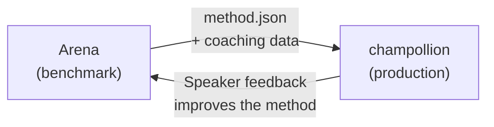

# Implementar en Producción

Lo probó en la Arena. Ahora impleméntelo en producción.

La Arena es para I+D — construir, evaluar y comparar métodos de traducción. **La implementación en producción** ocurre a través de [champollion](https://champollion.dev), la CLI de traducción orientada a desarrolladores. Se conectan a través de un formato de complemento compartido.



---

## La Ruta de Implementación

### 1. Exporte Su Método como un Complemento

Cree un manifiesto `method.json` que empaquete sus resultados de evaluación:

```json
{
  "name": "crk-coached-v3",
  "type": "llm-coached",
  "version": "3.0.0",
  "description": "Coached LLM translation for Plains Cree",
  "locales": ["crk"],
  "config": {
    "model": "google/gemini-2.5-flash",
    "temperature": 0.3
  },
  "benchmarks": {
    "crk": {
      "composite_score": 0.67,
      "fst_acceptance": 0.82,
      "corpus_size": 150
    }
  }
}
```

Incluya cualquier dato de entrenamiento (reglas gramaticales, diccionarios) junto con el manifiesto.

### 2. Instale en Champollion

```bash
champollion plugin install ./my-method-plugin/
```

### 3. Configure Su Par de Idiomas

```json title="champollion.config.json"
{
  "pairs": {
    "en-crk": { "method": "plugin", "plugin": "crk-coached-v3" }
  }
}
```

### 4. Traduzca Contenido Real

```bash
npx champollion sync
```

Su método evaluado ahora está produciendo traducciones reales en producción.

---

## Para Idiomas Indígenas

Los métodos que sirven a comunidades de idiomas indígenas requieren **consentimiento comunitario** antes de la implementación en producción. Los principios OCAP (Propiedad, Control, Acceso, Posesión) rigen cómo se desarrollan, evalúan e implementan los métodos de traducción.

Un método que alcanza el nivel Implementable (0.70+) no se implementa automáticamente — se implementa **si y cuando** el órgano de gobernanza de la comunidad de idiomas da su consentimiento.

Consulte [Soberanía de Datos](/docs/sovereignty/data-sovereignty) y [Transferencia de Propiedad](/docs/sovereignty/ownership-transfer) para el marco de gobernanza completo.

---

## Véase También

- [The Eval Harness Bridge](https://champollion.dev/docs/guides/bridge) — recorrido detallado del pipeline Arena→champollion
- [Plugin Specification](https://champollion.dev/docs/reference/plugin-spec) — el formato del manifiesto method.json
- [Guía del Agente champollion](https://champollion.dev/docs/guides/agent-guide) — cómo usar champollion para traducción