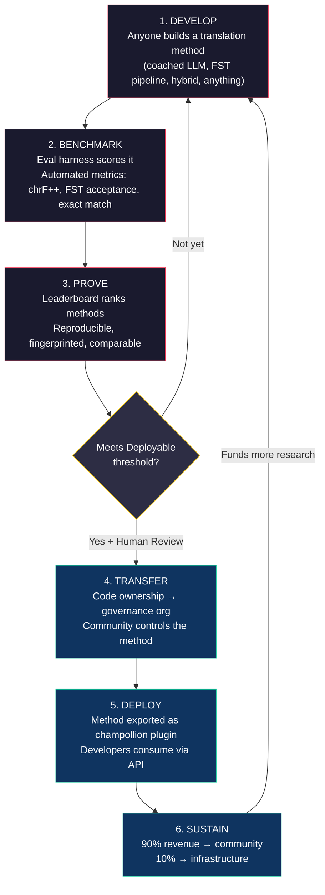
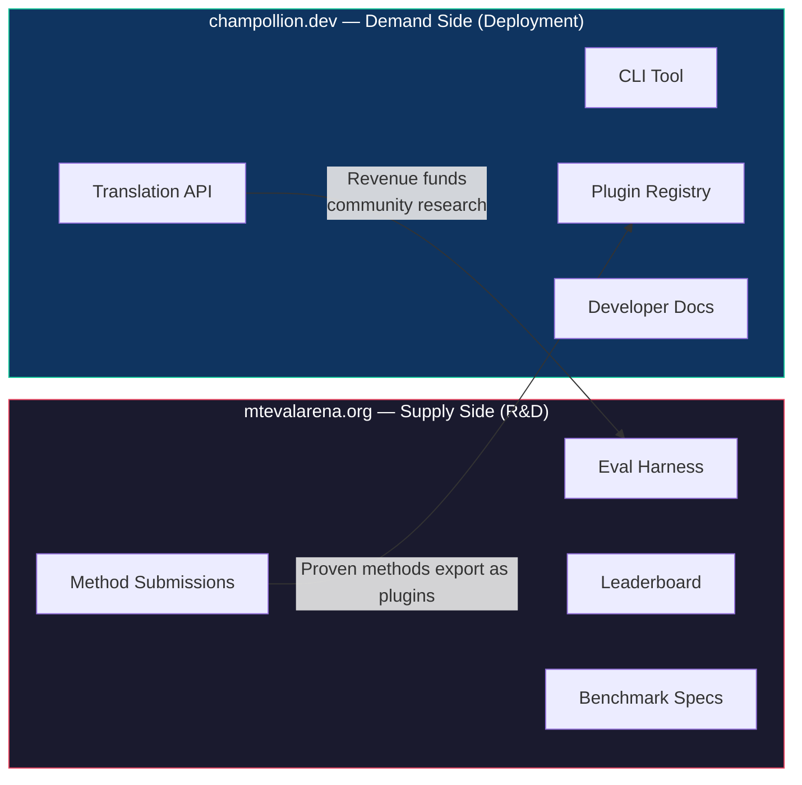
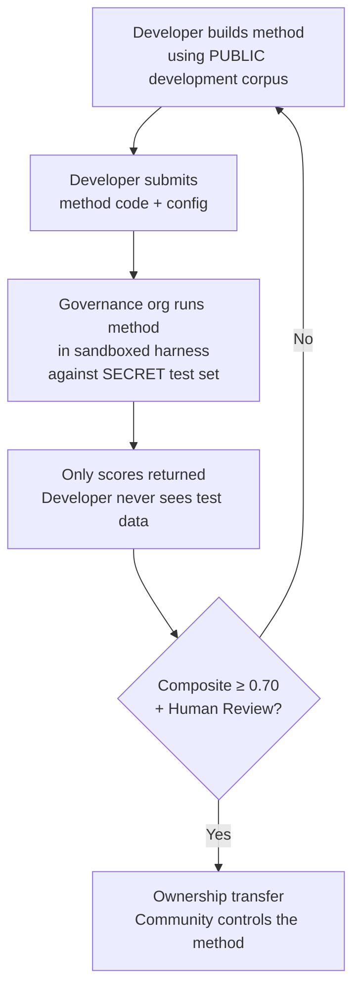

# Cómo Funciona: Crowdsourcing Competitivo para Traducción Automática

> **Resumen Ejecutivo.** La traducción automática para los idiomas poco atendidos del mundo — incluyendo los ~1.300 que Meta afirma cubrir con OMT-1600 pero a niveles de calidad por debajo de cualquier umbral utilizable — no es un problema de entrenamiento de modelos, sino un problema de *infraestructura*. Ningún modelo, laboratorio o empresa lo resolverá por sí sola. Este documento describe una arquitectura de plataforma que convierte la comunidad global de ingenieros de ML, lingüistas y hablantes de idiomas en un laboratorio de investigación distribuido: cualquiera construye un método de traducción, la plataforma prueba si funciona contra datos de evaluación soberana, y los métodos probados se despliegan a producción con ingresos fluyendo hacia las comunidades cuyos idiomas sirven. El mecanismo es crowdsourcing competitivo con soberanía criptográfica — una combinación que no ha sido intentada antes.

---

> [!IMPORTANT]
> **Alcance.** Esta plataforma evalúa **traducción de texto escrito formal** — documentos, materiales educativos, comunicaciones oficiales, cadenas de interfaz. No es un chatbot, intérprete en tiempo real, o sistema conversacional de dominio irrestricto. El leaderboard clasifica métodos de traducción contra corpus paralelos curados en dominios de texto específicos (véase [Especificación de Benchmark §2.7](/docs/specifications/benchmark#27-domain) para la taxonomía de dominios). MT es infraestructura para revitalización de idiomas, no un sustituto para ella. Los niños aprenden idiomas de personas, no de máquinas.

### Cobertura de Dominio Actual

| Dominio | Cobertura de Niveles | Estado | Notas |
|---------|---------------------|--------|-------|
| Oficial / gobierno | Niveles 1–5 | Activo | Corpus EdTeKLA |
| Educativo / libro de texto | Niveles 1–4 | Activo | Corpus EdTeKLA |
| Narrativo / literario | Limitado | Planificado | Algunas entradas en estándar de oro |
| Religioso / escritural | Solo referencia | No evaluado | FLORES+ (dominio Biblia); no utilizado para puntuación oficial |
| Conversacional | Fuera de alcance | Por diseño | Este sistema evalúa texto escrito, no habla |
| Técnico / científico | Fuera de alcance | Futuro | Requiere validación de terminología específica del dominio |

## 1. El Problema: Traducción Automática ≠ Aprendizaje Automático

La traducción automática para idiomas de bajo recurso (LRL) comúnmente se enmarca como un problema de aprendizaje automático: recopilar datos, entrenar un modelo, desplegar. Este enfoque es incorrecto, y el error es consecuente — dirige financiamiento, talento e infraestructura hacia un enfoque que estructuralmente no puede funcionar para la mayoría de los idiomas del mundo.

### 1.1 Por Qué Falla el Enfoque de ML

El pipeline estándar de ML para MT requiere tres cosas: corpus paralelos grandes, benchmarks de evaluación validados, y una ruta de despliegue. Para los ~130 idiomas servidos por Google Translate y los ~200 cubiertos por NLLB-200, los tres existen. Para los ~1.300 idiomas adicionales que OMT-1600 afirma cubrir, existen datos de evaluación pero la calidad es mayormente por debajo de umbrales utilizables, los pesos del modelo no están disponibles públicamente, y no hay pipeline de despliegue. Para los ~5.400+ restantes, ninguno existe en absoluto.

| Requisito | Idiomas de Alto Recurso | Cobertura OMT-1600 (~1.300 LRL) | ~5.400 Idiomas Restantes |
|-----------|------------------------|-------------------------------|---------------------------|
| **Corpus paralelos** | Millones de pares de oraciones (Europarl, UN Corpus, OpenSubtitles) | Bitext de dominio Biblia, raspados web, retrotraducciones sintéticas. Sin datos curados por comunidad. | Cientos a miles bajos, si existen |
| **Benchmarks de evaluación** | WMT, FLORES, NTREX — estandarizados, reproducibles | BOUQuET (dominio Biblia), met-BOUQuET. Sin validación morfológica. Sin evaluación independiente. | Sin benchmarks estándar; evaluación ad hoc |
| **Ruta de despliegue** | Google Translate, DeepL, Azure — APIs comerciales | Pesos del modelo no liberados. Sin CLI, sin sistema de plugins, sin API desplegable por comunidad. | Nada. Sin API, sin producto, sin mercado. |

El enfoque de ML funciona cuando existen los datos para entrenar y el mercado existe para desplegar. OMT-1600 ha expandido significativamente la primera condición — pero expansión sin verificación de calidad independiente, validación morfológica, o gobernanza comunitaria es expansión sin confianza. El problema no es solo "necesitamos un modelo mejor" — es "necesitamos infraestructura que pruebe que el modelo funciona, en términos que la comunidad controla."

### 1.2 Lo Que MT para LRL Realmente Requiere

La traducción para idiomas poco atendidos no es principalmente un problema de entrenamiento. Es un problema de **ingeniería de métodos** — el desafío de ensamblar recursos disponibles (LLMs, herramientas morfológicas, conocimiento comunitario, reglas lingüísticas) en pipelines de traducción funcionales, luego probar que funcionan con evaluación rigurosa.

La distinción importa:

| Dimensión | Enfoque de ML | Enfoque de Ingeniería de Métodos |
|-----------|------------|---------------------------|
| **Actividad central** | Entrenar un modelo en datos | Combinar herramientas, prompts, y conocimiento lingüístico en un pipeline |
| **Cuello de botella** | Volumen de datos paralelos | Creatividad en ingeniería + infraestructura de evaluación |
| **Quién puede contribuir** | Equipos con clusters GPU y datasets | Cualquiera con una clave API, un diccionario, y una idea |
| **Evaluación** | BLEU/chrF en conjuntos de prueba retenidos | Validación morfológica + revisión humana + métricas automatizadas |
| **Despliegue** | Servir el modelo | Empaquetar el método como un plugin |

Los LLMs modernos ya contienen conocimiento latente de muchos idiomas de bajo recurso — suficiente para producir salida que *se ve* plausible. El problema es que esta salida a menudo es morfológicamente inválida (el modelo alucina formas de palabras que no existen en el idioma). El desafío de ingeniería es: ¿cómo extraes lo que el LLM sabe, lo validas contra la realidad lingüística, y empaquetas el resultado para uso en producción?

Por eso evaluamos **métodos**, no modelos. Un método es la receta completa: selección de modelo + ingeniería de prompts + uso de herramientas + pre/post-procesamiento + datos de coaching + estrategias de reintento. Dos equipos usando el mismo modelo con métodos diferentes obtendrán puntuaciones diferentes. Ese es el punto.

### 1.3 Por Qué los Idiomas Polisintéticos Rompen Todo

Muchos de los idiomas más poco atendidos del mundo son **polisintéticos** — codifican oraciones completas en palabras únicas a través de procesos morfológicos productivos. Considera la palabra Plains Cree:

> **ê-kî-nitawi-kîskinwahamâkosiyân**
> *"cuando había ido a la escuela"*

Una palabra. Codifica tiempo (pasado), dirección (ir a), la raíz (aprender), voz (pasiva/reflexiva), y persona (primera singular). El inglés necesita seis palabras para lo que Cree expresa en una.

Esto rompe MT estándar en cada nivel:

- **Tokenización** — BPE y SentencePiece destrozan palabras polisintéticas en fragmentos sin sentido, porque fueron diseñados para morfología concatenativa.
- **Alucinación** — Los LLMs producen cadenas plausibles que no son palabras válidas. Un no hablante no puede notar la diferencia. Sin validación morfológica, las alucinaciones son invisibles.
- **Evaluación** — Métricas a nivel de palabra (BLEU) penalizan la variación inflexional natural que es fundamental para cómo funcionan estos idiomas. Las métricas a nivel de carácter (chrF++) son mejores pero aún insuficientes sin validación estructural.

La solución no es un modelo más grande o más datos de entrenamiento. Es **infraestructura que atrapa alucinaciones antes de que lleguen a los usuarios** — analizadores morfológicos (FSTs) que pueden decir definitivamente "esto no es una palabra en este idioma."

---

## 2. Por Qué los Enfoques Existentes No Funcionan

### 2.1 MT Comercial

Los servicios de traducción comerciales históricamente han optimizado para volumen de mercado. OMT-1600 de Meta (marzo de 2026) representa un cambio significativo — 1.600 idiomas en un sistema. Pero para los ~1.300 en sus niveles de recurso más bajos, la calidad está por debajo de umbrales utilizables, los pesos del modelo no están disponibles, y no hay pipeline de despliegue. El problema de incentivo estructural ha evolucionado: Big Tech ahora puede construir modelos para LRL, pero sin evaluación independiente, validación morfológica, o gobernanza comunitaria, la cobertura sola no resuelve el problema.

### 2.2 Investigación Académica

La investigación académica de MT se enfoca abrumadoramente en pares de idiomas de alto recurso porque ahí es donde están los datos de entrenamiento, tareas compartidas, y venues de publicación. Los investigadores que trabajan en pares de bajo recurso luchan por publicar, luchan por financiar computación, y luchan por desplegar — porque la infraestructura de despliegue para LRL no existe.

### 2.3 Competiciones Puntuales

Podrías ejecutar una competencia Kaggle: "English→Plains Cree, mejor chrF++ gana $10.000." Aquí es lo que sucede:

1. Alguien gana, envía un notebook, cobra el premio, se va a casa.
2. El notebook se pudre en el archivo de Kaggle. Nadie lo despliega. Nadie lo mantiene.
3. El conjunto de prueba eventualmente se publica — contaminado para siempre.
4. La organización de gobernanza subió sus datos lingüísticos a la infraestructura de Google bajo los términos de servicio de Google, sin control real sobre el ciclo de vida.
5. Sin puente de despliegue. Un notebook ganador no es una API funcional.

Una recompensa única atrae cazadores de recompensas. Un leaderboard continuo con gobernanza comunitaria crea compromiso sostenido.

### 2.4 Fine-Tuning

Fine-tuning de un modelo abierto en texto paralelo es el enfoque de ML obvio. Pero para la mayoría de LRL, el corpus paralelo necesario para fine-tuning es exactamente los datos que no existen — y crearlo requiere los mismos hablantes bilingües y compromiso comunitario que el fine-tuning pretende reemplazar. No puedes bootstrapear tu camino fuera de un problema de escasez de datos con una técnica que requiere datos.

---

## 3. La Solución: Crowdsourcing Competitivo con Evaluación Soberana

La plataforma invierte el enfoque tradicional: en lugar de un equipo construyendo un modelo, **la comunidad global compite para construir el mejor método de traducción**, la plataforma prueba si funciona, y los métodos probados se despliegan a producción con la comunidad de idiomas reteniendo propiedad y control.

### 3.1 El Ciclo Completo

Cada etapa tiene una función específica:

| Etapa | Qué Sucede | Quién Se Beneficia |
|-------|-------------|--------------|
| **Desarrollar** | Un investigador, estudiante, o aficionado construye un método de traducción usando cualquier herramienta que quiera — prompting de LLM, pipelines FST, diccionarios, modelos fine-tuned, sistemas basados en reglas, o híbridos | El contribuidor aprende, experimenta, publica |
| **Benchmark** | El harness de eval puntúa el método contra un corpus estandarizado con métricas reproducibles. Cada ejecución produce una [tarjeta de ejecución](/docs/specifications/benchmark#3-run-card-schema) — un registro completo de qué fue probado y cómo se desempeñó | Los investigadores obtienen resultados reproducibles y comparables |
| **Probar** | Los resultados aparecen en el leaderboard público. Los métodos se clasifican, comparan, y escrutinizan. La comunidad ve qué funciona y qué no | Todos ganan visibilidad en el estado del arte |
| **Transferir** | Para idiomas indígenas, métodos que alcanzan el umbral Desplegable (composite ≥ 0.70) Y pasan validación humana tienen su propiedad de código transferida a la organización de gobernanza de la comunidad de idiomas | La comunidad gana un activo generador de ingresos |
| **Desplegar** | El método se exporta como un plugin [champollion](https://github.com/gamedaysuits/champollion) y se sirve vía API. Los desarrolladores consumen traducciones sin necesidad de entender el método subyacente | Los desarrolladores obtienen traducción para idiomas que las APIs comerciales no sirven |
| **Sostener** | Los ingresos de API se dividen: 90% a la comunidad, 10% a infraestructura. Los ingresos financian más investigación lingüística, desarrollo de corpus, y programas comunitarios | El volante se sostiene a sí mismo después del establecimiento inicial |

### 3.2 Por Qué la Dinámica Competitiva Funciona

La competencia no es incidental — es el mecanismo. Aquí está por qué:

**Diversidad de enfoques.** El mejor método para English→Plains Cree podría ser un LLM entrenado con FST. El mejor para English→Quechua podría ser un pipeline aumentado con diccionario. El mejor para English→Inuktitut podría ser un modelo fine-tuned bootstrapped del corpus Nunavut Hansard. Ningún equipo o enfoque único dominará en todos los idiomas. El leaderboard revela qué *tipos* de enfoques funcionan para qué *tipos* de idiomas — un meta-resultado que es en sí mismo una contribución de investigación.

**Compromiso sostenido.** Un leaderboard nunca termina. Alguien siempre quiere vencer la puntuación superior. Cada envío dona computación y esfuerzo intelectual al problema. A diferencia de una subvención única, la dinámica competitiva genera inversión de investigación continua de la comunidad global.

**Barrera baja de entrada.** Necesitas una clave API, un diccionario, y una idea. El harness de eval es código abierto. El formato de corpus es JSON simple. Un estudiante de lingüística puede competir con un laboratorio bien financiado — y a veces ganar, porque el conocimiento del dominio (entender el idioma) puede superar los recursos de computación.

**Puente de despliegue.** El mismo método que puntúa bien en el harness se despliega a producción con un cambio de configuración. "Pruébalo aquí, despliégalo allá." Esta es la brecha que Kaggle, tareas compartidas de WMT, y publicaciones académicas no cierran.

### 3.3 La Arquitectura de la Plataforma

El ecosistema está físicamente dividido en dos sitios sirviendo dos audiencias:

**[mtevalarena.org](https://mtevalarena.org)** es el terreno de prueba de R&D. Su audiencia son ingenieros de ML, lingüistas, e investigadores. Todo aquí trata sobre construir, probar, y probar métodos de traducción.

**[champollion.dev](https://champollion.dev)** es la plataforma de despliegue. Su audiencia son desarrolladores que necesitan traducción para sus aplicaciones. No necesitan entender cómo funcionan los métodos — solo llaman la API.

El puente entre ellos es el **plugin de método**: un método probado, empaquetado para despliegue, propiedad de la comunidad.

---

## 4. Evaluación Soberana: Por Qué la Infraestructura Importa

La infraestructura de evaluación no es un detalle técnico — es el núcleo del modelo de soberanía. La evaluación estándar (sube tu conjunto de prueba a una plataforma compartida) no funciona para idiomas indígenas porque se rinde el control sobre los datos lingüísticos.

### 4.1 El Mecanismo de Soberanía

El desarrollador nunca ve los datos de evaluación de estándar de oro. Desarrollan contra un corpus de desarrollo público, luego envían su código de método a la organización de gobernanza, que lo ejecuta en una sandbox contra el conjunto de prueba secreto. Solo las puntuaciones regresan. Esto no es solo seguridad — es una implementación directa de los **principios OCAP®** (Propiedad, Control, Acceso, Posesión) que la gobernanza de datos indígena requiere.

### 4.2 Por Qué Esto No Puede Ejecutarse en la Plataforma de Alguien Más

En Kaggle, la organización de gobernanza sube sus datos lingüísticos a la infraestructura de Google bajo los términos de servicio de Google. No pueden revocar acceso en su propio cronograma. No pueden adjuntar términos legales personalizados (como transferencia de propiedad) a envíos. No tienen garantía criptográfica de que los datos no serán usados para otros propósitos. La soberanía de datos significa que la comunidad controla el endpoint de evaluación, sostiene las claves, y puede apagarlo.

---

## 5. Filosofía de Evaluación: Microeval y LYSS

Las métricas estándar de MT (BLEU, chrF++, COMET) están diseñadas para generalizarse entre idiomas. Esa generalidad es su fortaleza — y su punto ciego. Para idiomas polisintéticos, una palabra morfológicamente inválida que comparte n-gramas de carácter con la referencia puntúa bien en chrF++ pero sería reconocida como galimatías por cualquier hablante.

El **desarrollo de microeval** significa construir métricas de evaluación adaptadas a idiomas específicos usando las mejores herramientas lingüísticas disponibles. El marco se llama **LYSS** (Linguistically-informed Yield & Structural Scoring):

| Componente | Qué Mide | Herramienta | Estado |
|-----------|-----------------|------|--------|
| **LYSS-fst** | Validez morfológica | Transductor de estado finito | ✅ Implementado (Plains Cree) |
| **LYSS-eq** | Equivalencia lingüística | Reglas de variante curadas por lingüista | ✅ Implementado (Plains Cree) |
| **LYSS-sem** | Preservación semántica | Modelos semánticos específicos del idioma | ✅ Implementado (Plains Cree) |

Las métricas universales (chrF++, BLEU) sirven como baselines y como señales primarias para idiomas sin herramientas LYSS. Dondequiera que existan herramientas específicas del idioma, los componentes LYSS llevan el peso de la puntuación — porque las cosas que más importan para cada idioma son las cosas que solo herramientas específicas del idioma pueden medir.

Para la especificación completa de LYSS y lógica de puntuación compuesta, véase [SCORING_SPEC.md §4](/docs/specifications/scoring#4-composite-score).

> [!WARNING]
> **Comparabilidad entre ejecuciones.** Cuando se comparan ejecuciones con disponibilidad de métrica diferente (p. ej., una ejecución tiene puntuaciones FST, otra no), las puntuaciones compuestas no son directamente comparables. La compuesta se normaliza a métricas disponibles, pero una ejecución evaluada en 5 métricas lleva más información que una evaluada en 2. El leaderboard indica cobertura de métrica para cada entrada.

---

## 6. A Quién Sirve Esto

### Para Ingenieros de ML e Investigadores

Un leaderboard abierto con benchmarks estandarizados para pares de idiomas que ninguna tarea compartida cubre. Reproduce cualquier resultado con el harness de eval. Publica tu método. Vence la puntuación superior. Cada envío está marcado con huella digital a una configuración específica y versión de dataset — sin ambigüedad sobre qué fue probado.

### Para Comunidades de Idiomas

Propiedad y control sobre tecnología de traducción construida para tu idioma. La dinámica competitiva significa que múltiples equipos están trabajando en tu idioma simultáneamente — te beneficias de todos ellos y posees el resultado. Los ingresos del uso de API financian programas comunitarios en tus términos.

### Para Financiadores y Revisores de Subvenciones

Métricas transparentes y reproducibles para evaluar propuestas de investigación de traducción. Resultados medibles más allá de publicaciones: uso de API, ingresos generados, métricas de calidad en el tiempo, cobertura de idiomas. Un método exitoso único crea un flujo de ingresos autosustentable — el impacto de la subvención se compone en lugar de terminar cuando la financiación lo hace.

### Para Desarrolladores

Traducción para idiomas que ninguna API comercial sirve. Un comando CLI único (`npx champollion sync`) traduce tus archivos de locale usando métodos probados por comunidad. Usa Google Translate para francés, un LLM entrenado para Plains Cree, y una API comunitaria para Quechua — todo en el mismo proyecto, todo con la misma interfaz.

### Para Estudiantes

Un desafío abierto con impacto en el mundo real. Construye un método de traducción para un idioma poco atendido, hazle benchmark, y publica tus resultados. La infraestructura es gratuita, los datasets son abiertos, y el leaderboard no le importa si estás en una universidad top-10 o trabajando desde una terminal de biblioteca.

---

## 7. Contexto Social y Técnico

### 6.1 La Revitalización de Idiomas Se Está Acelerando

Los esfuerzos de revitalización de idiomas están creciendo en todo el mundo. Escuelas de inmersión, nidos de idiomas comunitarios, y proyectos de archivado digital se están expandiendo en comunidades indígenas en Canadá, Estados Unidos, Australia, Nueva Zelanda, y Europa del Norte. Estos esfuerzos necesitan tecnología — específicamente, tecnología de traducción que respete la soberanía comunitaria sobre datos lingüísticos.

### 6.2 Los LLMs Cambiaron la Línea Base

Antes de 2023, construir cualquier capacidad de MT para un idioma polisintético requería experiencia significativa en NLP, entrenamiento de modelo personalizado, y presupuestos de computación grandes. Los LLMs modernos han cambiado la línea base: un prompt bien elaborado con datos de coaching y validación morfológica puede producir traducciones utilizables para algunos pares de idiomas — sin entrenamiento requerido. Esto reduce dramáticamente la barrera de entrada para desarrollo de métodos. El problema se ha desplazado de "¿cómo construimos un modelo?" a "¿cómo construimos un pipeline que valida y corrige lo que el modelo produce?"

### 6.3 La Cultura de Benchmarking de Código Abierto

El benchmarking de IA se ha convertido en su propia cultura. Los leaderboards impulsan la innovación. Las competiciones atraen talento. Chatbot Arena, LMSYS, Hugging Face Open LLM Leaderboard — estas plataformas demuestran que la evaluación competitiva impulsa progreso rápido. Tomamos esa energía y la dirigimos a traducción para los miles de idiomas donde MT comercial no existe o no ha sido probado independientemente que funcione.

### 6.4 La Soberanía de Datos Indígena Es No Negociable

Los principios OCAP® (Propiedad, Control, Acceso, Posesión), los principios CARE (Beneficio Colectivo, Autoridad para Controlar, Responsabilidad, Ética), y marcos como Te Mana Raraunga (Soberanía de Datos Māori) no son complementos opcionales — son requisitos estructurales para cualquier tecnología que toque recursos lingüísticos indígenas. Nuestra infraestructura de evaluación implementa estos principios arquitectónicamente, no solo como declaraciones de política.

---

## 8. Tensiones y Limitaciones

Este proyecto usa un mecanismo occidental — benchmarking competitivo — para servir sistemas de conocimiento que a menudo son comunitarios, relacionales, y guiados por Ancianos. Esa tensión es real y debe ser nombrada, no resuelta por afirmación.

**Benchmarking vs. conocimiento comunitario.** Los leaderboards clasifican individuos y optimizan puntuaciones numéricas. Las tradiciones de conocimiento indígena enfatizan autoridad relacional, corrección comunitaria, y legitimidad basada en relaciones. No podemos afirmar servir estos sistemas de conocimiento mientras construimos una plataforma cuyo mecanismo central es optimización competitiva individual. La arquitectura de soberanía (§4) — donde las comunidades poseen métodos, controlan evaluación, y deciden qué se despliega — es nuestra respuesta estructural, pero no disuelve la tensión. Un leaderboard sigue siendo un leaderboard.

**Lo que estamos haciendo al respecto.** La plataforma soporta envíos de equipo y comunidad junto con individuales. El leaderboard enmarca resultados como "estado actual del arte" en lugar de "quién está ganando." La organización de gobernanza — no la puntuación del leaderboard — determina qué se despliega. Ninguna puntuación automatizada da derecho a un desarrollador a nada; la comunidad decide. Y mantenemos un ciclo de retroalimentación de asesoramiento continuo con comunidades asociadas sobre si el marco y estructura de incentivos de la plataforma las sirve. Si no, lo cambiamos.

**MT no es revitalización.** La traducción convierte texto entre idiomas. La revitalización crea nuevos hablantes. Un sistema de MT perfecto no resuelve el problema de transmisión, el problema de prestigio, o el problema pedagógico. Podría incluso crear la ilusión de que "la computadora puede hablar el idioma," socavando urgencia para transmisión humana. Construimos MT como infraestructura — traducción de borrador para post-edición, herramientas morfológicas para aplicaciones de aprendizaje de idiomas, apalancamiento político para comunidades demandando servicios en su idioma — no como reemplazo para transmisión intergeneracional. La comunidad controla si, cuándo, y cómo se despliega la tecnología.

Esta sección existe porque estas tensiones fueron identificadas en una crítica invitada (mayo de 2026) y nos comprometimos a nombrarlas públicamente en lugar de enterrarlas en documentos internos.

> [!NOTE]
> **Las puntuaciones del leaderboard son proxies automatizados.** Todas las puntuaciones mostradas en el leaderboard son mediciones automatizadas computadas por el harness de evaluación bajo condiciones controladas. Indican desempeño relativo del método pero no constituyen garantías de calidad. Los métodos validados por comunidad se marcan por separado. Ninguna puntuación automatizada da derecho a un desarrollador al despliegue — la organización de gobernanza toma esa decisión.

---

## 9. Estado Actual

### Lo Que Existe Hoy

- **champollion** — Herramienta CLI lista para producción. 10 métodos de traducción, configuración por par, puertas de calidad, 5 formatos de archivo. [Publicado en npm](https://www.npmjs.com/package/champollion).
- **MT Eval Harness** — Marco de evaluación funcional. Métricas chrF++, aceptación FST, y coincidencia exacta implementadas. Esquema de tarjeta de ejecución finalizado. Fingerprinting y verificación de integridad funcionando.
- **EDTeKLA Dev v1** — Corpus de evaluación Plains Cree (CC BY-NC-SA 4.0), originado del grupo de investigación EdTeKLA de la Universidad de Alberta. El corpus de libro de texto tiene 486 entradas (436 dev + 50 retenidas), más 62 pares de estándar de oro separados de itwêwina (548 total). El corpus dev canónico es `textbook_dev.json` con 436 entradas — la división dev de libro de texto completa.
- **FLORES+ Devtest** — 1.012 oraciones × 39 idiomas (CC BY-SA 4.0).
- **Sitio web de Arena** — Sitio de documentación basado en Docusaurus con leaderboard, especificaciones, tutoriales, y marco de soberanía.
- **Especificación de Benchmark** — [Especificación canónica](/docs/specifications/benchmark) definiendo esquema de corpus, formato de tarjeta de ejecución, y protocolo de evaluación. Para definiciones de métrica, pesos compuestos, y niveles de calidad, véase [SCORING_SPEC.md](/docs/specifications/scoring).

### Lo Siguiente

| Fase | Qué | Estado |
|------|------|--------|
| Barrido de baseline | 12 modelos × 3 temperaturas × 2 configs de coaching en EDTeKLA | 🔲 Planificado |
| Puntuación compuesta | Implementación de métrica ponderada en harness | ✅ Hecho |
| Puntuación semántica | Puntuación ponderada por veredicto de CrkSemanticMetric (estándar eval) | ✅ Hecho |
| Precisión morfológica | Puntuación por morfema contra análisis de estándar de oro | 🔲 Planificado |
| Coincidencia equivalente | Coincidencia de clase variante vía CrkLinterMetric (estándar eval) | ✅ Hecho |
| API de Champollion | API medida para métodos propiedad de comunidad | 🔲 Planificado |
| Segundo idioma | Expandir a un segundo par de idiomas (Inuktitut, Quechua, o Sámi) | 🔲 Planificado |

---

## 10. Comenzando

**Construye un método:** Clona el [harness de eval](https://github.com/gamedaysuits/arena), ejecuta un experimento de baseline, y ve dónde aterrizas en el leaderboard.

**Contribuye un corpus:** Si hablas un idioma poco atendido, incluso 50 pares de traducción curados son suficientes para abrir una nueva pista de leaderboard. Véase [Para Comunidades de Idiomas](https://mtevalarena.org/docs/community/for-language-communities).

**Despliega traducciones:** Instala [champollion](https://github.com/gamedaysuits/champollion) y traduce tu aplicación con `npx champollion sync`.

**Financia el esfuerzo:** Véase [El Modelo Económico](https://mtevalarena.org/docs/sovereignty/economic-model) para marcos de costo y proyecciones de sostenibilidad.

---

## Ver También

- **[Especificación de Benchmark](/docs/specifications/benchmark)** — formato de corpus, esquema de tarjeta de ejecución, protocolo de evaluación, soberanía
- **[Especificación de Puntuación](/docs/specifications/scoring)** — métricas, pesos compuestos, niveles de calidad, fórmulas de costo/velocidad
- **[MT Eval Arena](https://mtevalarena.org)** — el terreno de prueba de R&D
- **[champollion](https://github.com/gamedaysuits/champollion)** — la plataforma de despliegue
- **[Apoya un Idioma de Bajo Recurso](https://mtevalarena.org/docs/community/low-resource-languages)** — inmersión profunda en desafíos y enfoques de MT polisintético

---

*Este documento es el punto de entrada para cualquiera que encuentre el proyecto por primera vez. Para la especificación técnica completa, véase [BENCHMARK_SPEC.md](/docs/specifications/benchmark) (protocolo) y [SCORING_SPEC.md](/docs/specifications/scoring) (métricas).*