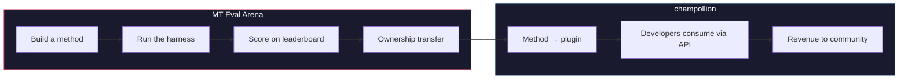

# The MT Eval Arena

> **Resumen Ejecutivo.** MT Eval Arena es una plataforma abierta de evaluación comparativa para métodos de traducción automática, con enfoque en idiomas donde la traducción automática comercial no existe o no ha sido verificada de forma independiente. Proporciona evaluación estandarizada, una tabla de clasificación pública y un puente de implementación a producción a través de champollion. Para idiomas indígenas, los métodos probados transfieren la propiedad a la comunidad.

Un espacio abierto de prueba para métodos de traducción automática — especialmente para idiomas donde la traducción automática comercial no existe o no ha sido verificada de forma independiente.

Construya un método. Evalúelo. Demuestre que funciona. Si gana, se implementa.

---

## El Problema

Google Translate admite ~130 idiomas. NLLB-200 de Meta cubre ~200, y OMT-1600 (marzo de 2026) afirma cubrir 1.600. Hay más de 7.000 hablados en la Tierra. Para los ~1.300 idiomas en los niveles de recursos más bajos de OMT-1600, los pesos del modelo no están disponibles, la calidad está por debajo de umbrales utilizables, y la evaluación utilizó texto del dominio bíblico con métricas automáticas estándar — sin validación morfológica, sin pruebas independientes, sin gobernanza comunitaria. Para los ~5.400 idiomas restantes, ningún modelo preentrenado produce salida alguna.

Big Tech ahora está invirtiendo en cobertura de idiomas de recursos limitados — pero cobertura sin verificación de calidad independiente, validación morfológica o gobernanza comunitaria es cobertura sin confianza. Los hablantes que más necesitan herramientas de traducción son las mismas comunidades menos propensas a tenerlas construidas.

**La Arena existe para cambiar eso.** Proporciona la infraestructura para desarrollar, evaluar e implementar métodos de traducción para cualquier idioma — con puntuación reproducible, envío abierto y gobernanza comunitaria sobre quién controla los resultados.

---

## Cómo Funciona

1. **Usted construye un método de traducción** — LLM entrenado, modelo ajustado, tubería controlada por FST, o cualquier otra cosa que produzca traducciones.
2. **El arnés lo evalúa** — métricas estandarizadas (chrF++, coincidencia exacta, aceptación FST), con huella digital en un commit específico de Git.
3. **Los resultados aparecen en la tabla de clasificación** — cada envío es reproducible y comparable.
4. **Si gana, la propiedad se transfiere** — para idiomas indígenas, el código del método ganador se transfiere a la organización de gobernanza comunitaria.
5. **El método se implementa en producción** — a través de [champollion](https://champollion.dev), la API orientada al desarrollador. Los ingresos fluyen de vuelta a la comunidad.

**Demuéstrelo aquí. Impleméntelo allá.**

---

## Para Quién Es Esto

| Usted es... | La Arena le proporciona... |
|---|---|
| **Ingeniero de ML / investigador** | Evaluaciones comparativas estandarizadas, puntuación reproducible, una tabla de clasificación para competir |
| **Lingüista** | Un marco para convertir reglas gramaticales y diccionarios en métodos comprobables |
| **Miembro de la comunidad de idiomas** | Gobernanza sobre cómo se desarrollan e implementan los métodos de su idioma |
| **Financiador / revisor de subvenciones** | Métricas transparentes y reproducibles para evaluar propuestas de investigación en traducción |
| **Estudiante** | Un desafío abierto con impacto real — construya un método, envíe sus puntuaciones |

---

## Evaluaciones Comparativas Actuales

### Conjunto de Desarrollo EDTeKLA v1
- **Par de idiomas:** Inglés → Plains Cree (SRO)
- **Entradas:** 548 pares curados (486 de libro de texto + 62 estándar de oro)
- **Licencia:** CC BY-NC-SA 4.0
- **Fuente:** [Grupo de investigación EdTeKLA](https://spaces.facsci.ualberta.ca/edtekla/), Universidad de Alberta

### FLORES+ Devtest
- **Pares de idiomas:** Inglés → 39 idiomas
- **Entradas:** 1.012 oraciones por idioma
- **Licencia:** CC BY-SA 4.0
- **Fuente:** [OLDI](https://huggingface.co/datasets/openlanguagedata/flores_plus)

---

## La Única Regla

:::danger No entrene con datos de evaluación
Los métodos expuestos al conjunto de datos de evaluación — como datos de entrenamiento, ejemplos de pocos disparos, entradas de diccionario o material de indicación — serán **descalificados**. Ajuste fino con lo que quiera. Solo no con el conjunto de prueba.
:::

---

## Próximos Pasos

- **[Envíe un Método](/docs/getting-started/submit-a-method)** — cómo enviar su primera ejecución de evaluación comparativa
- **[Especificación de Evaluación Comparativa](/docs/specifications/benchmark)** — el protocolo de experimento completo
- **[Reglas de la Tabla de Clasificación](/docs/leaderboard/rules)** — criterios de envío y políticas contra manipulación
- **[Soberanía de Datos](/docs/sovereignty/data-sovereignty)** — OCAP, CARE, y por qué la transferencia de propiedad importa
- **[El Modelo Económico](/docs/sovereignty/economic-model)** — cómo las puntuaciones de la Arena se convierten en ingresos comunitarios

**[→ Ver la Tabla de Clasificación](https://champollion.dev/leaderboard)**