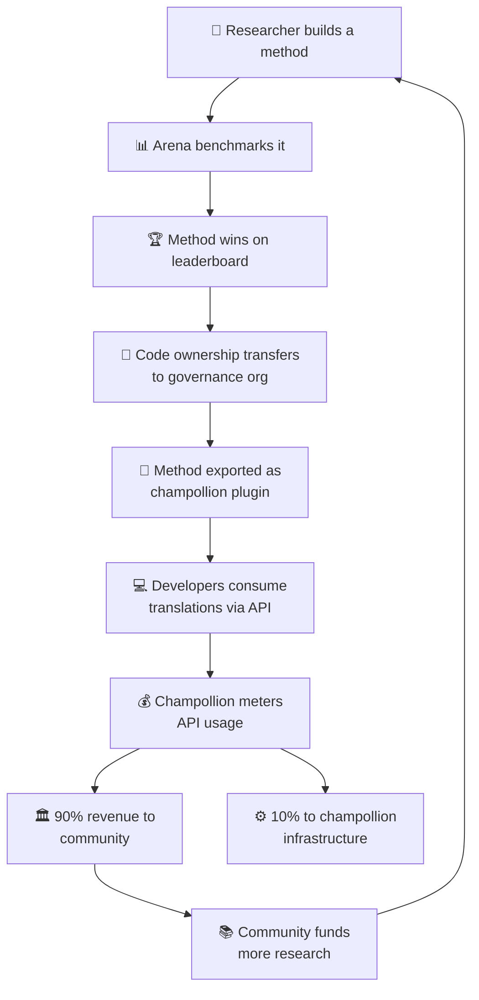

# El Modelo Económico

> **Resumen Ejecutivo.** Esta página describe el ciclo económico que conecta la Arena y champollion: la investigación produce métodos, los métodos se despliegan como plugins, el uso de la API genera ingresos, y el 90% de los ingresos fluye hacia la comunidad lingüística. Cubre el mecanismo de ciclo virtuoso, distribución de ingresos, capa de conveniencia, y el caso de sostenibilidad para financiadores.

La Arena y champollion forman un ciclo económico cerrado. La investigación en la Arena produce métodos. Los métodos se despliegan a través de champollion. Los ingresos de champollion fluyen de vuelta hacia las comunidades cuyos idiomas sirven los métodos.

---

## El Ciclo Virtuoso

Cada vuelta del ciclo virtuoso fortalece el ecosistema:
- **Más investigación** produce mejores métodos
- **Mejores métodos** atraen más desarrolladores
- **Más desarrolladores** generan más ingresos de API
- **Más ingresos** financian más investigación liderada por la comunidad

---

## Cómo Fluyen los Ingresos

Cuando un desarrollador utiliza un método de propiedad comunitaria a través de la API de champollion:

| Paso | Qué Sucede |
|---|---|
| El desarrollador llama a `champollion sync` o a la API REST | Las traducciones son producidas por el método de propiedad comunitaria |
| Champollion mide la llamada de API | El uso se rastrea por solicitud, por par de idiomas |
| Los ingresos se dividen | **90%** va a la organización de gobernanza que posee el método. **10%** cubre los costos de infraestructura de champollion. |
| La comunidad decide la asignación | Los ingresos financian programas lingüísticos, investigación adicional, recursos comunitarios — lo que la organización de gobernanza decida |

### La Capa de Conveniencia

Champollion también sirve configuraciones optimizadas para métodos comunes. Si un investigador demuestra que Gemini 2.5 Pro con datos de coaching específicos y configuración de temperatura produce los mejores resultados para un par de idiomas, esa configuración está disponible como un preset preconfigurado a través de la API de champollion. Los desarrolladores no necesitan replicar la investigación — simplemente llaman a la API.

La Arena establece las líneas base. Champollion las hace accesibles. Las comunidades se benefician de ambas.

---

## Para Idiomas Estándar

El ciclo virtuoso tiene mayor impacto para idiomas indígenas y de recursos limitados, donde se aplican la transferencia de propiedad y el modelo de ingresos comunitarios.

Para idiomas estándar (francés, japonés, español, etc.), champollion ofrece la misma conveniencia de API sin la capa de gobernanza — los desarrolladores pagan por acceso medido a métodos de traducción preconfigurados, y champollion toma una parte de infraestructura.

---

## Para Financiadores

El modelo económico aborda una preocupación común en la financiación de tecnología lingüística: **la sostenibilidad después de que termina la subvención.**

| Modelo Tradicional | Modelo de Arena |
|---|---|
| La subvención financia la investigación | La subvención financia la investigación |
| Artículo publicado | Método desplegado a producción |
| La subvención termina, la herramienta se abandona | Los ingresos de API sostienen las operaciones |
| La comunidad no recibe nada | La comunidad posee el activo y genera ingresos |

Un único método exitoso crea un flujo de ingresos autosustentable. Los financiadores pueden medir el impacto no solo en publicaciones, sino en:
- Uso de API (cuántos desarrolladores utilizan el método)
- Ingresos generados (cuánto dinero fluye hacia la comunidad)
- Métricas de calidad (puntuaciones del leaderboard a lo largo del tiempo)
- Cobertura de idiomas (cuántos pares de idiomas se sirven)

Consulte la [Especificación de Benchmark](/docs/specifications/benchmark), §10 para modelos de costos detallados.

---

## Véase También

- [Transferencia de Propiedad](/docs/sovereignty/ownership-transfer) — el proceso de transferencia legal y técnica
- [Soberanía de Datos](/docs/sovereignty/data-sovereignty) — principios OCAP, CARE, y Te Mana Raraunga
- [Reglas del Leaderboard](/docs/leaderboard/rules) — cómo los métodos califican para el despliegue