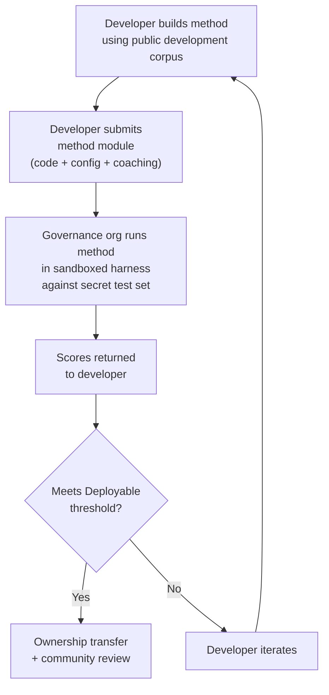

# Especificación de Referencia

> **Resumen Ejecutivo.** Este documento define el protocolo de evaluación para el ecosistema de evaluación de MT de Champollion: formato de corpus (§2), esquema de tarjeta de ejecución (§3), protocolo de referencia (§6), requisitos de validación humana (§7), mecanismos de soberanía (§8), modelo de leaderboard y envío (§9), marco de costos (§10), y extensibilidad a nuevos idiomas (§11). Para definiciones de métricas, pesos de puntuación compuesta, umbrales de nivel de calidad, y fórmulas de métricas de costo/velocidad, consulte `SCORING_SPEC.md` — la fuente única de verdad para toda la lógica de puntuación. Este documento hace referencia a SCORING_SPEC para esos detalles en lugar de duplicarlos.
>
> Última actualización: 2026-06-07

---

## 1. Principios

### 1.1 Las Métricas Automatizadas Son Aproximaciones

Cada métrica definida en este documento se calcula por máquina. chrF++, aceptación FST, precisión morfológica, similitud semántica — todas ellas son aproximaciones automatizadas de la calidad de la traducción. Son útiles para iteración rápida, comparación sistemática y detección de regresiones. **No son sustitutos del juicio humano**.

La jerarquía de evaluación:

```
Automated metrics (run cards, benchmarks)
    ↓ proxy for
Human review (bilingual speakers validate output)
    ↓ proxy for
Actual utility (does this help a language community?)
```

Ninguna puntuación automatizada, sin importar cuán alta sea, puede reemplazar a un hablante fluido leyendo el resultado y confirmando que es correcto, natural y culturalmente apropiado. Los niveles de calidad definidos en §5 son etiquetas heurísticas en puntuaciones compuestas automatizadas — útiles para rastrear el progreso, pero nunca suficientes por sí solos.

### 1.2 Métodos, No Modelos

Evaluamos **métodos**, no modelos. Un modelo es un componente. Un método es la receta completa: selección de modelo, diseño de indicaciones, uso de herramientas, pre/post-procesamiento, datos de entrenamiento, estrategias de reintento, todo. Dos equipos que usan el mismo modelo con métodos diferentes obtendrán puntuaciones diferentes. Ese es el punto.

### 1.3 Reproducibilidad

Cada resultado de referencia debe ser reproducible. La tarjeta de ejecución (§3) captura la configuración completa de un experimento. La huella digital (§3.5) identifica la configuración experimental. El hash de la tarjeta de ejecución (§3.6) verifica la integridad del resultado. Cualquiera con el mismo método, corpus y configuración debe lograr puntuaciones dentro de ±2% (contabilizando la no determinismo de muestreo de LLM a temperatura > 0).

### 1.4 Sin Datos de Evaluación Sintéticos

**Este proyecto no genera, utiliza ni respalda datos de evaluación sintéticos.** Todos los corpus deben provenir de texto auténtico escrito por humanos — traducciones publicadas, libros de texto, documentos bilingües, o traducciones obtenidas de hablantes fluidos.

Los LLM pueden ayudar con:
- Alineación de oraciones (encontrar pasajes paralelos en textos bilingües existentes)
- Conversión de formato (convertir materiales publicados al esquema de corpus)
- Enriquecimiento de metadatos (sugerir niveles de dificultad, etiquetas de registro)
- Proponer oraciones fuente para traducción humana (§11.3 — el paso de traducción es siempre humano)

Los LLM **nunca** deben generar traducciones de referencia o pares de evaluación.

**Somos neutrales en desarrollo respecto a datos de entrenamiento.** Si un desarrollador de métodos utiliza datos de entrenamiento sintéticos, retrotraducción, o aumento de datos en su método, esa es su elección — evaluamos el resultado, no el proceso de entrenamiento. El OMT-1600 de Meta utiliza aproximadamente 270 millones de oraciones paralelas sintéticas generadas mediante retrotraducción. No tenemos objeción a métodos entrenados de esta manera. Probamos solo en curación humana.

> **¿Por qué no texto bíblico para evaluación?** OMT-1600 evalúa 1.560 de 1.600 idiomas en texto del dominio bíblico. Las traducciones bíblicas tienen registro arcaico, vocabulario litúrgico y estructura de oración formulaica. Nuestros corpus de evaluación se obtienen de texto curado por la comunidad, diverso en dominio — salud, legal, educativo, gubernamental, conversacional y dominios técnicos (ver §2.7). Esta es una opción de diseño deliberada. Las comunidades necesitan traducción para los dominios donde realmente viven y trabajan, no un único registro religioso. Un método que obtiene una buena puntuación en Génesis 1:1 te dice casi nada sobre su desempeño en una agenda de consejo de banda o un formulario de admisión de clínica.

---

## 2. Esquema de Corpus

Un corpus es un conjunto curado de pares de texto paralelo con metadatos estructurados. Es la verdad fundamental contra la cual se miden todos los métodos.

### 2.1 Envolvente de Conjunto de Datos

La estructura de nivel superior de un archivo de corpus:

```json
{
  "dataset": {
    "id": "edtekla-dev-v1",
    "version": "1.0",
    "language_pair": "EN→CRK",
    "source_language": "en",
    "target_language": "crk",
    "created": "2026-05-01",
    "license": "CC-BY-NC-SA-4.0",
    "provenance": ["gold_standard", "textbook"]
  },
  "entries": [ ... ]
}
```

| Campo | Tipo | Requerido | Descripción |
|-------|------|----------|-------------|
| `id` | string | ✅ | Identificador único del conjunto de datos, utilizado en tarjetas de ejecución y leaderboard |
| `version` | string | ✅ | Versión semántica. Incrementar invalida comparaciones previas de tarjetas de ejecución |
| `language_pair` | string | ✅ | Etiqueta de visualización (p. ej., `EN→CRK`) |
| `source_language` | string | ✅ | Código de idioma fuente BCP 47 |
| `target_language` | string | ✅ | Código de idioma destino BCP 47 |
| `created` | string | ✅ | Fecha de creación ISO 8601 |
| `license` | string | ✅ | Identificador de licencia SPDX |
| `provenance` | string[] | ✅ | Lista de etiquetas de procedencia utilizadas en todas las entradas |

### 2.2 Esquema de Entrada

Cada entrada en el corpus representa un desafío de traducción:

```json
{
  "id": 42,
  "source": "I see the dog",
  "reference": "niwâpamâw atim",
  "segment": "gold_standard",
  "difficulty": 2,
  "provenance": "gold_standard",
  "register": "conversational",
  "context": "declaration",
  "morphological_analysis": "ni-wâpam-âw atim | 1sg-see.TA-3sg.DIR dog.AN",
  "notes": "Animate noun (atim); direct form because speaker is proximate",
  "variant_class": "simple-ta-direct"
}
```

| Campo | Tipo | Requerido | Descripción |
|-------|------|----------|-------------|
| `id` | integer | ✅ | Identificador único dentro del corpus |
| `source` | string | ✅ | Texto fuente en el idioma fuente |
| `reference` | string | ✅ | Traducción de referencia estándar de oro en el idioma destino |
| `segment` | string | 📎 | Partición de corpus: `gold_standard`, `held_out`, `development`, o `diagnostic` |
| `difficulty` | integer | 📎 | Calificación de dificultad 1–5 (ver §2.4) |
| `provenance` | string | 📎 | Origen de esta entrada (ver §2.5) |
| `register` | string | 📎 | Nivel de registro/formalidad (ver §2.6) |
| `context` | string | 📎 | Función comunicativa (ver §2.6) |
| `domain` | string | 📎 | Dominio de caso de uso de la taxonomía de 16 códigos (ver §2.7). Debe ser uno de: `conv`, `ecommerce`, `edu`, `financial`, `gov`, `legal`, `literary`, `marketing`, `medical`, `news`, `religious`, `scientific`, `subtitles`, `support`, `tech`, `ui`. Validado en tiempo de construcción. |

> **📎 = RECOMENDADO.** El arnés maneja campos opcionales faltantes con elegancia mediante valores predeterminados. Los corpus de terceros solo necesitan proporcionar `id`, `source`, y `reference` por entrada.
| `morphological_analysis` | string | ❌ | Desglose morfológico estándar de oro |
| `notes` | string | ❌ | Notas del traductor, variantes dialectales, banderas de ambigüedad |
| `variant_class` | string | ❌ | Etiqueta de clase agrupando variantes de traducción aceptables |


### 2.3 Segmentos de Corpus

El corpus se divide en segmentos con diferentes niveles de acceso:

| Segmento | Propósito | Acceso | Tamaño Mínimo |
|---------|---------|--------|-------------|
| `development` | Desarrollo e iteración de métodos. Los desarrolladores los usan libremente. | **Público** | 30 entradas |
| `diagnostic` | Pruebas dirigidas para fenómenos lingüísticos específicos. | **Público** | 10 entradas |
| `gold_standard` | Evaluación oficial de referencia. Las puntuaciones del leaderboard provienen de aquí. | **Secreto** — mantenido por organización de gobernanza | 50 entradas |
| `held_out` | Reservado para evaluación futura. Nunca se usa hasta que se active. | **Secreto** — mantenido por organización de gobernanza | 10 entradas |

> **Estado actual:** Solo el segmento `development` existe en conjuntos de datos enviados. Los segmentos `diagnostic`, `gold_standard`, y `held_out` se definen para uso futuro a medida que los corpus crecen.

Los segmentos `gold_standard` y `held_out` son completamente secretos. Tanto las oraciones fuente como las traducciones de referencia se mantienen en infraestructura controlada por gobernanza. Los desarrolladores de métodos nunca ven las preguntas ni las respuestas. Ver §8 para el mecanismo de soberanía.

### 2.4 Niveles de Dificultad

| Nivel | Descripción | Ejemplos |
|------|-------------|----------|
| 1 — Vocabulario básico | Palabras individuales, saludos comunes, números | "hello" → "tânisi", "dog" → "atim" |
| 2 — Oraciones simples | Sujeto-verbo o SVO, tiempo presente | "I see the dog" → "niwâpamâw atim" |
| 3 — Complejidad moderada | Tiempo pasado/futuro, posesivos, animacidad | "I saw his dog yesterday" |
| 4 — Morfología compleja | Obviación, voz pasiva, orden conjuntivo, cláusulas relativas | "the woman whose son went to the store" |
| 5 — Avanzado | Multi-cláusula, registro formal, ceremonial, idiomático | Párrafo completo con tono apropiado al registro |

Un corpus bien construido debe incluir entradas en todos los cinco niveles de dificultad, ponderados hacia los niveles 2–4 donde caen la mayoría de los desafíos de traducción del mundo real.

### 2.5 Etiquetas de Procedencia

Cada entrada debe indicar su origen:

| Etiqueta | Significado |
|-----|---------|
| `gold_standard` | Verificado por hablantes fluidos |
| `textbook` | De materiales educativos publicados |
| `elicited` | Producido a través de sesiones de elicitación estructurada |
| `corpus` | Extraído de un corpus paralelo |

> **Nota:** En la práctica, los valores de procedencia son cadenas de forma libre. Las etiquetas anteriores son convenciones, no una enumeración validada — los conjuntos de datos pueden usar otras cadenas de procedencia descriptivas.

### 2.6 Registro y Contexto

**Registro** describe la formalidad y contexto social:

| Registro | Descripción |
|----------|-------------|
| `conversational` | Habla cotidiana entre iguales |
| `formal` | Lenguaje oficial o institucional |
| `technical` | Vocabulario específico del dominio |
| `ceremonial` | Uso de lenguaje tradicional o sagrado |
| `educational` | Materiales de enseñanza de idiomas |

**Contexto** describe la función comunicativa:

> 🔲 **Planeado.** El campo `context` se define en el esquema pero aún no se completa en los conjuntos de datos actuales. Se reserva para enriquecimiento futuro del corpus.

| Contexto | Descripción |
|---------|-------------|
| `greeting` | Saludo social o despedida |
| `declaration` | Declaración de hecho |
| `question` | Interrogativo |
| `instruction` | Comando o directiva |
| `narrative` | Narración o descripción |
| `label` | Etiqueta de UI, texto de botón, o encabezado |
| `error` | Mensaje de error o advertencia |

### 2.7 Dominio {#27-domain}

**Dominio** describe el caso de uso del mundo real — el tipo de contenido que se está traduciendo. Esto es ortogonal al registro y contexto:

- **Registro** responde: *¿Qué tan formal es esto?*
- **Contexto** responde: *¿Qué está haciendo esta oración?*
- **Dominio** responde: *¿Para qué industria/caso de uso es esto?*

Un contrato legal (dominio: `legal`) podría ser formal (registro: `formal`) y contener una declaración (contexto: `declaration`). Una transcripción de chatbot legal (dominio: `legal`) podría ser conversacional (registro: `conversational`) y contener preguntas (contexto: `question`). Mismo dominio, diferente registro y contexto.

| Código de Dominio | Descripción | Consumidores Típicos |
|-------------|-------------|-------------------|
| `ui` | Cadenas de interfaz de software | Desarrolladores de aplicaciones, equipos de localización |
| `legal` | Contratos, estatutos, presentaciones judiciales, documentos de inmigración | Bufetes de abogados, tribunales, equipos de cumplimiento, abogados de PI |
| `medical` | Notas clínicas, etiquetas de medicamentos, comunicaciones con pacientes, protocolos de ensayos | Hospitales, farma, ensayos clínicos, portales de pacientes |
| `financial` | Banca, seguros, presentaciones regulatorias, informes de auditoría | Bancos, aseguradoras, reguladores, auditores |
| `edu` | Libros de texto, currículos, planes de lecciones, materiales académicos | Escuelas, universidades, editoriales de libros de texto |
| `ecommerce` | Descripciones de productos, reseñas, listados de mercado | Minoristas en línea, vendedores de mercado |
| `marketing` | Copia publicitaria, mensajería de marca, campañas, eslóganes | Agencias publicitarias, equipos de marca |
| `gov` | Documentos de política, regulaciones, avisos públicos, legislación | Agencias gubernamentales, equipos de cumplimiento |
| `scientific` | Artículos de investigación, resúmenes, metodología, propuestas de subvenciones | Investigadores, revistas, agencias de subvenciones |
| `religious` | Escritura, textos litúrgicos, comentario teológico | Comunidades de fe, editoriales litúrgicas |
| `support` | Preguntas frecuentes, mensajes de error, guías de solución de problemas, scripts de chatbot | Empresas SaaS, mesas de ayuda |
| `subtitles` | Diálogo de cine, TV, streaming y videojuegos | Plataformas de streaming, estudios, empresas de videojuegos |
| `news` | Periodismo, reportes de agencias, editorial, comunicados de prensa | Organizaciones de medios, agencias de noticias |
| `literary` | Ficción, poesía, narrativa, textos culturales | Editoriales, organizaciones de preservación cultural |
| `conv` | Conversación informal, redes sociales, mensajería | Aplicaciones de consumidor, plataformas sociales |
| `tech` | Documentación de API, manuales, especificaciones de ingeniería, guías técnicas | Equipos de documentación, organizaciones de ingeniería |

> **Benchmarks específicos de dominio.** El benchmark general evalúa un método en todos los dominios. Pero la Arena también admite **benchmarks filtrados por dominio** — donde las puntuaciones se calculan solo en entradas etiquetadas con un dominio específico. Esto permite a los usuarios responder: "¿Cuál es el mejor método para traducir documentos legales al francés?" vs. "¿Cuál es la mejor puntuación general de francés?"
>
> Las clasificaciones del leaderboard filtradas por dominio son una característica clave del producto. Diferentes métodos tendrán un desempeño diferente en dominios — un método ajustado en terminología legal puede dominar benchmarks legales pero tener un desempeño inferior en texto conversacional. La Arena ayuda a los usuarios a encontrar la solución que funciona mejor para su caso de uso específico.

> **Futuro: Chatbot de Arena.** El sitio web de la Arena incluirá un asistente conversacional que ayuda a los usuarios a describir su caso de uso de MT (dominio, par de idiomas, requisitos de calidad) y recomienda el mejor método validado por la comunidad del leaderboard. Por ejemplo: "Necesito traducir protocolos de ensayos clínicos del inglés al japonés — ¿cuál es el método con la puntuación más alta en benchmarks de dominio médico EN→JA?" Esto depende de tener suficientes datos de evaluación etiquetados por dominio y diversidad de métodos.

---

## 3. Esquema de Tarjeta de Ejecución {#3-run-card-schema}

La tarjeta de ejecución es la unidad atómica de evaluación. Es un documento JSON independiente que registra la configuración completa y los resultados de una única ejecución de evaluación: un método, un modelo, una configuración, un conjunto de datos.

Cada tarjeta de ejecución captura tres dimensiones:
- **Calidad** — ¿qué tan buenas son las traducciones?
- **Costo** — ¿cuánto costó producirlas?
- **Velocidad** — ¿cuánto tiempo tomó?

### 3.1 Campos de Nivel Superior

| Campo | Tipo | Descripción |
|-------|------|-------------|
| `run_id` | string | UUID v4 generado al inicio de la ejecución |
| `harness_version` | string | Versión semántica del arnés (p. ej., `2.0`) |
| `timestamp` | string | Marca de tiempo UTC ISO 8601 cuando comenzó la ejecución |
| `elapsed_seconds` | number | Duración de reloj de pared de toda la ejecución |

### 3.2 Configuración de Método

Estos campos definen la configuración experimental — qué se probó y cómo.

| Campo | Tipo | Requerido | Descripción |
|-------|------|----------|-------------|
| `model_slug` | string | ✅ | Identificador de modelo (p. ej., `google/gemini-2.5-flash`) |
| `model_id` | string | ❌ | Identificador de modelo resuelto devuelto por la API |
| `condition` | string | ✅ | Etiqueta de experimento (p. ej., `baseline`, `coached-v3`, `few-shot`) |
| `temperature` | number | ✅ | Temperatura de muestreo |
| `system_prompt_sha256` | string | ✅ | Hash SHA-256 del indicador del sistema completo |
| `system_prompt_used` | string | ✅ | Texto del indicador del sistema completo |
| `coaching_data_sha256` | string | ❌ | Hash SHA-256 del archivo de datos de entrenamiento, si se usa |
| `fst_version` | string | ❌ | Versión del analizador FST, si se usa |
| `tools_enabled` | string[] | ❌ | Lista de herramientas disponibles para el método |
| `batch_size` | number | ❌ | Entradas por lote de API concurrente |
| `max_retries` | number | ❌ | Reintentos máximos para rechazo FST, si aplica |

:::info Las Tarjetas de Ejecución Publicadas Incluyen method_config
Cuando una tarjeta de ejecución se publica en el leaderboard (vía `mt-eval publish`), también incluye un bloque `method_config` que contiene el MethodConfig canónico de 8 campos (`model`, `temperature`, `batchSize`, `register`, `coachingFile`, `coachingPrompt`, `promptContext`, `qualityTier` — todos en camelCase). Esto permite importación de cero reconstrucción: `champollion leaderboard --install` lee `method_config` directamente y lo escribe como un manifiesto de plugin. Los campos de telemetría anteriores (§3.2) registran lo que el arnés observó; `method_config` registra lo que el desarrollador pretendía.
:::

### 3.3 Referencia de Conjunto de Datos

| Campo | Tipo | Descripción |
|-------|------|-------------|
| `dataset.id` | string | Identificador del conjunto de datos |
| `dataset.version` | string | Versión del conjunto de datos |
| `dataset.language_pair` | string | Etiqueta de visualización |
| `dataset.sha256` | string | Hash SHA-256 del contenido del archivo del conjunto de datos |
| `dataset.entry_count` | number | Número de entradas evaluadas |

El SHA-256 del conjunto de datos fija el resultado a una versión específica de los datos. Si el conjunto de datos cambia, las tarjetas de ejecución antiguas no son comparables.

### 3.4 Puntuaciones (Calidad)

Métricas agregadas para toda la ejecución. Todas las métricas de calidad son **automatizadas** — ver §1.1.

| Campo | Tipo | Descripción |
|-------|------|-------------|
| `scores.total` | number | Total de entradas evaluadas |
| `scores.exact_matches` | number | Entradas donde la salida coincidió exactamente con la referencia |
| `scores.exact_match_rate` | number | 0.0–1.0 |
| `scores.equivalent_matches` | number | Entradas que coinciden con una variante aceptable |
| `scores.equivalent_match_rate` | number | 0.0–1.0 |
| `scores.fst_accepted` | number | Entradas aceptadas por el analizador FST |
| `scores.fst_acceptance_rate` | number | 0.0–1.0, `null` si no hay FST configurado |
| `scores.morphological_accuracy` | number | 0.0–1.0, `null` si no hay análisis estándar de oro |
| `scores.chrf_plus_plus` | number | Puntuación chrF++ a nivel de corpus (0–100) |
| `scores.semantic_score` | number | Similitud semántica basada en incrustación (0.0–1.0) |
| `scores.ter` | number | Tasa de Edición de Traducción (0–∞, menor es mejor) |
| `scores.length_ratio` | number | avg(len(predicted)/len(reference)), ideal = 1.0 |
| `scores.code_switching_rate` | number | 0.0–1.0, fracción de entradas con fuga de idioma fuente |
| `scores.hallucination_rate` | number | 0.0–1.0, fracción de entradas con contenido alucinado |
| `scores.terminology_adherence` | number | 0.0–1.0, adherencia a términos de glosario (`null` si no hay glosario) |
| `scores.tokens_per_second` | number | total_tokens / elapsed_seconds |
| `scores.entries_per_minute` | number | entradas traducidas por minuto |
| `scores.composite` | number | Puntuación compuesta ponderada (0.0–1.0). Ver SCORING_SPEC §4 |
| `scores.errors` | number | Entradas que fallaron (error de API, tiempo de espera, etc.) |
| `scores.by_difficulty` | object | Puntuaciones desglosadas por nivel de dificultad |
| `scores.by_provenance` | object | Puntuaciones desglosadas por etiqueta de procedencia |
| `scores.by_domain` | object | ✅ Implementado — Puntuaciones desglosadas por dominio (§2.7). Permite clasificación de leaderboard filtrada por dominio. Calculado por tester.py y pasado a través de publish.py. |

### 3.5 Totales (Costo)

| Campo | Tipo | Descripción |
|-------|------|-------------|
| `totals.prompt_tokens` | number | Total de tokens de entrada en todas las llamadas de API |
| `totals.completion_tokens` | number | Total de tokens de salida |
| `totals.reasoning_tokens` | number | Tokens utilizados para cadena de pensamiento (0 para la mayoría de modelos) |
| `totals.cached_tokens` | number | Tokens servidos desde la caché de indicador del proveedor |
| `totals.total_cost_usd` | number | Costo total en USD |
| `totals.cost_per_entry_usd` | number | `total_cost_usd / entry_count` |
| `totals.cost_per_source_char` | number | USD por carácter fuente — comparable entre idiomas |

### 3.6 Temporización (Velocidad)

| Campo | Tipo | Descripción |
|-------|------|-------------|
| `elapsed_seconds` | number | Duración de reloj de pared de la ejecución completa (nivel superior) |
| `scores.avg_latency_seconds` | number | Tiempo de respuesta promedio por entrada |
| `scores.median_latency_seconds` | number | Tiempo de respuesta mediano por entrada |
| `scores.p95_latency_seconds` | number | Tiempo de respuesta del percentil 95 por entrada |

### 3.7 Resultados Por Entrada

Cada entrada en el array `results[]` registra una traducción. Los datos por entrada se persisten en la tabla `run_card_entries` (migración 005) con veredictos LYSS desnormalizados (migración 006).

| Campo | Tipo | Descripción |
|-------|------|-------------|
| `entry_id` | string | Coincide con `entries[].id` en el corpus |
| `source` | string | Texto fuente que fue traducido |
| `expected` | string | Traducción de referencia estándar de oro |
| `raw_predicted` | string \| null | Salida del modelo sin procesar antes del post-procesamiento |
| `predicted` | string | Salida real del método (post-procesada) |
| `segment` | string | Identificador de segmento (p. ej., índice de oración) |
| `difficulty` | string \| null | Nivel de dificultad del corpus |
| `domain` | string | Etiqueta de dominio del corpus (§2.7) |
| `exact_match` | boolean | Si la salida coincidió exactamente con la referencia |
| `chrf_score` | number \| null | chrF++ a nivel de oración (0–100) |
| `bleu_score` | number \| null | BLEU a nivel de oración (0–100) |
| `latency_s` | number \| null | Tiempo de respuesta en segundos |
| `cost_usd` | number \| null | Costo en USD para esta entrada |
| `tool_call_count` | integer | Número de llamadas de herramienta utilizadas (0 si ninguna) |
| `error` | string \| null | Mensaje de error si esta entrada falló |
| `plugin_metrics` | object | Salida completa del plugin por entrada (JSONB) |
| `fst_valid` | boolean \| null | El FST de GiellaLT aceptó la predicción (LYSS-fst desnormalizado) |
| `equivalent_match` | boolean \| null | El linter de CRK confirmó equivalencia estructural (LYSS-eq desnormalizado) |
| `semantic_verdict` | string \| null | Veredicto LYSS-sem: `VALID`, `MISMATCH`, `UNKNOWN`, `ERROR` |
| `code_switching_detected` | boolean \| null | Tokens de idioma fuente detectados en la salida |
| `hallucination_detected` | boolean \| null | Contenido fabricado detectado en la salida |


### 3.8 Huella Digital

Un identificador de reproducibilidad. Dos ejecuciones con huellas digitales idénticas utilizaron la misma configuración experimental.

La huella digital es el hash SHA-256 de la concatenación ordenada de:
- `dataset.sha256`
- `model_slug`
- `condition`
- `system_prompt_sha256`
- `temperature`
- `harness_version`
- `batch_size`
- `tools_enabled`

> **¿Por qué 8 componentes?** El tamaño del lote y la llamada de herramientas afectan materialmente la calidad de la salida y deben incluirse en la identidad. Dos ejecuciones con diferentes tamaños de lote o diferentes herramientas habilitadas son configuraciones experimentales diferentes, incluso si todos los demás parámetros coinciden.

Dos ejecuciones con huellas digitales idénticas deben producir resultados comparables. Las diferencias se deben a no determinismo de API (temperatura > 0) o actualizaciones de modelo del lado del proveedor.

### 3.9 Hash de Tarjeta de Ejecución

El hash SHA-256 de toda la tarjeta de ejecución JSON (con el campo `run_card_hash` establecido en `""` durante el hash). Este es el sello de detección de manipulación. Si algún campo cambia, el hash se rompe.

---

## 4. Métricas Automatizadas

Todas las métricas en esta sección se calculan por máquina. Ver §1.1.

### 4.1 Definiciones de Métricas

| Métrica | Estado | Qué Mide | Rango |
|--------|--------|-----------------|-------|
| **chrF++** | ✅ Implementado | Puntuación F de n-gramas de caracteres. Opera a nivel de carácter, lo que lo hace más robusto que métricas a nivel de palabra (BLEU) para idiomas morfológicamente ricos donde las palabras son largas y altamente flexionadas. Calculado por sacrebleu. | 0–100 (escala nativa). Dividido por 100 cuando se usa en compuesto. |
| **Tasa de aceptación FST** | ✅ Implementado | Fracción de palabras predichas aceptadas por el analizador morfológico (HFST de GiellaLT) como formas válidas en el idioma destino. Una palabra que el FST acepta es una palabra real, estructuralmente válida — no una alucinación. | 0.0–1.0 |
| **Coincidencia exacta** | ✅ Implementado | Fracción de predicciones que coinciden exactamente con la referencia después de la normalización Unicode. Estricto pero inequívoco — útil como verificación de techo. | 0.0–1.0 |
| **Precisión morfológica** | 🔲 Planeado | Para entradas con análisis morfológico estándar de oro: fracción de morfemas generados correctamente. Más granular que aceptación FST — una palabra puede ser válida en FST pero tener la estructura de morfema incorrecta (raíz correcta, tiempo incorrecto). | 0.0–1.0 |
| **Coincidencia equivalente** | ⚡ Parcial | Fracción que coincide con una variante aceptable de la referencia — contabilizando orden de palabras, diferencias dialectales y convenciones ortográficas. Actualmente implementado para CRK vía el estándar de evaluación de CRK `CrkLinterMetric` (en `eval_standards/crk/`); cargado automáticamente vía la declaración `evalMetrics` de la tarjeta de idioma de CRK. La implementación genérica requiere `variants[]` por entrada en corpus. | 0.0–1.0 |
| **Puntuación semántica** | ⚡ Parcial | Preservación de significado independientemente de la forma de superficie. Actualmente implementado para CRK vía el estándar de evaluación de CRK `CrkSemanticMetric` (en `eval_standards/crk/`, proxy ponderado por veredicto). La similitud de coseno basada en incrustación universal está planeada — ver SCORING_SPEC §2.3. | 0.0–1.0 |

### 4.2 Puntuación Compuesta

La puntuación compuesta es un promedio ponderado de todas las métricas *disponibles*:

```
composite = Σ (weight_i × metric_i)   for all available metrics
             ─────────────────────
             Σ weight_i              (renormalized to sum to 1.0)
```

Cuando una métrica no está disponible (sin FST configurado, sin clases de variante definidas, sin modelo de incrustación), su peso se redistribuye proporcionalmente entre las métricas restantes. Esto significa que la compuesta siempre es comparable dentro de un idioma — utiliza cualquier métrica disponible para ese idioma y normaliza en consecuencia.

**Las tablas de peso, reglas de normalización de entrada, y el inventario completo de métricas se definen en `SCORING_SPEC.md` §4.** Ese documento es la SSOT para:
- Pesos del Perfil A (idiomas con cobertura FST — 9 métricas, métricas estructurales llevan 40%)
- Pesos del Perfil B (idiomas sin cobertura FST — 8 métricas)
- Reglas de normalización (chrF++ ÷ 100, inversión de cambio de código y tasa de alucinación)
- Métricas excluidas de la compuesta (BLEU, COMET, TER, relación de longitud, consistencia) y por qué

El código del arnés refleja estas tablas en `mt_eval_harness/scoring.py`. Cuando SCORING_SPEC cambia, `scoring.py` se actualiza para coincidir y `test_scoring_ssot.py` valida la alineación.

> **¿Por qué no BLEU?** BLEU opera a nivel de palabra y penaliza la variación morfológica. Para idiomas polisintéticos, una sola palabra puede ser una cláusula completa — BLEU trataría diferencias flexionales menores como fallos completos. chrF++ maneja esto mejor operando a nivel de carácter. BLEU se excluye de ambas tablas de peso. Ver SCORING_SPEC Apéndice A para la justificación completa.


### 4.3 Puntuación Ajustada por Costo

Para métodos que utilizan API pagadas, también reportamos una clasificación secundaria. La fórmula ajustada por costo se define en `SCORING_SPEC.md` §6.3.

---

## 5. Niveles de Calidad {#5-quality-tiers}

Los niveles de calidad son etiquetas heurísticas en puntuaciones compuestas automatizadas. Describen lo que las puntuaciones tienden a significar en la práctica, basado en revisión humana de salidas en cada nivel. **No son juicios de calidad validados** — solo la revisión humana (§6) puede confirmar usabilidad real.

**Los umbrales de nivel y descripciones se definen en `SCORING_SPEC.md` §5.** Los niveles son: Línea Base (0.00–0.30), Emergente (0.30–0.50), Funcional (0.50–0.70), Desplegable (0.70–0.85), y Fluido (0.85–1.00).

> [!IMPORTANT]
> **Los niveles automatizados son provisionales.** Estas etiquetas son nominaciones para revisión, no declaraciones de calidad. Un método que alcanza "Desplegable" en métricas automatizadas es un candidato para evaluación comunitaria — no un producto para enviar. Solo la revisión humana (§7) puede confirmar usabilidad real. Los límites de nivel pueden diferir entre idiomas.

Estos niveles son provisionales. Se recalibrarán a medida que se acumulen datos de validación humana y aprendamos dónde cae el umbral real de "un hablante encuentra esto útil" para cada idioma. Los límites de nivel pueden diferir entre idiomas.

Ningún método puede reclamar **Desplegable** o superior sin revisión comunitaria confirmando que hablantes bilingües acuerdan que la salida es utilizable.

---

## 6. Protocolo de Referencia

Un **benchmark** es la producción sistemática de tarjetas de ejecución en un espacio de parámetros declarado en un conjunto de datos dado. No es una única ejecución — es una exploración estructurada de cómo diferentes configuraciones funcionan.

### 6.1 Lo Que Produce un Benchmark

Un benchmark produce una **matriz de tarjetas de ejecución** — una para cada combinación de valores de parámetros. La matriz permite comparación multifacética en:

- **Calidad** — puntuación compuesta, desgloses de métricas individuales
- **Costo** — costo total y por entrada para cada configuración
- **Velocidad** — tiempo de reloj de pared y latencia por entrada

No hay una única "puntuación de benchmark". El benchmark es la matriz completa. Diferentes partes interesadas se preocuparán por diferentes facetas: un investigador optimiza para puntuación compuesta, un ingeniero de despliegue optimiza para costo por entrada, una comunidad revisa calidad.

### 6.2 Espacio de Parámetros

Un benchmark declara qué parámetros se permutan:

| Eje | Valores Típicos | Propósito |
|-----|---------------|---------|
| `model` | 4–12 modelos (frontera + nivel medio + presupuesto) | ¿Cuánto importa la capacidad del modelo? |
| `temperature` | 0.0, 0.3, 0.7 | ¿La aleatoriedad de muestreo ayuda o daña? |
| `prompt_version` | 2–3 estrategias de indicador | ¿Qué tan sensible es el método al diseño de indicador? |
| `coaching_config` | con/sin datos de entrenamiento | ¿Inyectar conocimiento lingüístico mejora la salida? |
| `tool_config` | con/sin FST, con/sin diccionario | ¿Las herramientas lingüísticas mejoran la salida? |

El espacio de permutación completo:
```
runs = |models| × |temperatures| × |prompts| × |coaching| × |tools|
```

Un benchmark inicial típico: 12 modelos × 3 temperaturas × 2 indicadores × 2 entrenamiento = 144 ejecuciones.

### 6.3 Evaluación de Línea Base vs. Método

Un benchmark sirve dos propósitos distintos:

**Línea base** — mapear el paisaje con enfoques ingenuos. "¿Qué pueden hacer los modelos existentes para este idioma sin ingeniería específica del idioma?" Esto establece la barra. La matriz de línea base te dice: qué modelos alucina menos, qué temperaturas producen la salida más consistente, si los datos de entrenamiento ayudan en absoluto, dónde todos los modelos fallan uniformemente (lo que revela problemas lingüísticos difíciles).

**Evaluación de método** — probar un método específico ingenierizado. "¿Mi pipeline entrenado con puerta FST supera las líneas base?" La tarjeta de ejecución del método se compara contra la matriz de línea base. Un método es interesante cuando supera la mejor línea base — cuando la ingeniería agrega valor sobre llamadas de modelo ingenuas.

Ambas actividades producen tarjetas de ejecución con el mismo esquema. La distinción está en la intención y el espacio de parámetros: las líneas base permutan entre modelos y configuraciones; la evaluación de método prueba un método contra las mejores configuraciones.

### 6.4 Evaluación Dev vs. Estándar de Oro

Los desarrolladores de métodos iteran libremente contra segmentos de corpus `development` y `diagnostic`. Esto es informal — sin límites, sin envíos, sin participación de gobernanza. El desarrollador está aprendiendo qué funciona.

Las puntuaciones oficiales del leaderboard provienen solo de evaluación `gold_standard`. Esto es formal:
1. El desarrollador envía su método completo y ejecutable (código + configuración + datos de entrenamiento)
2. La organización de gobernanza lo ejecuta en un arnés aislado contra el conjunto de prueba secreto
3. Solo las puntuaciones regresan

Ver §8 para el mecanismo de soberanía completo.

---

## 7. Validación Humana {#7-human-validation}

Las métricas automatizadas son aproximaciones. La validación humana es la verdad fundamental.

### 7.1 Lo Que la Revisión Humana Detecta Que las Métricas Pierden

- **Morfológicamente válido pero semánticamente incorrecto** — el FST acepta la palabra, chrF++ es alto, pero la traducción significa algo diferente
- **Culturalmente inapropiado** — la traducción es técnicamente correcta pero utiliza registro o encuadre que una comunidad rechazaría
- **Plausibilidad alucinada** — la salida se parece al idioma destino para un no hablante pero es galimatías para un hablante fluido
- **Variación aceptable pero sin marcar** — la salida es correcta pero las métricas automatizadas la marcan incorrecta porque utiliza una variante dialectal no en la referencia

### 7.2 La Puerta de Validación

Ningún método puede avanzar de nivel **Funcional** a **Desplegable** sin validación humana confirmando que hablantes bilingües acuerdan que la salida es utilizable. Esto no es una formalidad — es el punto. Las métricas automatizadas existen para reducir el volumen de salida que necesita revisión humana. No pueden reemplazarla.

### 7.3 Protocolo de Revisión Comunitaria

> 🔲 **Planeado**: La interfaz de revisión comunitaria aún no está activa. Esta sección describe el proceso previsto.

1. Un método alcanza el umbral Desplegable en métricas automatizadas
2. Una muestra de salidas (estratificada por nivel de dificultad) se presenta a hablantes bilingües
3. Los hablantes califican cada traducción en una escala: **rechazar**, **esencia** (el significado es claro pero la redacción es incorrecta), **aceptable** (correcto con problemas menores), **excelente** (indistinguible de traducción humana)
4. La organización de gobernanza revisa las calificaciones agregadas
5. Si la comunidad acepta el método, procede a transferencia de propiedad y despliegue

---

## 8. Soberanía

Los conjuntos de datos de evaluación contienen conocimiento lingüístico curado que pertenece a la comunidad de idiomas. Esta sección define el marco técnico y legal para proteger esos datos.

### 8.1 El Problema

Los benchmarks convencionales publican conjuntos de prueba abiertamente. Una vez publicados, los datos no pueden ser no publicados. Para comunidades de idiomas indígenas y minoritarios, esto crea una dinámica extractiva — los datos lingüísticos se utilizan sin consentimiento continuo. Siguiendo la vista pragmática de Dhein de la soberanía de biodata, tratamos los datos lingüísticos como un "recurso mercurial con potencial desconocible" que requiere gobernanza dinámica y relacional.

### 8.2 Ejecución Aislada

El mecanismo de aplicación principal: el desarrollador entrega su módulo de método, la organización de gobernanza lo ejecuta contra el conjunto de prueba completamente secreto en su propia infraestructura, y solo se devuelven las puntuaciones. El desarrollador nunca ve las oraciones fuente ni las traducciones de referencia.



El flujo:
1. **El corpus de desarrollo es público.** Sin restricciones en segmentos `development` y `diagnostic`.
2. **El conjunto de prueba estándar de oro es completamente secreto.** Tanto las oraciones fuente como las traducciones de referencia viven en infraestructura controlada por gobernanza.
3. **Para obtener una puntuación oficial, entregas tu método.** La organización de gobernanza lo ejecuta en un sandbox. Solo las puntuaciones regresan.
4. **La organización de gobernanza ya tiene el método.** El envío ES el código del método. Si alcanza el umbral Desplegable, la transferencia de propiedad ya está en progreso.
5. **El envío requiere acuerdo con términos.** Incluyendo la cláusula de transferencia de propiedad (§8.3).
6. **La organización de gobernanza controla el acceso completamente.** Pueden rechazar o revocar evaluación en cualquier momento. Consentimiento dinámico.
7. **La encriptación en reposo es defensa en profundidad.** La aplicación principal es arquitectónica.

### 8.3 Transferencia de Propiedad

Los métodos que logran una puntuación compuesta en o por encima del umbral Desplegable (0.70) contra evaluación estándar de oro, **y** que pasan validación humana (§7), están sujetos a transferencia de propiedad.

**El desarrollador retiene:**
- Atribución y crédito (el nombre permanece en el leaderboard)
- Derecho a publicar sobre el método
- Derecho a usar el método para otros pares de idiomas

**La organización de gobernanza gana:**
- Derecho a usar, modificar, distribuir y monetizar el método para su idioma
- Derecho a sublicenciar
- Posesión física del código del método (ya mantenido de envío de evaluación)

### 8.4 Requisitos de Organización de Gobernanza

Para servir como custodio clave para un benchmark de idioma:

1. **Representar la comunidad de idiomas** — relación demostrable con hablantes y autoridades culturales
2. **Capacidad para gestión de claves** — capacidad técnica para gestionar claves criptográficas
3. **Comprometerse con disponibilidad de evaluación** — el benchmark debe permanecer evaluable
4. **Publicar términos de participación** — documentación clara de lo que los desarrolladores aceptan
5. **Operar bajo principios de soberanía reconocidos** — OCAP®, CARE, o equivalente

### 8.5 Alineación OCAP® y CARE

| Principio | Implementación |
|-----------|---------------|
| **Propiedad** (OCAP) | Los datos lingüísticos pertenecen a la comunidad. La organización de gobernanza controla la infraestructura de evaluación. |
| **Control** (OCAP) | La organización de gobernanza controla la evaluación vía ejecución aislada. Deciden quién envía y en qué términos. |
| **Acceso** (OCAP) | La comunidad tiene acceso sin restricciones a sus propios datos, resultados, y métodos desarrollados contra ellos. |
| **Posesión** (OCAP) | El conjunto de prueba nunca sale de la infraestructura de gobernanza. Encriptación en reposo como respaldo. |
| **Beneficio Colectivo** (CARE) | La transferencia de propiedad asegura que los métodos beneficien a la comunidad. El modelo de ingresos (margen de facturación del 10%; la comunidad retiene ~90%) sustenta esto. |
| **Autoridad para Controlar** (CARE) | La ejecución aislada es la implementación técnica. |
| **Responsabilidad** (CARE) | Los desarrolladores aceptan responsabilidad a través de términos de participación. |
| **Ética** (CARE) | Derechos comunitarios sobre conveniencia del investigador. |

### 8.6 Clases de Dependencia y la Política de Red del Sandbox

La ejecución aislada (§8.2) y la transferencia de propiedad (§8.3) ambas dependen de saber exactamente qué necesita un método en tiempo de ejecución. La [especificación de Interfaz de Método](/docs/specifications/methods#method-validity-and-dependency-classes) define cinco **clases de dependencia** — S (autónomo), O (abierto externo), A1 (inferencia LLM sustituible), A2 (API externo no sustituible), X (cerrado) — y el manifiesto de dependencia que cada método debe declarar. Esta subsección registra cómo la política de red del sandbox las aplica.

**Egreso de negación predeterminada.** La especificación del sandbox requiere que los contenedores de método no tengan acceso de red por defecto. Esto no es una regla de firewall — la especificación elimina la red del entorno de ejecución, por lo que una dependencia de red no declarada falla en la capa de arquitectura, no en la capa de política. Los métodos de clase S y O se ejecutan completamente desde artefactos vendidos en el envío (los artefactos de clase O se fijan y se reflejan en tiempo de envío).

**La puerta de enlace LLM (🔲 planeado).** La mayoría de los métodos llaman a LLM, por lo que la especificación del sandbox define exactamente una excepción de egreso: una **puerta de enlace LLM** operada por la infraestructura de evaluación. La puerta de enlace:

- proxies solicitudes de inferencia a una **lista de permitidos explícita de modelos fijados** — los identificadores de modelo registrados en el manifiesto del método y tarjeta de ejecución;
- **registra cada solicitud y respuesta** en el registro de auditoría sellado, por lo que el tráfico de puerta de enlace puede revisarse para intentos de exfiltración de datos antes de que se liberen las puntuaciones;
- es la *única* ruta de red — no hay egreso general, sin DNS, sin otros puntos finales.

Esto es lo que hace que los métodos de clase A1 sean evaluables sin abandonar las garantías de verificabilidad de §8.2 — pero es un compromiso real, y la especificación lo nombra claramente: traducir una oración fuente secreta a través de un modelo externo **divulga esa oración fuente al proveedor del modelo**. Las traducciones de referencia nunca salen (se mantienen por el arnés, fuera del contenedor; ver §8.2), y el método en sí aún no puede exfiltrar nada más allá de lo que las llamadas de inferencia registradas y permitidas contienen. Si esa divulgación acotada es aceptable para un corpus dado es una decisión del administrador: autorizar una evaluación de clase A1 significa autorizarla conscientemente, por ejecución, como cualquier otro uso de los datos.

**Estado.** El sandbox y su puerta de enlace se especifican pero aún no se construyen. Hasta que la puerta de enlace sea operacional, solo los métodos de clase S y O pueden producir puntuaciones estándar de oro; los métodos de clase A1 permanecen elegibles para premios en principio (ver [Especificación de Premios §1.6](/docs/specifications/prizes)) pero aún no pueden evaluarse contra segmentos secretos. Las dependencias de clase A2 no pueden entrar en el sandbox en absoluto hasta que el titular de derechos otorgue permiso — el artefacto tiene que ser permitido *existir* en el sandbox antes de que surja cualquier pregunta de red.

---

## 9. Leaderboard y Envío

### 9.1 Requisitos de Envío

Un envío válido al leaderboard debe incluir:

1. Una tarjeta de ejecución completa (§3) con todos los campos requeridos
2. El código del método — completamente ejecutable, con instrucciones de instalación
3. Todas las dependencias — datos de entrenamiento, diccionarios, binarios FST, indicadores
4. Un informe de costos
5. Un README describiendo el enfoque del método y limitaciones

### 9.2 Criterios de Legitimidad

1. **Sin entrenamiento en datos de evaluación.** Los métodos no deben haber sido expuestos a entradas `gold_standard` o `held_out`. (Aplicado arquitectónicamente — no puedes entrenar en datos que nunca has visto.)
2. **Declarar uso de datos de desarrollo.** Usar entradas `development` para indicación de pocos disparos es permitido pero debe declararse.
3. **Reproducibilidad.** La organización de gobernanza debe poder re-ejecutar y lograr puntuaciones dentro de ±2%.
4. **Generalización.** Los métodos deben funcionar en entradas no vistas, no solo ejemplos memorizados.

### 9.3 Anti-Gaming

1. **Linting de clase de variante** — el desempeño sospechosamente perfecto en entradas con variantes conocidas se marca
2. **Rotación de corpus** — la organización de gobernanza puede rotar entradas entre segmentos sin aviso
3. **Revisión comunitaria** — la puerta de validación humana (§7) detecta métodos que juegan con métricas pero producen salida mala

### 9.4 Niveles de Verificación

Los niveles de verificación describen **quién validó el resultado** — ortogonal a los niveles de calidad (§5), que describen lo que la puntuación automatizada significa.

| Nivel | Significado | Cómo Se Logra |
|------|---------|--------------|
| **Auto-evaluado** | El desarrollador ejecutó el arnés y envió la tarjeta de ejecución | PR o bandera `--submit` contra segmento `development` |
| **Verificado por GDS** | Los mantenedores reprodujeron el resultado independientemente | Enviar método como plugin instalable; los mantenedores re-ejecutan |
| **Validado por Comunidad** | La organización de gobernanza ejecutó contra `gold_standard` + revisión comunitaria | Enviar código del método a organización de gobernanza (§8.2); pasar validación humana (§7) |

Un método puede ser Auto-evaluado en un nivel de calidad Funcional. El nivel de calidad y el nivel de verificación son ejes independientes en el leaderboard.

### 9.5 Modelo de Envío en Capas

El mecanismo de envío depende de qué segmento de corpus estés evaluando:

| Segmento | Ruta de Envío | Verificación | ¿Se Requiere Código del Método? |
|---------|----------------|-------------|----------------------|
| `development` | Auto-servicio: ejecutar arnés, enviar tarjeta de ejecución vía PR o API | Auto-evaluado | No — mantienes tu código |
| `development` | Re-ejecución del mantenedor: enviar método como plugin | Verificado por GDS | Sí — el método debe ser instalable |
| `gold_standard` | Enviar método a organización de gobernanza; ellos ejecutan en sandbox | Validado por Comunidad | Sí — el método se envía y se mantiene |

La ruta de auto-servicio (segmento de desarrollo) no tiene restricciones. La ruta soberana (segmento estándar de oro) requiere envío completo del método porque (a) el desarrollador nunca ve el conjunto de prueba, y (b) los métodos que alcanzan Desplegable están sujetos a transferencia de propiedad (§8.3).

### 9.6 Clases de Método

Los métodos se clasifican por tipo. La enumeración canónica se define en el código base del arnés (`VALID_METHOD_CLASSES` en `config.py`):

| Clase | Descripción |
|-------|-------------|
| `raw-llm` | Llamada LLM directa sin ingeniería específica del idioma |
| `coached-llm` | LLM con datos de entrenamiento (ejemplos, notas de gramática, entradas de diccionario) |
| `pipeline` | Pipeline de múltiples pasos (p. ej., traducir → validar FST → reintentar) |
| `custom-plugin` | Plugin `TranslationMethod` personalizado |
| `api` | API de traducción externa (Google Translate, DeepL, etc.) |
| `human` | Línea base de traductor humano |

### 9.7 Campos del Leaderboard

| Campo | Descripción |
|-------|-------------|
| Rango | Posición por puntuación compuesta |
| Nombre del método | Identificador elegido por el desarrollador |
| Puntuación compuesta | Promedio ponderado de métricas disponibles (§4.2) |
| chrF++ | Puntuación de n-gramas de caracteres (0–100) |
| Aceptación FST | Tasa de validez morfológica (0.0–1.0) |
| Coincidencia exacta | Tasa de coincidencia estricta (0.0–1.0) |
| Puntuación semántica | Preservación de significado (0.0–1.0) — 🔲 cuando esté disponible |
| Costo por entrada | USD por entrada de corpus |
| Velocidad | Latencia promedio por entrada (segundos) |
| Puntuación ajustada por costo | Clasificación secundaria (§4.3) |
| Clase de método | De enumeración §9.6 |
| Modelo | LLM/motor utilizado |
| Nivel de calidad | Rango compuesto automatizado (§5) |
| Nivel de verificación | Quién validó (§9.4) |
| Fecha | Cuándo se evaluó |

> [!NOTE]
> **Todas las puntuaciones mostradas en el leaderboard son mediciones de aproximación automatizadas.** Indican desempeño relativo del método bajo condiciones controladas pero no constituyen garantías de calidad. Los métodos validados por la comunidad se marcan por separado vía la columna de nivel de verificación. Para detalles de metodología, ver [SCORING_SPEC.md](/docs/specifications/scoring).

---

## 10. Marco de Costos {#10-cost-framework}

### 10.1 Costo Por Ejecución

```
run_cost = entries × api_calls_per_entry × cost_per_api_call
```

Costos típicos por ejecución para un corpus de 150 entradas:

| Método | Modelo | Costo Estimado |
|--------|--------|---------------|
| LLM Ingenuo | Gemini 2.5 Flash | $0.15–0.30 |
| LLM Entrenado | Gemini 2.5 Flash | $0.30–0.60 |
| FST-gated (3 reintentos) | Gemini 2.5 Flash | $0.45–1.20 |
| LLM Ingenuo | Claude Sonnet 4 | $0.45–0.90 |
| LLM Entrenado | GPT-4.1 | $0.60–1.50 |

### 10.2 Costo de Benchmark (Barrido)

```
sweep_cost = Σ run_cost(i)   for each parameter combination i
```

Barrido típico: 12 modelos × 3 temps × 2 indicadores × 2 entrenamiento = 144 ejecuciones a ~$0.50 promedio = **~$72 por barrido**.

### 10.3 Establecimiento Por Idioma

| Componente | Rango de Costo | Notas |
|-----------|-----------|-------|
| Compensación de hablantes (corpus) | $2,500–6,000 | 50–150 entradas a $50–65/hr |
| Compensación de hablantes (revisión) | $500–1,500 | Revisando salida del método |
| Compute (barridos de benchmark) | $100–500 | Múltiples barridos durante desarrollo |
| Compute (leaderboard continuo) | $50–200/año | Ejecutando métodos enviados |
| Infraestructura (sandbox) | $200–500/año | Infraestructura de evaluación de organización de gobernanza |
| **Establecimiento total** | **$3,350–8,500** | |

### 10.4 Escala del Programa

| Escala | Costo Anual | Notas |
|-------|------------|-------|
| 1 idioma (mantenimiento) | $1,000–3,000 | Después del establecimiento |
| 5 idiomas (establecimiento + mantenimiento) | $25,000–65,000 | Primer año |
| 10 idiomas (estado estable) | $15,000–40,000 | Por año después del establecimiento |

---

## 11. Extensión a Nuevos Idiomas {#11-extending-to-new-languages}

### 11.1 Requisitos Mínimos

1. **50+ entradas** en el segmento `gold_standard`
2. **30+ entradas** en el segmento `development`
3. **10+ entradas** en el segmento `diagnostic` dirigidas a fenómenos lingüísticos específicos
4. **Procedencia** para cada entrada
5. **Distribución de dificultad** — al menos 3 de 5 niveles
6. **Distribución de registro** — al menos 2 registros
7. **Consentimiento comunitario** — acuerdo documentado de la comunidad de idiomas

### 11.2 Opcional pero Valioso

- **Analizador morfológico FST** — habilita la métrica más poderosa para idiomas polisintéticos
- **Diccionario bilingüe** — habilita métodos basados en diccionario, reduce alucinación
- **Análisis morfológico estándar de oro** — habilita métrica de precisión morfológica
- **Clases de variante** — habilita métrica de coincidencia equivalente y linting anti-gaming
- **Organización de gobernanza** — habilita soberanía criptográfica y transferencia de propiedad

### 11.3 La Ruta Asistida por Agente

> 🔲 **Planeado**: La creación de corpus asistida por agente es una capacidad futura.

Para idiomas sin recursos extensos existentes:

1. Un agente genera oraciones fuente candidatas en todos los niveles de dificultad y registros
2. Un hablante bilingüe las traduce (este paso es siempre humano)
3. El agente propone análisis morfológico (validado por FST si está disponible, de lo contrario por hablante)
4. El agente formatea todo en el esquema de corpus
5. Un lingüista o hablante revisa el corpus final

Esto reduce el tiempo de hablante de ~80 horas a ~30–40 horas por idioma.

---

*Esta especificación es un documento vivo. A medida que establecemos benchmarks para más idiomas, aprenderemos qué funciona y refinaremos en consecuencia. El objetivo es lo suficientemente riguroso para ser creíble, lo suficientemente flexible para ser útil, y lo suficientemente abierto para que cualquiera pueda participar — en los términos de la comunidad.*