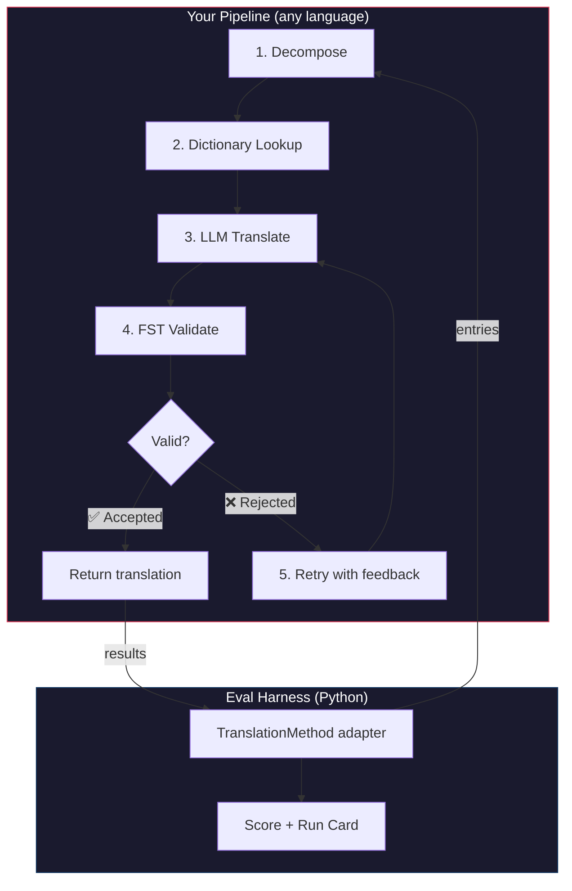
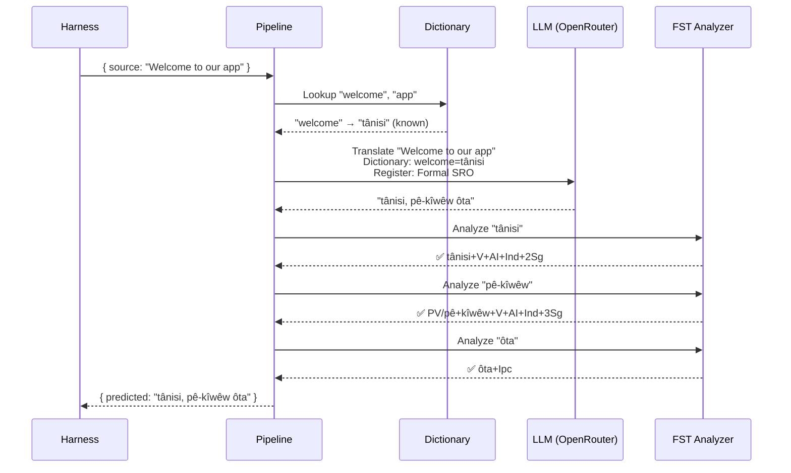
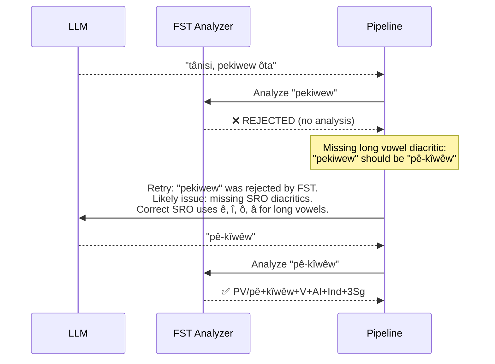

# Libro de Recetas: Canalización de Traducción Controlada por FST

Construya una canalización de traducción multietapa que descomponga texto fuente, traduzca a través de LLM, valide salidas con un transductor de estados finitos (FST), y reintente cuando el FST rechace formas de palabras inválidas. Luego conéctelo al arnés de evaluación y vea cómo se califica.

**Lo que construirá:** Una canalización de traducción para Plains Cree que detecta traducciones morfológicamente inválidas *antes* de que cuenten en su puntuación.

:::info Requisitos previos
- Un binario FST en funcionamiento (por ejemplo, del [analizador de Plains Cree de ALTLab](https://github.com/UAlbertaALTLab/lang-crk))
- Node.js 20+ (para la canalización) y Python 3.10+ (para el arnés)
- Una clave de API de OpenRouter para el paso de LLM
:::

---

## Arquitectura

La canalización es una cadena de etapas. Cada etapa tiene un trabajo específico. Puede construir esto en cualquier lenguaje — este ejemplo usa JavaScript, pero el arnés no le importa qué hay adentro. Solo ve el adaptador Python delgado en el límite.



### Por Qué Estas Etapas

| Etapa | Qué Hace | Por Qué Importa |
|-------|----------|-----------------|
| **Descomponer** | Dividir cadenas de UI compuestas en segmentos traducibles | Los idiomas polisintéticos codifican oraciones completas en palabras individuales — el LLM necesita unidades más pequeñas |
| **Búsqueda en Diccionario** | Verificar un diccionario bilingüe para traducciones conocidas | Fuerza terminología correcta para términos conocidos en lugar de depender de adivinanzas del LLM |
| **Traducción LLM** | Enviar el segmento a un LLM con contexto de registro y gramática | Maneja frases novedosas y genera salida fluida |
| **Validación FST** | Ejecutar la salida a través de un analizador morfológico | Detecta formas de palabras inválidas — si el FST rechaza una palabra, no es una forma de palabra válida en el idioma |
| **Reintento** | Reenviar palabras rechazadas con la retroalimentación de error del FST | Proporciona al LLM información específica sobre *por qué* la palabra fue incorrecta |

---

## El Flujo de Datos

Aquí está lo que sucede a una entrada individual mientras fluye a través de la canalización:



### Cuando el FST Rechaza



---

## Implementación

Construya lo que quiera. Este ejemplo usa JavaScript, pero podría usar Python, Rust, o cualquier otra cosa. El arnés no le importa — solo habla con el adaptador Python delgado (mostrado en la siguiente sección).

### La Canalización

Cada etapa es una función. La canalización las encadena juntas.

```javascript title="pipeline.js"
import { lookupDictionary } from './dictionary.js';
import { callLLM } from './llm.js';
import { analyzeWithFST } from './fst.js';

const MAX_RETRIES = 3;

/**
 * Translate a batch of keys through the full pipeline.
 *
 * @param {object} keys - Map of key → source string
 * @param {object} options - { sourceLang, targetLang }
 * @returns {{ translations: object, stats: object }}
 */
export async function translateBatch(keys, options) {
  const translations = {};
  const stats = { total: 0, fstAccepted: 0, retries: 0, dictionaryHits: 0 };

  for (const [key, sourceText] of Object.entries(keys)) {
    stats.total++;
    translations[key] = await translateSingle(sourceText, options, stats);
  }

  return { translations, stats };
}

/**
 * Translate a single string through all pipeline stages.
 */
async function translateSingle(sourceText, options, stats) {

  // ── Stage 1: Decompose ──────────────────────────────────
  // Split compound strings into segments the LLM can handle.
  // For UI strings this is often a no-op, but for longer content
  // it prevents the LLM from losing context in long prompts.
  const segments = decompose(sourceText);

  // ── Stage 2: Dictionary Lookup ──────────────────────────
  // Check each segment against the bilingual dictionary.
  // Known terms are forced — the LLM won't override them.
  const knownTerms = {};
  for (const segment of segments) {
    const entry = lookupDictionary(segment.toLowerCase());
    if (entry) {
      knownTerms[segment] = entry;
      stats.dictionaryHits++;
    }
  }

  // ── Stage 3: LLM Translate ──────────────────────────────
  let translation = await callLLM(sourceText, {
    ...options,
    knownTerms,
    register: 'nêhiyawêwin (Plains Cree). Use SRO orthography. '
            + 'Professional register for educational contexts.',
  });

  // ── Stage 4: FST Validate ──────────────────────────────
  // Split the translation into words and check each one.
  let { accepted, rejected } = await validateWords(translation);

  // ── Stage 5: Retry Loop ─────────────────────────────────
  // If any words were rejected, retry with FST feedback.
  let attempt = 0;
  while (rejected.length > 0 && attempt < MAX_RETRIES) {
    attempt++;
    stats.retries++;

    const feedback = rejected
      .map(w => `"${w}" was rejected by the morphological analyzer`)
      .join('; ');

    translation = await callLLM(sourceText, {
      ...options,
      knownTerms,
      register: 'nêhiyawêwin (Plains Cree). Use SRO orthography.',
      feedback: `Previous attempt had invalid words. ${feedback}. `
              + 'Use correct SRO diacritics (ê, î, ô, â for long vowels). '
              + 'Ensure verb forms match expected conjugation patterns.',
    });

    ({ accepted, rejected } = await validateWords(translation));
  }

  if (rejected.length === 0) stats.fstAccepted++;

  return translation;
}

/**
 * Decompose source text into translatable segments.
 *
 * For simple key-value UI strings, this usually returns the
 * original string as a single segment. For longer content,
 * it splits on sentence boundaries.
 */
function decompose(text) {
  // Simple sentence-boundary split. Replace with your own
  // morphological decomposition for more complex needs.
  return text
    .split(/(?<=[.!?])\s+/)
    .filter(s => s.trim().length > 0);
}

/**
 * Validate each word in a translation against the FST.
 *
 * @returns {{ accepted: string[], rejected: string[] }}
 */
async function validateWords(translation) {
  // Split on whitespace and punctuation, keeping only words
  const words = translation
    .split(/[\s,;:.!?'"()\[\]{}]+/)
    .filter(w => w.length > 0);

  const accepted = [];
  const rejected = [];

  for (const word of words) {
    const analyses = await analyzeWithFST(word);
    if (analyses.length > 0) {
      accepted.push(word);
    } else {
      rejected.push(word);
    }
  }

  return { accepted, rejected };
}
```

### El Envoltorio FST

Envuelva su binario FST como una función asincrónica. Este ejemplo usa el analizador de Plains Cree basado en HFST de ALTLab.

```javascript title="fst.js"
import { execFile } from 'node:child_process';
import { promisify } from 'node:util';

const execFileAsync = promisify(execFile);

// Path to your FST analyzer binary
const FST_PATH = process.env.FST_ANALYZER_PATH || './bin/crk-analyzer';

/**
 * Run a word through the FST morphological analyzer.
 *
 * Returns an array of analyses. Empty array = rejected.
 *
 * Example:
 *   analyzeWithFST("tânisi")
 *   → ["tânisi+V+AI+Ind+2Sg", "tânisi+V+AI+Cnj+2Sg"]
 *
 *   analyzeWithFST("pekiwew")
 *   → []  // rejected — missing diacritics
 *
 * @param {string} word - A single word in SRO orthography
 * @returns {string[]} Array of FST analyses (empty = rejected)
 */
export async function analyzeWithFST(word) {
  try {
    // HFST lookup: pipe the word to stdin, read analyses from stdout
    const { stdout } = await execFileAsync(
      FST_PATH,
      ['--quiet'],
      { input: word + '\n', timeout: 5000 }
    );

    // Parse HFST output: each line is "input\tanalysis\tweight"
    // Lines with "+?" indicate unrecognized forms
    return stdout
      .split('\n')
      .filter(line => line.includes('\t') && !line.includes('+?'))
      .map(line => line.split('\t')[1]);

  } catch (err) {
    // If the FST binary isn't available, log and reject
    console.error(`[WARN] FST analysis failed for "${word}": ${err.message}`);
    return [];
  }
}
```

### Módulos de Diccionario y LLM

```javascript title="dictionary.js"
/**
 * Simple bilingual dictionary backed by a JSON file.
 *
 * In production, you'd load from the coaching data directory
 * or query itwêwina (https://itwewina.altlab.app/) via API.
 */
const DICTIONARY = {
  'hello': 'tânisi',
  'welcome': 'tânisi',
  'thank you': 'kinanâskomitin',
  'home': 'kīwēwin',
  'search': 'nānātawāpahtam',
  'settings': 'isi-nākatohkēwin',
  'help': 'nīsōhkamākēwin',
  'back': 'kīwē',
};

/**
 * @param {string} term - Lowercase English term
 * @returns {string|null} Cree translation or null
 */
export function lookupDictionary(term) {
  return DICTIONARY[term] || null;
}
```

```javascript title="llm.js"
/**
 * Call an LLM via OpenRouter for translation.
 */
const OPENROUTER_API = 'https://openrouter.ai/api/v1/chat/completions';

export async function callLLM(sourceText, options) {
  const { knownTerms = {}, register, feedback } = options;

  // Build the system prompt with register and known terms
  let systemPrompt = `You are translating English to Plains Cree.\n\n`;
  systemPrompt += `Register: ${register}\n\n`;

  if (Object.keys(knownTerms).length > 0) {
    systemPrompt += `Required terminology (use these exact translations):\n`;
    for (const [en, crk] of Object.entries(knownTerms)) {
      systemPrompt += `  "${en}" → "${crk}"\n`;
    }
    systemPrompt += '\n';
  }

  if (feedback) {
    systemPrompt += `IMPORTANT correction from previous attempt:\n${feedback}\n\n`;
  }

  systemPrompt += `Rules:\n`;
  systemPrompt += `- Use Standard Roman Orthography (SRO)\n`;
  systemPrompt += `- Use macron/circumflex for long vowels: ê, î, ô, â\n`;
  systemPrompt += `- Return ONLY the Cree translation, nothing else\n`;

  const response = await fetch(OPENROUTER_API, {
    method: 'POST',
    headers: {
      'Authorization': `Bearer ${process.env.OPENROUTER_API_KEY}`,
      'Content-Type': 'application/json',
    },
    body: JSON.stringify({
      model: 'google/gemini-2.5-pro',
      messages: [
        { role: 'system', content: systemPrompt },
        { role: 'user', content: sourceText },
      ],
      temperature: 0.2,
    }),
  });

  const json = await response.json();
  return json.choices[0].message.content.trim();
}
```

---

## Conectando al Arnés

Su canalización está construida. Ahora necesita conectarla al arnés de evaluación para poder evaluarla en la tabla de clasificación.

El arnés habla una interfaz: `TranslationMethod`. Es un protocolo de Python con un único método. Construya lo que quiera en el lenguaje que quiera — luego proporciónele este envoltorio delgado y se conecta.

```python title="fst_gated_process.py"
"""
TranslationMethod adapter for the FST-gated pipeline.

This thin wrapper connects your pipeline (running as a local
subprocess or HTTP server) to the eval harness. The harness
calls translate() with corpus entries. You call your pipeline.
You return results. That's it.
"""

import time
import subprocess
import json
from mt_eval_harness.config import RunConfig


class FSTGatedProcess:
    """Adapter between the eval harness and your FST-gated pipeline.

    The pipeline runs as a Node.js subprocess. This wrapper:
    1. Receives entries from the harness
    2. Sends them to the pipeline
    3. Returns structured results the harness can score
    """

    def __init__(self, pipeline_url: str = "http://localhost:3001"):
        self.pipeline_url = pipeline_url

    async def translate(
        self,
        entries: list[dict],
        config: RunConfig,
    ) -> list[dict]:
        """Translate a batch of entries through the FST-gated pipeline.

        Args:
            entries: List of corpus entries with 'id' and source text.
            config: Harness run configuration (for context).

        Returns:
            List of result dicts, one per entry.
        """
        import httpx

        results = []

        for entry in entries:
            source_text = entry.get(config.source_field, entry.get("source", ""))
            start = time.monotonic()

            try:
                # Call your pipeline — however it's running
                async with httpx.AsyncClient() as client:
                    response = await client.post(
                        f"{self.pipeline_url}/translate",
                        json={"keys": {str(entry["id"]): source_text}},
                        timeout=30.0,
                    )
                    data = response.json()
                    predicted = data["translations"][str(entry["id"])]

                elapsed = time.monotonic() - start

                results.append({
                    "id": entry["id"],
                    "predicted": predicted,
                    "latency_s": elapsed,
                    "usage": {},  # pipeline doesn't expose token counts
                    "error": None,
                    "tool_calls": [],
                    "tool_call_count": 0,
                    "metadata": data.get("meta", {}),
                })

            except Exception as err:
                results.append({
                    "id": entry["id"],
                    "predicted": "",
                    "latency_s": time.monotonic() - start,
                    "usage": {},
                    "error": str(err),
                    "tool_calls": [],
                    "tool_call_count": 0,
                    "metadata": {},
                })

        return results
```

:::tip No necesita HTTP
El ejemplo anterior llama la canalización sobre HTTP porque la canalización está en JavaScript. Si su canalización está en Python, puede llamarla directamente — sin servidor necesario. El envoltorio `TranslationMethod` es solo un límite de función. Lo que sucede adentro depende de usted.
:::

### Ejecutando la Evaluación

Inicie su canalización, luego ejecute el arnés:

```bash
# Terminal 1: Start the pipeline
node server.js

# Terminal 2: Run the harness with your process
export OPENROUTER_API_KEY="sk-or-v1-..."

python -c "
import asyncio
from mt_eval_harness.config import RunConfig
from mt_eval_harness.runner import execute_run
from fst_gated_process import FSTGatedProcess

async def main():
    config = RunConfig(
        corpus_path='data/edtekla-dev-v1.json',
        source_lang='English',
        target_lang='Plains Cree (nêhiyawêwin, SRO)',
        process_name='fst-gated-v1',
    )
    process = FSTGatedProcess('http://localhost:3001')
    run_log = await execute_run(config, process=process)
    print(f'Results: {run_log.output_path}')

asyncio.run(main())
"
```

O use la CLI con `baseline_experiment.py` para comparar contra la línea base integrada:

```bash
python eval/baseline_experiment.py \
  --dataset data/edtekla-dev-v1.json \
  --model google/gemini-2.5-pro \
  --fst-analyzer ./bin/crk-analyzer \
  --condition fst-gated-v1 \
  --submit
```

---

## Entendiendo Sus Resultados

El arnés produce una **tarjeta de ejecución** — un archivo JSON con sus puntuaciones. Aquí está lo que verá:

```
═══════════════════════════════════════════════════
  FST-Gated Pipeline v1 — EDTeKLA Dev v1
═══════════════════════════════════════════════════

  chrF++              48.7 / 100
  Exact match         12.1%
  FST acceptance      94.4%
  Composite score     0.52  →  Functional ✓

  404 entries (master_corpus.json) · 47 retries · $0.18 total cost
═══════════════════════════════════════════════════
```

**Lo que esto le dice de un vistazo:**
- Su método está en el nivel **Funcional** (0.50–0.70) — la salida es reconocible para un hablante, la gramática principal generalmente es correcta, errores morfológicos frecuentes permanecen.
- El FST está detectando 94% de palabras como válidas — su bucle de reintento está funcionando.
- 12% de traducciones son exactamente correctas — hay mucho espacio para mejorar.

:::info Niveles de Calidad
| Nivel | Compuesto | Qué Significa |
|-------|-----------|---------------|
| Línea Base | 0.00–0.30 | Salida LLM sin procesar, morfología principalmente alucinada |
| Emergente | 0.30–0.50 | Algunos patrones correctos, no confiable |
| **Funcional** | **0.50–0.70** | **Reconocible para un hablante. Categorías principales generalmente correctas.** |
| Desplegable | 0.70–0.85 | Adecuado para traducción de borrador con revisión humana |
| Fluido | 0.85–1.00 | Aproximándose a traducción humana competente |

Vea [SCORING_SPEC §5](/docs/specifications/scoring#5-quality-tiers) para las definiciones completas de niveles.
:::

<details>
<summary><strong>Más profundo: ¿Qué hay en la tarjeta de ejecución?</strong></summary>

El JSON de la tarjeta de ejecución captura todo sobre esta ejecución de evaluación. Secciones clave:

**Puntuaciones** — cada métrica que el arnés calculó:
```json
{
  "scores": {
    "exact_match_rate": 0.121,
    "chrf_plus_plus": 48.7,
    "fst_acceptance_rate": 0.944,
    "composite_score": 0.52,
    "quality_tier": "functional"
  }
}
```

**Procedencia** — qué produjo estos resultados:
```json
{
  "method": {
    "process_name": "fst-gated-v1",
    "model": "google/gemini-2.5-pro",
    "temperature": 0.0
  },
  "corpus": {
    "id": "edtekla-dev-v1",
    "sha256": "a1b2c3..."
  }
}
```

**Resultados por entrada** — cada traducción con puntuaciones individuales, para que pueda encontrar dónde su método tiene dificultades:
```json
{
  "id": 42,
  "source": "The student completed the assignment",
  "reference": "ôskiniw kî-kîsîhtâw ôhi atoskêwina",
  "predicted": "ôskiniw kî-kîsîhtâw ôhi atoskêwin",
  "chrf": 89.2,
  "exact_match": false,
  "fst_accepted": true
}
```

La puntuación compuesta es un promedio ponderado de métricas disponibles, con pesos definidos en [SCORING_SPEC §4](/docs/specifications/scoring#4-composite-score). Cuando una métrica no está disponible, su peso se redistribuye proporcionalmente entre el resto.

</details>

---

## Desplegando a Producción

Su método tiene puntuaciones en la tabla de clasificación. Ahora quiere usarlo realmente. Esta sección trata sobre servir su canalización como un punto final de producción que [champollion](https://champollion.dev) puede llamar.

:::note Esta sección es opcional
Todo lo anterior trata sobre construir y evaluar su método. Esta sección trata sobre despliegue — una preocupación separada. Puede enviar a la tabla de clasificación sin desplegar nada.
:::

### El Servidor HTTP

Envuelva su canalización como un servidor Express que implemente el [contrato del método de API](https://champollion.dev/docs/guides/serving-a-method):

```javascript title="server.js"
import express from 'express';
import { translateBatch } from './pipeline.js';

const app = express();
app.use(express.json());

/**
 * API method contract:
 *
 * Request:  { source_locale, target_locale, method, keys: { "key": "source" } }
 * Response: { translations: { "key": "translated" }, meta: { ... } }
 */
app.post('/translate', async (req, res) => {
  const { source_locale, target_locale, method, keys } = req.body;

  // Validate request
  if (!keys || typeof keys !== 'object') {
    return res.status(400).json({ error: { message: 'Missing keys object' } });
  }

  try {
    const startTime = Date.now();
    const { translations, stats } = await translateBatch(keys, {
      sourceLang: source_locale,
      targetLang: target_locale,
    });

    res.json({
      translations,
      meta: {
        model: 'custom-pipeline/fst-gated-v1',
        method: 'decompose-lookup-translate-validate',
        elapsed_ms: Date.now() - startTime,
        fst_acceptance_rate: stats.fstAccepted / stats.total,
        retries: stats.retries,
      },
    });
  } catch (err) {
    console.error('[ERR] Pipeline failed:', err.message);
    res.status(500).json({ error: { message: err.message } });
  }
});

// Health check for connectivity verification
app.get('/health', (req, res) => res.json({ status: 'ok' }));

app.listen(3001, () => {
  console.log('FST-gated pipeline running on http://localhost:3001');
});
```

### Configure champollion

Apunte su par de idiomas al servicio en ejecución:

```json title="champollion.config.json"
{
  "version": 3,
  "inputLocale": "en",
  "pairs": {
    "en:crk": {
      "method": "api",
      "endpoint": "http://localhost:3001/translate"
    }
  },
  "languages": {
    "crk": {
      "name": "Plains Cree",
      "register": "SRO syllabics with grammatical precision."
    }
  }
}
```

```bash
# Run it
export OPENROUTER_API_KEY="sk-or-v1-..."
node server.js &
npx champollion sync
```

### Empaquetando como un Complemento

Una vez que su método tiene puntuaciones, empaquételo para que otros puedan usarlo:

```json title="crk-fst-gated-v1/method.json"
{
  "name": "crk-fst-gated-v1",
  "type": "api",
  "version": "1.0.0",
  "description": "FST-gated Plains Cree translation with morphological validation",
  "author": "Your Name",

  "config": {
    "endpoint": "https://your-server.example.com/translate"
  },

  "locales": ["crk"],

  "benchmarks": {
    "crk": {
      "date": "2026-06-01T00:00:00Z",
      "corpus_size": 404,
      "exact_match_rate": 0.12,
      "corpus_chrf": 48.7,
      "model": "google/gemini-2.5-pro",
      "harness_version": "2.0"
    }
  },

  "provenance": {
    "resources": [
      { "name": "ALTLab CRK Analyzer", "license": "LGPL-3.0", "type": "fst" },
      { "name": "Wolvengrey Dictionary", "license": "CC-BY-NC-SA-4.0", "type": "dictionary" }
    ],
    "commercialReady": false,
    "flags": ["nc-resource"]
  }
}
```

---

## Extendiendo Este Patrón

Este libro de recetas demuestra una arquitectura de canalización. Puede adaptarla para cualquier idioma o método:

| Variación | Qué Cambia |
|-----------|-----------|
| **FST Diferente** | Intercambie la ruta del binario. Puede descargar FSTs precompilados (como binarios `.hfstol` o `lttoolbox`) para más de 100 idiomas desde [GiellaLT GitHub](https://github.com/giellalt) o [Apertium GitHub](https://github.com/apertium). |
| **Sin FST disponible** | Elimine la etapa de ejecución FST y use [archivos de paradigma plano UniMorph](https://huggingface.co/datasets/unimorph/universal_morphologies) de Hugging Face para realizar validación de búsqueda en base de datos estática de formas inflexionadas. |
| **Múltiples LLMs** | Encadene modelos: un modelo rápido para borrador inicial, un modelo de razonamiento para correcciones. |
| **Humano en el bucle** | Agregue una etapa de cola que mantenga traducciones inciertas para revisión de expertos antes de devolver. |
| **Modelo ajustado** | Reemplace la llamada de OpenRouter con un modelo local (Ollama, vLLM, etc.). |
| **Idioma Diferente** | Cambie el diccionario, FST, y registro. La arquitectura permanece idéntica. |

La canalización es un patrón. Las etapas son intercambiables. Construya lo que funcione para su idioma, pruébelo en la [tabla de clasificación](https://champollion.dev/leaderboard), y despliéguelo.

---

## Ver También

- **[Arnés de Evaluación](/docs/specifications/harness)** — cómo ejecutar el arnés e interpretar salida
- **[Interfaz de Método](/docs/specifications/methods)** — la especificación del protocolo `TranslationMethod`
- **[Reglas de la Tabla de Clasificación](/docs/leaderboard/rules)** — criterios de envío y políticas anti-juego
- **[Apoyar un Idioma de Bajo Recurso](/docs/community/low-resource-languages)** — el contexto más amplio y principios OCAP
- **[ALTLab](https://altlab.artsrn.ualberta.ca/)** — el Laboratorio de Tecnología de Lenguaje de Alberta (FST de Plains Cree)
- **[Tabla de Clasificación de Métodos](https://champollion.dev/leaderboard)** — envíe sus puntuaciones