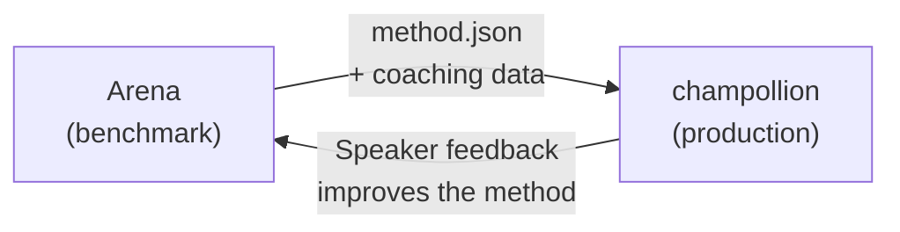

# I-deploy sa Production

Napatunayan ninyong gumagana ito sa Arena. Ngayon, i-deploy ito.

Ang Arena ay para sa R&D — pagbuo, benchmarking, at paghahambing ng mga paraan ng pagsasalin. Ang **production deployment** ay nangyayari sa pamamagitan ng [champollion](https://champollion.dev), ang translation CLI na nakatuon sa mga developer. Nag-uugnay ang mga ito sa pamamagitan ng isang shared plugin format.



---

## Ang Deployment Path

### 1. I-export ang Inyong Method bilang Plugin

Gumawa ng `method.json` manifest na nagpa-package ng inyong mga benchmark result:

```json
{
  "name": "crk-coached-v3",
  "type": "llm-coached",
  "version": "3.0.0",
  "description": "Coached LLM translation for Plains Cree",
  "locales": ["crk"],
  "config": {
    "model": "google/gemini-2.5-flash",
    "temperature": 0.3
  },
  "benchmarks": {
    "crk": {
      "composite_score": 0.67,
      "fst_acceptance": 0.82,
      "corpus_size": 150
    }
  }
}
```

Isama ang anumang coaching data (mga tuntunin sa gramatika, mga diksyunaryo) kasama ng manifest.

### 2. I-install sa Champollion

```bash
champollion plugin install ./my-method-plugin/
```

### 3. I-configure ang Inyong Pair

```json title="champollion.config.json"
{
  "pairs": {
    "en-crk": { "method": "plugin", "plugin": "crk-coached-v3" }
  }
}
```

### 4. Isalin ang Tunay na Content

```bash
npx champollion sync
```

Ang inyong na-benchmark na method ay lumilikha na ngayon ng mga tunay na salin sa production.

---

## Para sa mga Katutubong Wika

Ang mga method na naglilingkod sa mga komunidad ng Katutubong wika ay nangangailangan ng **pahintulot ng komunidad** bago ang production deployment. Pinamamahalaan ng mga prinsipyo ng OCAP (Ownership, Control, Access, Possession) kung paano binubuo, sinusuri, at dine-deploy ang mga method ng pagsasalin.

Ang method na umaabot sa Deployable tier (0.70+) ay hindi awtomatikong dine-deploy — dine-deploy ito **kung at kailan** nagbibigay ng pahintulot ang lupong tagapamahala ng komunidad ng wika.

Tingnan ang [Soberanya ng Datos](/docs/sovereignty/data-sovereignty) at [Paglipat ng Pagmamay-ari](/docs/sovereignty/ownership-transfer) para sa kumpletong balangkas ng pamamahala.

---

## Tingnan Din

- [Ang Eval Harness Bridge](https://champollion.dev/docs/guides/bridge) — detalyadong walkthrough ng Arena→champollion pipeline
- [Espesipikasyon ng Plugin](https://champollion.dev/docs/reference/plugin-spec) — ang method.json manifest format
- [Gabay sa champollion Agent](https://champollion.dev/docs/guides/agent-guide) — kung paano gamitin ang champollion para sa pagsasalin