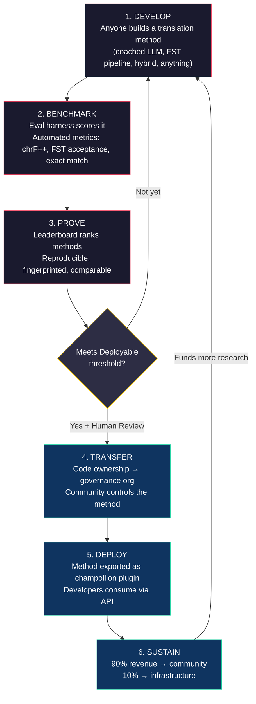
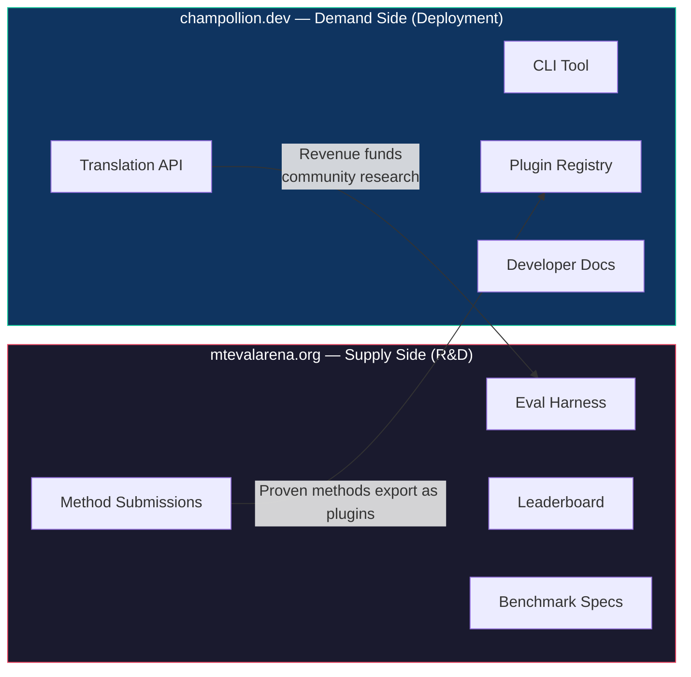
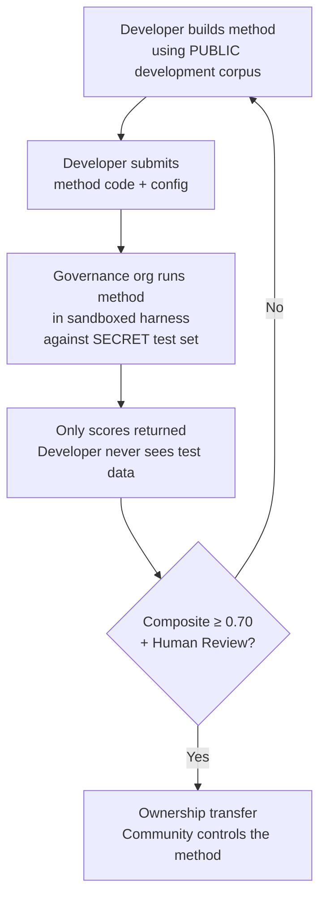

# Paano Ito Gumagana: Kompetitibong Crowdsourcing para sa Machine Translation

> **Executive Summary.** Ang machine translation para sa mga wikang kulang ang serbisyo sa buong mundo — kabilang ang ~1,300 na inaangkin ng Meta's OMT-1600 na saklaw nito ngunit nasa mga antas ng kalidad na mas mababa sa anumang magagamit na threshold — ay hindi problema sa model-training — ito ay problema sa *infrastructure*. Walang iisang model, lab, o kumpanya ang lulutas nito. Inilalarawan ng dokumentong ito ang isang platform architecture na ginagawang distributed research lab ang pandaigdigang komunidad ng mga ML engineer, linguist, at tagapagsalita ng wika: sinuman ay bubuo ng pamamaraan sa pagsasalin, patutunayan ng platform kung gumagana ito laban sa sovereign evaluation data, at ang mga napatunayang pamamaraan ay ide-deploy sa production na may kita na dumadaloy sa mga komunidad na pinaglilingkuran ng kanilang mga wika. Ang mekanismo ay kompetitibong crowdsourcing na may cryptographic sovereignty — isang kombinasyong hindi pa nasusubukan dati.

---

> [!IMPORTANT]
> **Saklaw.** Sinusuri ng platform na ito ang **pagsasalin ng pormal na nakasulat na teksto** — mga dokumento, materyal na pang-edukasyon, opisyal na komunikasyon, UI strings. Hindi ito chatbot, real-time interpreter, o unrestricted-domain conversational system. Niraranggo ng leaderboard ang mga pamamaraan sa pagsasalin laban sa curated parallel corpora sa mga partikular na domain ng teksto (tingnan ang [Espesipikasyon ng Benchmark §2.7](/docs/specifications/benchmark#27-domain) para sa domain taxonomy). Ang MT ay infrastructure para sa language revitalization, hindi kapalit nito. Natututo ng wika ang mga bata mula sa mga tao, hindi sa mga makina.

### Kasalukuyang Saklaw ng Domain

| Domain | Tier Coverage | Status | Notes |
|--------|--------------|--------|-------|
| Opisyal / pamahalaan | Tiers 1–5 | Aktibo | EdTeKLA corpus |
| Pang-edukasyon / textbook | Tiers 1–4 | Aktibo | EdTeKLA corpus |
| Narrative / pampanitikan | Limitado | Nakaplano | Ilang entry sa gold standard |
| Relihiyoso / scriptural | Reference lamang | Hindi sinusuri | FLORES+ (Bible-domain); hindi ginagamit para sa opisyal na scoring |
| Conversational | Wala sa saklaw | Sadyang disenyo | Sinusuri ng sistemang ito ang nakasulat na teksto, hindi pananalita |
| Teknikal / siyentipiko | Wala sa saklaw | Hinaharap | Nangangailangan ng domain-specific terminology validation |

## 1. Ang Problema: Machine Translation ≠ Machine Learning

Ang machine translation para sa low-resource languages (LRLs) ay karaniwang inilalarawan bilang problema sa machine learning: mangolekta ng datos, magsanay ng model, mag-deploy. Mali ang framing na ito, at may malaking epekto ang pagkakamali — itinutulak nito ang pondo, talento, at infrastructure tungo sa isang lapit na structurally hindi gagana para sa karamihan ng mga wika sa mundo.

### 1.1 Bakit Nabibigo ang ML Framing

Nangangailangan ang standard ML pipeline para sa MT ng tatlong bagay: malalaking parallel corpora, validated evaluation benchmarks, at deployment path. Para sa ~130 wikang pinaglilingkuran ng Google Translate at ~200 na saklaw ng NLLB-200, umiiral ang tatlo. Para sa karagdagang ~1,300 wika na inaangkin ng OMT-1600 na saklaw nito, umiiral ang evaluation data ngunit karamihan sa kalidad ay mas mababa sa magagamit na thresholds, hindi pampublikong available ang model weights, at walang deployment pipeline. Para sa natitirang ~5,400+, wala sa mga ito ang umiiral.

| Requirement | High-Resource Languages | OMT-1600 Coverage (~1,300 LRLs) | Remaining ~5,400 Languages |
|-------------|------------------------|-------------------------------|---------------------------|
| **Parallel corpora** | Milyun-milyong sentence pairs (Europarl, UN Corpus, OpenSubtitles) | Bible-domain bitext, web scrapes, synthetic backtranslation. Walang community-curated data. | Daan-daan hanggang mababang libo, kung mayroon man |
| **Evaluation benchmarks** | WMT, FLORES, NTREX — standardized, reproducible | BOUQuET (Bible-domain), met-BOUQuET. Walang morphological validation. Walang independent evaluation. | Walang standard benchmarks; ad hoc na ebalwasyon |
| **Deployment path** | Google Translate, DeepL, Azure — commercial APIs | Hindi inilabas ang model weights. Walang CLI, walang plugin system, walang community-deployable API. | Wala. Walang API, walang produkto, walang merkado. |

Gumagana ang ML approach kapag umiiral ang datos na pagsasanayan at umiiral ang merkado na pagde-deploy-an. Malaki ang pinalawak ng OMT-1600 sa unang kondisyon — ngunit ang pagpapalawak nang walang independent quality verification, morphological validation, o community governance ay pagpapalawak nang walang tiwala. Hindi lamang "kailangan natin ng mas mahusay na model" ang problema — ito ay "kailangan natin ng infrastructure na nagpapatunay na gumagana ang model, ayon sa mga tuntuning kontrolado ng komunidad."

### 1.2 Ano Talaga ang Kinakailangan ng MT para sa LRLs

Ang pagsasalin para sa mga wikang kulang ang serbisyo ay hindi pangunahing problema sa training. Ito ay problema sa **method engineering** — ang hamon ng pagsasama-sama ng available resources (LLMs, morphological tools, kaalaman ng komunidad, linguistic rules) sa gumaganang translation pipelines, pagkatapos ay pagpapatunay na gumagana ang mga ito gamit ang mahigpit na ebalwasyon.

Mahalaga ang pagkakaiba:

| Dimension | ML Approach | Method Engineering Approach |
|-----------|------------|---------------------------|
| **Core activity** | Magsanay ng model sa datos | Pagsamahin ang tools, prompts, at linguistic knowledge sa isang pipeline |
| **Bottleneck** | Dami ng parallel data | Engineering creativity + evaluation infrastructure |
| **Who can contribute** | Mga team na may GPU clusters at datasets | Sinumang may API key, diksyunaryo, at ideya |
| **Evaluation** | BLEU/chrF sa held-out test sets | Morphological validation + human review + automated metrics |
| **Deployment** | I-serve ang model | I-package ang pamamaraan bilang plugin |

Ang modernong LLMs ay naglalaman na ng latent knowledge ng maraming low-resource languages — sapat upang makalikha ng output na *mukhang* kapani-paniwala. Ang problema ay madalas na morphologically invalid ang output na ito (nagha-hallucinate ang model ng word forms na hindi umiiral sa wika). Ang engineering challenge ay: paano ninyo kukunin ang alam ng LLM, iva-validate ito laban sa linguistic reality, at ipa-package ang resulta para sa production use?

Ito ang dahilan kung bakit bina-benchmark namin ang **mga pamamaraan**, hindi ang mga model. Ang pamamaraan ay ang buong recipe: model selection + prompt engineering + tool usage + pre/post-processing + coaching data + retry strategies. Dalawang team na gumagamit ng parehong model na may magkaibang pamamaraan ay makakakuha ng magkaibang scores. Iyon ang punto.

### 1.3 Bakit Sinisira ng Polysynthetic Languages ang Lahat

Marami sa mga wikang pinakakulang ang serbisyo sa mundo ay **polysynthetic** — ine-encode nila ang buong pangungusap sa iisang salita sa pamamagitan ng productive morphological processes. Isaalang-alang ang salitang Plains Cree:

> **ê-kî-nitawi-kîskinwahamâkosiyân**
> *"when I had gone to school"*

Isang salita. Ine-encode nito ang tense (past), direction (going to), root (learn), voice (passive/reflexive), at person (first singular). Nangangailangan ang English ng anim na salita para sa ipinapahayag ng Cree sa isa.

Sinisira nito ang standard MT sa bawat antas:

- **Tokenization** — Pinuputol-putol ng BPE at SentencePiece ang polysynthetic words sa walang-kahulugang fragments, dahil idinisenyo ang mga ito para sa concatenative morphology.
- **Hallucination** — Gumagawa ang LLMs ng mga string na mukhang kapani-paniwala ngunit hindi valid na mga salita. Hindi masasabi ng hindi tagapagsalita ang pagkakaiba. Kung walang morphological validation, hindi nakikita ang hallucinations.
- **Evaluation** — Pinarurusahan ng word-level metrics (BLEU) ang natural na inflectional variation na pundamental sa paraan ng paggana ng mga wikang ito. Mas mabuti ang character-level metrics (chrF++) ngunit hindi pa rin sapat kung walang structural validation.

Hindi mas malaking model o mas maraming training data ang solusyon. Ito ay **infrastructure na nakakakita ng hallucinations bago pa makarating ang mga ito sa users** — morphological analyzers (FSTs) na tiyak na makapagsasabing "hindi ito salita sa wikang ito."

---

## 2. Bakit Hindi Gumagana ang Umiiral na mga Approach

### 2.1 Commercial MT

Historically, na-optimize ang commercial translation services para sa market volume. Ang Meta's OMT-1600 (March 2026) ay kumakatawan sa malaking pagbabago — 1,600 wika sa iisang system. Ngunit para sa ~1,300 sa kanilang pinakamababang resource tiers, mas mababa sa magagamit na thresholds ang kalidad, hindi available ang model weights, at walang deployment pipeline. Nag-evolve ang structural incentive problem: kaya na ngayon ng Big Tech na bumuo ng models para sa LRLs, ngunit kung walang independent evaluation, morphological validation, o community governance, hindi nalulutas ng coverage lamang ang problema.

### 2.2 Academic Research

Halos buong-buo ang pokus ng academic MT research sa high-resource language pairs dahil doon naroon ang training data, shared tasks, at publication venues. Ang mga researcher na nagtatrabaho sa low-resource pairs ay nahihirapang mag-publish, nahihirapang pondohan ang compute, at nahihirapang mag-deploy — dahil hindi umiiral ang deployment infrastructure para sa LRLs.

### 2.3 One-Off Competitions

Maaari kayong magpatakbo ng Kaggle competition: "English→Plains Cree, best chrF++ wins $10,000." Ganito ang mangyayari:

1. May mananalo, magsusumite ng notebook, kukunin ang premyo, at uuwi.
2. Mabubulok ang notebook sa archive ng Kaggle. Walang magde-deploy nito. Walang magme-maintain nito.
3. Kalaunan ay ipa-publish ang test set — kontaminado na magpakailanman.
4. In-upload ng governance organization ang kanilang linguistic data sa infrastructure ng Google sa ilalim ng terms of service ng Google, nang walang tunay na kontrol sa lifecycle.
5. Walang deployment bridge. Ang winning notebook ay hindi gumaganang API.

Umaakit ng bounty hunters ang one-time bounty. Lumilikha ng sustained engagement ang ongoing leaderboard na may community governance.

### 2.4 Fine-Tuning

Ang fine-tuning ng open model sa parallel text ang halatang ML approach. Ngunit para sa karamihan ng LRLs, ang parallel corpus na kailangan para sa fine-tuning ay eksaktong datos na hindi umiiral — at ang paglikha nito ay nangangailangan ng parehong bilingual speakers at community engagement na dapat sanang palitan ng fine-tuning. Hindi ninyo maibo-bootstrap ang inyong sarili palabas ng problema sa kakulangan ng datos gamit ang teknik na nangangailangan ng datos.

---

## 3. Ang Solusyon: Kompetitibong Crowdsourcing na may Sovereign Evaluation

Binabaligtad ng platform ang tradisyonal na approach: sa halip na isang team ang bumuo ng isang model, **nagkukumpitensya ang pandaigdigang komunidad upang bumuo ng pinakamahusay na pamamaraan sa pagsasalin**, pinatutunayan ng platform kung gumagana ito, at ang mga napatunayang pamamaraan ay dine-deploy sa production habang pinananatili ng language community ang pagmamay-ari at kontrol.

### 3.1 Ang Buong Loop

May partikular na tungkulin ang bawat stage:

| Stage | What Happens | Who Benefits |
|-------|-------------|--------------|
| **Develop** | Bumubuo ang isang researcher, student, o hobbyist ng pamamaraan sa pagsasalin gamit ang anumang tools na nais nila — LLM prompting, FST pipelines, dictionaries, fine-tuned models, rule-based systems, o hybrids | Natututo, nag-eeksperimento, at nagpa-publish ang contributor |
| **Benchmark** | Sini-score ng eval harness ang pamamaraan laban sa standardized corpus gamit ang reproducible metrics. Bawat run ay gumagawa ng [run card](/docs/specifications/benchmark#3-run-card-schema) — kumpletong tala ng sinubok at kung paano ito nag-perform | Nakakakuha ang researchers ng reproducible, comparable results |
| **Prove** | Lumalabas ang mga resulta sa public leaderboard. Niraranggo, ikinukumpara, at sinusuri ang mga pamamaraan. Nakikita ng komunidad kung ano ang gumagana at ano ang hindi | Nagkakaroon ang lahat ng visibility sa state of the art |
| **Transfer** | Para sa Indigenous languages, ang mga pamamaraang umaabot sa Deployable threshold (composite ≥ 0.70) AT pumapasa sa human validation ay inililipat ang code ownership sa governance organization ng language community | Nagkakaroon ang komunidad ng revenue-generating asset |
| **Deploy** | Ine-export ang pamamaraan bilang [champollion](https://github.com/gamedaysuits/champollion) plugin at sine-serve sa pamamagitan ng API. Gumagamit ang developers ng translations nang hindi kailangang maunawaan ang underlying method | Nakakakuha ang developers ng translation para sa mga wikang hindi pinaglilingkuran ng commercial APIs |
| **Sustain** | Hinahati ang API revenue: 90% sa komunidad, 10% sa infrastructure. Pinopondohan ng revenue ang higit pang linguistic research, corpus development, at community programs | Napapanatili ng flywheel ang sarili nito pagkatapos ng paunang pagtatatag |

### 3.2 Bakit Gumagana ang Competitive Dynamics

Hindi incidental ang kompetisyon — ito ang mekanismo. Narito kung bakit:

**Diversity of approaches.** Ang pinakamahusay na pamamaraan para sa English→Plains Cree ay maaaring FST-gated coached LLM. Ang pinakamahusay para sa English→Quechua ay maaaring dictionary-augmented pipeline. Ang pinakamahusay para sa English→Inuktitut ay maaaring fine-tuned model na na-bootstrap mula sa Nunavut Hansard corpus. Walang iisang team o approach ang mangingibabaw sa lahat ng wika. Ipinapakita ng leaderboard kung aling *mga uri* ng approach ang gumagana para sa aling *mga uri* ng wika — isang meta-result na mismong research contribution.

**Sustained engagement.** Hindi natatapos ang leaderboard. Laging may gustong talunin ang top score. Bawat submission ay nagdo-donate ng compute at intellectual effort sa problema. Hindi tulad ng one-time grant, lumilikha ang competitive dynamic ng tuloy-tuloy na research investment mula sa pandaigdigang komunidad.

**Low barrier to entry.** Kailangan ninyo ng API key, diksyunaryo, at ideya. Open source ang eval harness. Simple JSON ang corpus format. Makakakumpitensya ang isang linguistics student sa isang well-resourced lab — at minsan ay mananalo, dahil maaaring mahigitan ng domain knowledge (pag-unawa sa wika) ang compute resources.

**Deployment bridge.** Ang parehong pamamaraang mahusay ang score sa harness ay nade-deploy sa production gamit ang isang config change. "Prove it here, deploy it there." Ito ang puwang na hindi natatawid ng Kaggle, WMT shared tasks, at academic publications.

### 3.3 Ang Platform Architecture

Pisikal na nahahati ang ecosystem sa dalawang site na nagsisilbi sa dalawang audience:

Ang **[mtevalarena.org](https://mtevalarena.org)** ay ang R&D proving ground. Ang audience nito ay ML engineers, linguists, at researchers. Lahat dito ay tungkol sa pagbuo, pagsubok, at pagpapatunay ng mga pamamaraan sa pagsasalin.

Ang **[champollion.dev](https://champollion.dev)** ay ang deployment platform. Ang audience nito ay developers na nangangailangan ng translation para sa kanilang apps. Hindi nila kailangang maunawaan kung paano gumagana ang mga pamamaraan — tatawagin lamang nila ang API.

Ang tulay sa pagitan ng mga ito ay ang **method plugin**: isang napatunayang pamamaraan, naka-package para sa deployment, at pagmamay-ari ng komunidad.

---

## 4. Sovereign Evaluation: Bakit Mahalaga ang Infrastructure

Hindi teknikal na detalye ang evaluation infrastructure — ito ang core ng sovereignty model. Hindi gumagana ang standard evaluation (i-upload ang inyong test set sa shared platform) para sa Indigenous languages dahil isinusuko nito ang kontrol sa linguistic data.

### 4.1 Ang Sovereignty Mechanism

Hindi kailanman nakikita ng developer ang gold-standard evaluation data. Nagde-develop sila laban sa public development corpus, pagkatapos ay isinusumite ang kanilang method code sa governance organization, na nagpapatakbo nito sa sandbox laban sa secret test set. Scores lamang ang bumabalik. Hindi lamang ito seguridad — ito ay direktang implementasyon ng **OCAP® principles** (Ownership, Control, Access, Possession) na kinakailangan ng Indigenous data governance.

### 4.2 Bakit Hindi Ito Maaaring Patakbuhin sa Platform ng Iba

Sa Kaggle, ina-upload ng governance organization ang kanilang linguistic data sa infrastructure ng Google sa ilalim ng terms of service ng Google. Hindi nila mababawi ang access ayon sa sarili nilang timeline. Hindi sila makapaglalakip ng custom legal terms (gaya ng ownership transfer) sa submissions. Wala silang cryptographic guarantee na hindi gagamitin ang datos para sa ibang layunin. Ang data sovereignty ay nangangahulugang kontrolado ng komunidad ang evaluation endpoint, hawak ang keys, at maaari itong isara.

---

## 5. Pilosopiya ng Evaluation: Microeval at LYSS

Idinisenyo ang standard MT metrics (BLEU, chrF++, COMET) upang mag-generalize sa iba’t ibang wika. Ang generality na iyon ang kanilang lakas — at kanilang blindspot. Para sa polysynthetic languages, ang morphologically invalid na salita na may kaparehong character n-grams sa reference ay mataas ang score sa chrF++ ngunit makikilala bilang walang-kahulugang salita ng sinumang tagapagsalita.

Ang **Microeval development** ay nangangahulugang pagbuo ng evaluation metrics na iniangkop sa partikular na mga wika gamit ang pinakamahusay na available linguistic tools. Ang framework ay tinatawag na **LYSS** (Linguistically-informed Yield & Structural Scoring):

| Component | What it measures | Tool | Status |
|-----------|-----------------|------|--------|
| **LYSS-fst** | Morphological validity | Finite-state transducer | ✅ Implemented (Plains Cree) |
| **LYSS-eq** | Linguistic equivalence | Linguist-curated variant rules | ✅ Implemented (Plains Cree) |
| **LYSS-sem** | Semantic preservation | Language-specific semantic models | ✅ Implemented (Plains Cree) |

Nagsisilbi ang universal metrics (chrF++, BLEU) bilang baselines at primary signals para sa mga wikang walang LYSS tooling. Saanman may language-specific tools, dala ng LYSS components ang bigat ng scoring — dahil ang pinakamahahalagang bagay para sa bawat wika ay ang mga bagay na tanging language-specific tools lamang ang makasusukat.

Para sa buong LYSS specification at composite scoring logic, tingnan ang [SCORING_SPEC.md §4](/docs/specifications/scoring#4-composite-score).

> [!WARNING]
> **Cross-run comparability.** Kapag naghahambing ng runs na may magkaibang metric availability (hal., may FST scores ang isang run, wala ang isa), hindi direktang maihahambing ang composite scores. Nino-normalize ng composite sa available metrics, ngunit ang run na sinuri sa 5 metrics ay may dalang mas maraming impormasyon kaysa sa run na sinuri sa 2. Ipinapakita ng leaderboard ang metric coverage para sa bawat entry.

---

## 6. Sino ang Pinaglilingkuran Nito

### Para sa ML Engineers at Researchers

Isang open leaderboard na may standardized benchmarks para sa language pairs na hindi saklaw ng anumang shared task. I-reproduce ang anumang resulta gamit ang eval harness. I-publish ang inyong pamamaraan. Talunin ang top score. Bawat submission ay fingerprinted sa isang partikular na configuration at dataset version — walang kalabuan tungkol sa kung ano ang sinubok.

### Para sa Language Communities

Pagmamay-ari at kontrol sa translation technology na binuo para sa inyong wika. Ibig sabihin ng competitive dynamic, maraming team ang sabay-sabay na nagtatrabaho sa inyong wika — nakikinabang kayo sa lahat ng ito at pagmamay-ari ninyo ang resulta. Pinopondohan ng revenue mula sa API usage ang community programs ayon sa inyong mga tuntunin.

### Para sa Funders at Grant Reviewers

Transparent, reproducible metrics upang suriin ang translation research proposals. Nasusukat na outcomes bukod sa publications: API usage, revenue generated, quality metrics over time, language coverage. Lumilikha ang isang matagumpay na pamamaraan ng self-sustaining revenue stream — dumodoble at lumalawak ang epekto ng grant sa halip na magtapos kapag natapos ang funding.

### Para sa Developers

Translation para sa mga wikang walang commercial API na nagsisilbi. Isang CLI command (`npx champollion sync`) ang nagsasalin ng inyong locale files gamit ang community-proven methods. Gamitin ang Google Translate para sa French, coached LLM para sa Plains Cree, at community API para sa Quechua — lahat sa iisang project, lahat gamit ang parehong interface.

### Para sa Students

Isang open challenge na may real-world impact. Bumuo ng pamamaraan sa pagsasalin para sa wikang kulang ang serbisyo, i-benchmark ito, at i-publish ang inyong mga resulta. Libre ang infrastructure, open ang datasets, at walang pakialam ang leaderboard kung nasa top-10 university kayo o nagtatrabaho mula sa library terminal.

---

## 7. Kontekstong Panlipunan at Teknikal

### 6.1 Bumibilis ang Language Revitalization

Lumalago ang language revitalization efforts sa buong mundo. Lumalawak ang immersion schools, community language nests, at digital archiving projects sa Indigenous communities sa Canada, United States, Australia, New Zealand, at Northern Europe. Nangangailangan ang mga pagsisikap na ito ng teknolohiya — partikular, translation technology na gumagalang sa community sovereignty sa linguistic data.

### 6.2 Binago ng LLMs ang Baseline

Bago ang 2023, nangangailangan ng malaking NLP expertise, custom model training, at malalaking compute budgets ang pagbuo ng anumang MT capability para sa polysynthetic language. Binago ng modernong LLMs ang baseline: ang maayos na prompt na may coaching data at morphological validation ay maaaring makalikha ng magagamit na translations para sa ilang language pairs — walang training na kailangan. Malaki nitong ibinababa ang barrier to entry para sa method development. Lumipat ang problema mula sa "paano tayo bubuo ng model?" tungo sa "paano tayo bubuo ng pipeline na nagva-validate at nagwawasto sa nalilikha ng model?"

### 6.3 Ang Open-Source Benchmarking Culture

Naging sarili nitong kultura ang AI benchmarking. Pinapabilis ng leaderboards ang innovation. Umaakit ng talento ang competitions. Ang Chatbot Arena, LMSYS, Hugging Face Open LLM Leaderboard — ipinapakita ng mga platform na ito na ang competitive evaluation ay nagtutulak ng mabilis na pag-unlad. Kinukuha namin ang enerhiyang iyon at itinututok ito sa pagsasalin para sa libu-libong wika kung saan ang commercial MT ay alinman sa hindi umiiral o hindi pa independiyenteng napatunayang gumagana.

### 6.4 Hindi Napag-uusapan ang Indigenous Data Sovereignty

Ang OCAP® principles (Ownership, Control, Access, Possession), ang CARE principles (Collective Benefit, Authority to Control, Responsibility, Ethics), at frameworks tulad ng Te Mana Raraunga (Māori Data Sovereignty) ay hindi opsyonal na add-ons — structural requirements ang mga ito para sa anumang teknolohiyang humahawak sa Indigenous linguistic resources. Ipinapatupad ng aming evaluation infrastructure ang mga prinsipyong ito sa architecture, hindi lamang bilang policy statements.

---

## 8. Mga Tension at Limitasyon {#8-tensions-and-limitations}

Gumagamit ang proyektong ito ng Western mechanism — competitive benchmarking — upang maglingkod sa knowledge systems na madalas ay communal, relational, at Elder-guided. Totoo ang tension na iyon at dapat pangalanan, hindi resolbahin sa pamamagitan ng assertion.

**Benchmarking vs. communal knowledge.** Niraranggo ng leaderboards ang individuals at ino-optimize ang numerical scores. Binibigyang-diin ng Indigenous knowledge traditions ang relational authority, communal correction, at relationship-based legitimacy. Hindi namin maaaring angkining pinaglilingkuran namin ang mga knowledge system na ito habang bumubuo ng platform na ang core mechanism ay individual competitive optimization. Ang sovereignty architecture (§4) — kung saan pagmamay-ari ng communities ang methods, kontrolado ang evaluation, at sila ang nagpapasya kung ano ang ide-deploy — ang aming structural response, ngunit hindi nito binubura ang tension. Ang leaderboard ay leaderboard pa rin.

**Ano ang ginagawa namin tungkol dito.** Sinusuportahan ng platform ang team at community submissions kasabay ng individual ones. Inilalagay ng leaderboard ang results bilang "current state of the art" sa halip na "who is winning." Ang governance organization — hindi ang leaderboard score — ang tumutukoy kung ano ang ide-deploy. Walang automated score ang nagbibigay sa developer ng karapatan sa anumang bagay; ang komunidad ang nagpapasya. At pinananatili namin ang tuloy-tuloy na advisory feedback loop sa partner communities tungkol sa kung ang framing at incentive structure ng platform ay nagsisilbi sa kanila. Kung hindi, babaguhin namin ito.

**Ang MT ay hindi revitalization.** Nagko-convert ang translation ng teksto sa pagitan ng mga wika. Lumilikha ang revitalization ng bagong speakers. Hindi nilulutas ng perpektong MT system ang transmission problem, prestige problem, o pedagogical problem. Maaari pa nga nitong likhain ang ilusyon na "nakapagsasalita ang computer ng wika," na nagpapahina sa urgency para sa human transmission. Binubuo namin ang MT bilang infrastructure — draft translation para sa post-editing, morphological tools para sa language learning apps, political leverage para sa communities na humihingi ng services sa kanilang wika — hindi bilang kapalit ng intergenerational transmission. Kontrolado ng komunidad kung, kailan, at paano ide-deploy ang teknolohiya.

Umiiral ang seksyong ito dahil natukoy ang mga tension na ito sa isang invited critique (May 2026) at nangako kaming pangalanan ang mga ito sa publiko sa halip na ibaon sa internal documents.

> [!NOTE]
> **Ang leaderboard scores ay automated proxies.** Lahat ng score na ipinapakita sa leaderboard ay automated measurements na kinukuwenta ng evaluation harness sa ilalim ng controlled conditions. Ipinapahiwatig ng mga ito ang relative method performance ngunit hindi bumubuo ng quality guarantees. Hiwalay na minamarkahan ang community-validated methods. Walang automated score ang nagbibigay sa developer ng karapatan sa deployment — ang governance organization ang gumagawa ng desisyong iyon.

---

## 9. Kasalukuyang Kalagayan

### Ano ang Umiiral Ngayon

- **champollion** — Production-ready CLI tool. 10 translation methods, per-pair configuration, quality gates, 5 file formats. [Na-publish sa npm](https://www.npmjs.com/package/champollion).
- **MT Eval Harness** — Gumaganang evaluation framework. Na-implement ang chrF++, FST acceptance, at exact match metrics. Finalized ang run card schema. Gumagana ang fingerprinting at integrity verification.
- **EDTeKLA Dev v1** — Plains Cree evaluation corpus (CC BY-NC-SA 4.0), mula sa EdTeKLA research group ng University of Alberta. May 486 entries ang textbook corpus (436 dev + 50 held-out), dagdag ang 62 hiwalay na gold standard pairs mula sa itwêwina (548 total). Ang canonical dev corpus ay `textbook_dev.json` na may 436 entries — ang buong textbook dev split.
- **FLORES+ Devtest** — 1,012 sentences × 39 languages (CC BY-SA 4.0).
- **Arena website** — Docusaurus-based documentation site na may leaderboard, specifications, tutorials, at sovereignty framework.
- **Benchmark Specification** — [Canonical spec](/docs/specifications/benchmark) na nagtatakda ng corpus schema, run card format, at evaluation protocol. Para sa metric definitions, composite weights, at quality tiers, tingnan ang [SCORING_SPEC.md](/docs/specifications/scoring).

### Ano ang Susunod

| Phase | What | Status |
|-------|------|--------|
| Baseline sweep | 12 models × 3 temperatures × 2 coaching configs sa EDTeKLA | 🔲 Nakaplano |
| Composite score | Weighted metric implementation sa harness | ✅ Tapos na |
| Semantic score | Verdict-weighted score mula sa CrkSemanticMetric (eval standard) | ✅ Tapos na |
| Morphological accuracy | Per-morpheme scoring laban sa gold-standard analysis | 🔲 Nakaplano |
| Equivalent match | Variant-class matching sa pamamagitan ng CrkLinterMetric (eval standard) | ✅ Tapos na |
| Champollion API | Metered API para sa community-owned methods | 🔲 Nakaplano |
| Second language | Pagpapalawak sa pangalawang language pair (Inuktitut, Quechua, o Sámi) | 🔲 Nakaplano |

---

## 10. Pagsisimula

**Bumuo ng pamamaraan:** I-clone ang [eval harness](https://github.com/gamedaysuits/arena), magpatakbo ng baseline experiment, at tingnan kung saan kayo mapapabilang sa leaderboard.

**Mag-ambag ng corpus:** Kung nagsasalita kayo ng wikang kulang ang serbisyo, kahit 50 curated translation pairs ay sapat upang magbukas ng bagong leaderboard track. Tingnan ang [Para sa Language Communities](https://mtevalarena.org/docs/community/for-language-communities).

**Mag-deploy ng translations:** I-install ang [champollion](https://github.com/gamedaysuits/champollion) at isalin ang inyong app gamit ang `npx champollion sync`.

**Pondohan ang pagsisikap:** Tingnan ang [Ang Economic Model](https://mtevalarena.org/docs/sovereignty/economic-model) para sa cost frameworks at sustainability projections.

---

## Tingnan Din

- **[Espesipikasyon ng Benchmark](/docs/specifications/benchmark)** — corpus format, run card schema, evaluation protocol, sovereignty
- **[Espesipikasyon ng Scoring](/docs/specifications/scoring)** — metrics, composite weights, quality tiers, cost/speed formulas
- **[MT Eval Arena](https://mtevalarena.org)** — ang R&D proving ground
- **[champollion](https://github.com/gamedaysuits/champollion)** — ang deployment platform
- **[Suportahan ang Low-Resource Language](https://mtevalarena.org/docs/community/low-resource-languages)** — malalimang pagtalakay sa polysynthetic MT challenges at approaches

---

*Ang dokumentong ito ang entry point para sa sinumang unang makakatagpo sa proyekto. Para sa buong technical specification, tingnan ang [BENCHMARK_SPEC.md](/docs/specifications/benchmark) (protocol) at [SCORING_SPEC.md](/docs/specifications/scoring) (metrics).*