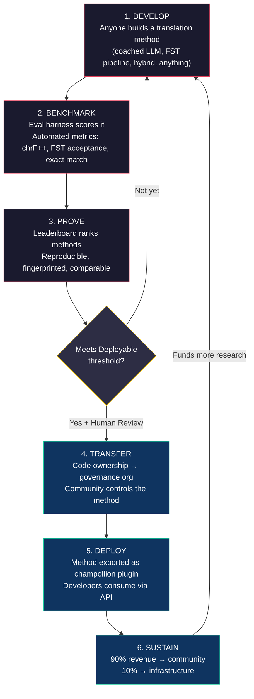
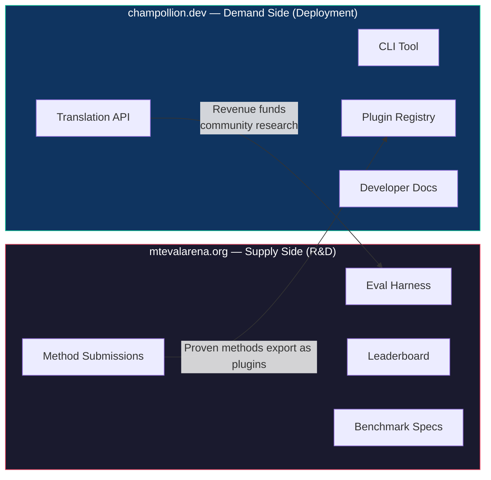
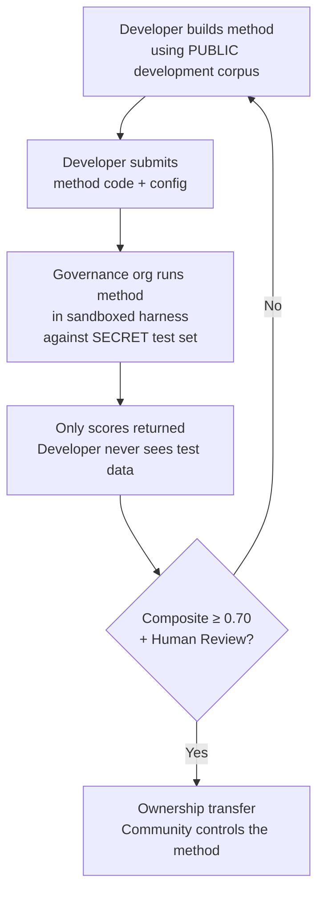

# Paano Ito Gumagana: Kompetitibong Crowdsourcing para sa Machine Translation

> **Executive Summary.** Ang machine translation para sa mga wikang kulang sa serbisyo sa buong mundo — kabilang ang ~1,300 na inaangkin ng Meta's OMT-1600 na saklaw nito ngunit nasa mga antas ng kalidad na mas mababa sa anumang magagamit na threshold — ay hindi problema sa model-training — ito ay problema sa *infrastructure*. Walang iisang model, lab, o kumpanya ang makalulutas nito. Inilalarawan ng dokumentong ito ang isang platform architecture na ginagawang distributed research lab ang pandaigdigang komunidad ng mga ML engineer, linguist, at tagapagsalita ng wika: sinuman ay bumubuo ng translation method, pinatutunayan ng platform kung gumagana ito laban sa sovereign evaluation data, at ang mga napatunayang method ay dine-deploy sa production habang ang revenue ay dumadaloy sa mga komunidad na pinaglilingkuran ng kanilang mga wika. Ang mekanismo ay competitive crowdsourcing na may cryptographic sovereignty — isang kombinasyong hindi pa nasusubukan dati.

---

> [!IMPORTANT]
> **Saklaw.** Sinusuri ng platform na ito ang **pagsasalin ng pormal na nakasulat na teksto** — mga dokumento, materyales pang-edukasyon, opisyal na komunikasyon, UI strings. Hindi ito chatbot, real-time interpreter, o unrestricted-domain conversational system. Niraranggo ng leaderboard ang mga translation method laban sa curated parallel corpora sa mga partikular na text domain (tingnan ang [Benchmark Specification §2.7](/docs/specifications/benchmark#27-domain) para sa domain taxonomy). Ang MT ay infrastructure para sa pagpapasigla ng wika, hindi kapalit nito. Natututo ang mga bata ng wika mula sa mga tao, hindi mula sa mga makina.

### Kasalukuyang Saklaw ng Domain

| Domain | Saklaw ng Tier | Status | Notes |
|--------|--------------|--------|-------|
| Opisyal / pamahalaan | Tiers 1–5 | Aktibo | EdTeKLA corpus |
| Pang-edukasyon / textbook | Tiers 1–4 | Aktibo | EdTeKLA corpus |
| Narrative / literary | Limitado | Nakaplano | Ilang entry sa gold standard |
| Relihiyoso / scriptural | Reference lamang | Hindi sinusuri | FLORES+ (Bible-domain); hindi ginagamit para sa opisyal na scoring |
| Conversational | Wala sa saklaw | By design | Sinusuri ng sistemang ito ang nakasulat na teksto, hindi speech |
| Technical / scientific | Wala sa saklaw | Hinaharap | Nangangailangan ng domain-specific terminology validation |

## 1. Ang Problema: Machine Translation ≠ Machine Learning

Karaniwang inilalarawan ang machine translation para sa low-resource languages (LRLs) bilang problema sa machine learning: mangolekta ng data, mag-train ng model, mag-deploy. Mali ang framing na ito, at may seryosong bunga ang pagkakamali — itinutulak nito ang funding, talent, at infrastructure tungo sa isang approach na istruktural na hindi maaaring gumana para sa mayorya ng mga wika sa mundo.

### 1.1 Bakit Nabibigo ang ML Framing

Nangangailangan ang karaniwang ML pipeline para sa MT ng tatlong bagay: malalaking parallel corpora, validated evaluation benchmarks, at deployment path. Para sa ~130 wikang pinaglilingkuran ng Google Translate at ~200 na saklaw ng NLLB-200, umiiral ang tatlong ito. Para sa ~1,300 karagdagang wika na inaangkin ng OMT-1600 na saklaw nito, umiiral ang evaluation data ngunit ang kalidad ay karamihang mas mababa sa magagamit na thresholds, hindi pampublikong available ang model weights, at walang deployment pipeline. Para sa natitirang ~5,400+, wala kahit alinman.

| Requirement | High-Resource Languages | Saklaw ng OMT-1600 (~1,300 LRLs) | Natitirang ~5,400 Wika |
|-------------|------------------------|-------------------------------|---------------------------|
| **Parallel corpora** | Milyun-milyong sentence pairs (Europarl, UN Corpus, OpenSubtitles) | Bible-domain bitext, web scrapes, synthetic backtranslation. Walang community-curated data. | Daan-daan hanggang mababang libo, kung mayroon man |
| **Evaluation benchmarks** | WMT, FLORES, NTREX — standardized, reproducible | BOUQuET (Bible-domain), met-BOUQuET. Walang morphological validation. Walang independent evaluation. | Walang standard benchmarks; ad hoc evaluation |
| **Deployment path** | Google Translate, DeepL, Azure — commercial APIs | Hindi inilabas ang model weights. Walang CLI, walang plugin system, walang community-deployable API. | Wala. Walang API, walang product, walang market. |

Gumagana ang ML approach kapag umiiral ang data na magagamit sa training at ang market na mapag-deploy-an. Malaki ang pinalawak ng OMT-1600 sa unang kondisyon — ngunit ang pagpapalawak nang walang independent quality verification, morphological validation, o community governance ay pagpapalawak na walang tiwala. Ang problema ay hindi lamang "kailangan natin ng mas mahusay na model" — ito ay "kailangan natin ng infrastructure na nagpapatunay na gumagana ang model, sa mga tuntuning kontrolado ng komunidad."

### 1.2 Ano Talaga ang Kailangan ng MT para sa LRLs

Ang pagsasalin para sa mga wikang kulang sa serbisyo ay hindi pangunahing problema sa training. Ito ay problema sa **method engineering** — ang hamon ng pag-assemble ng available resources (LLMs, morphological tools, community knowledge, linguistic rules) tungo sa gumaganang translation pipelines, pagkatapos ay patunayang gumagana ang mga ito gamit ang masusing pagsusuri.

Mahalaga ang pagkakaiba:

| Dimension | ML Approach | Method Engineering Approach |
|-----------|------------|---------------------------|
| **Core activity** | Mag-train ng model sa data | Pagsamahin ang tools, prompts, at linguistic knowledge sa isang pipeline |
| **Bottleneck** | Parallel data volume | Engineering creativity + evaluation infrastructure |
| **Sino ang maaaring mag-ambag** | Mga team na may GPU clusters at datasets | Sinumang may API key, dictionary, at idea |
| **Evaluation** | BLEU/chrF sa held-out test sets | Morphological validation + human review + automated metrics |
| **Deployment** | I-serve ang model | I-package ang method bilang plugin |

May latent knowledge na ang modernong LLMs tungkol sa maraming low-resource languages — sapat upang makapag-produce ng output na *mukhang* kapani-paniwala. Ang problema ay madalas morphologically invalid ang output na ito (nagha-hallucinate ang model ng mga anyo ng salita na hindi umiiral sa wika). Ang engineering challenge ay: paano ninyo kinukuha ang nalalaman ng LLM, vine-validate ito laban sa linguistic reality, at ipa-package ang resulta para sa production use?

Ito ang dahilan kung bakit nagbe-benchmark kami ng **methods**, hindi models. Ang method ay ang buong recipe: model selection + prompt engineering + tool usage + pre/post-processing + coaching data + retry strategies. Magkaiba ang magiging score ng dalawang team na gumagamit ng parehong model ngunit magkaibang methods. Iyan ang punto.

### 1.3 Bakit Sinisira ng Polysynthetic Languages ang Lahat

Marami sa mga wikang pinaka-kulang sa serbisyo sa mundo ay **polysynthetic** — nag-e-encode sila ng buong pangungusap sa iisang salita sa pamamagitan ng productive morphological processes. Isaalang-alang ang Plains Cree word:

> **ê-kî-nitawi-kîskinwahamâkosiyân**
> *"when I had gone to school"*

Isang salita. Ine-encode nito ang tense (past), direction (going to), root (learn), voice (passive/reflexive), at person (first singular). Kailangan ng English ng anim na salita para sa ipinapahayag ng Cree sa isa.

Sinisira nito ang standard MT sa bawat antas:

- **Tokenization** — Pinagpipira-piraso ng BPE at SentencePiece ang polysynthetic words sa walang-kahulugang fragments, dahil idinisenyo ang mga ito para sa concatenative morphology.
- **Hallucination** — Gumagawa ang LLMs ng mga string na mukhang kapani-paniwala ngunit hindi valid words. Hindi matutukoy ng hindi tagapagsalita ang pagkakaiba. Kung walang morphological validation, hindi nakikita ang hallucinations.
- **Evaluation** — Pinarurusahan ng word-level metrics (BLEU) ang natural inflectional variation na pundamental sa paraan ng paggana ng mga wikang ito. Mas mahusay ang character-level metrics (chrF++) ngunit hindi pa rin sapat kung walang structural validation.

Ang solusyon ay hindi mas malaking model o mas maraming training data. Ito ay **infrastructure na humuhuli ng hallucinations bago makarating ang mga ito sa users** — morphological analyzers (FSTs) na makapagsasabi nang tiyak na "hindi ito salita sa wikang ito."

---

## 2. Bakit Hindi Gumagana ang Umiiral na mga Approach

### 2.1 Commercial MT

Historikal na nag-optimize ang commercial translation services para sa market volume. Kumakatawan ang Meta's OMT-1600 (Marso 2026) sa malaking pagbabago — 1,600 wika sa isang system. Ngunit para sa ~1,300 sa kanilang pinakamababang resource tiers, mas mababa sa magagamit na thresholds ang kalidad, hindi available ang model weights, at walang deployment pipeline. Nag-evolve ang structural incentive problem: maaari na ngayong bumuo ang Big Tech ng models para sa LRLs, ngunit kung walang independent evaluation, morphological validation, o community governance, hindi nalulutas ng coverage lamang ang problema.

### 2.2 Academic Research

Napakalaki ng pokus ng academic MT research sa high-resource language pairs dahil naroon ang training data, shared tasks, at publication venues. Nahihirapang mag-publish ang mga researcher na nagtatrabaho sa low-resource pairs, nahihirapang magpondo ng compute, at nahihirapang mag-deploy — dahil hindi umiiral ang deployment infrastructure para sa LRLs.

### 2.3 One-Off Competitions

Maaari kayong magpatakbo ng Kaggle competition: "English→Plains Cree, best chrF++ wins $10,000." Ganito ang mangyayari:

1. May mananalo, magsusumite ng notebook, kukunin ang premyo, at uuwi.
2. Mabubulok ang notebook sa archive ng Kaggle. Walang magde-deploy nito. Walang magme-maintain nito.
3. Kalaunan ay ilalathala ang test set — contaminated na magpakailanman.
4. In-upload ng governance organization ang kanilang linguistic data sa infrastructure ng Google sa ilalim ng terms of service ng Google, nang walang tunay na kontrol sa lifecycle.
5. Walang deployment bridge. Ang nanalong notebook ay hindi gumaganang API.

Umaakit ng bounty hunters ang isang one-time bounty. Lumilikha ng sustained engagement ang isang ongoing leaderboard na may community governance.

### 2.4 Fine-Tuning

Ang fine-tuning ng open model sa parallel text ang malinaw na ML approach. Ngunit para sa karamihan ng LRLs, ang parallel corpus na kailangan para sa fine-tuning ay mismong data na hindi umiiral — at ang paggawa nito ay nangangailangan ng parehong bilingual speakers at community engagement na dapat sanang papalitan ng fine-tuning. Hindi ninyo maba-bootstrap ang sarili ninyo palabas ng data scarcity problem gamit ang teknik na nangangailangan ng data.

---

## 3. Ang Solusyon: Competitive Crowdsourcing na may Sovereign Evaluation

Binabaligtad ng platform ang tradisyonal na approach: sa halip na isang team ang bumuo ng isang model, **ang pandaigdigang komunidad ay nagko-compete upang bumuo ng pinakamahusay na translation method**, pinatutunayan ng platform kung gumagana ito, at ang mga napatunayang method ay dine-deploy sa production habang pinananatili ng language community ang ownership at control.

### 3.1 Ang Buong Loop

May partikular na function ang bawat stage:

| Stage | Ano ang Nangyayari | Sino ang Nakikinabang |
|-------|-------------|--------------|
| **Develop** | Bumubuo ang isang researcher, student, o hobbyist ng translation method gamit ang anumang tools na gusto nila — LLM prompting, FST pipelines, dictionaries, fine-tuned models, rule-based systems, o hybrids | Natututo, nag-e-experiment, at nagpa-publish ang contributor |
| **Benchmark** | Sine-score ng eval harness ang method laban sa standardized corpus gamit ang reproducible metrics. Bawat run ay nagpo-produce ng [run card](/docs/specifications/benchmark#3-run-card-schema) — kumpletong record ng sinubok at kung paano ito nag-perform | Nakakakuha ang researchers ng reproducible, comparable results |
| **Prove** | Lumalabas ang results sa public leaderboard. Niraranggo, ikinukumpara, at sinusuri nang mabuti ang methods. Nakikita ng komunidad kung ano ang gumagana at ano ang hindi | Nagkakaroon ang lahat ng visibility sa state of the art |
| **Transfer** | Para sa Indigenous languages, ang methods na nakaaabot sa Deployable threshold (composite ≥ 0.70) AT pumapasa sa human validation ay inililipat ang code ownership sa governance organization ng language community | Nagkakaroon ang komunidad ng revenue-generating asset |
| **Deploy** | Ine-export ang method bilang [champollion](https://github.com/gamedaysuits/champollion) plugin at sine-serve sa pamamagitan ng API. Kumokonsumo ng translations ang developers nang hindi kailangang maunawaan ang underlying method | Nakakakuha ang developers ng translation para sa mga wikang hindi pinaglilingkuran ng commercial APIs |
| **Sustain** | Hinahati ang API revenue: 90% sa komunidad, 10% sa infrastructure. Pinopondohan ng revenue ang mas maraming linguistic research, corpus development, at community programs | Pinananatili ng flywheel ang sarili nito pagkatapos ng paunang pagtatatag |

### 3.2 Bakit Gumagana ang Competitive Dynamics

Hindi incidental ang kompetisyon — ito ang mekanismo. Narito kung bakit:

**Diversity of approaches.** Ang pinakamahusay na method para sa English→Plains Cree ay maaaring FST-gated coached LLM. Ang pinakamahusay para sa English→Quechua ay maaaring dictionary-augmented pipeline. Ang pinakamahusay para sa English→Inuktitut ay maaaring fine-tuned model na bina-bootstrap mula sa Nunavut Hansard corpus. Walang iisang team o approach ang mangingibabaw sa lahat ng wika. Ipinapakita ng leaderboard kung aling *mga uri* ng approaches ang gumagana para sa aling *mga uri* ng wika — isang meta-result na mismong research contribution.

**Sustained engagement.** Hindi kailanman tapos ang leaderboard. Palaging may gustong talunin ang top score. Bawat submission ay nagdo-donate ng compute at intellectual effort sa problema. Hindi tulad ng one-time grant, lumilikha ang competitive dynamic ng tuloy-tuloy na research investment mula sa pandaigdigang komunidad.

**Low barrier to entry.** Kailangan ninyo ng API key, dictionary, at idea. Open source ang eval harness. Simple JSON ang corpus format. Maaaring makipag-compete ang isang linguistics student sa isang well-resourced lab — at minsan ay manalo, dahil maaaring mahigitan ng domain knowledge (pag-unawa sa wika) ang compute resources.

**Deployment bridge.** Ang parehong method na mataas ang score sa harness ay dine-deploy sa production sa pamamagitan ng isang config change. "Prove it here, deploy it there." Ito ang gap na hindi natutulay ng Kaggle, WMT shared tasks, at academic publications.

### 3.3 Ang Platform Architecture

Pisikal na hinahati ang ecosystem sa dalawang site na naglilingkod sa dalawang audience:

Ang **[mtevalarena.org](https://mtevalarena.org)** ay ang R&D proving ground. Ang audience nito ay ML engineers, linguists, at researchers. Lahat dito ay tungkol sa pagbuo, pagsubok, at pagpapatunay ng translation methods.

Ang **[champollion.dev](https://champollion.dev)** ay ang deployment platform. Ang audience nito ay developers na nangangailangan ng translation para sa kanilang apps. Hindi nila kailangang maunawaan kung paano gumagana ang methods — tatawagin lamang nila ang API.

Ang tulay sa pagitan ng mga ito ay ang **method plugin**: isang napatunayang method, naka-package para sa deployment, pag-aari ng komunidad.

---

## 4. Sovereign Evaluation: Bakit Mahalaga ang Infrastructure

Ang evaluation infrastructure ay hindi teknikal na detalye — ito ang core ng sovereignty model. Hindi gumagana ang standard evaluation (i-upload ang inyong test set sa shared platform) para sa Indigenous languages dahil isinusuko nito ang kontrol sa linguistic data.

### 4.1 Ang Sovereignty Mechanism

Hindi kailanman nakikita ng developer ang gold-standard evaluation data. Nagde-develop sila laban sa public development corpus, pagkatapos ay isinusumite ang kanilang method code sa governance organization, na nagpapatakbo nito sa sandbox laban sa secret test set. Scores lamang ang bumabalik. Hindi lamang ito security — ito ay direktang implementasyon ng **OCAP® principles** (Ownership, Control, Access, Possession) na kinakailangan ng Indigenous data governance.

### 4.2 Bakit Hindi Ito Maaaring Patakbuhin sa Platform ng Iba

Sa Kaggle, ina-upload ng governance organization ang kanilang linguistic data sa infrastructure ng Google sa ilalim ng terms of service ng Google. Hindi nila mababawi ang access ayon sa sarili nilang timeline. Hindi sila makapag-attach ng custom legal terms (tulad ng ownership transfer) sa submissions. Wala silang cryptographic guarantee na hindi gagamitin ang data para sa ibang layunin. Ang data sovereignty ay nangangahulugang kontrolado ng komunidad ang evaluation endpoint, hawak ang keys, at maaari itong isara.

---

## 5. Evaluation Philosophy: Microeval at LYSS

Idinisenyo ang standard MT metrics (BLEU, chrF++, COMET) upang mag-generalize sa iba’t ibang wika. Ang generality na iyon ang kanilang lakas — at ang kanilang blindspot. Para sa polysynthetic languages, ang morphologically invalid word na may kaparehong character n-grams sa reference ay mataas ang score sa chrF++ ngunit kikilalanin bilang walang-kabuluhan ng sinumang tagapagsalita.

Ang **Microeval development** ay nangangahulugang pagbuo ng evaluation metrics na iniangkop sa partikular na wika gamit ang pinakamahusay na available linguistic tools. Ang framework ay tinatawag na **LYSS** (Linguistically-informed Yield & Structural Scoring):

| Component | Ano ang sinusukat nito | Tool | Status |
|-----------|-----------------|------|--------|
| **LYSS-fst** | Morphological validity | Finite-state transducer | ✅ Na-implement (Plains Cree) |
| **LYSS-eq** | Linguistic equivalence | Linguist-curated variant rules | ✅ Na-implement (Plains Cree) |
| **LYSS-sem** | Semantic preservation | Language-specific semantic models | ✅ Na-implement (Plains Cree) |

Nagsisilbing baselines ang universal metrics (chrF++, BLEU) at bilang primary signals para sa mga wikang walang LYSS tooling. Saanman umiiral ang language-specific tools, ang LYSS components ang may bigat sa scoring — dahil ang mga bagay na pinakamahalaga para sa bawat wika ay ang mga bagay na tanging language-specific tools lamang ang makasusukat.

Para sa buong LYSS specification at composite scoring logic, tingnan ang [SCORING_SPEC.md §4](/docs/specifications/scoring#4-composite-score).

> [!WARNING]
> **Cross-run comparability.** Kapag naghahambing ng runs na may magkaibang metric availability (hal., may FST scores ang isang run, wala ang isa), hindi direktang maihahambing ang composite scores. Nino-normalize ng composite sa available metrics, ngunit mas maraming impormasyon ang dala ng run na nasuri sa 5 metrics kaysa sa nasuri sa 2. Ipinapakita ng leaderboard ang metric coverage para sa bawat entry.

---

## 6. Sino ang Pinaglilingkuran Nito

### Para sa ML Engineers & Researchers

Isang open leaderboard na may standardized benchmarks para sa language pairs na hindi saklaw ng anumang shared task. I-reproduce ang anumang result gamit ang eval harness. I-publish ang inyong method. Talunin ang top score. Bawat submission ay naka-fingerprint sa partikular na configuration at dataset version — walang ambiguity tungkol sa kung ano ang sinubok.

### Para sa Language Communities

Ownership at control sa translation technology na binuo para sa inyong wika. Nangangahulugan ang competitive dynamic na maraming team ang sabay-sabay na nagtatrabaho sa inyong wika — nakikinabang kayo sa lahat ng ito at pag-aari ninyo ang resulta. Ang revenue mula sa API usage ay nagpopondo ng community programs ayon sa inyong mga tuntunin.

### Para sa Funders & Grant Reviewers

Transparent, reproducible metrics upang suriin ang translation research proposals. Nasusukat na outcomes na lampas sa publications: API usage, revenue generated, quality metrics over time, language coverage. Lumilikha ang isang matagumpay na method ng self-sustaining revenue stream — lumalago ang impact ng grant sa halip na magtapos kapag natapos ang funding.

### Para sa Developers

Translation para sa mga wikang hindi pinaglilingkuran ng anumang commercial API. Isang CLI command (`npx champollion sync`) ang nagsasalin ng inyong locale files gamit ang community-proven methods. Gamitin ang Google Translate para sa French, coached LLM para sa Plains Cree, at community API para sa Quechua — lahat sa iisang project, lahat gamit ang parehong interface.

### Para sa Students

Isang open challenge na may real-world impact. Bumuo ng translation method para sa isang wikang kulang sa serbisyo, i-benchmark ito, at i-publish ang inyong results. Libre ang infrastructure, open ang datasets, at walang pakialam ang leaderboard kung kayo ay nasa top-10 university o nagtatrabaho mula sa library terminal.

---

## 7. Social and Technical Context

### 6.1 Bumibilis ang Language Revitalization

Lumalago sa buong mundo ang mga pagsisikap sa language revitalization. Lumalawak ang immersion schools, community language nests, at digital archiving projects sa Indigenous communities sa Canada, United States, Australia, New Zealand, at Northern Europe. Nangangailangan ang mga pagsisikap na ito ng technology — partikular, translation technology na gumagalang sa community sovereignty sa linguistic data.

### 6.2 Binago ng LLMs ang Baseline

Bago ang 2023, ang pagbuo ng anumang MT capability para sa polysynthetic language ay nangangailangan ng malaking NLP expertise, custom model training, at malalaking compute budget. Binago ng modernong LLMs ang baseline: ang maayos na prompt na may coaching data at morphological validation ay makapagpo-produce ng usable translations para sa ilang language pairs — walang training na kailangan. Malaki nitong ibinababa ang barrier to entry para sa method development. Lumipat ang problema mula sa "paano tayo bubuo ng model?" patungo sa "paano tayo bubuo ng pipeline na nagva-validate at nagko-correct ng ginagawa ng model?"

### 6.3 Ang Open-Source Benchmarking Culture

Naging sariling culture ang AI benchmarking. Pinapabilis ng leaderboards ang innovation. Umaakit ng talent ang competitions. Ang Chatbot Arena, LMSYS, Hugging Face Open LLM Leaderboard — ipinapakita ng mga platform na ito na ang competitive evaluation ay nagtutulak ng mabilis na progreso. Kinukuha namin ang energy na iyon at itinututok ito sa translation para sa libo-libong wika kung saan ang commercial MT ay maaaring hindi umiiral o hindi pa independently proven na gumagana.

### 6.4 Hindi Maaaring Ikompromiso ang Indigenous Data Sovereignty

Ang OCAP® principles (Ownership, Control, Access, Possession), ang CARE principles (Collective Benefit, Authority to Control, Responsibility, Ethics), at frameworks tulad ng Te Mana Raraunga (Māori Data Sovereignty) ay hindi optional add-ons — mga structural requirements ang mga ito para sa anumang technology na humahawak sa Indigenous linguistic resources. Ini-implement ng aming evaluation infrastructure ang mga prinsipyong ito sa architecture, hindi lamang bilang policy statements.

---

## 8. Tensions at Limitations

Gumagamit ang proyektong ito ng Western mechanism — competitive benchmarking — upang pagsilbihan ang knowledge systems na madalas communal, relational, at Elder-guided. Totoo ang tension na iyon at dapat itong pangalanan, hindi lutasin sa pamamagitan ng assertion.

**Benchmarking vs. communal knowledge.** Niraranggo ng leaderboards ang mga indibidwal at ino-optimize ang numerical scores. Binibigyang-diin ng Indigenous knowledge traditions ang relational authority, communal correction, at relationship-based legitimacy. Hindi namin maaaring angkining pinaglilingkuran namin ang mga knowledge system na ito habang bumubuo ng platform na ang core mechanism ay individual competitive optimization. Ang sovereignty architecture (§4) — kung saan pag-aari ng communities ang methods, kinokontrol ang evaluation, at nagpapasya kung ano ang dine-deploy — ang aming structural response, ngunit hindi nito pinapawi ang tension. Leaderboard pa rin ang leaderboard.

**Ano ang ginagawa namin tungkol dito.** Sinusuportahan ng platform ang team at community submissions kasabay ng individual ones. Ipinapakita ng leaderboard ang results bilang "current state of the art" sa halip na "sino ang nananalo." Ang governance organization — hindi ang leaderboard score — ang tumutukoy kung ano ang dine-deploy. Walang automated score ang nagbibigay sa developer ng karapatan sa anumang bagay; ang komunidad ang nagpapasya. At pinananatili namin ang ongoing advisory feedback loop sa partner communities tungkol sa kung nagsisilbi sa kanila ang framing at incentive structure ng platform. Kung hindi, binabago namin ito.

**Ang MT ay hindi revitalization.** Kino-convert ng translation ang teksto sa pagitan ng mga wika. Lumilikha ang revitalization ng bagong speakers. Hindi nilulutas ng perpektong MT system ang transmission problem, prestige problem, o pedagogical problem. Maaari pa nga nitong likhain ang ilusyon na "kayang magsalita ng computer ang wika," na nagpapahina sa urgency para sa human transmission. Binubuo namin ang MT bilang infrastructure — draft translation para sa post-editing, morphological tools para sa language learning apps, political leverage para sa communities na humihingi ng services sa kanilang wika — hindi bilang kapalit ng intergenerational transmission. Kinokontrol ng komunidad kung, kailan, at paano ide-deploy ang technology.

Umiiral ang seksyong ito dahil natukoy ang mga tension na ito sa isang invited critique (Mayo 2026) at nangako kaming pangalanan ang mga ito sa publiko sa halip na ibaon sa internal documents.

> [!NOTE]
> **Automated proxies ang leaderboard scores.** Lahat ng scores na ipinapakita sa leaderboard ay automated measurements na kino-compute ng evaluation harness sa ilalim ng controlled conditions. Ipinapahiwatig ng mga ito ang relative method performance ngunit hindi bumubuo ng quality guarantees. Hiwalay na minamarkahan ang community-validated methods. Walang automated score ang nagbibigay sa developer ng karapatan sa deployment — ang governance organization ang gumagawa ng desisyong iyon.

---

## 9. Kasalukuyang Kalagayan

### Ano ang Umiiral Ngayon

- **champollion** — Production-ready CLI tool. 10 translation methods, per-pair configuration, quality gates, 5 file formats. [Nai-publish sa npm](https://www.npmjs.com/package/champollion).
- **MT Eval Harness** — Gumaganang evaluation framework. Na-implement ang chrF++, FST acceptance, at exact match metrics. Finalized ang run card schema. Gumagana ang fingerprinting at integrity verification.
- **EDTeKLA Dev v1** — Plains Cree evaluation corpus (CC BY-NC-SA 4.0), mula sa EdTeKLA research group ng University of Alberta. May 486 entries ang textbook corpus (436 dev + 50 held-out), kasama ang 62 separate gold standard pairs mula sa itwêwina (548 total). Ang canonical dev corpus ay `textbook_dev.json` na may 436 entries — ang buong textbook dev split.
- **FLORES+ Devtest** — 1,012 sentences × 39 languages (CC BY-SA 4.0).
- **Arena website** — Docusaurus-based documentation site na may leaderboard, specifications, tutorials, at sovereignty framework.
- **Benchmark Specification** — [Canonical spec](/docs/specifications/benchmark) na nagtatakda ng corpus schema, run card format, at evaluation protocol. Para sa metric definitions, composite weights, at quality tiers, tingnan ang [SCORING_SPEC.md](/docs/specifications/scoring).

### Ano ang Susunod

| Phase | Ano | Status |
|-------|------|--------|
| Baseline sweep | 12 models × 3 temperatures × 2 coaching configs sa EDTeKLA | 🔲 Nakaplano |
| Composite score | Weighted metric implementation sa harness | ✅ Tapos |
| Semantic score | Verdict-weighted score mula sa CrkSemanticMetric (eval standard) | ✅ Tapos |
| Morphological accuracy | Per-morpheme scoring laban sa gold-standard analysis | 🔲 Nakaplano |
| Equivalent match | Variant-class matching sa pamamagitan ng CrkLinterMetric (eval standard) | ✅ Tapos |
| Champollion API | Metered API para sa community-owned methods | 🔲 Nakaplano |
| Second language | Palawakin sa ikalawang language pair (Inuktitut, Quechua, o Sámi) | 🔲 Nakaplano |

---

## 10. Pagsisimula

**Bumuo ng method:** I-clone ang [eval harness](https://github.com/gamedaysuits/arena), magpatakbo ng baseline experiment, at tingnan kung saan kayo mapupunta sa leaderboard.

**Mag-ambag ng corpus:** Kung nagsasalita kayo ng wikang kulang sa serbisyo, sapat na kahit 50 curated translation pairs upang magbukas ng bagong leaderboard track. Tingnan ang [Para sa Language Communities](https://mtevalarena.org/docs/community/for-language-communities).

**Mag-deploy ng translations:** I-install ang [champollion](https://github.com/gamedaysuits/champollion) at isalin ang inyong app gamit ang `npx champollion sync`.

**Pondohan ang pagsisikap:** Tingnan ang [The Economic Model](https://mtevalarena.org/docs/sovereignty/economic-model) para sa cost frameworks at sustainability projections.

---

## Tingnan Din

- **[Benchmark Specification](/docs/specifications/benchmark)** — corpus format, run card schema, evaluation protocol, sovereignty
- **[Scoring Specification](/docs/specifications/scoring)** — metrics, composite weights, quality tiers, cost/speed formulas
- **[MT Eval Arena](https://mtevalarena.org)** — ang R&D proving ground
- **[champollion](https://github.com/gamedaysuits/champollion)** — ang deployment platform
- **[Sumuporta sa isang Low-Resource Language](https://mtevalarena.org/docs/community/low-resource-languages)** — malalimang pagtalakay sa polysynthetic MT challenges at approaches

---

*Ang dokumentong ito ang entry point para sa sinumang unang makatatagpo ng proyekto. Para sa buong technical specification, tingnan ang [BENCHMARK_SPEC.md](/docs/specifications/benchmark) (protocol) at [SCORING_SPEC.md](/docs/specifications/scoring) (metrics).*