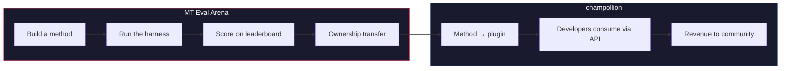

# Ang MT Eval Arena

> **Executive Summary.** Ang MT Eval Arena ay isang bukás na platform ng benchmarking para sa mga paraan ng machine translation, na nakatuon sa mga wikang kung saan ang komersiyal na MT ay wala pa o hindi pa independiyenteng nabe-verify. Nagbibigay ito ng istandardisadong pagsusuri, pampublikong leaderboard, at tulay ng deployment tungo sa production sa pamamagitan ng champollion. Para sa mga wikang Katutubo, inililipat ng mga napatunayang paraan ang pagmamay-ari sa komunidad.

Isang bukás na proving ground para sa mga paraan ng machine translation — lalo na para sa mga wikang kung saan ang komersiyal na MT ay wala pa o hindi pa independiyenteng nabe-verify.

Bumuo ng paraan. I-benchmark ito. Patunayang gumagana ito. Kung mananalo ito, ide-deploy ito.

---

## Ang Problema

Sinusuportahan ng Google Translate ang ~130 wika. Saklaw ng Meta's NLLB-200 ang ~200, at inaangkin ng OMT-1600 (Marso 2026) ang 1,600. May mahigit 7,000 wikang sinasalita sa Daigdig. Para sa ~1,300 wika sa pinakamababang resource tiers ng OMT-1600, hindi available ang model weights, mas mababa sa nagagamit na thresholds ang kalidad, at gumamit ang pagsusuri ng tekstong nasa Bible-domain na may mga karaniwang machine metrics — walang morpolohikal na balidasyon, walang independiyenteng pagsubok, walang pamamahalang pangkomunidad. Para sa natitirang ~5,400 wika, walang pretrained model na nakalilikha ng anumang output.

Namumuhunan na ngayon ang Big Tech sa saklaw ng LRL — ngunit ang saklaw na walang independiyenteng pagbe-verify ng kalidad, morpolohikal na balidasyon, o pamamahalang pangkomunidad ay saklaw na walang tiwala. Ang mga tagapagsalitang pinakanangangailangan ng mga kasangkapan sa pagsasalin ang siya ring mga komunidad na pinakamalabong magkaroon ng mga ito.

**Umiiral ang Arena upang baguhin iyan.** Ibinibigay nito ang imprastraktura upang bumuo, magsuri, at mag-deploy ng mga paraan ng pagsasalin para sa anumang wika — na may reproducible scoring, bukás na pagsusumite, at pamamahalang pangkomunidad sa kung sino ang kumokontrol sa mga resulta.

---

## Paano Ito Gumagana

1. **Bumubuo kayo ng paraan ng pagsasalin** — coached LLM, fine-tuned model, FST-gated pipeline, o anumang iba pang nakalilikha ng mga salin.
2. **Ibine-benchmark ito ng harness** — istandardisadong metrics (chrF++, exact match, FST acceptance), na naka-fingerprint sa isang partikular na Git commit.
3. **Lumilitaw ang mga resulta sa leaderboard** — bawat pagsusumite ay reproducible at maihahambing.
4. **Kung mananalo ito, inililipat ang pagmamay-ari** — para sa mga wikang Katutubo, inililipat ang code ng nanalong paraan sa organisasyong namamahala ng komunidad.
5. **Nadi-deploy ang paraan sa production** — sa pamamagitan ng [champollion](https://champollion.dev), ang API para sa mga developer. Ang revenue ay bumabalik sa komunidad.

**Patunayan ito rito. I-deploy ito roon.**

---

## Para Kanino Ito

| Kayo ay... | Ibinibigay sa inyo ng Arena ang... |
|---|---|
| **ML engineer / researcher** | Istandardisadong benchmarks, reproducible scoring, isang leaderboard na mapagkukumpitensiyahan |
| **Linguist** | Isang framework upang gawing mga nasusubok na paraan ang mga tuntunin ng grammar at mga diksyunaryo |
| **Language community member** | Pamamahala sa kung paano binubuo at dini-deploy ang mga paraan para sa inyong wika |
| **Funder / grant reviewer** | Transparent at reproducible na metrics upang suriin ang mga panukalang pananaliksik sa pagsasalin |
| **Student** | Isang bukás na hamon na may tunay na epekto — bumuo ng paraan, isumite ang inyong mga score |

---

## Kasalukuyang Benchmarks

### EDTeKLA Development Set v1
- **Pares ng wika:** English → Plains Cree (SRO)
- **Mga entry:** 548 curated pairs (486 textbook + 62 gold standard)
- **Lisensya:** CC BY-NC-SA 4.0
- **Pinagmulan:** [EdTeKLA research group](https://spaces.facsci.ualberta.ca/edtekla/), University of Alberta

### FLORES+ Devtest
- **Mga pares ng wika:** English → 39 languages
- **Mga entry:** 1,012 pangungusap bawat wika
- **Lisensya:** CC BY-SA 4.0
- **Pinagmulan:** [OLDI](https://huggingface.co/datasets/openlanguagedata/flores_plus)

---

## Ang Nag-iisang Tuntunin

:::danger Huwag magsanay sa evaluation data
Ang mga paraang nalantad sa benchmark dataset — bilang training data, few-shot examples, mga entry sa diksyunaryo, o material ng prompt — ay **madidiskwalipika**. Mag-fine-tune sa anumang nais ninyo. Huwag lamang sa test set.
:::

---

## Mga Susunod na Hakbang

- **[Magsumite ng Method](/docs/getting-started/submit-a-method)** — kung paano isumite ang inyong unang benchmark run
- **[Espesipikasyon ng Benchmark](/docs/specifications/benchmark)** — ang buong protocol ng eksperimento
- **[Mga Tuntunin ng Leaderboard](/docs/leaderboard/rules)** — pamantayan sa pagsusumite at mga patakarang anti-gaming
- **[Data Sovereignty](/docs/sovereignty/data-sovereignty)** — OCAP, CARE, at kung bakit mahalaga ang paglilipat ng pagmamay-ari
- **[Ang Modelong Pang-ekonomiya](/docs/sovereignty/economic-model)** — kung paano nagiging revenue ng komunidad ang mga score sa Arena

**[→ Tingnan ang Leaderboard](https://champollion.dev/leaderboard)**