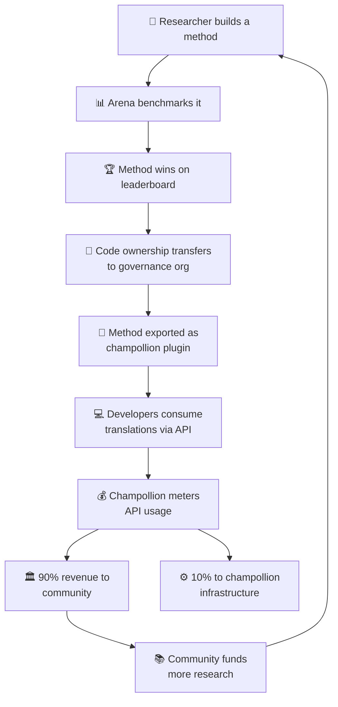

# Ang Modelong Pang-ekonomiya

> **Ehekutibong Buod.** Inilalarawan ng pahinang ito ang pang-ekonomiyang loop na nag-uugnay sa Arena at champollion: lumilikha ang pananaliksik ng mga method, naide-deploy ang mga method bilang plugins, lumilikha ng kita ang paggamit ng API, at 90% ng kita ay dumadaloy sa komunidad ng wika. Sinasaklaw nito ang mekanismo ng flywheel, paghahati ng kita, convenience layer, at kaso ng sustainability para sa mga funder.

Bumubuo ang Arena at champollion ng isang saradong pang-ekonomiyang loop. Ang pananaliksik sa Arena ay lumilikha ng mga method. Ang mga method ay nade-deploy sa pamamagitan ng champollion. Ang kita mula sa champollion ay dumadaloy pabalik sa mga komunidad na pinaglilingkuran ng mga wika ng mga method.

---

## Ang Flywheel

Bawat ikot ng flywheel ay nagpapalakas sa ecosystem:
- **Mas maraming pananaliksik** ang lumilikha ng mas mahuhusay na method
- **Mas mahuhusay na method** ang humihikayat ng mas maraming developer
- **Mas maraming developer** ang lumilikha ng mas malaking kita mula sa API
- **Mas malaking kita** ang nagpopondo sa mas maraming pananaliksik na pinangungunahan ng komunidad

---

## Paano Dumadaloy ang Kita

Kapag gumagamit ang isang developer ng method na pag-aari ng komunidad sa pamamagitan ng champollion API:

| Hakbang | Ano ang Nangyayari |
|---|---|
| Tinatawag ng developer ang `champollion sync` o ang REST API | Nalilikha ang mga salin ng method na pag-aari ng komunidad |
| Sinusukat ng Champollion ang API call | Sinusubaybayan ang paggamit per-request, per-language-pair |
| Hinahati ang kita | **90%** ay napupunta sa governance org na nagmamay-ari ng method. **10%** ang sumasaklaw sa mga gastos sa imprastraktura ng champollion. |
| Nagpapasya ang komunidad sa alokasyon | Pinopondohan ng kita ang mga programa sa wika, karagdagang pananaliksik, mga resource ng komunidad — anuman ang pagpasyahan ng governance org |

### Ang Convenience Layer

Naghahatid din ang Champollion ng mga optimized na configuration para sa mga karaniwang method. Kung mapapatunayan ng isang researcher na ang Gemini 2.5 Pro na may partikular na coaching data at mga temperature setting ang nagbibigay ng pinakamahusay na resulta para sa isang language pair, available ang configuration na iyon bilang isang pre-built preset sa pamamagitan ng champollion API. Hindi na kailangang ulitin ng mga developer ang pananaliksik — tatawagin lang nila ang API.

Itinatakda ng Arena ang mga baseline. Ginagawa itong accessible ng Champollion. Nakikinabang ang mga komunidad sa pareho.

---

## Para sa mga Standard na Wika

Pinakamalaki ang epekto ng flywheel para sa mga wikang Katutubo at low-resource, kung saan nalalapat ang ownership transfer at modelo ng kita para sa komunidad.

Para sa mga standard na wika (French, Japanese, Spanish, atbp.), nag-aalok ang champollion ng parehong kaginhawahan ng API nang wala ang governance layer — nagbabayad ang mga developer para sa metered access sa mga pre-configured na translation method, at kumukuha ang champollion ng bahagi para sa imprastraktura.

---

## Para sa mga Funder

Tinutugunan ng modelong pang-ekonomiya ang isang karaniwang alalahanin sa pagpopondo ng language technology: **sustainability pagkatapos matapos ang grant.**

| Tradisyonal na Modelo | Modelo ng Arena |
|---|---|
| Pinopondohan ng grant ang pananaliksik | Pinopondohan ng grant ang pananaliksik |
| Nailalathala ang paper | Naide-deploy ang method sa production |
| Nagtatapos ang grant, napapabayaan ang tool | Pinananatili ng kita mula sa API ang operasyon |
| Walang natatanggap ang komunidad | Pag-aari ng komunidad ang asset at kumikita ito |

Lumilikha ang isang matagumpay na method ng self-sustaining na daloy ng kita. Masusukat ng mga funder ang impact hindi lamang sa mga publikasyon, kundi pati sa:
- Paggamit ng API (ilang developer ang gumagamit ng method)
- Kitang nalilikha (gaano karaming pera ang dumadaloy sa komunidad)
- Mga quality metric (mga score sa leaderboard sa paglipas ng panahon)
- Saklaw ng wika (ilang language pair ang napaglilingkuran)

Tingnan ang [Benchmark Specification](/docs/specifications/benchmark), §10 para sa mga detalyadong cost model.

---

## Tingnan Din

- [Ownership Transfer](/docs/sovereignty/ownership-transfer) — ang legal at teknikal na proseso ng paglilipat
- [Data Sovereignty](/docs/sovereignty/data-sovereignty) — mga prinsipyo ng OCAP, CARE, at Te Mana Raraunga
- [Mga Panuntunan ng Leaderboard](/docs/leaderboard/rules) — kung paano nagiging kwalipikado ang mga method para sa deployment