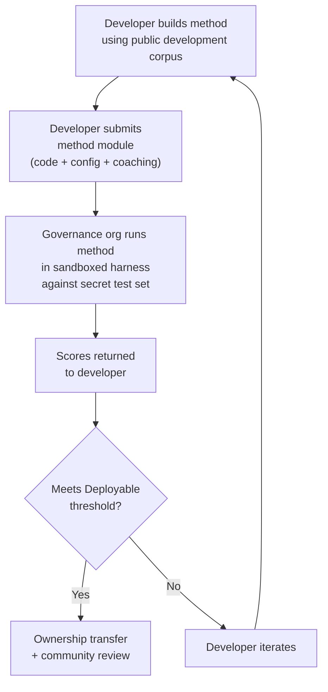

# Espesipikasyon ng Benchmark

> **Executive Summary.** Tinutukoy ng dokumentong ito ang protocol ng pagsusuri para sa Champollion MT evaluation ecosystem: format ng corpus (§2), run card schema (§3), benchmark protocol (§6), mga kinakailangan sa human validation (§7), mga mekanismo ng soberanya (§8), leaderboard at modelo ng pagsusumite (§9), framework ng gastos (§10), at extensibility sa mga bagong wika (§11). Para sa mga depinisyon ng metric, composite scoring weights, quality tier thresholds, at mga formula ng cost/speed metric, tingnan ang `SCORING_SPEC.md` — ang iisang source of truth para sa lahat ng scoring logic. Tinutukoy ng dokumentong ito ang SCORING_SPEC para sa mga detalyeng iyon sa halip na ulitin ang mga ito.
>
> Huling na-update: 2026-06-07

---

## 1. Mga Prinsipyo

### 1.1 Ang Automated Metrics ay mga Proxy

Ang bawat metric na tinukoy sa dokumentong ito ay machine-computed. chrF++, FST acceptance, morphological accuracy, semantic similarity — lahat ng ito ay mga automated proxy para sa kalidad ng salin. Kapaki-pakinabang ang mga ito para sa mabilis na iteration, sistematikong paghahambing, at pagtukoy ng mga regression. **Hindi sila kapalit ng human judgment**.

Ang hierarchy ng pagsusuri:

```
Automated metrics (run cards, benchmarks)
    ↓ proxy for
Human review (bilingual speakers validate output)
    ↓ proxy for
Actual utility (does this help a language community?)
```

Walang automated score, gaano man ito kataas, ang makapapalit sa isang matatas na tagapagsalita na nagbabasa ng output at kumukumpirmang ito ay tama, natural, at angkop sa kultura. Ang quality tiers na tinukoy sa §5 ay mga heuristic label sa automated composite scores — kapaki-pakinabang para sa pagsubaybay ng progreso, ngunit kailanman ay hindi sapat sa sarili lamang.

### 1.2 Mga Method, Hindi Mga Model

Bini-benchmark namin ang **mga method**, hindi ang mga model. Ang model ay isang component. Ang method ay ang buong recipe: pagpili ng model, disenyo ng prompt, paggamit ng tool, pre/post-processing, coaching data, retry strategies, lahat. Dalawang team na gumagamit ng parehong model ngunit may magkaibang method ay magkakaroon ng magkaibang score. Iyon ang punto.

### 1.3 Reproducibility

Dapat maging reproducible ang bawat benchmark result. Kinukuha ng run card (§3) ang kumpletong configuration ng isang eksperimento. Tinutukoy ng fingerprint (§3.5) ang experimental setup. Vine-verify ng run card hash (§3.6) ang integridad ng result. Sinumang may parehong method, corpus, at configuration ay dapat makamit ang mga score sa loob ng ±2% (isinasaalang-alang ang LLM sampling non-determinism sa temperature > 0).

### 1.4 Walang Synthetic Evaluation Data

**Ang proyektong ito ay hindi bumubuo, gumagamit, o nag-eendorso ng synthetic evaluation data.** Lahat ng corpora ay dapat kunin mula sa tunay na tekstong sinulat ng tao — mga nalathalang salin, textbook, bilingual document, o elicited translations mula sa matatas na tagapagsalita.

Maaaring tumulong ang LLMs sa:
- Sentence alignment (paghahanap ng parallel passages sa umiiral na bilingual texts)
- Format conversion (pag-convert ng mga nalathalang materyal tungo sa corpus schema)
- Metadata enrichment (pagmumungkahi ng difficulty tiers, register labels)
- Pagmumungkahi ng source sentences para sa human translation (§11.3 — ang hakbang ng pagsasalin ay laging human)

Dapat **huwag kailanman** bumuo ang LLMs ng reference translations o evaluation pairs.

**Development-neutral kami sa training data.** Kung gumagamit ang isang method developer ng synthetic training data, backtranslation, o data augmentation sa kanilang method, iyon ay kanilang pagpili — sinusuri namin ang output, hindi ang training process. Gumagamit ang Meta's OMT-1600 ng humigit-kumulang 270 milyong synthetic parallel sentences na binuo sa pamamagitan ng backtranslation. Wala kaming pagtutol sa mga method na sinanay sa ganitong paraan. Nagsusuri kami sa human curation lamang.

> **Bakit hindi Bible text para sa pagsusuri?** Sinusuri ng OMT-1600 ang 1,560 sa 1,600 wika sa Bible-domain text. Ang mga salin ng Bible ay may archaic register, liturgical vocabulary, at formulaic sentence structure. Ang aming evaluation corpora ay kinukuha mula sa community-curated, domain-diverse text — health, legal, educational, governmental, conversational, at technical domains (tingnan ang §2.7). Ito ay isang sinadyang design choice. Kailangan ng mga komunidad ang pagsasalin para sa mga domain kung saan talaga sila nabubuhay at nagtatrabaho, hindi isang religious register lamang. Ang method na mataas ang score sa Genesis 1:1 ay halos walang sinasabi tungkol sa performance nito sa band council agenda o clinic intake form.

---

## 2. Corpus Schema

Ang corpus ay isang curated set ng parallel text pairs na may structured metadata. Ito ang ground truth na pinagbabatayan ng pagsukat sa lahat ng method.

### 2.1 Dataset Envelope

Ang top-level structure ng corpus file:

```json
{
  "dataset": {
    "id": "edtekla-dev-v1",
    "version": "1.0",
    "language_pair": "EN→CRK",
    "source_language": "en",
    "target_language": "crk",
    "created": "2026-05-01",
    "license": "CC-BY-NC-SA-4.0",
    "provenance": ["gold_standard", "textbook"]
  },
  "entries": [ ... ]
}
```

| Field | Type | Required | Description |
|-------|------|----------|-------------|
| `id` | string | ✅ | Natatanging dataset identifier, ginagamit sa run cards at leaderboard |
| `version` | string | ✅ | Semantic version. Ang incrementing ay nag-i-invalidate ng mga naunang run card comparison |
| `language_pair` | string | ✅ | Display label (hal., `EN→CRK`) |
| `source_language` | string | ✅ | BCP 47 source language code |
| `target_language` | string | ✅ | BCP 47 target language code |
| `created` | string | ✅ | ISO 8601 creation date |
| `license` | string | ✅ | SPDX license identifier |
| `provenance` | string[] | ✅ | Listahan ng provenance tags na ginagamit sa mga entry |

### 2.2 Entry Schema

Kinakatawan ng bawat entry sa corpus ang isang translation challenge:

```json
{
  "id": 42,
  "source": "I see the dog",
  "reference": "niwâpamâw atim",
  "segment": "gold_standard",
  "difficulty": 2,
  "provenance": "gold_standard",
  "register": "conversational",
  "context": "declaration",
  "morphological_analysis": "ni-wâpam-âw atim | 1sg-see.TA-3sg.DIR dog.AN",
  "notes": "Animate noun (atim); direct form because speaker is proximate",
  "variant_class": "simple-ta-direct"
}
```

| Field | Type | Required | Description |
|-------|------|----------|-------------|
| `id` | integer | ✅ | Natatanging identifier sa loob ng corpus |
| `source` | string | ✅ | Source text sa source language |
| `reference` | string | ✅ | Gold-standard reference translation sa target language |
| `segment` | string | 📎 | Corpus partition: `gold_standard`, `held_out`, `development`, o `diagnostic` |
| `difficulty` | integer | 📎 | Difficulty rating 1–5 (tingnan ang §2.4) |
| `provenance` | string | 📎 | Pinagmulan ng entry na ito (tingnan ang §2.5) |
| `register` | string | 📎 | Register/formality level (tingnan ang §2.6) |
| `context` | string | 📎 | Communicative function (tingnan ang §2.6) |
| `domain` | string | 📎 | Use-case domain mula sa 16-code taxonomy (tingnan ang §2.7). Dapat isa sa: `conv`, `ecommerce`, `edu`, `financial`, `gov`, `legal`, `literary`, `marketing`, `medical`, `news`, `religious`, `scientific`, `subtitles`, `support`, `tech`, `ui`. Vine-validate sa construction time. |

> **📎 = RECOMMENDED.** Gracefully na hinahandle ng harness ang mga nawawalang optional field sa pamamagitan ng defaults. Kailangan lamang magbigay ng third-party corpora ng `id`, `source`, at `reference` sa bawat entry.
| `morphological_analysis` | string | ❌ | Gold-standard morphological breakdown |
| `notes` | string | ❌ | Translator notes, dialectal variants, ambiguity flags |
| `variant_class` | string | ❌ | Class label na naggugrupo ng acceptable translation variants |


### 2.3 Corpus Segments

Hinahati ang corpus sa mga segment na may magkakaibang access level:

| Segment | Purpose | Access | Minimum Size |
|---------|---------|--------|-------------|
| `development` | Method development at iteration. Malayang ginagamit ito ng mga developer. | **Public** | 30 entries |
| `diagnostic` | Targeted tests para sa mga partikular na linguistic phenomena. | **Public** | 10 entries |
| `gold_standard` | Opisyal na benchmark evaluation. Dito nagmumula ang leaderboard scores. | **Secret** — hawak ng governance org | 50 entries |
| `held_out` | Nakalaan para sa future evaluation. Hindi kailanman ginagamit hanggang ma-activate. | **Secret** — hawak ng governance org | 10 entries |

> **Kasalukuyang estado:** Tanging ang `development` segment lamang ang umiiral sa shipped datasets. Ang `diagnostic`, `gold_standard`, at `held_out` segments ay tinukoy para sa future use habang lumalaki ang corpora.

Ganap na secret ang `gold_standard` at `held_out` segments. Parehong ang source sentences at ang reference translations ay hawak sa governance-controlled infrastructure. Hindi kailanman nakikita ng method developers ang mga tanong o ang mga sagot. Tingnan ang §8 para sa mekanismo ng soberanya.

### 2.4 Difficulty Tiers

| Tier | Description | Examples |
|------|-------------|----------|
| 1 — Basic vocabulary | Mga solong salita, karaniwang pagbati, numero | "hello" → "tânisi", "dog" → "atim" |
| 2 — Simple sentences | Subject-verb o SVO, present tense | "I see the dog" → "niwâpamâw atim" |
| 3 — Moderate complexity | Past/future tense, possessives, animacy | "I saw his dog yesterday" |
| 4 — Complex morphology | Obviation, passive voice, conjunct order, relative clauses | "the woman whose son went to the store" |
| 5 — Advanced | Multi-clause, formal register, ceremonial, idiomatic | Buong talata na may register-appropriate tone |

Ang isang maayos na nabuo na corpus ay dapat magsama ng mga entry sa lahat ng limang difficulty tiers, na may bigat sa tiers 2–4 kung saan napapabilang ang karamihan ng real-world translation challenges.

### 2.5 Provenance Tags

Dapat ipahiwatig ng bawat entry ang pinagmulan nito:

| Tag | Meaning |
|-----|---------|
| `gold_standard` | Na-verify ng matatas na tagapagsalita |
| `textbook` | Mula sa nalathalang educational materials |
| `elicited` | Ginawa sa pamamagitan ng structured elicitation sessions |
| `corpus` | Kinuha mula sa parallel corpus |

> **Tandaan:** Sa praktika, ang provenance values ay free-form strings. Ang mga tag sa itaas ay conventions, hindi validated enum — maaaring gumamit ang datasets ng iba pang descriptive provenance strings.

### 2.6 Register at Context

Inilalarawan ng **Register** ang formality at social context:

| Register | Description |
|----------|-------------|
| `conversational` | Pang-araw-araw na pananalita sa pagitan ng magkapantay |
| `formal` | Opisyal o institutional na wika |
| `technical` | Domain-specific vocabulary |
| `ceremonial` | Tradisyonal o sagradong paggamit ng wika |
| `educational` | Mga materyal sa pagtuturo ng wika |

Inilalarawan ng **Context** ang communicative function:

> 🔲 **Planned.** Ang `context` field ay tinukoy sa schema ngunit hindi pa napupunan sa kasalukuyang datasets. Nakalaan ito para sa future corpus enrichment.

| Context | Description |
|---------|-------------|
| `greeting` | Social greeting o leave-taking |
| `declaration` | Pahayag ng katotohanan |
| `question` | Interrogative |
| `instruction` | Command o directive |
| `narrative` | Storytelling o description |
| `label` | UI label, button text, o heading |
| `error` | Error message o warning |

### 2.7 Domain

Inilalarawan ng **Domain** ang real-world use case — ang uri ng content na isinasalin. Orthogonal ito sa register at context:

- Sinasagot ng **Register**: *Gaano ito ka-formal?*
- Sinasagot ng **Context**: *Ano ang ginagawa ng pangungusap na ito?*
- Sinasagot ng **Domain**: *Para sa anong industriya/use case ito?*

Ang isang legal contract (domain: `legal`) ay maaaring formal (register: `formal`) at naglalaman ng declaration (context: `declaration`). Ang isang legal chatbot transcript (domain: `legal`) ay maaaring conversational (register: `conversational`) at naglalaman ng mga tanong (context: `question`). Parehong domain, magkaibang register at context.

| Domain Code | Description | Typical Consumers |
|-------------|-------------|-------------------|
| `ui` | Software interface strings | App developers, localization teams |
| `legal` | Contracts, statutes, court filings, immigration documents | Law firms, courts, compliance teams, IP lawyers |
| `medical` | Clinical notes, drug labels, patient communications, trial protocols | Hospitals, pharma, clinical trials, patient portals |
| `financial` | Banking, insurance, regulatory filings, audit reports | Banks, insurers, regulators, auditors |
| `edu` | Textbooks, curricula, lesson plans, academic materials | Schools, universities, textbook publishers |
| `ecommerce` | Product descriptions, reviews, marketplace listings | Online retailers, marketplace sellers |
| `marketing` | Ad copy, brand messaging, campaigns, slogans | Ad agencies, brand teams |
| `gov` | Policy documents, regulations, public notices, legislation | Government agencies, compliance teams |
| `scientific` | Research papers, abstracts, methodology, grant proposals | Researchers, journals, grant agencies |
| `religious` | Scripture, liturgical texts, theological commentary | Faith communities, liturgical publishers |
| `support` | FAQs, error messages, troubleshooting guides, chatbot scripts | SaaS companies, help desks |
| `subtitles` | Film, TV, streaming, at gaming dialogue | Streaming platforms, studios, gaming companies |
| `news` | Journalism, wire reports, editorial, press releases | Media organizations, wire services |
| `literary` | Fiction, poetry, narrative, cultural texts | Publishers, cultural preservation orgs |
| `conv` | Informal conversation, social media, messaging | Consumer apps, social platforms |
| `tech` | API docs, manuals, engineering specifications, technical guides | Documentation teams, engineering orgs |

> **Domain-specific benchmarks.** Sinusuri ng general benchmark ang isang method sa lahat ng domain. Ngunit sinusuportahan din ng Arena ang **domain-filtered benchmarks** — kung saan kinukuwenta ang scores lamang sa mga entry na naka-tag sa partikular na domain. Hinahayaan nito ang mga user na sagutin: "Aling method ang pinakamainam para sa pagsasalin ng legal documents sa French?" kumpara sa "Aling method ang may pinakamainam na overall French score?"
>
> Ang domain-filtered leaderboard rankings ay isang mahalagang product feature. Mag-iiba ang performance ng mga method sa iba't ibang domain — maaaring magtagumpay nang malaki ang method na fine-tuned sa legal terminology sa legal benchmarks ngunit mag-underperform sa conversational text. Tinutulungan ng Arena ang mga user na mahanap ang solution na pinakamahusay para sa kanilang partikular na use case.

> **Future: Arena Chatbot.** Maglalaman ang Arena website ng conversational assistant na tumutulong sa mga user na ilarawan ang kanilang MT use case (domain, language pair, quality requirements) at magrerekomenda ng pinakamahusay na community-validated method mula sa leaderboard. Halimbawa: "Kailangan kong isalin ang clinical trial protocols mula English tungo sa Japanese — aling method ang may pinakamataas na score sa medical-domain EN→JA benchmarks?" Nakadepende ito sa pagkakaroon ng sapat na domain-tagged evaluation data at method diversity.

---

## 3. Run Card Schema

Ang run card ang atomic unit ng pagsusuri. Ito ay isang self-contained JSON document na nagtatala ng kumpletong configuration at results ng isang evaluation run: isang method, isang model, isang configuration, isang dataset.

Kinukuha ng bawat run card ang tatlong dimension:
- **Quality** — gaano kahusay ang mga salin?
- **Cost** — magkano ang gastos upang magawa ang mga ito?
- **Speed** — gaano katagal ito inabot?

### 3.1 Top-Level Fields

| Field | Type | Description |
|-------|------|-------------|
| `run_id` | string | UUID v4 na binuo sa simula ng run |
| `harness_version` | string | Semantic version ng harness (hal., `2.0`) |
| `timestamp` | string | ISO 8601 UTC timestamp noong nagsimula ang run |
| `elapsed_seconds` | number | Wall-clock duration ng buong run |

### 3.2 Method Configuration

Tinutukoy ng mga field na ito ang experimental setup — ano ang sinuri at paano.

| Field | Type | Required | Description |
|-------|------|----------|-------------|
| `model_slug` | string | ✅ | Model identifier (hal., `google/gemini-2.5-flash`) |
| `model_id` | string | ❌ | Resolved model identifier na ibinalik ng API |
| `condition` | string | ✅ | Experiment label (hal., `baseline`, `coached-v3`, `few-shot`) |
| `temperature` | number | ✅ | Sampling temperature |
| `system_prompt_sha256` | string | ✅ | SHA-256 hash ng buong system prompt |
| `system_prompt_used` | string | ✅ | Ang buong system prompt text |
| `coaching_data_sha256` | string | ❌ | SHA-256 hash ng coaching data file, kung ginamit |
| `fst_version` | string | ❌ | Version ng FST analyzer, kung ginamit |
| `tools_enabled` | string[] | ❌ | Listahan ng tools na available sa method |
| `batch_size` | number | ❌ | Entries bawat concurrent API batch |
| `max_retries` | number | ❌ | Maximum retries para sa FST rejection, kung applicable |

:::info Published Run Cards Include method_config
Kapag ang isang run card ay nai-publish sa leaderboard (sa pamamagitan ng `mt-eval publish`), nagsasama rin ito ng `method_config` block na naglalaman ng canonical 8-field MethodConfig (`model`, `temperature`, `batchSize`, `register`, `coachingFile`, `coachingPrompt`, `promptContext`, `qualityTier` — lahat ay camelCase). Pinapagana nito ang zero-reconstruction import: binabasa ng `champollion leaderboard --install` ang `method_config` nang direkta at isinusulat ito bilang plugin manifest. Itinatala ng telemetry fields sa itaas (§3.2) ang naobserbahan ng harness; itinatala ng `method_config` ang nilayon ng developer.
:::

### 3.3 Dataset Reference

| Field | Type | Description |
|-------|------|-------------|
| `dataset.id` | string | Dataset identifier |
| `dataset.version` | string | Dataset version |
| `dataset.language_pair` | string | Display label |
| `dataset.sha256` | string | SHA-256 hash ng dataset file contents |
| `dataset.entry_count` | number | Bilang ng entries na nasuri |

Ipinipin ng dataset SHA-256 ang result sa isang partikular na version ng data. Kung magbabago ang dataset, hindi maikukumpara ang lumang run cards.

### 3.4 Scores (Quality)

Aggregate metrics para sa buong run. Lahat ng quality metrics ay **automated** — tingnan ang §1.1.

| Field | Type | Description |
|-------|------|-------------|
| `scores.total` | number | Kabuuang entries na nasuri |
| `scores.exact_matches` | number | Entries kung saan eksaktong tumugma ang output sa reference |
| `scores.exact_match_rate` | number | 0.0–1.0 |
| `scores.equivalent_matches` | number | Entries na tumugma sa acceptable variant |
| `scores.equivalent_match_rate` | number | 0.0–1.0 |
| `scores.fst_accepted` | number | Entries na tinanggap ng FST analyzer |
| `scores.fst_acceptance_rate` | number | 0.0–1.0, `null` kung walang FST configured |
| `scores.morphological_accuracy` | number | 0.0–1.0, `null` kung walang gold-standard analysis |
| `scores.chrf_plus_plus` | number | Corpus-level chrF++ score (0–100) |
| `scores.semantic_score` | number | Embedding-based semantic similarity (0.0–1.0) |
| `scores.ter` | number | Translation Edit Rate (0–∞, mas mababa ay mas mahusay) |
| `scores.length_ratio` | number | avg(len(predicted)/len(reference)), ideal = 1.0 |
| `scores.code_switching_rate` | number | 0.0–1.0, fraction ng entries na may source-language leakage |
| `scores.hallucination_rate` | number | 0.0–1.0, fraction ng entries na may hallucinated content |
| `scores.terminology_adherence` | number | 0.0–1.0, pagsunod sa glossary terms (`null` kung walang glossary) |
| `scores.tokens_per_second` | number | total_tokens / elapsed_seconds |
| `scores.entries_per_minute` | number | entries na naisalin bawat minuto |
| `scores.composite` | number | Weighted composite score (0.0–1.0). Tingnan ang SCORING_SPEC §4 |
| `scores.errors` | number | Entries na nabigo (API error, timeout, atbp.) |
| `scores.by_difficulty` | object | Scores na hinati ayon sa difficulty tier |
| `scores.by_provenance` | object | Scores na hinati ayon sa provenance tag |
| `scores.by_domain` | object | ✅ Implemented — Scores na hinati ayon sa domain (§2.7). Pinapagana ang domain-filtered leaderboard ranking. Kinukuwenta ng tester.py at ipinapasa sa publish.py. |

### 3.5 Totals (Cost)

| Field | Type | Description |
|-------|------|-------------|
| `totals.prompt_tokens` | number | Kabuuang input tokens sa lahat ng API calls |
| `totals.completion_tokens` | number | Kabuuang output tokens |
| `totals.reasoning_tokens` | number | Tokens na ginamit para sa chain-of-thought (0 para sa karamihan ng models) |
| `totals.cached_tokens` | number | Tokens na na-serve mula sa prompt cache ng provider |
| `totals.total_cost_usd` | number | Kabuuang gastos sa USD |
| `totals.cost_per_entry_usd` | number | `total_cost_usd / entry_count` |
| `totals.cost_per_source_char` | number | USD bawat source character — maikukumpara sa iba't ibang wika |

### 3.6 Timing (Speed)

| Field | Type | Description |
|-------|------|-------------|
| `elapsed_seconds` | number | Wall-clock duration ng buong run (top-level) |
| `scores.avg_latency_seconds` | number | Mean response time bawat entry |
| `scores.median_latency_seconds` | number | Median response time bawat entry |
| `scores.p95_latency_seconds` | number | 95th percentile response time bawat entry |

### 3.7 Per-Entry Results

Itinatala ng bawat entry sa `results[]` array ang isang salin. Ang per-entry data ay pinananatili sa `run_card_entries` table (migration 005) na may denormalized LYSS verdicts (migration 006).

| Field | Type | Description |
|-------|------|-------------|
| `entry_id` | string | Tumutugma sa `entries[].id` sa corpus |
| `source` | string | Source text na isinalin |
| `expected` | string | Gold-standard reference translation |
| `raw_predicted` | string \| null | Raw model output bago ang post-processing |
| `predicted` | string | Aktuwal na output ng method (post-processed) |
| `segment` | string | Segment identifier (hal., sentence index) |
| `difficulty` | string \| null | Difficulty tier mula sa corpus |
| `domain` | string | Domain tag mula sa corpus (§2.7) |
| `exact_match` | boolean | Kung eksaktong tumugma ang output sa reference |
| `chrf_score` | number \| null | Sentence-level chrF++ (0–100) |
| `bleu_score` | number \| null | Sentence-level BLEU (0–100) |
| `latency_s` | number \| null | Response time sa segundo |
| `cost_usd` | number \| null | Gastos sa USD para sa entry na ito |
| `tool_call_count` | integer | Bilang ng tool calls na ginamit (0 kung wala) |
| `error` | string \| null | Error message kung nabigo ang entry na ito |
| `plugin_metrics` | object | Buong per-entry plugin output (JSONB) |
| `fst_valid` | boolean \| null | Tinanggap ng GiellaLT FST ang prediction (denormalized LYSS-fst) |
| `equivalent_match` | boolean \| null | Kinumpirma ng CRK linter ang structural equivalence (denormalized LYSS-eq) |
| `semantic_verdict` | string \| null | LYSS-sem verdict: `VALID`, `MISMATCH`, `UNKNOWN`, `ERROR` |
| `code_switching_detected` | boolean \| null | Source-language tokens na-detect sa output |
| `hallucination_detected` | boolean \| null | Fabricated content na-detect sa output |


### 3.8 Fingerprint

Isang reproducibility identifier. Dalawang run na may identical fingerprints ang gumamit ng parehong experimental setup.

Ang fingerprint ay ang SHA-256 hash ng sorted concatenation ng:
- `dataset.sha256`
- `model_slug`
- `condition`
- `system_prompt_sha256`
- `temperature`
- `harness_version`
- `batch_size`
- `tools_enabled`

> **Bakit 8 components?** Materyal na nakaaapekto sa output quality ang batch size at tool-calling at dapat isama sa identity. Ang dalawang run na may magkaibang batch sizes o magkaibang tools enabled ay magkaibang experimental setups, kahit tumugma ang lahat ng ibang parameter.

Dapat makagawa ng comparable results ang dalawang run na may identical fingerprints. Ang mga pagkakaiba ay dahil sa API non-determinism (temperature > 0) o provider-side model updates.

### 3.9 Run Card Hash

Ang SHA-256 hash ng buong run card JSON (na ang `run_card_hash` field mismo ay nakatakda sa `""` habang nagha-hash). Ito ang tamper-detection seal. Kung magbabago ang anumang field, masisira ang hash.

---

## 4. Automated Metrics

Lahat ng metric sa seksyong ito ay machine-computed. Tingnan ang §1.1.

### 4.1 Metric Definitions

| Metric | Status | What It Measures | Range |
|--------|--------|-----------------|-------|
| **chrF++** | ✅ Implemented | Character n-gram F-score. Gumagana sa character level, kaya mas robust ito kaysa word-level metrics (BLEU) para sa morphologically rich languages kung saan mahahaba at highly inflected ang mga salita. Kinukuwenta ng sacrebleu. | 0–100 (native scale). Hinahati sa 100 kapag ginagamit sa composite. |
| **FST acceptance rate** | ✅ Implemented | Fraction ng predicted words na tinatanggap ng morphological analyzer (GiellaLT HFST) bilang valid forms sa target language. Ang salitang tinatanggap ng FST ay tunay, structurally valid na salita — hindi hallucination. | 0.0–1.0 |
| **Exact match** | ✅ Implemented | Fraction ng predictions na eksaktong tumutugma sa reference pagkatapos ng Unicode normalization. Strict ngunit hindi malabo — kapaki-pakinabang bilang ceiling check. | 0.0–1.0 |
| **Morphological accuracy** | 🔲 Planned | Para sa entries na may gold-standard morphological analysis: fraction ng morphemes na wastong nabuo. Mas granular kaysa FST acceptance — maaaring FST-valid ang isang salita ngunit may maling morpheme structure (tamang root, maling tense). | 0.0–1.0 |
| **Equivalent match** | ⚡ Partial | Fraction na tumutugma sa acceptable variant ng reference — isinasaalang-alang ang word order, dialectal differences, at orthographic conventions. Kasalukuyang implemented para sa CRK sa pamamagitan ng `CrkLinterMetric` ng CRK eval standard (sa `eval_standards/crk/`); awtomatikong nilo-load sa pamamagitan ng `evalMetrics` declaration ng CRK language card. Nangangailangan ang generic implementation ng per-entry `variants[]` sa corpus. | 0.0–1.0 |
| **Semantic score** | ⚡ Partial | Pagpapanatili ng kahulugan anuman ang surface form. Kasalukuyang implemented para sa CRK sa pamamagitan ng `CrkSemanticMetric` ng CRK eval standard (sa `eval_standards/crk/`, verdict-weighted proxy). Planned ang universal embedding-based cosine similarity — tingnan ang SCORING_SPEC §2.3. | 0.0–1.0 |

### 4.2 Composite Score

Ang composite score ay weighted average ng lahat ng *available* metrics:

```
composite = Σ (weight_i × metric_i)   for all available metrics
             ─────────────────────
             Σ weight_i              (renormalized to sum to 1.0)
```

Kapag unavailable ang isang metric (walang FST configured, walang variant classes defined, walang embedding model), nire-redistribute nang proporsyonal ang weight nito sa natitirang metrics. Ibig sabihin, palaging comparable ang composite sa loob ng isang wika — ginagamit nito ang anumang metrics na available para sa wikang iyon at nagno-normalize nang naaayon.

**Ang weight tables, input normalization rules, at buong metric inventory ay tinukoy sa `SCORING_SPEC.md` §4.** Ang dokumentong iyon ang SSOT para sa:
- Profile A weights (mga wikang may FST coverage — 9 metrics, structural metrics carry 40%)
- Profile B weights (mga wikang walang FST coverage — 8 metrics)
- Normalization rules (chrF++ ÷ 100, code-switching at hallucination rate inversion)
- Metrics na excluded mula sa composite (BLEU, COMET, TER, length ratio, consistency) at kung bakit

Sinasalamin ng harness code ang mga table na ito sa `mt_eval_harness/scoring.py`. Kapag nagbago ang SCORING_SPEC, ina-update ang `scoring.py` upang tumugma at vine-validate ng `test_scoring_ssot.py` ang alignment.

> **Bakit hindi BLEU?** Gumagana ang BLEU sa word level at pinaparusahan ang morphological variation. Para sa polysynthetic languages, ang isang salita ay maaaring maging buong clause — ituturing ng BLEU ang maliliit na inflectional differences bilang ganap na mali. Mas mahusay itong hinahandle ng chrF++ sa pamamagitan ng paggana sa character level. Excluded ang BLEU mula sa parehong weight tables. Tingnan ang SCORING_SPEC Appendix A para sa buong rationale.


### 4.3 Cost-Adjusted Score

Para sa mga method na gumagamit ng paid APIs, nag-uulat din kami ng secondary ranking. Ang cost-adjusted formula ay tinukoy sa `SCORING_SPEC.md` §6.3.

---

## 5. Quality Tiers

Ang quality tiers ay mga heuristic label sa automated composite scores. Inilalarawan ng mga ito kung ano ang karaniwang ibig sabihin ng scores sa praktika, batay sa human review ng outputs sa bawat level. **Hindi sila validated quality judgments** — human review (§6) lamang ang makapagkukumpirma ng aktuwal na usability.

**Ang tier thresholds at descriptions ay tinukoy sa `SCORING_SPEC.md` §5.** Ang tiers ay: Baseline (0.00–0.30), Emerging (0.30–0.50), Functional (0.50–0.70), Deployable (0.70–0.85), at Fluent (0.85–1.00).

> [!IMPORTANT]
> **Provisional ang automated tiers.** Ang mga label na ito ay mga nominasyon para sa review, hindi quality declarations. Ang method na umaabot sa "Deployable" sa automated metrics ay candidate para sa community evaluation — hindi isang produktong dapat i-ship. Human review (§7) lamang ang makapagkukumpirma ng aktuwal na usability. Maaaring magkaiba ang tier boundaries sa iba't ibang wika.

Provisional ang tiers na ito. Ire-recalibrate ang mga ito habang naiipon ang human validation data at natututuhan namin kung saan talaga pumapalo ang threshold na "nakikita ng isang tagapagsalita na kapaki-pakinabang ito" para sa bawat wika. Maaaring magkaiba ang tier boundaries sa iba't ibang wika.

Walang method ang maaaring mag-claim ng **Deployable** o mas mataas pa nang walang community review na kumukumpirmang sang-ayon ang bilingual speakers na usable ang output.

---

## 6. Benchmark Protocol

Ang **benchmark** ay ang sistematikong paggawa ng run cards sa isang declared parameter space sa isang partikular na dataset. Hindi ito isang single run — ito ay structured exploration kung paano nagpe-perform ang iba't ibang configuration.

### 6.1 What a Benchmark Produces

Gumagawa ang benchmark ng **matrix of run cards** — isa para sa bawat combination ng parameter values. Pinapagana ng matrix ang multifaceted comparison sa:

- **Quality** — composite score, individual metric breakdowns
- **Cost** — total at per-entry cost para sa bawat configuration
- **Speed** — wall-clock time at per-entry latency

Walang iisang "benchmark score." Ang benchmark ay ang buong matrix. Iba't ibang facet ang mahalaga sa iba't ibang stakeholder: ang researcher ay nag-o-optimize para sa composite score, ang deployment engineer ay nag-o-optimize para sa cost-per-entry, ang community ay nagsusuri ng quality.

### 6.2 Parameter Space

Idinedeklara ng benchmark kung aling parameters ang pine-permute:

| Axis | Typical Values | Purpose |
|------|---------------|---------|
| `model` | 4–12 models (frontier + mid-tier + budget) | Gaano kahalaga ang model capability? |
| `temperature` | 0.0, 0.3, 0.7 | Nakakatulong ba o nakakasama ang sampling randomness? |
| `prompt_version` | 2–3 prompt strategies | Gaano kasensitibo ang method sa prompt design? |
| `coaching_config` | with/without coaching data | Napapahusay ba ng injecting linguistic knowledge ang output? |
| `tool_config` | with/without FST, with/without dictionary | Napapahusay ba ng linguistic tools ang output? |

Ang buong permutation space:
```
runs = |models| × |temperatures| × |prompts| × |coaching| × |tools|
```

Isang tipikal na initial benchmark: 12 models × 3 temperatures × 2 prompts × 2 coaching = 144 runs.

### 6.3 Baseline vs. Method Evaluation

Nagsisilbi ang benchmark sa dalawang magkaibang layunin:

**Baselining** — pagmamapa ng landscape gamit ang naive approaches. "Ano ang magagawa ng umiiral na models para sa wikang ito nang walang anumang language-specific engineering?" Itinatatag nito ang bar. Sinasabi sa inyo ng baseline matrix: aling models ang may pinakakaunting hallucination, aling temperatures ang gumagawa ng pinakaconsistent na output, kung nakakatulong ba ang coaching data kahit kaunti, kung saan uniform na nabibigo ang lahat ng models (na nagpapakita ng mahihirap na linguistic problems).

**Method evaluation** — pagsusuri ng isang partikular na engineered method. "Nahihigitan ba ng aking FST-gated coached pipeline ang baselines?" Inihahambing ang run card ng method sa baseline matrix. Interesante ang isang method kapag nahihigitan nito ang pinakamahusay na baseline — kapag nagdaragdag ng value ang engineering kumpara sa naive model calls.

Parehong gumagawa ang dalawang aktibidad ng run cards na may parehong schema. Ang pagkakaiba ay nasa intent at parameter space: ang baselines ay nagpe-permute sa models at configs; ang method evaluation ay sumusuri sa isang method laban sa pinakamahusay na configurations.

### 6.4 Dev vs. Gold-Standard Evaluation

Malayang nag-i-iterate ang method developers laban sa `development` at `diagnostic` corpus segments. Impormal ito — walang limits, walang submissions, walang governance involvement. Natututuhan ng developer kung ano ang gumagana.

Ang opisyal na leaderboard scores ay nagmumula lamang sa `gold_standard` evaluation. Pormal ito:
1. Isinusumite ng developer ang kanilang kumpleto at runnable na method (code + config + coaching data)
2. Pinapatakbo ito ng governance org sa isang sandboxed harness laban sa secret test set
3. Scores lamang ang ibinabalik

Tingnan ang §8 para sa buong mekanismo ng soberanya.

---

## 7. Human Validation

Ang automated metrics ay mga proxy. Ang human validation ang ground truth.

### 7.1 What Human Review Catches That Metrics Miss

- **Morphologically valid ngunit semantically wrong** — tinatanggap ng FST ang salita, mataas ang chrF++, ngunit iba ang kahulugan ng salin
- **Culturally inappropriate** — technically correct ang salin ngunit gumagamit ng register o framing na tatanggihan ng komunidad
- **Hallucinated plausibility** — mukhang target language ang output para sa hindi tagapagsalita ngunit gibberish ito sa matatas na tagapagsalita
- **Acceptable ngunit unmarked variation** — tama ang output ngunit minamarkahan itong mali ng automated metrics dahil gumagamit ito ng dialectal variant na wala sa reference

### 7.2 The Validation Gate

Walang method ang maaaring umabante mula **Functional** tungo sa **Deployable** tier nang walang human validation na kumukumpirmang sang-ayon ang bilingual speakers na usable ang output. Hindi ito pormalidad — ito ang punto. Umiiral ang automated metrics upang bawasan ang dami ng output na kailangang i-human review. Hindi nila ito mapapalitan.

### 7.3 Community Review Protocol

> 🔲 **Planned**: Hindi pa live ang community review interface. Inilalarawan ng seksyong ito ang intended process.

1. Umaabot ang isang method sa Deployable threshold sa automated metrics
2. Ipinapakita sa bilingual speakers ang sample ng outputs (stratified by difficulty tier)
3. Nire-rate ng speakers ang bawat salin sa isang scale: **reject**, **gist** (malinaw ang kahulugan ngunit mali ang phrasing), **acceptable** (tama na may minor issues), **excellent** (hindi maihihiwalay sa human translation)
4. Nire-review ng governance org ang aggregate ratings
5. Kung tinatanggap ng community ang method, nagpapatuloy ito sa ownership transfer at deployment

---

## 8. Soberanya

Ang evaluation datasets ay naglalaman ng curated linguistic knowledge na pag-aari ng language community. Tinutukoy ng seksyong ito ang technical at legal framework para sa pagprotekta sa data na iyon.

### 8.1 The Problem

Karaniwang inilalathala nang bukas ng conventional benchmarks ang test sets. Kapag nailathala na, hindi na maaaring "i-un-publish" ang data. Para sa Indigenous at minority language communities, lumilikha ito ng extractive dynamic — ginagamit ang linguistic data nang walang patuloy na consent. Alinsunod sa pragmatic view ni Dhein sa biodata sovereignty, tinatrato namin ang linguistic data bilang isang "mercurial resource with unknowable potential" na nangangailangan ng dynamic, relational governance.

### 8.2 Sandboxed Execution

Ang primary enforcement mechanism: ibinibigay ng developer ang kanilang method module, pinapatakbo ito ng governance org laban sa ganap na secret test set sa sarili nilang infrastructure, at scores lamang ang ibinabalik. Hindi kailanman nakikita ng developer ang source sentences o ang reference translations.



Ang flow:
1. **Public ang development corpus.** Walang restrictions sa `development` at `diagnostic` segments.
2. **Ganap na secret ang gold-standard test set.** Parehong source sentences at reference translations ay nasa governance-controlled infrastructure.
3. **Upang makakuha ng opisyal na score, ibinibigay ninyo ang inyong method.** Pinapatakbo ito ng governance org sa sandbox. Scores lamang ang ibinabalik.
4. **Nasa governance org na ang method.** Ang submission AY ang method code. Kung maaabot nito ang Deployable threshold, nasa proseso na ang ownership transfer.
5. **Nangangailangan ng agreement to terms ang submission.** Kabilang ang ownership transfer clause (§8.3).
6. **Ganap na kinokontrol ng governance org ang access.** Maaari nilang tanggihan o bawiin ang evaluation anumang oras. Dynamic consent.
7. **Defense-in-depth ang encryption at rest.** Architectural ang primary enforcement.

### 8.3 Ownership Transfer

Ang mga method na nakakamit ng composite score na nasa o higit sa Deployable threshold (0.70) laban sa gold-standard evaluation, **at** pumapasa sa human validation (§7), ay sasailalim sa ownership transfer.

**Pinananatili ng developer ang:**
- Attribution at credit (nananatili ang pangalan sa leaderboard)
- Karapatang mag-publish tungkol sa method
- Karapatang gamitin ang method para sa ibang language pairs

**Nakukuha ng governance org ang:**
- Karapatang gamitin, baguhin, ipamahagi, at pagkakitaan ang method para sa kanilang wika
- Karapatang mag-sublicense
- Pisikal na possession ng method code (hawak na mula sa evaluation submission)

### 8.4 Governance Organization Requirements

Upang magsilbing key custodian para sa isang language benchmark:

1. **Katawanin ang language community** — demonstrable relationship sa speakers at cultural authorities
2. **Kakayahan para sa key management** — technical ability na mag-manage ng cryptographic keys
3. **Mangakong panatilihin ang evaluation availability** — dapat manatiling evaluable ang benchmark
4. **Mag-publish ng terms of participation** — malinaw na dokumentasyon ng sinasang-ayunan ng developers
5. **Mag-operate sa ilalim ng recognized sovereignty principles** — OCAP®, CARE, o katumbas

### 8.5 OCAP® at CARE Alignment

| Principle | Implementation |
|-----------|---------------|
| **Ownership** (OCAP) | Ang linguistic data ay pag-aari ng community. Kinokontrol ng governance org ang evaluation infrastructure. |
| **Control** (OCAP) | Kinokontrol ng governance org ang evaluation sa pamamagitan ng sandboxed execution. Sila ang nagpapasya kung sino ang magsusumite at sa anong terms. |
| **Access** (OCAP) | May unrestricted access ang community sa sarili nilang data, results, at methods na dinevelop laban dito. |
| **Possession** (OCAP) | Hindi kailanman umaalis ang test set sa governance infrastructure. Encryption at rest bilang backup. |
| **Collective Benefit** (CARE) | Tinitiyak ng ownership transfer na nakikinabang ang community sa methods. Sinusuportahan ito ng revenue model (10% throughbill margin; pinananatili ng community ang ~90%). |
| **Authority to Control** (CARE) | Sandboxed execution ang technical implementation. |
| **Responsibility** (CARE) | Tinatanggap ng developers ang responsibility sa pamamagitan ng terms of participation. |
| **Ethics** (CARE) | Karapatan ng community kaysa kaginhawaan ng researcher. |

### 8.6 Dependency Classes and the Sandbox Network Policy

Ang sandboxed execution (§8.2) at ownership transfer (§8.3) ay parehong nakadepende sa eksaktong pagkaalam kung ano ang kailangan ng isang method sa runtime. Tinutukoy ng [Method Interface spec](/docs/specifications/methods#method-validity-and-dependency-classes) ang limang **dependency classes** — S (self-contained), O (open external), A1 (substitutable LLM inference), A2 (non-substitutable external API), X (closed) — at ang dependency manifest na dapat ideklara ng bawat method. Itinatala ng subsection na ito kung paano ipinapatupad ng sandbox network policy ang mga ito.

**Default-deny egress.** Kinakailangan ng sandbox specification na walang network access ang method containers by default. Hindi ito firewall rule — inaalis ng specification ang network mula sa execution environment, kaya ang undeclared network dependency ay nabibigo sa architecture layer, hindi sa policy layer. Ang Class S at O methods ay ganap na tumatakbo mula sa artifacts na vendored sa submission (ang Class O artifacts ay pinned at mirrored in sa submission time).

**Ang LLM gateway (🔲 planned).** Karamihan ng methods ay tumatawag sa LLMs, kaya tinutukoy ng sandbox specification ang eksaktong isang egress exception: isang **LLM gateway** na pinapatakbo ng evaluation infrastructure. Ang gateway ay:

- nagpo-proxy ng inference requests sa isang **explicit allowlist of pinned models** — ang model identifiers na naitala sa manifest at run card ng method;
- **naglo-log ng bawat request at response** sa sealed audit log, upang ma-review ang gateway traffic para sa data-exfiltration attempts bago i-release ang scores;
- ang *tanging* network path — walang general egress, walang DNS, walang ibang endpoints.

Ito ang dahilan kung bakit evaluable ang Class A1 methods nang hindi tinatalikuran ang verifiability guarantees ng §8.2 — ngunit tunay itong trade-off, at tuwirang pinapangalanan ito ng specification: ang pagsasalin ng secret source sentence sa pamamagitan ng external model ay **nagdi-disclose ng source sentence na iyon sa model provider**. Hindi kailanman umaalis ang reference translations (hawak ang mga ito ng harness, sa labas ng container; tingnan ang §8.2), at hindi pa rin makakapag-exfiltrate ng anuman ang method mismo lampas sa nilalaman ng logged, allowlisted inference calls. Kung katanggap-tanggap ang bounded disclosure na iyon para sa isang partikular na corpus ay desisyon ng steward: ang pag-authorize ng Class A1 evaluation ay nangangahulugang sinasadya itong ina-authorize, bawat run, tulad ng bawat ibang paggamit ng data.

**Status.** Ang sandbox at gateway nito ay specified ngunit hindi pa built. Hanggang operational ang gateway, tanging Class S at O methods lamang ang makagagawa ng gold-standard scores; ang Class A1 methods ay nananatiling prize-eligible in principle (tingnan ang [Prize Specification §1.6](/docs/specifications/prizes)) ngunit hindi pa maaaring ma-evaluate laban sa secret segments. Hindi makapapasok ang Class A2 dependencies sa sandbox hangga't hindi nagbibigay ng pahintulot ang rights holder — kailangang payagang *umiral* ang artifact sa sandbox bago pa man lumitaw ang anumang network question.

---

## 9. Leaderboard & Submission

### 9.1 Submission Requirements

Dapat isama ng valid leaderboard submission ang:

1. Isang kumpletong run card (§3) na may lahat ng required fields
2. Ang method code — ganap na runnable, may installation instructions
3. Lahat ng dependencies — coaching data, dictionaries, FST binaries, prompts
4. Isang cost report
5. Isang README na naglalarawan sa approach at limitations ng method

### 9.2 Legitimacy Criteria

1. **Walang training sa evaluation data.** Hindi dapat na-expose ang methods sa `gold_standard` o `held_out` entries. (Architecturally enforced — hindi kayo makakapag-train sa data na hindi ninyo kailanman nakita.)
2. **Ideklara ang development data usage.** Pinapayagan ang paggamit ng `development` entries para sa few-shot prompting ngunit dapat ideklara.
3. **Reproducibility.** Dapat magawang i-re-run ng governance org at makamit ang scores sa loob ng ±2%.
4. **Generalization.** Dapat gumana ang methods sa unseen entries, hindi lamang sa memorized examples.

### 9.3 Anti-Gaming

1. **Variant-class linting** — fina-flag ang kahina-hinalang perfect performance sa entries na may known variants
2. **Corpus rotation** — maaaring mag-rotate ang governance org ng entries sa pagitan ng segments nang walang paunang abiso
3. **Community review** — nahuhuli ng human validation gate (§7) ang methods na naglalaro sa metrics ngunit gumagawa ng masamang output

### 9.4 Verification Tiers

Inilalarawan ng verification tiers kung **sino ang nag-validate ng result** — orthogonal sa quality tiers (§5), na naglalarawan kung ano ang ibig sabihin ng automated score.

| Tier | Meaning | How Achieved |
|------|---------|--------------|
| **Self-benchmarked** | Pinatakbo ng developer ang harness at isinumite ang run card | PR o `--submit` flag laban sa `development` segment |
| **GDS Verified** | Independently na-reproduce ng maintainers ang result | Isumite ang method bilang installable plugin; re-run ng maintainers |
| **Community Validated** | Pinatakbo ng governance org laban sa `gold_standard` + community review | Isumite ang method code sa governance org (§8.2); pumasa sa human validation (§7) |

Maaaring maging Self-benchmarked ang isang method sa Functional quality tier. Ang quality tier at verification tier ay independent axes sa leaderboard.

### 9.5 Layered Submission Model

Nakadepende ang submission mechanism sa kung aling corpus segment ang ine-evaluate ninyo:

| Segment | Submission Path | Verification | Method Code Required? |
|---------|----------------|-------------|----------------------|
| `development` | Self-serve: patakbuhin ang harness, isumite ang run card sa pamamagitan ng PR o API | Self-benchmarked | Hindi — pinananatili ninyo ang inyong code |
| `development` | Maintainer re-run: isumite ang method bilang plugin | GDS Verified | Oo — dapat installable ang method |
| `gold_standard` | Isumite ang method sa governance org; pinapatakbo nila ito sa sandbox | Community Validated | Oo — isinusumite at hinahawakan ang method |

Walang restrictions ang self-serve path (development segment). Kinakailangan ng sovereign path (gold-standard segment) ang full method submission dahil (a) hindi kailanman nakikita ng developer ang test set, at (b) ang methods na umaabot sa Deployable ay sasailalim sa ownership transfer (§8.3).

### 9.6 Method Classes

Inuuri ang methods ayon sa type. Ang canonical enum ay tinukoy sa harness codebase (`VALID_METHOD_CLASSES` sa `config.py`):

| Class | Description |
|-------|-------------|
| `raw-llm` | Direct LLM call na walang language-specific engineering |
| `coached-llm` | LLM na may coaching data (examples, grammar notes, dictionary entries) |
| `pipeline` | Multi-step pipeline (hal., translate → FST validate → retry) |
| `custom-plugin` | Custom `TranslationMethod` plugin |
| `api` | External translation API (Google Translate, DeepL, atbp.) |
| `human` | Human translator baseline |

### 9.7 Leaderboard Fields

| Field | Description |
|-------|-------------|
| Rank | Posisyon ayon sa composite score |
| Method name | Identifier na pinili ng developer |
| Composite score | Weighted average ng available metrics (§4.2) |
| chrF++ | Character n-gram score (0–100) |
| FST acceptance | Morphological validity rate (0.0–1.0) |
| Exact match | Strict match rate (0.0–1.0) |
| Semantic score | Meaning preservation (0.0–1.0) — 🔲 kapag available |
| Cost per entry | USD bawat corpus entry |
| Speed | Avg latency bawat entry (segundo) |
| Cost-adjusted score | Secondary ranking (§4.3) |
| Method class | Mula sa §9.6 enum |
| Model | LLM/engine na ginamit |
| Quality tier | Automated composite range (§5) |
| Verification tier | Sino ang nag-validate (§9.4) |
| Date | Kailan na-evaluate |

> [!NOTE]
> **Lahat ng scores na ipinapakita sa leaderboard ay automated proxy measurements.** Ipinapahiwatig ng mga ito ang relative method performance sa ilalim ng controlled conditions ngunit hindi bumubuo ng quality guarantees. Ang community-validated methods ay hiwalay na minamarkahan sa pamamagitan ng Verification tier column. Para sa mga detalye ng methodology, tingnan ang [SCORING_SPEC.md](/docs/specifications/scoring).

---

## 10. Cost Framework

### 10.1 Per-Run Cost

```
run_cost = entries × api_calls_per_entry × cost_per_api_call
```

Tipikal na per-run costs para sa 150-entry corpus:

| Method | Model | Estimated Cost |
|--------|-------|---------------|
| Naive LLM | Gemini 2.5 Flash | $0.15–0.30 |
| Coached LLM | Gemini 2.5 Flash | $0.30–0.60 |
| FST-gated (3 retries) | Gemini 2.5 Flash | $0.45–1.20 |
| Naive LLM | Claude Sonnet 4 | $0.45–0.90 |
| Coached LLM | GPT-4.1 | $0.60–1.50 |

### 10.2 Benchmark (Sweep) Cost

```
sweep_cost = Σ run_cost(i)   for each parameter combination i
```

Tipikal na sweep: 12 models × 3 temps × 2 prompts × 2 coaching = 144 runs sa ~$0.50 avg = **~$72 bawat sweep**.

### 10.3 Per-Language Establishment

| Component | Cost Range | Notes |
|-----------|-----------|-------|
| Speaker compensation (corpus) | $2,500–6,000 | 50–150 entries sa $50–65/hr |
| Speaker compensation (review) | $500–1,500 | Pag-review ng method output |
| Compute (benchmark sweeps) | $100–500 | Maraming sweeps habang development |
| Compute (ongoing leaderboard) | $50–200/year | Pagpapatakbo ng submitted methods |
| Infrastructure (sandbox) | $200–500/year | Eval infra ng governance org |
| **Total establishment** | **$3,350–8,500** | |

### 10.4 Program Scale

| Scale | Annual Cost | Notes |
|-------|------------|-------|
| 1 wika (maintenance) | $1,000–3,000 | Pagkatapos ng establishment |
| 5 wika (establishment + maintenance) | $25,000–65,000 | Unang taon |
| 10 wika (steady state) | $15,000–40,000 | Bawat taon pagkatapos ng establishment |

---

## 11. Extending to New Languages

### 11.1 Minimum Requirements

1. **50+ entries** sa `gold_standard` segment
2. **30+ entries** sa `development` segment
3. **10+ entries** sa `diagnostic` segment na nagta-target ng specific linguistic phenomena
4. **Provenance** para sa bawat entry
5. **Difficulty distribution** — hindi bababa sa 3 sa 5 tiers
6. **Register distribution** — hindi bababa sa 2 registers
7. **Community consent** — documented agreement mula sa language community

### 11.2 Optional but Valuable

- **FST morphological analyzer** — pinapagana ang pinakamakapangyarihang metric para sa polysynthetic languages
- **Bilingual dictionary** — pinapagana ang dictionary-based methods, binabawasan ang hallucination
- **Gold-standard morphological analysis** — pinapagana ang morphological accuracy metric
- **Variant classes** — pinapagana ang equivalent match metric at anti-gaming linting
- **Governance organization** — pinapagana ang cryptographic sovereignty at ownership transfer

### 11.3 The Agent-Assisted Path

> 🔲 **Planned**: Ang agent-assisted corpus creation ay future capability.

Para sa mga wikang walang malawak na existing resources:

1. Bumubuo ang agent ng candidate source sentences sa iba't ibang difficulty tiers at registers
2. Isinasalin ng bilingual speaker ang mga ito (laging human ang hakbang na ito)
3. Nagmumungkahi ang agent ng morphological analysis (vine-validate ng FST kung available, kung hindi ay ng speaker)
4. Ifo-format ng agent ang lahat tungo sa corpus schema
5. Nire-review ng linguist o speaker ang final corpus

Binabawasan nito ang speaker time mula ~80 oras tungo sa ~30–40 oras bawat wika.

---

*Ang spec na ito ay isang living document. Habang nagtatatag kami ng benchmarks para sa mas maraming wika, matututuhan namin kung ano ang gumagana at magre-refine nang naaayon. Ang layunin ay sapat na rigor upang maging credible, sapat na flexible upang maging kapaki-pakinabang, at sapat na open upang makalahok ang sinuman — ayon sa terms ng community.*