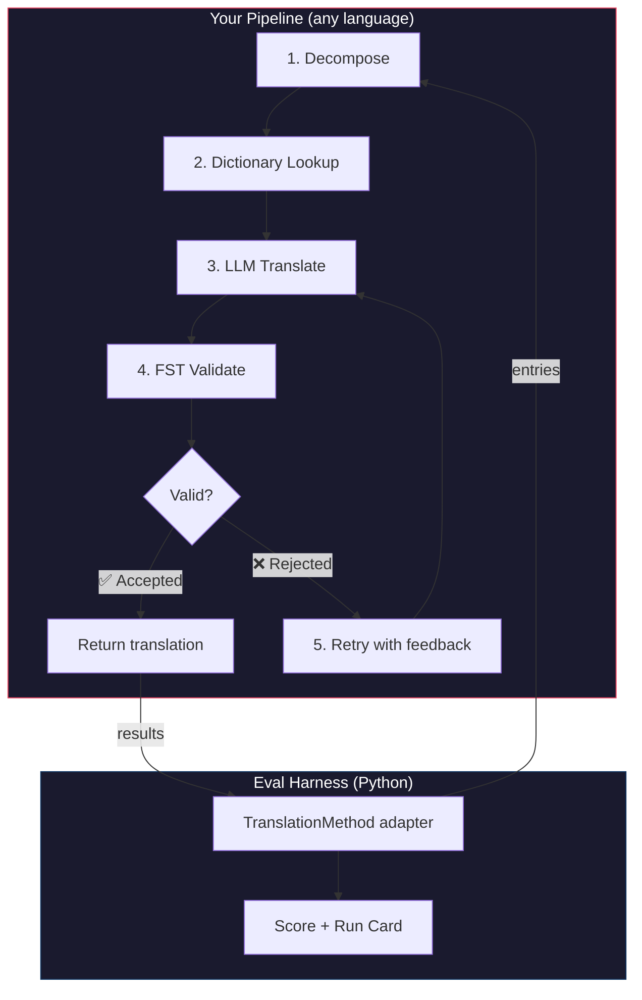
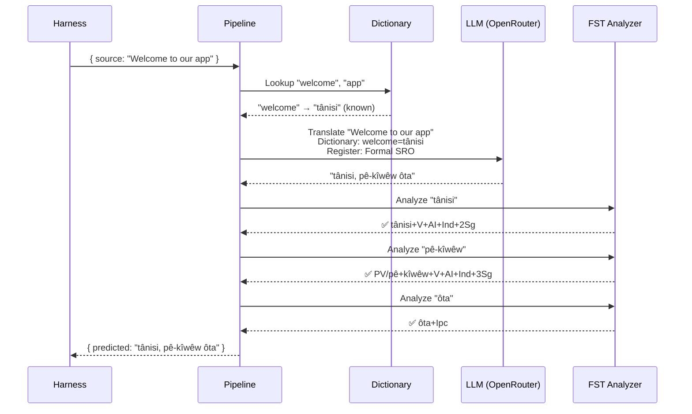
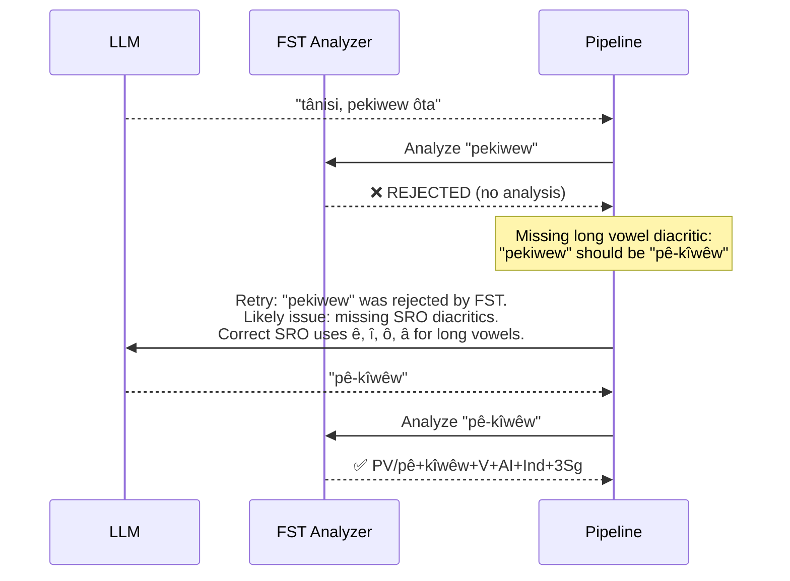

# Cookbook: FST-Gated Translation Pipeline

Bumuo ng multi-stage translation pipeline na naghahati-hati sa source text, nagsasalin gamit ang LLM, nagbe-validate ng mga output gamit ang finite-state transducer (FST), at sumusubok muli kapag tinanggihan ng FST ang hindi balidong mga anyo ng salita. Pagkatapos ay isaksak ito sa eval harness at tingnan kung paano ang score nito.

**Ang bubuuin ninyo:** Isang translation pipeline para sa Plains Cree na nakakahuli ng mga hindi balidong salin sa morpolohiya *bago* pa ang mga ito mabilang laban sa inyong score.

:::info Mga Paunang Kinakailangan
- Isang tumatakbong FST binary (hal., mula sa [Plains Cree analyzer ng ALTLab](https://github.com/UAlbertaALTLab/lang-crk))
- Node.js 20+ (para sa pipeline) at Python 3.10+ (para sa harness)
- Isang OpenRouter API key para sa hakbang na LLM
:::

---

## Arkitektura

Ang pipeline ay isang kadena ng mga stage. May espesipikong trabaho ang bawat stage. Maaari ninyo itong buuin sa anumang wika — gumagamit ng JavaScript ang halimbawang ito, ngunit walang pakialam ang harness kung ano ang nasa loob. Nakikita lamang nito ang manipis na Python adapter sa hangganan.



### Bakit ang Mga Stage na Ito

| Stage | Ano ang Ginagawa Nito | Bakit Ito Mahalaga |
|-------|-------------|---------------|
| **Decompose** | Hinahati ang compound UI strings sa mga segment na maisasalin | Ine-encode ng polysynthetic languages ang buong mga pangungusap sa iisang salita — kailangan ng LLM ng mas maliliit na unit |
| **Dictionary Lookup** | Tinitingnan ang bilingual dictionary para sa mga kilalang salin | Ipinipilit ang tamang terminolohiya para sa mga kilalang termino sa halip na umasa sa hula ng LLM |
| **LLM Translate** | Ipinadadala ang segment sa isang LLM na may konteksto ng register at grammar | Hinahawakan ang mga bagong parirala at lumilikha ng maliksing output |
| **FST Validate** | Pinapatakbo ang output sa isang morphological analyzer | Nahuhuli ang hindi balidong mga anyo ng salita — kung tinanggihan ng FST ang isang salita, hindi ito balidong anyo ng salita sa wika |
| **Retry** | Muling ipinadadala ang mga tinanggihang salita kasama ang error feedback ng FST | Nagbibigay sa LLM ng espesipikong impormasyon kung *bakit* mali ang salita |

---

## Ang Daloy ng Data

Ganito ang nangyayari sa isang entry habang dumadaloy ito sa pipeline:



### Kapag Tumatanggi ang FST



---

## Implementasyon

Bumuo ng anumang gusto ninyo. Gumagamit ng JavaScript ang halimbawang ito, ngunit maaari ninyong gamitin ang Python, Rust, o anupaman. Walang pakialam ang harness — nakikipag-usap lamang ito sa manipis na Python adapter (ipinapakita sa susunod na seksyon).

### Ang Pipeline

Ang bawat stage ay isang function. Pinagdurugtong-dugtong ng pipeline ang mga ito.

```javascript title="pipeline.js"
import { lookupDictionary } from './dictionary.js';
import { callLLM } from './llm.js';
import { analyzeWithFST } from './fst.js';

const MAX_RETRIES = 3;

/**
 * Translate a batch of keys through the full pipeline.
 *
 * @param {object} keys - Map of key → source string
 * @param {object} options - { sourceLang, targetLang }
 * @returns {{ translations: object, stats: object }}
 */
export async function translateBatch(keys, options) {
  const translations = {};
  const stats = { total: 0, fstAccepted: 0, retries: 0, dictionaryHits: 0 };

  for (const [key, sourceText] of Object.entries(keys)) {
    stats.total++;
    translations[key] = await translateSingle(sourceText, options, stats);
  }

  return { translations, stats };
}

/**
 * Translate a single string through all pipeline stages.
 */
async function translateSingle(sourceText, options, stats) {

  // ── Stage 1: Decompose ──────────────────────────────────
  // Split compound strings into segments the LLM can handle.
  // For UI strings this is often a no-op, but for longer content
  // it prevents the LLM from losing context in long prompts.
  const segments = decompose(sourceText);

  // ── Stage 2: Dictionary Lookup ──────────────────────────
  // Check each segment against the bilingual dictionary.
  // Known terms are forced — the LLM won't override them.
  const knownTerms = {};
  for (const segment of segments) {
    const entry = lookupDictionary(segment.toLowerCase());
    if (entry) {
      knownTerms[segment] = entry;
      stats.dictionaryHits++;
    }
  }

  // ── Stage 3: LLM Translate ──────────────────────────────
  let translation = await callLLM(sourceText, {
    ...options,
    knownTerms,
    register: 'nêhiyawêwin (Plains Cree). Use SRO orthography. '
            + 'Professional register for educational contexts.',
  });

  // ── Stage 4: FST Validate ──────────────────────────────
  // Split the translation into words and check each one.
  let { accepted, rejected } = await validateWords(translation);

  // ── Stage 5: Retry Loop ─────────────────────────────────
  // If any words were rejected, retry with FST feedback.
  let attempt = 0;
  while (rejected.length > 0 && attempt < MAX_RETRIES) {
    attempt++;
    stats.retries++;

    const feedback = rejected
      .map(w => `"${w}" was rejected by the morphological analyzer`)
      .join('; ');

    translation = await callLLM(sourceText, {
      ...options,
      knownTerms,
      register: 'nêhiyawêwin (Plains Cree). Use SRO orthography.',
      feedback: `Previous attempt had invalid words. ${feedback}. `
              + 'Use correct SRO diacritics (ê, î, ô, â for long vowels). '
              + 'Ensure verb forms match expected conjugation patterns.',
    });

    ({ accepted, rejected } = await validateWords(translation));
  }

  if (rejected.length === 0) stats.fstAccepted++;

  return translation;
}

/**
 * Decompose source text into translatable segments.
 *
 * For simple key-value UI strings, this usually returns the
 * original string as a single segment. For longer content,
 * it splits on sentence boundaries.
 */
function decompose(text) {
  // Simple sentence-boundary split. Replace with your own
  // morphological decomposition for more complex needs.
  return text
    .split(/(?<=[.!?])\s+/)
    .filter(s => s.trim().length > 0);
}

/**
 * Validate each word in a translation against the FST.
 *
 * @returns {{ accepted: string[], rejected: string[] }}
 */
async function validateWords(translation) {
  // Split on whitespace and punctuation, keeping only words
  const words = translation
    .split(/[\s,;:.!?'"()\[\]{}]+/)
    .filter(w => w.length > 0);

  const accepted = [];
  const rejected = [];

  for (const word of words) {
    const analyses = await analyzeWithFST(word);
    if (analyses.length > 0) {
      accepted.push(word);
    } else {
      rejected.push(word);
    }
  }

  return { accepted, rejected };
}
```

### Ang FST Wrapper

I-wrap ang inyong FST binary bilang async function. Gumagamit ang halimbawang ito ng HFST-based Plains Cree analyzer ng ALTLab.

```javascript title="fst.js"
import { execFile } from 'node:child_process';
import { promisify } from 'node:util';

const execFileAsync = promisify(execFile);

// Path to your FST analyzer binary
const FST_PATH = process.env.FST_ANALYZER_PATH || './bin/crk-analyzer';

/**
 * Run a word through the FST morphological analyzer.
 *
 * Returns an array of analyses. Empty array = rejected.
 *
 * Example:
 *   analyzeWithFST("tânisi")
 *   → ["tânisi+V+AI+Ind+2Sg", "tânisi+V+AI+Cnj+2Sg"]
 *
 *   analyzeWithFST("pekiwew")
 *   → []  // rejected — missing diacritics
 *
 * @param {string} word - A single word in SRO orthography
 * @returns {string[]} Array of FST analyses (empty = rejected)
 */
export async function analyzeWithFST(word) {
  try {
    // HFST lookup: pipe the word to stdin, read analyses from stdout
    const { stdout } = await execFileAsync(
      FST_PATH,
      ['--quiet'],
      { input: word + '\n', timeout: 5000 }
    );

    // Parse HFST output: each line is "input\tanalysis\tweight"
    // Lines with "+?" indicate unrecognized forms
    return stdout
      .split('\n')
      .filter(line => line.includes('\t') && !line.includes('+?'))
      .map(line => line.split('\t')[1]);

  } catch (err) {
    // If the FST binary isn't available, log and reject
    console.error(`[WARN] FST analysis failed for "${word}": ${err.message}`);
    return [];
  }
}
```

### Mga Module ng Dictionary at LLM

```javascript title="dictionary.js"
/**
 * Simple bilingual dictionary backed by a JSON file.
 *
 * In production, you'd load from the coaching data directory
 * or query itwêwina (https://itwewina.altlab.app/) via API.
 */
const DICTIONARY = {
  'hello': 'tânisi',
  'welcome': 'tânisi',
  'thank you': 'kinanâskomitin',
  'home': 'kīwēwin',
  'search': 'nānātawāpahtam',
  'settings': 'isi-nākatohkēwin',
  'help': 'nīsōhkamākēwin',
  'back': 'kīwē',
};

/**
 * @param {string} term - Lowercase English term
 * @returns {string|null} Cree translation or null
 */
export function lookupDictionary(term) {
  return DICTIONARY[term] || null;
}
```

```javascript title="llm.js"
/**
 * Call an LLM via OpenRouter for translation.
 */
const OPENROUTER_API = 'https://openrouter.ai/api/v1/chat/completions';

export async function callLLM(sourceText, options) {
  const { knownTerms = {}, register, feedback } = options;

  // Build the system prompt with register and known terms
  let systemPrompt = `You are translating English to Plains Cree.\n\n`;
  systemPrompt += `Register: ${register}\n\n`;

  if (Object.keys(knownTerms).length > 0) {
    systemPrompt += `Required terminology (use these exact translations):\n`;
    for (const [en, crk] of Object.entries(knownTerms)) {
      systemPrompt += `  "${en}" → "${crk}"\n`;
    }
    systemPrompt += '\n';
  }

  if (feedback) {
    systemPrompt += `IMPORTANT correction from previous attempt:\n${feedback}\n\n`;
  }

  systemPrompt += `Rules:\n`;
  systemPrompt += `- Use Standard Roman Orthography (SRO)\n`;
  systemPrompt += `- Use macron/circumflex for long vowels: ê, î, ô, â\n`;
  systemPrompt += `- Return ONLY the Cree translation, nothing else\n`;

  const response = await fetch(OPENROUTER_API, {
    method: 'POST',
    headers: {
      'Authorization': `Bearer ${process.env.OPENROUTER_API_KEY}`,
      'Content-Type': 'application/json',
    },
    body: JSON.stringify({
      model: 'google/gemini-2.5-pro',
      messages: [
        { role: 'system', content: systemPrompt },
        { role: 'user', content: sourceText },
      ],
      temperature: 0.2,
    }),
  });

  const json = await response.json();
  return json.choices[0].message.content.trim();
}
```

---

## Pagsaksak sa Harness

Nabuo na ang inyong pipeline. Ngayon, kailangan ninyo itong ikonekta sa eval harness upang ma-benchmark ninyo ito sa leaderboard.

Isang interface ang ginagamit ng harness: `TranslationMethod`. Isa itong Python protocol na may iisang method. Bumuo ng anumang gusto ninyo sa anumang wika — pagkatapos ay bigyan ito ng manipis na wrapper na ito at masasaksak na ito.

```python title="fst_gated_process.py"
"""
TranslationMethod adapter for the FST-gated pipeline.

This thin wrapper connects your pipeline (running as a local
subprocess or HTTP server) to the eval harness. The harness
calls translate() with corpus entries. You call your pipeline.
You return results. That's it.
"""

import time
import subprocess
import json
from mt_eval_harness.config import RunConfig


class FSTGatedProcess:
    """Adapter between the eval harness and your FST-gated pipeline.

    The pipeline runs as a Node.js subprocess. This wrapper:
    1. Receives entries from the harness
    2. Sends them to the pipeline
    3. Returns structured results the harness can score
    """

    def __init__(self, pipeline_url: str = "http://localhost:3001"):
        self.pipeline_url = pipeline_url

    async def translate(
        self,
        entries: list[dict],
        config: RunConfig,
    ) -> list[dict]:
        """Translate a batch of entries through the FST-gated pipeline.

        Args:
            entries: List of corpus entries with 'id' and source text.
            config: Harness run configuration (for context).

        Returns:
            List of result dicts, one per entry.
        """
        import httpx

        results = []

        for entry in entries:
            source_text = entry.get(config.source_field, entry.get("source", ""))
            start = time.monotonic()

            try:
                # Call your pipeline — however it's running
                async with httpx.AsyncClient() as client:
                    response = await client.post(
                        f"{self.pipeline_url}/translate",
                        json={"keys": {str(entry["id"]): source_text}},
                        timeout=30.0,
                    )
                    data = response.json()
                    predicted = data["translations"][str(entry["id"])]

                elapsed = time.monotonic() - start

                results.append({
                    "id": entry["id"],
                    "predicted": predicted,
                    "latency_s": elapsed,
                    "usage": {},  # pipeline doesn't expose token counts
                    "error": None,
                    "tool_calls": [],
                    "tool_call_count": 0,
                    "metadata": data.get("meta", {}),
                })

            except Exception as err:
                results.append({
                    "id": entry["id"],
                    "predicted": "",
                    "latency_s": time.monotonic() - start,
                    "usage": {},
                    "error": str(err),
                    "tool_calls": [],
                    "tool_call_count": 0,
                    "metadata": {},
                })

        return results
```

:::tip Hindi ninyo kailangan ang HTTP
Tinatawag ng halimbawa sa itaas ang pipeline sa pamamagitan ng HTTP dahil nasa JavaScript ang pipeline. Kung nasa Python ang inyong pipeline, maaari ninyo itong tawagin nang direkta — hindi kailangan ng server. Ang `TranslationMethod` wrapper ay hangganan lamang ng function. Nasa sa inyo kung ano ang mangyayari sa loob.
:::

### Pagpapatakbo ng Benchmark

Simulan ang inyong pipeline, pagkatapos ay patakbuhin ang harness:

```bash
# Terminal 1: Start the pipeline
node server.js

# Terminal 2: Run the harness with your process
export OPENROUTER_API_KEY="sk-or-v1-..."

python -c "
import asyncio
from mt_eval_harness.config import RunConfig
from mt_eval_harness.runner import execute_run
from fst_gated_process import FSTGatedProcess

async def main():
    config = RunConfig(
        corpus_path='data/edtekla-dev-v1.json',
        source_lang='English',
        target_lang='Plains Cree (nêhiyawêwin, SRO)',
        process_name='fst-gated-v1',
    )
    process = FSTGatedProcess('http://localhost:3001')
    run_log = await execute_run(config, process=process)
    print(f'Results: {run_log.output_path}')

asyncio.run(main())
"
```

O gamitin ang CLI na may `baseline_experiment.py` upang ihambing laban sa built-in baseline:

```bash
python eval/baseline_experiment.py \
  --dataset data/edtekla-dev-v1.json \
  --model google/gemini-2.5-pro \
  --fst-analyzer ./bin/crk-analyzer \
  --condition fst-gated-v1 \
  --submit
```

---

## Pag-unawa sa Inyong mga Resulta

Gumagawa ang harness ng **run card** — isang JSON file na may inyong mga score. Narito ang makikita ninyo:

```
═══════════════════════════════════════════════════
  FST-Gated Pipeline v1 — EDTeKLA Dev v1
═══════════════════════════════════════════════════

  chrF++              48.7 / 100
  Exact match         12.1%
  FST acceptance      94.4%
  Composite score     0.52  →  Functional ✓

  404 entries (master_corpus.json) · 47 retries · $0.18 total cost
═══════════════════════════════════════════════════
```

**Ano ang mabilis na sinasabi nito sa inyo:**
- Ang inyong pamamaraan ay nasa **Functional** tier (0.50–0.70) — nakikilala ng isang speaker ang output, karaniwang tama ang pangunahing grammar, ngunit nananatili ang madalas na mga error sa morpolohiya.
- Nahuhuli ng FST ang 94% ng mga salita bilang balido — gumagana ang inyong retry loop.
- Eksaktong tama ang 12% ng mga salin — marami pang puwang para paghusayin.

:::info Mga Antas ng Kalidad
| Tier | Composite | Ano ang Ibig Sabihin Nito |
|------|-----------|---------------|
| Baseline | 0.00–0.30 | Hilaw na output ng LLM, karamihan ay hallucinated morphology |
| Emerging | 0.30–0.50 | Ilang tamang pattern, hindi maaasahan |
| **Functional** | **0.50–0.70** | **Nakikilala ng isang speaker. Karaniwang tama ang mga pangunahing kategorya.** |
| Deployable | 0.70–0.85 | Angkop para sa draft translation na may human review |
| Fluent | 0.85–1.00 | Papalapit sa mahusay na saling-tao |

Tingnan ang [SCORING_SPEC §5](/docs/specifications/scoring#5-quality-tiers) para sa buong mga depinisyon ng tier.
:::

<details>
<summary><strong>Mas Malalim: Ano ang nasa run card?</strong></summary>

Itinatala ng run card JSON ang lahat tungkol sa evaluation run na ito. Mga pangunahing seksyon:

**Mga Score** — bawat metric na kinompyut ng harness:
```json
{
  "scores": {
    "exact_match_rate": 0.121,
    "chrf_plus_plus": 48.7,
    "fst_acceptance_rate": 0.944,
    "composite_score": 0.52,
    "quality_tier": "functional"
  }
}
```

**Provenance** — kung ano ang lumikha ng mga resultang ito:
```json
{
  "method": {
    "process_name": "fst-gated-v1",
    "model": "google/gemini-2.5-pro",
    "temperature": 0.0
  },
  "corpus": {
    "id": "edtekla-dev-v1",
    "sha256": "a1b2c3..."
  }
}
```

**Mga resulta kada entry** — bawat salin na may indibidwal na mga score, upang makita ninyo kung saan nahihirapan ang inyong pamamaraan:
```json
{
  "id": 42,
  "source": "The student completed the assignment",
  "reference": "ôskiniw kî-kîsîhtâw ôhi atoskêwina",
  "predicted": "ôskiniw kî-kîsîhtâw ôhi atoskêwin",
  "chrf": 89.2,
  "exact_match": false,
  "fst_accepted": true
}
```

Ang composite score ay weighted average ng mga available na metric, na may mga weight na tinukoy sa [SCORING_SPEC §4](/docs/specifications/scoring#4-composite-score). Kapag hindi available ang isang metric, ang weight nito ay muling ipinamamahagi nang proporsyonal sa iba.

</details>

---

## Pag-deploy sa Production

May mga score na ang inyong pamamaraan sa leaderboard. Ngayon, nais na ninyo itong aktuwal na gamitin. Ang seksyong ito ay tungkol sa pag-serve ng inyong pipeline bilang production endpoint na maaaring tawagin ng [champollion](https://champollion.dev).

:::note Opsyonal ang seksyong ito
Ang lahat sa itaas ay tungkol sa pagbuo at pag-benchmark ng inyong pamamaraan. Ang seksyong ito ay tungkol sa deployment — isang hiwalay na usapin. Maaari kayong magsumite sa leaderboard nang walang dine-deploy.
:::

### Ang HTTP Server

I-wrap ang inyong pipeline bilang Express server na nagpapatupad ng [API method contract](https://champollion.dev/docs/guides/serving-a-method):

```javascript title="server.js"
import express from 'express';
import { translateBatch } from './pipeline.js';

const app = express();
app.use(express.json());

/**
 * API method contract:
 *
 * Request:  { source_locale, target_locale, method, keys: { "key": "source" } }
 * Response: { translations: { "key": "translated" }, meta: { ... } }
 */
app.post('/translate', async (req, res) => {
  const { source_locale, target_locale, method, keys } = req.body;

  // Validate request
  if (!keys || typeof keys !== 'object') {
    return res.status(400).json({ error: { message: 'Missing keys object' } });
  }

  try {
    const startTime = Date.now();
    const { translations, stats } = await translateBatch(keys, {
      sourceLang: source_locale,
      targetLang: target_locale,
    });

    res.json({
      translations,
      meta: {
        model: 'custom-pipeline/fst-gated-v1',
        method: 'decompose-lookup-translate-validate',
        elapsed_ms: Date.now() - startTime,
        fst_acceptance_rate: stats.fstAccepted / stats.total,
        retries: stats.retries,
      },
    });
  } catch (err) {
    console.error('[ERR] Pipeline failed:', err.message);
    res.status(500).json({ error: { message: err.message } });
  }
});

// Health check for connectivity verification
app.get('/health', (req, res) => res.json({ status: 'ok' }));

app.listen(3001, () => {
  console.log('FST-gated pipeline running on http://localhost:3001');
});
```

### I-configure ang champollion

Ituro ang inyong language pair sa tumatakbong service:

```json title="champollion.config.json"
{
  "version": 3,
  "inputLocale": "en",
  "pairs": {
    "en:crk": {
      "method": "api",
      "endpoint": "http://localhost:3001/translate"
    }
  },
  "languages": {
    "crk": {
      "name": "Plains Cree",
      "register": "SRO syllabics with grammatical precision."
    }
  }
}
```

```bash
# Run it
export OPENROUTER_API_KEY="sk-or-v1-..."
node server.js &
npx champollion sync
```

### Pag-package Bilang Plugin

Kapag may mga score na ang inyong pamamaraan, i-package ito upang magamit ito ng iba:

```json title="crk-fst-gated-v1/method.json"
{
  "name": "crk-fst-gated-v1",
  "type": "api",
  "version": "1.0.0",
  "description": "FST-gated Plains Cree translation with morphological validation",
  "author": "Your Name",

  "config": {
    "endpoint": "https://your-server.example.com/translate"
  },

  "locales": ["crk"],

  "benchmarks": {
    "crk": {
      "date": "2026-06-01T00:00:00Z",
      "corpus_size": 404,
      "exact_match_rate": 0.12,
      "corpus_chrf": 48.7,
      "model": "google/gemini-2.5-pro",
      "harness_version": "2.0"
    }
  },

  "provenance": {
    "resources": [
      { "name": "ALTLab CRK Analyzer", "license": "LGPL-3.0", "type": "fst" },
      { "name": "Wolvengrey Dictionary", "license": "CC-BY-NC-SA-4.0", "type": "dictionary" }
    ],
    "commercialReady": false,
    "flags": ["nc-resource"]
  }
}
```

---

## Pagpapalawak ng Pattern na Ito

Ipinapakita ng cookbook na ito ang isang arkitektura ng pipeline. Maaari ninyo itong iangkop para sa anumang wika o pamamaraan:

| Variation | Ano ang Nagbabago |
|-----------|-------------|
| **Different FST** | Palitan ang binary path. Maaari kayong mag-download ng precompiled FSTs (tulad ng mga binary na `.hfstol` o `lttoolbox`) para sa mahigit 100 wika mula sa [GiellaLT GitHub](https://github.com/giellalt) o [Apertium GitHub](https://github.com/apertium). |
| **No FST available** | Alisin ang FST execution stage at gamitin ang [UniMorph flat paradigm files](https://huggingface.co/datasets/unimorph/universal_morphologies) mula sa Hugging Face upang magsagawa ng static database lookup validation ng inflected forms. |
| **Multiple LLMs** | Pagkadenahin ang mga model: isang mabilis na model para sa paunang draft, isang reasoning model para sa mga koreksiyon. |
| **Human-in-the-loop** | Magdagdag ng queue stage na humahawak sa hindi tiyak na mga salin para sa expert review bago ibalik. |
| **Fine-tuned model** | Palitan ang OpenRouter call ng isang local model (Ollama, vLLM, atbp.). |
| **Different language** | Baguhin ang dictionary, FST, at register. Nananatiling magkapareho ang arkitektura. |

Ang pipeline ay isang pattern. Napagpapalit-palit ang mga stage. Buuin ang gumagana para sa inyong wika, patunayan ito sa [leaderboard](https://champollion.dev/leaderboard), at i-deploy ito.

---

## Tingnan Din

- **[Eval Harness](/docs/specifications/harness)** — paano patakbuhin ang harness at bigyang-kahulugan ang output
- **[Method Interface](/docs/specifications/methods)** — ang espesipikasyon ng protocol na `TranslationMethod`
- **[Mga Panuntunan ng Leaderboard](/docs/leaderboard/rules)** — pamantayan sa pagsusumite at mga patakarang kontra-manipulasyon
- **[Suportahan ang isang Low-Resource Language](/docs/community/low-resource-languages)** — ang mas malawak na konteksto at mga prinsipyo ng OCAP
- **[ALTLab](https://altlab.artsrn.ualberta.ca/)** — ang Alberta Language Technology Lab (Plains Cree FST)
- **[Method Leaderboard](https://champollion.dev/leaderboard)** — isumite ang inyong mga score