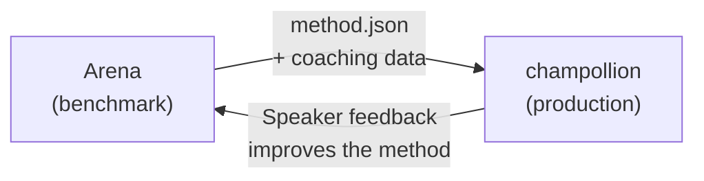

# Déployer en Production

Vous avez prouvé que cela fonctionne dans l'Arena. Maintenant, déployez-le.

L'Arena est destinée à la R&D — construction, benchmarking et comparaison des méthodes de traduction. **Le déploiement en production** s'effectue via [champollion](https://champollion.dev), l'interface de ligne de commande de traduction destinée aux développeurs. Ils se connectent via un format de plugin partagé.



---

## Le Chemin du Déploiement

### 1. Exporter Votre Méthode en tant que Plugin

Créez un manifeste `method.json` qui empaquette vos résultats de benchmarking :

```json
{
  "name": "crk-coached-v3",
  "type": "llm-coached",
  "version": "3.0.0",
  "description": "Coached LLM translation for Plains Cree",
  "locales": ["crk"],
  "config": {
    "model": "google/gemini-2.5-flash",
    "temperature": 0.3
  },
  "benchmarks": {
    "crk": {
      "composite_score": 0.67,
      "fst_acceptance": 0.82,
      "corpus_size": 150
    }
  }
}
```

Incluez toute donnée d'entraînement (règles grammaticales, dictionnaires) aux côtés du manifeste.

### 2. Installer dans Champollion

```bash
champollion plugin install ./my-method-plugin/
```

### 3. Configurer Votre Paire

```json title="champollion.config.json"
{
  "pairs": {
    "en-crk": { "method": "plugin", "plugin": "crk-coached-v3" }
  }
}
```

### 4. Traduire du Contenu Réel

```bash
npx champollion sync
```

Votre méthode benchmarkée produit maintenant des traductions réelles en production.

---

## Pour les Langues Autochtones

Les méthodes servant les communautés de langues autochtones exigent le **consentement de la communauté** avant le déploiement en production. Les principes OCAP (Propriété, Contrôle, Accès, Possession) régissent la façon dont les méthodes de traduction sont développées, évaluées et déployées.

Une méthode qui atteint le niveau Deployable (0,70+) ne se déploie pas automatiquement — elle se déploie **si et seulement si** l'organe de gouvernance de la communauté linguistique donne son consentement.

Consultez [Souveraineté des Données](/docs/sovereignty/data-sovereignty) et [Transfert de Propriété](/docs/sovereignty/ownership-transfer) pour le cadre de gouvernance complet.

---

## Voir Aussi

- [The Eval Harness Bridge](https://champollion.dev/docs/guides/bridge) — présentation détaillée du pipeline Arena→champollion
- [Plugin Specification](https://champollion.dev/docs/reference/plugin-spec) — le format du manifeste method.json
- [champollion Agent Guide](https://champollion.dev/docs/guides/agent-guide) — comment utiliser champollion pour la traduction