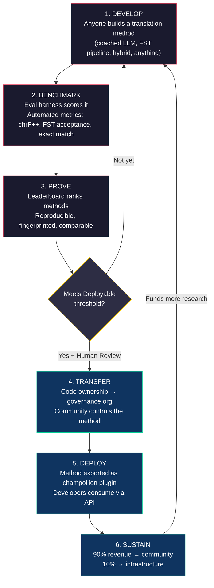
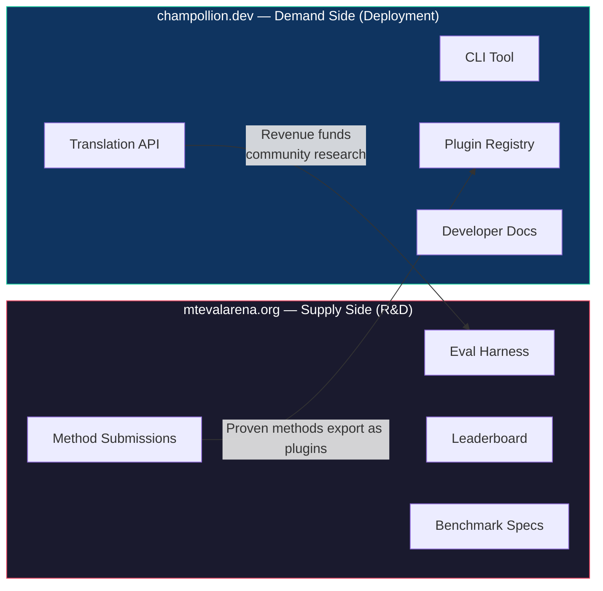
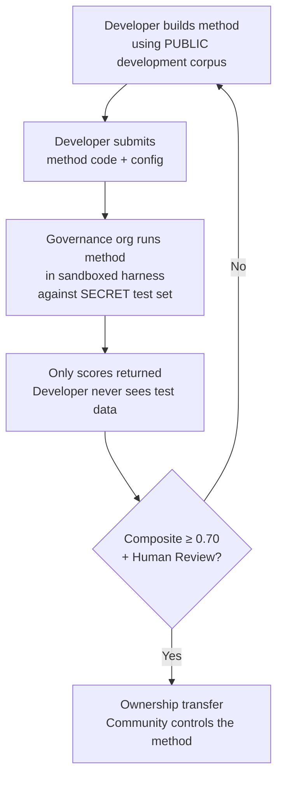

# Comment ça marche : Crowdsourcing compétitif pour la traduction automatique

> **Résumé exécutif.** La traduction automatique pour les langues peu dotées du monde — notamment les ~1 300 que le OMT-1600 de Meta prétend couvrir mais à des niveaux de qualité en dessous de tout seuil utilisable — n'est pas un problème de formation de modèles — c'est un problème d'*infrastructure*. Aucun modèle, laboratoire ou entreprise unique ne le résoudra. Ce document décrit une architecture de plateforme qui transforme la communauté mondiale d'ingénieurs ML, de linguistes et de locuteurs en laboratoire de recherche distribué : quiconque construit une méthode de traduction, la plateforme prouve si elle fonctionne par rapport à des données d'évaluation souveraines, et les méthodes éprouvées se déploient en production avec les revenus allant aux communautés dont elles servent les langues. Le mécanisme est le crowdsourcing compétitif avec souveraineté cryptographique — une combinaison qui n'a jamais été tentée auparavant.

---

> [!IMPORTANT]
> **Portée.** Cette plateforme évalue la **traduction de texte écrit formel** — documents, matériels éducatifs, communications officielles, chaînes d'interface. Ce n'est pas un chatbot, un interprète en temps réel ou un système conversationnel de domaine non restreint. Le classement évalue les méthodes de traduction par rapport à des corpus parallèles curés dans des domaines textuels spécifiques (voir [Spécification du benchmark §2.7](/docs/specifications/benchmark#27-domain) pour la taxonomie des domaines). La TA est une infrastructure pour la revitalisation des langues, non un substitut à celle-ci. Les enfants apprennent la langue auprès de personnes, pas de machines.

### Couverture actuelle des domaines

| Domaine | Couverture des niveaux | Statut | Notes |
|---------|------------------------|--------|-------|
| Officiel / gouvernemental | Niveaux 1–5 | Actif | Corpus EdTeKLA |
| Éducatif / manuel scolaire | Niveaux 1–4 | Actif | Corpus EdTeKLA |
| Narratif / littéraire | Limité | Planifié | Certaines entrées dans l'étalon-or |
| Religieux / scriptural | Référence uniquement | Non évalué | FLORES+ (domaine biblique) ; non utilisé pour la notation officielle |
| Conversationnel | Hors de portée | Par conception | Ce système évalue le texte écrit, pas la parole |
| Technique / scientifique | Hors de portée | Futur | Nécessite une validation terminologique spécifique au domaine |

## 1. Le problème : la traduction automatique ≠ l'apprentissage automatique

La traduction automatique pour les langues peu dotées (LPD) est généralement présentée comme un problème d'apprentissage automatique : collecter des données, entraîner un modèle, déployer. Cette formulation est erronée, et l'erreur a des conséquences — elle oriente le financement, les talents et l'infrastructure vers une approche qui ne peut structurellement pas fonctionner pour la majorité des langues du monde.

### 1.1 Pourquoi la formulation ML échoue

Le pipeline ML standard pour la TA nécessite trois choses : de grands corpus parallèles, des benchmarks d'évaluation validés et un chemin de déploiement. Pour les ~130 langues servies par Google Translate et les ~200 couvertes par NLLB-200, tous trois existent. Pour les ~1 300 langues supplémentaires que OMT-1600 prétend couvrir, les données d'évaluation existent mais la qualité est principalement en dessous des seuils utilisables, les poids du modèle ne sont pas disponibles publiquement, et il n'y a pas de pipeline de déploiement. Pour les ~5 400+ restantes, aucun n'existe du tout.

| Exigence | Langues hautement dotées | Couverture OMT-1600 (~1 300 LPD) | ~5 400 langues restantes |
|----------|--------------------------|----------------------------------|--------------------------|
| **Corpus parallèles** | Millions de paires de phrases (Europarl, Corpus ONU, OpenSubtitles) | Bitext domaine biblique, raclages web, rétrotraduction synthétique. Pas de données curées par la communauté. | Centaines à bas milliers, le cas échéant |
| **Benchmarks d'évaluation** | WMT, FLORES, NTREX — standardisés, reproductibles | BOUQuET (domaine biblique), met-BOUQuET. Pas de validation morphologique. Pas d'évaluation indépendante. | Pas de benchmarks standards ; évaluation ad hoc |
| **Chemin de déploiement** | Google Translate, DeepL, Azure — API commerciales | Poids du modèle non publiés. Pas de CLI, pas de système de plugins, pas d'API déployable par la communauté. | Rien. Pas d'API, pas de produit, pas de marché. |

L'approche ML fonctionne quand les données existent pour l'entraînement et le marché existe pour le déploiement. OMT-1600 a considérablement étendu la première condition — mais l'expansion sans vérification de qualité indépendante, validation morphologique ou gouvernance communautaire est une expansion sans confiance. Le problème n'est pas seulement « nous avons besoin d'un meilleur modèle » — c'est « nous avons besoin d'une infrastructure qui prouve que le modèle fonctionne, selon les termes que la communauté contrôle ».

### 1.2 Ce que la TA pour les LPD exige réellement

La traduction pour les langues peu dotées n'est pas principalement un problème de formation. C'est un problème d'**ingénierie des méthodes** — le défi d'assembler les ressources disponibles (LLM, outils morphologiques, connaissances communautaires, règles linguistiques) en pipelines de traduction fonctionnels, puis de prouver qu'ils fonctionnent avec une évaluation rigoureuse.

La distinction importe :

| Dimension | Approche ML | Approche d'ingénierie des méthodes |
|-----------|------------|-----------------------------------|
| **Activité centrale** | Entraîner un modèle sur des données | Combiner des outils, des invites et des connaissances linguistiques en un pipeline |
| **Goulot d'étranglement** | Volume de données parallèles | Créativité en ingénierie + infrastructure d'évaluation |
| **Qui peut contribuer** | Équipes avec clusters GPU et ensembles de données | Quiconque avec une clé API, un dictionnaire et une idée |
| **Évaluation** | BLEU/chrF sur des ensembles de test retenus | Validation morphologique + examen humain + métriques automatisées |
| **Déploiement** | Servir le modèle | Empaqueter la méthode en tant que plugin |

Les LLM modernes contiennent déjà des connaissances latentes de nombreuses langues peu dotées — suffisamment pour produire une sortie qui *semble* plausible. Le problème est que cette sortie est souvent morphologiquement invalide (le modèle hallucine des formes de mots qui n'existent pas dans la langue). Le défi en ingénierie est : comment extraire ce que le LLM sait, le valider par rapport à la réalité linguistique et empaqueter le résultat pour une utilisation en production ?

C'est pourquoi nous évaluons les **méthodes**, pas les modèles. Une méthode est la recette complète : sélection de modèle + ingénierie d'invite + utilisation d'outils + pré/post-traitement + données d'entraînement + stratégies de nouvelle tentative. Deux équipes utilisant le même modèle avec des méthodes différentes obtiendront des scores différents. C'est le point.

### 1.3 Pourquoi les langues polysynthétiques cassent tout

Beaucoup des langues les plus peu dotées du monde sont **polysynthétiques** — elles codent des phrases entières en mots uniques par des processus morphologiques productifs. Considérez le mot cri des Plaines :

> **ê-kî-nitawi-kîskinwahamâkosiyân**
> *« quand j'étais allé à l'école »*

Un mot. Il code le temps (passé), la direction (aller à), la racine (apprendre), la voix (passif/réfléchi) et la personne (première singulier). L'anglais a besoin de six mots pour ce que le cri exprime en un.

Cela casse la TA standard à tous les niveaux :

- **Tokenisation** — BPE et SentencePiece déchirent les mots polysynthétiques en fragments dénués de sens, car ils ont été conçus pour la morphologie concaténative.
- **Hallucination** — Les LLM produisent des chaînes plausibles qui ne sont pas des mots valides. Un non-locuteur ne peut pas faire la différence. Sans validation morphologique, les hallucinations sont invisibles.
- **Évaluation** — Les métriques au niveau des mots (BLEU) pénalisent la variation flexionnelle naturelle qui est fondamentale à la façon dont ces langues fonctionnent. Les métriques au niveau des caractères (chrF++) sont meilleures mais insuffisantes sans validation structurelle.

La solution n'est pas un modèle plus grand ou plus de données d'entraînement. C'est une **infrastructure qui détecte les hallucinations avant qu'elles n'atteignent les utilisateurs** — des analyseurs morphologiques (FST) qui peuvent définitivement dire « ce n'est pas un mot dans cette langue ».

---

## 2. Pourquoi les approches existantes ne fonctionnent pas

### 2.1 TA commerciale

Les services de traduction commerciaux ont historiquement optimisé le volume de marché. Le OMT-1600 de Meta (mars 2026) représente un changement significatif — 1 600 langues dans un système. Mais pour les ~1 300 à leurs niveaux de ressources les plus bas, la qualité est en dessous des seuils utilisables, les poids du modèle ne sont pas disponibles, et il n'y a pas de pipeline de déploiement. Le problème d'incitation structurelle a évolué : Big Tech peut maintenant construire des modèles pour les LPD, mais sans évaluation indépendante, validation morphologique ou gouvernance communautaire, la couverture seule ne résout pas le problème.

### 2.2 Recherche académique

La recherche académique en TA se concentre de manière écrasante sur les paires de langues hautement dotées parce que c'est là que se trouvent les données d'entraînement, les tâches partagées et les lieux de publication. Les chercheurs qui travaillent sur des paires peu dotées ont du mal à publier, du mal à financer le calcul et du mal à déployer — parce que l'infrastructure de déploiement pour les LPD n'existe pas.

### 2.3 Compétitions ponctuelles

Vous pourriez organiser une compétition Kaggle : « Anglais→Cri des Plaines, meilleur chrF++ gagne 10 000 $ ». Voici ce qui se passe :

1. Quelqu'un gagne, soumet un notebook, encaisse le prix, rentre à la maison.
2. Le notebook pourrit dans les archives de Kaggle. Personne ne le déploie. Personne ne le maintient.
3. L'ensemble de test est finalement publié — contaminé à jamais.
4. L'organisation de gouvernance a téléchargé ses données linguistiques sur l'infrastructure de Google selon les conditions de service de Google, sans vrai contrôle sur le cycle de vie.
5. Pas de pont de déploiement. Un notebook gagnant n'est pas une API fonctionnelle.

Une prime ponctuelle attire les chasseurs de primes. Un classement continu avec gouvernance communautaire crée un engagement soutenu.

### 2.4 Ajustement fin

L'ajustement fin d'un modèle ouvert sur du texte parallèle est l'approche ML évidente. Mais pour la plupart des LPD, le corpus parallèle nécessaire pour l'ajustement fin est exactement les données qui n'existent pas — et les créer nécessite les mêmes locuteurs bilingues et l'engagement communautaire que l'ajustement fin est censé remplacer. Vous ne pouvez pas vous amorcer hors d'un problème de rareté des données avec une technique qui nécessite des données.

---

## 3. La solution : crowdsourcing compétitif avec évaluation souveraine

La plateforme inverse l'approche traditionnelle : au lieu qu'une équipe construise un modèle, **la communauté mondiale rivalise pour construire la meilleure méthode de traduction**, la plateforme prouve si elle fonctionne, et les méthodes éprouvées se déploient en production avec la communauté linguistique conservant la propriété et le contrôle.

### 3.1 La boucle complète

Chaque étape a une fonction spécifique :

| Étape | Ce qui se passe | Qui en bénéficie |
|-------|-----------------|------------------|
| **Développer** | Un chercheur, un étudiant ou un amateur construit une méthode de traduction en utilisant les outils qu'il souhaite — invites LLM, pipelines FST, dictionnaires, modèles ajustés fins, systèmes basés sur des règles ou hybrides | Le contributeur apprend, expérimente, publie |
| **Évaluer** | Le harnais d'évaluation évalue la méthode par rapport à un corpus standardisé avec des métriques reproductibles. Chaque exécution produit une [fiche d'exécution](/docs/specifications/benchmark#3-run-card-schema) — un enregistrement complet de ce qui a été testé et de ses performances | Les chercheurs obtiennent des résultats reproductibles et comparables |
| **Prouver** | Les résultats apparaissent sur le classement public. Les méthodes sont classées, comparées et examinées. La communauté voit ce qui fonctionne et ce qui ne fonctionne pas | Tout le monde gagne une visibilité sur l'état de l'art |
| **Transférer** | Pour les langues autochtones, les méthodes qui atteignent le seuil Déployable (composite ≥ 0,70) ET passent la validation humaine ont leur propriété de code transférée à l'organisation de gouvernance de la communauté linguistique | La communauté gagne un actif générateur de revenus |
| **Déployer** | La méthode est exportée en tant que plugin [champollion](https://github.com/gamedaysuits/champollion) et servie via API. Les développeurs consomment les traductions sans avoir besoin de comprendre la méthode sous-jacente | Les développeurs obtiennent la traduction pour les langues que les API commerciales ne servent pas |
| **Soutenir** | Les revenus de l'API sont divisés : 90 % à la communauté, 10 % à l'infrastructure. Les revenus financent plus de recherche linguistique, développement de corpus et programmes communautaires | La roue libre se soutient elle-même après l'établissement initial |

### 3.2 Pourquoi la dynamique compétitive fonctionne

La compétition n'est pas accessoire — c'est le mécanisme. Voici pourquoi :

**Diversité des approches.** La meilleure méthode pour Anglais→Cri des Plaines pourrait être un LLM entraîné avec FST. La meilleure pour Anglais→Quechua pourrait être un pipeline augmenté par dictionnaire. La meilleure pour Anglais→Inuktitut pourrait être un modèle ajusté fin amorcé à partir du corpus Hansard du Nunavut. Aucune équipe ou approche unique ne dominera toutes les langues. Le classement révèle quels *types* d'approches fonctionnent pour quels *types* de langues — un résultat méta qui est lui-même une contribution de recherche.

**Engagement soutenu.** Un classement n'est jamais terminé. Quelqu'un veut toujours battre le meilleur score. Chaque soumission donne du calcul et de l'effort intellectuel au problème. Contrairement à une subvention ponctuelle, la dynamique compétitive génère un investissement de recherche continu de la communauté mondiale.

**Barrière d'entrée basse.** Vous avez besoin d'une clé API, d'un dictionnaire et d'une idée. Le harnais d'évaluation est open source. Le format de corpus est du JSON simple. Un étudiant en linguistique peut rivaliser avec un laboratoire bien doté — et parfois gagner, parce que la connaissance du domaine (comprendre la langue) peut surpasser les ressources de calcul.

**Pont de déploiement.** La même méthode qui obtient un bon score dans le harnais se déploie en production avec un changement de configuration. « Prouvez-le ici, déployez-le là. » C'est l'écart que Kaggle, les tâches partagées WMT et les publications académiques ne comblent pas.

### 3.3 L'architecture de la plateforme

L'écosystème est physiquement divisé en deux sites servant deux audiences :

**[mtevalarena.org](https://mtevalarena.org)** est le terrain de jeu R&D. Son audience est les ingénieurs ML, les linguistes et les chercheurs. Tout ici concerne la construction, le test et la preuve des méthodes de traduction.

**[champollion.dev](https://champollion.dev)** est la plateforme de déploiement. Son audience est les développeurs qui ont besoin de traduction pour leurs applications. Ils n'ont pas besoin de comprendre comment les méthodes fonctionnent — ils appellent juste l'API.

Le pont entre eux est le **plugin de méthode** : une méthode éprouvée, empaquetée pour le déploiement, possédée par la communauté.

---

## 4. Évaluation souveraine : pourquoi l'infrastructure importe

L'infrastructure d'évaluation n'est pas un détail technique — c'est le cœur du modèle de souveraineté. L'évaluation standard (télécharger votre ensemble de test sur une plateforme partagée) ne fonctionne pas pour les langues autochtones parce qu'elle abandonne le contrôle sur les données linguistiques.

### 4.1 Le mécanisme de souveraineté

Le développeur ne voit jamais les données d'évaluation de l'étalon-or. Il développe par rapport à un corpus de développement public, puis soumet son code de méthode à l'organisation de gouvernance, qui l'exécute dans un bac à sable par rapport à l'ensemble de test secret. Seuls les scores reviennent. Ce n'est pas seulement de la sécurité — c'est une implémentation directe des **principes OCAP®** (Propriété, Contrôle, Accès, Possession) que la gouvernance des données autochtones exige.

### 4.2 Pourquoi cela ne peut pas s'exécuter sur la plateforme de quelqu'un d'autre

Sur Kaggle, l'organisation de gouvernance télécharge ses données linguistiques sur l'infrastructure de Google selon les conditions de service de Google. Elle ne peut pas révoquer l'accès selon son propre calendrier. Elle ne peut pas joindre des conditions juridiques personnalisées (comme le transfert de propriété) aux soumissions. Elle n'a pas de garantie cryptographique que les données ne seront pas utilisées à d'autres fins. La souveraineté des données signifie que la communauté contrôle le point de terminaison d'évaluation, détient les clés et peut l'arrêter.

---

## 5. Philosophie d'évaluation : Microeval et LYSS

Les métriques TA standard (BLEU, chrF++, COMET) sont conçues pour se généraliser entre les langues. Cette généralité est leur force — et leur point aveugle. Pour les langues polysynthétiques, un mot morphologiquement invalide qui partage des n-grammes de caractères avec la référence obtient un bon score sur chrF++ mais serait reconnu comme du charabia par tout locuteur.

Le **développement de microeval** signifie construire des métriques d'évaluation adaptées à des langues spécifiques en utilisant les meilleurs outils linguistiques disponibles. Le cadre s'appelle **LYSS** (Linguistically-informed Yield & Structural Scoring) :

| Composant | Ce qu'il mesure | Outil | Statut |
|-----------|-----------------|------|--------|
| **LYSS-fst** | Validité morphologique | Transducteur à états finis | ✅ Implémenté (Cri des Plaines) |
| **LYSS-eq** | Équivalence linguistique | Règles de variantes curées par linguiste | ✅ Implémenté (Cri des Plaines) |
| **LYSS-sem** | Préservation sémantique | Modèles sémantiques spécifiques à la langue | ✅ Implémenté (Cri des Plaines) |

Les métriques universelles (chrF++, BLEU) servent de lignes de base et de signaux primaires pour les langues sans outils LYSS. Partout où des outils spécifiques à la langue existent, les composants LYSS portent le poids de la notation — parce que les choses qui importent le plus pour chaque langue sont les choses que seuls les outils spécifiques à la langue peuvent mesurer.

Pour la spécification LYSS complète et la logique de notation composite, voir [SCORING_SPEC.md §4](/docs/specifications/scoring#4-composite-score).

> [!WARNING]
> **Comparabilité entre exécutions.** Lors de la comparaison d'exécutions avec une disponibilité de métriques différente (par exemple, une exécution a des scores FST, une autre non), les scores composites ne sont pas directement comparables. Le composite se normalise aux métriques disponibles, mais une exécution évaluée sur 5 métriques porte plus d'informations qu'une évaluée sur 2. Le classement indique la couverture des métriques pour chaque entrée.

---

## 6. Qui cela sert

### Pour les ingénieurs ML et les chercheurs

Un classement ouvert avec des benchmarks standardisés pour les paires de langues qu'aucune tâche partagée ne couvre. Reproduisez n'importe quel résultat avec le harnais d'évaluation. Publiez votre méthode. Battez le meilleur score. Chaque soumission est empreinte d'une configuration spécifique et d'une version d'ensemble de données — pas d'ambiguïté sur ce qui a été testé.

### Pour les communautés linguistiques

Propriété et contrôle sur la technologie de traduction construite pour votre langue. La dynamique compétitive signifie que plusieurs équipes travaillent simultanément sur votre langue — vous bénéficiez de toutes et possédez le résultat. Les revenus de l'utilisation de l'API financent les programmes communautaires selon vos conditions.

### Pour les bailleurs de fonds et les examinateurs de subventions

Des métriques transparentes et reproductibles pour évaluer les propositions de recherche en traduction. Des résultats mesurables au-delà des publications : utilisation de l'API, revenus générés, métriques de qualité au fil du temps, couverture linguistique. Une seule méthode réussie crée un flux de revenus autosuffisant — l'impact de la subvention se compose plutôt que de se terminer quand le financement s'arrête.

### Pour les développeurs

Traduction pour les langues qu'aucune API commerciale ne sert. Une commande CLI (`npx champollion sync`) traduit vos fichiers de locale en utilisant des méthodes éprouvées par la communauté. Utilisez Google Translate pour le français, un LLM entraîné pour le cri des Plaines et une API communautaire pour le quechua — tout dans le même projet, tout avec la même interface.

### Pour les étudiants

Un défi ouvert avec un impact réel. Construisez une méthode de traduction pour une langue peu dotée, évaluez-la et publiez vos résultats. L'infrastructure est gratuite, les ensembles de données sont ouverts et le classement ne se soucie pas de savoir si vous êtes dans une université top-10 ou travaillez depuis un terminal de bibliothèque.

---

## 7. Contexte social et technique

### 6.1 La revitalisation des langues s'accélère

Les efforts de revitalisation des langues se développent dans le monde entier. Les écoles d'immersion, les nids de langues communautaires et les projets d'archivage numérique s'étendent dans les communautés autochtones du Canada, des États-Unis, de l'Australie, de la Nouvelle-Zélande et du nord de l'Europe. Ces efforts ont besoin de technologie — spécifiquement, une technologie de traduction qui respecte la souveraineté communautaire sur les données linguistiques.

### 6.2 Les LLM ont changé la ligne de base

Avant 2023, construire une capacité TA pour une langue polysynthétique nécessitait une expertise NLP significative, un entraînement de modèle personnalisé et de grands budgets de calcul. Les LLM modernes ont changé la ligne de base : une invite bien formulée avec des données d'entraînement et une validation morphologique peut produire des traductions utilisables pour certaines paires de langues — aucun entraînement requis. Cela réduit considérablement la barrière d'entrée pour le développement de méthodes. Le problème s'est déplacé de « comment construisons-nous un modèle ? » à « comment construisons-nous un pipeline qui valide et corrige ce que le modèle produit ? »

### 6.3 La culture du benchmarking open source

Le benchmarking en IA est devenu sa propre culture. Les classements stimulent l'innovation. Les compétitions attirent les talents. Chatbot Arena, LMSYS, Hugging Face Open LLM Leaderboard — ces plateformes démontrent que l'évaluation compétitive stimule les progrès rapides. Nous prenons cette énergie et la dirigeons vers la traduction pour les milliers de langues où la TA commerciale n'existe pas ou n'a pas été indépendamment prouvée fonctionner.

### 6.4 La souveraineté des données autochtones est non négociable

Les principes OCAP® (Propriété, Contrôle, Accès, Possession), les principes CARE (Bénéfice collectif, Autorité de contrôle, Responsabilité, Éthique) et des cadres comme Te Mana Raraunga (Souveraineté des données maori) ne sont pas des ajouts optionnels — ce sont des exigences structurelles pour toute technologie qui touche aux ressources linguistiques autochtones. Notre infrastructure d'évaluation implémente ces principes architecturalement, pas seulement comme des déclarations de politique.

---

## 8. Tensions et limitations

Ce projet utilise un mécanisme occidental — l'évaluation comparative — pour servir des systèmes de connaissances qui sont souvent communautaires, relationnels et guidés par les aînés. Cette tension est réelle et doit être nommée, non résolue par affirmation.

**Évaluation comparative vs. connaissances communautaires.** Les classements classent les individus et optimisent les scores numériques. Les traditions de connaissances autochtones mettent l'accent sur l'autorité relationnelle, la correction communautaire et la légitimité basée sur les relations. Nous ne pouvons pas prétendre servir ces systèmes de connaissances tout en construisant une plateforme dont le mécanisme central est l'optimisation compétitive individuelle. L'architecture de souveraineté (§4) — où les communautés possèdent les méthodes, contrôlent l'évaluation et décident ce qui se déploie — est notre réponse structurelle, mais elle ne dissout pas la tension. Un classement est toujours un classement.

**Ce que nous faisons à ce sujet.** La plateforme soutient les soumissions d'équipes et de communautés aux côtés des soumissions individuelles. Le classement encadre les résultats comme « l'état actuel de l'art » plutôt que « qui gagne ». L'organisation de gouvernance — pas le score du classement — détermine ce qui se déploie. Aucun score automatisé ne donne droit à un développeur à quoi que ce soit ; la communauté décide. Et nous maintenons une boucle de rétroaction consultatif continu avec les communautés partenaires sur la question de savoir si l'encadrement et la structure d'incitation de la plateforme les servent. Si ce n'est pas le cas, nous le changeons.

**La TA n'est pas la revitalisation.** La traduction convertit le texte entre les langues. La revitalisation crée de nouveaux locuteurs. Un système TA parfait ne résout pas le problème de transmission, le problème de prestige ou le problème pédagogique. Cela pourrait même créer l'illusion que « l'ordinateur peut parler la langue », sapant l'urgence de la transmission humaine. Nous construisons la TA comme infrastructure — traduction brouillon pour post-édition, outils morphologiques pour les applications d'apprentissage des langues, levier politique pour les communautés exigeant des services dans leur langue — non comme un substitut à la transmission intergénérationnelle. La communauté contrôle si, quand et comment la technologie est déployée.

Cette section existe parce que ces tensions ont été identifiées dans une critique invitée (mai 2026) et nous nous sommes engagés à les nommer publiquement plutôt que de les enterrer dans des documents internes.

> [!NOTE]
> **Les scores du classement sont des proxies automatisés.** Tous les scores affichés sur le classement sont des mesures automatisées calculées par le harnais d'évaluation dans des conditions contrôlées. Ils indiquent la performance relative des méthodes mais ne constituent pas des garanties de qualité. Les méthodes validées par la communauté sont marquées séparément. Aucun score automatisé ne donne droit à un développeur au déploiement — l'organisation de gouvernance prend cette décision.

---

## 9. État actuel

### Ce qui existe aujourd'hui

- **champollion** — Outil CLI prêt pour la production. 10 méthodes de traduction, configuration par paire, portes de qualité, 5 formats de fichiers. [Publié sur npm](https://www.npmjs.com/package/champollion).
- **Harnais d'évaluation TA** — Cadre d'évaluation fonctionnel. Métriques chrF++, acceptation FST et correspondance exacte implémentées. Schéma de fiche d'exécution finalisé. Empreinte digitale et vérification d'intégrité fonctionnelles.
- **EDTeKLA Dev v1** — Corpus d'évaluation cri des Plaines (CC BY-NC-SA 4.0), provenant du groupe de recherche EdTeKLA de l'Université de l'Alberta. Le corpus de manuel a 486 entrées (436 dev + 50 retenus), plus 62 paires d'étalon-or séparées d'itwêwina (548 au total). Le corpus dev canonique est `textbook_dev.json` avec 436 entrées — la division dev de manuel complète.
- **FLORES+ Devtest** — 1 012 phrases × 39 langues (CC BY-SA 4.0).
- **Site Arena** — Site de documentation basé sur Docusaurus avec classement, spécifications, tutoriels et cadre de souveraineté.
- **Spécification du benchmark** — [Spec canonique](/docs/specifications/benchmark) définissant le schéma de corpus, le format de fiche d'exécution et le protocole d'évaluation. Pour les définitions de métriques, les poids composites et les niveaux de qualité, voir [SCORING_SPEC.md](/docs/specifications/scoring).

### Prochaines étapes

| Phase | Quoi | Statut |
|-------|------|--------|
| Balayage de base | 12 modèles × 3 températures × 2 configs d'entraînement sur EDTeKLA | 🔲 Planifié |
| Score composite | Implémentation de métrique pondérée dans le harnais | ✅ Fait |
| Score sémantique | Score pondéré par verdict de CrkSemanticMetric (standard d'évaluation) | ✅ Fait |
| Précision morphologique | Notation par morphème par rapport à l'analyse de l'étalon-or | 🔲 Planifié |
| Correspondance équivalente | Correspondance de classe de variante via CrkLinterMetric (standard d'évaluation) | ✅ Fait |
| API Champollion | API mesurée pour les méthodes possédées par la communauté | 🔲 Planifié |
| Deuxième langue | Expansion à une deuxième paire de langues (Inuktitut, Quechua ou Sámi) | 🔲 Planifié |

---

## 10. Commencer

**Construisez une méthode :** Clonez le [harnais d'évaluation](https://github.com/gamedaysuits/arena), exécutez une expérience de base et voyez où vous vous situez sur le classement.

**Contribuez un corpus :** Si vous parlez une langue peu dotée, même 50 paires de traduction curées suffisent pour ouvrir une nouvelle piste de classement. Voir [Pour les communautés linguistiques](https://mtevalarena.org/docs/community/for-language-communities).

**Déployez des traductions :** Installez [champollion](https://github.com/gamedaysuits/champollion) et traduisez votre application avec `npx champollion sync`.

**Financez l'effort :** Voir [Le modèle économique](https://mtevalarena.org/docs/sovereignty/economic-model) pour les cadres de coûts et les projections de durabilité.

---

## Voir aussi

- **[Spécification du benchmark](/docs/specifications/benchmark)** — format de corpus, schéma de fiche d'exécution, protocole d'évaluation, souveraineté
- **[Spécification de notation](/docs/specifications/scoring)** — métriques, poids composites, niveaux de qualité, formules de coût/vitesse
- **[MT Eval Arena](https://mtevalarena.org)** — le terrain de jeu R&D
- **[champollion](https://github.com/gamedaysuits/champollion)** — la plateforme de déploiement
- **[Soutenir une langue peu dotée](https://mtevalarena.org/docs/community/low-resource-languages)** — plongée profonde dans les défis et approches de la TA polysynthétique

---

*Ce document est le point d'entrée pour quiconque rencontre le projet pour la première fois. Pour la spécification technique complète, voir [BENCHMARK_SPEC.md](/docs/specifications/benchmark) (protocole) et [SCORING_SPEC.md](/docs/specifications/scoring) (métriques).*