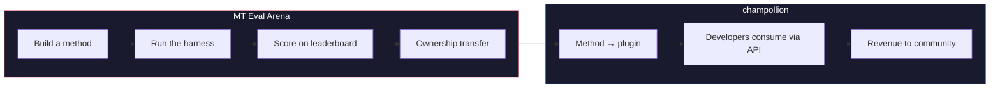

# The MT Eval Arena

> **Résumé exécutif.** The MT Eval Arena est une plateforme d'évaluation comparative ouverte pour les méthodes de traduction automatique, en mettant l'accent sur les langues où la traduction automatique commerciale n'existe pas ou n'a pas été vérifiée de manière indépendante. Elle fournit une évaluation standardisée, un classement public et un pont de déploiement vers la production via champollion. Pour les langues autochtones, les méthodes éprouvées transfèrent la propriété à la communauté.

Un terrain d'essai ouvert pour les méthodes de traduction automatique — en particulier pour les langues où la traduction automatique commerciale n'existe pas ou n'a pas été vérifiée de manière indépendante.

Construisez une méthode. Évaluez-la. Prouvez qu'elle fonctionne. Si elle gagne, elle est déployée.

---

## Le problème

Google Translate prend en charge ~130 langues. NLLB-200 de Meta en couvre ~200, et OMT-1600 (mars 2026) en revendique 1 600. Il y en a plus de 7 000 parlées sur Terre. Pour les ~1 300 langues aux niveaux de ressources les plus faibles d'OMT-1600, les poids du modèle ne sont pas disponibles, la qualité est en dessous des seuils utilisables, et l'évaluation a utilisé du texte du domaine biblique avec des métriques automatiques standard — pas de validation morphologique, pas de test indépendant, pas de gouvernance communautaire. Pour les ~5 400 langues restantes, aucun modèle préentraîné ne produit aucune sortie.

Big Tech investit maintenant dans la couverture des langues à ressources limitées — mais une couverture sans vérification indépendante de la qualité, sans validation morphologique ou sans gouvernance communautaire est une couverture sans confiance. Les locuteurs qui ont le plus besoin d'outils de traduction sont les mêmes communautés les moins susceptibles de les avoir.

**The Arena existe pour changer cela.** Elle fournit l'infrastructure pour développer, évaluer et déployer des méthodes de traduction pour n'importe quelle langue — avec un scoring reproductible, une soumission ouverte et une gouvernance communautaire sur qui contrôle les résultats.

---

## Comment cela fonctionne

1. **Vous construisez une méthode de traduction** — LLM entraîné, modèle affiné, pipeline avec FST, ou n'importe quoi d'autre qui produit des traductions.
2. **Le harness l'évalue** — métriques standardisées (chrF++, correspondance exacte, acceptation FST), empreinte digitale d'un commit Git spécifique.
3. **Les résultats apparaissent sur le classement** — chaque soumission est reproductible et comparable.
4. **Si elle gagne, la propriété est transférée** — pour les langues autochtones, le code de la méthode gagnante est transféré à l'organisation de gouvernance communautaire.
5. **La méthode se déploie en production** — via [champollion](https://champollion.dev), l'API destinée aux développeurs. Les revenus reviennent à la communauté.

**Prouvez-le ici. Déployez-le là.**

---

## Pour qui c'est

| Vous êtes... | The Arena vous donne... |
|---|---|
| **Ingénieur ML / chercheur** | Des benchmarks standardisés, un scoring reproductible, un classement sur lequel concourir |
| **Linguiste** | Un cadre pour transformer les règles de grammaire et les dictionnaires en méthodes testables |
| **Membre de la communauté linguistique** | Une gouvernance sur la façon dont les méthodes de votre langue sont développées et déployées |
| **Bailleur de fonds / examinateur de subvention** | Des métriques transparentes et reproductibles pour évaluer les propositions de recherche en traduction |
| **Étudiant** | Un défi ouvert avec un véritable impact — construisez une méthode, soumettez vos scores |

---

## Benchmarks actuels

### EDTeKLA Development Set v1
- **Paire linguistique :** English → Plains Cree (SRO)
- **Entrées :** 548 paires curées (486 manuels + 62 standard d'or)
- **Licence :** CC BY-NC-SA 4.0
- **Source :** [Groupe de recherche EdTeKLA](https://spaces.facsci.ualberta.ca/edtekla/), Université de l'Alberta

### FLORES+ Devtest
- **Paires linguistiques :** English → 39 langues
- **Entrées :** 1 012 phrases par langue
- **Licence :** CC BY-SA 4.0
- **Source :** [OLDI](https://huggingface.co/datasets/openlanguagedata/flores_plus)

---

## La seule règle

:::danger Ne pas entraîner sur les données d'évaluation
Les méthodes exposées à l'ensemble de données de référence — en tant que données d'entraînement, exemples few-shot, entrées de dictionnaire ou matériel d'invite — seront **disqualifiées**. Affinez sur ce que vous voulez. Simplement pas sur l'ensemble de test.
:::

---

## Prochaines étapes

- **[Soumettre une méthode](/docs/getting-started/submit-a-method)** — comment soumettre votre première exécution d'évaluation comparative
- **[Spécification du benchmark](/docs/specifications/benchmark)** — le protocole d'expérience complet
- **[Règles du classement](/docs/leaderboard/rules)** — critères de soumission et politiques anti-triche
- **[Souveraineté des données](/docs/sovereignty/data-sovereignty)** — OCAP, CARE, et pourquoi le transfert de propriété est important
- **[Le modèle économique](/docs/sovereignty/economic-model)** — comment les scores de The Arena deviennent des revenus communautaires

**[→ Voir le classement](https://champollion.dev/leaderboard)**