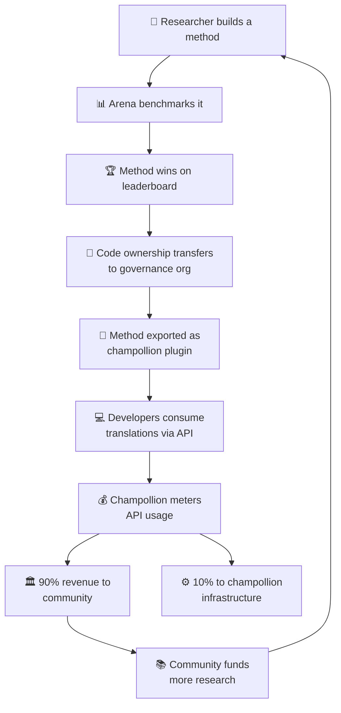

# Le Modèle Économique

> **Résumé Exécutif.** Cette page décrit la boucle économique reliant l'Arena et champollion : la recherche produit des méthodes, les méthodes se déploient en tant que plugins, l'utilisation de l'API génère des revenus, et 90 % des revenus reviennent à la communauté linguistique. Couvre le mécanisme de boucle de rétroaction, les répartitions de revenus, la couche de commodité, et le cas de durabilité pour les bailleurs de fonds.

L'Arena et champollion forment une boucle économique fermée. La recherche sur l'Arena produit des méthodes. Les méthodes se déploient via champollion. Les revenus de champollion reviennent aux communautés dont les langues servent les méthodes.

---

## La Boucle de Rétroaction

Chaque tour de la boucle renforce l'écosystème :
- **Plus de recherche** produit de meilleures méthodes
- **De meilleures méthodes** attirent plus de développeurs
- **Plus de développeurs** génèrent plus de revenus d'API
- **Plus de revenus** financent plus de recherche menée par la communauté

---

## Comment les Revenus Circulent

Lorsqu'un développeur utilise une méthode appartenant à la communauté via l'API champollion :

| Étape | Ce qui se passe |
|---|---|
| Le développeur appelle `champollion sync` ou l'API REST | Les traductions sont produites par la méthode appartenant à la communauté |
| Champollion mesure l'appel API | L'utilisation est suivie par requête, par paire de langues |
| Les revenus sont répartis | **90 %** vont à l'organisation de gouvernance qui possède la méthode. **10 %** couvrent les coûts d'infrastructure de champollion. |
| La communauté décide de l'allocation | Les revenus financent des programmes linguistiques, de la recherche supplémentaire, des ressources communautaires — tout ce que l'organisation de gouvernance décide |

### La Couche de Commodité

Champollion propose également des configurations optimisées pour les méthodes courantes. Si un chercheur prouve que Gemini 2.5 Pro avec des données de coaching spécifiques et des paramètres de température particuliers produit les meilleurs résultats pour une paire de langues, cette configuration est disponible en tant que préréglage pré-construit via l'API champollion. Les développeurs n'ont pas besoin de reproduire la recherche — ils appellent simplement l'API.

L'Arena établit les références. Champollion les rend accessibles. Les communautés bénéficient des deux.

---

## Pour les Langues Standard

La boucle de rétroaction a le plus d'impact pour les langues autochtones et peu dotées en ressources, où le transfert de propriété et le modèle de revenus communautaires s'appliquent.

Pour les langues standard (français, japonais, espagnol, etc.), champollion offre la même commodité d'API sans la couche de gouvernance — les développeurs paient pour l'accès mesuré à des méthodes de traduction préconfigurées, et champollion prélève une part pour les coûts d'infrastructure.

---

## Pour les Bailleurs de Fonds

Le modèle économique aborde une préoccupation courante dans le financement de la technologie linguistique : **la durabilité après la fin de la subvention.**

| Modèle Traditionnel | Modèle Arena |
|---|---|
| La subvention finance la recherche | La subvention finance la recherche |
| Article publié | Méthode déployée en production |
| La subvention se termine, l'outil est abandonné | Les revenus d'API soutiennent les opérations |
| La communauté ne reçoit rien | La communauté possède l'actif et génère des revenus |

Une seule méthode réussie crée un flux de revenus autosuffisant. Les bailleurs de fonds peuvent mesurer l'impact non seulement en publications, mais aussi en :
- Utilisation de l'API (combien de développeurs utilisent la méthode)
- Revenus générés (combien d'argent revient à la communauté)
- Métriques de qualité (scores du classement au fil du temps)
- Couverture linguistique (combien de paires de langues sont servies)

Voir la [Spécification du Benchmark](/docs/specifications/benchmark), §10 pour les modèles de coûts détaillés.

---

## Voir Aussi

- [Transfert de Propriété](/docs/sovereignty/ownership-transfer) — le processus de transfert juridique et technique
- [Souveraineté des Données](/docs/sovereignty/data-sovereignty) — principes OCAP, CARE et Te Mana Raraunga
- [Règles du Classement](/docs/leaderboard/rules) — comment les méthodes se qualifient pour le déploiement