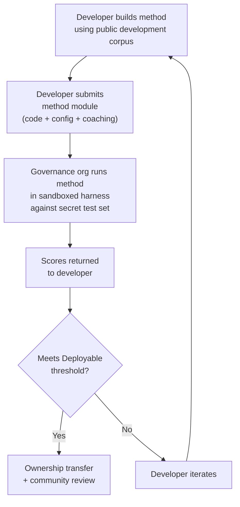

# Spécification du Benchmark

> **Résumé exécutif.** Ce document définit le protocole d'évaluation pour l'écosystème d'évaluation de traduction automatique Champollion : format du corpus (§2), schéma de carte d'exécution (§3), protocole de benchmark (§6), exigences de validation humaine (§7), mécanismes de souveraineté (§8), modèle de classement et de soumission (§9), cadre de coûts (§10), et extensibilité à de nouvelles langues (§11). Pour les définitions de métriques, les poids de notation composite, les seuils de niveaux de qualité et les formules de métriques de coûts/vitesse, voir `SCORING_SPEC.md` — la source unique de vérité pour toute la logique de notation. Ce document référence SCORING_SPEC pour ces détails plutôt que de les dupliquer.
>
> Dernière mise à jour : 2026-06-07

---

## 1. Principes

### 1.1 Les métriques automatisées sont des approximations

Chaque métrique définie dans ce document est calculée par machine. chrF++, acceptation FST, précision morphologique, similarité sémantique — toutes sont des approximations automatisées de la qualité de traduction. Elles sont utiles pour l'itération rapide, la comparaison systématique et la détection des régressions. Elles ne sont **pas des substituts au jugement humain**.

La hiérarchie d'évaluation :

```
Automated metrics (run cards, benchmarks)
    ↓ proxy for
Human review (bilingual speakers validate output)
    ↓ proxy for
Actual utility (does this help a language community?)
```

Aucun score automatisé, aussi élevé soit-il, ne peut remplacer un locuteur courant lisant le résultat et confirmant qu'il est correct, naturel et culturellement approprié. Les niveaux de qualité définis à la §5 sont des étiquettes heuristiques sur les scores composites automatisés — utiles pour suivre les progrès, mais jamais suffisants en eux-mêmes.

### 1.2 Méthodes, pas modèles

Nous évaluons les **méthodes**, pas les modèles. Un modèle est un composant. Une méthode est la recette complète : sélection du modèle, conception des invites, utilisation d'outils, pré/post-traitement, données d'entraînement, stratégies de nouvelle tentative, tout. Deux équipes utilisant le même modèle avec des méthodes différentes obtiendront des scores différents. C'est le but.

### 1.3 Reproductibilité

Chaque résultat de benchmark doit être reproductible. La carte d'exécution (§3) capture la configuration complète d'une expérience. L'empreinte (§3.5) identifie la configuration expérimentale. Le hachage de la carte d'exécution (§3.6) vérifie l'intégrité du résultat. Quiconque ayant la même méthode, corpus et configuration devrait obtenir des scores dans ±2 % (en tenant compte de la non-déterminisme d'échantillonnage LLM à température > 0).

### 1.4 Pas de données d'évaluation synthétiques

**Ce projet ne génère pas, n'utilise pas et n'approuve pas les données d'évaluation synthétiques.** Tous les corpus doivent provenir de textes authentiques rédigés par des humains — traductions publiées, manuels scolaires, documents bilingues ou traductions élicitées auprès de locuteurs courants.

Les LLM peuvent aider à :
- L'alignement de phrases (trouver des passages parallèles dans les textes bilingues existants)
- La conversion de format (convertir les matériaux publiés dans le schéma du corpus)
- L'enrichissement des métadonnées (suggérer des niveaux de difficulté, des étiquettes de registre)
- La proposition de phrases sources pour traduction humaine (§11.3 — l'étape de traduction est toujours humaine)

Les LLM ne doivent **jamais** générer des traductions de référence ou des paires d'évaluation.

**Nous sommes neutres sur le développement concernant les données d'entraînement.** Si un développeur de méthode utilise des données d'entraînement synthétiques, la rétrotraduction ou l'augmentation de données dans sa méthode, c'est son choix — nous évaluons le résultat, pas le processus d'entraînement. OMT-1600 de Meta utilise environ 270 millions de phrases parallèles synthétiques générées via rétrotraduction. Nous n'avons aucune objection aux méthodes entraînées de cette façon. Nous testons uniquement sur la curation humaine.

> **Pourquoi pas le texte biblique pour l'évaluation ?** OMT-1600 évalue 1 560 des 1 600 langues sur du texte du domaine biblique. Les traductions bibliques ont un registre archaïque, un vocabulaire liturgique et une structure de phrase formulaïque. Nos corpus d'évaluation proviennent de textes curatés par la communauté, diversifiés par domaine — santé, juridique, éducatif, gouvernemental, conversationnel et domaines techniques (voir §2.7). C'est un choix de conception délibéré. Les communautés ont besoin de traduction pour les domaines où elles vivent et travaillent réellement, pas un seul registre religieux. Une méthode qui obtient un bon score sur Genèse 1:1 vous dit presque rien sur sa performance sur un ordre du jour du conseil de bande ou un formulaire d'admission à une clinique.

---

## 2. Schéma du corpus

Un corpus est un ensemble curé de paires de textes parallèles avec des métadonnées structurées. C'est la vérité de base par rapport à laquelle toutes les méthodes sont mesurées.

### 2.1 Enveloppe du jeu de données

La structure de haut niveau d'un fichier corpus :

```json
{
  "dataset": {
    "id": "edtekla-dev-v1",
    "version": "1.0",
    "language_pair": "EN→CRK",
    "source_language": "en",
    "target_language": "crk",
    "created": "2026-05-01",
    "license": "CC-BY-NC-SA-4.0",
    "provenance": ["gold_standard", "textbook"]
  },
  "entries": [ ... ]
}
```

| Champ | Type | Requis | Description |
|-------|------|--------|-------------|
| `id` | chaîne | ✅ | Identifiant unique du jeu de données, utilisé dans les cartes d'exécution et le classement |
| `version` | chaîne | ✅ | Version sémantique. L'incrémentation invalide les comparaisons de cartes d'exécution antérieures |
| `language_pair` | chaîne | ✅ | Étiquette d'affichage (par ex., `EN→CRK`) |
| `source_language` | chaîne | ✅ | Code de langue source BCP 47 |
| `target_language` | chaîne | ✅ | Code de langue cible BCP 47 |
| `created` | chaîne | ✅ | Date de création ISO 8601 |
| `license` | chaîne | ✅ | Identifiant de licence SPDX |
| `provenance` | chaîne[] | ✅ | Liste des étiquettes de provenance utilisées dans les entrées |

### 2.2 Schéma d'entrée

Chaque entrée du corpus représente un défi de traduction :

```json
{
  "id": 42,
  "source": "I see the dog",
  "reference": "niwâpamâw atim",
  "segment": "gold_standard",
  "difficulty": 2,
  "provenance": "gold_standard",
  "register": "conversational",
  "context": "declaration",
  "morphological_analysis": "ni-wâpam-âw atim | 1sg-see.TA-3sg.DIR dog.AN",
  "notes": "Animate noun (atim); direct form because speaker is proximate",
  "variant_class": "simple-ta-direct"
}
```

| Champ | Type | Requis | Description |
|-------|------|--------|-------------|
| `id` | entier | ✅ | Identifiant unique dans le corpus |
| `source` | chaîne | ✅ | Texte source dans la langue source |
| `reference` | chaîne | ✅ | Traduction de référence de qualité or dans la langue cible |
| `segment` | chaîne | 📎 | Partition du corpus : `gold_standard`, `held_out`, `development`, ou `diagnostic` |
| `difficulty` | entier | 📎 | Évaluation de difficulté 1–5 (voir §2.4) |
| `provenance` | chaîne | 📎 | Origine de cette entrée (voir §2.5) |
| `register` | chaîne | 📎 | Niveau de registre/formalité (voir §2.6) |
| `context` | chaîne | 📎 | Fonction communicative (voir §2.6) |
| `domain` | chaîne | 📎 | Domaine de cas d'usage de la taxonomie à 16 codes (voir §2.7). Doit être l'un de : `conv`, `ecommerce`, `edu`, `financial`, `gov`, `legal`, `literary`, `marketing`, `medical`, `news`, `religious`, `scientific`, `subtitles`, `support`, `tech`, `ui`. Validé au moment de la construction. |

> **📎 = RECOMMANDÉ.** Le harnais gère les champs optionnels manquants avec élégance via les valeurs par défaut. Les corpus tiers n'ont besoin de fournir que `id`, `source` et `reference` par entrée.
| `morphological_analysis` | chaîne | ❌ | Décomposition morphologique de référence or |
| `notes` | chaîne | ❌ | Notes du traducteur, variantes dialectales, drapeaux d'ambiguïté |
| `variant_class` | chaîne | ❌ | Étiquette de classe regroupant les variantes de traduction acceptables |


### 2.3 Segments du corpus

Le corpus est divisé en segments avec différents niveaux d'accès :

| Segment | Objectif | Accès | Taille minimale |
|---------|----------|-------|-----------------|
| `development` | Développement et itération de méthodes. Les développeurs les utilisent librement. | **Public** | 30 entrées |
| `diagnostic` | Tests ciblés pour des phénomènes linguistiques spécifiques. | **Public** | 10 entrées |
| `gold_standard` | Évaluation officielle du benchmark. Les scores du classement proviennent d'ici. | **Secret** — détenu par l'organisation de gouvernance | 50 entrées |
| `held_out` | Réservé pour l'évaluation future. Jamais utilisé jusqu'à l'activation. | **Secret** — détenu par l'organisation de gouvernance | 10 entrées |

> **État actuel :** Seul le segment `development` existe dans les jeux de données expédiés. Les segments `diagnostic`, `gold_standard` et `held_out` sont définis pour une utilisation future à mesure que les corpus se développent.

Les segments `gold_standard` et `held_out` sont entièrement secrets. Les phrases sources et les traductions de référence sont détenues sur l'infrastructure contrôlée par la gouvernance. Les développeurs de méthodes ne voient jamais les questions ni les réponses. Voir §8 pour le mécanisme de souveraineté.

### 2.4 Niveaux de difficulté

| Niveau | Description | Exemples |
|--------|-------------|----------|
| 1 — Vocabulaire de base | Mots simples, salutations courantes, nombres | « hello » → « tânisi », « dog » → « atim » |
| 2 — Phrases simples | Sujet-verbe ou SVO, temps présent | « I see the dog » → « niwâpamâw atim » |
| 3 — Complexité modérée | Temps passé/futur, possessifs, animacité | « I saw his dog yesterday » |
| 4 — Morphologie complexe | Obviation, voix passive, ordre conjoint, propositions relatives | « the woman whose son went to the store » |
| 5 — Avancé | Multi-clause, registre formel, cérémoniel, idiomatique | Paragraphe complet avec registre approprié au contexte |

Un corpus bien construit devrait inclure des entrées dans les cinq niveaux de difficulté, avec un poids vers les niveaux 2–4 où se situent la plupart des défis de traduction du monde réel.

### 2.5 Étiquettes de provenance

Chaque entrée doit indiquer son origine :

| Étiquette | Signification |
|-----------|---------------|
| `gold_standard` | Vérifié par des locuteurs courants |
| `textbook` | Provenant de matériels éducatifs publiés |
| `elicited` | Produit par des sessions d'élicitation structurées |
| `corpus` | Extrait d'un corpus parallèle |

> **Remarque :** En pratique, les valeurs de provenance sont des chaînes de forme libre. Les étiquettes ci-dessus sont des conventions, pas une énumération validée — les jeux de données peuvent utiliser d'autres chaînes de provenance descriptives.

### 2.6 Registre et contexte

**Registre** décrit la formalité et le contexte social :

| Registre | Description |
|----------|-------------|
| `conversational` | Langage quotidien entre égaux |
| `formal` | Langage officiel ou institutionnel |
| `technical` | Vocabulaire spécifique au domaine |
| `ceremonial` | Utilisation du langage traditionnel ou sacré |
| `educational` | Matériels d'enseignement des langues |

**Contexte** décrit la fonction communicative :

> 🔲 **Planifié.** Le champ `context` est défini dans le schéma mais n'est pas encore rempli dans les jeux de données actuels. Il est réservé pour l'enrichissement futur du corpus.

| Contexte | Description |
|----------|-------------|
| `greeting` | Salutation sociale ou prise de congé |
| `declaration` | Énoncé de fait |
| `question` | Interrogatif |
| `instruction` | Commande ou directive |
| `narrative` | Narration ou description |
| `label` | Étiquette d'interface utilisateur, texte de bouton ou titre |
| `error` | Message d'erreur ou avertissement |

### 2.7 Domaine

**Domaine** décrit le cas d'usage du monde réel — le type de contenu traduit. C'est orthogonal au registre et au contexte :

- **Registre** répond à : *Quel est le niveau de formalité ?*
- **Contexte** répond à : *Que fait cette phrase ?*
- **Domaine** répond à : *Pour quel secteur/cas d'usage est-ce ?*

Un contrat juridique (domaine : `legal`) peut être formel (registre : `formal`) et contenir une déclaration (contexte : `declaration`). Une transcription de chatbot juridique (domaine : `legal`) peut être conversationnelle (registre : `conversational`) et contenir des questions (contexte : `question`). Même domaine, registre et contexte différents.

| Code de domaine | Description | Consommateurs typiques |
|-----------------|-------------|----------------------|
| `ui` | Chaînes d'interface logicielle | Développeurs d'applications, équipes de localisation |
| `legal` | Contrats, statuts, dossiers judiciaires, documents d'immigration | Cabinets juridiques, tribunaux, équipes de conformité, avocats en propriété intellectuelle |
| `medical` | Notes cliniques, étiquettes de médicaments, communications aux patients, protocoles d'essais | Hôpitaux, pharma, essais cliniques, portails patients |
| `financial` | Banque, assurance, dépôts réglementaires, rapports d'audit | Banques, assureurs, régulateurs, auditeurs |
| `edu` | Manuels scolaires, programmes d'études, plans de cours, matériels académiques | Écoles, universités, éditeurs de manuels |
| `ecommerce` | Descriptions de produits, avis, annonces de marché | Détaillants en ligne, vendeurs de marché |
| `marketing` | Texte publicitaire, messages de marque, campagnes, slogans | Agences publicitaires, équipes de marque |
| `gov` | Documents de politique, réglementations, avis publics, législation | Agences gouvernementales, équipes de conformité |
| `scientific` | Articles de recherche, résumés, méthodologie, propositions de subventions | Chercheurs, revues, agences de subventions |
| `religious` | Écriture sainte, textes liturgiques, commentaires théologiques | Communautés de foi, éditeurs liturgiques |
| `support` | FAQ, messages d'erreur, guides de dépannage, scripts de chatbot | Entreprises SaaS, centres d'assistance |
| `subtitles` | Dialogue de film, TV, streaming et jeux vidéo | Plateformes de streaming, studios, entreprises de jeux vidéo |
| `news` | Journalisme, dépêches, éditorial, communiqués de presse | Organisations médiatiques, agences de presse |
| `literary` | Fiction, poésie, narration, textes culturels | Éditeurs, organisations de préservation culturelle |
| `conv` | Conversation informelle, médias sociaux, messagerie | Applications grand public, plateformes sociales |
| `tech` | Docs API, manuels, spécifications d'ingénierie, guides techniques | Équipes de documentation, organisations d'ingénierie |

> **Benchmarks spécifiques au domaine.** Le benchmark général évalue une méthode dans tous les domaines. Mais l'Arena supporte également les **benchmarks filtrés par domaine** — où les scores sont calculés uniquement sur les entrées étiquetées avec un domaine spécifique. Cela permet aux utilisateurs de répondre à : « Quelle méthode est la meilleure pour traduire des documents juridiques en français ? » vs « Quelle méthode a le meilleur score français global ? »
>
> Les classements du classement filtrés par domaine sont une fonctionnalité clé du produit. Différentes méthodes auront des performances différentes selon les domaines — une méthode affinée sur la terminologie juridique peut dominer les benchmarks juridiques mais sous-performer sur le texte conversationnel. L'Arena aide les utilisateurs à trouver la solution qui fonctionne le mieux pour leur cas d'usage spécifique.

> **Futur : Chatbot Arena.** Le site web de l'Arena inclura un assistant conversationnel qui aide les utilisateurs à décrire leur cas d'usage de traduction automatique (domaine, paire de langues, exigences de qualité) et recommande la meilleure méthode validée par la communauté du classement. Par exemple : « J'ai besoin de traduire des protocoles d'essais cliniques de l'anglais au japonais — quelle méthode obtient le meilleur score sur les benchmarks EN→JA du domaine médical ? » Cela dépend d'avoir suffisamment de données d'évaluation étiquetées par domaine et de diversité de méthodes.

---

## 3. Schéma de carte d'exécution

La carte d'exécution est l'unité atomique d'évaluation. C'est un document JSON autonome qui enregistre la configuration complète et les résultats d'une seule exécution d'évaluation : une méthode, un modèle, une configuration, un jeu de données.

Chaque carte d'exécution capture trois dimensions :
- **Qualité** — à quel point les traductions sont-elles bonnes ?
- **Coût** — combien a coûté leur production ?
- **Vitesse** — combien de temps cela a-t-il pris ?

### 3.1 Champs de haut niveau

| Champ | Type | Description |
|-------|------|-------------|
| `run_id` | chaîne | UUID v4 généré au début de l'exécution |
| `harness_version` | chaîne | Version sémantique du harnais (par ex., `2.0`) |
| `timestamp` | chaîne | Horodatage UTC ISO 8601 au démarrage de l'exécution |
| `elapsed_seconds` | nombre | Durée murale de l'exécution entière |

### 3.2 Configuration de la méthode

Ces champs définissent la configuration expérimentale — ce qui a été testé et comment.

| Champ | Type | Requis | Description |
|-------|------|--------|-------------|
| `model_slug` | chaîne | ✅ | Identifiant du modèle (par ex., `google/gemini-2.5-flash`) |
| `model_id` | chaîne | ❌ | Identifiant du modèle résolu retourné par l'API |
| `condition` | chaîne | ✅ | Étiquette d'expérience (par ex., `baseline`, `coached-v3`, `few-shot`) |
| `temperature` | nombre | ✅ | Température d'échantillonnage |
| `system_prompt_sha256` | chaîne | ✅ | Hachage SHA-256 de l'invite système complète |
| `system_prompt_used` | chaîne | ✅ | Texte complet de l'invite système |
| `coaching_data_sha256` | chaîne | ❌ | Hachage SHA-256 du fichier de données d'entraînement, s'il est utilisé |
| `fst_version` | chaîne | ❌ | Version de l'analyseur FST, s'il est utilisé |
| `tools_enabled` | chaîne[] | ❌ | Liste des outils disponibles pour la méthode |
| `batch_size` | nombre | ❌ | Entrées par lot API concurrent |
| `max_retries` | nombre | ❌ | Nombre maximum de tentatives pour rejet FST, le cas échéant |

:::info Les cartes d'exécution publiées incluent method_config
Lorsqu'une carte d'exécution est publiée au classement (via `mt-eval publish`), elle inclut également un bloc `method_config` contenant la MethodConfig canonique à 8 champs (`model`, `temperature`, `batchSize`, `register`, `coachingFile`, `coachingPrompt`, `promptContext`, `qualityTier` — tous en camelCase). Cela permet l'importation sans reconstruction : `champollion leaderboard --install` lit `method_config` directement et l'écrit comme un manifeste de plugin. Les champs de télémétrie ci-dessus (§3.2) enregistrent ce que le harnais a observé ; `method_config` enregistre ce que le développeur a prévu.
:::

### 3.3 Référence du jeu de données

| Champ | Type | Description |
|-------|------|-------------|
| `dataset.id` | chaîne | Identifiant du jeu de données |
| `dataset.version` | chaîne | Version du jeu de données |
| `dataset.language_pair` | chaîne | Étiquette d'affichage |
| `dataset.sha256` | chaîne | Hachage SHA-256 du contenu du fichier du jeu de données |
| `dataset.entry_count` | nombre | Nombre d'entrées évaluées |

Le SHA-256 du jeu de données épingle le résultat à une version spécifique des données. Si le jeu de données change, les anciennes cartes d'exécution ne sont pas comparables.

### 3.4 Scores (Qualité)

Métriques agrégées pour l'exécution entière. Toutes les métriques de qualité sont **automatisées** — voir §1.1.

| Champ | Type | Description |
|-------|------|-------------|
| `scores.total` | nombre | Total des entrées évaluées |
| `scores.exact_matches` | nombre | Entrées où la sortie correspondait exactement à la référence |
| `scores.exact_match_rate` | nombre | 0.0–1.0 |
| `scores.equivalent_matches` | nombre | Entrées correspondant à une variante acceptable |
| `scores.equivalent_match_rate` | nombre | 0.0–1.0 |
| `scores.fst_accepted` | nombre | Entrées acceptées par l'analyseur FST |
| `scores.fst_acceptance_rate` | nombre | 0.0–1.0, `null` si aucun FST configuré |
| `scores.morphological_accuracy` | nombre | 0.0–1.0, `null` si aucune analyse de référence or |
| `scores.chrf_plus_plus` | nombre | Score chrF++ au niveau du corpus (0–100) |
| `scores.semantic_score` | nombre | Similarité sémantique basée sur l'intégration (0.0–1.0) |
| `scores.ter` | nombre | Taux d'édition de traduction (0–∞, plus bas est mieux) |
| `scores.length_ratio` | nombre | moy(len(prédit)/len(référence)), idéal = 1.0 |
| `scores.code_switching_rate` | nombre | 0.0–1.0, fraction d'entrées avec fuite de langue source |
| `scores.hallucination_rate` | nombre | 0.0–1.0, fraction d'entrées avec contenu hallucié |
| `scores.terminology_adherence` | nombre | 0.0–1.0, adhérence aux termes du glossaire (`null` si pas de glossaire) |
| `scores.tokens_per_second` | nombre | total_tokens / secondes_écoulées |
| `scores.entries_per_minute` | nombre | entrées traduites par minute |
| `scores.composite` | nombre | Score composite pondéré (0.0–1.0). Voir SCORING_SPEC §4 |
| `scores.errors` | nombre | Entrées qui ont échoué (erreur API, délai d'attente, etc.) |
| `scores.by_difficulty` | objet | Scores ventilés par niveau de difficulté |
| `scores.by_provenance` | objet | Scores ventilés par étiquette de provenance |
| `scores.by_domain` | objet | ✅ Implémenté — Scores ventilés par domaine (§2.7). Permet le classement du classement filtré par domaine. Calculé par tester.py et transmis via publish.py. |

### 3.5 Totaux (Coût)

| Champ | Type | Description |
|-------|------|-------------|
| `totals.prompt_tokens` | nombre | Total des jetons d'entrée dans tous les appels API |
| `totals.completion_tokens` | nombre | Total des jetons de sortie |
| `totals.reasoning_tokens` | nombre | Jetons utilisés pour la chaîne de pensée (0 pour la plupart des modèles) |
| `totals.cached_tokens` | nombre | Jetons servis à partir du cache d'invite du fournisseur |
| `totals.total_cost_usd` | nombre | Coût total en USD |
| `totals.cost_per_entry_usd` | nombre | `total_cost_usd / entry_count` |
| `totals.cost_per_source_char` | nombre | USD par caractère source — comparable entre les langues |

### 3.6 Minutage (Vitesse)

| Champ | Type | Description |
|-------|------|-------------|
| `elapsed_seconds` | nombre | Durée murale de l'exécution complète (haut niveau) |
| `scores.avg_latency_seconds` | nombre | Temps de réponse moyen par entrée |
| `scores.median_latency_seconds` | nombre | Temps de réponse médian par entrée |
| `scores.p95_latency_seconds` | nombre | Temps de réponse du 95e percentile par entrée |

### 3.7 Résultats par entrée

Chaque entrée du tableau `results[]` enregistre une traduction. Les données par entrée sont persistées dans la table `run_card_entries` (migration 005) avec les verdicts LYSS dénormalisés (migration 006).

| Champ | Type | Description |
|-------|------|-------------|
| `entry_id` | chaîne | Correspond à `entries[].id` dans le corpus |
| `source` | chaîne | Texte source qui a été traduit |
| `expected` | chaîne | Traduction de référence or |
| `raw_predicted` | chaîne \| null | Sortie brute du modèle avant post-traitement |
| `predicted` | chaîne | Sortie réelle de la méthode (post-traitée) |
| `segment` | chaîne | Identifiant de segment (par ex., index de phrase) |
| `difficulty` | chaîne \| null | Niveau de difficulté du corpus |
| `domain` | chaîne | Étiquette de domaine du corpus (§2.7) |
| `exact_match` | booléen | Si la sortie correspondait exactement à la référence |
| `chrf_score` | nombre \| null | chrF++ au niveau de la phrase (0–100) |
| `bleu_score` | nombre \| null | BLEU au niveau de la phrase (0–100) |
| `latency_s` | nombre \| null | Temps de réponse en secondes |
| `cost_usd` | nombre \| null | Coût en USD pour cette entrée |
| `tool_call_count` | entier | Nombre d'appels d'outils utilisés (0 si aucun) |
| `error` | chaîne \| null | Message d'erreur si cette entrée a échoué |
| `plugin_metrics` | objet | Sortie complète du plugin par entrée (JSONB) |
| `fst_valid` | booléen \| null | FST GiellaLT a accepté la prédiction (LYSS-fst dénormalisé) |
| `equivalent_match` | booléen \| null | Le linter CRK a confirmé l'équivalence structurelle (LYSS-eq dénormalisé) |
| `semantic_verdict` | chaîne \| null | Verdict LYSS-sem : `VALID`, `MISMATCH`, `UNKNOWN`, `ERROR` |
| `code_switching_detected` | booléen \| null | Jetons de langue source détectés dans la sortie |
| `hallucination_detected` | booléen \| null | Contenu fabriqué détecté dans la sortie |


### 3.8 Empreinte

Un identifiant de reproductibilité. Deux exécutions avec des empreintes identiques ont utilisé la même configuration expérimentale.

L'empreinte est le hachage SHA-256 de la concaténation triée de :
- `dataset.sha256`
- `model_slug`
- `condition`
- `system_prompt_sha256`
- `temperature`
- `harness_version`
- `batch_size`
- `tools_enabled`

> **Pourquoi 8 composants ?** La taille du lot et l'appel d'outils affectent matériellement la qualité de la sortie et doivent être inclus dans l'identité. Deux exécutions avec des tailles de lot différentes ou des outils différents activés sont des configurations expérimentales différentes, même si tous les autres paramètres correspondent.

Deux exécutions avec des empreintes identiques devraient produire des résultats comparables. Les différences sont dues à la non-déterminisme de l'API (température > 0) ou aux mises à jour de modèle côté fournisseur.

### 3.9 Hachage de carte d'exécution

Le hachage SHA-256 de la carte d'exécution JSON entière (avec le champ `run_card_hash` lui-même défini sur `""` lors du hachage). C'est le sceau de détection de falsification. Si un champ change, le hachage se casse.

---

## 4. Métriques automatisées

Toutes les métriques de cette section sont calculées par machine. Voir §1.1.

### 4.1 Définitions des métriques

| Métrique | Statut | Ce qu'elle mesure | Plage |
|----------|--------|------------------|-------|
| **chrF++** | ✅ Implémenté | Score F des n-grammes de caractères. Fonctionne au niveau des caractères, ce qui le rend plus robuste que les métriques au niveau des mots (BLEU) pour les langues morphologiquement riches où les mots sont longs et hautement fléchis. Calculé par sacrebleu. | 0–100 (échelle native). Divisé par 100 lors de l'utilisation dans le composite. |
| **Taux d'acceptation FST** | ✅ Implémenté | Fraction des mots prédits acceptés par l'analyseur morphologique (GiellaLT HFST) comme formes valides dans la langue cible. Un mot que le FST accepte est un mot réel, structurellement valide — pas une hallucination. | 0.0–1.0 |
| **Correspondance exacte** | ✅ Implémenté | Fraction des prédictions qui correspondent exactement à la référence après normalisation Unicode. Strict mais sans ambiguïté — utile comme vérification du plafond. | 0.0–1.0 |
| **Précision morphologique** | 🔲 Planifié | Pour les entrées avec analyse morphologique de référence or : fraction des morphèmes correctement générés. Plus granulaire que l'acceptation FST — un mot peut être valide FST mais avoir la mauvaise structure morphémique (bonne racine, mauvais temps). | 0.0–1.0 |
| **Correspondance équivalente** | ⚡ Partiel | Fraction correspondant à une variante acceptable de la référence — tenant compte de l'ordre des mots, des différences dialectales et des conventions orthographiques. Actuellement implémenté pour CRK via la norme d'évaluation CRK `CrkLinterMetric` (dans `eval_standards/crk/`) ; chargé automatiquement via la déclaration `evalMetrics` de la carte de langue CRK. L'implémentation générique nécessite `variants[]` par entrée dans le corpus. | 0.0–1.0 |
| **Score sémantique** | ⚡ Partiel | Préservation du sens indépendamment de la forme de surface. Actuellement implémenté pour CRK via la norme d'évaluation CRK `CrkSemanticMetric` (dans `eval_standards/crk/`, proxy pondéré par verdict). La similarité cosinus basée sur l'intégration universelle est prévue — voir SCORING_SPEC §2.3. | 0.0–1.0 |

### 4.2 Score composite

Le score composite est une moyenne pondérée de toutes les métriques *disponibles* :

```
composite = Σ (weight_i × metric_i)   for all available metrics
             ─────────────────────
             Σ weight_i              (renormalized to sum to 1.0)
```

Lorsqu'une métrique n'est pas disponible (pas de FST configuré, pas de classes de variantes définies, pas de modèle d'intégration), son poids est redistribué proportionnellement entre les métriques restantes. Cela signifie que le composite est toujours comparable au sein d'une langue — il utilise les métriques disponibles pour cette langue et normalise en conséquence.

**Les tableaux de poids, les règles de normalisation d'entrée et l'inventaire complet des métriques sont définis dans `SCORING_SPEC.md` §4.** Ce document est la SSOT pour :
- Poids du profil A (langues avec couverture FST — 9 métriques, les métriques structurelles représentent 40%)
- Poids du profil B (langues sans couverture FST — 8 métriques)
- Règles de normalisation (chrF++ ÷ 100, inversion du taux de code-switching et d'hallucination)
- Métriques exclues du composite (BLEU, COMET, TER, ratio de longueur, cohérence) et pourquoi

Le code du harnais reflète ces tableaux dans `mt_eval_harness/scoring.py`. Lorsque SCORING_SPEC change, `scoring.py` est mis à jour pour correspondre et `test_scoring_ssot.py` valide l'alignement.

> **Pourquoi pas BLEU ?** BLEU fonctionne au niveau des mots et pénalise la variation morphologique. Pour les langues polysynthétiques, un seul mot peut être une clause entière — BLEU traiterait les différences d'inflexion mineures comme des échecs complets. chrF++ gère cela mieux en fonctionnant au niveau des caractères. BLEU est exclu des deux tableaux de poids. Voir SCORING_SPEC Appendice A pour la justification complète.


### 4.3 Score ajusté au coût

Pour les méthodes utilisant des API payantes, nous rapportons également un classement secondaire. La formule ajustée au coût est définie dans `SCORING_SPEC.md` §6.3.

---

## 5. Niveaux de qualité

Les niveaux de qualité sont des étiquettes heuristiques sur les scores composites automatisés. Ils décrivent ce que les scores tendent à signifier en pratique, basé sur l'examen humain des résultats à chaque niveau. **Ce ne sont pas des jugements de qualité validés** — seul l'examen humain (§6) peut confirmer l'utilisabilité réelle.

**Les seuils de niveaux et les descriptions sont définis dans `SCORING_SPEC.md` §5.** Les niveaux sont : Baseline (0.00–0.30), Emerging (0.30–0.50), Functional (0.50–0.70), Deployable (0.70–0.85), et Fluent (0.85–1.00).

> [!IMPORTANT]
> **Les niveaux automatisés sont provisoires.** Ces étiquettes sont des nominations pour examen, pas des déclarations de qualité. Une méthode atteignant « Deployable » sur les métriques automatisées est une candidate pour l'évaluation communautaire — pas un produit à expédier. Seul l'examen humain (§7) peut confirmer l'utilisabilité réelle. Les limites de niveaux peuvent différer selon les langues.

Ces niveaux sont provisoires. Ils seront recalibrés à mesure que les données de validation humaine s'accumulent et que nous apprenons où se situe le seuil réel « un locuteur trouve cela utile » pour chaque langue. Les limites de niveaux peuvent différer selon les langues.

Aucune méthode ne peut prétendre à **Deployable** ou supérieur sans examen communautaire confirmant que les locuteurs bilingues conviennent que la sortie est utilisable.

---

## 6. Protocole de benchmark

Un **benchmark** est la production systématique de cartes d'exécution dans un espace de paramètres déclaré sur un jeu de données donné. Ce n'est pas une seule exécution — c'est une exploration structurée de la façon dont différentes configurations se comportent.

### 6.1 Ce qu'un benchmark produit

Un benchmark produit une **matrice de cartes d'exécution** — une pour chaque combinaison de valeurs de paramètres. La matrice permet une comparaison multifacette entre :

- **Qualité** — score composite, ventilations de métriques individuelles
- **Coût** — coût total et par entrée pour chaque configuration
- **Vitesse** — temps mural et latence par entrée

Il n'y a pas de « score de benchmark » unique. Le benchmark est la matrice complète. Différentes parties prenantes se soucieront de différentes facettes : un chercheur optimise pour le score composite, un ingénieur de déploiement optimise pour le coût par entrée, une communauté examine la qualité.

### 6.2 Espace de paramètres

Un benchmark déclare quels paramètres sont permutés :

| Axe | Valeurs typiques | Objectif |
|-----|-----------------|---------|
| `model` | 4–12 modèles (frontière + milieu de gamme + budget) | Combien la capacité du modèle compte-t-elle ? |
| `temperature` | 0.0, 0.3, 0.7 | L'aléatoire d'échantillonnage aide-t-il ou nuit-il ? |
| `prompt_version` | 2–3 stratégies d'invite | La méthode est-elle sensible à la conception de l'invite ? |
| `coaching_config` | avec/sans données d'entraînement | L'injection de connaissances linguistiques améliore-t-elle la sortie ? |
| `tool_config` | avec/sans FST, avec/sans dictionnaire | Les outils linguistiques améliorent-ils la sortie ? |

L'espace de permutation complet :
```
runs = |models| × |temperatures| × |prompts| × |coaching| × |tools|
```

Un benchmark initial typique : 12 modèles × 3 températures × 2 invites × 2 entraînement = 144 exécutions.

### 6.3 Évaluation de base vs. de méthode

Un benchmark sert deux objectifs distincts :

**Baselining** — cartographier le paysage avec des approches naïves. « Que peuvent faire les modèles existants pour cette langue sans aucune ingénierie spécifique à la langue ? » Cela établit la barre. La matrice de base vous dit : quels modèles hallucinent le moins, quelles températures produisent la sortie la plus cohérente, si les données d'entraînement aident du tout, où tous les modèles échouent uniformément (ce qui révèle les problèmes linguistiques difficiles).

**Évaluation de méthode** — tester une méthode spécifique ingéniérée. « Ma pipeline entraînée et validée par FST surpasse-t-elle les baselines ? » La carte d'exécution de la méthode est comparée à la matrice de base. Une méthode est intéressante lorsqu'elle surpasse la meilleure baseline — lorsque l'ingénierie ajoute de la valeur par rapport aux appels de modèle naïfs.

Les deux activités produisent des cartes d'exécution avec le même schéma. La distinction réside dans l'intention et l'espace de paramètres : les baselines permutent entre les modèles et les configs ; l'évaluation de méthode teste une méthode contre les meilleures configurations.

### 6.4 Évaluation dev vs. or

Les développeurs de méthodes itèrent librement contre les segments de corpus `development` et `diagnostic`. C'est informel — pas de limites, pas de soumissions, pas d'implication de gouvernance. Le développeur apprend ce qui fonctionne.

Les scores officiels du classement proviennent uniquement de l'évaluation `gold_standard`. C'est formel :
1. Le développeur soumet sa méthode complète et exécutable (code + config + données d'entraînement)
2. L'organisation de gouvernance l'exécute dans un harnais en bac à sable contre l'ensemble de test secret
3. Seuls les scores reviennent

Voir §8 pour le mécanisme complet de souveraineté.

---

## 7. Validation humaine

Les métriques automatisées sont des approximations. La validation humaine est la vérité de base.

### 7.1 Ce que l'examen humain détecte que les métriques manquent

- **Morphologiquement valide mais sémantiquement faux** — le FST accepte le mot, chrF++ est élevé, mais la traduction signifie quelque chose de différent
- **Culturellement inapproprié** — la traduction est techniquement correcte mais utilise un registre ou un cadrage qu'une communauté rejetterait
- **Plausibilité hallucié** — la sortie ressemble à la langue cible pour un non-locuteur mais est du charabia pour un locuteur courant
- **Variation acceptable mais non marquée** — la sortie est correcte mais les métriques automatisées la marquent fausse parce qu'elle utilise une variante dialectale absente de la référence

### 7.2 La porte de validation

Aucune méthode ne peut progresser du niveau **Functional** à **Deployable** sans validation humaine confirmant que les locuteurs bilingues conviennent que la sortie est utilisable. Ce n'est pas une formalité — c'est le but. Les métriques automatisées existent pour réduire le volume de sortie qui nécessite un examen humain. Elles ne peuvent pas le remplacer.

### 7.3 Protocole d'examen communautaire

> 🔲 **Planifié** : L'interface d'examen communautaire n'est pas encore en direct. Cette section décrit le processus prévu.

1. Une méthode atteint le seuil Deployable sur les métriques automatisées
2. Un échantillon de résultats (stratifié par niveau de difficulté) est présenté aux locuteurs bilingues
3. Les locuteurs évaluent chaque traduction sur une échelle : **rejeter**, **gist** (le sens est clair mais la formulation est fausse), **acceptable** (correct avec des problèmes mineurs), **excellent** (indistinguable d'une traduction humaine)
4. L'organisation de gouvernance examine les évaluations agrégées
5. Si la communauté accepte la méthode, elle procède au transfert de propriété et au déploiement

---

## 8. Souveraineté

Les jeux de données d'évaluation contiennent des connaissances linguistiques curées qui appartiennent à la communauté linguistique. Cette section définit le cadre technique et juridique pour protéger ces données.

### 8.1 Le problème

Les benchmarks conventionnels publient les ensembles de test ouvertement. Une fois publiées, les données ne peuvent pas être dépubliées. Pour les communautés de langues autochtones et minoritaires, cela crée une dynamique extractive — les données linguistiques sont utilisées sans consentement continu. Suivant la vision pragmatique de Dhein de la souveraineté des données biologiques, nous traitons les données linguistiques comme une « ressource mercurielle avec un potentiel inconnaissable » nécessitant une gouvernance dynamique et relationnelle.

### 8.2 Exécution en bac à sable

Le mécanisme d'application principal : le développeur remet son module de méthode, l'organisation de gouvernance l'exécute contre l'ensemble de test entièrement secret sur sa propre infrastructure, et seuls les scores sont retournés. Le développeur ne voit jamais les phrases sources ni les traductions de référence.



Le flux :
1. **Le corpus de développement est public.** Pas de restrictions sur les segments `development` et `diagnostic`.
2. **L'ensemble de test or est entièrement secret.** Les phrases sources et les traductions de référence vivent sur l'infrastructure contrôlée par la gouvernance.
3. **Pour obtenir un score officiel, vous remettez votre méthode.** L'organisation de gouvernance l'exécute dans un bac à sable. Seuls les scores reviennent.
4. **L'organisation de gouvernance a déjà la méthode.** La soumission EST le code de la méthode. S'il atteint le seuil Deployable, le transfert de propriété est déjà en cours.
5. **La soumission nécessite l'accord aux conditions.** Y compris la clause de transfert de propriété (§8.3).
6. **L'organisation de gouvernance contrôle entièrement l'accès.** Elle peut refuser ou révoquer l'évaluation à tout moment. Consentement dynamique.
7. **Le chiffrement au repos est une défense en profondeur.** L'application principale est architecturale.

### 8.3 Transfert de propriété

Les méthodes qui atteignent un score composite au seuil Deployable (0.70) ou au-dessus contre l'évaluation or, **et** qui passent la validation humaine (§7), sont soumises au transfert de propriété.

**Le développeur conserve :**
- Attribution et crédit (le nom reste sur le classement)
- Droit de publier sur la méthode
- Droit d'utiliser la méthode pour d'autres paires de langues

**L'organisation de gouvernance gagne :**
- Droit d'utiliser, modifier, distribuer et monétiser la méthode pour leur langue
- Droit de sous-licencier
- Possession physique du code de la méthode (déjà détenue à partir de la soumission d'évaluation)

### 8.4 Exigences de l'organisation de gouvernance

Pour servir de custode clé pour un benchmark de langue :

1. **Représenter la communauté linguistique** — relation démontrable avec les locuteurs et les autorités culturelles
2. **Capacité de gestion des clés** — capacité technique à gérer les clés cryptographiques
3. **S'engager à la disponibilité d'évaluation** — le benchmark doit rester évaluable
4. **Publier les conditions de participation** — documentation claire de ce à quoi les développeurs acceptent
5. **Opérer selon les principes de souveraineté reconnus** — OCAP®, CARE ou équivalent

### 8.5 Alignement OCAP® et CARE

| Principe | Implémentation |
|----------|----------------|
| **Propriété** (OCAP) | Les données linguistiques appartiennent à la communauté. L'organisation de gouvernance contrôle l'infrastructure d'évaluation. |
| **Contrôle** (OCAP) | L'organisation de gouvernance contrôle l'évaluation via l'exécution en bac à sable. Elle décide qui soumet et selon quelles conditions. |
| **Accès** (OCAP) | La communauté a un accès sans restriction à ses propres données, résultats et méthodes développées contre elle. |
| **Possession** (OCAP) | L'ensemble de test ne quitte jamais l'infrastructure de gouvernance. Le chiffrement au repos comme sauvegarde. |
| **Bénéfice collectif** (CARE) | Le transfert de propriété garantit que les méthodes bénéficient à la communauté. Le modèle de revenus (marge de 10% sur le débit ; la communauté conserve ~90%) soutient cela. |
| **Autorité de contrôle** (CARE) | L'exécution en bac à sable est l'implémentation technique. |
| **Responsabilité** (CARE) | Les développeurs acceptent la responsabilité par les conditions de participation. |
| **Éthique** (CARE) | Les droits communautaires sur la commodité des chercheurs. |

### 8.6 Classes de dépendances et la politique réseau du bac à sable

L'exécution en bac à sable (§8.2) et le transfert de propriété (§8.3) dépendent tous deux de savoir exactement ce qu'une méthode a besoin au moment de l'exécution. La [spécification de l'interface de méthode](/docs/specifications/methods#method-validity-and-dependency-classes) définit cinq **classes de dépendances** — S (autonome), O (externe ouvert), A1 (inférence LLM substituable), A2 (API externe non-substituable), X (fermé) — et le manifeste de dépendance que chaque méthode doit déclarer. Cette sous-section enregistre comment la politique réseau du bac à sable les applique.

**Sortie par défaut-refus.** La spécification du bac à sable exige que les conteneurs de méthode n'aient pas d'accès réseau par défaut. Ce n'est pas une règle de pare-feu — la spécification supprime le réseau de l'environnement d'exécution, donc une dépendance réseau non déclarée échoue à la couche architecturale, pas à la couche politique. Les méthodes de classe S et O s'exécutent entièrement à partir d'artefacts vendus dans la soumission (les artefacts de classe O sont épinglés et mis en miroir à la soumission).

**La passerelle LLM (🔲 planifiée).** La plupart des méthodes appellent des LLM, donc la spécification du bac à sable définit exactement une exception de sortie : une **passerelle LLM** exploitée par l'infrastructure d'évaluation. La passerelle :

- proxies les demandes d'inférence vers une **liste d'autorisation explicite de modèles épinglés** — les identifiants de modèle enregistrés dans le manifeste de la méthode et la carte d'exécution ;
- **enregistre chaque demande et réponse** dans le journal d'audit scellé, afin que le trafic de la passerelle puisse être examiné pour les tentatives d'exfiltration de données avant la libération des scores ;
- est le *seul* chemin réseau — il n'y a pas de sortie générale, pas de DNS, pas d'autres points de terminaison.

C'est ce qui rend les méthodes de classe A1 évaluables sans abandonner les garanties de vérifiabilité de §8.2 — mais c'est un vrai compromis, et la spécification le nomme clairement : traduire une phrase source secrète via un modèle externe **divulgue cette phrase source au fournisseur du modèle**. Les traductions de référence ne quittent jamais (elles sont détenues par le harnais, en dehors du conteneur ; voir §8.2), et la méthode elle-même ne peut toujours rien exfiltrer au-delà de ce que les appels d'inférence autorisés et enregistrés contiennent. Que la divulgation bornée soit acceptable pour un corpus donné est une décision de l'intendant : autoriser une évaluation de classe A1 signifie l'autoriser en connaissance de cause, par exécution, comme tout autre usage des données.

**Statut.** Le bac à sable et sa passerelle sont spécifiés mais pas encore construits. Jusqu'à ce que la passerelle soit opérationnelle, seules les méthodes de classe S et O peuvent produire des scores or ; les méthodes de classe A1 restent éligibles aux prix en principe (voir [Spécification des prix §1.6](/docs/specifications/prizes)) mais ne peuvent pas encore être évaluées contre les segments secrets. Les dépendances de classe A2 ne peuvent pas entrer du tout dans le bac à sable jusqu'à ce que le détenteur des droits accorde la permission — l'artefact doit être autorisé à *exister* dans le bac à sable avant que toute question de réseau ne se pose.

---

## 9. Classement et soumission

### 9.1 Exigences de soumission

Une soumission valide au classement doit inclure :

1. Une carte d'exécution complète (§3) avec tous les champs requis
2. Le code de la méthode — entièrement exécutable, avec instructions d'installation
3. Toutes les dépendances — données d'entraînement, dictionnaires, binaires FST, invites
4. Un rapport de coûts
5. Un README décrivant l'approche et les limitations de la méthode

### 9.2 Critères de légitimité

1. **Pas d'entraînement sur les données d'évaluation.** Les méthodes ne doivent pas avoir été exposées aux entrées `gold_standard` ou `held_out`. (Appliqué architecturalement — vous ne pouvez pas entraîner sur des données que vous n'avez jamais vues.)
2. **Déclarer l'utilisation des données de développement.** L'utilisation des entrées `development` pour les invites few-shot est autorisée mais doit être déclarée.
3. **Reproductibilité.** L'organisation de gouvernance doit être capable de réexécuter et d'obtenir des scores dans ±2%.
4. **Généralisation.** Les méthodes doivent fonctionner sur des entrées non vues, pas seulement des exemples mémorisés.

### 9.3 Anti-jeu

1. **Linting de classe de variantes** — la performance suspecte parfaite sur les entrées avec des variantes connues est signalée
2. **Rotation du corpus** — l'organisation de gouvernance peut faire tourner les entrées entre les segments sans préavis
3. **Examen communautaire** — la porte de validation humaine (§7) détecte les méthodes qui jouent les métriques mais produisent une mauvaise sortie

### 9.4 Niveaux de vérification

Les niveaux de vérification décrivent **qui a validé le résultat** — orthogonal aux niveaux de qualité (§5), qui décrivent ce que le score automatisé signifie.

| Niveau | Signification | Comment atteint |
|--------|---------------|-----------------|
| **Auto-benchmarké** | Le développeur a exécuté le harnais et soumis la carte d'exécution | PR ou drapeau `--submit` contre le segment `development` |
| **Vérifié par GDS** | Les mainteneurs ont reproduit le résultat indépendamment | Soumettre la méthode comme plugin installable ; les mainteneurs réexécutent |
| **Validé par la communauté** | L'organisation de gouvernance a exécuté contre `gold_standard` + examen communautaire | Soumettre le code de la méthode à l'organisation de gouvernance (§8.2) ; passer la validation humaine (§7) |

Une méthode peut être auto-benchmarkée à un niveau de qualité Functional. Le niveau de qualité et le niveau de vérification sont des axes indépendants sur le classement.

### 9.5 Modèle de soumission en couches

Le mécanisme de soumission dépend du segment de corpus que vous évaluez :

| Segment | Chemin de soumission | Vérification | Code de méthode requis ? |
|---------|-------------------|-------------|------------------------|
| `development` | Libre-service : exécuter le harnais, soumettre la carte d'exécution via PR ou API | Auto-benchmarké | Non — vous gardez votre code |
| `development` | Réexécution du mainteneur : soumettre la méthode comme plugin | Vérifié par GDS | Oui — la méthode doit être installable |
| `gold_standard` | Soumettre la méthode à l'organisation de gouvernance ; ils exécutent en bac à sable | Validé par la communauté | Oui — la méthode est soumise et détenue |

Le chemin libre-service (segment de développement) n'a pas de restrictions. Le chemin souverain (segment or) nécessite la soumission complète de la méthode car (a) le développeur ne voit jamais l'ensemble de test, et (b) les méthodes qui atteignent Deployable sont soumises au transfert de propriété (§8.3).

### 9.6 Classes de méthodes

Les méthodes sont classées par type. L'énumération canonique est définie dans le code du harnais (`VALID_METHOD_CLASSES` dans `config.py`) :

| Classe | Description |
|--------|-------------|
| `raw-llm` | Appel LLM direct sans ingénierie spécifique à la langue |
| `coached-llm` | LLM avec données d'entraînement (exemples, notes de grammaire, entrées de dictionnaire) |
| `pipeline` | Pipeline multi-étapes (par ex., traduire → valider FST → réessayer) |
| `custom-plugin` | Plugin `TranslationMethod` personnalisé |
| `api` | API de traduction externe (Google Translate, DeepL, etc.) |
| `human` | Baseline de traducteur humain |

### 9.7 Champs du classement

| Champ | Description |
|-------|-------------|
| Rang | Position par score composite |
| Nom de la méthode | Identifiant choisi par le développeur |
| Score composite | Moyenne pondérée des métriques disponibles (§4.2) |
| chrF++ | Score des n-grammes de caractères (0–100) |
| Acceptation FST | Taux de validité morphologique (0.0–1.0) |
| Correspondance exacte | Taux de correspondance stricte (0.0–1.0) |
| Score sémantique | Préservation du sens (0.0–1.0) — 🔲 quand disponible |
| Coût par entrée | USD par entrée du corpus |
| Vitesse | Latence moyenne par entrée (secondes) |
| Score ajusté au coût | Classement secondaire (§4.3) |
| Classe de méthode | De l'énumération §9.6 |
| Modèle | LLM/moteur utilisé |
| Niveau de qualité | Plage composite automatisée (§5) |
| Niveau de vérification | Qui a validé (§9.4) |
| Date | Quand évalué |

> [!NOTE]
> **Tous les scores affichés sur le classement sont des mesures de proxy automatisées.** Ils indiquent la performance relative de la méthode dans des conditions contrôlées mais ne constituent pas des garanties de qualité. Les méthodes validées par la communauté sont marquées séparément via la colonne Niveau de vérification. Pour les détails de méthodologie, voir [SCORING_SPEC.md](/docs/specifications/scoring).

---

## 10. Cadre de coûts

### 10.1 Coût par exécution

```
run_cost = entries × api_calls_per_entry × cost_per_api_call
```

Coûts typiques par exécution pour un corpus de 150 entrées :

| Méthode | Modèle | Coût estimé |
|---------|--------|------------|
| LLM naïf | Gemini 2.5 Flash | $0.15–0.30 |
| LLM entraîné | Gemini 2.5 Flash | $0.30–0.60 |
| Validé par FST (3 tentatives) | Gemini 2.5 Flash | $0.45–1.20 |
| LLM naïf | Claude Sonnet 4 | $0.45–0.90 |
| LLM entraîné | GPT-4.1 | $0.60–1.50 |

### 10.2 Coût du benchmark (balayage)

```
sweep_cost = Σ run_cost(i)   for each parameter combination i
```

Balayage typique : 12 modèles × 3 temps × 2 invites × 2 entraînement = 144 exécutions à ~$0.50 moy = **~$72 par balayage**.

### 10.3 Établissement par langue

| Composant | Plage de coûts | Remarques |
|-----------|---------------|----------|
| Compensation des locuteurs (corpus) | $2,500–6,000 | 50–150 entrées à $50–65/hr |
| Compensation des locuteurs (examen) | $500–1,500 | Examen de la sortie de la méthode |
| Calcul (balayages de benchmark) | $100–500 | Plusieurs balayages pendant le développement |
| Calcul (classement continu) | $50–200/an | Exécution des méthodes soumises |
| Infrastructure (bac à sable) | $200–500/an | Infrastructure d'évaluation de l'organisation de gouvernance |
| **Établissement total** | **$3,350–8,500** | |

### 10.4 Échelle du programme

| Échelle | Coût annuel | Remarques |
|--------|-----------|----------|
| 1 langue (maintenance) | $1,000–3,000 | Après établissement |
| 5 langues (établissement + maintenance) | $25,000–65,000 | Première année |
| 10 langues (état stable) | $15,000–40,000 | Par an après établissement |

---

## 11. Extension à de nouvelles langues

### 11.1 Exigences minimales

1. **50+ entrées** dans le segment `gold_standard`
2. **30+ entrées** dans le segment `development`
3. **10+ entrées** dans le segment `diagnostic` ciblant des phénomènes linguistiques spécifiques
4. **Provenance** pour chaque entrée
5. **Distribution de difficulté** — au moins 3 des 5 niveaux
6. **Distribution de registre** — au moins 2 registres
7. **Consentement communautaire** — accord documenté de la communauté linguistique

### 11.2 Optionnel mais précieux

- **Analyseur morphologique FST** — active la métrique la plus puissante pour les langues polysynthétiques
- **Dictionnaire bilingue** — active les méthodes basées sur le dictionnaire, réduit les hallucinations
- **Analyse morphologique de référence or** — active la métrique de précision morphologique
- **Classes de variantes** — active la métrique de correspondance équivalente et le linting anti-jeu
- **Organisation de gouvernance** — active la souveraineté cryptographique et le transfert de propriété

### 11.3 Le chemin assisté par agent

> 🔲 **Planifié** : La création de corpus assistée par agent est une capacité future.

Pour les langues sans ressources existantes étendues :

1. Un agent génère des phrases sources candidates dans les niveaux de difficulté et les registres
2. Un locuteur bilingue les traduit (cette étape est toujours humaine)
3. L'agent propose une analyse morphologique (validée par FST si disponible, sinon par le locuteur)
4. L'agent formate tout dans le schéma du corpus
5. Un linguiste ou un locuteur examine le corpus final

Cela réduit le temps du locuteur de ~80 heures à ~30–40 heures par langue.

---

*Cette spécification est un document vivant. À mesure que nous établissons des benchmarks pour plus de langues, nous apprendrons ce qui fonctionne et affinerons en conséquence. L'objectif est suffisamment rigoureux pour être crédible, suffisamment flexible pour être utile, et suffisamment ouvert pour que quiconque puisse participer — selon les conditions de la communauté.*