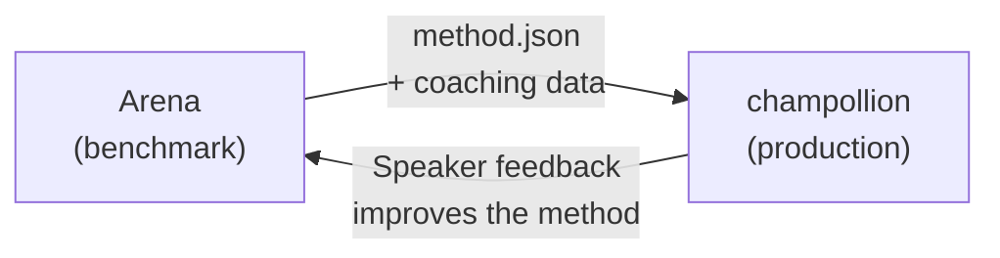

# 本番環境へのデプロイ

Arena での動作確認が完了したら、デプロイを行いましょう。

Arena は R&D 向けのプラットフォームです。翻訳手法の構築・ベンチマーク・比較に使用します。**本番環境へのデプロイ**は、開発者向け翻訳 CLI である [champollion](https://champollion.dev) を通じて行います。両者は共通のプラグイン形式で連携しています。



---

## デプロイの手順

### 1. 手法をプラグインとしてエクスポートする

ベンチマーク結果をパッケージ化した `method.json` マニフェストを作成します。

```json
{
  "name": "crk-coached-v3",
  "type": "llm-coached",
  "version": "3.0.0",
  "description": "Coached LLM translation for Plains Cree",
  "locales": ["crk"],
  "config": {
    "model": "google/gemini-2.5-flash",
    "temperature": 0.3
  },
  "benchmarks": {
    "crk": {
      "composite_score": 0.67,
      "fst_acceptance": 0.82,
      "corpus_size": 150
    }
  }
}
```

マニフェストと合わせて、コーチングデータ（文法ルール、辞書など）も含めてください。

### 2. Champollion にインストールする

```bash
champollion plugin install ./my-method-plugin/
```

### 3. 言語ペアを設定する

```json title="champollion.config.json"
{
  "pairs": {
    "en-crk": { "method": "plugin", "plugin": "crk-coached-v3" }
  }
}
```

### 4. 実際のコンテンツを翻訳する

```bash
npx champollion sync
```

ベンチマーク済みの手法が、本番環境で実際の翻訳を生成するようになりました。

---

## 先住民言語について

先住民言語コミュニティを対象とした手法を本番環境にデプロイするには、**コミュニティの同意**が必要です。翻訳手法の開発・評価・デプロイは、OCAP 原則（所有権・管理権・アクセス権・占有権）に基づいて行われます。

Deployable ティア（0.70 以上）に達した手法が自動的にデプロイされるわけではありません。デプロイは、当該言語コミュニティのガバナンス機関が同意を与えた**場合にのみ、そのタイミングで**実施されます。

ガバナンスの全体的な枠組みについては、[データ主権](/docs/sovereignty/data-sovereignty)および[所有権の移転](/docs/sovereignty/ownership-transfer)を参照してください。

---

## 関連情報

- [The Eval Harness Bridge](https://champollion.dev/docs/guides/bridge) — Arena から champollion へのパイプラインの詳細なウォークスルー
- [Plugin Specification](https://champollion.dev/docs/reference/plugin-spec) — method.json マニフェストの形式
- [champollion Agent Guide](https://champollion.dev/docs/guides/agent-guide) — champollion を使った翻訳の方法