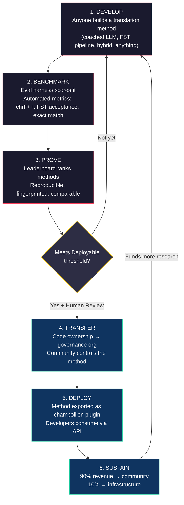
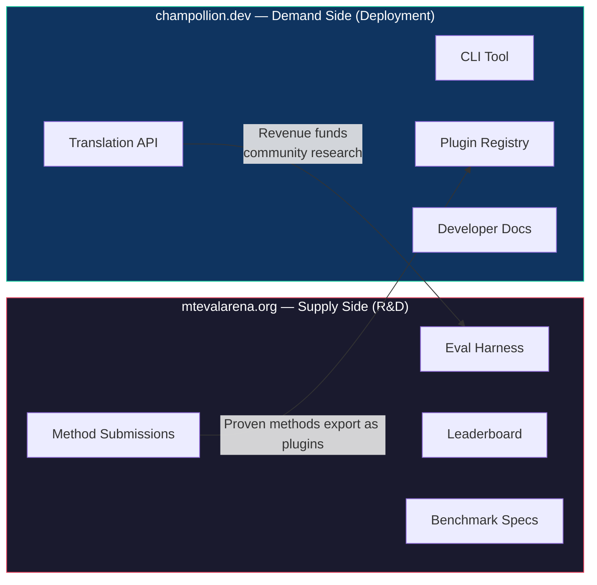
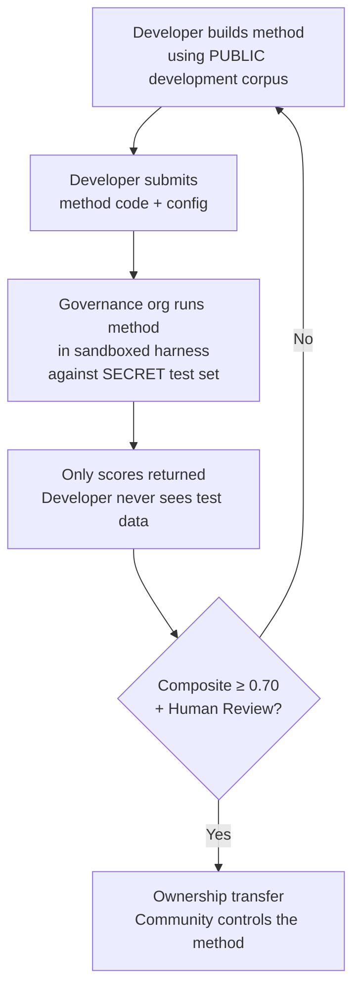

# 仕組み：機械翻訳のための競争的クラウドソーシング

> **エグゼクティブサマリー。** 世界の恵まれていない言語——Metaの OMT-1600 が対応を主張する約1,300言語を含みますが、その品質は実用可能な水準を下回っています——における機械翻訳は、モデルの学習問題ではなく、*インフラストラクチャ*の問題です。単一のモデル、研究機関、または企業がこれを解決することはできません。本ドキュメントでは、世界中の ML エンジニア、言語学者、および言語話者を分散型研究ラボへと変えるプラットフォームアーキテクチャを説明します。誰でも翻訳手法を構築し、プラットフォームがソブリン評価データに対してその有効性を証明し、証明された手法は本番環境にデプロイされ、その言語を話すコミュニティに収益が還元されます。このメカニズムは、暗号学的ソブリンティを伴う競争的クラウドソーシングであり、これまでに試みられたことのない組み合わせです。

---

> [!IMPORTANT]
> **スコープ。** このプラットフォームは**正式な書き言葉の翻訳**——文書、教育資料、公式通信、UI 文字列——を評価します。チャットボット、リアルタイム通訳、または無制限ドメインの会話システムではありません。リーダーボードは、特定のテキストドメインにおけるキュレーションされた対訳コーパスに対して翻訳手法をランク付けします（ドメイン分類については [Benchmark Specification §2.7](/docs/specifications/benchmark#27-domain) を参照してください）。MT は言語復興のためのインフラストラクチャであり、その代替ではありません。子どもは機械ではなく人から言語を学びます。

### 現在のドメインカバレッジ

| ドメイン | ティアカバレッジ | ステータス | 備考 |
|--------|--------------|--------|-------|
| 公式・行政 | Tier 1–5 | 稼働中 | EdTeKLA コーパス |
| 教育・教科書 | Tier 1–4 | 稼働中 | EdTeKLA コーパス |
| 物語・文学 | 限定的 | 計画中 | ゴールドスタンダードに一部収録 |
| 宗教・聖典 | 参照のみ | 未評価 | FLORES+（聖書ドメイン）；公式スコアリングには使用しない |
| 会話 | スコープ外 | 設計上の制限 | このシステムは書き言葉を評価するものであり、音声は対象外 |
| 技術・科学 | スコープ外 | 将来対応予定 | ドメイン固有の用語検証が必要 |

## 1. 問題：機械翻訳 ≠ 機械学習

低リソース言語（LRL）における機械翻訳は、一般的に機械学習の問題として捉えられています。すなわち、データを収集し、モデルを学習させ、デプロイするというアプローチです。しかし、この捉え方は誤りであり、その誤りは重大な結果をもたらします——世界の大多数の言語に対して構造的に機能しないアプローチへ、資金、人材、インフラストラクチャが向けられてしまうからです。

### 1.1 ML アプローチが失敗する理由

MT における標準的な ML パイプラインには、大規模な対訳コーパス、検証済みの評価ベンチマーク、そしてデプロイメントパスという3つの要素が必要です。Google Translate が対応する約130言語および NLLB-200 がカバーする約200言語については、この3つすべてが存在します。OMT-1600 が対応を主張する約1,300の追加言語については、評価データは存在するものの品質は実用可能な水準を下回るものがほとんどであり、モデルの重みは公開されておらず、デプロイメントパイプラインも存在しません。残りの約5,400以上の言語については、これらのいずれも存在しません。

| 要件 | 高リソース言語 | OMT-1600 カバレッジ（約1,300 LRL） | 残りの約5,400言語 |
|-------------|------------------------|-------------------------------|---------------------------|
| **対訳コーパス** | 数百万の文ペア（Europarl、UN Corpus、OpenSubtitles） | 聖書ドメインのバイテキスト、ウェブスクレイピング、合成逆翻訳。コミュニティキュレーションデータなし。 | 数百から数千程度（存在する場合） |
| **評価ベンチマーク** | WMT、FLORES、NTREX——標準化・再現可能 | BOUQuET（聖書ドメイン）、met-BOUQuET。形態論的検証なし。独立した評価なし。 | 標準ベンチマークなし；アドホックな評価 |
| **デプロイメントパス** | Google Translate、DeepL、Azure——商用 API | モデルの重みは未公開。CLI なし、プラグインシステムなし、コミュニティデプロイ可能な API なし。 | なし。API なし、製品なし、市場なし。 |

ML アプローチは、学習用データが存在し、デプロイ先の市場が存在する場合に機能します。OMT-1600 は最初の条件を大幅に拡張しましたが——独立した品質検証、形態論的検証、またはコミュニティガバナンスなしの拡張は、信頼のない拡張です。問題は単に「より良いモデルが必要だ」ということではなく、「モデルが機能することを証明し、コミュニティが管理できるインフラストラクチャが必要だ」ということです。

### 1.2 LRL における MT が実際に必要とするもの

恵まれていない言語のための翻訳は、主として学習の問題ではありません。それは**手法エンジニアリング**の問題です——利用可能なリソース（LLM、形態論的ツール、コミュニティの知識、言語規則）を組み合わせて機能する翻訳パイプラインを構築し、厳密な評価によってその有効性を証明するという課題です。

この区別は重要です：

| 次元 | ML アプローチ | 手法エンジニアリングアプローチ |
|-----------|------------|---------------------------|
| **中心的な活動** | データでモデルを学習させる | ツール、プロンプト、言語知識をパイプラインに組み合わせる |
| **ボトルネック** | 対訳データの量 | エンジニアリングの創造性 ＋ 評価インフラストラクチャ |
| **貢献できる人** | GPU クラスターとデータセットを持つチーム | API キー、辞書、アイデアがあれば誰でも |
| **評価** | ホールドアウトテストセットでの BLEU/chrF | 形態論的検証 ＋ 人間によるレビュー ＋ 自動メトリクス |
| **デプロイメント** | モデルを提供する | 手法をプラグインとしてパッケージ化する |

現代の LLM はすでに多くの低リソース言語の潜在的な知識を含んでいます——もっともらしく見える出力を生成するには十分な知識です。問題は、この出力がしばしば形態論的に無効であることです（モデルはその言語に存在しない語形を幻覚します）。エンジニアリングの課題は、LLM が知っていることを抽出し、言語的現実に対して検証し、その結果を本番利用向けにパッケージ化する方法です。

これが、モデルではなく**手法**をベンチマークする理由です。手法とは完全なレシピです：モデルの選択 ＋ プロンプトエンジニアリング ＋ ツールの使用 ＋ 前処理・後処理 ＋ コーチングデータ ＋ リトライ戦略。同じモデルを使用する2つのチームが異なる手法を用いれば、異なるスコアを得ます。それがまさに重要な点です。

### 1.3 多合成語言語がすべてを破綻させる理由

世界で最も恵まれていない言語の多くは**多合成語言語**です——生産的な形態論的プロセスによって文全体を単一の語に符号化します。Plains Cree 語の次の単語を考えてみてください：

> **ê-kî-nitawi-kîskinwahamâkosiyân**
> *「私が学校に行っていたとき」*

一語です。時制（過去）、方向（行く）、語根（学ぶ）、態（受動・再帰）、人称（一人称単数）を符号化しています。Cree 語が一語で表現することを、英語は6語必要とします。

これは標準的な MT をあらゆるレベルで破綻させます：

- **トークン化** — BPE と SentencePiece は多合成語の単語を無意味な断片に分解します。これらは連結形態論向けに設計されているためです。
- **幻覚** — LLM はもっともらしく見えるが有効な語ではない文字列を生成します。非話者はその違いを判断できません。形態論的検証なしでは、幻覚は見えません。
- **評価** — 語レベルのメトリクス（BLEU）は、これらの言語の機能の根幹をなす自然な屈折変化を罰します。文字レベルのメトリクス（chrF++）はより優れていますが、構造的検証なしではまだ不十分です。

解決策は、より大きなモデルやより多くの学習データではありません。**ユーザーに届く前に幻覚を捕捉するインフラストラクチャ**——「これはこの言語の語ではない」と明確に判定できる形態素解析器（FST）——です。

---

## 2. 既存のアプローチが機能しない理由

### 2.1 商用 MT

商用翻訳サービスは歴史的に市場規模に最適化してきました。Meta の OMT-1600（2026年3月）は大きな転換を示しています——1つのシステムで1,600言語に対応しています。しかし、最も低いリソースティアにある約1,300言語については、品質は実用可能な水準を下回り、モデルの重みは利用できず、デプロイメントパイプラインも存在しません。構造的なインセンティブの問題は進化しています：大手テクノロジー企業は今や LRL 向けのモデルを構築できますが、独立した評価、形態論的検証、またはコミュニティガバナンスなしでは、カバレッジだけでは問題を解決できません。

### 2.2 学術研究

学術的な MT 研究は、学習データ、共有タスク、および発表の場が存在する高リソース言語ペアに圧倒的に集中しています。低リソース言語ペアに取り組む研究者は、論文発表に苦労し、計算資源の資金調達に苦労し、デプロイに苦労します——LRL 向けのデプロイメントインフラストラクチャが存在しないためです。

### 2.3 単発コンペティション

Kaggle コンペティションを開催することもできます：「英語→Plains Cree、最高 chrF++ スコアに10,000ドル」。しかし、次のようなことが起こります：

1. 誰かが優勝し、ノートブックを提出し、賞金を受け取り、帰宅します。
2. そのノートブックは Kaggle のアーカイブで腐っていきます。誰もデプロイしません。誰もメンテナンスしません。
3. テストセットはやがて公開され——永遠に汚染されます。
4. ガバナンス組織は、Google のサービス利用規約のもとで Google のインフラストラクチャに言語データをアップロードしており、ライフサイクルを自分たちで管理する実質的な手段がありません。
5. デプロイメントの橋渡しがありません。優勝したノートブックは機能する API ではありません。

一度限りの報奨金は賞金ハンターを引き寄せます。コミュニティガバナンスを伴う継続的なリーダーボードは、持続的なエンゲージメントを生み出します。

### 2.4 ファインチューニング

対訳テキストでオープンモデルをファインチューニングすることは、明白な ML アプローチです。しかし、ほとんどの LRL において、ファインチューニングに必要な対訳コーパスは、まさに存在しないデータです——そしてそれを作成するには、ファインチューニングが代替しようとしているのと同じバイリンガル話者とコミュニティエンゲージメントが必要です。データを必要とする技術でデータ不足の問題をブートストラップすることはできません。

---

## 3. 解決策：ソブリン評価を伴う競争的クラウドソーシング

このプラットフォームは従来のアプローチを逆転させます：1つのチームが1つのモデルを構築する代わりに、**グローバルコミュニティが最良の翻訳手法を構築するために競い**、プラットフォームがその有効性を証明し、証明された手法は言語コミュニティが所有権と管理権を保持したまま本番環境にデプロイされます。

### 3.1 完全なループ

各ステージには特定の機能があります：

| ステージ | 何が起こるか | 誰が恩恵を受けるか |
|-------|-------------|--------------|
| **開発（Develop）** | 研究者、学生、または愛好家が、LLM プロンプティング、FST パイプライン、辞書、ファインチューニングモデル、ルールベースシステム、またはハイブリッドなど、任意のツールを使用して翻訳手法を構築します | 貢献者が学び、実験し、発表します |
| **ベンチマーク（Benchmark）** | 評価ハーネスが、再現可能なメトリクスを用いて標準化されたコーパスに対して手法をスコアリングします。すべての実行は [run card](/docs/specifications/benchmark#3-run-card-schema)——何がテストされ、どのように実行されたかの完全な記録——を生成します | 研究者が再現可能で比較可能な結果を得ます |
| **証明（Prove）** | 結果が公開リーダーボードに表示されます。手法はランク付けされ、比較され、精査されます。コミュニティは何が機能し、何が機能しないかを確認できます | 誰もが最先端の状況を把握できます |
| **移転（Transfer）** | 先住民言語については、デプロイ可能な閾値（複合スコア ≥ 0.70）に達し、かつ人間による検証に合格した手法のコード所有権が、言語コミュニティのガバナンス組織に移転されます | コミュニティが収益を生む資産を獲得します |
| **デプロイ（Deploy）** | 手法は [champollion](https://github.com/gamedaysuits/champollion) プラグインとしてエクスポートされ、API 経由で提供されます。開発者は基盤となる手法を理解することなく翻訳を利用できます | 開発者は商用 API が対応していない言語の翻訳を利用できます |
| **持続（Sustain）** | API 収益は分配されます：90% がコミュニティへ、10% がインフラストラクチャへ。収益はさらなる言語研究、コーパス開発、およびコミュニティプログラムに充てられます | フライホイールは初期確立後に自律的に持続します |

### 3.2 競争的ダイナミクスが機能する理由

競争は付随的なものではなく——それがメカニズムです。その理由を説明します：

**アプローチの多様性。** 英語→Plains Cree に最適な手法は FST ゲート付きコーチド LLM かもしれません。英語→Quechua に最適なのは辞書拡張パイプラインかもしれません。英語→Inuktitut に最適なのは Nunavut Hansard コーパスからブートストラップされたファインチューニングモデルかもしれません。単一のチームやアプローチがすべての言語で優位に立つことはありません。リーダーボードは、どの*種類*のアプローチがどの*種類*の言語に機能するかを明らかにします——これ自体が研究上の貢献となるメタ結果です。

**持続的なエンゲージメント。** リーダーボードは決して完成しません。誰かが常にトップスコアを上回ろうとします。すべての提出が計算資源と知的努力を問題に提供します。一度限りの助成金とは異なり、競争的ダイナミクスはグローバルコミュニティからの継続的な研究投資を生み出します。

**参入障壁の低さ。** API キー、辞書、アイデアがあれば十分です。評価ハーネスはオープンソースです。コーパスフォーマットはシンプルな JSON です。言語学の学生が十分なリソースを持つ研究室と競い合うことができます——そして、ドメイン知識（言語を理解すること）が計算資源を上回ることがあるため、時に勝利することもあります。

**デプロイメントの橋渡し。** ハーネスで高スコアを獲得した手法は、設定を1つ変更するだけで本番環境にデプロイできます。「ここで証明し、そこにデプロイする。」これが Kaggle、WMT 共有タスク、および学術論文が埋めていないギャップです。

### 3.3 プラットフォームアーキテクチャ

エコシステムは、2つの異なるオーディエンスに対応する2つのサイトに物理的に分割されています：

**[mtevalarena.org](https://mtevalarena.org)** は R&D の実証の場です。そのオーディエンスは ML エンジニア、言語学者、および研究者です。ここでのすべては、翻訳手法の構築、テスト、および証明に関するものです。

**[champollion.dev](https://champollion.dev)** はデプロイメントプラットフォームです。そのオーディエンスは、アプリに翻訳が必要な開発者です。手法がどのように機能するかを理解する必要はなく——API を呼び出すだけです。

両者の橋渡しは**手法プラグイン**です：証明された手法をデプロイ用にパッケージ化し、コミュニティが所有するものです。

---

## 4. ソブリン評価：インフラストラクチャが重要な理由

評価インフラストラクチャは技術的な詳細ではなく——それはソブリンティモデルの核心です。標準的な評価（テストセットを共有プラットフォームにアップロードする）は、先住民言語には機能しません。言語データの管理権を手放すことになるためです。

### 4.1 ソブリンティメカニズム

開発者はゴールドスタンダードの評価データを見ることはありません。開発者は公開開発コーパスに対して開発を行い、その後手法コードをガバナンス組織に提出します。ガバナンス組織はサンドボックス内で秘密のテストセットに対してそれを実行します。返ってくるのはスコアのみです。これは単なるセキュリティではなく——先住民データガバナンスが要求する **OCAP® 原則**（所有権、管理、アクセス、占有）の直接的な実装です。

### 4.2 なぜ他者のプラットフォームで実行できないのか

Kaggle では、ガバナンス組織は Google のサービス利用規約のもとで Google のインフラストラクチャに言語データをアップロードします。自分たちのタイムラインでアクセスを取り消すことはできません。提出物にカスタム法的条件（所有権移転など）を付加することはできません。データが他の目的に使用されないという暗号学的保証もありません。データソブリンティとは、コミュニティが評価エンドポイントを管理し、鍵を保持し、シャットダウンできることを意味します。

---

## 5. 評価の哲学：Microeval と LYSS

標準的な MT メトリクス（BLEU、chrF++、COMET）は言語を横断して汎化するように設計されています。その汎用性が強みであり——同時に盲点でもあります。多合成語言語では、参照と文字 n-gram を共有する形態論的に無効な語が chrF++ で高スコアを得ますが、話者であれば誰でも意味不明と認識するでしょう。

**Microeval 開発**とは、利用可能な最良の言語ツールを使用して特定の言語に合わせた評価メトリクスを構築することを意味します。このフレームワークは **LYSS**（Linguistically-informed Yield & Structural Scoring）と呼ばれます：

| コンポーネント | 測定対象 | ツール | ステータス |
|-----------|-----------------|------|--------|
| **LYSS-fst** | 形態論的妥当性 | 有限状態変換器 | ✅ 実装済み（Plains Cree） |
| **LYSS-eq** | 言語的等価性 | 言語学者がキュレーションした変形規則 | ✅ 実装済み（Plains Cree） |
| **LYSS-sem** | 意味的保存 | 言語固有の意味モデル | ✅ 実装済み（Plains Cree） |

汎用メトリクス（chrF++、BLEU）はベースラインとして、また LYSS ツールを持たない言語の主要シグナルとして機能します。言語固有のツールが存在する場合は常に、LYSS コンポーネントがスコアリングの重みを担います——各言語にとって最も重要なことは、言語固有のツールのみが測定できるものだからです。

LYSS の完全な仕様と複合スコアリングロジックについては、[SCORING_SPEC.md §4](/docs/specifications/scoring#4-composite-score) を参照してください。

> [!WARNING]
> **実行間の比較可能性。** メトリクスの利用可能性が異なる実行（例：一方の実行は FST スコアを持ち、もう一方は持たない）を比較する場合、複合スコアは直接比較できません。複合スコアは利用可能なメトリクスに対して正規化されますが、5つのメトリクスで評価された実行は2つで評価された実行よりも多くの情報を持ちます。リーダーボードは各エントリのメトリクスカバレッジを示します。

---

## 6. 誰のためのプラットフォームか

### ML エンジニアと研究者のために

共有タスクがカバーしていない言語ペアに対する標準化されたベンチマークを持つオープンリーダーボード。評価ハーネスで任意の結果を再現できます。手法を発表し、トップスコアを上回ってください。すべての提出は特定の設定とデータセットバージョンにフィンガープリントされます——何がテストされたかについて曖昧さはありません。

### 言語コミュニティのために

あなたの言語のために構築された翻訳技術の所有権と管理権。競争的ダイナミクスにより、複数のチームが同時にあなたの言語に取り組んでいます——そのすべてから恩恵を受け、結果を所有します。API 使用からの収益は、あなたの条件でコミュニティプログラムに充てられます。

### 資金提供者と助成金審査者のために

翻訳研究提案を評価するための透明で再現可能なメトリクス。論文発表を超えた測定可能な成果：API 使用量、生成された収益、時系列での品質メトリクス、言語カバレッジ。成功した手法は自律的な収益源を生み出します——助成金の影響は資金が終了した後も複利的に拡大し続けます。

### 開発者のために

商用 API が対応していない言語の翻訳。1つの CLI コマンド（`npx champollion sync`）でコミュニティが証明した手法を使用してロケールファイルを翻訳できます。フランス語には Google Translate、Plains Cree にはコーチド LLM、Quechua にはコミュニティ API を使用——すべて同じプロジェクト内で、すべて同じインターフェースで。

### 学生のために

現実世界への影響を持つオープンチャレンジ。恵まれていない言語の翻訳手法を構築し、ベンチマークし、結果を発表してください。インフラストラクチャは無料で、データセットはオープンで、リーダーボードはあなたがトップ10の大学にいるか図書館の端末から作業しているかを問いません。

---

## 7. 社会的・技術的背景

### 6.1 言語復興が加速している

言語復興の取り組みは世界中で拡大しています。イマージョンスクール、コミュニティ言語ネスト、デジタルアーカイブプロジェクトが、カナダ、米国、オーストラリア、ニュージーランド、北欧の先住民コミュニティ全体で拡大しています。これらの取り組みには技術が必要です——特に、言語データに対するコミュニティのソブリンティを尊重する翻訳技術が。

### 6.2 LLM がベースラインを変えた

2023年以前は、多合成語言語に対して MT 機能を構築するには、相当な NLP の専門知識、カスタムモデルの学習、および大規模な計算予算が必要でした。現代の LLM はそのベースラインを変えました：コーチングデータと形態論的検証を伴う適切に設計されたプロンプトは、一部の言語ペアで実用可能な翻訳を生成できます——学習不要で。これにより、手法開発への参入障壁が劇的に低下しました。問題は「どのようにモデルを構築するか？」から「モデルが生成するものを検証・修正するパイプラインをどのように構築するか？」へとシフトしました。

### 6.3 オープンソースベンチマーキング文化

AI ベンチマーキングはそれ自体の文化となっています。リーダーボードがイノベーションを促進します。コンペティションが人材を引き寄せます。Chatbot Arena、LMSYS、Hugging Face Open LLM Leaderboard——これらのプラットフォームは、競争的評価が急速な進歩を促進することを示しています。私たちはそのエネルギーを、商用 MT が存在しないか独立して有効性が証明されていない数千の言語の翻訳に向けます。

### 6.4 先住民データソブリンティは交渉の余地がない

OCAP® 原則（所有権、管理、アクセス、占有）、CARE 原則（集合的利益、管理の権限、責任、倫理）、および Te Mana Raraunga（マオリデータソブリンティ）などのフレームワークは、オプションの追加機能ではありません——先住民の言語資源に触れるあらゆる技術の構造的要件です。私たちの評価インフラストラクチャは、単なる政策声明としてではなく、アーキテクチャ的にこれらの原則を実装しています。

---

## 8. 緊張関係と限界

このプロジェクトは、西洋的なメカニズム——競争的ベンチマーキング——を、しばしば共同体的、関係的、および長老に導かれた知識体系に奉仕するために使用しています。その緊張関係は現実のものであり、主張によって解決するのではなく、明示的に述べなければなりません。

**ベンチマーキング対共同体的知識。** リーダーボードは個人をランク付けし、数値スコアを最適化します。先住民の知識の伝統は、関係的権威、共同体的修正、および関係に基づく正当性を重視します。私たちは、中核的なメカニズムが個人の競争的最適化であるプラットフォームを構築しながら、これらの知識体系に奉仕すると主張することはできません。ソブリンティアーキテクチャ（§4）——コミュニティが手法を所有し、評価を管理し、デプロイされるものを決定する——が私たちの構造的な対応ですが、それは緊張関係を解消するものではありません。リーダーボードはやはりリーダーボードです。

**私たちが取り組んでいること。** プラットフォームは個人の提出と並んで、チームおよびコミュニティの提出をサポートします。リーダーボードは結果を「誰が勝っているか」ではなく「現在の最先端」として提示します。デプロイされるものを決定するのは、リーダーボードのスコアではなくガバナンス組織です。自動スコアは開発者に何も権利を与えません；コミュニティが決定します。そして、プラットフォームのフレーミングとインセンティブ構造がコミュニティに奉仕しているかどうかについて、パートナーコミュニティとの継続的な諮問フィードバックループを維持しています。そうでない場合は、変更します。

**MT は復興ではない。** 翻訳はテキストを言語間で変換します。復興は新しい話者を生み出します。完璧な MT システムは、伝達の問題、威信の問題、または教育学的問題を解決しません。むしろ「コンピューターがその言語を話せる」という錯覚を生み出し、人間による伝達の緊急性を損なう可能性さえあります。私たちは MT をインフラストラクチャとして構築します——後編集のための下書き翻訳、言語学習アプリのための形態論的ツール、自分たちの言語でのサービスを要求するコミュニティのための政治的レバレッジ——世代間伝達の代替としてではなく。技術がデプロイされるかどうか、いつ、どのように、はコミュニティが管理します。

このセクションは、招待された批評（2026年5月）でこれらの緊張関係が指摘され、内部文書に埋めるのではなく公開的に述べることを約束したために存在します。

> [!NOTE]
> **リーダーボードスコアは自動化されたプロキシです。** リーダーボードに表示されるすべてのスコアは、管理された条件下で評価ハーネスによって計算された自動測定値です。これらは手法の相対的なパフォーマンスを示しますが、品質保証を構成するものではありません。コミュニティが検証した手法は別途マークされます。いかなる自動スコアも開発者にデプロイメントの権利を与えません——その決定はガバナンス組織が行います。

---

## 9. 現在の状況

### 現在存在するもの

- **champollion** — 本番対応 CLI ツール。10の翻訳手法、言語ペアごとの設定、品質ゲート、5つのファイルフォーマット。[npm で公開済み](https://www.npmjs.com/package/champollion)。
- **MT Eval Harness** — 動作する評価フレームワーク。chrF++、FST 受理、および完全一致メトリクスを実装済み。run card スキーマ確定済み。フィンガープリンティングと整合性検証が動作中。
- **EDTeKLA Dev v1** — Plains Cree 評価コーパス（CC BY-NC-SA 4.0）、アルバータ大学の EdTeKLA 研究グループから提供。教科書コーパスは486エントリ（436 dev + 50 ホールドアウト）、加えて itwêwina からの62の別個のゴールドスタンダードペア（合計548）。正規の dev コーパスは436エントリの `textbook_dev.json` です——完全な教科書 dev スプリット。
- **FLORES+ Devtest** — 1,012文 × 39言語（CC BY-SA 4.0）。
- **Arena ウェブサイト** — リーダーボード、仕様、チュートリアル、およびソブリンティフレームワークを含む Docusaurus ベースのドキュメントサイト。
- **Benchmark Specification** — コーパススキーマ、run card フォーマット、および評価プロトコルを定義する[正規仕様](/docs/specifications/benchmark)。メトリクス定義、複合重み、および品質ティアについては [SCORING_SPEC.md](/docs/specifications/scoring) を参照してください。

### 次のステップ

| フェーズ | 内容 | ステータス |
|-------|------|--------|
| ベースラインスイープ | EDTeKLA に対して12モデル × 3温度 × 2コーチング設定 | 🔲 計画中 |
| 複合スコア | ハーネスでの重み付きメトリクス実装 | ✅ 完了 |
| 意味スコア | CrkSemanticMetric（評価標準）からの評定重み付きスコア | ✅ 完了 |
| 形態論的精度 | ゴールドスタンダード分析に対する形態素ごとのスコアリング | 🔲 計画中 |
| 等価マッチ | CrkLinterMetric（評価標準）による変形クラスマッチング | ✅ 完了 |
| Champollion API | コミュニティ所有手法のための従量制 API | 🔲 計画中 |
| 第2言語 | 第2言語ペアへの拡張（Inuktitut、Quechua、または Sámi） | 🔲 計画中 |

---

## 10. はじめに

**手法を構築する：** [評価ハーネス](https://github.com/gamedaysuits/arena)をクローンし、ベースライン実験を実行して、リーダーボードでの位置を確認してください。

**コーパスを提供する：** 恵まれていない言語を話す場合、キュレーションされた翻訳ペアが50あれば、新しいリーダーボードトラックを開設するのに十分です。[言語コミュニティのために](https://mtevalarena.org/docs/community/for-language-communities)を参照してください。

**翻訳をデプロイする：** [champollion](https://github.com/gamedaysuits/champollion) をインストールし、`npx champollion sync` でアプリを翻訳してください。

**取り組みを支援する：** コストフレームワークと持続可能性の見通しについては、[経済モデル](https://mtevalarena.org/docs/sovereignty/economic-model)を参照してください。

---

## 関連情報

- **[Benchmark Specification](/docs/specifications/benchmark)** — コーパスフォーマット、run card スキーマ、評価プロトコル、ソブリンティ
- **[Scoring Specification](/docs/specifications/scoring)** — メトリクス、複合重み、品質ティア、コスト・速度の計算式
- **[MT Eval Arena](https://mtevalarena.org)** — R&D の実証の場
- **[champollion](https://github.com/gamedaysuits/champollion)** — デプロイメントプラットフォーム
- **[低リソース言語を支援する](https://mtevalarena.org/docs/community/low-resource-languages)** — 多合成語 MT の課題とアプローチの詳細

---

*このドキュメントは、プロジェクトに初めて接する方のためのエントリーポイントです。完全な技術仕様については、[BENCHMARK_SPEC.md](/docs/specifications/benchmark)（プロトコル）および [SCORING_SPEC.md](/docs/specifications/scoring)（メトリクス）を参照してください。*