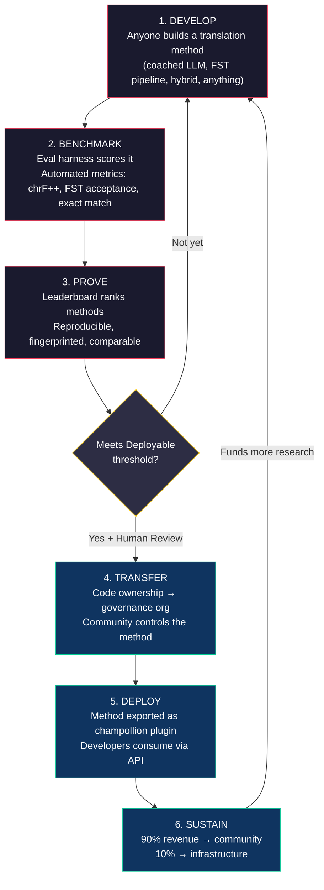
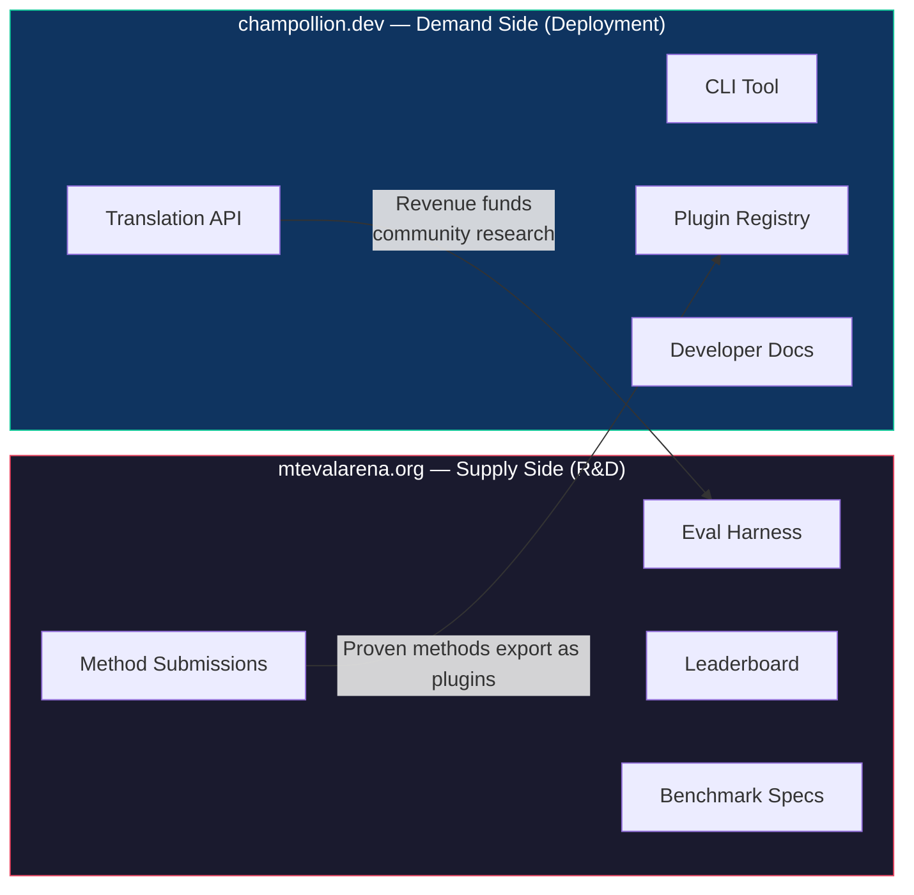
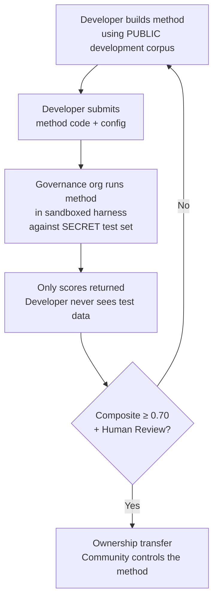

# 仕組み：機械翻訳のための競争的クラウドソーシング

> **エグゼクティブサマリー。** 世界の恵まれていない言語——Metaの OMT-1600 が対応を主張する約1,300言語を含みますが、その品質は実用可能な閾値を下回っています——における機械翻訳は、モデルのトレーニング問題ではなく、*インフラストラクチャ*の問題です。単一のモデル、研究機関、または企業がこれを解決することはできません。本ドキュメントでは、世界中のMLエンジニア、言語学者、および言語話者を分散型研究ラボへと変えるプラットフォームアーキテクチャを説明します。誰でも翻訳手法を構築し、プラットフォームがソブリン評価データに対してその有効性を証明し、証明された手法は本番環境にデプロイされ、その言語を話すコミュニティに収益が還元されます。このメカニズムは、暗号学的ソブリンティを伴う競争的クラウドソーシングであり、これまでに試みられたことのない組み合わせです。

---

> [!IMPORTANT]
> **スコープ。** このプラットフォームは**正式な書き言葉テキストの翻訳**——文書、教育資料、公式通信、UI文字列——を評価します。チャットボット、リアルタイム通訳、または無制限ドメインの会話システムではありません。リーダーボードは、特定のテキストドメインにおけるキュレーションされた対訳コーパスに対して翻訳手法をランク付けします（ドメイン分類については [Benchmark Specification §2.7](/docs/specifications/benchmark#27-domain) を参照してください）。MTは言語復興のためのインフラストラクチャであり、その代替ではありません。子どもは機械ではなく人から言語を学びます。

### 現在のドメインカバレッジ

| ドメイン | ティアカバレッジ | ステータス | 備考 |
|--------|--------------|--------|-------|
| 公式・政府 | Tier 1–5 | 稼働中 | EdTeKLA コーパス |
| 教育・教科書 | Tier 1–4 | 稼働中 | EdTeKLA コーパス |
| 物語・文学 | 限定的 | 計画中 | ゴールドスタンダードに一部エントリあり |
| 宗教・聖典 | 参照のみ | 未評価 | FLORES+（聖書ドメイン）；公式スコアリングには使用しない |
| 会話 | スコープ外 | 設計上 | このシステムは書き言葉テキストを評価するものであり、音声は対象外 |
| 技術・科学 | スコープ外 | 将来対応 | ドメイン固有の用語検証が必要 |

## 1. 問題：機械翻訳 ≠ 機械学習

低リソース言語（LRL）における機械翻訳は、一般的に機械学習の問題として捉えられています。すなわち、データを収集し、モデルをトレーニングし、デプロイするというものです。しかし、この捉え方は誤りであり、その誤りは重大な結果をもたらします——世界の大多数の言語に対して構造的に機能しないアプローチに、資金、人材、インフラストラクチャが向けられてしまうからです。

### 1.1 MLフレーミングが失敗する理由

MTのための標準的なMLパイプラインには、大規模な対訳コーパス、検証済みの評価ベンチマーク、そしてデプロイメントパスという3つのものが必要です。Google Translateが対応する約130言語とNLLB-200がカバーする約200言語については、この3つすべてが存在します。OMT-1600が対応を主張する約1,300の追加言語については、評価データは存在しますが品質は実用可能な閾値を下回るものがほとんどであり、モデルの重みは公開されておらず、デプロイメントパイプラインも存在しません。残りの約5,400以上の言語については、これらのいずれも存在しません。

| 要件 | 高リソース言語 | OMT-1600 カバレッジ（約1,300 LRL） | 残りの約5,400言語 |
|-------------|------------------------|-------------------------------|---------------------------|
| **対訳コーパス** | 数百万の文ペア（Europarl、UN Corpus、OpenSubtitles） | 聖書ドメインのバイテキスト、ウェブスクレイプ、合成逆翻訳。コミュニティキュレーションデータなし。 | 数百から数千程度（存在する場合） |
| **評価ベンチマーク** | WMT、FLORES、NTREX——標準化・再現可能 | BOUQuET（聖書ドメイン）、met-BOUQuET。形態論的検証なし。独立した評価なし。 | 標準ベンチマークなし；アドホック評価 |
| **デプロイメントパス** | Google Translate、DeepL、Azure——商用API | モデルの重みは未公開。CLI、プラグインシステム、コミュニティデプロイ可能なAPIなし。 | なし。API、製品、市場のいずれも存在しない。 |

MLアプローチは、トレーニング用のデータが存在し、デプロイ先の市場が存在する場合に機能します。OMT-1600は最初の条件を大幅に拡張しましたが——独立した品質検証、形態論的検証、またはコミュニティガバナンスなしの拡張は、信頼のない拡張です。問題は単に「より良いモデルが必要だ」ということではなく、「モデルが機能することを証明するインフラストラクチャが必要であり、それはコミュニティが管理する条件のもとで行われなければならない」ということです。

### 1.2 LRLにおけるMTが実際に必要とするもの

恵まれていない言語のための翻訳は、主にトレーニングの問題ではありません。それは**手法エンジニアリング**の問題です——利用可能なリソース（LLM、形態論的ツール、コミュニティの知識、言語規則）を組み合わせて機能する翻訳パイプラインを構築し、厳密な評価によってそれが機能することを証明するという課題です。

この区別は重要です：

| 次元 | MLアプローチ | 手法エンジニアリングアプローチ |
|-----------|------------|---------------------------|
| **中心的な活動** | データでモデルをトレーニングする | ツール、プロンプト、言語知識をパイプラインに組み合わせる |
| **ボトルネック** | 対訳データの量 | エンジニアリングの創造性 + 評価インフラストラクチャ |
| **貢献できる人** | GPUクラスターとデータセットを持つチーム | APIキー、辞書、アイデアがあれば誰でも |
| **評価** | ホールドアウトテストセットでのBLEU/chrF | 形態論的検証 + 人間によるレビュー + 自動メトリクス |
| **デプロイメント** | モデルを提供する | 手法をプラグインとしてパッケージ化する |

現代のLLMはすでに多くの低リソース言語の潜在的な知識を含んでいます——もっともらしく見える出力を生成するには十分です。問題は、この出力がしばしば形態論的に無効であることです（モデルはその言語に存在しない語形を幻覚します）。エンジニアリングの課題は、LLMが知っていることを抽出し、言語的現実に対して検証し、その結果を本番使用のためにパッケージ化する方法です。

これが、モデルではなく**手法**をベンチマークする理由です。手法とは完全なレシピです：モデル選択 + プロンプトエンジニアリング + ツール使用 + 前処理/後処理 + コーチングデータ + リトライ戦略。同じモデルを使用する2つのチームが異なる手法を用いれば、異なるスコアを得ます。それがまさに重要な点です。

### 1.3 多合成語言語がすべてを破壊する理由

世界で最も恵まれていない言語の多くは**多合成語言語**です——生産的な形態論的プロセスを通じて文全体を単一の単語にエンコードします。Plains Creeの単語を考えてみましょう：

> **ê-kî-nitawi-kîskinwahamâkosiyân**
> *「私が学校に行っていたとき」*

一つの単語です。時制（過去）、方向（行く）、語根（学ぶ）、態（受動/再帰）、人称（一人称単数）をエンコードしています。Creeが一語で表現することを英語は6語必要とします。

これは標準的なMTをあらゆるレベルで破壊します：

- **トークン化** — BPEとSentencePieceは多合成語の単語を無意味な断片に分解します。これらは連結形態論のために設計されたからです。
- **幻覚** — LLMはもっともらしく見えるが有効な単語ではない文字列を生成します。非話者はその違いを判断できません。形態論的検証なしでは、幻覚は見えません。
- **評価** — 単語レベルのメトリクス（BLEU）は、これらの言語の機能の根本である自然な屈折変化を罰します。文字レベルのメトリクス（chrF++）はより優れていますが、構造的検証なしではまだ不十分です。

解決策は、より大きなモデルやより多くのトレーニングデータではありません。それは**幻覚がユーザーに届く前にキャッチするインフラストラクチャ**です——「これはこの言語の単語ではない」と明確に判定できる形態論的アナライザー（FST）です。

---

## 2. 既存のアプローチが機能しない理由

### 2.1 商用MT

商用翻訳サービスは歴史的に市場規模に最適化してきました。MetaのOMT-1600（2026年3月）は重要な転換を示しています——1つのシステムで1,600言語に対応しています。しかし、最低リソースティアの約1,300言語については、品質は実用可能な閾値を下回り、モデルの重みは利用できず、デプロイメントパイプラインも存在しません。構造的なインセンティブの問題は進化しています：大手テクノロジー企業はLRLのモデルを構築できるようになりましたが、独立した評価、形態論的検証、またはコミュニティガバナンスなしでは、カバレッジだけでは問題を解決できません。

### 2.2 学術研究

学術的なMT研究は、トレーニングデータ、共有タスク、および発表の場がそこにあるため、圧倒的に高リソース言語ペアに集中しています。低リソース言語ペアに取り組む研究者は、発表に苦労し、計算リソースの資金調達に苦労し、デプロイに苦労します——LRLのデプロイメントインフラストラクチャが存在しないからです。

### 2.3 単発コンペティション

Kaggleコンペティションを開催することもできます：「英語→Plains Cree、最高chrF++が$10,000を獲得」。何が起こるかというと：

1. 誰かが優勝し、ノートブックを提出し、賞金を受け取り、帰宅します。
2. ノートブックはKaggleのアーカイブで腐ります。誰もデプロイしません。誰もメンテナンスしません。
3. テストセットは最終的に公開され——永遠に汚染されます。
4. ガバナンス組織は、Googleの利用規約のもとでGoogleのインフラストラクチャに言語データをアップロードし、ライフサイクルに対する実質的な制御を持ちません。
5. デプロイメントブリッジがありません。優勝したノートブックは機能するAPIではありません。

一度限りの報奨金は賞金ハンターを引き付けます。コミュニティガバナンスを伴う継続的なリーダーボードは、持続的なエンゲージメントを生み出します。

### 2.4 ファインチューニング

対訳テキストでオープンモデルをファインチューニングすることは、明白なMLアプローチです。しかし、ほとんどのLRLにとって、ファインチューニングに必要な対訳コーパスは、まさに存在しないデータです——そしてそれを作成するには、ファインチューニングが代替しようとしているのと同じバイリンガル話者とコミュニティエンゲージメントが必要です。データを必要とする技術でデータ不足の問題をブートストラップすることはできません。

---

## 3. 解決策：ソブリン評価を伴う競争的クラウドソーシング

このプラットフォームは従来のアプローチを逆転させます：1つのチームが1つのモデルを構築する代わりに、**グローバルコミュニティが最良の翻訳手法を構築するために競い**、プラットフォームがそれが機能するかどうかを証明し、証明された手法は言語コミュニティが所有権と制御を保持したまま本番環境にデプロイされます。

### 3.1 完全なループ

各ステージには特定の機能があります：

| ステージ | 何が起こるか | 誰が恩恵を受けるか |
|-------|-------------|--------------|
| **開発（Develop）** | 研究者、学生、または愛好家が、LLMプロンプティング、FSTパイプライン、辞書、ファインチューニングされたモデル、ルールベースシステム、またはハイブリッドなど、好きなツールを使って翻訳手法を構築します | 貢献者は学び、実験し、発表します |
| **ベンチマーク（Benchmark）** | 評価ハーネスが、再現可能なメトリクスを用いて標準化されたコーパスに対して手法をスコアリングします。すべての実行は[ランカード](/docs/specifications/benchmark#3-run-card-schema)を生成します——何がテストされ、どのように実行されたかの完全な記録です | 研究者は再現可能で比較可能な結果を得ます |
| **証明（Prove）** | 結果が公開リーダーボードに表示されます。手法はランク付けされ、比較され、精査されます。コミュニティは何が機能し、何が機能しないかを確認できます | 誰もが最先端の状況を把握できます |
| **移転（Transfer）** | 先住民言語については、デプロイ可能な閾値（composite ≥ 0.70）に達し、かつ人間による検証に合格した手法のコード所有権が、言語コミュニティのガバナンス組織に移転されます | コミュニティは収益を生み出す資産を獲得します |
| **デプロイ（Deploy）** | 手法は[champollion](https://github.com/gamedaysuits/champollion)プラグインとしてエクスポートされ、API経由で提供されます。開発者は基礎となる手法を理解することなく翻訳を利用できます | 開発者は商用APIが対応していない言語の翻訳を得られます |
| **持続（Sustain）** | API収益は分配されます：90%がコミュニティへ、10%がインフラストラクチャへ。収益はさらなる言語研究、コーパス開発、コミュニティプログラムに資金を提供します | フライホイールは初期確立後に自律的に持続します |

### 3.2 競争的ダイナミクスが機能する理由

競争は付随的なものではありません——それがメカニズムです。その理由を説明します：

**アプローチの多様性。** 英語→Plains Creeに最適な手法は、FSTゲートのコーチングLLMかもしれません。英語→Quechuaに最適なものは辞書拡張パイプラインかもしれません。英語→Inuktitutに最適なものはNunavut Hansardコーパスからブートストラップされたファインチューニングモデルかもしれません。単一のチームやアプローチがすべての言語で支配することはありません。リーダーボードは、どの*種類*のアプローチがどの*種類*の言語に機能するかを明らかにします——これ自体が研究上の貢献であるメタ結果です。

**持続的なエンゲージメント。** リーダーボードは決して終わりません。誰かが常にトップスコアを上回りたいと思っています。すべての提出は計算リソースと知的努力を問題に提供します。一度限りの助成金とは異なり、競争的ダイナミクスはグローバルコミュニティからの継続的な研究投資を生み出します。

**低い参入障壁。** APIキー、辞書、アイデアがあれば十分です。評価ハーネスはオープンソースです。コーパスフォーマットはシンプルなJSONです。言語学の学生が十分なリソースを持つ研究室と競争できます——そして時には勝つこともあります。なぜなら、ドメイン知識（言語を理解すること）が計算リソースを上回ることがあるからです。

**デプロイメントブリッジ。** ハーネスで高スコアを得た手法は、1つの設定変更で本番環境にデプロイされます。「ここで証明し、そこにデプロイする。」これは、Kaggle、WMT共有タスク、および学術論文が埋めていないギャップです。

### 3.3 プラットフォームアーキテクチャ

エコシステムは、2つのオーディエンスに対応する2つのサイトに物理的に分割されています：

**[mtevalarena.org](https://mtevalarena.org)** はR&Dの実証の場です。そのオーディエンスはMLエンジニア、言語学者、研究者です。ここにあるすべては、翻訳手法の構築、テスト、証明に関するものです。

**[champollion.dev](https://champollion.dev)** はデプロイメントプラットフォームです。そのオーディエンスは、アプリに翻訳が必要な開発者です。手法がどのように機能するかを理解する必要はありません——APIを呼び出すだけです。

両者の橋渡しをするのが**手法プラグイン**です：証明された手法をデプロイ用にパッケージ化し、コミュニティが所有するものです。

---

## 4. ソブリン評価：インフラストラクチャが重要な理由

評価インフラストラクチャは技術的な詳細ではありません——それはソブリンティモデルの核心です。標準的な評価（テストセットを共有プラットフォームにアップロードする）は、言語データの制御を放棄するため、先住民言語には機能しません。

### 4.1 ソブリンティメカニズム

開発者はゴールドスタンダードの評価データを見ることはありません。開発者は公開開発コーパスに対して開発を行い、その後手法コードをガバナンス組織に提出します。ガバナンス組織はサンドボックス内で秘密のテストセットに対してそれを実行します。スコアのみが返ってきます。これは単なるセキュリティではありません——先住民データガバナンスが要求する**OCAP®原則**（所有権、制御、アクセス、占有）の直接的な実装です。

### 4.2 なぜ他者のプラットフォームで実行できないのか

Kaggleでは、ガバナンス組織はGoogleの利用規約のもとでGoogleのインフラストラクチャに言語データをアップロードします。自分たちのタイムラインでアクセスを取り消すことができません。提出物にカスタム法的条件（所有権移転など）を付加することができません。データが他の目的に使用されないという暗号学的保証がありません。データソブリンティとは、コミュニティが評価エンドポイントを制御し、鍵を保持し、シャットダウンできることを意味します。

---

## 5. 評価哲学：マイクロ評価とLYSS

標準的なMTメトリクス（BLEU、chrF++、COMET）は言語間で汎化するように設計されています。その汎用性が強みであり——そして盲点でもあります。多合成語言語では、参照と文字n-gramを共有する形態論的に無効な単語はchrF++で高スコアを得ますが、話者には意味不明として認識されます。

**マイクロ評価の開発**とは、利用可能な最良の言語ツールを使用して特定の言語に合わせた評価メトリクスを構築することを意味します。このフレームワークは**LYSS**（Linguistically-informed Yield & Structural Scoring）と呼ばれます：

| コンポーネント | 何を測定するか | ツール | ステータス |
|-----------|-----------------|------|--------|
| **LYSS-fst** | 形態論的妥当性 | 有限状態トランスデューサー | ✅ 実装済み（Plains Cree） |
| **LYSS-eq** | 言語的等価性 | 言語学者がキュレーションした変形規則 | ✅ 実装済み（Plains Cree） |
| **LYSS-sem** | 意味的保存 | 言語固有の意味モデル | ✅ 実装済み（Plains Cree） |

ユニバーサルメトリクス（chrF++、BLEU）はベースラインとして、またLYSSツールを持たない言語の主要シグナルとして機能します。言語固有のツールが存在する場合は常に、LYSSコンポーネントがスコアリングの重みを担います——各言語にとって最も重要なことは、言語固有のツールのみが測定できるものだからです。

LYSSの完全な仕様とcompositeスコアリングロジックについては、[SCORING_SPEC.md §4](/docs/specifications/scoring#4-composite-score)を参照してください。

> [!WARNING]
> **実行間の比較可能性。** 異なるメトリクス可用性を持つ実行を比較する場合（例：一方の実行にFSTスコアがあり、もう一方にない場合）、compositeスコアは直接比較できません。compositeは利用可能なメトリクスに正規化されますが、5つのメトリクスで評価された実行は2つで評価されたものより多くの情報を持ちます。リーダーボードは各エントリのメトリクスカバレッジを示します。

---

## 6. 誰のためのプラットフォームか

### MLエンジニアと研究者のために

共有タスクがカバーしていない言語ペアのための標準化されたベンチマークを持つオープンリーダーボードです。評価ハーネスで任意の結果を再現できます。手法を発表し、トップスコアを上回ってください。すべての提出は特定の設定とデータセットバージョンにフィンガープリントされます——何がテストされたかについて曖昧さはありません。

### 言語コミュニティのために

あなたの言語のために構築された翻訳技術の所有権と制御。競争的ダイナミクスは、複数のチームが同時にあなたの言語に取り組むことを意味します——あなたはそのすべてから恩恵を受け、結果を所有します。API使用からの収益は、あなたの条件でコミュニティプログラムに資金を提供します。

### 資金提供者と助成金審査者のために

翻訳研究提案を評価するための透明で再現可能なメトリクスです。発表を超えた測定可能な成果：API使用量、生成された収益、時間経過に伴う品質メトリクス、言語カバレッジ。単一の成功した手法は自己持続的な収益ストリームを生み出します——助成金の影響は資金が終わっても複利で増大し続けます。

### 開発者のために

商用APIが対応していない言語の翻訳です。1つのCLIコマンド（`npx champollion sync`）でコミュニティが証明した手法を使用してロケールファイルを翻訳します。フランス語にはGoogle Translate、Plains CreeにはコーチングLLM、QuechuaにはコミュニティAPIを使用——同じプロジェクト内で、同じインターフェースで。

### 学生のために

現実世界への影響を持つオープンチャレンジです。恵まれていない言語の翻訳手法を構築し、ベンチマークし、結果を発表してください。インフラストラクチャは無料で、データセットはオープンで、リーダーボードはあなたがトップ10の大学にいるか図書館の端末から作業しているかを問いません。

---

## 7. 社会的・技術的背景

### 6.1 言語復興が加速している

言語復興の取り組みは世界中で拡大しています。イマージョンスクール、コミュニティ言語ネスト、デジタルアーカイブプロジェクトが、カナダ、米国、オーストラリア、ニュージーランド、北ヨーロッパの先住民コミュニティ全体で拡大しています。これらの取り組みには技術が必要です——特に、言語データに対するコミュニティのソブリンティを尊重する翻訳技術が。

### 6.2 LLMがベースラインを変えた

2023年以前は、多合成語言語のMT機能を構築するには、重要なNLP専門知識、カスタムモデルトレーニング、および大規模な計算予算が必要でした。現代のLLMはベースラインを変えました：コーチングデータと形態論的検証を伴う適切に作成されたプロンプトは、一部の言語ペアでトレーニング不要で使用可能な翻訳を生成できます。これにより、手法開発への参入障壁が劇的に低下しました。問題は「どのようにモデルを構築するか？」から「モデルが生成するものを検証・修正するパイプラインをどのように構築するか？」へとシフトしました。

### 6.3 オープンソースベンチマーキング文化

AIベンチマーキングはそれ自体の文化になっています。リーダーボードはイノベーションを促進します。コンペティションは人材を引き付けます。Chatbot Arena、LMSYS、Hugging Face Open LLM Leaderboard——これらのプラットフォームは、競争的評価が急速な進歩を促進することを示しています。私たちはそのエネルギーを、商用MTが存在しないか独立して機能することが証明されていない数千の言語の翻訳に向けます。

### 6.4 先住民データソブリンティは交渉の余地がない

OCAP®原則（所有権、制御、アクセス、占有）、CARE原則（集合的利益、制御の権限、責任、倫理）、およびTe Mana Raraunga（マオリデータソブリンティ）などのフレームワークは、オプションの追加機能ではありません——先住民の言語リソースに触れるあらゆる技術の構造的要件です。私たちの評価インフラストラクチャは、単なる政策声明としてではなく、アーキテクチャ的にこれらの原則を実装しています。

---

## 8. 緊張と限界 {#8-tensions-and-limitations}

このプロジェクトは、西洋的なメカニズム——競争的ベンチマーキング——を使用して、しばしば共同的、関係的、長老に導かれた知識システムに奉仕します。その緊張は現実のものであり、主張によって解決するのではなく、名指しされなければなりません。

**ベンチマーキング対共同知識。** リーダーボードは個人をランク付けし、数値スコアを最適化します。先住民の知識の伝統は、関係的権威、共同的修正、関係に基づく正当性を強調します。コアメカニズムが個人の競争的最適化であるプラットフォームを構築しながら、これらの知識システムに奉仕すると主張することはできません。ソブリンティアーキテクチャ（§4）——コミュニティが手法を所有し、評価を制御し、何がデプロイされるかを決定する——は私たちの構造的な対応ですが、緊張を解消するものではありません。リーダーボードはやはりリーダーボードです。

**私たちが行っていること。** プラットフォームは個人の提出と並んで、チームおよびコミュニティの提出をサポートします。リーダーボードは結果を「誰が勝っているか」ではなく「現在の最先端」として枠組みします。ガバナンス組織——リーダーボードスコアではなく——が何がデプロイされるかを決定します。自動スコアは開発者に何も権利を与えません；コミュニティが決定します。そして、プラットフォームの枠組みとインセンティブ構造がコミュニティに奉仕しているかどうかについて、パートナーコミュニティとの継続的な諮問フィードバックループを維持しています。そうでない場合は、変更します。

**MTは復興ではありません。** 翻訳は言語間でテキストを変換します。復興は新しい話者を生み出します。完璧なMTシステムは、伝達の問題、威信の問題、または教育学的問題を解決しません。「コンピューターがその言語を話せる」という幻想を生み出し、人間による伝達の緊急性を損なう可能性さえあります。私たちはMTをインフラストラクチャとして構築します——ポストエディティングのための下訳、言語学習アプリのための形態論的ツール、自分たちの言語でのサービスを要求するコミュニティのための政治的レバレッジ——世代間伝達の代替としてではありません。コミュニティが、技術がいつ、どのように、どのような条件でデプロイされるかを制御します。

このセクションは、招待された批評（2026年5月）でこれらの緊張が特定され、内部文書に埋めるのではなく公開的に名指しすることを約束したために存在します。

> [!NOTE]
> **リーダーボードスコアは自動化されたプロキシです。** リーダーボードに表示されるすべてのスコアは、制御された条件下で評価ハーネスによって計算された自動測定値です。これらは相対的な手法パフォーマンスを示しますが、品質保証を構成するものではありません。コミュニティが検証した手法は別途マークされます。自動スコアは開発者にデプロイメントの権利を与えません——ガバナンス組織がその決定を行います。

---

## 9. 現在の状態

### 現在存在するもの

- **champollion** — 本番対応CLIツール。10の翻訳手法、言語ペアごとの設定、品質ゲート、5つのファイルフォーマット。[npmで公開](https://www.npmjs.com/package/champollion)。
- **MT Eval Harness** — 動作する評価フレームワーク。chrF++、FST受理、および完全一致メトリクスが実装済み。ランカードスキーマが確定。フィンガープリントと整合性検証が動作中。
- **EDTeKLA Dev v1** — Plains Cree評価コーパス（CC BY-NC-SA 4.0）、アルバータ大学のEdTeKLA研究グループから提供。教科書コーパスには486エントリ（436開発 + 50ホールドアウト）、加えてitwêwinaからの62の別個のゴールドスタンダードペア（合計548）があります。正規の開発コーパスは436エントリを持つ`textbook_dev.json`です——完全な教科書開発スプリットです。
- **FLORES+ Devtest** — 1,012文 × 39言語（CC BY-SA 4.0）。
- **Arenaウェブサイト** — リーダーボード、仕様、チュートリアル、ソブリンティフレームワークを含むDocusaurusベースのドキュメントサイト。
- **Benchmark Specification** — コーパススキーマ、ランカードフォーマット、評価プロトコルを定義する[正規仕様](/docs/specifications/benchmark)。メトリクス定義、compositeウェイト、品質ティアについては[SCORING_SPEC.md](/docs/specifications/scoring)を参照してください。

### 次のステップ

| フェーズ | 内容 | ステータス |
|-------|------|--------|
| ベースラインスイープ | EDTeKLAで12モデル × 3温度 × 2コーチング設定 | 🔲 計画中 |
| Compositeスコア | ハーネスでの重み付きメトリクス実装 | ✅ 完了 |
| セマンティックスコア | CrkSemanticMetricからの評決加重スコア（評価標準） | ✅ 完了 |
| 形態論的精度 | ゴールドスタンダード分析に対する形態素ごとのスコアリング | 🔲 計画中 |
| 等価マッチ | CrkLinterMetricによる変形クラスマッチング（評価標準） | ✅ 完了 |
| Champollion API | コミュニティ所有手法のメータードAPI | 🔲 計画中 |
| 第2言語 | 第2言語ペアへの拡張（Inuktitut、Quechua、またはSámi） | 🔲 計画中 |

---

## 10. はじめに

**手法を構築する：** [評価ハーネス](https://github.com/gamedaysuits/arena)をクローンし、ベースライン実験を実行して、リーダーボードでの位置を確認してください。

**コーパスを提供する：** 恵まれていない言語を話す場合、キュレーションされた翻訳ペアが50個あれば、新しいリーダーボードトラックを開くのに十分です。[言語コミュニティのために](https://mtevalarena.org/docs/community/for-language-communities)を参照してください。

**翻訳をデプロイする：** [champollion](https://github.com/gamedaysuits/champollion)をインストールし、`npx champollion sync`でアプリを翻訳してください。

**取り組みに資金を提供する：** コストフレームワークと持続可能性予測については[経済モデル](https://mtevalarena.org/docs/sovereignty/economic-model)を参照してください。

---

## 関連情報

- **[Benchmark Specification](/docs/specifications/benchmark)** — コーパスフォーマット、ランカードスキーマ、評価プロトコル、ソブリンティ
- **[Scoring Specification](/docs/specifications/scoring)** — メトリクス、compositeウェイト、品質ティア、コスト/速度の計算式
- **[MT Eval Arena](https://mtevalarena.org)** — R&Dの実証の場
- **[champollion](https://github.com/gamedaysuits/champollion)** — デプロイメントプラットフォーム
- **[低リソース言語をサポートする](https://mtevalarena.org/docs/community/low-resource-languages)** — 多合成語MTの課題とアプローチの詳細

---

*このドキュメントは、プロジェクトに初めて接する方のためのエントリーポイントです。完全な技術仕様については、[BENCHMARK_SPEC.md](/docs/specifications/benchmark)（プロトコル）および[SCORING_SPEC.md](/docs/specifications/scoring)（メトリクス）を参照してください。*