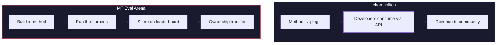

# MT Eval Arena

> **エグゼクティブサマリー。** MT Eval Arena は機械翻訳手法のためのオープンなベンチマークプラットフォームです。商用 MT が存在しない、または独立した検証が行われていない言語を重点的に対象としています。標準化された評価、公開リーダーボード、そして champollion を通じた本番環境へのデプロイメントブリッジを提供します。先住民族の言語については、実証された手法の所有権がコミュニティに移転されます。

機械翻訳手法のためのオープンな実証の場です。特に、商用 MT が存在しない、または独立した検証が行われていない言語を対象としています。

手法を構築し、ベンチマークを実施し、有効性を証明してください。勝利した手法はデプロイされます。

---

## 問題の背景

Google Translate は約 130 言語に対応しています。Meta の NLLB-200 は約 200 言語、OMT-1600（2026 年 3 月）は 1,600 言語に対応すると主張しています。地球上では 7,000 以上の言語が話されています。OMT-1600 の最低リソース層に該当する約 1,300 言語については、モデルの重みが公開されておらず、品質は実用水準を下回っており、評価には聖書ドメインのテキストと標準的な機械メトリクスが使用されました。形態論的な検証、独立したテスト、コミュニティガバナンスはいずれも行われていません。残りの約 5,400 言語については、いかなる事前学習済みモデルも出力を生成しません。

Big Tech は低リソース言語（LRL）のカバレッジへの投資を進めています。しかし、独立した品質検証、形態論的検証、またはコミュニティガバナンスを伴わないカバレッジは、信頼のないカバレッジに過ぎません。翻訳ツールを最も必要としている話者こそ、そのツールが構築される可能性が最も低いコミュニティです。

**Arena はその状況を変えるために存在します。** あらゆる言語の翻訳手法を開発・評価・デプロイするためのインフラを提供します。再現可能なスコアリング、オープンな投稿、そして結果の管理権に関するコミュニティガバナンスを備えています。

---

## 仕組み

1. **翻訳手法を構築します** — コーチング済み LLM、ファインチューニング済みモデル、FST ゲートパイプライン、またはその他の翻訳を生成するあらゆる手法。
2. **ハーネスがベンチマークを実施します** — 標準化されたメトリクス（chrF++、完全一致、FST 受理）を使用し、特定の Git コミットにフィンガープリントされます。
3. **結果がリーダーボードに表示されます** — すべての投稿は再現可能かつ比較可能です。
4. **勝利した場合、所有権が移転されます** — 先住民族の言語については、勝利した手法のコードがコミュニティガバナンス組織に移転されます。
5. **手法が本番環境にデプロイされます** — [champollion](https://champollion.dev)（開発者向け API）を通じて行われます。収益はコミュニティに還元されます。

**ここで証明し、そこでデプロイする。**

---

## 対象ユーザー

| あなたは... | Arena が提供するもの... |
|---|---|
| **ML エンジニア / 研究者** | 標準化されたベンチマーク、再現可能なスコアリング、競争できるリーダーボード |
| **言語学者** | 文法規則や辞書をテスト可能な手法に変換するためのフレームワーク |
| **言語コミュニティのメンバー** | 自言語の手法の開発とデプロイに関するガバナンス |
| **資金提供者 / 助成金審査者** | 翻訳研究提案を評価するための透明で再現可能なメトリクス |
| **学生** | 実際のインパクトを持つオープンなチャレンジ — 手法を構築し、スコアを投稿する |

---

## 現在のベンチマーク

### EDTeKLA 開発セット v1
- **言語ペア:** 英語 → 平原クリー語（SRO）
- **エントリー数:** 548 件のキュレーション済みペア（教科書 486 件 + ゴールドスタンダード 62 件）
- **ライセンス:** CC BY-NC-SA 4.0
- **出典:** [EdTeKLA 研究グループ](https://spaces.facsci.ualberta.ca/edtekla/)、アルバータ大学

### FLORES+ Devtest
- **言語ペア:** 英語 → 39 言語
- **エントリー数:** 言語ごとに 1,012 文
- **ライセンス:** CC BY-SA 4.0
- **出典:** [OLDI](https://huggingface.co/datasets/openlanguagedata/flores_plus)

---

## 唯一のルール

:::danger 評価データでの学習禁止
評価データセットに触れた手法 — 学習データ、few-shot の例、辞書エントリー、またはプロンプト素材として使用した場合 — は**失格**となります。ファインチューニングは自由に行ってください。ただし、テストセットは使用しないでください。
:::

---

## 次のステップ

- **[手法を投稿する](/docs/getting-started/submit-a-method)** — 最初のベンチマーク実行を投稿する方法
- **[ベンチマーク仕様](/docs/specifications/benchmark)** — 実験プロトコルの全詳細
- **[リーダーボードのルール](/docs/leaderboard/rules)** — 投稿基準および不正防止ポリシー
- **[データ主権](/docs/sovereignty/data-sovereignty)** — OCAP、CARE、および所有権移転が重要な理由
- **[経済モデル](/docs/sovereignty/economic-model)** — Arena のスコアがコミュニティの収益になる仕組み

**[→ リーダーボードを見る](https://champollion.dev/leaderboard)**