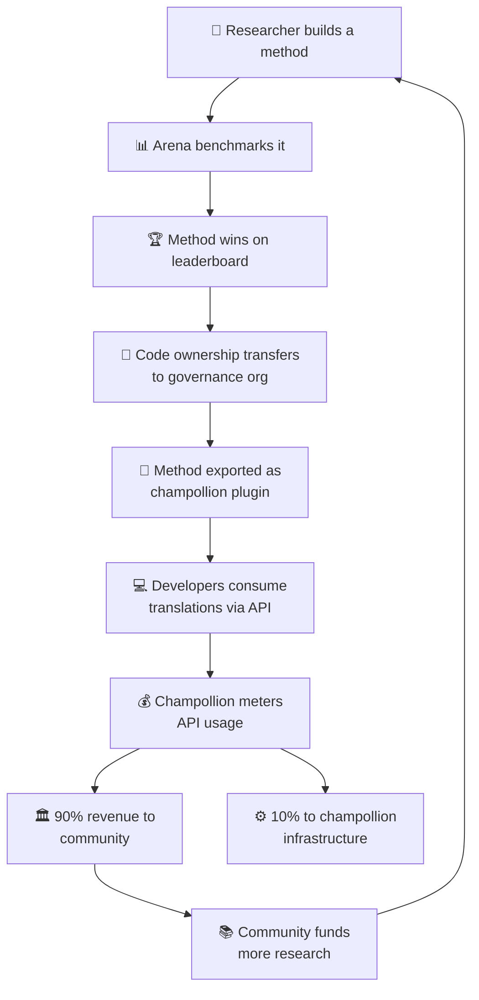

# 経済モデル

> **エグゼクティブサマリー。** このページでは、ArenaとChampollionを結ぶ経済的なループについて説明します。研究がメソッドを生み出し、メソッドがプラグインとしてデプロイされ、APIの利用が収益を生み出し、収益の90%が言語コミュニティに還元されます。フライホイールの仕組み、収益の分配、コンビニエンスレイヤー、および資金提供者向けの持続可能性についても取り上げます。

ArenaとChampollionは閉じた経済的ループを形成しています。Arena上の研究がメソッドを生み出し、メソッドはChampollionを通じてデプロイされ、Champollionからの収益はそのメソッドが対象とする言語のコミュニティへと還元されます。

---

## フライホイール

フライホイールが一回転するたびに、エコシステムが強化されます。
- **研究の拡大**により、より優れたメソッドが生まれます
- **優れたメソッド**は、より多くの開発者を引き付けます
- **開発者の増加**により、APIの収益が増加します
- **収益の増加**により、コミュニティ主導の研究がさらに促進されます

---

## 収益の流れ

開発者がChampollion APIを通じてコミュニティが所有するメソッドを利用する場合：

| ステップ | 内容 |
|---|---|
| 開発者が`champollion sync`またはREST APIを呼び出す | コミュニティが所有するメソッドによって翻訳が生成される |
| ChampollionがAPIコールを計測する | リクエストごと、言語ペアごとに使用量が追跡される |
| 収益が分配される | **90%**はメソッドを所有するガバナンス組織に支払われる。**10%**はChampollionのインフラコストに充てられる。 |
| コミュニティが配分を決定する | 収益は言語プログラム、さらなる研究、コミュニティリソースなど、ガバナンス組織が決定した用途に充てられる |

### コンビニエンスレイヤー

Champollionは、一般的なメソッドに対して最適化された設定も提供しています。ある研究者が、特定のコーチングデータと温度設定を用いたGemini 2.5 Proがある言語ペアに対して最良の結果をもたらすことを証明した場合、その設定はChampollion APIを通じてあらかじめ構築されたプリセットとして利用できます。開発者は研究を再現する必要はなく、APIを呼び出すだけで済みます。

Arenaがベースラインを確立し、Champollionがそれをアクセス可能にします。コミュニティはその両方から恩恵を受けます。

---

## 標準言語について

フライホイールの効果が最も大きいのは、所有権の移転とコミュニティ収益モデルが適用される先住民言語および低リソース言語です。

標準言語（フランス語、日本語、スペイン語など）については、Champollionはガバナンスレイヤーなしで同様のAPIの利便性を提供します。開発者は事前設定された翻訳メソッドへの従量制アクセスに対して料金を支払い、Champollionはインフラコストの一部を受け取ります。

---

## 資金提供者の方へ

この経済モデルは、言語技術の資金調達においてよく見られる懸念、すなわち**助成金終了後の持続可能性**に対処するものです。

| 従来のモデル | Arenaモデル |
|---|---|
| 助成金が研究に資金を提供する | 助成金が研究に資金を提供する |
| 論文が発表される | メソッドが本番環境にデプロイされる |
| 助成金が終了し、ツールが放棄される | APIの収益が運営を持続させる |
| コミュニティは何も受け取らない | コミュニティが資産を所有し、収益を得る |

一つの成功したメソッドが、自己持続的な収益源を生み出します。資金提供者は、論文数だけでなく、以下の指標でも影響を測定できます。
- APIの利用状況（何人の開発者がそのメソッドを使用しているか）
- 生成された収益（コミュニティにどれだけの資金が流れているか）
- 品質指標（時系列でのリーダーボードスコア）
- 言語カバレッジ（何言語ペアに対応しているか）

詳細なコストモデルについては、[ベンチマーク仕様](/docs/specifications/benchmark)の§10を参照してください。

---

## 関連情報

- [所有権の移転](/docs/sovereignty/ownership-transfer) — 法的・技術的な移転プロセス
- [データ主権](/docs/sovereignty/data-sovereignty) — OCAP、CARE、およびTe Mana Raraunga原則
- [リーダーボードのルール](/docs/leaderboard/rules) — メソッドがデプロイの資格を得るための条件