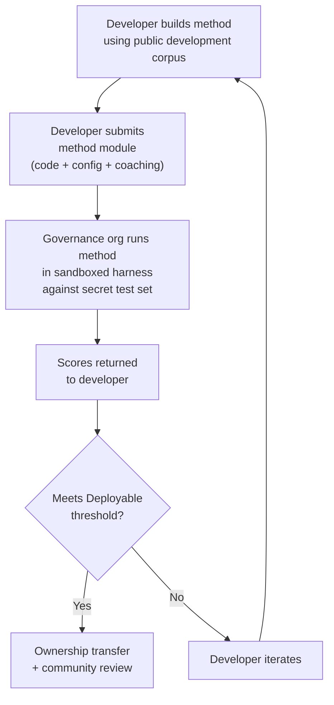

# ベンチマーク仕様

> **エグゼクティブサマリー。** 本ドキュメントは、Champollion MT評価エコシステムの評価プロトコルを定義します。対象範囲：コーパスフォーマット（§2）、ランカードスキーマ（§3）、ベンチマークプロトコル（§6）、人間による検証要件（§7）、主権メカニズム（§8）、リーダーボードと提出モデル（§9）、コストフレームワーク（§10）、新言語への拡張（§11）。メトリクスの定義、composite scoreの重み付け、品質ティアの閾値、コスト・速度メトリクスの計算式については、すべてのスコアリングロジックの唯一の情報源である`SCORING_SPEC.md`を参照してください。本ドキュメントはそれらの詳細を重複して記載せず、SCORING_SPECを参照します。
>
> 最終更新：2026-06-07

---

## 1. 原則

### 1.1 自動メトリクスはプロキシである

本ドキュメントで定義するすべてのメトリクスは機械的に計算されます。chrF++、FST受理率、形態論的精度、意味的類似度——これらはすべて翻訳品質の自動プロキシです。高速な反復、体系的な比較、回帰の検出に有用ですが、**人間の判断の代替にはなりません**。

評価の階層：

```
Automated metrics (run cards, benchmarks)
    ↓ proxy for
Human review (bilingual speakers validate output)
    ↓ proxy for
Actual utility (does this help a language community?)
```

どれほど高い自動スコアであっても、流暢な話者が出力を読んで正確・自然・文化的に適切であることを確認する作業の代わりにはなりません。§5で定義する品質ティアは、自動composite scoreに対するヒューリスティックなラベルです——進捗の追跡には有用ですが、それだけでは決して十分ではありません。

### 1.2 モデルではなく、メソッドを評価する

私たちは**メソッド**をベンチマークします。モデルではありません。モデルは一つの構成要素です。メソッドとは完全なレシピです：モデルの選択、プロンプト設計、ツールの使用、前処理・後処理、コーチングデータ、リトライ戦略、そのすべてを含みます。同じモデルを使っても、異なるメソッドを用いる2つのチームは異なるスコアを得ます。それがこの評価の意図するところです。

### 1.3 再現性

すべてのベンチマーク結果は再現可能でなければなりません。ランカード（§3）は実験の完全な設定を記録します。フィンガープリント（§3.5）は実験セットアップを識別します。ランカードハッシュ（§3.6）は結果の完全性を検証します。同じメソッド、コーパス、設定を持つ誰もが、±2%以内のスコアを達成できるはずです（温度>0でのLLMサンプリングの非決定性を考慮）。

### 1.4 合成評価データの不使用

**本プロジェクトは合成評価データを生成・使用・推奨しません。** すべてのコーパスは、真に人間が著した文章——出版された翻訳、教科書、バイリンガル文書、または流暢な話者から引き出した翻訳——から取得しなければなりません。

LLMが支援できる作業：
- 文のアライメント（既存のバイリンガルテキストにおける対訳箇所の発見）
- フォーマット変換（出版物をコーパススキーマに変換）
- メタデータの充実（難易度ティア、レジスターラベルの提案）
- 人間が翻訳するためのソース文の提案（§11.3——翻訳ステップは常に人間が行う）

LLMは参照訳や評価ペアを**絶対に生成してはなりません**。

**私たちはトレーニングデータについては開発者中立の立場をとります。** メソッド開発者が合成トレーニングデータ、逆翻訳、またはデータ拡張をメソッドに使用することは、その開発者の選択です——私たちはトレーニングプロセスではなく、出力を評価します。MetaのOMT-1600は逆翻訳によって生成された約2億7000万の合成対訳文を使用しています。このような方法でトレーニングされたメソッドに異議はありません。私たちは人間によるキュレーションのみでテストします。

> **なぜ聖書テキストを評価に使わないのか？** OMT-1600は1,600言語中1,560言語を聖書ドメインのテキストで評価しています。聖書の翻訳は古風なレジスター、典礼的な語彙、定型的な文構造を持っています。私たちの評価コーパスは、コミュニティがキュレーションした多様なドメインのテキスト——医療、法律、教育、行政、会話、技術ドメイン（§2.7参照）——から取得しています。これは意図的な設計上の選択です。コミュニティが実際に生活し働くドメインでの翻訳を必要としており、単一の宗教的レジスターではありません。創世記1:1で高スコアを出すメソッドが、バンドカウンシルの議題やクリニックの受付フォームでのパフォーマンスについてほとんど何も教えてくれないのです。

---

## 2. コーパススキーマ

コーパスとは、構造化されたメタデータを持つ対訳テキストペアのキュレーションされたセットです。すべてのメソッドが測定される基準となるグラウンドトゥルースです。

### 2.1 データセットエンベロープ

コーパスファイルのトップレベル構造：

```json
{
  "dataset": {
    "id": "edtekla-dev-v1",
    "version": "1.0",
    "language_pair": "EN→CRK",
    "source_language": "en",
    "target_language": "crk",
    "created": "2026-05-01",
    "license": "CC-BY-NC-SA-4.0",
    "provenance": ["gold_standard", "textbook"]
  },
  "entries": [ ... ]
}
```

| フィールド | 型 | 必須 | 説明 |
|-------|------|----------|-------------|
| `id` | string | ✅ | 一意のデータセット識別子。ランカードとリーダーボードで使用 |
| `version` | string | ✅ | セマンティックバージョン。インクリメントすると以前のランカードとの比較が無効になる |
| `language_pair` | string | ✅ | 表示ラベル（例：`EN→CRK`） |
| `source_language` | string | ✅ | BCP 47ソース言語コード |
| `target_language` | string | ✅ | BCP 47ターゲット言語コード |
| `created` | string | ✅ | ISO 8601作成日 |
| `license` | string | ✅ | SPDXライセンス識別子 |
| `provenance` | string[] | ✅ | エントリ全体で使用される出典タグのリスト |

### 2.2 エントリスキーマ

コーパスの各エントリは一つの翻訳チャレンジを表します：

```json
{
  "id": 42,
  "source": "I see the dog",
  "reference": "niwâpamâw atim",
  "segment": "gold_standard",
  "difficulty": 2,
  "provenance": "gold_standard",
  "register": "conversational",
  "context": "declaration",
  "morphological_analysis": "ni-wâpam-âw atim | 1sg-see.TA-3sg.DIR dog.AN",
  "notes": "Animate noun (atim); direct form because speaker is proximate",
  "variant_class": "simple-ta-direct"
}
```

| フィールド | 型 | 必須 | 説明 |
|-------|------|----------|-------------|
| `id` | integer | ✅ | コーパス内の一意の識別子 |
| `source` | string | ✅ | ソース言語のソーステキスト |
| `reference` | string | ✅ | ターゲット言語のゴールドスタンダード参照訳 |
| `segment` | string | 📎 | コーパスのパーティション：`gold_standard`、`held_out`、`development`、または`diagnostic` |
| `difficulty` | integer | 📎 | 難易度評価1〜5（§2.4参照） |
| `provenance` | string | 📎 | このエントリの出典（§2.5参照） |
| `register` | string | 📎 | レジスター・丁寧さのレベル（§2.6参照） |
| `context` | string | 📎 | コミュニケーション機能（§2.6参照） |
| `domain` | string | 📎 | 16コード分類法によるユースケースドメイン（§2.7参照）。次のいずれかでなければならない：`conv`、`ecommerce`、`edu`、`financial`、`gov`、`legal`、`literary`、`marketing`、`medical`、`news`、`religious`、`scientific`、`subtitles`、`support`、`tech`、`ui`。構築時に検証される。 |

> **📎 = 推奨。** ハーネスはデフォルト値によってオプションフィールドの欠落を適切に処理します。サードパーティのコーパスはエントリごとに`id`、`source`、`reference`のみを提供すれば十分です。
| `morphological_analysis` | string | ❌ | ゴールドスタンダードの形態論的分解 |
| `notes` | string | ❌ | 翻訳者注記、方言的変形、曖昧性フラグ |
| `variant_class` | string | ❌ | 許容可能な翻訳バリアントをグループ化するクラスラベル |


### 2.3 コーパスセグメント

コーパスはアクセスレベルの異なるセグメントに分割されます：

| セグメント | 目的 | アクセス | 最小サイズ |
|---------|---------|--------|-------------|
| `development` | メソッドの開発と反復。開発者が自由に使用できる。 | **公開** | 30エントリ |
| `diagnostic` | 特定の言語現象に対するターゲットテスト。 | **公開** | 10エントリ |
| `gold_standard` | 公式ベンチマーク評価。リーダーボードのスコアはここから算出される。 | **秘密** — ガバナンス組織が保持 | 50エントリ |
| `held_out` | 将来の評価のために予約。有効化されるまで使用しない。 | **秘密** — ガバナンス組織が保持 | 10エントリ |

> **現在の状態：** 出荷済みデータセットには`development`セグメントのみが存在します。`diagnostic`、`gold_standard`、`held_out`セグメントはコーパスの成長に伴う将来の使用のために定義されています。

`gold_standard`および`held_out`セグメントは完全に秘密です。ソース文と参照訳の両方がガバナンス管理のインフラストラクチャ上に保持されます。メソッド開発者は問題も答えも見ることができません。主権メカニズムについては§8を参照してください。

### 2.4 難易度ティア

| ティア | 説明 | 例 |
|------|-------------|----------|
| 1 — 基本語彙 | 単語、一般的な挨拶、数字 | "hello" → "tânisi"、"dog" → "atim" |
| 2 — 単純な文 | 主語-動詞またはSVO、現在時制 | "I see the dog" → "niwâpamâw atim" |
| 3 — 中程度の複雑さ | 過去・未来時制、所有格、生物性 | "I saw his dog yesterday" |
| 4 — 複雑な形態論 | 遠称、受動態、接続法語順、関係節 | "the woman whose son went to the store" |
| 5 — 上級 | 複数節、正式なレジスター、儀礼的、慣用的 | 適切なレジストーンを持つ完全な段落 |

適切に構築されたコーパスは、5つの難易度ティアすべてにわたるエントリを含み、実際の翻訳課題の大部分が該当するティア2〜4に重点を置くべきです。

### 2.5 出典タグ

すべてのエントリはその出典を示さなければなりません：

| タグ | 意味 |
|-----|---------|
| `gold_standard` | 流暢な話者によって検証済み |
| `textbook` | 出版された教育資料から取得 |
| `elicited` | 構造化された引き出しセッションを通じて作成 |
| `corpus` | 対訳コーパスから抽出 |

> **注記：** 実際には、出典の値は自由形式の文字列です。上記のタグは規約であり、検証済みの列挙型ではありません——データセットは他の説明的な出典文字列を使用することができます。

### 2.6 レジスターとコンテキスト

**レジスター**は丁寧さと社会的文脈を表します：

| レジスター | 説明 |
|----------|-------------|
| `conversational` | 対等な者同士の日常会話 |
| `formal` | 公式または制度的な言語 |
| `technical` | 専門分野固有の語彙 |
| `ceremonial` | 伝統的または神聖な言語使用 |
| `educational` | 言語教育教材 |

**コンテキスト**はコミュニケーション機能を表します：

> 🔲 **計画中。** `context`フィールドはスキーマで定義されていますが、現在のデータセットにはまだ入力されていません。将来のコーパス充実のために予約されています。

| コンテキスト | 説明 |
|---------|-------------|
| `greeting` | 社交的な挨拶または別れの言葉 |
| `declaration` | 事実の陳述 |
| `question` | 疑問文 |
| `instruction` | 命令または指示 |
| `narrative` | 物語または描写 |
| `label` | UIラベル、ボタンテキスト、または見出し |
| `error` | エラーメッセージまたは警告 |

### 2.7 ドメイン {#27-domain}

**ドメイン**は実際のユースケース——翻訳されるコンテンツの種類——を表します。これはレジスターやコンテキストとは直交する概念です：

- **レジスター**が答える問い：*これはどの程度フォーマルか？*
- **コンテキスト**が答える問い：*この文は何をしているか？*
- **ドメイン**が答える問い：*これはどの業界・ユースケース向けか？*

法的契約書（ドメイン：`legal`）はフォーマル（レジスター：`formal`）で宣言文（コンテキスト：`declaration`）を含む場合があります。法律チャットボットのトランスクリプト（ドメイン：`legal`）は会話的（レジスター：`conversational`）で質問（コンテキスト：`question`）を含む場合があります。同じドメインでも、レジスターとコンテキストは異なります。

| ドメインコード | 説明 | 主な利用者 |
|-------------|-------------|-------------------|
| `ui` | ソフトウェアインターフェース文字列 | アプリ開発者、ローカライゼーションチーム |
| `legal` | 契約書、法令、裁判所提出書類、入国管理書類 | 法律事務所、裁判所、コンプライアンスチーム、IP弁護士 |
| `medical` | 臨床記録、薬品ラベル、患者向けコミュニケーション、治験プロトコル | 病院、製薬会社、臨床試験、患者ポータル |
| `financial` | 銀行業務、保険、規制当局への提出書類、監査報告書 | 銀行、保険会社、規制当局、監査人 |
| `edu` | 教科書、カリキュラム、授業計画、学術資料 | 学校、大学、教科書出版社 |
| `ecommerce` | 商品説明、レビュー、マーケットプレイスの出品情報 | オンライン小売業者、マーケットプレイス出品者 |
| `marketing` | 広告コピー、ブランドメッセージ、キャンペーン、スローガン | 広告代理店、ブランドチーム |
| `gov` | 政策文書、規制、公告、法律 | 政府機関、コンプライアンスチーム |
| `scientific` | 研究論文、要旨、方法論、研究助成金申請書 | 研究者、学術誌、助成機関 |
| `religious` | 聖典、典礼テキスト、神学的解説 | 信仰コミュニティ、典礼出版社 |
| `support` | FAQ、エラーメッセージ、トラブルシューティングガイド、チャットボットスクリプト | SaaS企業、ヘルプデスク |
| `subtitles` | 映画、TV、ストリーミング、ゲームのセリフ | ストリーミングプラットフォーム、スタジオ、ゲーム会社 |
| `news` | ジャーナリズム、通信社レポート、社説、プレスリリース | メディア組織、通信社 |
| `literary` | フィクション、詩、物語、文化的テキスト | 出版社、文化保存組織 |
| `conv` | 非公式な会話、ソーシャルメディア、メッセージング | コンシューマーアプリ、ソーシャルプラットフォーム |
| `tech` | APIドキュメント、マニュアル、エンジニアリング仕様書、技術ガイド | ドキュメントチーム、エンジニアリング組織 |

> **ドメイン固有のベンチマーク。** 一般ベンチマークはすべてのドメインにわたってメソッドを評価します。しかしArenaは**ドメインフィルタリングされたベンチマーク**もサポートしています——特定のドメインにタグ付けされたエントリのみでスコアを計算します。これにより、「フランス語への法的文書翻訳に最適なメソッドはどれか？」対「フランス語の総合スコアが最も高いメソッドはどれか？」という問いに答えることができます。
>
> ドメインフィルタリングされたリーダーボードランキングは主要なプロダクト機能です。メソッドによってドメインごとのパフォーマンスは異なります——法律用語でファインチューニングされたメソッドは法律ベンチマークで優れた成績を収めるかもしれませんが、会話テキストでは劣る場合があります。Arenaはユーザーが特定のユースケースに最適なソリューションを見つけるのを支援します。

> **将来：Arenaチャットボット。** ArenaウェブサイトにはMTのユースケース（ドメイン、言語ペア、品質要件）を説明するとリーダーボードからコミュニティ検証済みの最適なメソッドを推薦する会話型アシスタントが含まれる予定です。例：「英語から日本語への臨床試験プロトコルの翻訳が必要です——医療ドメインのEN→JAベンチマークで最高スコアのメソッドはどれですか？」これは十分なドメインタグ付き評価データとメソッドの多様性があることが前提です。

---

## 3. ランカードスキーマ {#3-run-card-schema}

ランカードは評価の最小単位です。単一の評価ランの完全な設定と結果を記録する自己完結型のJSONドキュメントです：1つのメソッド、1つのモデル、1つの設定、1つのデータセット。

すべてのランカードは3つの次元を記録します：
- **品質** — 翻訳はどの程度優れているか？
- **コスト** — 翻訳の生成にいくらかかったか？
- **速度** — どのくらい時間がかかったか？

### 3.1 トップレベルフィールド

| フィールド | 型 | 説明 |
|-------|------|-------------|
| `run_id` | string | ランの開始時に生成されるUUID v4 |
| `harness_version` | string | ハーネスのセマンティックバージョン（例：`2.0`） |
| `timestamp` | string | ランが開始されたISO 8601 UTCタイムスタンプ |
| `elapsed_seconds` | number | ラン全体のウォールクロック時間 |

### 3.2 メソッド設定

これらのフィールドは実験セットアップを定義します——何をどのようにテストしたか。

| フィールド | 型 | 必須 | 説明 |
|-------|------|----------|-------------|
| `model_slug` | string | ✅ | モデル識別子（例：`google/gemini-2.5-flash`） |
| `model_id` | string | ❌ | APIが返す解決済みモデル識別子 |
| `condition` | string | ✅ | 実験ラベル（例：`baseline`、`coached-v3`、`few-shot`） |
| `temperature` | number | ✅ | サンプリング温度 |
| `system_prompt_sha256` | string | ✅ | 完全なシステムプロンプトのSHA-256ハッシュ |
| `system_prompt_used` | string | ✅ | 完全なシステムプロンプトテキスト |
| `coaching_data_sha256` | string | ❌ | 使用した場合、コーチングデータファイルのSHA-256ハッシュ |
| `fst_version` | string | ❌ | 使用した場合、FSTアナライザーのバージョン |
| `tools_enabled` | string[] | ❌ | メソッドが利用可能なツールのリスト |
| `batch_size` | number | ❌ | 並行APIバッチあたりのエントリ数 |
| `max_retries` | number | ❌ | 該当する場合、FST拒否に対する最大リトライ回数 |

:::info 公開ランカードにはmethod_configが含まれる
ランカードがリーダーボードに公開される（`mt-eval publish`経由）と、正規の8フィールドMethodConfig（`model`、`temperature`、`batchSize`、`register`、`coachingFile`、`coachingPrompt`、`promptContext`、`qualityTier`——すべてcamelCase）を含む`method_config`ブロックも含まれます。これによりゼロ再構築インポートが可能になります：`champollion leaderboard --install`は`method_config`を直接読み取り、プラグインマニフェストとして書き込みます。上記のテレメトリフィールド（§3.2）はハーネスが観測した内容を記録し、`method_config`は開発者が意図した内容を記録します。
:::

### 3.3 データセット参照

| フィールド | 型 | 説明 |
|-------|------|-------------|
| `dataset.id` | string | データセット識別子 |
| `dataset.version` | string | データセットバージョン |
| `dataset.language_pair` | string | 表示ラベル |
| `dataset.sha256` | string | データセットファイル内容のSHA-256ハッシュ |
| `dataset.entry_count` | number | 評価されたエントリ数 |

データセットのSHA-256はデータの特定バージョンに結果を固定します。データセットが変更された場合、古いランカードとの比較はできません。

### 3.4 スコア（品質）

ラン全体の集計メトリクス。すべての品質メトリクスは**自動計算**です——§1.1参照。

| フィールド | 型 | 説明 |
|-------|------|-------------|
| `scores.total` | number | 評価されたエントリの総数 |
| `scores.exact_matches` | number | 出力が参照と完全一致したエントリ数 |
| `scores.exact_match_rate` | number | 0.0〜1.0 |
| `scores.equivalent_matches` | number | 許容可能なバリアントと一致したエントリ数 |
| `scores.equivalent_match_rate` | number | 0.0〜1.0 |
| `scores.fst_accepted` | number | FSTアナライザーに受理されたエントリ数 |
| `scores.fst_acceptance_rate` | number | 0.0〜1.0、FSTが設定されていない場合は`null` |
| `scores.morphological_accuracy` | number | 0.0〜1.0、ゴールドスタンダード分析がない場合は`null` |
| `scores.chrf_plus_plus` | number | コーパスレベルのchrF++スコア（0〜100） |
| `scores.semantic_score` | number | 埋め込みベースの意味的類似度（0.0〜1.0） |
| `scores.ter` | number | Translation Edit Rate（0〜∞、低いほど良い） |
| `scores.length_ratio` | number | avg(len(predicted)/len(reference))、理想値=1.0 |
| `scores.code_switching_rate` | number | 0.0〜1.0、ソース言語の漏れが検出されたエントリの割合 |
| `scores.hallucination_rate` | number | 0.0〜1.0、幻覚コンテンツが検出されたエントリの割合 |
| `scores.terminology_adherence` | number | 0.0〜1.0、用語集用語への準拠（用語集がない場合は`null`） |
| `scores.tokens_per_second` | number | total_tokens / elapsed_seconds |
| `scores.entries_per_minute` | number | 1分あたりの翻訳エントリ数 |
| `scores.composite` | number | 加重composite score（0.0〜1.0）。SCORING_SPEC §4参照 |
| `scores.errors` | number | 失敗したエントリ数（APIエラー、タイムアウト等） |
| `scores.by_difficulty` | object | 難易度ティア別のスコア内訳 |
| `scores.by_provenance` | object | 出典タグ別のスコア内訳 |
| `scores.by_domain` | object | ✅ 実装済み — ドメイン別のスコア内訳（§2.7）。ドメインフィルタリングされたリーダーボードランキングを可能にする。tester.pyで計算され、publish.pyを通じて渡される。 |

### 3.5 合計（コスト）

| フィールド | 型 | 説明 |
|-------|------|-------------|
| `totals.prompt_tokens` | number | すべてのAPI呼び出しにわたる入力トークンの合計 |
| `totals.completion_tokens` | number | 出力トークンの合計 |
| `totals.reasoning_tokens` | number | 思考連鎖に使用されたトークン（ほとんどのモデルでは0） |
| `totals.cached_tokens` | number | プロバイダーのプロンプトキャッシュから提供されたトークン |
| `totals.total_cost_usd` | number | USD単位の総コスト |
| `totals.cost_per_entry_usd` | number | `total_cost_usd / entry_count` |
| `totals.cost_per_source_char` | number | ソース文字あたりのUSD——言語間で比較可能 |

### 3.6 タイミング（速度）

| フィールド | 型 | 説明 |
|-------|------|-------------|
| `elapsed_seconds` | number | ラン全体のウォールクロック時間（トップレベル） |
| `scores.avg_latency_seconds` | number | エントリあたりの平均応答時間 |
| `scores.median_latency_seconds` | number | エントリあたりの中央値応答時間 |
| `scores.p95_latency_seconds` | number | エントリあたりの応答時間の第95パーセンタイル |

### 3.7 エントリごとの結果

`results[]`配列の各エントリは1つの翻訳を記録します。エントリごとのデータは`run_card_entries`テーブル（マイグレーション005）に非正規化されたLYSSベルディクト（マイグレーション006）とともに永続化されます。

| フィールド | 型 | 説明 |
|-------|------|-------------|
| `entry_id` | string | コーパスの`entries[].id`と一致 |
| `source` | string | 翻訳されたソーステキスト |
| `expected` | string | ゴールドスタンダード参照訳 |
| `raw_predicted` | string \| null | 後処理前の生のモデル出力 |
| `predicted` | string | メソッドの実際の出力（後処理済み） |
| `segment` | string | セグメント識別子（例：文インデックス） |
| `difficulty` | string \| null | コーパスからの難易度ティア |
| `domain` | string | コーパスからのドメインタグ（§2.7） |
| `exact_match` | boolean | 出力が参照と完全一致したかどうか |
| `chrf_score` | number \| null | 文レベルのchrF++（0〜100） |
| `bleu_score` | number \| null | 文レベルのBLEU（0〜100） |
| `latency_s` | number \| null | 応答時間（秒） |
| `cost_usd` | number \| null | このエントリのコスト（USD） |
| `tool_call_count` | integer | 使用されたツール呼び出し数（なければ0） |
| `error` | string \| null | このエントリが失敗した場合のエラーメッセージ |
| `plugin_metrics` | object | エントリごとの完全なプラグイン出力（JSONB） |
| `fst_valid` | boolean \| null | GiellaLT FSTが予測を受理した（非正規化LYSS-fst） |
| `equivalent_match` | boolean \| null | CRKリンターが構造的等価性を確認した（非正規化LYSS-eq） |
| `semantic_verdict` | string \| null | LYSS-semベルディクト：`VALID`、`MISMATCH`、`UNKNOWN`、`ERROR` |
| `code_switching_detected` | boolean \| null | 出力にソース言語のトークンが検出された |
| `hallucination_detected` | boolean \| null | 出力に捏造コンテンツが検出された |


### 3.8 フィンガープリント

再現性識別子。同一のフィンガープリントを持つ2つのランは同じ実験セットアップを使用しています。

フィンガープリントは以下のソートされた連結のSHA-256ハッシュです：
- `dataset.sha256`
- `model_slug`
- `condition`
- `system_prompt_sha256`
- `temperature`
- `harness_version`
- `batch_size`
- `tools_enabled`

> **なぜ8つの構成要素なのか？** バッチサイズとツール呼び出しは出力品質に実質的な影響を与えるため、識別子に含める必要があります。バッチサイズが異なる、またはツールの有効化が異なる2つのランは、他のすべてのパラメータが一致していても、異なる実験セットアップです。

同一のフィンガープリントを持つ2つのランは比較可能な結果を生成するはずです。差異はAPIの非決定性（温度>0）またはプロバイダー側のモデル更新によるものです。

### 3.9 ランカードハッシュ

ランカードJSON全体のSHA-256ハッシュ（ハッシュ計算中は`run_card_hash`フィールド自体を`""`に設定）。これは改ざん検出のシールです。いずれかのフィールドが変更されると、ハッシュが壊れます。

---

## 4. 自動メトリクス

このセクションのすべてのメトリクスは機械的に計算されます。§1.1参照。

### 4.1 メトリクスの定義

| メトリクス | ステータス | 測定対象 | 範囲 |
|--------|--------|-----------------|-------|
| **chrF++** | ✅ 実装済み | 文字n-gramのFスコア。文字レベルで動作するため、単語が長く高度に活用される形態論的に豊かな言語では、単語レベルのメトリクス（BLEU）よりも堅牢です。sacrebleuで計算。 | 0〜100（ネイティブスケール）。composite使用時は100で除算。 |
| **FST受理率** | ✅ 実装済み | 形態素解析器（GiellaLT HFST）によってターゲット言語の有効な形式として受理された予測単語の割合。FSTが受理した単語は実在する構造的に有効な単語であり、幻覚ではありません。 | 0.0〜1.0 |
| **完全一致** | ✅ 実装済み | Unicode正規化後に参照と完全一致した予測の割合。厳格だが明確——上限チェックとして有用。 | 0.0〜1.0 |
| **形態論的精度** | 🔲 計画中 | ゴールドスタンダードの形態論的分析があるエントリについて：正しく生成された形態素の割合。FST受理よりも細粒度——単語はFST有効でも形態素構造が誤っている場合がある（語根は正しいが時制が誤り）。 | 0.0〜1.0 |
| **等価一致** | ⚡ 部分実装 | 語順、方言的差異、正書法的慣習を考慮した参照の許容可能なバリアントと一致した割合。現在CRKについてはCRK eval standardの`CrkLinterMetric`（`eval_standards/crk/`内）経由で実装済み；CRK言語カードの`evalMetrics`宣言経由で自動的に読み込まれる。汎用実装にはコーパス内のエントリごとの`variants[]`が必要。 | 0.0〜1.0 |
| **意味スコア** | ⚡ 部分実装 | 表層形式に関わらない意味の保持。現在CRKについてはCRK eval standardの`CrkSemanticMetric`（`eval_standards/crk/`内、ベルディクト加重プロキシ）経由で実装済み。汎用的な埋め込みベースのコサイン類似度は計画中——SCORING_SPEC §2.3参照。 | 0.0〜1.0 |

### 4.2 Composite Score

composite scoreは*利用可能な*すべてのメトリクスの加重平均です：

```
composite = Σ (weight_i × metric_i)   for all available metrics
             ─────────────────────
             Σ weight_i              (renormalized to sum to 1.0)
```

メトリクスが利用不可能な場合（FSTが設定されていない、バリアントクラスが定義されていない、埋め込みモデルがない）、その重みは残りのメトリクスに比例して再配分されます。これにより、composite scoreは常に言語内で比較可能です——その言語で利用可能なメトリクスを使用し、それに応じて正規化します。

**重みテーブル、入力正規化ルール、完全なメトリクスインベントリは`SCORING_SPEC.md` §4で定義されています。** そのドキュメントは以下のSSOTです：
- プロファイルAの重み（FST対応言語——9メトリクス、構造メトリクスが40%を占める）
- プロファイルBの重み（FST非対応言語——8メトリクス）
- 正規化ルール（chrF++ ÷ 100、コードスイッチングと幻覚率の反転）
- compositeから除外されるメトリクス（BLEU、COMET、TER、長さ比率、一貫性）とその理由

ハーネスコードはこれらのテーブルを`mt_eval_harness/scoring.py`に反映しています。SCORING_SPECが変更された場合、`scoring.py`が一致するように更新され、`test_scoring_ssot.py`がアライメントを検証します。

> **なぜBLEUではないのか？** BLEUは単語レベルで動作し、形態論的変形にペナルティを課します。多合成語言語では、1つの単語が節全体になり得ます——BLEUは軽微な活用の差異を完全なミスとして扱います。chrF++は文字レベルで動作することでこれをより適切に処理します。BLEUは両方の重みテーブルから除外されています。完全な根拠についてはSCORING_SPEC付録Aを参照してください。


### 4.3 コスト調整スコア

有料APIを使用するメソッドについては、二次的なランキングも報告します。コスト調整の計算式は`SCORING_SPEC.md` §6.3で定義されています。

---

## 5. 品質ティア {#5-quality-tiers}

品質ティアは自動composite scoreに対するヒューリスティックなラベルです。各レベルの出力の人間によるレビューに基づいて、スコアが実際に何を意味するかを説明します。**これらは検証済みの品質判断ではありません**——実際の使用可能性を確認できるのは人間によるレビュー（§6）のみです。

**ティアの閾値と説明は`SCORING_SPEC.md` §5で定義されています。** ティアは：Baseline（0.00〜0.30）、Emerging（0.30〜0.50）、Functional（0.50〜0.70）、Deployable（0.70〜0.85）、Fluent（0.85〜1.00）です。

> [!IMPORTANT]
> **自動ティアは暫定的です。** これらのラベルはレビューのための候補であり、品質の宣言ではありません。自動メトリクスで「Deployable」に達したメソッドはコミュニティ評価の候補です——出荷すべきプロダクトではありません。実際の使用可能性を確認できるのは人間によるレビュー（§7）のみです。ティアの境界は言語によって異なる場合があります。

これらのティアは暫定的です。人間による検証データが蓄積され、各言語で「話者がこれを有用と感じる」閾値がどこにあるかを学ぶにつれて、再調整されます。ティアの境界は言語によって異なる場合があります。

バイリンガル話者が出力を使用可能と認めるコミュニティレビューなしに、**Deployable**以上を主張できるメソッドはありません。

---

## 6. ベンチマークプロトコル

**ベンチマーク**とは、特定のデータセットに対して宣言されたパラメータ空間全体にわたってランカードを体系的に生成することです。単一のランではなく、異なる設定がどのようにパフォーマンスするかを構造的に探索するものです。

### 6.1 ベンチマークが生成するもの

ベンチマークは**ランカードのマトリクス**を生成します——パラメータ値の各組み合わせに対して1つ。このマトリクスにより、複数の側面にわたる比較が可能になります：

- **品質** — composite score、個別メトリクスの内訳
- **コスト** — 各設定の総コストとエントリあたりのコスト
- **速度** — ウォールクロック時間とエントリあたりのレイテンシ

「ベンチマークスコア」は1つではありません。ベンチマークは完全なマトリクスです。異なるステークホルダーは異なる側面を重視します：研究者はcomposite scoreを最適化し、デプロイエンジニアはエントリあたりのコストを最適化し、コミュニティは品質をレビューします。

### 6.2 パラメータ空間

ベンチマークはどのパラメータを順列するかを宣言します：

| 軸 | 典型的な値 | 目的 |
|------|---------------|---------|
| `model` | 4〜12モデル（フロンティア + 中間層 + バジェット） | モデルの能力はどの程度重要か？ |
| `temperature` | 0.0、0.3、0.7 | サンプリングのランダム性は助けになるか、それとも害になるか？ |
| `prompt_version` | 2〜3のプロンプト戦略 | メソッドはプロンプト設計にどの程度敏感か？ |
| `coaching_config` | コーチングデータあり/なし | 言語知識の注入は出力を改善するか？ |
| `tool_config` | FSTあり/なし、辞書あり/なし | 言語ツールは出力を改善するか？ |

完全な順列空間：
```
runs = |models| × |temperatures| × |prompts| × |coaching| × |tools|
```

典型的な初期ベンチマーク：12モデル × 3温度 × 2プロンプト × 2コーチング = 144ラン。

### 6.3 ベースラインとメソッド評価

ベンチマークは2つの異なる目的を果たします：

**ベースライン設定** — ナイーブなアプローチで状況を把握する。「言語固有のエンジニアリングなしに、既存のモデルはこの言語に対して何ができるか？」これが基準を確立します。ベースラインマトリクスが示すもの：どのモデルが最も幻覚が少ないか、どの温度が最も一貫した出力を生成するか、コーチングデータがそもそも役立つかどうか、すべてのモデルが一様に失敗する箇所（これが困難な言語的問題を明らかにする）。

**メソッド評価** — 特定のエンジニアリングされたメソッドをテストする。「私のFSTゲート付きコーチングパイプラインはベースラインを上回るか？」メソッドのランカードはベースラインマトリクスと比較されます。メソッドが最良のベースラインを上回るとき——エンジニアリングがナイーブなモデル呼び出しに対して価値を付加するとき——そのメソッドは興味深いものとなります。

どちらの活動も同じスキーマのランカードを生成します。区別は意図とパラメータ空間にあります：ベースラインはモデルと設定全体を順列し、メソッド評価は最良の設定に対して1つのメソッドをテストします。

### 6.4 開発用とゴールドスタンダード評価

メソッド開発者は`development`および`diagnostic`コーパスセグメントに対して自由に反復できます。これは非公式です——制限なし、提出なし、ガバナンスの関与なし。開発者は何が機能するかを学んでいます。

公式リーダーボードスコアは`gold_standard`評価のみから得られます。これは公式です：
1. 開発者が完全に実行可能なメソッド（コード + 設定 + コーチングデータ）を提出する
2. ガバナンス組織がサンドボックス化されたハーネスで秘密のテストセットに対して実行する
3. スコアのみが返される

完全な主権メカニズムについては§8を参照してください。

---

## 7. 人間による検証 {#7-human-validation}

自動メトリクスはプロキシです。人間による検証がグラウンドトゥルースです。

### 7.1 人間によるレビューがメトリクスでは捉えられないもの

- **形態論的に有効だが意味的に誤り** — FSTが単語を受理し、chrF++が高いが、翻訳の意味が異なる
- **文化的に不適切** — 翻訳は技術的に正しいが、コミュニティが拒否するレジスターや表現を使用している
- **幻覚の尤もらしさ** — 出力は非話者には対象言語のように見えるが、流暢な話者には意味不明
- **許容可能だが未マークのバリエーション** — 出力は正しいが、参照にない方言的バリアントを使用しているため自動メトリクスが誤りとマークする

### 7.2 検証ゲート

バイリンガル話者が出力を使用可能と認めることを確認する人間による検証なしに、**Functional**から**Deployable**ティアへ進めるメソッドはありません。これは形式的なものではありません——それが要点です。自動メトリクスは人間によるレビューが必要な出力の量を減らすために存在します。それを置き換えることはできません。

### 7.3 コミュニティレビュープロトコル

> 🔲 **計画中**：コミュニティレビューインターフェースはまだ稼働していません。このセクションは意図されたプロセスを説明します。

1. メソッドが自動メトリクスでDeployable閾値に達する
2. 出力のサンプル（難易度ティアで層別化）がバイリンガル話者に提示される
3. 話者は各翻訳を次のスケールで評価する：**reject**（拒否）、**gist**（意味は明確だが表現が誤り）、**acceptable**（軽微な問題はあるが正しい）、**excellent**（人間の翻訳と区別がつかない）
4. ガバナンス組織が集計評価をレビューする
5. コミュニティがメソッドを承認した場合、所有権移転とデプロイメントに進む

---

## 8. 主権

評価データセットには言語コミュニティに属するキュレーションされた言語知識が含まれています。このセクションはそのデータを保護するための技術的・法的フレームワークを定義します。

### 8.1 問題

従来のベンチマークはテストセットを公開しています。一度公開されたデータは非公開に戻せません。先住民族および少数言語コミュニティにとって、これは搾取的なダイナミクスを生み出します——言語データが継続的な同意なしに使用されます。バイオデータ主権に関するDheinの実用的な見解に従い、私たちは言語データを「未知の可能性を持つ流動的なリソース」として扱い、動的で関係的なガバナンスを必要とします。

### 8.2 サンドボックス実行

主要な実施メカニズム：開発者がメソッドモジュールを引き渡し、ガバナンス組織が自分たちのインフラストラクチャ上で完全に秘密のテストセットに対して実行し、スコアのみが返されます。開発者はソース文も参照訳も見ることができません。



フロー：
1. **開発コーパスは公開。** `development`および`diagnostic`セグメントに制限なし。
2. **ゴールドスタンダードテストセットは完全に秘密。** ソース文と参照訳の両方がガバナンス管理のインフラストラクチャ上に存在する。
3. **公式スコアを得るには、メソッドを引き渡す。** ガバナンス組織がサンドボックスで実行する。スコアのみが返される。
4. **ガバナンス組織はすでにメソッドを持っている。** 提出物がメソッドコードそのものである。Deployable閾値に達した場合、所有権移転はすでに進行中である。
5. **提出には条件への同意が必要。** 所有権移転条項（§8.3）を含む。
6. **ガバナンス組織がアクセスを完全に制御する。** いつでも評価を拒否または取り消すことができる。動的な同意。
7. **保存時の暗号化は多層防御。** 主要な実施はアーキテクチャ的なものである。

### 8.3 所有権移転

ゴールドスタンダード評価に対してDeployable閾値（0.70）以上のcomposite scoreを達成し、**かつ**人間による検証（§7）に合格したメソッドは、所有権移転の対象となります。

**開発者が保持するもの：**
- 帰属とクレジット（名前はリーダーボードに残る）
- メソッドについて発表する権利
- 他の言語ペアにメソッドを使用する権利

**ガバナンス組織が得るもの：**
- 自分たちの言語のためにメソッドを使用、修正、配布、収益化する権利
- サブライセンスの権利
- メソッドコードの物理的な所有（評価提出からすでに保持）

### 8.4 ガバナンス組織の要件

言語ベンチマークの主要な管理者として機能するために：

1. **言語コミュニティを代表する** — 話者および文化的権威との実証可能な関係
2. **鍵管理の能力** — 暗号鍵を管理する技術的能力
3. **評価の可用性へのコミット** — ベンチマークは評価可能な状態を維持しなければならない
4. **参加条件の公開** — 開発者が同意する内容の明確なドキュメント
5. **認められた主権原則の下で運営** — OCAP®、CARE、または同等のもの

### 8.5 OCAP®とCAREとの整合

| 原則 | 実装 |
|-----------|---------------|
| **所有権**（OCAP） | 言語データはコミュニティに属する。ガバナンス組織が評価インフラストラクチャを制御する。 |
| **制御**（OCAP） | ガバナンス組織がサンドボックス実行を通じて評価を制御する。誰が提出するか、どのような条件で提出するかを決定する。 |
| **アクセス**（OCAP） | コミュニティは自分たちのデータ、結果、それに対して開発されたメソッドへの無制限のアクセスを持つ。 |
| **所持**（OCAP） | テストセットはガバナンスインフラストラクチャから離れない。保存時の暗号化がバックアップ。 |
| **集合的利益**（CARE） | 所有権移転によりメソッドがコミュニティに利益をもたらすことが保証される。収益モデル（10%のスループルマージン；コミュニティが約90%を保持）がこれを持続させる。 |
| **制御の権限**（CARE） | サンドボックス実行が技術的な実装。 |
| **責任**（CARE） | 開発者は参加条件を通じて責任を受け入れる。 |
| **倫理**（CARE） | 研究者の利便性よりもコミュニティの権利を優先。 |

### 8.6 依存関係クラスとサンドボックスネットワークポリシー

サンドボックス実行（§8.2）と所有権移転（§8.3）はどちらも、メソッドが実行時に何を必要とするかを正確に把握することに依存しています。[メソッドインターフェース仕様](/docs/specifications/methods#method-validity-and-dependency-classes)は5つの**依存関係クラス**——S（自己完結型）、O（オープン外部）、A1（代替可能なLLM推論）、A2（代替不可能な外部API）、X（クローズド）——と、すべてのメソッドが宣言しなければならない依存関係マニフェストを定義しています。このサブセクションはサンドボックスネットワークポリシーがそれらをどのように実施するかを記録します。

**デフォルト拒否のエグレス。** サンドボックス仕様は、メソッドコンテナがデフォルトでネットワークアクセスを持たないことを要求します。これはファイアウォールルールではありません——仕様は実行環境からネットワークを削除するため、未宣言のネットワーク依存関係はポリシー層ではなくアーキテクチャ層で失敗します。クラスSおよびOのメソッドは、提出時にベンダリングされたアーティファクトから完全に実行されます（クラスOのアーティファクトは提出時に固定されミラーリングされます）。

**LLMゲートウェイ（🔲 計画中）。** ほとんどのメソッドはLLMを呼び出すため、サンドボックス仕様は正確に1つのエグレス例外を定義します：評価インフラストラクチャが運営する**LLMゲートウェイ**。ゲートウェイは：

- **固定モデルの明示的な許可リスト**——メソッドのマニフェストとランカードに記録されたモデル識別子——への推論リクエストをプロキシする；
- スコアが公開される前にデータ漏洩の試みをレビューできるよう、**すべてのリクエストとレスポンスを封印された監査ログに記録する**；
- *唯一の*ネットワークパスである——一般的なエグレスなし、DNSなし、他のエンドポイントなし。

これがクラスA1メソッドを§8.2の検証可能性保証を放棄せずに評価可能にするものですが、これは実際のトレードオフであり、仕様はそれを明確に述べています：秘密のソース文を外部モデルを通じて翻訳することは、**そのソース文をモデルプロバイダーに開示します**。参照訳は離れません（ハーネスによって保持され、コンテナの外にあります；§8.2参照）、メソッド自体もログに記録された許可リスト済みの推論呼び出しが含む以上のものを漏洩することはできません。その限定的な開示が特定のコーパスにとって許容可能かどうかは管理者の決定です：クラスA1評価を承認することは、他のすべてのデータ使用と同様に、ランごとに意識的にそれを承認することを意味します。

**ステータス。** サンドボックスとそのゲートウェイは仕様化されていますが、まだ構築されていません。ゲートウェイが稼働するまで、クラスSおよびOのメソッドのみがゴールドスタンダードスコアを生成できます；クラスA1メソッドは原則として賞の対象となりますが（[賞仕様 §1.6](/docs/specifications/prizes)参照）、まだ秘密セグメントに対して評価できません。クラスA2の依存関係は、権利保有者が許可を与えるまでサンドボックスに入ることができません——ネットワークの問題が生じる前に、アーティファクトがサンドボックス内に*存在する*ことが許可されなければなりません。

---

## 9. リーダーボードと提出

### 9.1 提出要件

有効なリーダーボード提出には以下が含まれなければなりません：

1. すべての必須フィールドを含む完全なランカード（§3）
2. メソッドコード——完全に実行可能で、インストール手順付き
3. すべての依存関係——コーチングデータ、辞書、FSTバイナリ、プロンプト
4. コストレポート
5. メソッドのアプローチと制限を説明するREADME

### 9.2 正当性基準

1. **評価データでのトレーニングなし。** メソッドは`gold_standard`または`held_out`エントリに露出していてはなりません。（アーキテクチャ的に実施——見たことのないデータでトレーニングすることはできません。）
2. **開発データの使用を宣言する。** 少数ショットプロンプティングに`development`エントリを使用することは許可されていますが、宣言しなければなりません。
3. **再現性。** ガバナンス組織が再実行して±2%以内のスコアを達成できなければなりません。
4. **汎化。** メソッドは記憶された例だけでなく、未見のエントリで機能しなければなりません。

### 9.3 ゲーミング対策

1. **バリアントクラスのリンティング** — 既知のバリアントを持つエントリで不審なほど完璧なパフォーマンスはフラグが立てられる
2. **コーパスローテーション** — ガバナンス組織は予告なしにセグメント間でエントリをローテーションできる
3. **コミュニティレビュー** — 人間による検証ゲート（§7）は、メトリクスをゲームするが悪い出力を生成するメソッドを捕捉する

### 9.4 検証ティア

検証ティアは**誰が結果を検証したか**を説明します——自動スコアが何を意味するかを説明する品質ティア（§5）とは直交します。

| ティア | 意味 | 達成方法 |
|------|---------|--------------|
| **Self-benchmarked** | 開発者がハーネスを実行してランカードを提出した | `development`セグメントに対するPRまたは`--submit`フラグ |
| **GDS Verified** | メンテナーが独立して結果を再現した | インストール可能なプラグインとしてメソッドを提出；メンテナーが再実行 |
| **Community Validated** | ガバナンス組織が`gold_standard`に対して実行 + コミュニティレビュー | メソッドコードをガバナンス組織に提出（§8.2）；人間による検証に合格（§7） |

メソッドはFunctional品質ティアでSelf-benchmarkedになれます。品質ティアと検証ティアはリーダーボード上の独立した軸です。

### 9.5 階層的な提出モデル

提出メカニズムはどのコーパスセグメントに対して評価するかによって異なります：

| セグメント | 提出パス | 検証 | メソッドコードが必要か？ |
|---------|----------------|-------------|----------------------|
| `development` | セルフサービス：ハーネスを実行し、PRまたはAPIでランカードを提出 | Self-benchmarked | 不要——コードは手元に置いておける |
| `development` | メンテナー再実行：プラグインとしてメソッドを提出 | GDS Verified | 必要——メソッドはインストール可能でなければならない |
| `gold_standard` | ガバナンス組織にメソッドを提出；サンドボックスで実行 | Community Validated | 必要——メソッドは提出され保持される |

セルフサービスパス（開発セグメント）に制限はありません。主権パス（ゴールドスタンダードセグメント）は完全なメソッド提出を必要とします。なぜなら（a）開発者はテストセットを見ることができず、（b）Deployableに達したメソッドは所有権移転の対象となるからです（§8.3）。

### 9.6 メソッドクラス

メソッドはタイプによって分類されます。正規の列挙型はハーネスコードベース（`config.py`内の`VALID_METHOD_CLASSES`）で定義されています：

| クラス | 説明 |
|-------|-------------|
| `raw-llm` | 言語固有のエンジニアリングなしの直接LLM呼び出し |
| `coached-llm` | コーチングデータ付きLLM（例、文法ノート、辞書エントリ） |
| `pipeline` | 多段階パイプライン（例：翻訳 → FST検証 → リトライ） |
| `custom-plugin` | カスタム`TranslationMethod`プラグイン |
| `api` | 外部翻訳API（Google Translate、DeepL等） |
| `human` | 人間翻訳者ベースライン |

### 9.7 リーダーボードフィールド

| フィールド | 説明 |
|-------|-------------|
| ランク | composite scoreによる順位 |
| メソッド名 | 開発者が選んだ識別子 |
| Composite score | 利用可能なメトリクスの加重平均（§4.2） |
| chrF++ | 文字n-gramスコア（0〜100） |
| FST受理率 | 形態論的有効性率（0.0〜1.0） |
| 完全一致 | 厳格な一致率（0.0〜1.0） |
| 意味スコア | 意味の保持（0.0〜1.0）——利用可能な場合は🔲 |
| エントリあたりのコスト | コーパスエントリあたりのUSD |
| 速度 | エントリあたりの平均レイテンシ（秒） |
| コスト調整スコア | 二次的なランキング（§4.3） |
| メソッドクラス | §9.6の列挙型から |
| モデル | 使用されたLLM/エンジン |
| 品質ティア | 自動composite範囲（§5） |
| 検証ティア | 誰が検証したか（§9.4） |
| 日付 | 評価された日時 |

> [!NOTE]
> **リーダーボードに表示されるすべてのスコアは自動プロキシ測定値です。** 管理された条件下での相対的なメソッドパフォーマンスを示しますが、品質保証を構成するものではありません。コミュニティ検証済みのメソッドは検証ティア列で別途マークされます。方法論の詳細については、[SCORING_SPEC.md](/docs/specifications/scoring)を参照してください。

---

## 10. コストフレームワーク {#10-cost-framework}

### 10.1 ランあたりのコスト

```
run_cost = entries × api_calls_per_entry × cost_per_api_call
```

150エントリのコーパスに対する典型的なランあたりのコスト：

| メソッド | モデル | 推定コスト |
|--------|-------|---------------|
| ナイーブLLM | Gemini 2.5 Flash | $0.15〜0.30 |
| コーチングLLM | Gemini 2.5 Flash | $0.30〜0.60 |
| FSTゲート（3リトライ） | Gemini 2.5 Flash | $0.45〜1.20 |
| ナイーブLLM | Claude Sonnet 4 | $0.45〜0.90 |
| コーチングLLM | GPT-4.1 | $0.60〜1.50 |

### 10.2 ベンチマーク（スイープ）コスト

```
sweep_cost = Σ run_cost(i)   for each parameter combination i
```

典型的なスイープ：12モデル × 3温度 × 2プロンプト × 2コーチング = 144ランで平均約$0.50 = **スイープあたり約$72**。

### 10.3 言語ごとの確立コスト

| コンポーネント | コスト範囲 | 備考 |
|-----------|-----------|-------|
| 話者報酬（コーパス） | $2,500〜6,000 | 50〜150エントリ、時給$50〜65 |
| 話者報酬（レビュー） | $500〜1,500 | メソッド出力のレビュー |
| 計算（ベンチマークスイープ） | $100〜500 | 開発中の複数スイープ |
| 計算（継続的リーダーボード） | $50〜200/年 | 提出されたメソッドの実行 |
| インフラストラクチャ（サンドボックス） | $200〜500/年 | ガバナンス組織の評価インフラ |
| **確立合計** | **$3,350〜8,500** | |

### 10.4 プログラム規模

| 規模 | 年間コスト | 備考 |
|-------|------------|-------|
| 1言語（維持） | $1,000〜3,000 | 確立後 |
| 5言語（確立 + 維持） | $25,000〜65,000 | 初年度 |
| 10言語（安定状態） | $15,000〜40,000 | 確立後の年間 |

---

## 11. 新言語への拡張 {#11-extending-to-new-languages}

### 11.1 最小要件

1. `gold_standard`セグメントに**50以上のエントリ**
2. `development`セグメントに**30以上のエントリ**
3. 特定の言語現象を対象とした`diagnostic`セグメントに**10以上のエントリ**
4. すべてのエントリの**出典**
5. **難易度分布** — 5ティア中少なくとも3ティア
6. **レジスター分布** — 少なくとも2つのレジスター
7. **コミュニティの同意** — 言語コミュニティからの文書化された合意

### 11.2 オプションだが価値のあるもの

- **FST形態素解析器** — 多合成語言語に対して最も強力なメトリクスを有効にする
- **バイリンガル辞書** — 辞書ベースのメソッドを有効にし、幻覚を減らす
- **ゴールドスタンダードの形態論的分析** — 形態論的精度メトリクスを有効にする
- **バリアントクラス** — 等価一致メトリクスとゲーミング対策リンティングを有効にする
- **ガバナンス組織** — 暗号的主権と所有権移転を有効にする

### 11.3 エージェント支援パス

> 🔲 **計画中**：エージェント支援によるコーパス作成は将来の機能です。

既存のリソースが少ない言語の場合：

1. エージェントが難易度ティアとレジスターにわたる候補ソース文を生成する
2. バイリンガル話者がそれらを翻訳する（このステップは常に人間が行う）
3. エージェントが形態論的分析を提案する（利用可能な場合はFSTで検証、そうでなければ話者が検証）
4. エージェントがすべてをコーパススキーマにフォーマットする
5. 言語学者または話者が最終コーパスをレビューする

これにより、言語あたりの話者の作業時間が約80時間から約30〜40時間に削減されます。

---

*この仕様は生きたドキュメントです。より多くの言語のベンチマークを確立するにつれて、何が機能するかを学び、それに応じて改善していきます。目標は、信頼性があるほど厳格で、有用であるほど柔軟で、コミュニティの条件の下で誰もが参加できるほどオープンであることです。*