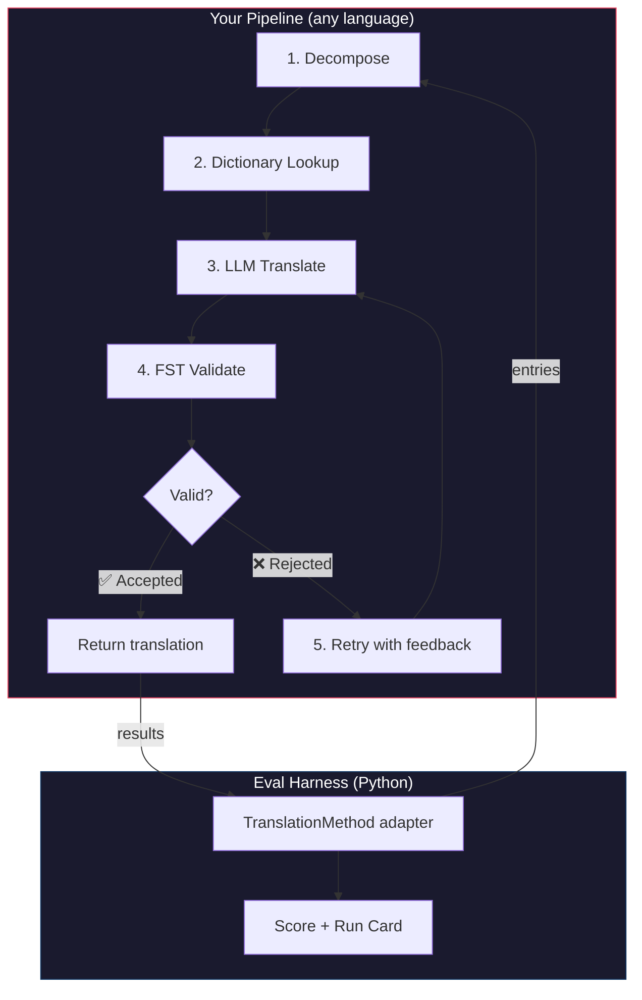
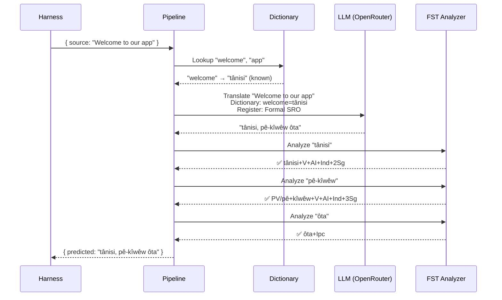
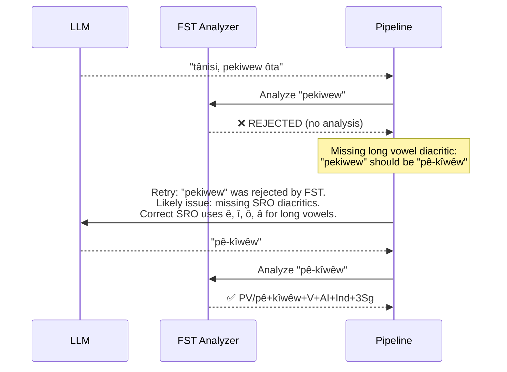

# クックブック：FST ゲート付き翻訳パイプライン

複数ステージからなる翻訳パイプラインを構築します。ソーステキストを分解し、LLM で翻訳し、有限状態トランスデューサー（FST）で出力を検証し、FST が無効な語形を拒否した場合に再試行します。その後、eval ハーネスに接続してスコアを確認します。

**構築するもの：** 形態論的に無効な翻訳をスコアに影響する*前に*検出する、Plains Cree 向け翻訳パイプラインです。

:::info 前提条件
- 動作する FST バイナリ（例：[ALTLab の Plains Cree アナライザー](https://github.com/UAlbertaALTLab/lang-crk)）
- Node.js 20 以上（パイプライン用）および Python 3.10 以上（ハーネス用）
- LLM ステップ用の OpenRouter API キー
:::

---

## アーキテクチャ

パイプラインはステージのチェーンです。各ステージには固有の役割があります。このパイプラインはどの言語でも構築できます。このサンプルでは JavaScript を使用していますが、ハーネスは内部の実装を問いません。境界にある薄い Python アダプターのみを参照します。



### 各ステージの役割

| ステージ | 処理内容 | 重要な理由 |
|-------|-------------|---------------|
| **Decompose** | 複合 UI 文字列を翻訳可能なセグメントに分解する | 多合成語言語は単一の単語に文全体をエンコードするため、LLM にはより小さな単位が必要 |
| **Dictionary Lookup** | 既知の翻訳を二言語辞書で確認する | LLM の推測に頼らず、既知の用語に正しい訳語を強制する |
| **LLM Translate** | レジスターと文法コンテキストを付与してセグメントを LLM に送信する | 新規フレーズを処理し、流暢な出力を生成する |
| **FST Validate** | 出力を形態素解析器にかける | 無効な語形を検出する。FST が単語を拒否した場合、その言語で有効な語形ではない |
| **Retry** | FST のエラーフィードバックとともに拒否された単語を再送信する | 単語が誤っていた*理由*に関する具体的な情報を LLM に提供する |

---

## データフロー

単一のエントリーがパイプラインを流れる際の処理を示します。



### FST が拒否した場合



---

## 実装

自由に構築してください。このサンプルでは JavaScript を使用していますが、Python、Rust、その他の言語でも構いません。ハーネスは実装を問いません。次のセクションで示す薄い Python アダプターとのみ通信します。

### パイプライン

各ステージは関数です。パイプラインはそれらをチェーンでつなぎます。

```javascript title="pipeline.js"
import { lookupDictionary } from './dictionary.js';
import { callLLM } from './llm.js';
import { analyzeWithFST } from './fst.js';

const MAX_RETRIES = 3;

/**
 * Translate a batch of keys through the full pipeline.
 *
 * @param {object} keys - Map of key → source string
 * @param {object} options - { sourceLang, targetLang }
 * @returns {{ translations: object, stats: object }}
 */
export async function translateBatch(keys, options) {
  const translations = {};
  const stats = { total: 0, fstAccepted: 0, retries: 0, dictionaryHits: 0 };

  for (const [key, sourceText] of Object.entries(keys)) {
    stats.total++;
    translations[key] = await translateSingle(sourceText, options, stats);
  }

  return { translations, stats };
}

/**
 * Translate a single string through all pipeline stages.
 */
async function translateSingle(sourceText, options, stats) {

  // ── Stage 1: Decompose ──────────────────────────────────
  // Split compound strings into segments the LLM can handle.
  // For UI strings this is often a no-op, but for longer content
  // it prevents the LLM from losing context in long prompts.
  const segments = decompose(sourceText);

  // ── Stage 2: Dictionary Lookup ──────────────────────────
  // Check each segment against the bilingual dictionary.
  // Known terms are forced — the LLM won't override them.
  const knownTerms = {};
  for (const segment of segments) {
    const entry = lookupDictionary(segment.toLowerCase());
    if (entry) {
      knownTerms[segment] = entry;
      stats.dictionaryHits++;
    }
  }

  // ── Stage 3: LLM Translate ──────────────────────────────
  let translation = await callLLM(sourceText, {
    ...options,
    knownTerms,
    register: 'nêhiyawêwin (Plains Cree). Use SRO orthography. '
            + 'Professional register for educational contexts.',
  });

  // ── Stage 4: FST Validate ──────────────────────────────
  // Split the translation into words and check each one.
  let { accepted, rejected } = await validateWords(translation);

  // ── Stage 5: Retry Loop ─────────────────────────────────
  // If any words were rejected, retry with FST feedback.
  let attempt = 0;
  while (rejected.length > 0 && attempt < MAX_RETRIES) {
    attempt++;
    stats.retries++;

    const feedback = rejected
      .map(w => `"${w}" was rejected by the morphological analyzer`)
      .join('; ');

    translation = await callLLM(sourceText, {
      ...options,
      knownTerms,
      register: 'nêhiyawêwin (Plains Cree). Use SRO orthography.',
      feedback: `Previous attempt had invalid words. ${feedback}. `
              + 'Use correct SRO diacritics (ê, î, ô, â for long vowels). '
              + 'Ensure verb forms match expected conjugation patterns.',
    });

    ({ accepted, rejected } = await validateWords(translation));
  }

  if (rejected.length === 0) stats.fstAccepted++;

  return translation;
}

/**
 * Decompose source text into translatable segments.
 *
 * For simple key-value UI strings, this usually returns the
 * original string as a single segment. For longer content,
 * it splits on sentence boundaries.
 */
function decompose(text) {
  // Simple sentence-boundary split. Replace with your own
  // morphological decomposition for more complex needs.
  return text
    .split(/(?<=[.!?])\s+/)
    .filter(s => s.trim().length > 0);
}

/**
 * Validate each word in a translation against the FST.
 *
 * @returns {{ accepted: string[], rejected: string[] }}
 */
async function validateWords(translation) {
  // Split on whitespace and punctuation, keeping only words
  const words = translation
    .split(/[\s,;:.!?'"()\[\]{}]+/)
    .filter(w => w.length > 0);

  const accepted = [];
  const rejected = [];

  for (const word of words) {
    const analyses = await analyzeWithFST(word);
    if (analyses.length > 0) {
      accepted.push(word);
    } else {
      rejected.push(word);
    }
  }

  return { accepted, rejected };
}
```

### FST ラッパー

FST バイナリを非同期関数としてラップします。このサンプルでは ALTLab の HFST ベース Plains Cree アナライザーを使用します。

```javascript title="fst.js"
import { execFile } from 'node:child_process';
import { promisify } from 'node:util';

const execFileAsync = promisify(execFile);

// Path to your FST analyzer binary
const FST_PATH = process.env.FST_ANALYZER_PATH || './bin/crk-analyzer';

/**
 * Run a word through the FST morphological analyzer.
 *
 * Returns an array of analyses. Empty array = rejected.
 *
 * Example:
 *   analyzeWithFST("tânisi")
 *   → ["tânisi+V+AI+Ind+2Sg", "tânisi+V+AI+Cnj+2Sg"]
 *
 *   analyzeWithFST("pekiwew")
 *   → []  // rejected — missing diacritics
 *
 * @param {string} word - A single word in SRO orthography
 * @returns {string[]} Array of FST analyses (empty = rejected)
 */
export async function analyzeWithFST(word) {
  try {
    // HFST lookup: pipe the word to stdin, read analyses from stdout
    const { stdout } = await execFileAsync(
      FST_PATH,
      ['--quiet'],
      { input: word + '\n', timeout: 5000 }
    );

    // Parse HFST output: each line is "input\tanalysis\tweight"
    // Lines with "+?" indicate unrecognized forms
    return stdout
      .split('\n')
      .filter(line => line.includes('\t') && !line.includes('+?'))
      .map(line => line.split('\t')[1]);

  } catch (err) {
    // If the FST binary isn't available, log and reject
    console.error(`[WARN] FST analysis failed for "${word}": ${err.message}`);
    return [];
  }
}
```

### 辞書モジュールと LLM モジュール

```javascript title="dictionary.js"
/**
 * Simple bilingual dictionary backed by a JSON file.
 *
 * In production, you'd load from the coaching data directory
 * or query itwêwina (https://itwewina.altlab.app/) via API.
 */
const DICTIONARY = {
  'hello': 'tânisi',
  'welcome': 'tânisi',
  'thank you': 'kinanâskomitin',
  'home': 'kīwēwin',
  'search': 'nānātawāpahtam',
  'settings': 'isi-nākatohkēwin',
  'help': 'nīsōhkamākēwin',
  'back': 'kīwē',
};

/**
 * @param {string} term - Lowercase English term
 * @returns {string|null} Cree translation or null
 */
export function lookupDictionary(term) {
  return DICTIONARY[term] || null;
}
```

```javascript title="llm.js"
/**
 * Call an LLM via OpenRouter for translation.
 */
const OPENROUTER_API = 'https://openrouter.ai/api/v1/chat/completions';

export async function callLLM(sourceText, options) {
  const { knownTerms = {}, register, feedback } = options;

  // Build the system prompt with register and known terms
  let systemPrompt = `You are translating English to Plains Cree.\n\n`;
  systemPrompt += `Register: ${register}\n\n`;

  if (Object.keys(knownTerms).length > 0) {
    systemPrompt += `Required terminology (use these exact translations):\n`;
    for (const [en, crk] of Object.entries(knownTerms)) {
      systemPrompt += `  "${en}" → "${crk}"\n`;
    }
    systemPrompt += '\n';
  }

  if (feedback) {
    systemPrompt += `IMPORTANT correction from previous attempt:\n${feedback}\n\n`;
  }

  systemPrompt += `Rules:\n`;
  systemPrompt += `- Use Standard Roman Orthography (SRO)\n`;
  systemPrompt += `- Use macron/circumflex for long vowels: ê, î, ô, â\n`;
  systemPrompt += `- Return ONLY the Cree translation, nothing else\n`;

  const response = await fetch(OPENROUTER_API, {
    method: 'POST',
    headers: {
      'Authorization': `Bearer ${process.env.OPENROUTER_API_KEY}`,
      'Content-Type': 'application/json',
    },
    body: JSON.stringify({
      model: 'google/gemini-2.5-pro',
      messages: [
        { role: 'system', content: systemPrompt },
        { role: 'user', content: sourceText },
      ],
      temperature: 0.2,
    }),
  });

  const json = await response.json();
  return json.choices[0].message.content.trim();
}
```

---

## ハーネスへの接続

パイプラインが構築できました。次に、eval ハーネスに接続してリーダーボードでベンチマークを実行します。

ハーネスが使用するインターフェースは `TranslationMethod` のみです。単一のメソッドを持つ Python プロトコルです。どの言語でも自由に構築し、この薄いラッパーを付与するだけで接続できます。

```python title="fst_gated_process.py"
"""
TranslationMethod adapter for the FST-gated pipeline.

This thin wrapper connects your pipeline (running as a local
subprocess or HTTP server) to the eval harness. The harness
calls translate() with corpus entries. You call your pipeline.
You return results. That's it.
"""

import time
import subprocess
import json
from mt_eval_harness.config import RunConfig


class FSTGatedProcess:
    """Adapter between the eval harness and your FST-gated pipeline.

    The pipeline runs as a Node.js subprocess. This wrapper:
    1. Receives entries from the harness
    2. Sends them to the pipeline
    3. Returns structured results the harness can score
    """

    def __init__(self, pipeline_url: str = "http://localhost:3001"):
        self.pipeline_url = pipeline_url

    async def translate(
        self,
        entries: list[dict],
        config: RunConfig,
    ) -> list[dict]:
        """Translate a batch of entries through the FST-gated pipeline.

        Args:
            entries: List of corpus entries with 'id' and source text.
            config: Harness run configuration (for context).

        Returns:
            List of result dicts, one per entry.
        """
        import httpx

        results = []

        for entry in entries:
            source_text = entry.get(config.source_field, entry.get("source", ""))
            start = time.monotonic()

            try:
                # Call your pipeline — however it's running
                async with httpx.AsyncClient() as client:
                    response = await client.post(
                        f"{self.pipeline_url}/translate",
                        json={"keys": {str(entry["id"]): source_text}},
                        timeout=30.0,
                    )
                    data = response.json()
                    predicted = data["translations"][str(entry["id"])]

                elapsed = time.monotonic() - start

                results.append({
                    "id": entry["id"],
                    "predicted": predicted,
                    "latency_s": elapsed,
                    "usage": {},  # pipeline doesn't expose token counts
                    "error": None,
                    "tool_calls": [],
                    "tool_call_count": 0,
                    "metadata": data.get("meta", {}),
                })

            except Exception as err:
                results.append({
                    "id": entry["id"],
                    "predicted": "",
                    "latency_s": time.monotonic() - start,
                    "usage": {},
                    "error": str(err),
                    "tool_calls": [],
                    "tool_call_count": 0,
                    "metadata": {},
                })

        return results
```

:::tip HTTP は必須ではありません
上記のサンプルでは、パイプラインが JavaScript で書かれているため HTTP 経由で呼び出しています。パイプラインが Python の場合は直接呼び出せます。サーバーは不要です。`TranslationMethod` ラッパーは単なる関数の境界です。内部の処理はご自由に決めてください。
:::

### ベンチマークの実行

パイプラインを起動してからハーネスを実行します。

```bash
# Terminal 1: Start the pipeline
node server.js

# Terminal 2: Run the harness with your process
export OPENROUTER_API_KEY="sk-or-v1-..."

python -c "
import asyncio
from mt_eval_harness.config import RunConfig
from mt_eval_harness.runner import execute_run
from fst_gated_process import FSTGatedProcess

async def main():
    config = RunConfig(
        corpus_path='data/edtekla-dev-v1.json',
        source_lang='English',
        target_lang='Plains Cree (nêhiyawêwin, SRO)',
        process_name='fst-gated-v1',
    )
    process = FSTGatedProcess('http://localhost:3001')
    run_log = await execute_run(config, process=process)
    print(f'Results: {run_log.output_path}')

asyncio.run(main())
"
```

または `baseline_experiment.py` を付けた CLI を使用して、組み込みベースラインと比較します。

```bash
python eval/baseline_experiment.py \
  --dataset data/edtekla-dev-v1.json \
  --model google/gemini-2.5-pro \
  --fst-analyzer ./bin/crk-analyzer \
  --condition fst-gated-v1 \
  --submit
```

---

## 結果の解釈

ハーネスは**ランカード**（スコアを含む JSON ファイル）を生成します。出力内容は以下のとおりです。

```
═══════════════════════════════════════════════════
  FST-Gated Pipeline v1 — EDTeKLA Dev v1
═══════════════════════════════════════════════════

  chrF++              48.7 / 100
  Exact match         12.1%
  FST acceptance      94.4%
  Composite score     0.52  →  Functional ✓

  404 entries (master_corpus.json) · 47 retries · $0.18 total cost
═══════════════════════════════════════════════════
```

**一目でわかること：**
- メソッドは **Functional** ティア（0.50〜0.70）です。出力は話者が認識できる水準で、主要な文法は概ね正しいですが、形態論的なエラーが残ります。
- FST は単語の 94% を有効と判定しています。再試行ループが機能しています。
- 翻訳の 12% が完全に正確です。改善の余地が多くあります。

:::info 品質ティア
| ティア | 複合スコア | 意味 |
|------|-----------|---------------|
| Baseline | 0.00〜0.30 | 生の LLM 出力。形態論はほぼ幻覚 |
| Emerging | 0.30〜0.50 | 一部のパターンは正しいが、信頼性は低い |
| **Functional** | **0.50〜0.70** | **話者が認識できる。主要カテゴリは概ね正確。** |
| Deployable | 0.70〜0.85 | 人間によるレビューを前提としたドラフト翻訳に適する |
| Fluent | 0.85〜1.00 | 有能な人間翻訳者に近い水準 |

ティアの完全な定義については [SCORING_SPEC §5](/docs/specifications/scoring#5-quality-tiers) を参照してください。
:::

<details>
<summary><strong>詳細：ランカードの内容</strong></summary>

ランカード JSON は評価実行に関するすべての情報を記録します。主なセクションは以下のとおりです。

**スコア** — ハーネスが計算したすべてのメトリクス：
```json
{
  "scores": {
    "exact_match_rate": 0.121,
    "chrf_plus_plus": 48.7,
    "fst_acceptance_rate": 0.944,
    "composite_score": 0.52,
    "quality_tier": "functional"
  }
}
```

**プロベナンス** — 結果を生成したもの：
```json
{
  "method": {
    "process_name": "fst-gated-v1",
    "model": "google/gemini-2.5-pro",
    "temperature": 0.0
  },
  "corpus": {
    "id": "edtekla-dev-v1",
    "sha256": "a1b2c3..."
  }
}
```

**エントリーごとの結果** — 個別スコアを含むすべての翻訳。メソッドが苦手とする箇所を特定できます。
```json
{
  "id": 42,
  "source": "The student completed the assignment",
  "reference": "ôskiniw kî-kîsîhtâw ôhi atoskêwina",
  "predicted": "ôskiniw kî-kîsîhtâw ôhi atoskêwin",
  "chrf": 89.2,
  "exact_match": false,
  "fst_accepted": true
}
```

複合スコアは利用可能なメトリクスの加重平均であり、重みは [SCORING_SPEC §4](/docs/specifications/scoring#4-composite-score) で定義されています。メトリクスが利用できない場合、その重みは残りのメトリクスに比例して再配分されます。

</details>

---

## 本番環境へのデプロイ

メソッドのスコアがリーダーボードに登録されました。次は実際に使用します。このセクションでは、[champollion](https://champollion.dev) が呼び出せる本番エンドポイントとしてパイプラインを提供する方法を説明します。

:::note このセクションはオプションです
上記のすべてはメソッドの構築とベンチマークに関するものです。このセクションはデプロイに関するものであり、別の関心事です。デプロイしなくてもリーダーボードに提出できます。
:::

### HTTP サーバー

[API メソッドコントラクト](https://champollion.dev/docs/guides/serving-a-method)を実装する Express サーバーとしてパイプラインをラップします。

```javascript title="server.js"
import express from 'express';
import { translateBatch } from './pipeline.js';

const app = express();
app.use(express.json());

/**
 * API method contract:
 *
 * Request:  { source_locale, target_locale, method, keys: { "key": "source" } }
 * Response: { translations: { "key": "translated" }, meta: { ... } }
 */
app.post('/translate', async (req, res) => {
  const { source_locale, target_locale, method, keys } = req.body;

  // Validate request
  if (!keys || typeof keys !== 'object') {
    return res.status(400).json({ error: { message: 'Missing keys object' } });
  }

  try {
    const startTime = Date.now();
    const { translations, stats } = await translateBatch(keys, {
      sourceLang: source_locale,
      targetLang: target_locale,
    });

    res.json({
      translations,
      meta: {
        model: 'custom-pipeline/fst-gated-v1',
        method: 'decompose-lookup-translate-validate',
        elapsed_ms: Date.now() - startTime,
        fst_acceptance_rate: stats.fstAccepted / stats.total,
        retries: stats.retries,
      },
    });
  } catch (err) {
    console.error('[ERR] Pipeline failed:', err.message);
    res.status(500).json({ error: { message: err.message } });
  }
});

// Health check for connectivity verification
app.get('/health', (req, res) => res.json({ status: 'ok' }));

app.listen(3001, () => {
  console.log('FST-gated pipeline running on http://localhost:3001');
});
```

### champollion の設定

実行中のサービスに言語ペアを向けます。

```json title="champollion.config.json"
{
  "version": 3,
  "inputLocale": "en",
  "pairs": {
    "en:crk": {
      "method": "api",
      "endpoint": "http://localhost:3001/translate"
    }
  },
  "languages": {
    "crk": {
      "name": "Plains Cree",
      "register": "SRO syllabics with grammatical precision."
    }
  }
}
```

```bash
# Run it
export OPENROUTER_API_KEY="sk-or-v1-..."
node server.js &
npx champollion sync
```

### プラグインとしてのパッケージング

メソッドにスコアが付いたら、他のユーザーが使用できるようにパッケージ化します。

```json title="crk-fst-gated-v1/method.json"
{
  "name": "crk-fst-gated-v1",
  "type": "api",
  "version": "1.0.0",
  "description": "FST-gated Plains Cree translation with morphological validation",
  "author": "Your Name",

  "config": {
    "endpoint": "https://your-server.example.com/translate"
  },

  "locales": ["crk"],

  "benchmarks": {
    "crk": {
      "date": "2026-06-01T00:00:00Z",
      "corpus_size": 404,
      "exact_match_rate": 0.12,
      "corpus_chrf": 48.7,
      "model": "google/gemini-2.5-pro",
      "harness_version": "2.0"
    }
  },

  "provenance": {
    "resources": [
      { "name": "ALTLab CRK Analyzer", "license": "LGPL-3.0", "type": "fst" },
      { "name": "Wolvengrey Dictionary", "license": "CC-BY-NC-SA-4.0", "type": "dictionary" }
    ],
    "commercialReady": false,
    "flags": ["nc-resource"]
  }
}
```

---

## このパターンの応用

このクックブックでは一つのパイプラインアーキテクチャを示しています。任意の言語やメソッドに応用できます。

| バリエーション | 変更点 |
|-----------|-------------|
| **別の FST** | バイナリパスを変更します。[GiellaLT GitHub](https://github.com/giellalt) または [Apertium GitHub](https://github.com/apertium) から 100 以上の言語向けにコンパイル済みの FST（`.hfstol` や `lttoolbox` バイナリなど）をダウンロードできます。 |
| **FST が利用できない場合** | FST 実行ステージを削除し、Hugging Face の [UniMorph フラットパラダイムファイル](https://huggingface.co/datasets/unimorph/universal_morphologies) を使用して活用形の静的データベースルックアップ検証を行います。 |
| **複数の LLM** | モデルをチェーンします。初稿用の高速モデルと修正用の推論モデルを組み合わせます。 |
| **Human-in-the-loop** | 不確かな翻訳を専門家のレビューのためにキューに保留するステージを追加します。 |
| **ファインチューニング済みモデル** | OpenRouter の呼び出しをローカルモデル（Ollama、vLLM など）に置き換えます。 |
| **別の言語** | 辞書、FST、レジスターを変更します。アーキテクチャはそのまま維持されます。 |

パイプラインはパターンです。ステージは交換可能です。使用する言語に合ったものを構築し、[リーダーボード](https://champollion.dev/leaderboard)で実証し、デプロイしてください。

---

## 関連情報

- **[Eval ハーネス](/docs/specifications/harness)** — ハーネスの実行方法と出力の解釈
- **[メソッドインターフェース](/docs/specifications/methods)** — `TranslationMethod` プロトコル仕様
- **[リーダーボードルール](/docs/leaderboard/rules)** — 提出基準とアンチゲーミングポリシー
- **[低リソース言語のサポート](/docs/community/low-resource-languages)** — より広いコンテキストと OCAP 原則
- **[ALTLab](https://altlab.artsrn.ualberta.ca/)** — Alberta Language Technology Lab（Plains Cree FST）
- **[メソッドリーダーボード](https://champollion.dev/leaderboard)** — スコアを提出する