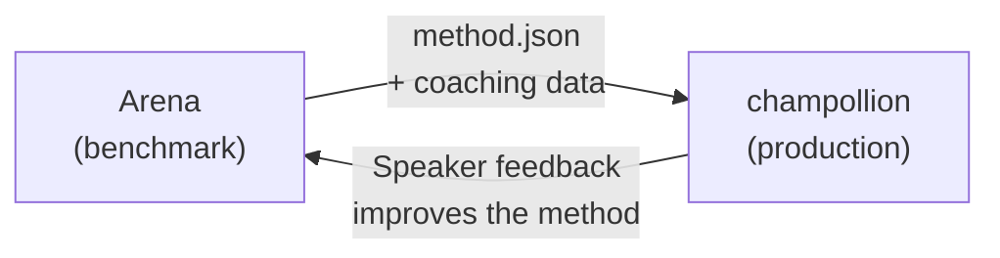

# 프로덕션에 배포하기

Arena에서 작동을 증명했어요. 이제 배포할 차례예요.

Arena는 R&D를 위한 것으로, 번역 방법을 구축하고, 벤치마킹하고, 비교하는 데 사용해요. **프로덕션 배포**는 개발자용 번역 CLI인 [champollion](https://champollion.dev)을 통해 이루어져요. 둘은 공유 플러그인 형식을 통해 연결돼요.



---

## 배포 경로

### 1. 방법을 플러그인으로 내보내기

벤치마크 결과를 패키징하는 `method.json` 매니페스트를 생성하세요:

```json
{
  "name": "crk-coached-v3",
  "type": "llm-coached",
  "version": "3.0.0",
  "description": "Coached LLM translation for Plains Cree",
  "locales": ["crk"],
  "config": {
    "model": "google/gemini-2.5-flash",
    "temperature": 0.3
  },
  "benchmarks": {
    "crk": {
      "composite_score": 0.67,
      "fst_acceptance": 0.82,
      "corpus_size": 150
    }
  }
}
```

매니페스트와 함께 코칭 데이터(문법 규칙, 사전)도 포함하세요.

### 2. Champollion에 설치하기

```bash
champollion plugin install ./my-method-plugin/
```

### 3. 언어 쌍 구성하기

```json title="champollion.config.json"
{
  "pairs": {
    "en-crk": { "method": "plugin", "plugin": "crk-coached-v3" }
  }
}
```

### 4. 실제 콘텐츠 번역하기

```bash
npx champollion sync
```

이제 벤치마킹된 방법이 프로덕션에서 실제 번역을 생성해요.

---

## 원주민 언어의 경우

원주민 언어 커뮤니티를 지원하는 방법은 프로덕션 배포 전에 **커뮤니티 동의**가 필요해요. OCAP 원칙(Ownership, Control, Access, Possession)은 번역 방법이 어떻게 개발되고, 평가되고, 배포되는지를 규율해요.

Deployable 등급(0.70 이상)에 도달한 방법이라도 자동으로 배포되지는 않아요. 해당 언어 커뮤니티의 거버넌스 기구가 동의할 **경우에 한해서만** 배포돼요.

전체 거버넌스 프레임워크는 [데이터 주권](/docs/sovereignty/data-sovereignty)과 [소유권 이전](/docs/sovereignty/ownership-transfer)을 참고하세요.

---

## 함께 보기

- [Eval Harness 브리지](https://champollion.dev/docs/guides/bridge) — Arena→champollion 파이프라인에 대한 자세한 안내
- [플러그인 명세](https://champollion.dev/docs/reference/plugin-spec) — method.json 매니페스트 형식
- [champollion 에이전트 가이드](https://champollion.dev/docs/guides/agent-guide) — 번역에 champollion을 사용하는 방법