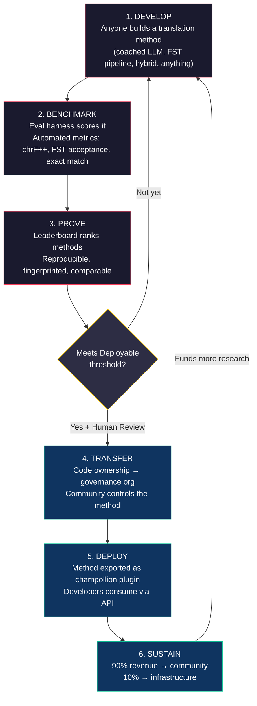
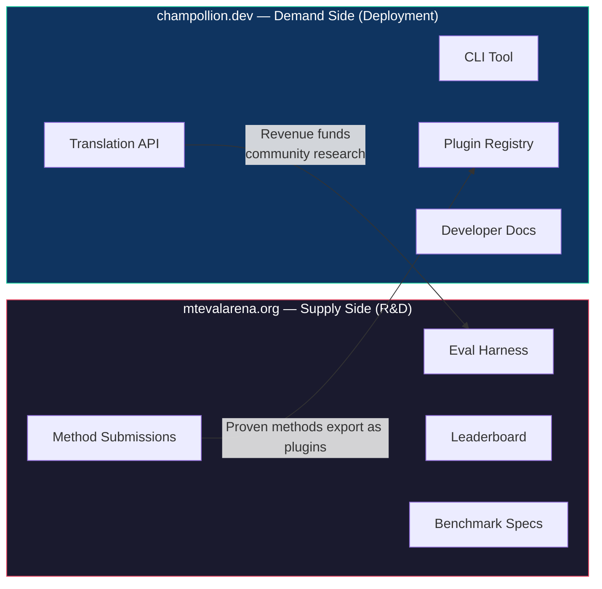
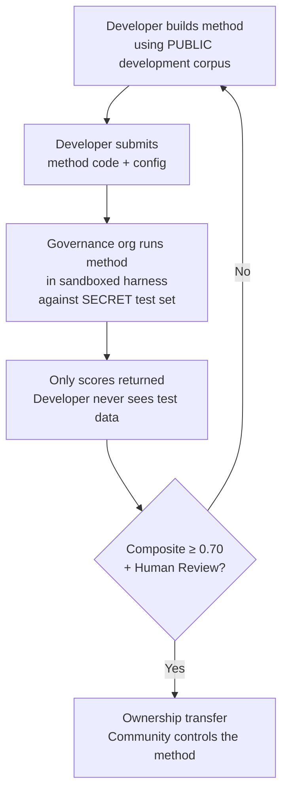

# 작동 방식: 기계 번역을 위한 경쟁형 크라우드소싱

> **요약.** 전 세계 소외 언어 — Meta의 OMT-1600이 지원한다고 주장하지만 실사용 가능한 임계값에 못 미치는 품질 수준의 약 1,300개 언어를 포함하여 — 를 위한 기계 번역은 모델 학습 문제가 아니라 *인프라* 문제예요. 어떤 단일 모델, 연구소, 회사도 이를 해결하지 못할 거예요. 이 문서는 전 세계 ML 엔지니어, 언어학자, 언어 사용자 커뮤니티를 분산형 연구소로 전환하는 플랫폼 아키텍처를 설명해요. 누구나 번역 방법을 구축하고, 플랫폼이 주권적 평가 데이터에 맞서 그것이 작동하는지 입증하며, 입증된 방법은 해당 언어를 사용하는 커뮤니티로 수익이 흘러가는 형태로 프로덕션에 배포돼요. 이 메커니즘은 암호학적 주권과 결합된 경쟁형 크라우드소싱으로, 이전에 시도된 적이 없는 조합이에요.

---

> [!IMPORTANT]
> **범위.** 이 플랫폼은 **공식 서면 텍스트 번역** — 문서, 교육 자료, 공식 커뮤니케이션, UI 문자열 — 을 평가해요. 챗봇, 실시간 통역기, 또는 무제한 도메인 대화 시스템이 아니에요. 리더보드는 특정 텍스트 도메인에서 큐레이션된 병렬 코퍼스에 맞서 번역 방법의 순위를 매겨요(도메인 분류 체계는 [Benchmark Specification §2.7](/docs/specifications/benchmark#27-domain) 참조). MT는 언어 부흥을 위한 인프라이지, 그 대체물이 아니에요. 아이들은 기계가 아니라 사람으로부터 언어를 배워요.

### 현재 도메인 커버리지

| 도메인 | 티어 커버리지 | 상태 | 비고 |
|--------|--------------|--------|-------|
| 공식 / 정부 | Tiers 1–5 | 활성 | EdTeKLA 코퍼스 |
| 교육 / 교과서 | Tiers 1–4 | 활성 | EdTeKLA 코퍼스 |
| 서사 / 문학 | 제한적 | 예정 | 골드 스탠다드의 일부 항목 |
| 종교 / 경전 | 참조용만 | 평가 안 함 | FLORES+ (성경 도메인); 공식 채점에 사용 안 함 |
| 대화 | 범위 밖 | 의도적 | 이 시스템은 음성이 아니라 서면 텍스트를 평가해요 |
| 기술 / 과학 | 범위 밖 | 향후 | 도메인별 용어 검증이 필요해요 |

## 1. 문제: 기계 번역 ≠ 기계 학습

저자원 언어(LRL)를 위한 기계 번역은 흔히 기계 학습 문제로 규정돼요. 데이터를 수집하고, 모델을 학습하고, 배포하는 식이죠. 이러한 규정은 잘못되었고, 그 오류는 중대해요. 세계 대다수 언어에 대해 구조적으로 작동할 수 없는 접근법으로 자금, 인재, 인프라를 향하게 만들기 때문이에요.

### 1.1 ML 규정이 실패하는 이유

MT를 위한 표준 ML 파이프라인은 세 가지를 요구해요. 대규모 병렬 코퍼스, 검증된 평가 벤치마크, 그리고 배포 경로죠. Google Translate가 지원하는 약 130개 언어와 NLLB-200이 커버하는 약 200개 언어에 대해서는 세 가지 모두 존재해요. OMT-1600이 커버한다고 주장하는 추가 약 1,300개 언어에 대해서는 평가 데이터는 존재하지만 품질이 대부분 실사용 가능한 임계값에 못 미치고, 모델 가중치는 공개되어 있지 않으며, 배포 파이프라인도 없어요. 나머지 약 5,400개 이상에 대해서는 어느 것도 전혀 존재하지 않아요.

| 요건 | 고자원 언어 | OMT-1600 커버리지 (약 1,300 LRL) | 나머지 약 5,400개 언어 |
|-------------|------------------------|-------------------------------|---------------------------|
| **병렬 코퍼스** | 수백만 개의 문장 쌍 (Europarl, UN Corpus, OpenSubtitles) | 성경 도메인 bitext, 웹 스크랩, 합성 역번역. 커뮤니티 큐레이션 데이터 없음. | 있더라도 수백에서 낮은 수천 개 |
| **평가 벤치마크** | WMT, FLORES, NTREX — 표준화되고 재현 가능 | BOUQuET (성경 도메인), met-BOUQuET. 형태론적 검증 없음. 독립적 평가 없음. | 표준 벤치마크 없음; 임시 평가 |
| **배포 경로** | Google Translate, DeepL, Azure — 상업용 API | 모델 가중치 미공개. CLI 없음, 플러그인 시스템 없음, 커뮤니티 배포 가능한 API 없음. | 아무것도 없음. API 없음, 제품 없음, 시장 없음. |

ML 접근법은 학습할 데이터가 존재하고 배포할 시장이 존재할 때 작동해요. OMT-1600은 첫 번째 조건을 크게 확장했어요. 하지만 독립적 품질 검증, 형태론적 검증, 또는 커뮤니티 거버넌스 없는 확장은 신뢰 없는 확장이에요. 문제는 단순히 "더 나은 모델이 필요하다"가 아니라 "커뮤니티가 통제하는 조건으로 모델이 작동함을 입증하는 인프라가 필요하다"는 거예요.

### 1.2 LRL을 위한 MT가 실제로 요구하는 것

소외 언어를 위한 번역은 주로 학습 문제가 아니에요. 그것은 **방법 엔지니어링** 문제예요. 사용 가능한 자원(LLM, 형태론 도구, 커뮤니티 지식, 언어 규칙)을 작동하는 번역 파이프라인으로 조립한 다음, 엄격한 평가로 그것이 작동함을 입증하는 과제죠.

이 구분은 중요해요:

| 차원 | ML 접근법 | 방법 엔지니어링 접근법 |
|-----------|------------|---------------------------|
| **핵심 활동** | 데이터로 모델을 학습 | 도구, 프롬프트, 언어 지식을 파이프라인으로 결합 |
| **병목** | 병렬 데이터 양 | 엔지니어링 창의성 + 평가 인프라 |
| **누가 기여할 수 있는가** | GPU 클러스터와 데이터셋을 가진 팀 | API 키, 사전, 아이디어를 가진 누구나 |
| **평가** | 홀드아웃 테스트 세트에 대한 BLEU/chrF | 형태론적 검증 + 인간 검토 + 자동화 메트릭 |
| **배포** | 모델 서빙 | 방법을 플러그인으로 패키징 |

현대 LLM은 이미 많은 저자원 언어에 대한 잠재적 지식을 담고 있어요. *그럴듯해 보이는* 출력을 생산하기에 충분할 정도로요. 문제는 이 출력이 종종 형태론적으로 유효하지 않다는 거예요(모델이 해당 언어에 존재하지 않는 단어 형태를 환각해요). 엔지니어링 과제는 이거예요: LLM이 아는 것을 어떻게 추출하고, 언어적 현실에 맞서 검증하며, 그 결과를 프로덕션 사용을 위해 패키징하느냐죠.

이것이 우리가 모델이 아니라 **방법**을 벤치마크하는 이유예요. 방법은 전체 레시피예요: 모델 선택 + 프롬프트 엔지니어링 + 도구 사용 + 전/후처리 + 코칭 데이터 + 재시도 전략이죠. 같은 모델을 다른 방법으로 사용하는 두 팀은 다른 점수를 얻을 거예요. 그게 핵심이에요.

### 1.3 다종합어가 모든 것을 무너뜨리는 이유

세계에서 가장 소외된 언어 다수는 **다종합어**예요. 생산적인 형태론적 과정을 통해 전체 문장을 단일 단어로 인코딩하죠. Plains Cree 단어를 살펴봐요:

> **ê-kî-nitawi-kîskinwahamâkosiyân**
> *"내가 학교에 갔었을 때"*

한 단어예요. 시제(과거), 방향(향해 감), 어근(배우다), 태(수동/재귀), 인칭(1인칭 단수)을 인코딩해요. Cree가 한 단어로 표현하는 것에 영어는 여섯 단어가 필요해요.

이는 모든 수준에서 표준 MT를 무너뜨려요:

- **토큰화** — BPE와 SentencePiece는 다종합어 단어를 무의미한 조각으로 잘게 부숴요. 결합형 형태론을 위해 설계되었기 때문이죠.
- **환각** — LLM은 유효한 단어가 아닌 그럴듯해 보이는 문자열을 생산해요. 비사용자는 차이를 구별할 수 없어요. 형태론적 검증 없이는 환각이 보이지 않아요.
- **평가** — 단어 수준 메트릭(BLEU)은 이러한 언어가 작동하는 방식에 근본적인 자연스러운 굴절 변이에 페널티를 줘요. 문자 수준 메트릭(chrF++)이 더 낫지만 구조적 검증 없이는 여전히 불충분해요.

해결책은 더 큰 모델이나 더 많은 학습 데이터가 아니에요. 그것은 **환각이 사용자에게 도달하기 전에 잡아내는 인프라**예요. "이것은 이 언어의 단어가 아니다"라고 확정적으로 말할 수 있는 형태론적 분석기(FST)죠.

---

## 2. 기존 접근법이 작동하지 않는 이유

### 2.1 상업용 MT

상업용 번역 서비스는 역사적으로 시장 규모에 최적화되어 왔어요. Meta의 OMT-1600(2026년 3월)은 중대한 전환을 나타내요 — 하나의 시스템에 1,600개 언어죠. 하지만 가장 낮은 자원 티어의 약 1,300개에 대해서는 품질이 실사용 가능한 임계값에 못 미치고, 모델 가중치는 사용할 수 없으며, 배포 파이프라인도 없어요. 구조적 인센티브 문제는 진화했어요. 빅테크는 이제 LRL을 위한 모델을 구축할 수 있지만, 독립적 평가, 형태론적 검증, 또는 커뮤니티 거버넌스 없이는 커버리지만으로 문제가 해결되지 않아요.

### 2.2 학술 연구

학술 MT 연구는 압도적으로 고자원 언어 쌍에 집중되어 있어요. 학습 데이터, 공유 과제, 출판 장소가 거기에 있기 때문이죠. 저자원 쌍을 다루는 연구자는 출판에 어려움을 겪고, 컴퓨팅 자금 조달에 어려움을 겪으며, 배포에 어려움을 겪어요. LRL을 위한 배포 인프라가 존재하지 않기 때문이에요.

### 2.3 일회성 경쟁

Kaggle 경쟁을 운영할 수도 있어요: "영어→Plains Cree, 최고 chrF++가 $10,000 획득." 그러면 이런 일이 벌어져요:

1. 누군가가 우승하고, 노트북을 제출하고, 상금을 받고, 집으로 가요.
2. 그 노트북은 Kaggle의 아카이브에서 썩어가요. 아무도 배포하지 않아요. 아무도 유지보수하지 않아요.
3. 테스트 세트는 결국 공개돼요 — 영원히 오염되죠.
4. 거버넌스 조직은 자신들의 언어 데이터를 Google의 서비스 약관 하에 Google의 인프라에 업로드했고, 라이프사이클에 대한 실질적인 통제권이 없어요.
5. 배포 다리가 없어요. 우승한 노트북은 작동하는 API가 아니에요.

일회성 현상금은 현상금 사냥꾼을 끌어들여요. 커뮤니티 거버넌스가 있는 지속적인 리더보드는 지속적인 참여를 만들어내요.

### 2.4 파인튜닝

병렬 텍스트에 대해 오픈 모델을 파인튜닝하는 것은 명백한 ML 접근법이에요. 하지만 대부분의 LRL에 대해서는 파인튜닝에 필요한 병렬 코퍼스가 바로 존재하지 않는 데이터예요. 그리고 그것을 만들려면 파인튜닝이 대체하려는 바로 그 이중 언어 사용자와 커뮤니티 참여가 필요해요. 데이터가 필요한 기법으로 데이터 부족 문제를 부트스트랩으로 빠져나갈 수는 없어요.

---

## 3. 해결책: 주권적 평가를 통한 경쟁형 크라우드소싱

이 플랫폼은 전통적 접근법을 뒤집어요. 한 팀이 하나의 모델을 구축하는 대신, **전 세계 커뮤니티가 최고의 번역 방법을 구축하기 위해 경쟁하고**, 플랫폼이 그것이 작동하는지 입증하며, 입증된 방법은 언어 커뮤니티가 소유권과 통제권을 유지한 채 프로덕션에 배포돼요.

### 3.1 전체 루프

각 단계는 특정한 기능을 가져요:

| 단계 | 무슨 일이 일어나는가 | 누가 혜택을 받는가 |
|-------|-------------|--------------|
| **개발** | 연구자, 학생, 또는 취미가가 원하는 어떤 도구든 사용해 번역 방법을 구축해요 — LLM 프롬프팅, FST 파이프라인, 사전, 파인튜닝된 모델, 규칙 기반 시스템, 또는 하이브리드 | 기여자는 배우고, 실험하고, 출판해요 |
| **벤치마크** | 평가 하니스가 재현 가능한 메트릭으로 표준화된 코퍼스에 맞서 방법을 채점해요. 모든 실행은 [run card](/docs/specifications/benchmark#3-run-card-schema)를 생성해요 — 무엇이 테스트되었고 어떻게 수행했는지에 대한 완전한 기록이죠 | 연구자는 재현 가능하고 비교 가능한 결과를 얻어요 |
| **입증** | 결과가 공개 리더보드에 나타나요. 방법은 순위가 매겨지고, 비교되고, 면밀히 검토돼요. 커뮤니티는 무엇이 작동하고 무엇이 작동하지 않는지 봐요 | 모두가 최첨단 기술에 대한 가시성을 얻어요 |
| **이전** | 원주민 언어의 경우, Deployable 임계값(composite ≥ 0.70)에 도달하고 인간 검증을 통과한 방법은 그 코드 소유권이 언어 커뮤니티의 거버넌스 조직으로 이전돼요 | 커뮤니티는 수익 창출 자산을 얻어요 |
| **배포** | 방법은 [champollion](https://github.com/gamedaysuits/champollion) 플러그인으로 내보내지고 API를 통해 서빙돼요. 개발자는 기저 방법을 이해할 필요 없이 번역을 사용해요 | 개발자는 상업용 API가 지원하지 않는 언어에 대한 번역을 얻어요 |
| **지속** | API 수익은 분배돼요: 90%는 커뮤니티에, 10%는 인프라에. 수익은 더 많은 언어 연구, 코퍼스 개발, 커뮤니티 프로그램에 자금을 대요 | 초기 확립 후 플라이휠이 스스로 지속돼요 |

### 3.2 경쟁 역학이 작동하는 이유

경쟁은 부수적인 것이 아니라 메커니즘이에요. 그 이유는 이거예요:

**접근법의 다양성.** 영어→Plains Cree를 위한 최고의 방법은 FST 게이트가 적용된 코칭 LLM일 수 있어요. 영어→Quechua를 위한 최고는 사전 증강 파이프라인일 수 있어요. 영어→Inuktitut를 위한 최고는 Nunavut Hansard 코퍼스에서 부트스트랩된 파인튜닝 모델일 수 있어요. 어떤 단일 팀이나 접근법도 모든 언어에 걸쳐 지배하지 못할 거예요. 리더보드는 어떤 *종류*의 접근법이 어떤 *종류*의 언어에 작동하는지 드러내요 — 그 자체가 연구 기여인 메타 결과죠.

**지속적인 참여.** 리더보드는 결코 끝나지 않아요. 누군가는 항상 최고 점수를 이기고 싶어 해요. 모든 제출은 이 문제에 컴퓨팅과 지적 노력을 기부해요. 일회성 보조금과 달리, 경쟁 역학은 전 세계 커뮤니티로부터 지속적인 연구 투자를 만들어내요.

**낮은 진입 장벽.** API 키, 사전, 아이디어가 필요해요. 평가 하니스는 오픈 소스예요. 코퍼스 형식은 단순한 JSON이에요. 언어학과 학생은 자원이 풍부한 연구소와 경쟁할 수 있고 — 때로는 이길 수도 있어요. 도메인 지식(언어 이해)이 컴퓨팅 자원을 능가할 수 있기 때문이죠.

**배포 다리.** 하니스에서 좋은 점수를 받는 바로 그 방법이 한 번의 설정 변경으로 프로덕션에 배포돼요. "여기서 입증하고, 거기에 배포하라." 이것은 Kaggle, WMT 공유 과제, 학술 출판이 연결하지 못하는 간극이에요.

### 3.3 플랫폼 아키텍처

생태계는 두 청중을 위한 두 사이트로 물리적으로 분리되어 있어요:

**[mtevalarena.org](https://mtevalarena.org)**는 R&D 입증의 장이에요. 그 청중은 ML 엔지니어, 언어학자, 연구자예요. 여기 있는 모든 것은 번역 방법을 구축하고, 테스트하고, 입증하는 것에 관한 거예요.

**[champollion.dev](https://champollion.dev)**는 배포 플랫폼이에요. 그 청중은 자신의 앱에 번역이 필요한 개발자예요. 그들은 방법이 어떻게 작동하는지 이해할 필요가 없어요 — 그저 API를 호출하면 돼요.

이 둘 사이의 다리는 **방법 플러그인**이에요: 배포를 위해 패키징되고 커뮤니티가 소유하는, 입증된 방법이죠.

---

## 4. 주권적 평가: 인프라가 중요한 이유

평가 인프라는 기술적 세부사항이 아니라 주권 모델의 핵심이에요. 표준 평가(공유 플랫폼에 테스트 세트를 업로드)는 원주민 언어에 대해 작동하지 않아요. 언어 데이터에 대한 통제권을 넘겨주기 때문이죠.

### 4.1 주권 메커니즘

개발자는 골드 스탠다드 평가 데이터를 결코 보지 못해요. 그들은 공개 개발 코퍼스에 맞서 개발한 다음, 자신의 방법 코드를 거버넌스 조직에 제출하고, 조직은 비밀 테스트 세트에 맞서 샌드박스에서 그것을 실행해요. 점수만 돌아와요. 이것은 단순한 보안이 아니라 — 원주민 데이터 거버넌스가 요구하는 **OCAP® 원칙**(Ownership, Control, Access, Possession)의 직접적인 구현이에요.

### 4.2 이것이 다른 사람의 플랫폼에서 실행될 수 없는 이유

Kaggle에서는 거버넌스 조직이 자신들의 언어 데이터를 Google의 서비스 약관 하에 Google의 인프라에 업로드해요. 그들은 자신들의 일정에 따라 접근을 취소할 수 없어요. 제출물에 맞춤형 법적 약관(소유권 이전 같은)을 첨부할 수 없어요. 데이터가 다른 목적으로 사용되지 않을 것이라는 암호학적 보장이 없어요. 데이터 주권이란 커뮤니티가 평가 엔드포인트를 통제하고, 키를 보유하며, 이를 종료할 수 있음을 의미해요.

---

## 5. 평가 철학: Microeval과 LYSS

표준 MT 메트릭(BLEU, chrF++, COMET)은 언어 전반에 걸쳐 일반화하도록 설계되었어요. 그 일반성은 그것의 강점이자 — 맹점이에요. 다종합어의 경우, 참조와 문자 n-그램을 공유하는 형태론적으로 유효하지 않은 단어는 chrF++에서 좋은 점수를 받지만 어떤 사용자라도 횡설수설로 인식할 거예요.

**Microeval 개발**은 최선의 사용 가능한 언어 도구를 사용해 특정 언어에 맞춘 평가 메트릭을 구축하는 것을 의미해요. 이 프레임워크는 **LYSS**(Linguistically-informed Yield & Structural Scoring)라고 불려요:

| 구성 요소 | 측정하는 것 | 도구 | 상태 |
|-----------|-----------------|------|--------|
| **LYSS-fst** | 형태론적 유효성 | 유한 상태 변환기 | ✅ 구현됨 (Plains Cree) |
| **LYSS-eq** | 언어적 동등성 | 언어학자가 큐레이션한 변형 규칙 | ✅ 구현됨 (Plains Cree) |
| **LYSS-sem** | 의미 보존 | 언어별 의미 모델 | ✅ 구현됨 (Plains Cree) |

보편적 메트릭(chrF++, BLEU)은 기준선 역할과 LYSS 도구가 없는 언어를 위한 주요 신호 역할을 해요. 언어별 도구가 존재하는 곳이라면 어디서든, LYSS 구성 요소가 채점 가중치를 담당해요 — 각 언어에 가장 중요한 것은 오직 언어별 도구만이 측정할 수 있는 것이기 때문이에요.

전체 LYSS 명세와 composite 채점 로직은 [SCORING_SPEC.md §4](/docs/specifications/scoring#4-composite-score)를 참조하세요.

> [!WARNING]
> **실행 간 비교 가능성.** 메트릭 가용성이 다른 실행을 비교할 때(예: 한 실행은 FST 점수가 있고 다른 실행은 없을 때), composite 점수는 직접 비교할 수 없어요. composite는 사용 가능한 메트릭으로 정규화하지만, 5개 메트릭으로 평가된 실행은 2개로 평가된 실행보다 더 많은 정보를 담고 있어요. 리더보드는 각 항목에 대한 메트릭 커버리지를 표시해요.

---

## 6. 이것이 누구에게 도움이 되는가

### ML 엔지니어 및 연구자를 위해

어떤 공유 과제도 커버하지 않는 언어 쌍을 위한 표준화된 벤치마크가 있는 오픈 리더보드. 평가 하니스로 어떤 결과든 재현하세요. 당신의 방법을 출판하세요. 최고 점수를 이기세요. 모든 제출은 특정 설정과 데이터셋 버전에 지문 처리돼요 — 무엇이 테스트되었는지에 대한 모호함이 없어요.

### 언어 커뮤니티를 위해

당신의 언어를 위해 구축된 번역 기술에 대한 소유권과 통제권. 경쟁 역학은 여러 팀이 동시에 당신의 언어를 다루고 있음을 의미해요 — 당신은 그들 모두로부터 혜택을 받고 결과를 소유해요. API 사용으로 인한 수익은 당신의 조건으로 커뮤니티 프로그램에 자금을 대요.

### 자금 제공자 및 보조금 심사위원을 위해

번역 연구 제안을 평가할 투명하고 재현 가능한 메트릭. 출판물을 넘어서는 측정 가능한 성과: API 사용, 창출된 수익, 시간에 따른 품질 메트릭, 언어 커버리지. 단 하나의 성공적인 방법이 자급자족하는 수익 흐름을 만들어내요 — 보조금의 영향은 자금이 끝날 때 끝나는 것이 아니라 복리로 증가해요.

### 개발자를 위해

어떤 상업용 API도 지원하지 않는 언어를 위한 번역. 하나의 CLI 명령(`npx champollion sync`)이 커뮤니티가 입증한 방법을 사용해 당신의 로케일 파일을 번역해요. 프랑스어에는 Google Translate를, Plains Cree에는 코칭 LLM을, Quechua에는 커뮤니티 API를 — 모두 같은 프로젝트에서, 모두 같은 인터페이스로 사용하세요.

### 학생을 위해

실세계 영향을 가진 오픈 챌린지. 소외 언어를 위한 번역 방법을 구축하고, 벤치마크하고, 결과를 출판하세요. 인프라는 무료이고, 데이터셋은 공개되어 있으며, 리더보드는 당신이 상위 10개 대학에 있는지 아니면 도서관 단말기에서 작업하는지 신경 쓰지 않아요.

---

## 7. 사회적 및 기술적 맥락

### 6.1 언어 부흥이 가속화되고 있다

언어 부흥 노력이 전 세계적으로 성장하고 있어요. 몰입 학교, 커뮤니티 언어 둥지, 디지털 아카이빙 프로젝트가 캐나다, 미국, 호주, 뉴질랜드, 북유럽의 원주민 커뮤니티 전반에 걸쳐 확장되고 있어요. 이러한 노력은 기술이 필요해요 — 구체적으로는 언어 데이터에 대한 커뮤니티 주권을 존중하는 번역 기술이죠.

### 6.2 LLM이 기준선을 바꿨다

2023년 이전에는 다종합어를 위한 어떤 MT 역량을 구축하려면 상당한 NLP 전문성, 맞춤형 모델 학습, 큰 컴퓨팅 예산이 필요했어요. 현대 LLM은 기준선을 바꿨어요: 코칭 데이터와 형태론적 검증이 있는 잘 만들어진 프롬프트는 일부 언어 쌍에 대해 실사용 가능한 번역을 생산할 수 있어요 — 학습 없이도요. 이는 방법 개발의 진입 장벽을 극적으로 낮춰요. 문제는 "어떻게 모델을 구축하느냐?"에서 "모델이 생산하는 것을 검증하고 교정하는 파이프라인을 어떻게 구축하느냐?"로 옮겨갔어요.

### 6.3 오픈소스 벤치마킹 문화

AI 벤치마킹은 그 자체로 하나의 문화가 되었어요. 리더보드는 혁신을 추동해요. 경쟁은 인재를 끌어들여요. Chatbot Arena, LMSYS, Hugging Face Open LLM Leaderboard — 이러한 플랫폼은 경쟁적 평가가 빠른 진보를 추동한다는 것을 보여줘요. 우리는 그 에너지를 가져다가 상업용 MT가 존재하지 않거나 독립적으로 작동함이 입증되지 않은 수천 개의 언어를 위한 번역에 향하게 해요.

### 6.4 원주민 데이터 주권은 협상 불가능하다

OCAP® 원칙(Ownership, Control, Access, Possession), CARE 원칙(Collective Benefit, Authority to Control, Responsibility, Ethics), 그리고 Te Mana Raraunga(Māori Data Sovereignty) 같은 프레임워크는 선택적 부가물이 아니라 — 원주민 언어 자원을 다루는 모든 기술에 대한 구조적 요건이에요. 우리의 평가 인프라는 이러한 원칙을 단순한 정책 선언이 아니라 아키텍처 차원에서 구현해요.

---

## 8. 긴장과 한계 {#8-tensions-and-limitations}

이 프로젝트는 서구적 메커니즘 — 경쟁적 벤치마킹 — 을 사용해 종종 공동체적이고, 관계적이며, 원로의 인도를 받는 지식 체계를 섬겨요. 그 긴장은 실재하며, 주장으로 해결되는 것이 아니라 명명되어야 해요.

**벤치마킹 대 공동체적 지식.** 리더보드는 개인의 순위를 매기고 수치 점수를 최적화해요. 원주민 지식 전통은 관계적 권위, 공동체적 교정, 관계 기반 정당성을 강조해요. 우리는 핵심 메커니즘이 개인의 경쟁적 최적화인 플랫폼을 구축하면서 이러한 지식 체계를 섬긴다고 주장할 수 없어요. 주권 아키텍처(§4) — 커뮤니티가 방법을 소유하고, 평가를 통제하며, 무엇이 배포될지 결정하는 — 가 우리의 구조적 대응이지만, 그것이 긴장을 해소하지는 않아요. 리더보드는 여전히 리더보드예요.

**우리가 그에 대해 하고 있는 것.** 플랫폼은 개인 제출과 함께 팀 및 커뮤니티 제출을 지원해요. 리더보드는 결과를 "누가 이기고 있는가"가 아니라 "현재 최첨단 기술 상태"로 규정해요. 리더보드 점수가 아니라 거버넌스 조직이 무엇이 배포될지 결정해요. 어떤 자동화 점수도 개발자에게 무언가를 자격으로 부여하지 않아요; 커뮤니티가 결정해요. 그리고 우리는 플랫폼의 규정과 인센티브 구조가 그들을 섬기는지에 대해 파트너 커뮤니티와 지속적인 자문 피드백 루프를 유지해요. 그렇지 않다면, 우리는 그것을 바꿔요.

**MT는 부흥이 아니다.** 번역은 언어 간에 텍스트를 변환해요. 부흥은 새로운 화자를 만들어내요. 완벽한 MT 시스템도 전승 문제, 위신 문제, 또는 교육학적 문제를 해결하지 못해요. 그것은 심지어 "컴퓨터가 그 언어를 말할 수 있다"는 환상을 만들어내, 인간 전승의 긴급성을 약화시킬 수도 있어요. 우리는 MT를 인프라로 구축해요 — 사후 편집을 위한 초안 번역, 언어 학습 앱을 위한 형태론 도구, 자신의 언어로 서비스를 요구하는 커뮤니티를 위한 정치적 레버리지로요 — 세대 간 전승의 대체물이 아니라요. 커뮤니티가 기술이 배포될지, 언제, 어떻게 배포될지 통제해요.

이 섹션은 이러한 긴장이 초청받은 비평(2026년 5월)에서 확인되었고 우리가 그것을 내부 문서에 묻는 대신 공개적으로 명명하기로 약속했기 때문에 존재해요.

> [!NOTE]
> **리더보드 점수는 자동화된 프록시예요.** 리더보드에 표시되는 모든 점수는 통제된 조건 하에서 평가 하니스가 계산한 자동화된 측정값이에요. 그것은 상대적 방법 성능을 나타내지만 품질 보장을 구성하지는 않아요. 커뮤니티가 검증한 방법은 별도로 표시돼요. 어떤 자동화 점수도 개발자에게 배포 자격을 부여하지 않아요 — 그 결정은 거버넌스 조직이 내려요.

---

## 9. 현재 상태

### 오늘날 존재하는 것

- **champollion** — 프로덕션 준비가 된 CLI 도구. 10개 번역 방법, 쌍별 설정, 품질 게이트, 5개 파일 형식. [npm에 게시됨](https://www.npmjs.com/package/champollion).
- **MT Eval Harness** — 작동하는 평가 프레임워크. chrF++, FST 수용, 정확 일치 메트릭이 구현됨. Run card 스키마 확정됨. 지문 처리 및 무결성 검증 작동.
- **EDTeKLA Dev v1** — Plains Cree 평가 코퍼스(CC BY-NC-SA 4.0), University of Alberta의 EdTeKLA 연구 그룹에서 출처됨. 교과서 코퍼스는 486개 항목(436개 dev + 50개 홀드아웃)에, itwêwina에서 온 62개의 별도 골드 스탠다드 쌍(총 548개)을 더해요. 정규 dev 코퍼스는 전체 교과서 dev 분할인 436개 항목의 `textbook_dev.json`예요.
- **FLORES+ Devtest** — 1,012개 문장 × 39개 언어(CC BY-SA 4.0).
- **Arena 웹사이트** — 리더보드, 명세, 튜토리얼, 주권 프레임워크가 있는 Docusaurus 기반 문서 사이트.
- **Benchmark Specification** — 코퍼스 스키마, run card 형식, 평가 프로토콜을 정의하는 [정규 명세](/docs/specifications/benchmark). 메트릭 정의, composite 가중치, 품질 티어는 [SCORING_SPEC.md](/docs/specifications/scoring)를 참조하세요.

### 다음 단계

| 단계 | 무엇 | 상태 |
|-------|------|--------|
| 기준선 스윕 | EDTeKLA에서 12개 모델 × 3개 온도 × 2개 코칭 설정 | 🔲 예정 |
| Composite 점수 | 하니스의 가중 메트릭 구현 | ✅ 완료 |
| 의미 점수 | CrkSemanticMetric(평가 표준)의 판정 가중 점수 | ✅ 완료 |
| 형태론적 정확도 | 골드 스탠다드 분석에 맞선 형태소별 채점 | 🔲 예정 |
| 동등 일치 | CrkLinterMetric(평가 표준)을 통한 변형 클래스 매칭 | ✅ 완료 |
| Champollion API | 커뮤니티 소유 방법을 위한 미터링 API | 🔲 예정 |
| 두 번째 언어 | 두 번째 언어 쌍(Inuktitut, Quechua, 또는 Sámi)으로 확장 | 🔲 예정 |

---

## 10. 시작하기

**방법 구축:** [평가 하니스](https://github.com/gamedaysuits/arena)를 클론하고, 기준선 실험을 실행하며, 리더보드에서 당신이 어디에 위치하는지 확인하세요.

**코퍼스 기여:** 소외 언어를 사용한다면, 큐레이션된 번역 쌍 50개만으로도 새로운 리더보드 트랙을 열기에 충분해요. [언어 커뮤니티를 위해](https://mtevalarena.org/docs/community/for-language-communities)를 참조하세요.

**번역 배포:** [champollion](https://github.com/gamedaysuits/champollion)을 설치하고 `npx champollion sync`로 당신의 앱을 번역하세요.

**노력에 자금 지원:** 비용 프레임워크와 지속 가능성 전망은 [경제 모델](https://mtevalarena.org/docs/sovereignty/economic-model)을 참조하세요.

---

## 함께 보기

- **[Benchmark Specification](/docs/specifications/benchmark)** — 코퍼스 형식, run card 스키마, 평가 프로토콜, 주권
- **[Scoring Specification](/docs/specifications/scoring)** — 메트릭, composite 가중치, 품질 티어, 비용/속도 공식
- **[MT Eval Arena](https://mtevalarena.org)** — R&D 입증의 장
- **[champollion](https://github.com/gamedaysuits/champollion)** — 배포 플랫폼
- **[저자원 언어 지원](https://mtevalarena.org/docs/community/low-resource-languages)** — 다종합어 MT 과제와 접근법에 대한 심층 탐구

---

*이 문서는 프로젝트를 처음 접하는 모든 사람을 위한 진입점이에요. 전체 기술 명세는 [BENCHMARK_SPEC.md](/docs/specifications/benchmark)(프로토콜)와 [SCORING_SPEC.md](/docs/specifications/scoring)(메트릭)를 참조하세요.*