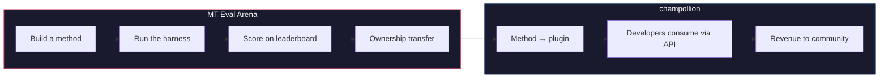

# MT Eval Arena

> **핵심 요약.** MT Eval Arena는 기계 번역 방법을 위한 공개 벤치마킹 플랫폼으로, 상용 MT가 존재하지 않거나 독립적으로 검증되지 않은 언어에 중점을 둡니다. 표준화된 평가, 공개 리더보드, 그리고 champollion을 통한 프로덕션 배포 다리를 제공해요. 원주민 언어의 경우, 검증된 방법은 그 소유권이 커뮤니티로 이전돼요.

기계 번역 방법을 위한 공개 검증의 장 — 특히 상용 MT가 존재하지 않거나 독립적으로 검증되지 않은 언어를 위한 곳이에요.

방법을 만들어 보세요. 벤치마크하세요. 작동함을 증명하세요. 우승하면 배포돼요.

---

## 문제점

Google Translate는 약 130개 언어를 지원해요. Meta의 NLLB-200은 약 200개를 다루며, OMT-1600(2026년 3월)은 1,600개를 다룬다고 주장해요. 지구상에는 7,000개가 넘는 언어가 사용되고 있어요. OMT-1600의 가장 낮은 리소스 등급에 속하는 약 1,300개 언어의 경우, 모델 가중치를 사용할 수 없고, 품질은 사용 가능한 기준에 미치지 못하며, 평가는 표준 기계 메트릭과 함께 성경 도메인 텍스트를 사용했어요 — 형태론적 검증도, 독립적 테스트도, 커뮤니티 거버넌스도 없었어요. 나머지 약 5,400개 언어의 경우, 어떤 사전 학습된 모델도 출력을 전혀 생성하지 못해요.

빅테크는 이제 LRL 커버리지에 투자하고 있어요 — 하지만 독립적인 품질 검증, 형태론적 검증, 또는 커뮤니티 거버넌스가 없는 커버리지는 신뢰가 없는 커버리지예요. 번역 도구가 가장 필요한 사용자들은, 정작 그 도구가 만들어질 가능성이 가장 낮은 커뮤니티이기도 해요.

**Arena는 이를 바꾸기 위해 존재해요.** 어떤 언어든 번역 방법을 개발하고, 평가하고, 배포할 수 있는 인프라를 제공해요 — 재현 가능한 채점, 공개 제출, 그리고 결과를 누가 통제할지에 대한 커뮤니티 거버넌스와 함께요.

---

## 작동 방식

1. **번역 방법을 만들어요** — 코칭된 LLM, 파인튜닝된 모델, FST 게이트 파이프라인, 또는 번역을 생성하는 그 밖의 어떤 것이든 가능해요.
2. **하네스가 벤치마크해요** — 표준화된 메트릭(chrF++, exact match, FST acceptance)을 사용하며, 특정 Git 커밋에 지문이 남겨져요.
3. **결과가 리더보드에 표시돼요** — 모든 제출은 재현 가능하고 비교 가능해요.
4. **우승하면 소유권이 이전돼요** — 원주민 언어의 경우, 우승한 방법의 코드가 커뮤니티 거버넌스 조직으로 이전돼요.
5. **방법이 프로덕션에 배포돼요** — 개발자용 API인 [champollion](https://champollion.dev)을 통해서요. 수익은 커뮤니티로 다시 흘러가요.

**여기서 증명하세요. 거기서 배포하세요.**

---

## 누구를 위한 것인가

| 당신은... | Arena가 제공하는 것... |
|---|---|
| **ML 엔지니어 / 연구자** | 표준화된 벤치마크, 재현 가능한 채점, 경쟁할 수 있는 리더보드 |
| **언어학자** | 문법 규칙과 사전을 테스트 가능한 방법으로 전환하는 프레임워크 |
| **언어 커뮤니티 구성원** | 당신 언어의 방법이 어떻게 개발되고 배포되는지에 대한 거버넌스 |
| **펀더 / 보조금 심사자** | 번역 연구 제안을 평가하기 위한 투명하고 재현 가능한 메트릭 |
| **학생** | 실질적인 영향력을 지닌 공개 챌린지 — 방법을 만들고, 점수를 제출하세요 |

---

## 현재 벤치마크

### EDTeKLA Development Set v1
- **언어 쌍:** English → Plains Cree (SRO)
- **항목:** 큐레이션된 548개 쌍 (교과서 486개 + 골드 스탠다드 62개)
- **라이선스:** CC BY-NC-SA 4.0
- **출처:** [EdTeKLA research group](https://spaces.facsci.ualberta.ca/edtekla/), University of Alberta

### FLORES+ Devtest
- **언어 쌍:** English → 39개 언어
- **항목:** 언어당 1,012개 문장
- **라이선스:** CC BY-SA 4.0
- **출처:** [OLDI](https://huggingface.co/datasets/openlanguagedata/flores_plus)

---

## 단 하나의 규칙

:::danger 평가 데이터로 학습하지 마세요
벤치마크 데이터셋에 노출된 방법 — 학습 데이터, few-shot 예제, 사전 항목, 또는 프롬프트 자료로서 — 은 **실격 처리**돼요. 원하는 것으로 파인튜닝하세요. 단, 테스트 세트로는 안 돼요.
:::

---

## 다음 단계

- **[방법 제출하기](/docs/getting-started/submit-a-method)** — 첫 벤치마크 실행을 제출하는 방법
- **[벤치마크 명세](/docs/specifications/benchmark)** — 전체 실험 프로토콜
- **[리더보드 규칙](/docs/leaderboard/rules)** — 제출 기준 및 게이밍 방지 정책
- **[데이터 주권](/docs/sovereignty/data-sovereignty)** — OCAP, CARE, 그리고 소유권 이전이 중요한 이유
- **[경제 모델](/docs/sovereignty/economic-model)** — Arena 점수가 커뮤니티 수익이 되는 방식

**[→ 리더보드 보기](https://champollion.dev/leaderboard)**