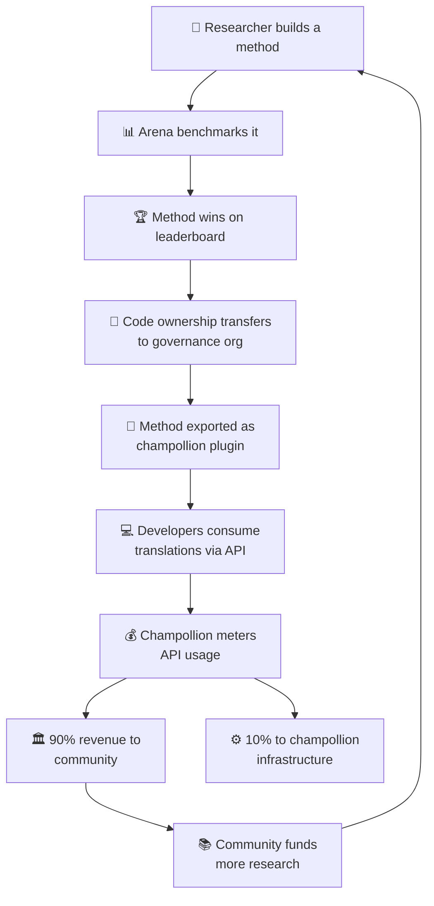

# 경제 모델

> **핵심 요약.** 이 페이지에서는 Arena와 champollion을 연결하는 경제 순환 구조를 설명해요. 연구가 방법론을 만들어내고, 방법론은 플러그인으로 배포되며, API 사용이 수익을 창출하고, 수익의 90%가 언어 커뮤니티로 흘러가요. 플라이휠 메커니즘, 수익 분배, 편의 계층, 그리고 자금 제공자를 위한 지속 가능성 논거를 다뤄요.

Arena와 champollion은 닫힌 경제 순환 구조를 이뤄요. Arena에서의 연구가 방법론을 만들어내요. 방법론은 champollion을 통해 배포돼요. champollion에서 발생한 수익은 해당 방법론이 지원하는 언어를 사용하는 커뮤니티로 다시 흘러가요.

---

## 플라이휠

플라이휠이 한 바퀴 돌 때마다 생태계가 강화돼요:
- **더 많은 연구**가 더 나은 방법론을 만들어내요
- **더 나은 방법론**이 더 많은 개발자를 끌어들여요
- **더 많은 개발자**가 더 많은 API 수익을 창출해요
- **더 많은 수익**이 커뮤니티 주도 연구에 더 많은 자금을 지원해요

---

## 수익이 흐르는 방식

개발자가 champollion API를 통해 커뮤니티 소유 방법론을 사용할 때:

| 단계 | 일어나는 일 |
|---|---|
| 개발자가 `champollion sync` 또는 REST API를 호출 | 커뮤니티 소유 방법론으로 번역이 생성돼요 |
| Champollion이 API 호출을 계측 | 요청별, 언어 쌍별로 사용량이 추적돼요 |
| 수익이 분배됨 | **90%**는 해당 방법론을 소유한 거버넌스 조직에게 가요. **10%**는 champollion 인프라 비용을 충당해요. |
| 커뮤니티가 배분을 결정 | 수익은 언어 프로그램, 추가 연구, 커뮤니티 자원 등 거버넌스 조직이 결정하는 곳에 자금을 지원해요 |

### 편의 계층

Champollion은 일반적인 방법론을 위한 최적화된 구성도 제공해요. 어떤 연구자가 특정 코칭 데이터와 temperature 설정을 적용한 Gemini 2.5 Pro가 특정 언어 쌍에 대해 최상의 결과를 낸다는 것을 입증하면, 그 구성은 champollion API를 통해 사전 구축된 프리셋으로 제공돼요. 개발자는 그 연구를 재현할 필요가 없어요 — 그저 API를 호출하면 돼요.

Arena는 기준선을 확립해요. Champollion은 그 기준선을 접근 가능하게 만들어요. 커뮤니티는 양쪽 모두에서 혜택을 얻어요.

---

## 표준 언어의 경우

플라이휠은 소유권 이전과 커뮤니티 수익 모델이 적용되는 원주민 언어 및 저자원 언어에서 가장 큰 영향력을 발휘해요.

표준 언어(프랑스어, 일본어, 스페인어 등)의 경우, champollion은 거버넌스 계층 없이 동일한 API 편의성을 제공해요 — 개발자는 사전 구성된 번역 방법론에 대한 계측 기반 접근에 비용을 지불하고, champollion은 인프라 비용을 가져가요.

---

## 자금 제공자를 위해

이 경제 모델은 언어 기술 자금 지원에서 흔히 제기되는 우려, 즉 **보조금 종료 후의 지속 가능성**을 해결해요.

| 전통적 모델 | Arena 모델 |
|---|---|
| 보조금이 연구에 자금 지원 | 보조금이 연구에 자금 지원 |
| 논문 발표 | 방법론이 프로덕션에 배포 |
| 보조금 종료, 도구 방치 | API 수익이 운영을 지속 |
| 커뮤니티는 아무것도 받지 못함 | 커뮤니티가 자산을 소유하고 수익을 얻음 |

성공적인 방법론 하나가 자급자족하는 수익 흐름을 만들어내요. 자금 제공자는 영향력을 논문 발표뿐만 아니라 다음과 같은 측면에서도 측정할 수 있어요:
- API 사용량 (얼마나 많은 개발자가 그 방법론을 사용하는지)
- 창출된 수익 (얼마나 많은 자금이 커뮤니티로 흘러가는지)
- 품질 지표 (시간 경과에 따른 리더보드 점수)
- 언어 커버리지 (얼마나 많은 언어 쌍이 지원되는지)

자세한 비용 모델은 [벤치마크 명세](/docs/specifications/benchmark) §10을 참고하세요.

---

## 참고

- [소유권 이전](/docs/sovereignty/ownership-transfer) — 법적·기술적 이전 절차
- [데이터 주권](/docs/sovereignty/data-sovereignty) — OCAP, CARE, Te Mana Raraunga 원칙
- [리더보드 규칙](/docs/leaderboard/rules) — 방법론이 배포 자격을 얻는 방식